### （一）2ASK 调制解调实验

#### a. ASK 调制实验。

**① 观测记录调制输入和调制输出信号的波形。**
示波器探头 CH1 接 9 号模块的 TH1（基带信号），CH2 接 9 号模块 TH4（调制输出），以 9 号模块的 TH1 为触发，用示波器同时观测 9 号模块 TH1 和 TH4，验证 ASK 调制原理。（3 分）

**② 将 PN 序列输出频率改为 64KHz 和 128KHz（按功能 1，进入菜单改），观察载波个数是否发生变化情况。记录波形并分析载波个数变化的情况。（6 分）**

*   **PN 序列输出频率改为 64KHz 时的波形：**
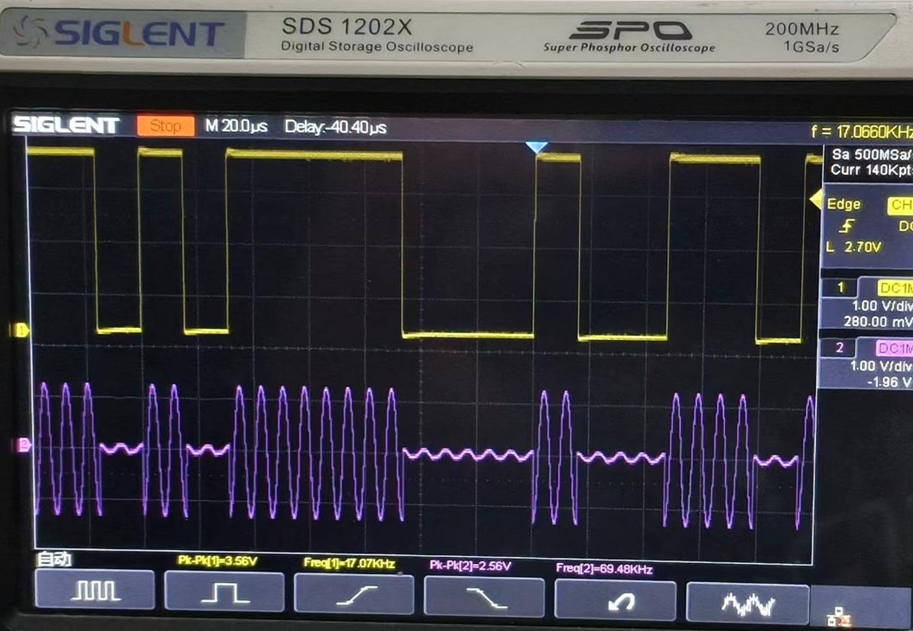

*   **PN 序列输出频率改为 128KHz 时的波形：**
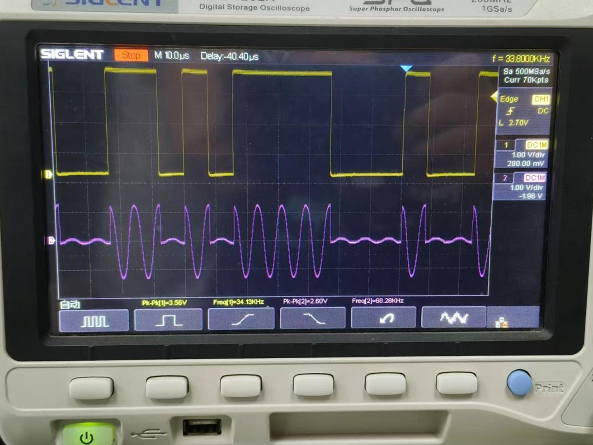

**分析 PN 序列输出频率发生变化时，载波个数的变化情况，为什么？（4 分）**

**答：**

1.  **载波个数的变化情况**
    随着 PN 序列输出频率的增加，单个码元（高电平持续时间内）所包含的载波波形个数呈倍数减少。具体观测结果如下：
    *   当 PN 序列频率为 32KHz 时：一个码元内包含 4 个完整的载波周期。
    *   当 PN 序列频率为 64KHz 时：一个码元内包含 2 个完整的载波周期。
    *   当 PN 序列频率为 128KHz 时：一个码元内包含 1 个完整的载波周期。

2.  **原因分析**
    *   **载波频率固定不变：** 本实验中，载波信号的频率固定为 128KHz，这意味着载波波形的宽度（周期）是恒定的，不随基带信号的变化而改变。
    *   **码元宽度随频率改变：** PN 序列的频率代表了基带信号传输的速率。频率越高，每个码元持续的时间（即码元宽度）就越短。
        *   32KHz 对应的码元时间最长，是 64KHz 的两倍，是 128KHz 的四倍。
    *   **数量关系计算：** 载波个数等于“载波频率”除以“PN 序列频率”。
        *   在 32KHz 时：$128000 / 32000 = 4$ 个。
        *   在 64KHz 时：$128000 / 64000 = 2$ 个。
        *   在 128KHz 时：$128000 / 128000 = 1$ 个。
    *   **综上所述：** 由于载波周期不变，而容纳载波的码元宽度随着 PN 序列频率的倍增而减半，因此其中的载波个数也相应减半。

#### b. ASK 解调实验。
对比观测记录调制信号输入以及解调输出的波形。示波器探头 CH1 接 9 号模块 TH1（基带信号），CH2 接 TH6（ASK 解调输出），调节 W1（判决门限调节）直至二者波形相同，记录 TH1 与 TH6 的波形关系。再观测 TP4（整流输出）、TP5（LPF-ASK）两个中间过程测试点，分别记录 TH1 与 TP4、TP4 与 TP5、TP5 与 TH6 的关系波形，验证 ASK 解调原理。（8 分）

*   **记录 TH1 与 TH6 的波形：**
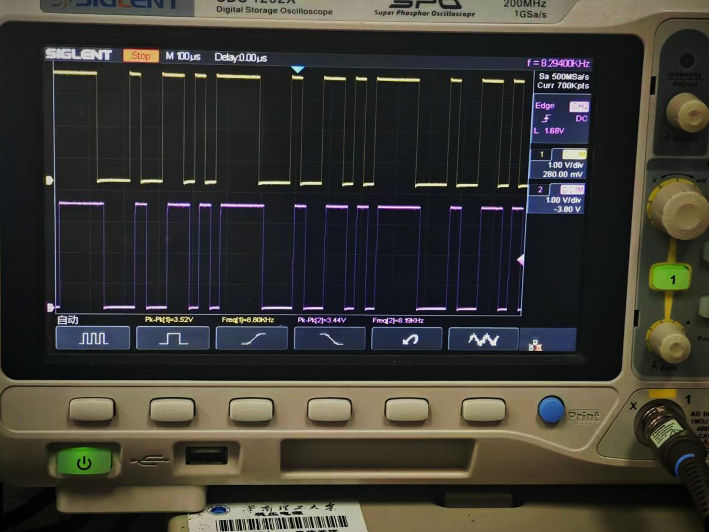

*   **记录 TH1 与 TP4 的波形：**
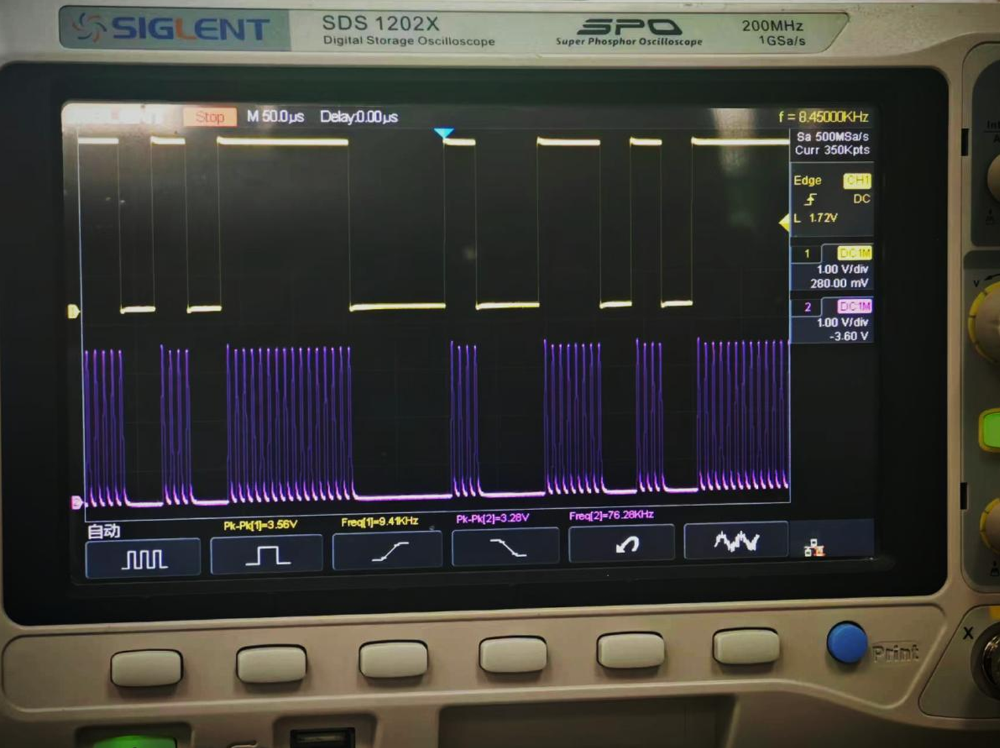

*   **记录 TP4 与 TP5 的波形：**
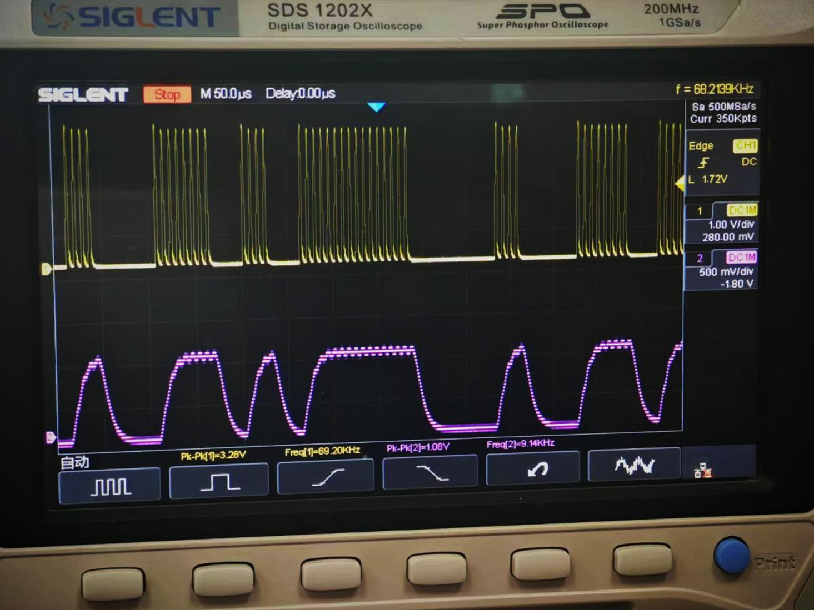

*   **记录 TP5 与 TH6 的波形：**
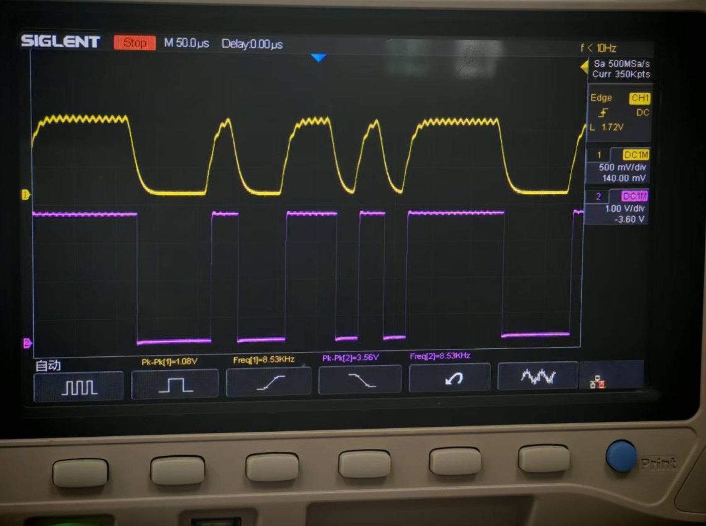

#### c. 观测眼图。
示波器探头 CH1 接信号源的 CLK，CH2 接 9 号模块的 LPF-ASK，以 CH1 为触发源，观测和记录眼图。（3 分）

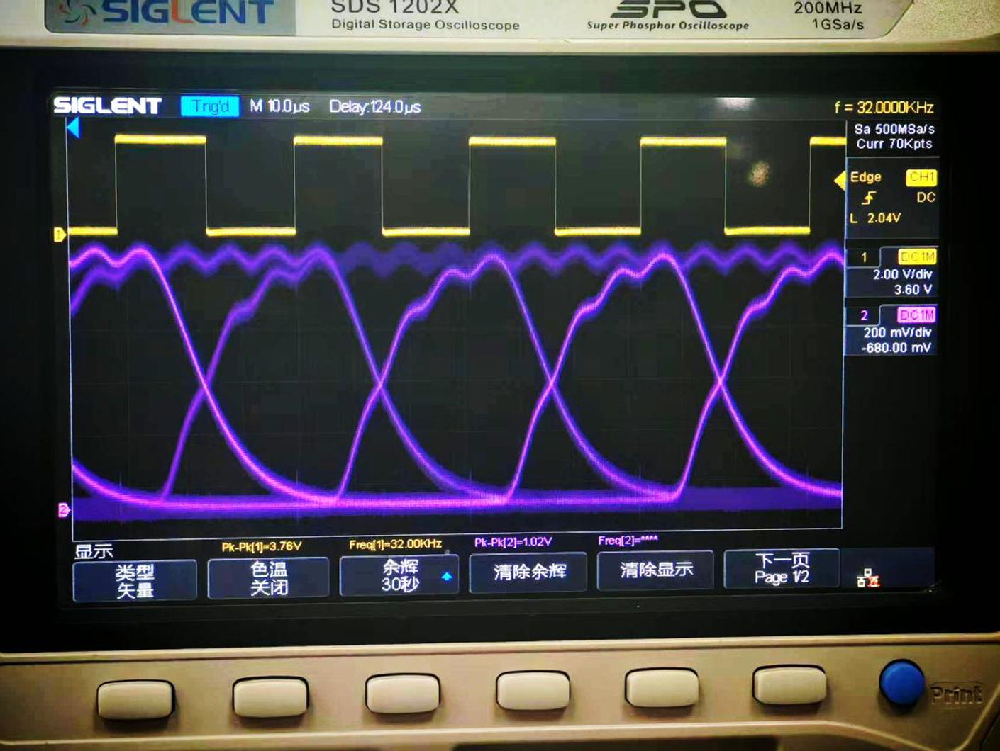

---

### （二）2FSK 调制解调实验

#### a. FSK 调制实验。
**①** 示波器 CH1 接 9 号模块 TH1（基带信号），CH2 接 9 号模块 TH4（调制输出）调制输出，以 CH1 为触发对比观测 FSK 调制输入及输出，验证 FSK 调制原理。（3 分）

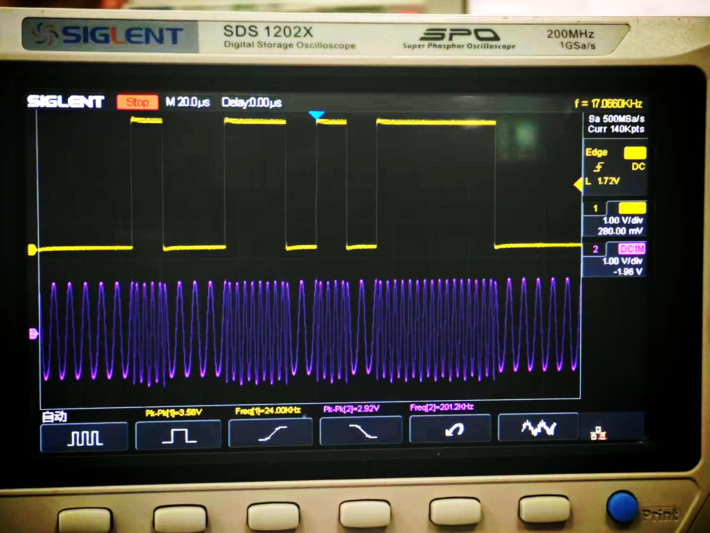

#### b. FSK 解调实验。
**①** 对比观测调制信号输入以及解调输出。示波器探头 CH1 接 9 号模块 TH1（基带信号），CH2 接 TP6（单稳相加输出）记录 TH1 与 TP6 的关系波形。示波器探头 CH1 接 9 号模块 TP6（单稳相加输出），CH2 接 TP7（LPF-FSK）记录 TP6 与 TP7 的关系波形。示波器探头 CH1 接 9 号模块 TP7（LPF-FSK），CH2 接 TH8（FSK 解调输出）记录 TP7 与 TH8 的关系波形，验证 FSK 解调原理。（8 分）

*   **TH1 与 TP6 的波形：**
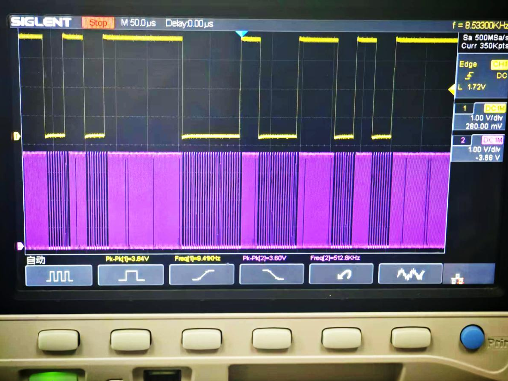

*   **记录 TP6 与 TP7 的波形：**
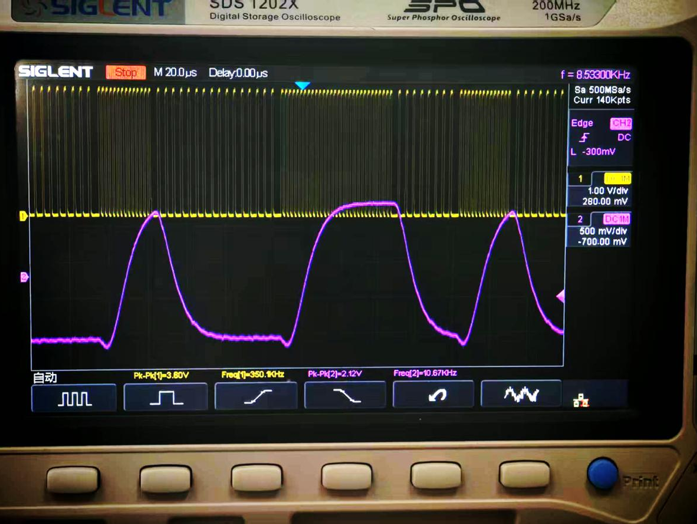

*   **记录 TP7 与 TH8 的波形：**
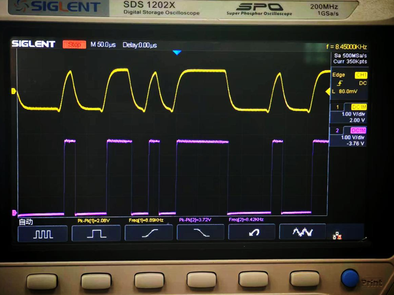

*   **记录 TH1 与 TH8 的波形：**
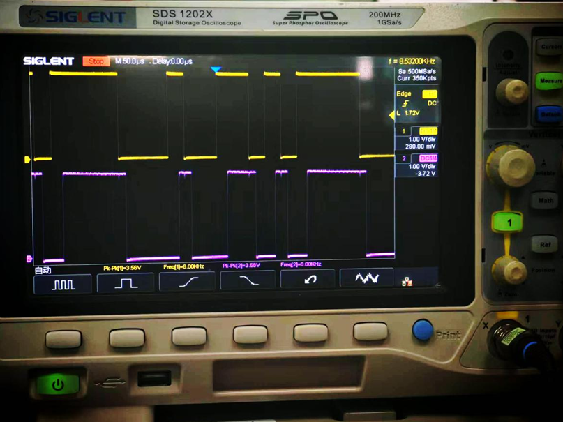

**c. 观测眼图。**
示波器探头 CH1 接信号源的 CLK，CH2 接 9 号模块的 LPF-FSK，以 CH1 为触发源，观测和记录眼图。（3 分）

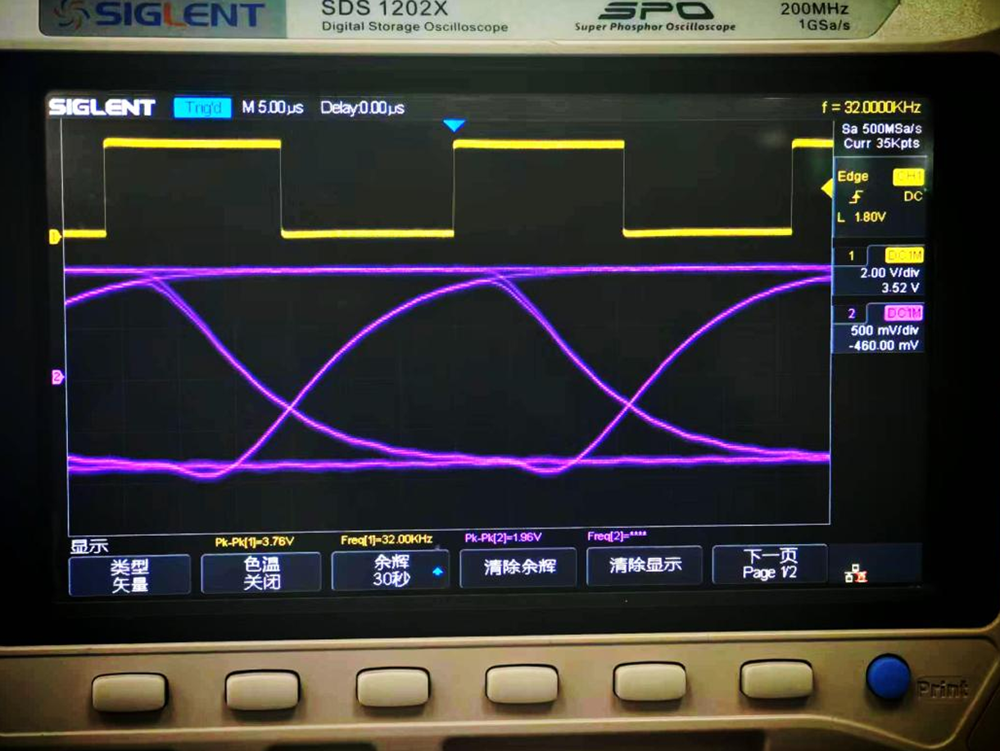

---

### （三）2DPSK 调制解调实验

#### a. DPSK 调制信号实验。
**①** 示波器探头 CH1 接 9 号模块的 TP2（NRZ-I），示波器探头 CH1 接 9 号模块的 TP9（NRZ-Q），观察并记录两者的波形关系。（3 分）

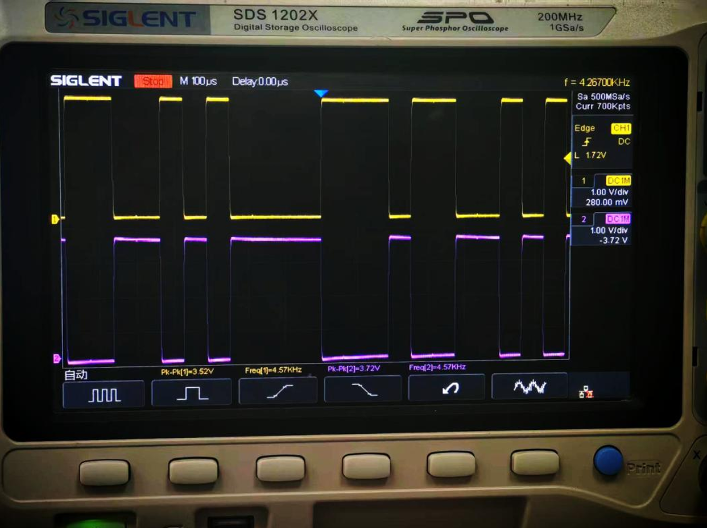

**④** 示波器探头 CH1 接 9 号模块的 TH1（基带信号），CH2 接 9 号模块的 TH4（调制输出），以 CH1 为触发源，观察并记录波形。（3 分）

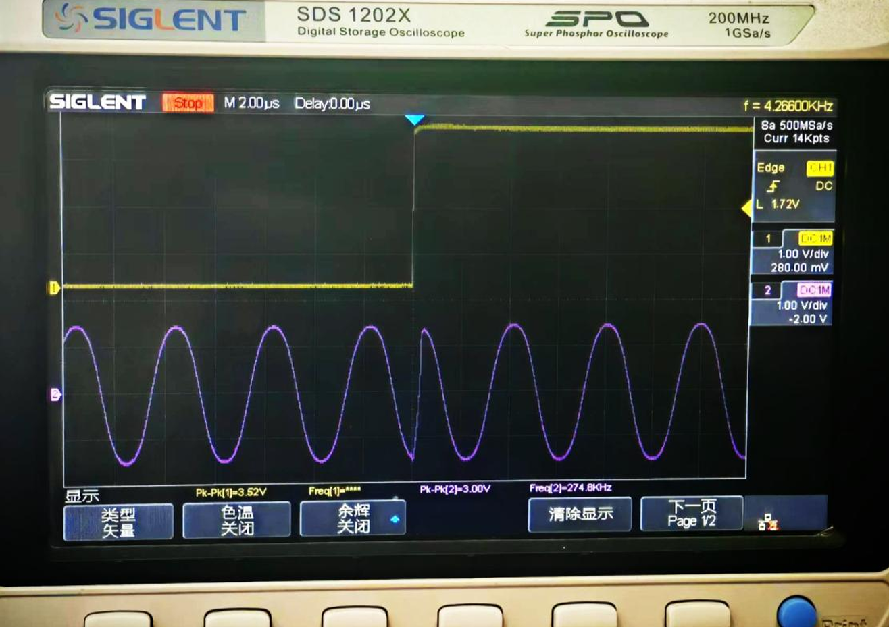

#### b. DBPSK 差分信号观测。
将 9 号模块的 S1 拨为“0100”，示波器探头 CH1 接 9 号模块的 TH1（基带信号），CH2 接 9 号模块的“NRZ-I”，记录两者波形并分析差分编码规则。（3 分）

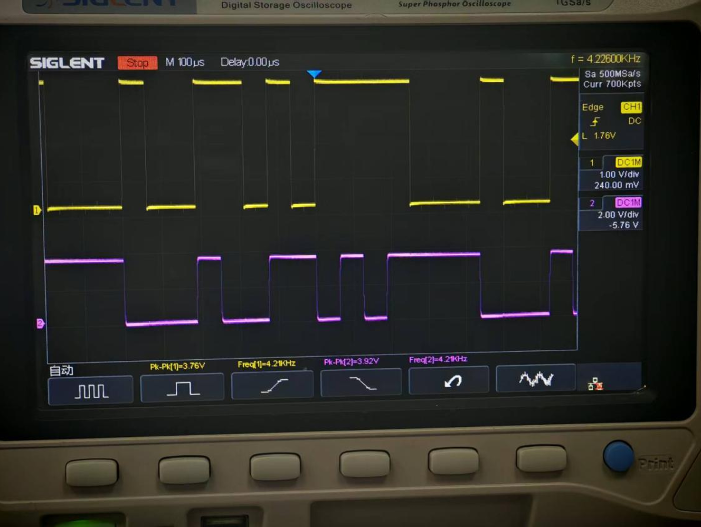

**分析差分编码规则：（3 分）**

**答：**

1.  **编码逻辑（相对性原则）**
    差分编码是将绝对码（原始信息）转换为相对码的过程，其核心规则不依赖于信号的绝对电平，而依赖于前后码元的电平是否发生跳变。通常采用“1 变 0 不变”的规则：
    *   当输入信息位为 **0** 时：当前输出的差分码电平与前一位差分码电平保持一致（相位不变）。
    *   当输入信息位为 **1** 时：当前输出的差分码电平与前一位差分码电平相反（相位翻转）。

2.  **逻辑运算关系：**
    在数字逻辑中，这种关系表现为模 2 加（异或）运算。
    设当前输入的绝对码为 $a_n$，前一时刻的相对码为 $b_{n-1}$，当前的相对码为 $b_n$，则编码规则为：
    $$b_n = a_n \oplus b_{n-1}$$

3.  **参考位的必要性：**
    由于当前状态取决于前一状态，差分编码序列必须有一个初始参考位（通常设为 0 或 1）作为起始基准，后续的每一个码元都是基于前一个码元的状态进行推导的。这种规则使得解调时可以通过比较前后相位的变化来恢复信息，从而消除了“相位模糊”现象。

#### c. DPSK 解调信号实验。
**①** 示波器探头 CH1 接 9 号模块的 TH1（基带信号），CH2 接 13 号模块的“SIN”，以 CH1 为触发，观测 13 号模块的“SIN”，调节 13 号模块的 W1 使“SIN”的波形稳定，即恢复出载波，记录波形。（3 分）

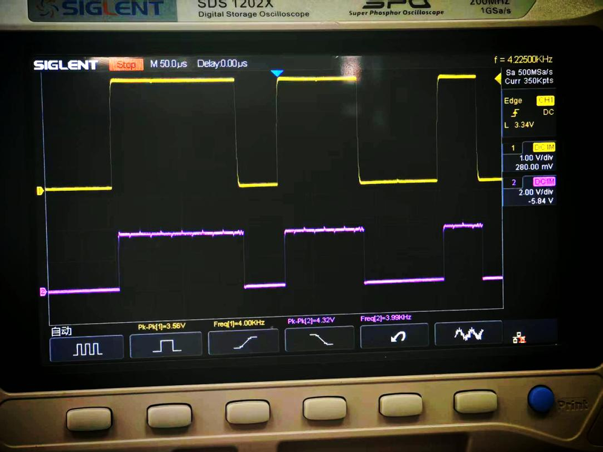

**分析当多次单击 13 号模块的 S5（复位）按键时，“DBPSK 解调输出”和基带信号的波形关系，与“BPSK 解调输出”和基带信号的波形关系有什么不同，为什么？（5 分）**

**答：**

1.  **波形关系的差异**
    *   **BPSK 解调输出：**
        当多次按下复位键时，BPSK 解调输出的波形出现随机倒相现象。即有时解调波形与基带信号极性相同（完全一致），有时解调波形与基带信号极性相反（完全倒置）。这种关系是不确定的。
    *   **DBPSK 解调输出：**
        无论按多少次复位键，DBPSK 解调输出的波形始终保持稳定，与基带信号的极性和逻辑始终保持一致，不会出现倒相现象。

2.  **原因分析**
    *   **BPSK 存在相位模糊（π 相位模糊）：**
        BPSK 采用相干解调，接收端需要从信号中恢复出本地载波。由于载波提取电路存在二义性，恢复出来的载波相位可能锁定在 0 度状态，也可能锁定在 180 度（π）状态。
        *   若锁定在 0 度，解调输出正确；
        *   若锁定在 180 度，解调出的电压极性完全相反（1 变 0，0 变 1）。
        每次复位都会强制载波恢复电路重新锁定，因此会出现随机的“倒相”现象。
    *   **DBPSK 消除了相位模糊：**
        DBPSK（2DPSK）虽然在解调过程中也可能遇到载波相位模糊的问题，但其通过差分译码机制解决了这一问题。DBPSK 利用的是前后码元的相位变化（相对相位）来传递信息，而不是绝对相位。
        即使载波发生了 180 度的倒相，前后码元的相对相位差（跳变或不跳变）保持不变。因此，差分译码后的最终输出能够消除绝对相位不确定性的影响，始终能正确恢复出原始基带信号。

#### d. 观测眼图。
示波器探头 CH1 接信号源的 CLK，CH2 接 9 号模块的 LPF-BPSK，以 CH1 为触发源，观测和记录眼图。（3 分）

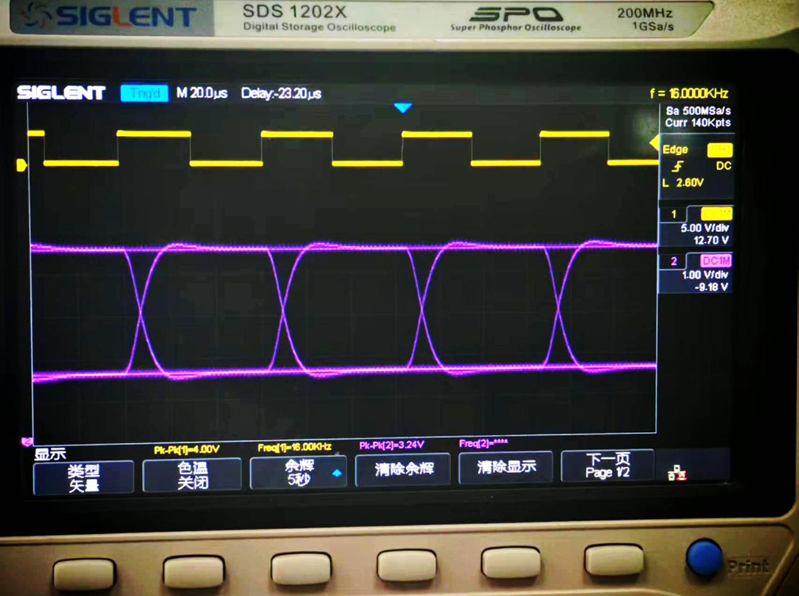

**比较分析 ASK、FSK 和 BPSK 三种调制方式下的眼图：（4 分）**

**答：**

1.  **抗噪声性能比较（眼图张开程度）**
    通过观察和对比三种调制方式的眼图，抗噪声性能的排序为：**BPSK > FSK > ASK**。
    *   **BPSK 的眼图：** 通常“眼睛”张开得最大、最清晰。因为 BPSK 是双极性信号（+1 和 -1），其判决门限距离最大，对噪声的容忍度最高，因此眼图最为规整。
    *   **FSK 的眼图：** 优于 ASK，但通常略逊于 BPSK。它是恒包络调制，信息蕴含在频率变化中，幅度噪声对其影响较小。
    *   **ASK 的眼图：** 通常表现最差，“眼睛”张开程度最小，且容易模糊。

2.  **噪声影响的具体分析**
    *   **ASK（幅移键控）：** ASK 利用幅度的变化来传递信息。信道中的加性噪声直接叠加在信号幅度上，直接导致眼图的“上眼睑”和“下眼睑”变厚，垂直张开度迅速减小。因此，ASK 的眼图最容易受到噪声干扰而“闭合”，抗噪性能最差。
    *   **FSK 和 BPSK：** 这两种属于恒包络调制，信息分别包含在频率和相位中，而不依赖幅度。因此，即使信道中存在幅度噪声，对解调后的眼图影响也相对较小（尤其是经过限幅器后）。
    *   **BPSK 的优势：** BPSK 采用相干解调，且信号在星座图上也是距离最远的（反相），因此在相同的信噪比下，BPSK 的误码率最低，反应在眼图上就是迹线最清晰，过零点最收敛。