### （一）AMI 编译码实验内容

#### 1、AMI 编译码规则验证（归零码）

**a. 观察验证 AMI 编码规则，记录 M03 模块的 TH16 （编码输入数据）和 TH19(AMI 输出)。**
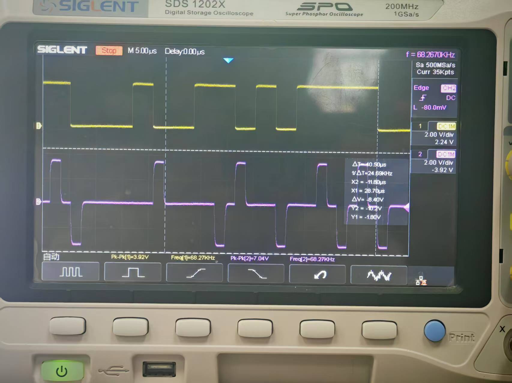

**b. 观察 AMI 译码波形与输入信号波形的关系，记录 M03 模块的 TH16 （编码输入数据）和 TH26 （译码输出数据）。**
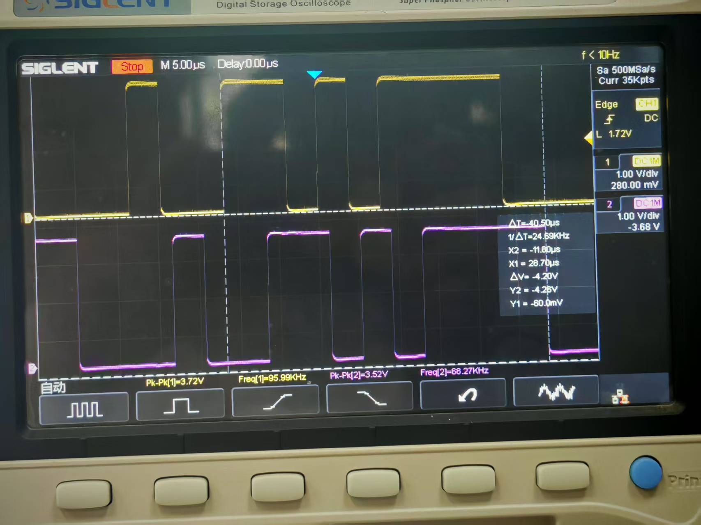

**分析题：分析 AMI 译码信号波形与输入信号波形的关系，译码信号与输入信号相比延时多少？**
> **答：** 译码信号与输入信号相比延时约一个码元周期。

**c. 观察比较恢复出的位时钟波形与原始位时钟信号的波形，记录 M03 模块的 TH17（编码输入-时钟）和 TH27（译码输出-时钟）的波形。**
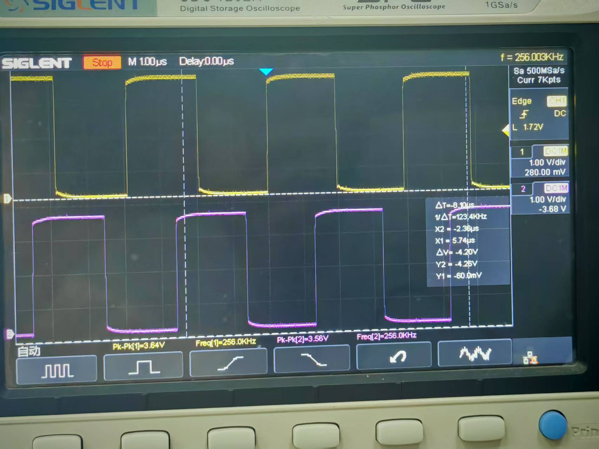

---

#### 2、AMI 编译码规则验证（非归零码）

**a. 观察验证 AMI 编码规则，记录 M03 模块的 TH16 （编码输入数据）和 TH19(AMI 输出)。**
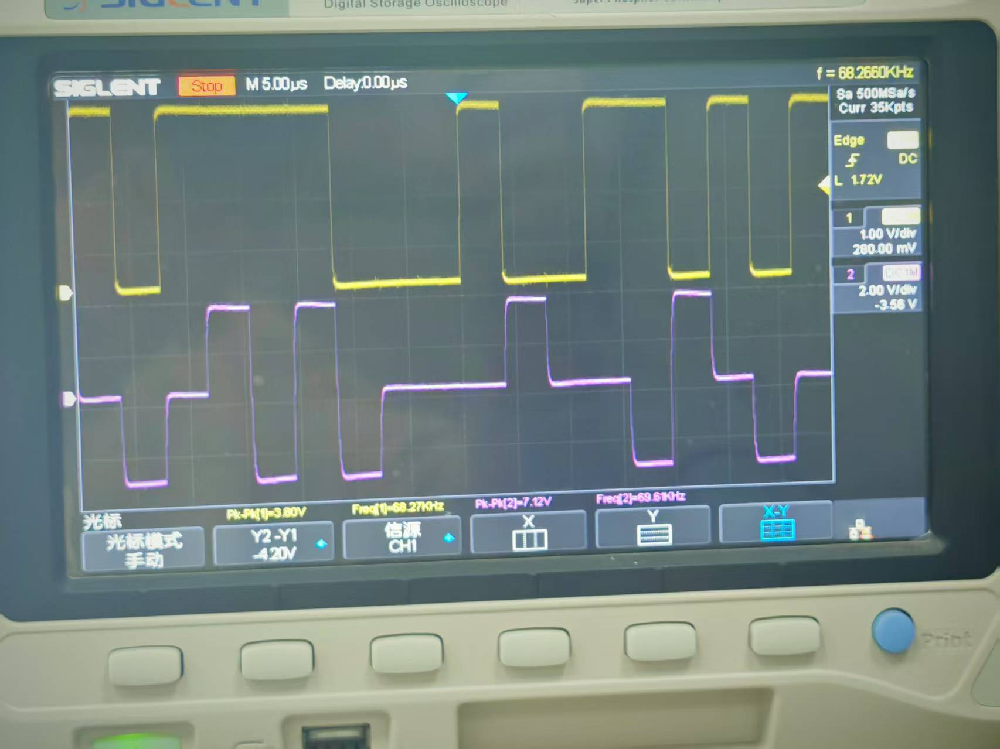

**b. 观察 AMI 译码波形与输入信号波形的关系，记录 M03 模块的 TH16 （编码输入数据）和 TH26 （译码输出数据）。**
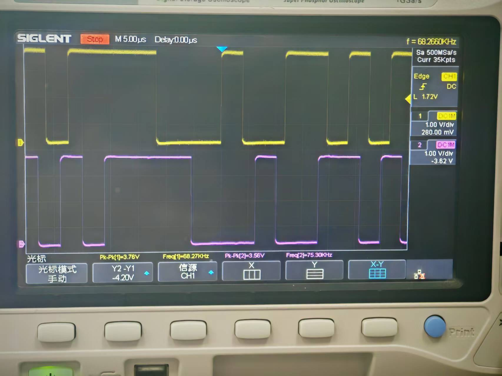

**c. 观察比较恢复出的位时钟波形与原始位时钟信号的波形，记录 M03 模块的 TH17（编码输入-时钟）和 TH27（译码输出-时钟）的波形。**
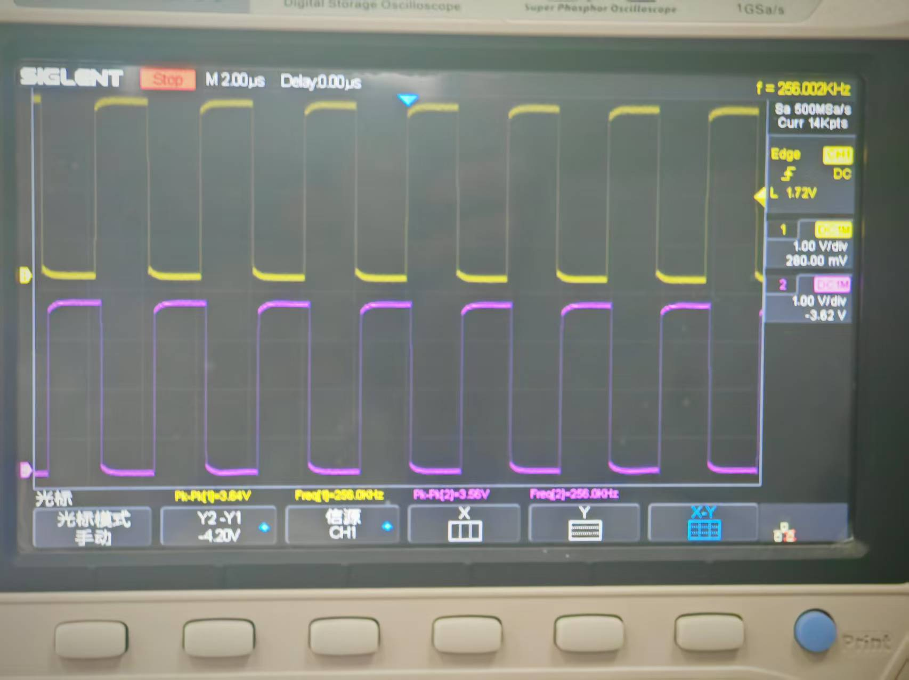

---

#### 3、AMI 码对连 0 信号的编码、直流分量以及时钟信号提取观测

**a. 观察含有长连 0 信号的 AMI 编码波形。用示波器观测模块 M03 的 TH16 (编码输入-数据) 和 TH19 (AMI 编码输出)，观察信号中出现长连 0 时的波形变化情况。记录波形。**
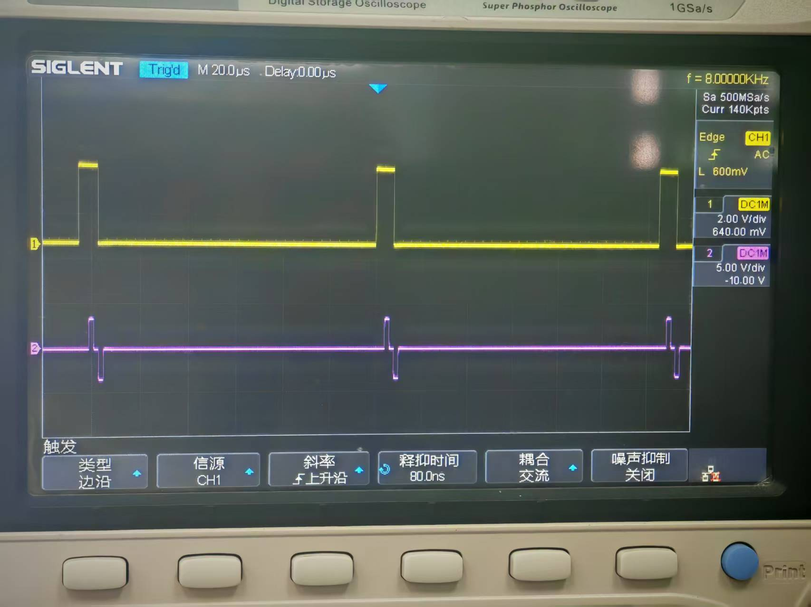

**b. 观察 AMI 编码信号中是否含有直流分量。**
将 2 号模块的 S1、S2、S3、S4 拨为 `00000000 00000000 00000000 00000011`，用示波器分别观测编码输入数据和编码输出数据，调节示波器，将示波器上信号耦合状况置为交流，观察记录波形。保持连线，拨码开关由 0 到 1 逐位拨起，直到 2 号模块的 S1、S2、S3、S4 拨为 `00111111 11111111 11111111 11111111`。观察、分析和总结拨码过程中编码输入数据和编码输出数据波形的变化情况。

> **答：**
>
> **1. 观察现象：**
> 在拨码开关由稀疏的“1”（如 00...0011）逐渐拨至全“1”的过程中，观察到：
> *   **输入数据（CH1 黄色）：** 波形中高电平脉冲的占比逐渐增大，低电平空闲时间逐渐减少。当开关全拨为“1”时，波形变为连续的高电平。
> *   **输出数据（CH2 紫色）：** AMI 信号的脉冲密度紧随输入数据同步增加。无论脉冲密度如何变化，输出波形始终保持“正、负、正、负……”的电平交替规律；在输入为“0”的时刻，输出保持在零电平。
>
> **2. 分析：**
> *   拨码开关控制的是基带信号发生器的信源模式，增加“1”的拨码数量即增加了数据流中逻辑“1”的出现概率。
> *   根据 AMI（信号交替反转码）的编码规则：逻辑“0”编码为 0V，逻辑“1”交替编码为 +V 和 -V。因此，随着输入信号中“1”的增多，输出信号不仅脉冲变密，且为了符合编码规则，每一个新增的脉冲都相对于前一个脉冲进行了极性翻转。
>
> **3. 总结：**
> *   **波形对应关系：** 编码输出波形的有无严格对应输入数据的“1”和“0”，且随着数据流密度的增加，波形占空比同步增大。
> *   **极性特性：** 无论数据流多么密集，AMI 码始终严格遵守正负交替反转的特性。
> *   **直流分量结论：** 观察发现，AMI 信号中的正脉冲和负脉冲在数量上始终保持平衡，相互抵消。这证明了 AMI 编码信号不含有直流分量，该特性使其非常适合通过交流耦合电路进行长距离传输。

**思考题：** 在实验过程中要求示波器选择交流耦合方式，我们观察到输入信号（模块 M03 的 TH16）随着拨码开关的设置在示波器上显示波形会出现上下偏移的现象，而 AMI 编码输出信号始终没有偏移。请解释此现象。

> **答：**
> 该现象产生的原因是输入信号含有随数据变化的直流分量，而 AMI 输出信号不含直流分量。
>
> 1.  **输入信号**为单极性码，其直流平均电压取决于码流中“1”的密度。当拨码开关改变时，“1”的密度改变，导致信号的直流分量改变。在交流耦合模式下，示波器会滤除直流分量，导致波形在垂直方向上发生位移，以维持显示波形的平均电平为零。
> 2.  **AMI 信号**通过正负电平交替翻转来表示逻辑“1”，这种独特的编码规则使得正负脉冲相互抵消。无论数据流密度如何，AMI 信号的直流分量始终保持为零。因此，在交流耦合下，其波形基准线始终稳定在零电位，不会发生偏移。

---

### （二）HDB3 编译码实验

**a. 观察验证 HDB3 编码规则，记录 M03 模块的 TH16 （编码输入数据）和 TH18 (HDB3 输出)。**

**① S1 设置为 10010001，S2 设置为 10001110，S3 设置为 10100111，S4 设置为 10011001，记录 M03 模块的 TH16 (编码输入数据) 和编码输出的数据 TH18 (HDB3 输出) 的波形。**
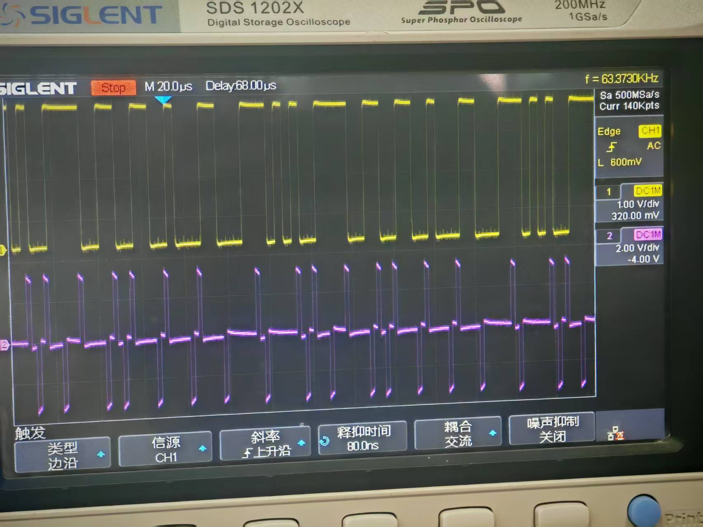

**② S1 设置为 11000000，S2 设置为 00000000，S3 设置为 00000000，S4 设置为 00000000，记录 M03 模块的 TH16 (编码输入数据) 和编码输出的数据 TH18 (HDB3 输出) 的波形。**
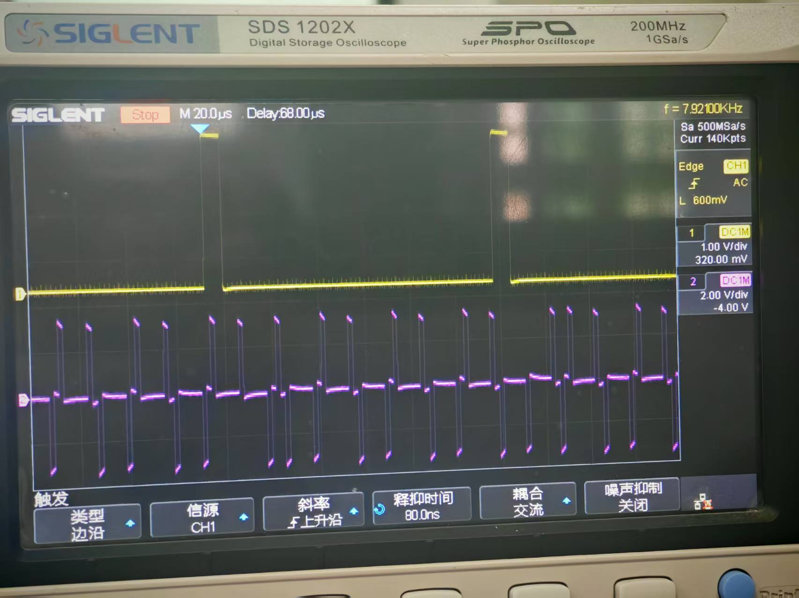

**③ S1 设置为 10000100，S2 设置为 00100001，S3 设置为 00001000，S4 设置为 01000010，记录 M03 模块的 TH16 (编码输入数据) 和编码输出的数据 TH18 (HDB3 输出) 的波形。**
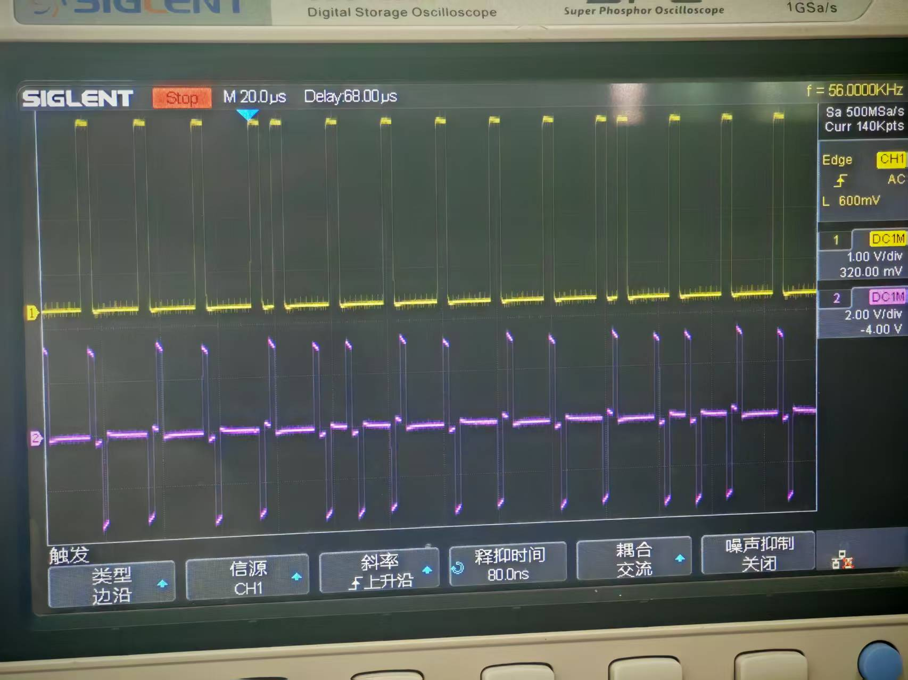

**④ S1 设置为 11110111，S2 设置为 01010001，S3 设置为 00000110，S4 设置为 10010100，记录 M03 模块的 TH16 (编码输入数据) 和编码输出的数据 TH18 (HDB3 输出) 的波形。**
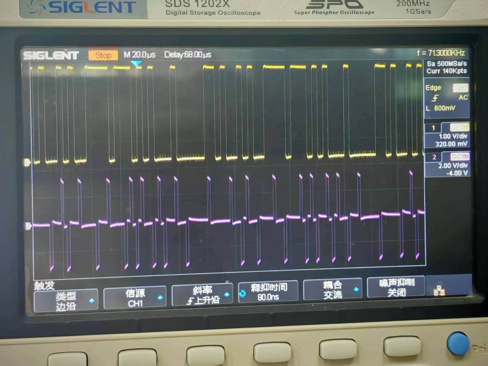

**分析题：通过观察以上四种不同设置情况下的 HDB3 编码输出情况，分析判断各种编码输出分别属于下面哪种情况：无四连零的情况、只有取代节 B00V 的情况、 只有取代节 000V 的情况和同时具有取代节 B00V 和 000V 的情况。**

> **答：**
> *   **①** S1 设置为 10010001，... S4 设置为 10011001 为 **无四连零的情况**。
> *   **②** S1 设置为 11000000，... S4 设置为 00000000 为 **只有取代节 B00V 的情况**。
> *   **③** S1 设置为 10000100，... S4 设置为 01000010 为 **只有取代节 000V 的情况**。
> *   **④** S1 设置为 11110111，... S4 设置为 10010100，为**只有取代节 000V的情况** .

**b. 观察 HDB3 译码波形与输入信号波形的关系，记录 M03 模块的 TH16 （编码输入数据）和 TH26 （译码输出数据）。**
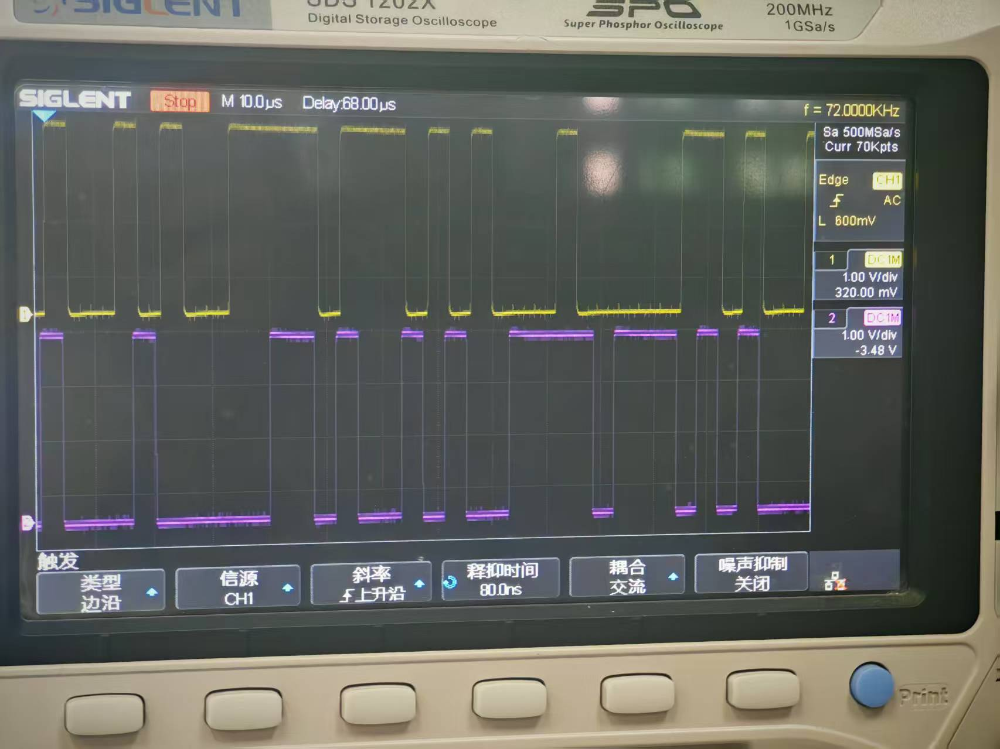

**分析题：分析 HDB3 译码信号波形与输入信号波形的关系，译码信号与输入信号相比延时多少？为什么会产生这些延时？**

> **答：** 延时约 13-14 个码元周期。
>
> HDB3 译码产生延时的主要原因是由 HDB3 码的编码规则和译码算法决定的：
> 1.  **破坏点检测机制：** HDB3 编码的核心是利用破坏点（V 脉冲）来替换连零序列（000V 或 B00V）。V 脉冲位于连零序列的第 4 位。
> 2.  **“预读”需求：** 译码器在接收到信号时，不能立即判断当前的脉冲是有效数据“1”还是破坏点“V”，也不能确定当前的低电平是真正的数据“0”还是取代节的一部分。
> 3.  **缓存与判断：** 为了正确识别破坏点，译码电路必须存储一定长度的接收码流（通常至少需要覆盖 4 个码元的窗口），通过检测当前脉冲极性与前一个脉冲极性是否相同（破坏双极性交替规则）来识别“V”脉冲。
> 4.  **回溯复原：** 一旦检测到 V 脉冲，电路需要“回溯”处理，将 V 脉冲及其前导的填充位（000 或 B00）还原为原始的四个“0”。这个缓存、检测、逻辑判断及还原的过程必然消耗时间，从而导致译码输出信号相对于输入信号存在数个码元周期的固定延时。另外，CPLD/FPGA 等逻辑器件内部的门电路处理也会引入微小的物理延时。

---

### （三）HDB3 线路编码通信系统综合实验

**1、实验现象观察和总结：实验调试成功后，您发现输入信号（2 号模块的 U2、U3 和 U4 显示的光条）与输出信号（2 号模块的 U5、U6 和 U7 显示的光条）是一种什么样的关系？**

> **答：** 输入信号（U2、U3、U4 显示的光条）与输出信号（U5、U6、U7 显示的光条）在逻辑上完全一致，即输出光条的变化与输入光条同步，但可能存在一定的传输延时。说明 HDB3 编译码系统能正确传输并恢复原始数据。

**2、思考题：实验中如果把 S1 和 S3 都设为 01110010 可能会出现什么现象？**

> **答：** 如果实验中把 S1 和 S3 都设为 01110010，由于 S1 通常用于设置帧同步码，而 S3 用于设置数据信号，这样的设置可能会导致帧同步码和数据信号混淆，从而使得解复用模块无法正确识别帧同步信号和数据信号，可能会导致解复用输出错误，无法正确恢复原始数据信号。