**实验数据记录、分析部分（74%）**

**（一）载波同步实验**
a. 示波器探头 CH1 接主控信号源模块的信号源“256KHz”，CH2 接 13 号模块的 TH1（SIN），调节 13 号模块的 W1（压控偏置调节）电位器，观测载波同步情况，记录同步和不同步时信号源“256KHz”与“SIN”的波形。

不同步情况下，信号源“256KHz”与“SIN”的波形：（2 分）
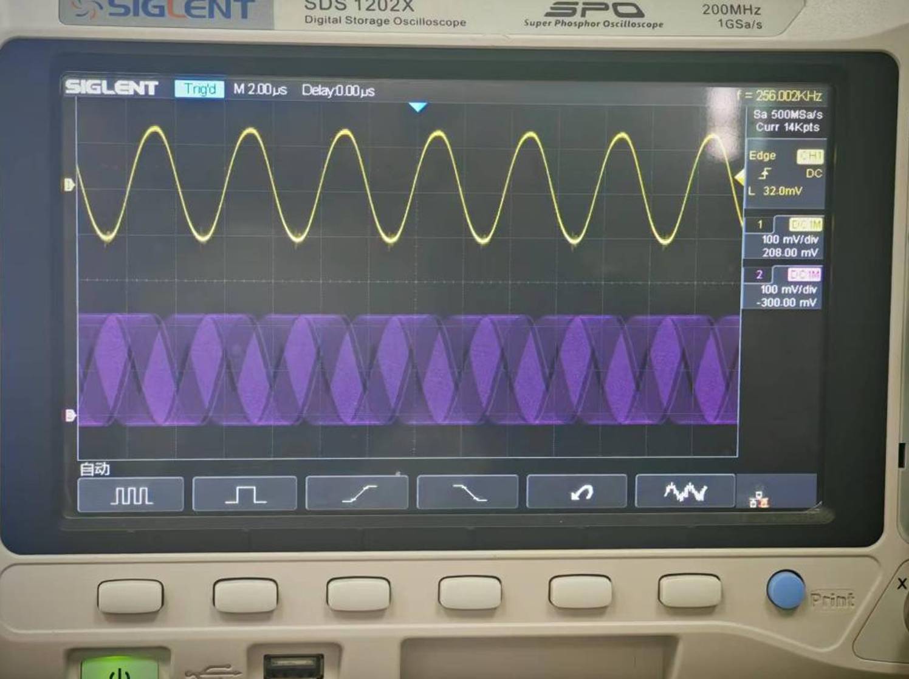

同步情况下，信号源“256KHz”与“SIN”的波形：（2 分）
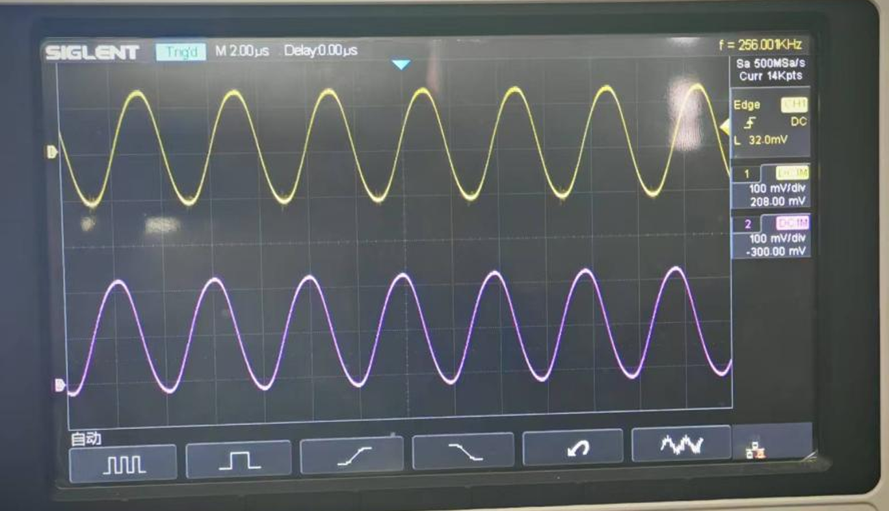

b. 结合原理框图，用示波器观测科斯塔斯环路的各中间过程测试点。
① 示波器探头 CH1 接 13 号模块的 TH1（SIN），CH2 接 TP1（COS），记录科斯塔斯环路中两路载波信号之间的关系波形。（2 分）
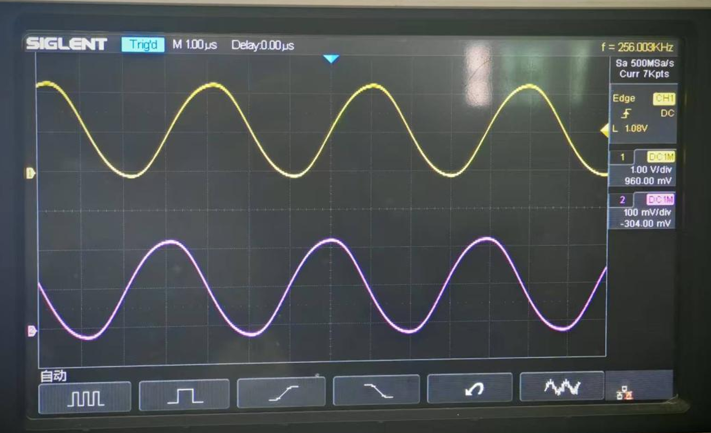

② 示波器探头 CH1 接 13 号模块的 TP3（I），CH2 接 TP2（Q），记录科斯塔斯环路中 I 支路基带信号与 Q 支路基带信号之间的关系波形。（2 分）
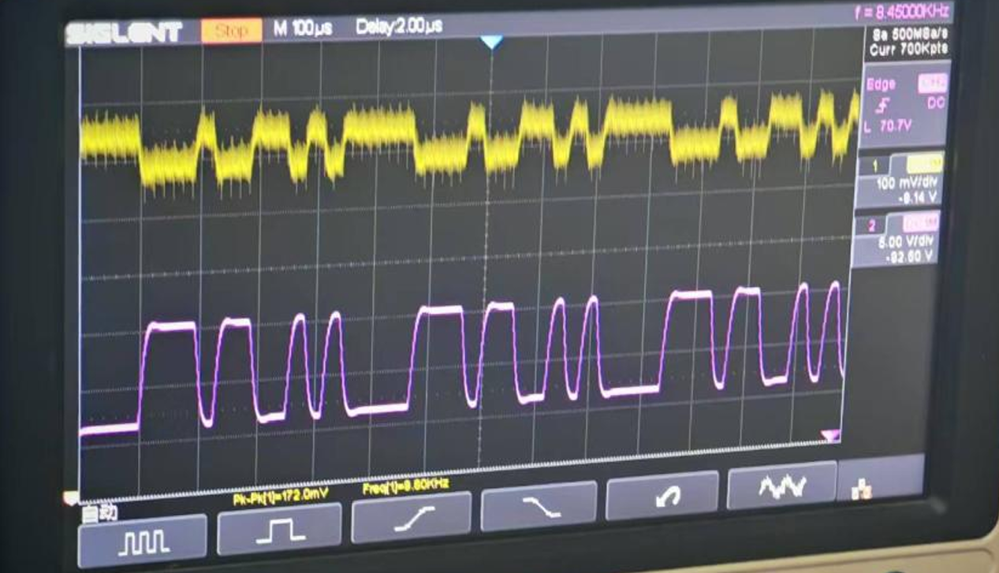

③ 示波器探头 CH1 接 13 号模块的 TP5（VCXO 输出），记录 VCXO 的频率，结合实验电路，计算 VCXO 输出频率的理论值，分析实验数据是否正确。
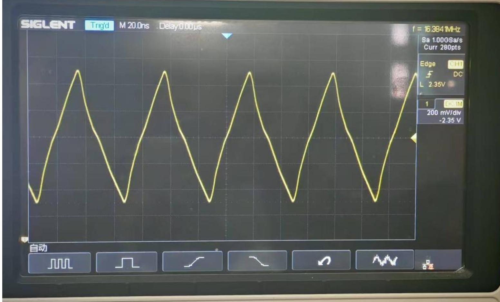
**计算 VCXO 输出频率的理论值，分析实验中记录的 VCXO 频率数据是否正确？（4 分）**
**答：**
**本实验基于 Costas 环载波同步原理。在环路中，VCXO 输出的高频信号经 64 分频（$M=64$）后作为本地恢复载波。根据系统指标，解调所需的本地载波频率应为 $256 \text{ kHz}$。因此，在环路锁定的理想状态下，VCXO 的理论输出频率应为：**
$$f_{theory} = 256 \text{ kHz} \times 64 = 16.384 \text{ MHz}$$
**分析实验记录，测得 VCXO 的实际频率为 $16.384 \text{ MHz}$。该实测值与理论计算值高度吻合，证明了环路内的负反馈调节机制工作正常，VCXO 已被牵引并锁定至正确的中心频率，实验数据准确有效。**

**（二）位同步实验**
**1. 滤波法位同步提取实验**
a. 示波器探头 CH1 接 13 号模块的 TP10（BPF-Out），CH2 接 TP6（判决输出），以 CH1 为触发源，记录两者的波形关系。（2 分）
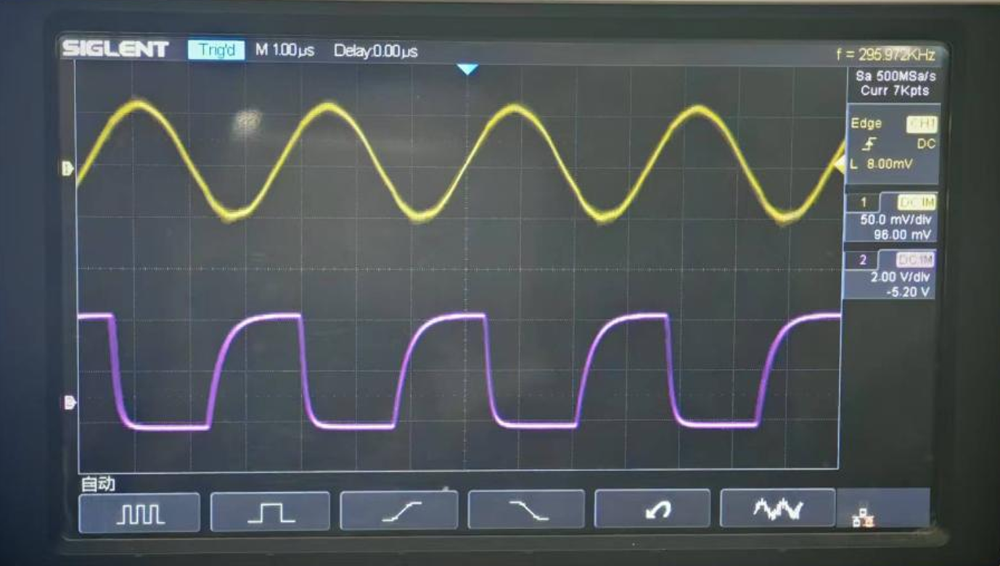

b. 示波器探头 CH1 接 13 号模块的 TP6（判决输出），CH2 接 TP7（鉴相输入 1），以 CH1 为触发源，观察两者的波形关系，分析与“判决输出”测得的时钟相比，“鉴相输入 1”测得的时钟不均匀的情况是否有所改善？（2 分）
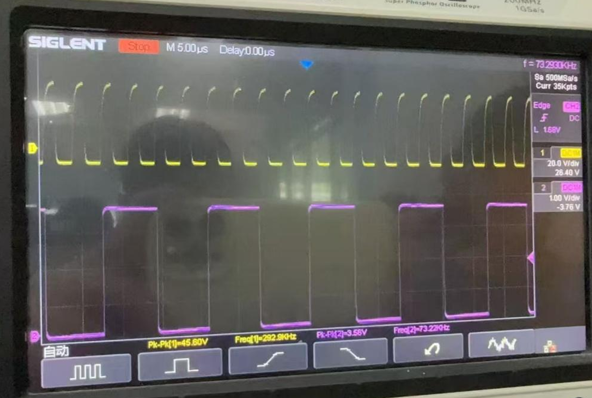

**分析时钟不均匀的情况是否有所改善：（3 分）**
**答：实验结果验证了系统具备优异的同步性能与逻辑正确性，具体分析如下：**
*   **时域波形特性：示波器观测显示，鉴相器输入信号为高质量的 50% 占空比方波。与判决输出端时钟信号表现出的占空比失真及相位抖动相比，鉴相输入信号极其稳定。这表明环路中的低通滤波器及分频电路有效滤除了高频噪声与瞬时抖动，改善了波形的频谱纯度。**
*   **频率逻辑验证：实测鉴相输入频率与判决时钟频率严格满足 1:4 的比例关系。此结果不仅证实了四分频模块工作正常，也说明系统成功实现了多速率信号的匹配与锁定，符合设计预期。**

c. 示波器探头 CH1 接 13 号模块的 TP7（鉴相输入 1），CH2 接 TP8（鉴相输入 2），记录波形并比较两路波形的相位关系。（2 分）
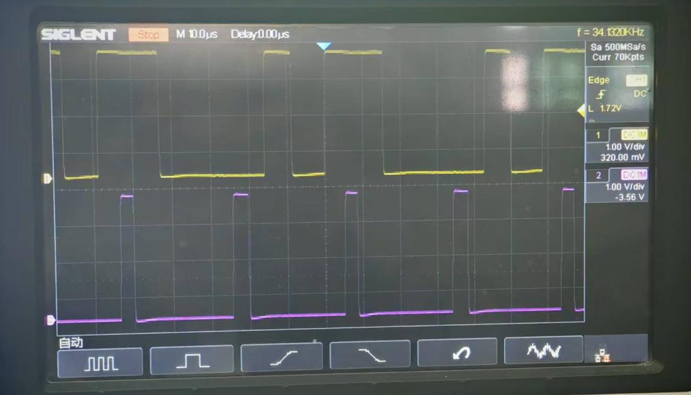

**比较两路波形的相位关系：（3 分）**
**答：**
**1. 锁定状态判定 实验观测表明，CD4046 模拟锁相环已成功进入锁定状态。示波器显示，参考信号（TP7）与反馈信号（TP8）的频率严格一致，且两者的上升沿保持稳定的对齐关系，满足锁相环锁定的基本判据。**
**2. 波形与占空比分析 观测发现两路信号波形存在显著差异：TP7 为占空比接近 50% 的方波，而 TP8 为占空比约 10% 的窄脉冲。**
*   **分析：由于 CD4046 内部鉴相器（通常为相位比较器 II）采用边沿触发机制主要关注信号的上升沿时刻而非高电平持续时间。因此，占空比的差异不会影响鉴相器的正常工作，未对系统的同步性能造成干扰。**

**3. 抖动成因与环路特性 针对波形边沿观测到的轻微相位抖动，分析认为主要源于输入信号 TP7。**
*   **成因：TP7 是从具有随机性的数据流（随机码）中经窄带滤波提取的位同步时钟，不可避免地携带了由码型效应引起的固有抖动。**
*   **机制：锁相环表现出了典型的低通滤波特性。它并未完全复现输入的瞬时抖动，而是通过动态调整 VCO 频率，对输入相位误差进行积分与平均。这表明环路正在有效执行窄带跟踪，抑制了高频抖动，从而输出了相对稳定的时钟信号。**

d. 示波器探头 CH1 接 13 号模块的 TH3（滤波法位同步输入），CH2 接 TH4（BS1），观测记录恢复的位同步信号。（2 分）
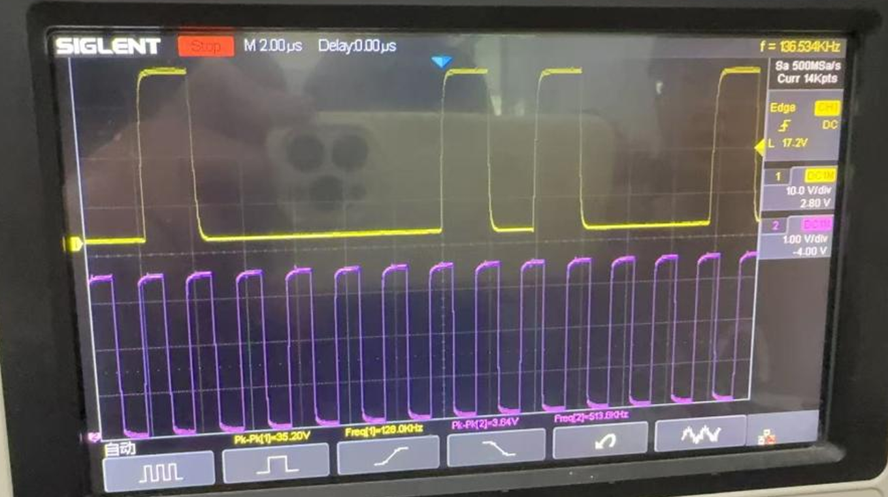

**（三）帧同步实验**
b. 观察插入不同类型误码情况下，M03 的“同步”、“捕获”及“失步”指示灯的变化情况。
① 观测单个误码插入，在误码设置中选择【单个误码插入】，该选项会在帧头中随机插入 1bit 误码，记录此时 M03 模块的同步指示灯的状态。（2 分）
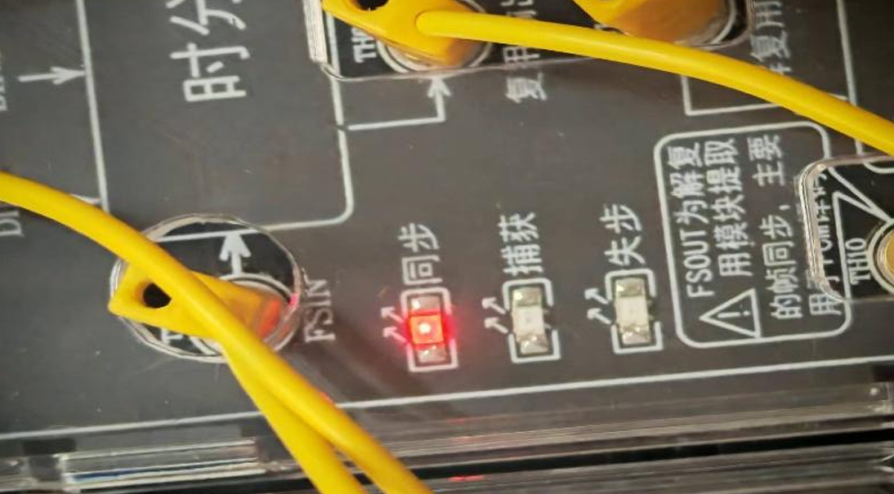

② 观测连续误码插入，在误码设置选择【连续误码插入】，该选项会在帧头中连续插入多 bit 误码，记录此时 M03 模块的同步指示灯的状态。（2 分）
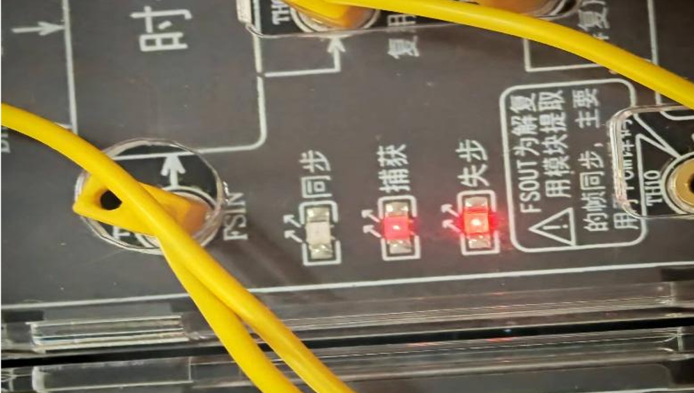

d. 观察假同步现象。
重复多次插拔模块 M03：TH6(复用输出)到模块 M03：TH8(解复用输入)连线的一端，观察记录 2 号模块解复用端的光条显示情况。（2 分）
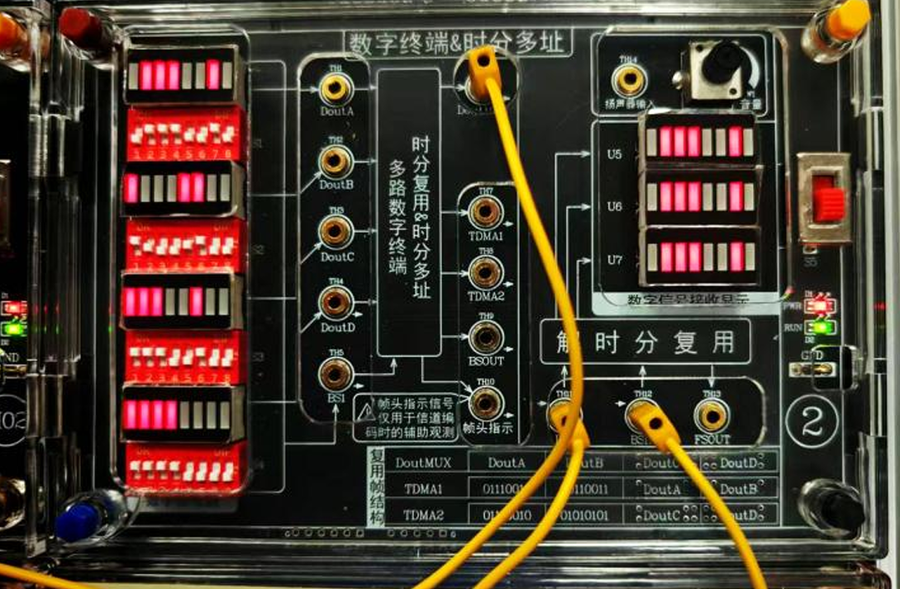
**假同步的情况下，2 号模块解复用端的光条显示的情况是怎样的？为什么会出现这种情况？（4 分）**
**答：**
**1. 实验观测 实验发现数据通道输出异常，未显示预期的随机信号，而是持续输出固定的帧同步码（01110010）。**
**2. 故障机理分析 该现象表明系统处于“伪同步”状态。具体分析如下：**
*   **失锁与重捕获：系统受干扰导致帧失锁后，进入同步捕获模式。在此过程中，随机数据流中概率性地出现了与帧同步码完全一致的比特图样（即“伪帧同步码”）。**
*   **判决错误：同步系统错误地将该数据片段判决为帧头，导致接收端的计数器复位时刻发生偏差。**
**3. 时隙错位验证 伪同步直接引发了帧时隙错。本应分配给数据通道的时隙，被错误地对齐到了接收到的帧同步字上。因此，数据通道中观测到的“固定编码”实际上是原位于第 0 时隙（TS0）的帧同步信号。这一现象直观地验证了伪同步对解调时序和信道分离的破坏作用。**

**（三）信道复用实验**
a. 256KHz 时分复用实验
① 帧内 PCM 编码信号观测。示波器探头 CH1 接 M03 模块的 DIN1，CH2 接 M03 模块的 FSIN，记录 DIN1 和 FSIN 的波形。（2 分）
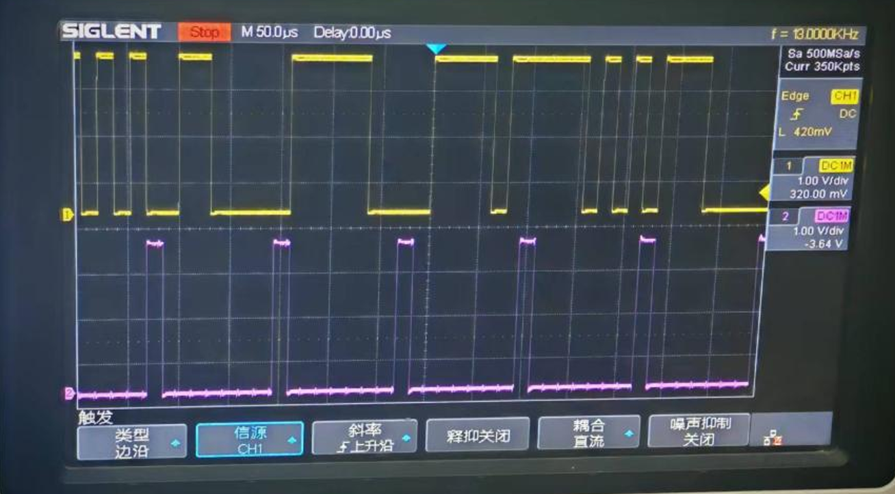

② 示波器探头 CH1 接 M03 模块的 TH6（复用输出），CH2 接 M03 模块的 FSIN，记录复用输出和 FSIN 的波形。（2 分）
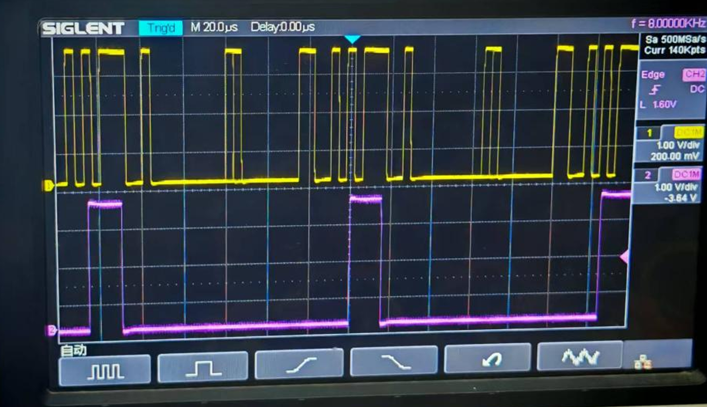

③ 更换连线如下：模块 M01 的 TH7 (编码-编码输出)接模块 M03 的 TH2 (DIN2)，模块 M03 的 TH13(DOUT2)接模块 M01：TH12(译码-译码输入)（也就是把 PCM 编码数据从时隙 1 换到时隙 2），调节 A-out 的幅度，确定 FSIN 与四个时隙之间的位置关系，根据实验电路图及实验结果，分析一下此时电路中的开关信号数据是什么？（2 分）
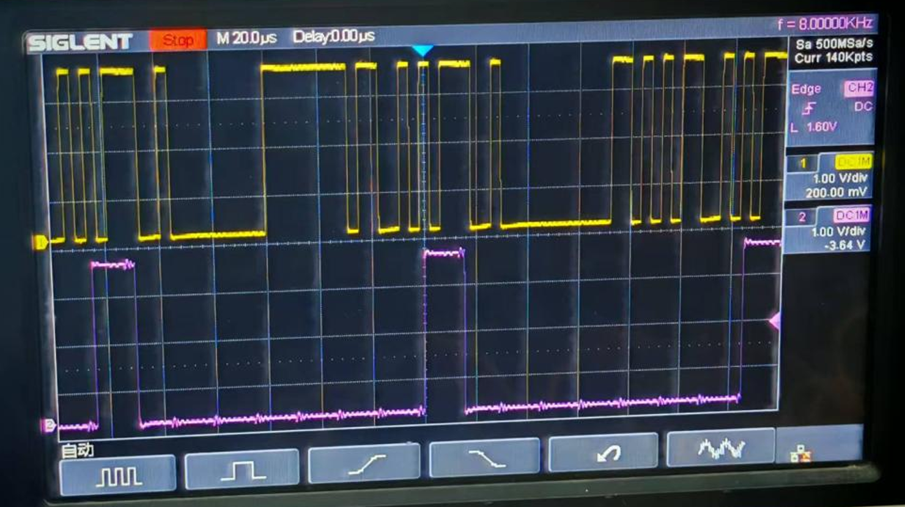

**分析 FSIN 与四个时隙之间的位置关系和此时电路中开关信号数据是什么？（4 分）**
**答：1. FSIN 与四个时隙的位置关系分析 通过示波器观测，FSIN（帧同步信号）作为全系统的基准定时信号，其与各时隙的时域关系如下：**
*   **周期对应关系：FSIN 的信号周期严格对应于一帧数据的传输时长（即包含 TS0~TS3 四个时隙的总时长）。**
*   **边界对齐特性：FSIN 的上升沿是帧起始的触发时刻。观测显示，该上升沿精确对齐于新旧两帧数据的交界处。**
    *   **交界细节：上升沿左侧观测到的低电平（0）为上一帧 TS3 的最低有效位（LSB）；上升沿右侧观测到的低电平（0）为当前帧 TS0 的最高有效位（MSB，即前导位）。**
*   **帧内时隙分布：以 FSIN 上升沿为起点，一帧数据按以下顺序排列：**
    *   **TS0（同步时隙）：承载帧同步字，实测数据为 01110010（含 1 位前导 0 和 7 位巴克码）。**
    *   **TS1 & TS2（话路时隙）：分别对应 DIN1 和 DIN2 的编码数据。**
    *   **TS3（信令时隙）：承载开关信号数据，其最后一位结束于下一个 FSIN 上升沿到来之时，完成一个完整的 TDM 帧循环。**

**2. 电路开关信号数据读数 根据上述时序关系，锁定 TS3 时隙的波形区域进行读数。**
*   **观测结果：此时电路中传输的开关信号数据为 10101010。**
*   **特征：该数据呈现为高低电平交替的方波模式。**

④ 解复用 PCM 信号观测。对比观测复用前与解复用后的 PCM 序列。示波器探头 CH1 接主控信号源模块的 A-OUT，CH2 接 M01 模块的 TH13（译码输出），调节 A-OUT 的幅度大小，记录 A-OUT 和 PCM 译码输出的正弦波波形并分析它们之间的对应关系。（2 分）
A-OUT 和 PCM 译码输出波形：
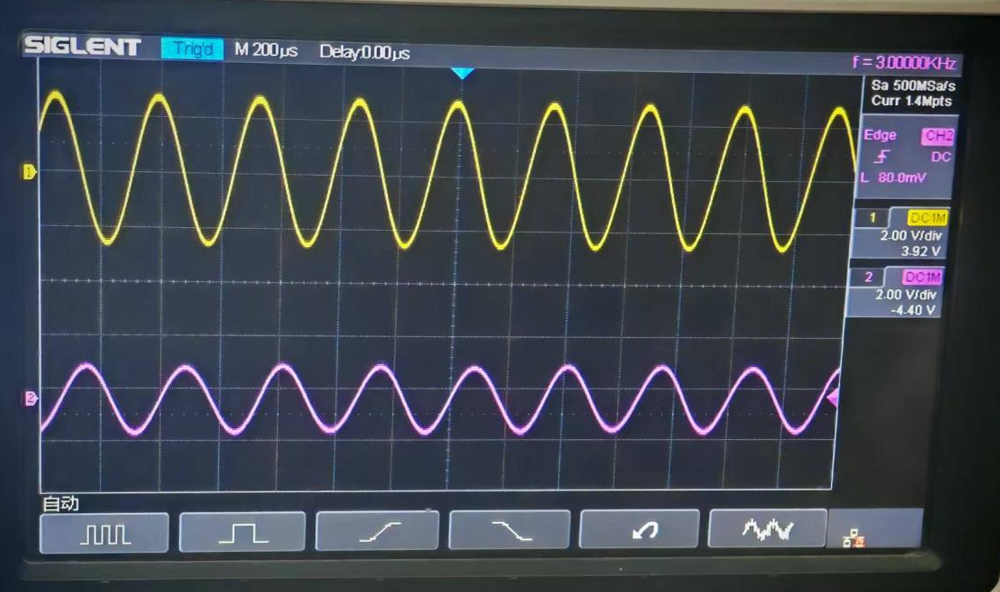

**分析 A-OUT 和 PCM 译码输出之间的对应关系：（3 分）**
**答： 对比分析显示，PCM 译码输出与原始信号（A-OUT）在频率上完全同步，波形包络基本一致。两者的主要差异体现在以下两点：**
*   **相位滞后：输出信号存在明显的延迟。这是全链路系统时延的体现，包括编解码过程的数字处理时间以及低通滤波器引入的物理延时。值得注意的是，对于高频信号，该滞后量可能接近或超过一个信号周期。**
*   **波形平滑化：虽然量化过程引入了量化误差，理论上会产生颗粒噪声，但示波器观测到的输出波形十分平滑。这是因为接收端的低通滤波器截止频率设计合理，成功滤除了 D/A 转换输出的“阶梯波”中的高频分量，完成了信号的平滑重建，使得残留的量化噪声主要表现为极其微小的背景底噪，而非肉眼可见的波形畸变。**

b. 2048KHz 时分复用实验
① 示波器探头 CH1 接 M03 号模块的 TH10(FSOUT)，CH2 接 M03 模块的 TH6（复用输出），以 CH1 为触发源，用示波器观测 2048KHz 复用输出信号。在主控菜单中选择【开关信号数据设置】，改变 M03 号模块的开关信号数据分别为 11110000, 10101010 和 11000011 观测记录 3 种开关信号数据设置情况下复用输出信号的波形，并简单说明复用输出中信号变化情况。

开关信号数据为 11110000 时，复用输出信号的波形：（2 分）
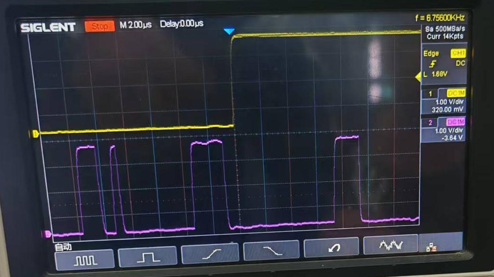

开关信号数据为 10101010 时，复用输出信号的波形：（2 分）
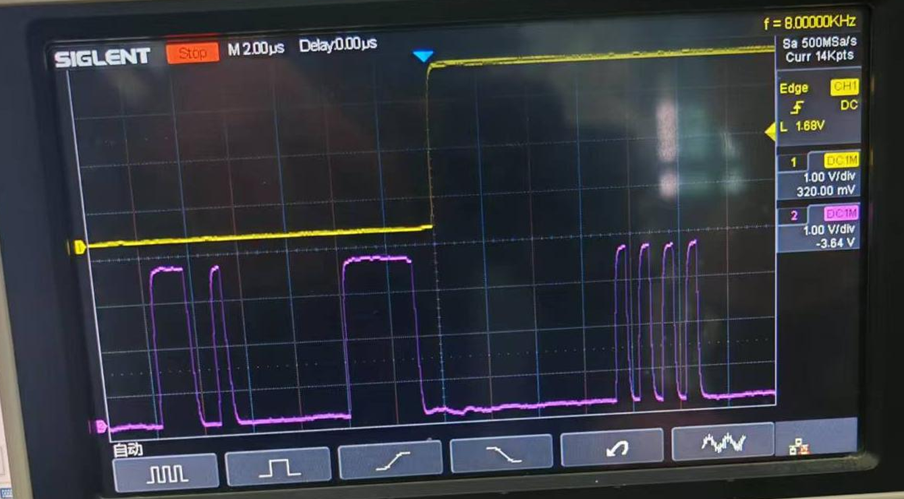

开关信号数据为 11000011 时，复用输出信号的波形：（2 分）
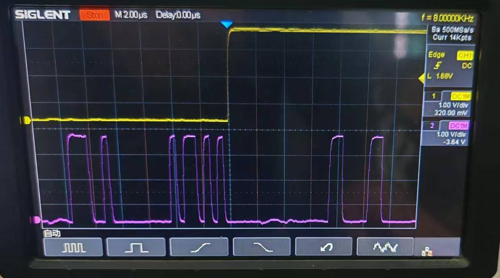

**简单说明设置不同的开关信号数据时，复用输出中信号的变化情况：（4 分）**
**答： 开关信号数据在电路中起到了通道门控的作用。它决定了哪些时隙的数据被允许进入复用流，具体波形分析如下：**
*   **11110000：即“前通后阻”。示波器显示前半帧为活跃信号，后半帧为平直低电平。这模拟了信道高负荷集中在前半周期的场景。**
*   **10101010：即“间隔选通”。数据流被切割成离散的脉冲串，信号与静默区快速交替。这验证了复用器在高速切换状态下的开关响应速度。**
*   **11000011：即“首尾呼应”。中间 4 个时隙被屏蔽，仅保留首尾数据。此模式常用于检查帧同步字（通常在首位）的完整性以及帧周期的总时长。**

② 选择开关信号数据为 10101010，记录此时 M03 号模块的 TH10(FSOUT)与 TH6（复用输出）的波形。（2 分）
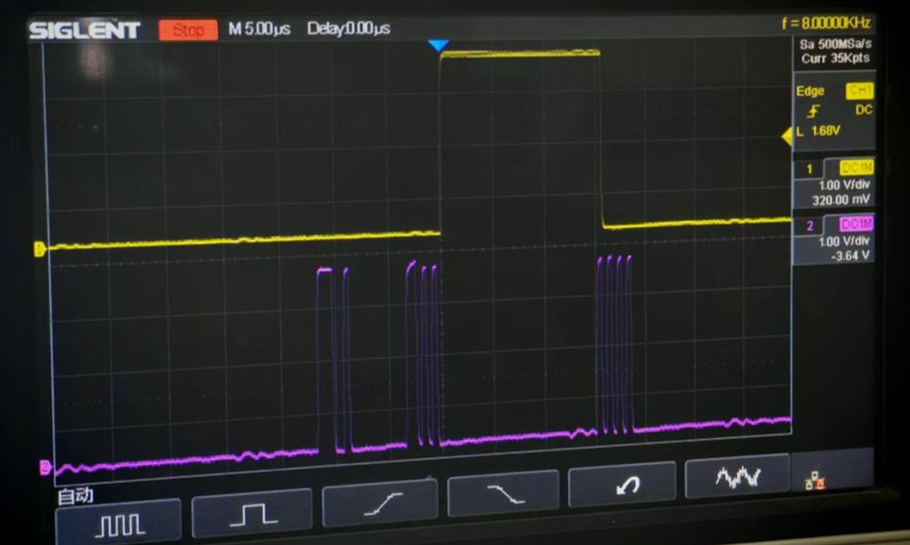

在主控菜单“开关信号时隙调整”中选择“第 5 时隙加”，记录此时 M03 号模块的 TH10(FSOUT)与 TH6（复用输出）的波形。（2 分）
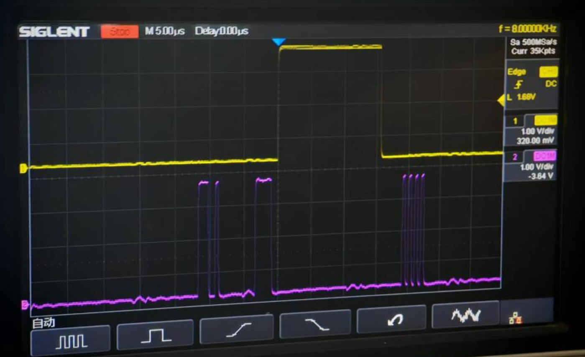

在主控菜单“开关信号时隙调整”中再次选择“第 5 时隙加”，记录此时 M03 号模块的 TH10(FSOUT)与 TH6（复用输出）的波形。（2 分）

在主控菜单“开关信号时隙调整”中选择“第 5 时隙减”，记录此时 M03 号模块的 TH10(FSOUT)与 TH6（复用输出）的波形。（2 分）
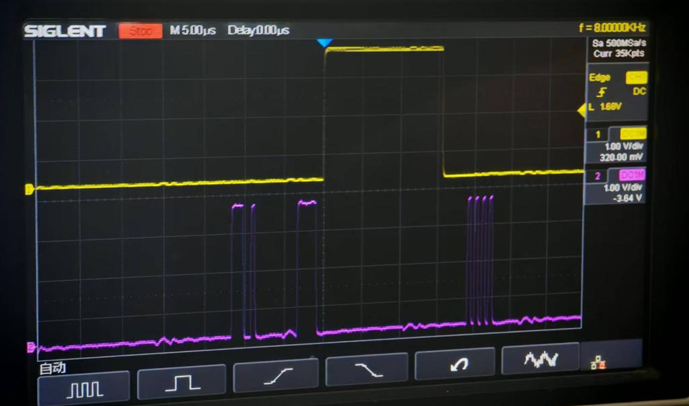
在主控菜单“开关信号时隙调整”中再次选择“第 5 时隙减”，记录此时 M03 号模块的 TH10(FSOUT)与 TH6（复用输出）的波形。（2 分）
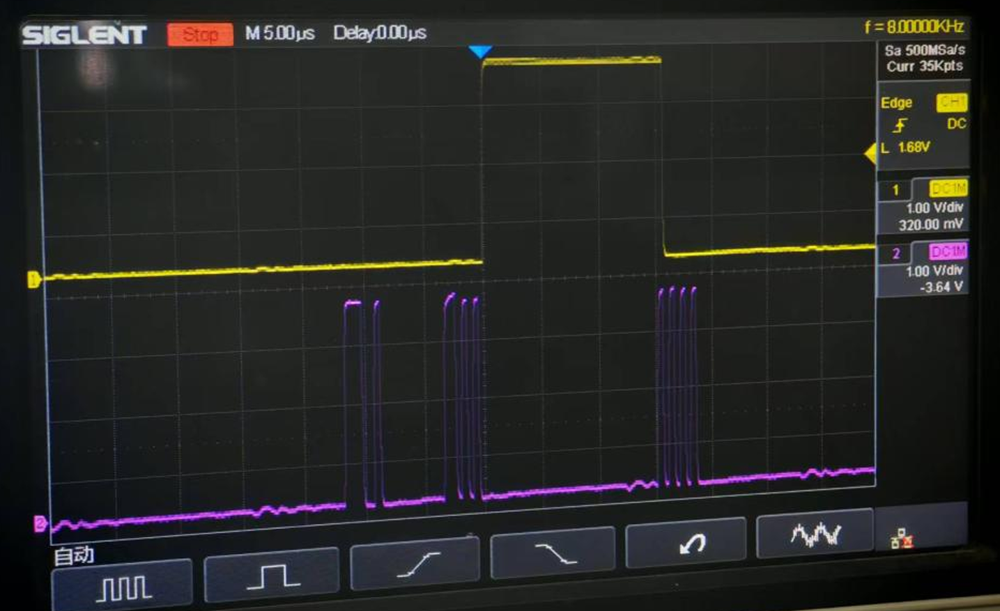

**根据以上波形中开关数据 10101010 与 FSOUT 波形的相对位置变化，分析“第 5 时隙减”和“第 5 时隙加”的作用：（3 分）**
**答：**
*   **“第 5 时隙加”：执行此操作会使系统插入一个额外的时隙延时。观测波形可知，开关控制逻辑在时间轴上发生了右移，即数据相对于帧头的位置滞后了一个时隙。**
*   **“第 5 时隙减”：执行此操作会缩减系统时序，相当于“吞掉”一个时隙。观测波形可知，开关控制逻辑在时间轴上发生了左移，即数据相对于帧头的位置提前了一个时隙。**
*   **结论：该功能验证了时分复用系统对通道位置的可控性，允许通过人工干预来修正时隙错位，实现精准的信道分离。**