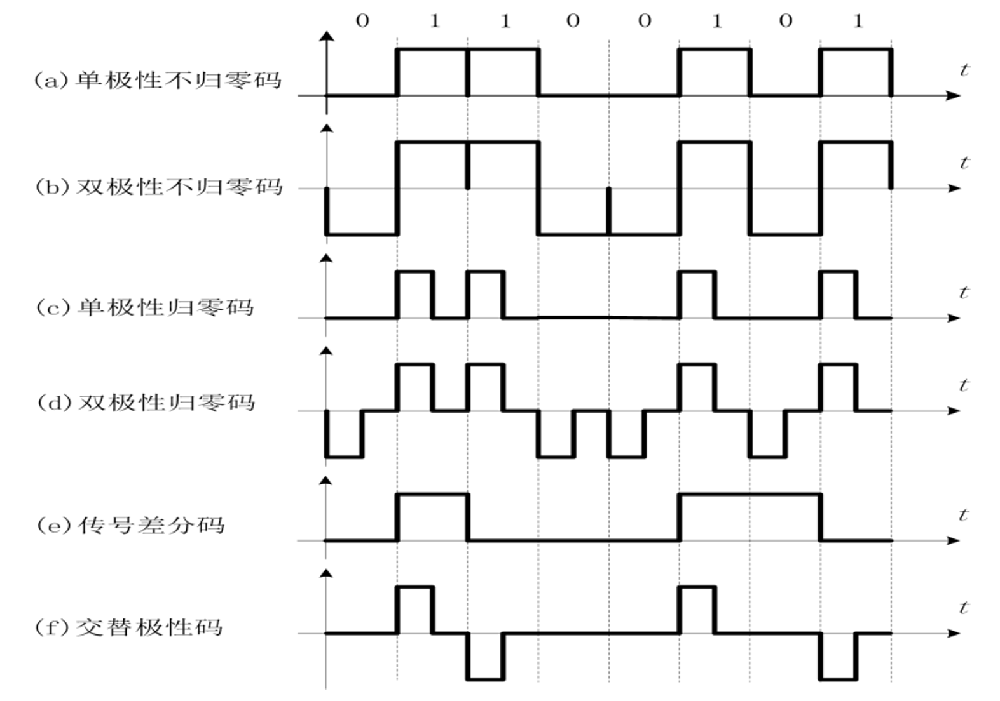
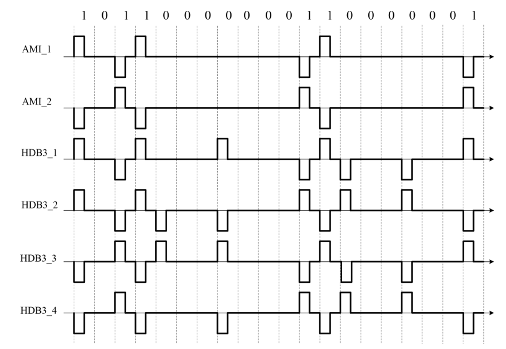

# 第三章复习目标
本章节是数字通信系统模数转换（A/D）的核心。通过本节课的复习，要求同学们准确掌握：
1. 低通与带通抽样定理的物理意义及计算。
2. 均匀量化与非均匀量化的区别，熟练运用 A律13折线进行 PCM 编码计算。
3. PCM、DPCM 及 ΔM 的工作原理与性能差异。

---

## 一、 抽样定理

抽样是将连续时间信号离散化的过程。核心考点在于根据信号的频谱特性，确定无失真恢复信号所需的最低抽样频率。

### 1. 低通抽样定理
* **适用对象：** 频带限制在 0 至 fH 之间的基带信号。
* **定理内容：** 为了保证抽样后的信号能无失真地还原为原模拟信号，抽样频率 fs 必须大于或等于信号最高频率 fH 的两倍（即奈奎斯特速率）。
* **核心公式：**
  $$f_s \geq 2f_H$$

### 2. 带通抽样定理
* **适用对象：** 频带限制在 fL 至 fH 之间的频带信号（且 fL 远大于信号带宽 B = fH - fL）。
* **计算步骤：**
  1. 计算信号带宽：B = fH - fL
  2. 计算商数并向下取整：$n = \lfloor f_H / B \rfloor$
  3. 计算最低抽样频率：
  $$f_s = \frac{2f_H}{n}$$
* **教学提示：** 考试中遇到高频载波信号，切忌直接套用低通抽样定理，必须先判定信号类型，再运用带通公式以节省系统带宽资源。

---

## 二、 量化原理
量化是将时间离散、幅度连续的抽样信号，转换为幅度也离散的信号的过程。

### 1. 均匀量化
* **定义：** 整个输入信号的动态范围内，量化间隔（步长）保持恒定。
* **量化噪声功率：** $\boxed{N = \sigma_q^2 \approx \frac{\Delta^2}{12}}$ 其中 $\Delta = (x_{max} - x_{min})/M = 2V_p / 2^N$。
* **局限性：** 导致小信号的量化信噪比极低，无法满足实际通信（如语音通话）的质量要求。

### 2. 非均匀量化：A律13折线 (重点/必考点)
* **核心思想：** “小信号小步长，大信号大步长”，以此改善小信号的量化信噪比。
* **编码结构：** 国际标准采用 8 位二进制码输出，格式为 **c1 c2 c3 c4 c5 c6 c7 c8**。
  * **c1 (极性码)：** 表示抽样值的正负。正电平为 1，负电平为 0。
  * **c2 c3 c4 (段落码)：** 将正负半轴各分为 8 个不均匀的段落，用于指示信号所在的段落区间。
  * **c5 c6 c7 c8 (段内码)：** 在确定的段落内，再进行 16 等分的均匀量化。

**【段落起始电平与步长参考表】** (假定满量程为 2048)

| 段落序号 | 段落码 (c2 c3 c4) | 起始电平 | 该段步长 |
| :--: | :------------: | :--: | :--: |
|  7   |      111       | 1024 |  64  |
|  6   |      110       | 512  |  32  |
|  5   |      101       | 256  |  16  |
|  4   |      100       | 128  |  8   |
|  3   |      011       |  64  |  4   |
|  2   |      010       |  32  |  2   |
|  1'  |      001       |  16  |  1   |
|  1   |      000       |  0   |  1   |

 **例题：A率PCM编码与解码**
*  **问题**：编码器输入动态范围为 $[-V_p, V_p]$，$V_p=2V$，对输入信号 $x = -0.74V$ 编码。
*  **解答**：

 **第一部分：编码过程 (A/D)**
 **1. 确定极性码 ($M_1$)**
- **判断**：输入信号 $x = -0.74\text{V}$ 为负值。
    
- **规则**：根据题目给定逻辑（负=0），极性码取 **0**。
    
- **后续处理**：取绝对值 $|x| = 0.74\text{V}$ 进行幅度编码。
    
    > **结果**：$M_1 = 0$
    
**2. 归一化并确定量化单位数 ($y_n$)**

- **公式**：$y_n = \frac{|x|}{V_p} \times \text{总单位数}$
- 计算：
    $$y_n = \frac{0.74}{2} \times 4096 = 0.37 \times 4096 = 1515.52$$
    
    > **结果**：信号幅度对应 **1515.52** 个量化单位。
    
**3. 确定段落码 ($M_2 M_3 M_4$)**
- **查表依据**：在 4096 个单位的 A 率表中（相较于标准的 2048 表，所有数值翻倍）。
    - 第 5 段范围：$[512, 1024)$
    - 第 6 段范围：$[1024, 2048)$
    - 第 7 段范围：$[2048, 4096)$
- **判断**：$1515.52$ 落在区间 $[1024, 2048)$ 内。
- **结论**：属于 **第 6 段**。
- **编码**：第 6 段的二进制码为 **110**。
    > **结果**：$M_2 M_3 M_4 = 110$
    
**4. 确定段内码 ($M_5 M_6 M_7 M_8$)**
- **获取参数**：
    - 第 6 段起始电平 ($V_k$)：**1024**
    - 第 6 段量化步长 ($\Delta_k$)：**64** (标准2048制是32，这里翻倍为64)
- 计算段内级数 ($m$)：
    $$m = \left\lfloor \frac{y_n - V_k}{\Delta_k} \right\rfloor = \left\lfloor \frac{1515.52 - 1024}{64} \right\rfloor$$
    $$m = \left\lfloor \frac{491.52}{64} \right\rfloor = \lfloor 7.68 \rfloor = 7$$
- **编码**：将十进制 $7$ 转换为 4 位二进制，即 **0111**。
    > **结果**：$M_5 M_6 M_7 M_8 = 0111$

**5. 编码输出**
将各部分拼接：
> **最终编码：`0 110 0111`**

**第二部分：解码过程 (D/A)**
**1. 解析码字**
- **接收码字**：`0 110 0111`
- **拆解**：
    - 极性：`0` (负)
    - 段落：`110` (第 6 段)
    - 段内级数：`0111` (即 $m=7$)

**2. 获取解码参数**
- 根据段落码 `110` (第 6 段) 查表：
    - **起始值** ($V_k$)：**1024**
    - **步长** ($\Delta_k$)：**64**

**3. 计算归一化幅值 ($y_{out}$)**
- **原理**：解码输出取量化间隔的**中点**，以最小化误差。
- **公式**：$y_{out} = V_k + m \times \Delta_k + 0.5 \times \Delta_k$
- 计算：
    $$y_{out} = 1024 + (7 \times 64) + 32$$
    $$y_{out} = 1024 + 448 + 32 = 1504$$
    > **结果**：解码后的量化单位数为 **1504**。

**4. 反归一化计算电压 ($x_{out}$)**
- **公式**：$|x_{out}| = \frac{y_{out}}{4096} \times V_p$
- 计算：
    $$|x_{out}| = \frac{1504}{4096} \times 2 = 0.3671875 \times 2 = 0.734375\text{V}$$

**5. 恢复极性**
- 因 $M_1=0$，结果为负。
    > **最终解码电压：$-0.734375\text{V}$**

**第三部分：误差分析**
- **原始输入**：$-0.740000\text{V}$
- **解码输出**：$-0.734375\text{V}$
- 量化误差 ($e_q$)：
    $$|x - x_{out}| = |-0.74 - (-0.734375)| = 0.005625\text{V}$$
- 验证：
    第 6 段的步长对应电压为：$\Delta_V = \frac{64}{4096} \times 2 = 0.03125\text{V}$。
    最大量化误差应小于半个步长：$0.5 \times 0.03125 = 0.015625\text{V}$。
    $0.005625 < 0.015625$，计算结果合理且符合理论。

---

## 三、 数字编码技术 

### 1. 脉冲编码调制 (PCM)
* 即前文详述的抽样、量化、编码全过程。每次抽样均独立进行 8 位编码。
* **系统特点：** 原理清晰，实现相对简单，但传输所需的比特率较高，占用频带较宽。

### 2. 差分脉冲编码调制 (DPCM)
* **核心原理：** 利用相邻抽样值之间的高度相关性，**仅对当前抽样值与前一个预测值之间的差值进行量化和编码**。
* **系统优势：** 由于差值方差远小于原信号方差，在保证同等通信质量的前提下，可显著减少编码位数（如降至 4 位），从而降低传输速率，节约信道带宽。

### 3. 增量调制 (ΔM)
* **定义：** 增量调制是一种特殊的 1 位 DPCM。它仅反映相邻抽样值的相对极性变化，而不反映具体差值的大小。
* **两种特有的量化噪声（重点简答题）：**
  1. **一般量化噪声（颗粒噪声）：** 当输入信号变化缓慢时，译码输出的阶梯电压在真实信号附近上下波动产生的误差。
  2. **斜率过载噪声：** 当输入信号变化过于剧烈（斜率过大）时，阶梯电压的最大爬升速率跟不上信号变化而产生的严重失真。
* **避免斜率过载的临界条件：**
  系统的最大跟踪斜率（阶梯步长乘以抽样频率）必须大于或等于输入信号的最大斜率。
  $$\Delta \cdot f_s \geq \max \left| \frac{d m(t)}{dt} \right|$$

# 第五章复习目标
第五章理论性极强，包含复杂的功率谱推导与最佳接收理论。但在补考及期末抢分阶段，我们**必须战略性放弃繁琐的数学推导**，将火力集中在必考的图表与计算题上。
本节课要求同学们必须拿下：
1. **AMI 码与 HDB3 码的编码规则**（必考画图或填空大题）。
2. **奈奎斯特第一准则**与频带利用率计算。
3. **升余弦滚降滤波器**的带宽及波特率计算公式。
4. **匹配滤波器**的相关结论。

---

## 一、 基带传输的常用码型

为什么不能直接把计算机里的 0 和 1（单极性不归零码）发出去？因为它们含有直流分量，且在连续出现 0 或 1 时无法提取同步时钟。线路编码就是为了解决这些问题。

### 1. AMI 码 (传号交替反转码)
* **编码规则：**
    * 遇到信息码 `0` $\rightarrow$ 编码为 `0`。
    * 遇到信息码 `1` $\rightarrow$ 编码为 `+1` 和 `-1` 交替出现。
* **优点：** 没有直流分量。
* **致命缺点：** 当信息序列中出现连串的 `0` 时，线路上长时间无信号，接收端无法提取定时时钟信号。

### 2. HDB3 码 —— ⚠️ 核心大题必考
HDB3 码是为了克服 AMI 码的长连 `0` 缺陷而设计的。它的核心思想是：**破坏 AMI 码的交替规律来插入同步信息，但总体上保持无直流分量。**

**💡 HDB3 编码傻瓜式四步法 (考场直接套用)：**
1.  **先转 AMI 码：** 将原序列按 AMI 规则写出（注意 `1` 的极性交替）。
2.  **寻找 4 连 0：** 在序列中找出所有连续的 4 个 `0`（即 `0000`）。
3.  **确定破坏脉冲 (V 脉冲)：** 将第 4 个 `0` 替换为 `V`。`V` 脉冲的极性必须与前一个非零脉冲（哪怕是前一个 `V`）的极性**相同**。（这破坏了交替极性规律，方便接收端识别）。
4.  **调节极性 (B 脉冲)：** 为了保证整个序列没有直流分量，相邻的两个 `V` 脉冲极性必须交替（即 `+V` 然后 `-V`）。
    * 如果当前 `V` 脉冲与前一个 `V` 脉冲之间，有**奇数**个非零脉冲（即原来的 `1`），那么 `V` 脉冲的极性自然就交替了，此时前 3 个 `0` 保持不变，记为 **`000V`**。
    * 如果当前 `V` 脉冲与前一个 `V` 脉冲之间，有**偶数**个（或 0 个）非零脉冲，`V` 脉冲的极性将无法交替。此时必须把第 1 个 `0` 换成 `B` 脉冲，记为 **`B00V`**。`B` 脉冲的极性与当前的 `V` 脉冲极性相同，并且 `B` 脉冲要参与非零脉冲的极性交替。

> **📝 考场实战技巧：**
> 检查自己画的 HDB3 码对不对，只需看两点：
> 1. 所有非零脉冲（除了 V 之外的 1 和 B）是否严格正负交替？
> 2. 相邻的两个 V 脉冲是否严格正负交替？
> 如果都满足，这道大题满分。

---

## 二、 码间串扰 (ISI) 与无失真传输条件

基带信号在实际信道（如电缆）中传输时，由于信道带宽有限，脉冲波形会发生展宽。如果展宽的尾巴拖到了下一个符号的判决时刻，就会造成**码间串扰 。

### 1. 奈奎斯特第一准则 (理想低通特性)
为了消除抽样时刻的码间串扰，系统总的传输特性必须满足一定的条件。
* **理想低通极限：** 如果信道是一个带宽为 $B$（或记为 $f_N$，奈奎斯特带宽）的理想低通滤波器。
* **最高传输速率公式：**
    $$R_B = 2B$$
    *(即：波特率等于带宽的两倍)*
* **极限频带利用率：**
    $$\eta = \frac{R_B}{B} = 2 \text{ (Baud/Hz)}$$
    *(物理意义：每赫兹带宽最多能传输 2 个符号/秒。)*

### 2. 升余弦滚降传输系统 (必考计算 ⚠️)
理想低通滤波器在物理上是无法实现的（波形为无限延伸的 sinc 函数，拖尾衰减太慢，极易受定时误差影响）。工程上常用**升余弦滚降滤波器**。

* **滚降系数 $\alpha$：** 取值范围是 $0 \leq \alpha \leq 1$。$\alpha$ 越大，占用带宽越宽，但时域拖尾衰减越快，抗定时抖动能力越强。
* **带宽计算公式 (必背)：**
    $$B = \frac{R_B}{2} (1 + \alpha)$$
* **频带利用率：**
    $$\eta = \frac{2}{1 + \alpha} \text{ (Baud/Hz)}$$

> **📝 典型解题套路：**
> 题目通常已知信息速率 $R_b$、进制数 $M$ 和滚降系数 $\alpha$。
> 1. 先求波特率：$R_B = R_b / \log_2(M)$
> 2. 再求所需带宽：带入上述 $B$ 的公式即可求得。

---

## 三、 匹配滤波器

在加性高斯白噪声（AWGN）信道中，为了在接收端特定的抽样时刻 $t_0$ 获得**最大的输出信噪比 (SNR)**，我们需要设计一种特殊的线性滤波器。这种与输入信号波形“匹配”的滤波器，就称为匹配滤波器。

* **终极目标：** 让抽样时刻的有用信号瞬时功率尽可能大，同时让噪声的平均功率尽可能小。
### 1. 冲激响应 (时域结论)
匹配滤波器的冲激响应 $h(t)$ 是输入信号波形 $s(t)$ 的**时间镜像反转并延迟**。
* **核心公式：**
  $$h(t) = k \cdot s(t_0 - t)$$
  *(式中，$k$ 为任意常数，通常取 $1$；$t_0$ 为最佳抽样时刻，通常取码元周期 $T_B$。)*
* **考点点拨：** 考试如果让你画 $h(t)$ 的波形，直接把原信号 $s(t)$ 沿纵轴翻转（折叠），再向右平移 $t_0$ 即可。

### 2. 传递函数 (频域结论)
匹配滤波器的频域响应 $H(f)$ 是输入信号频谱 $S(f)$ 的**复共轭**，并附加一个线性相位偏移。
* **核心公式：**
  $$H(f) = k \cdot S^*(f) e^{-j2\pi f t_0}$$
  *(幅频特性完全一致，相频特性正好相反，从而实现相位补偿，让所有频率分量在 $t_0$ 时刻同相叠加。)*

### 3. 最大输出信噪比
在最佳抽样时刻 $t_0$，匹配滤波器输出的最大信噪比（记为 $r_{\max}$）**只与信号的总能量 $E$ 和噪声的双边功率谱密度 $n_0/2$ 有关，而与信号的具体波形形状无关！**
* **核心公式：**
  $$r_{\max} = \frac{2E}{n_0}$$
* **避坑指南（绝对的判断题常客）：** 如果考题说“改变传输脉冲的波形可以提高匹配滤波器的最大输出信噪比”，**这句话是错的！** 只要能量 $E$ 不变，无论信号是方波、三角波还是升余弦波，最大信噪比都是固定死的值。

### 4. 物理实现等效性
* **结论：** 在抽样时刻 $t_0$，**匹配滤波器等效于相关器 (Correlator)**。
* **应用：** 工程上很难真的去做一个冲激响应为 $s(t_0 - t)$ 的滤波器，所以我们通常用“乘法器 + 积分器”（即相关接收机）来代替匹配滤波器，两者的抗噪性能在数学上是完全等价的。

---

# 第六章复习目标
第六章是数字通信系统中“频带传输”的核心。由于信道（如无线电、光纤）通常具有带通特性，基带信号必须经过调制方能传输。
本节课要求同学们掌握：
1. **二进制调制**（2ASK, 2FSK, 2PSK, 2DPSK）的波形特点与带宽计算。
2. **2DPSK 相对相移键控**的差分编解码逻辑（必考计算）。
3. **多进制调制**（M-ary）的基本概念、比特率与波特率的关系。
4. **星座图** （信号空间分析）的物理意义。
5. **性能对比：** 带宽、抗噪能力及频带利用率。

---

## 一、 二进制数字载波调制

### 1. 2ASK, 2FSK, 2PSK 波形特征
*   **2ASK (振幅键控)：** “有”代表 1，“无”代表 0。
*   **2FSK (频移键控)：** $f_1$ 代表 1，$f_2$ 代表 0。
*   **2PSK (相移键控)：** $0$ 相位代表 1，$\pi$ 相位代表 0。

### 2. 2DPSK 差分相位调制 (⚠️ 重难点)
*   **产生背景：** 2PSK 在相干解调时存在**相位模糊（倒 $\pi$ 现象）**，导致判决错误。
*   **核心方案：** 不利用载波的绝对相位，而是利用前后码元的**相位差**来表示信息。
*   **差分编码公式：**
    $$b_n = a_n \oplus b_{n-1}$$
    *(其中 $a_n$ 为绝对码，$b_n$ 为相对码，$\oplus$ 为异或运算)*
*   **考试套路：** 题目会给出一段 $a_n$ 序列，让你写出 $b_n$。

---

## 二、 二进制系统性能对比总结

考试中的判断题、选择题和填空题大多出自此表。

| **比较维度**       | **2ASK (OOK)**                           | **2PSK (BPSK)**                          | **2DPSK**                               | **2FSK**                               |
| -------------- | ---------------------------------------- | ---------------------------------------- | --------------------------------------- | -------------------------------------- |
| **全称**         | 二进制幅移键控                                  | 二进制相移键控                                  | 二进制差分相移键控                               | 二进制频移键控                                |
| **波形特点**       | 有载波表示"1" 无载波表示"0"                     | 载波相位0°表示"1" 相位180°表示"0"               | **相对相位**表示信息 前后相位变="1" 前后相位不变="0" | 频率$f_1$表示"1" 频率$f_2$表示"0" (包络恒定) |
| **功率谱特点**      | **有**离散谱线 ($f_c$处) 连续谱为辛克($Sa^2$)函数形状 | **无**离散谱线 (双极性等概时) 连续谱为辛克($Sa^2$)函数形状 | 与 2PSK 相同 形状一样，带宽一样                  | **有**离散谱线 ($f_1, f_2$处) 双峰结构        |
| **第一零点带宽**     | $$2R_b$$                                 | $$2R_b$$                                 | $$2R_b$$                                | $$\text{最小}3R_b$$                      |
| **频带利用率**      | 较高 (1 bit/s/Hz)                          | 较高 (1 bit/s/Hz)                          | 较高 (1 bit/s/Hz)                         | 较低 (< 1 bit/s/Hz)                      |
| **调制实现**       | 乘法器 (开关电路)                               | 平衡调制器 (乘法器) 输入为双极性码                   | **差分编码** + 2PSK调制器                      | 两个独立的振荡器切换 或 VCO (压控振荡器)            |
| **解调方法**       | **非相干 (包络检波)** 相干解调 相关解调           | **相干解调** 相关解调                         | **差分相干解调** 相干解调 + 差分译码               | **非相干 (包络检波)** 相干解调 过零检测法        |
| **抗噪性能 (误码率)** | **最差**                                   | **最好**                                   | 次之 (比PSK略差3dB)                          | 居中 (优于ASK，劣于PSK)                       |
| **特殊问题**       | 门限电平随信道增益变化，判决困难                         | 存在 **"倒 $\pi$ 现象"** (相位模糊)            | 解决了相位模糊问题 但有**成对误码**                 | 占用频带较宽                                 |

---

## 三、 多进制数字调制
### 1. 基本逻辑
多进制调制通过在一个码元周期内传输 $\log_2 M$ 个比特，提高频带利用率。
*   **核心关系式：**
    $$R_b = R_B \log_2 M$$
    *(信息速率 = 码元速率 $\times$ 每个码元包含的比特数)*
*   **优点：** 在相同的波特率（占用带宽相同）下，信息传输速率更高。
*   **代价：** 抗噪性能下降（码元之间距离变近，更容易误判）。

### 2. 星座图与信号空间分析
星座图上的每一个点代表一种可能的发射波形。
*   **MPSK (多进制移相键控)：** 所有点分布在同一个圆周上（振幅恒定，相位不同）。
*   **MQAM (正交振幅调制)：** 振幅和相位同时改变。
    *   **16QAM：** 4个比特映射为一个星座点。它是现代通信（4G/5G/WiFi）的基石。
    *   **结论：** 在 $M$ 较大时，QAM 的抗噪性能优于 MPSK。

### 3. MFSK
*   与 MASK/MPSK 不同，MFSK 是**增加带宽来换取性能**。$M$ 增大，所需的带宽显著增加，但由于信号空间是正交的，误码率性能在极低信噪比下反而有优势。

| 特性        | MASK        | MPSK         | MQAM              | MFSK                   |
| :-------- | :---------- | :----------- | :---------------- | :--------------------- |
| **几何空间**  | **1维** (直线) | **2维** (圆周)  | **2维** (方格/棋盘)    | **M维** (超空间坐标轴)        |
| **频带利用率** | 中等          | 高 (随 $M$ 增加) | **极高** (随 $M$ 增加) | **极低** (随 $M$ 增加而降低)   |
| **功率利用率** | 低           | 中等           | 高                 | **极高** (随 $M$ 增加而提高)   |
| **符号能量**  | 变化          | **恒定**       | 变化                | **恒定**                 |
| **最小距离**  | 随 $M$ 减小    | 随 $M$ 急剧减小   | 随 $M$ 缓慢减小        | **恒定** ($\sqrt{2E_s}$) |

---

## 四、 本章典型例题解析

**题目：** 已知基带数据比特率为 $R_b = 9600 \text{ bps}$。
1. 若采用 2DPSK 调制，其带宽是多少（不考虑滚降）？
2. 若采用 16QAM 调制，其码元速率 $R_B$ 和带宽 $B$ 各是多少？

**解答步骤：**
1. **2DPSK：**
   $M=2 \Rightarrow R_B = R_b = 9600 \text{ Baud}$
   带宽 $B = 2R_B = 19200 \text{ Hz}$
2. **16QAM：**
   $M=16 \Rightarrow \log_2 16 = 4 \text{ bits/symbol}$
   码元速率 $R_B = R_b / 4 = 9600 / 4 = 2400 \text{ Baud}$
   带宽 $B = 2R_B = 4800 \text{ Hz}$ (或者考虑单边带/等效基带带宽，按公式计算)
   *结论：多进制调制能显著压缩传输带宽。*
