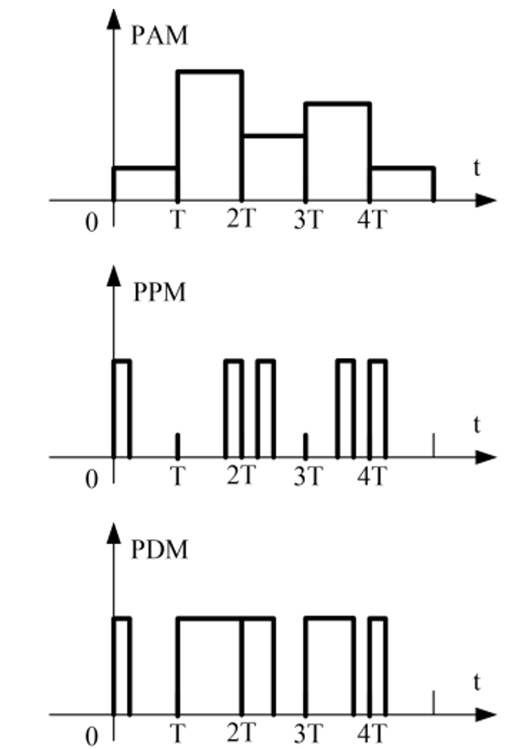
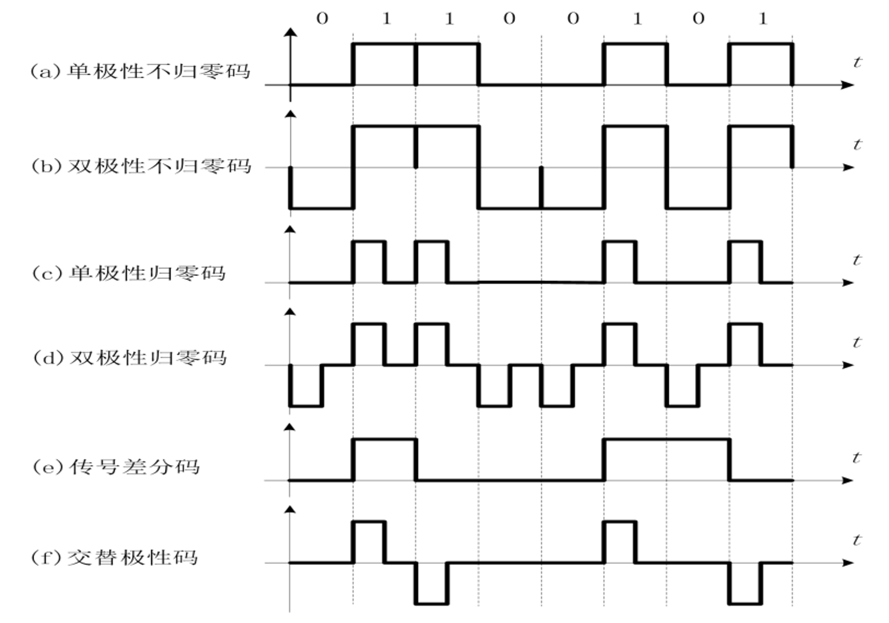

## 🎯 本章基本内容

-   **基本模型**：了解数字基带传输系统的构成。
-   **波形设计与编码**：学习常见的基带信号码型及其特性。
-   **功率谱**：分析不同码型的频谱特性，理解其对传输的影响。
-   **码间串扰**：研究码间串扰产生的原因和消除条件（奈奎斯特准则）。
-   **部分响应系统**：了解一种主动引入可控码间串扰来提高频带利用率的技术。
-   **信号检测与最佳接收**：探讨在噪声环境下如何最优地恢复信号。

---

## 5.1 引言 🗣️

-   **数字基带信号**：指未经载波调制（频谱搬移）的数字电脉冲信号。它的频谱是从零频或直流附近开始的。
-   **数字基带传输系统**：直接利用基带信号来传输信息的系统。

-   **应用场景** 🖥️
    -   短距离的数据传输。
    -   计算机局域网的构建。

-   **系统特点** ✨
    -   优点：简单、经济、易于实现。
    -   缺点：一般只适用于有线传输场景。

---

## 5.2 基带传输系统的基本模型 🏗️

一个典型的数字基带传输系统由以下几个核心部分组成：

-   **波形变换**：将二进制的数字序列（例如`0`和`1`）转换成适合在信道中传输的特定电脉冲波形。
-   **信道**：传输信号的物理媒介，对于基带系统，通常是有线信道（如同轴电缆、双绞线）。信道会引入噪声 `n(t)`。
-   **接收滤波器**：主要有两个作用：
    1.  尽可能滤除信道引入的带外噪声。
    2.  对信道特性进行校正，补偿信号失真。
-   **抽样判决器**：在特定的时刻（同步信号的指导下）对接收到的波形进行抽样，然后与预设的门限进行比较，判决出原始的数字信息是`0`还是`1`。

---

## 5.3 基带信号的波形设计与编码 📟

### 1. 基本波形

在一个码元周期内，可以用不同形状的脉冲来表示数字信号，常见的三种基本调制方式：

-   **脉冲幅度调制 (PAM)**：用脉冲的幅度变化来表示数字序列。
-   **脉冲位置调制 (PPM)**：用脉冲在码元周期内的位置变化来表示数字序列。
-   **脉冲宽度调制 (PDM)**：用脉冲的宽度变化来表示数字序列。

在实际系统中，最常用的是基于**脉冲幅度调制**的二进制基带信号。

### 2. 常用二进制码型 📈

不同的编码方式（码型）会赋予信号不同的特性，以适应不同的传输需求。

#### (1) 单极性不归零码 (Unipolar NRZ)

-   **规则**：“1”码对应正电平，“0”码对应零电平。在一个码元时间内电平不回到零。
-   **特点**：
    -   含有丰富的直流分量和低频分量，不适合经过交流耦合（会隔直）的系统传输。
    -   抗噪声性能较差。
    -   当出现连续的`1`或`0`时，信号长时间不变，难以提取同步信号，容易失步。

#### (2) 双极性不归零码 (Polar NRZ)

-   **规则**：“1”码对应正电平，“0”码对应负电平。
-   **特点**：
    -   当`1`和`0`等概率出现时，没有直流分量。
    -   判决门限为0，抗干扰能力比单极性码强。
    -   同样存在连续`1`或`0`时难以提取同步信号的问题。

#### (3) 归零码 (RZ)

-   **规则**：脉冲在码元持续时间之内会返回到零电平，即占空比小于1。分为单极性归零码和双极性归零码。
-   **特点**：
    -   由于每个码元都有电平的跳变（即使是连续的`1`），频谱中含有丰富的定时信息，便于提取同步信号。
    -   占用了更宽的频带，频带利用率较低。

#### (4) 差分码 (Differential Code)

-   **核心思想**：用码元之间的电平是否跳变来表示信息，而不是电平本身。
-   **传号差分码 (NRZ-M)**：
    -   规则：电平跳变表示`1`，电平不变表示`0`。
    -   编码公式：
        $b_n = a_n \oplus b_{n-1}$
        其中 $a_n$ 是输入信息位， $b_n$ 是编码后的输出。
-   **空号差分码 (NRZ-S)**：
    -   规则：电平跳变表示`0`，电平不变表示`1`。
-   **优点**：可以解决通信系统中可能出现的“相位模糊”或“倒码”问题。

#### (5) 交替极性码 (AMI码, Alternate Mark Inversion)

-   **规则**：“0”码对应零电平，“1”码（传号）对应交替出现的正负脉冲。
-   **特点**：
    -   没有直流分量，能量集中在低频。
    -   交替的极性提供了检错能力（如果收到两个同极性的脉冲，则一定有误码）。
    -   当出现长串`0`时，仍然存在同步困难问题。

#### (6) HDB₃码 (三阶高密度双极性码)

-   **目的**：是AMI码的改进版，为了解决AMI码中长串`0`的同步问题。
-   **规则**：
    1.  当连续`0`的个数不超过3个时，编码规则同AMI码。
    2.  当出现4个连续的`0`时，将这`0000`替换为特定的码组`B00V`或`000V`。
        -   `B`（Balance）: 破坏脉冲，极性与前一个`1`码的极性相同，以破坏AMI的交替规则。
        -   `V`（Violation）: 平衡脉冲，极性与前一个`B`码的极性相反，以维持直流平衡。
    -   选择`B00V`还是`000V`的原则是：使相邻的`V`脉冲极性交替出现，以维持整体的直流平衡。
-   **优点**：兼具AMI码的优点，同时保证了信号中有足够的跳变，确保了同步信号的提取。
- 

#### (7) 曼彻斯特码 (Manchester Code)

-   **规则**：
    -   “1”码：码元中间出现从高到低的跳变。
    -   “0”码：码元中间出现从低到高的跳变。
-   **特点**：
    -   每个码元中间都有一次跳变，蕴含了丰富的同步信息，同步性能极好。
    -   没有直流分量。
    -   编码效率低，所占用的带宽是NRZ码的两倍。常用于局域网（如以太网）。

---

## 5.4 基带信号的功率谱 📊

分析信号功率谱的目的：

1.  根据信号谱特性，选择合适的传输信道。
2.  根据信道特性，选择合适的编码码型。
3.  判断频谱中是否含有离散的线谱分量，以确定定时信号的提取方法。

### 1. 随机序列功率谱的通用公式

对于一个由随机序列 $a_n$ 调制的脉冲信号 $g_T(t)$ 构成的平稳基带信号：
$s(t) = \sum_{n=-\infty}^{\infty} a_n g_T(t-nT)$

其功率谱密度为：
$$ \boxed{ P_s(f) = \frac{1}{T}|G_T(f)|^2 \sum_{m=-\infty}^{\infty} R_a(m) e^{-j2\pi fmT} } $$
其中：
-   $G_T(f)$ 是单个脉冲波形 $g_T(t)$ 的傅里叶变换。
-   $R_a(m) = E[a_n a_{n+m}]$ 是序列 $\{a_n\}$ 的自相关函数。

💡 **注意点**：这个公式是分析所有码型功率谱的理论基础。核心在于两部分：单个码元波形的频谱 $|G_T(f)|^2$ 和数字序列的统计特性 $R_a(m)$。

### 2. 几种码型的功率谱特点

-   **不归零码 (NRZ)**：
    -   主瓣宽度为 $1/T = R_b$ (码元速率)。
    -   在 $f=0$ 处有较大的值（直流分量）。
-   **归零码 (RZ)**：
    -   主瓣宽度为 $2/T = 2R_b$，是NRZ码的两倍。
    -   在 $f=1/T, 2/T, ...$ 处有离散的线谱，便于提取定时。
-   **AMI码**：
    -   在 $f=0$ 处功率谱密度为零，无直流分量。
    -   能量主要集中在 $f = R_b/2$ 附近。
-   **曼彻斯特码**：
    -   在 $f=0$ 处功率谱密度为零，无直流分量。
    -   主瓣宽度是NRZ码的两倍，频带利用率低。

---

## 5.5 码间串扰与波形传输无失真的条件 🚦

### 1. 码间串扰 (ISI)

-   **原因**：实际的通信信道都是带限的（无法通过无限带宽的信号）。当一个脉冲信号通过带限信道后，其波形会发生展宽、拖尾。
-   **现象**：前一个码元的拖尾会延伸到当前码元的抽样时刻，对当前码元的判决造成干扰。这种由前后码元引起的干扰称为**码间串扰** (Intersymbol Interference, ISI)。

接收端在 $t=kT$ 时刻的抽样值为：
$y(kT) = \underbrace{a_k h(0)}\_{\text{期望信号}} + \underbrace{\sum_{n \neq k} a_n h((k-n)T)}\_{\text{码间串扰}}$
其中 $h(t)$ 是整个系统的冲激响应。

### 2. 奈奎斯特第一准则 (无码间串扰准则)

为了在抽样时刻消除码间串扰，系统的冲激响应 $h(t)$ 必须满足：

-   **时域条件**：
    $$ \boxed{ h(kT) = \begin{cases} 1, & k=0 \\ 0, & k \neq 0 \end{cases} } $$
    这意味着，在当前码元的抽样时刻，其值为1，而在所有其他码元的抽样时刻，其值都恰好为0。

-   **频域条件**：
    将 $h(t)$ 的频谱 $H(f)$ 按码元速率的倒数 $1/T$ 进行周期延拓并叠加，结果应为一个常数。
    $$ \boxed{ \sum_{i=-\infty}^{\infty} H(f - \frac{i}{T}) = T \quad (\text{常数})\ \ \ \ \ } $$

#### (1) 理想低通系统（最窄带宽）

-   满足奈奎斯特第一准则的最窄带宽系统是理想低通（矩形窗）系统。
-   其带宽被称为奈奎斯特带宽：$W = \frac{1}{2T} = \frac{R_b}{2}$。
-   对应的最高码元速率被称为奈奎斯特速率：$R_b = 2W$。
-   **缺点**：
    1.  理想矩形滤波器在物理上无法实现。
    2.  其冲激响应 `sinc(t)` 拖尾衰减慢，对抽样时刻的精度要求非常高。

#### (2) 升余弦滚降系统

-   为了克服理想系统的缺点，采用滚降特性来设计滤波器，使其频谱从通带到阻带平滑过渡。
-   **滚降系数** $\alpha$ ($0 \le \alpha \le 1$)：
    -   $\alpha = 0$: 理想矩形系统。
    -   $\alpha = 1$: 全滚降（升余弦）系统，频谱最平滑。
    -   $0 < \alpha < 1$: 部分滚降。
-   **带宽**：$W = (1+\alpha) \frac{R_b}{2}$。
-   **优点**：
    1.  物理上可实现。
    2.  冲激响应拖尾衰减快，对定时误差不敏感。
-   **代价**：牺牲了带宽，频带利用率降低。

---

## 5.6 部分响应基带传输系统 🤝

### 1. 基本思想

-   奈奎斯特准则要求在抽样点上无码间串扰，代价是带宽或实现的复杂性。
-   **部分响应**系统反其道而行之：**主动地、有规律地**在前后码元之间引入可控的码间串扰。
-   **目的**：用简单的、物理可实现的滤波器达到奈奎斯特速率（$2W$），同时保持对定时误差不敏感的优点。

### 2. 第一类部分响应（双二进制码）

-   引入的码间串扰是：当前码元的抽样值仅受前一个码元的干扰。
-   在抽样时刻 $t=nT$，接收到的值为：$c_n = d_n + d_{n-1}$
    其中 $\{d_n\}$ 是发送的符号序列。
-   解码时，可以通过减法来恢复原码：$\hat{d}_n = c_n - \hat{d}\_{n-1}$。

### 3. 误码扩散与预编码

-   **问题**：上述解码方式中，一旦某一位 $\hat{d}_{n-1}$ 判决错误，这个错误会像多米诺骨牌一样传播下去，导致后续一系列的错误。这就是**误码扩散**。
-   **解决方案：预编码**。
    -   在发送端，先对原始信息序列 $\{a_n\}$ 进行预编码，得到序列 $\{d_n\}$。
    -   预编码规则（模2加法）：$d_n = a_n \oplus d_{n-1}$。
    -   经过部分响应信道后，接收到的 $c_n = d_n + d_{n-1}$。
    -   接收端直接对 $c_n$ 进行判决，就可以恢复出原始信息 $a_n$，而无需依赖之前的判决结果，从而避免了误码扩散。

---

## 5.7 基带信号的检测与最佳接收 ✅

### 1. 最佳接收准则

-   在加性高斯白噪声（AWGN）信道下，为了使误码率 $P_e$ 最小，接收机应采用**最大似然判决**或**最大后验概率判决**。
-   当发送`0`和`1`的先验概率相等时，两者等价。

### 2. 匹配滤波器

-   为了在抽样时刻获得**最大信噪比**（SNR），从而获得最小的误码率，接收滤波器应该采用**匹配滤波器**。
-   **定义**：匹配滤波器的冲激响应 $h(t)$ 是输入信号波形 $s(t)$ 的时间反褶和时移。
    $$ h(t) = s(T-t) $$
-   **等效实现**：匹配滤波器可以用一个**相关器**来实现。

### 3. 不同信号的抗噪声性能

误码率 $P_e$ 通常表示为 Q 函数的形式，它与信号能量 $E_b$ 和噪声功率谱密度 $N_0$ 的比值有关。

-   **单极性不归零信号** (正交信号, $\rho=0$)
    $$ P_e = Q\left(\sqrt{\frac{E_b}{N_0}}\right) $$
-   **双极性不归零信号** (反极性信号, $\rho=-1$)
    $$ P_e = Q\left(\sqrt{\frac{2E_b}{N_0}}\right) $$

💡 **结论**：在相同的比特能量 $E_b$ 下，双极性信号的误码率远低于单极性信号。或者说，要达到相同的误码率，双极性信号所需的能量比单极性信号少3dB。

### 4. 眼图 👀

-   **定义**：一种在示波器上观察基带信号质量的实验方法。通过将接收到的信号波形按码元周期叠加显示，形成类似“眼睛”的图形。
-   **眼图信息解读**：
    -   **“眼睛”张开越大**：表示码间串扰越小，噪声容限越大，系统性能越好。
    -   **“眼睛”上下宽度**：代表噪声容限。
    -   **“眼睛”左右宽度**：代表对定时抖动的容忍度。
    -   **斜坡的斜率**：斜率越陡，对定时误差越敏感。
    -   **最佳抽样时刻**：是“眼睛”张开最大的时刻。

---

## 🧐 本章学习总结

本章深入探讨了数字基带传输的整个流程和核心技术。

1.  我们从**系统模型**入手，了解了信号从发送到接收经历的各个环节。
2.  接着，学习了多种**码型**，如NRZ、RZ、AMI、HDB₃和曼彻斯特码。理解它们的优缺点（如直流分量、同步性能、带宽占用）是选择合适编码方案的关键。
3.  **功率谱**的分析为我们提供了理论依据，解释了为什么不同码型有不同的传输特性。
4.  本章的重点是**码间串扰**问题。我们学习了**奈奎斯特第一准则**，它是实现无码间串扰传输的理论基石。理想系统虽然频带最窄，但无法实现；而**升余弦滚降系统**是在工程实践中广泛采用的折衷方案。
5.  **部分响应系统**提供了一种全新的思路，通过主动引入可控的码间串扰来换取更高的频带利用率和系统可实现性，而其**预编码**技术则是克服误码扩散的关键。
6.  最后，在**信号接收**部分，我们明确了最佳接收的目标是最小化误码率，而**匹配滤波器**是实现这一目标的理论最优选择。通过性能对比，我们深刻理解了双极性信号相比单极性信号在抗噪声方面的巨大优势。
7.  **眼图**作为一种直观的性能评估工具，将码间串扰、噪声、定时误差等抽象概念形象化，是工程调试中不可或缺的手段。

总的来说，第五章连接了数字信号处理的理论与通信工程的实践，为后续学习更复杂的数字调制系统（频带传输）打下了坚实的基础。