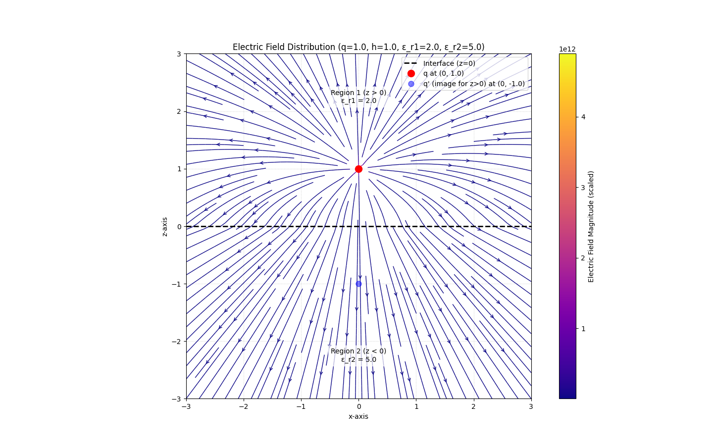
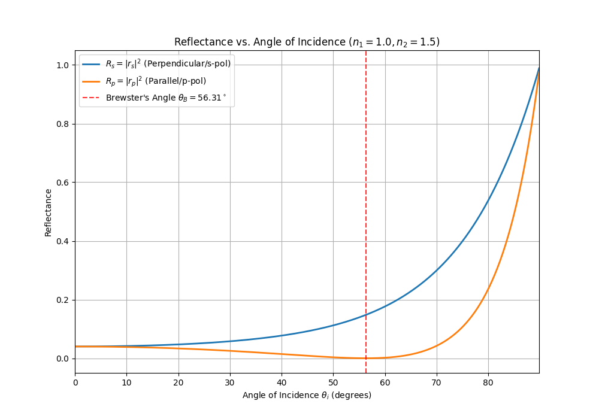
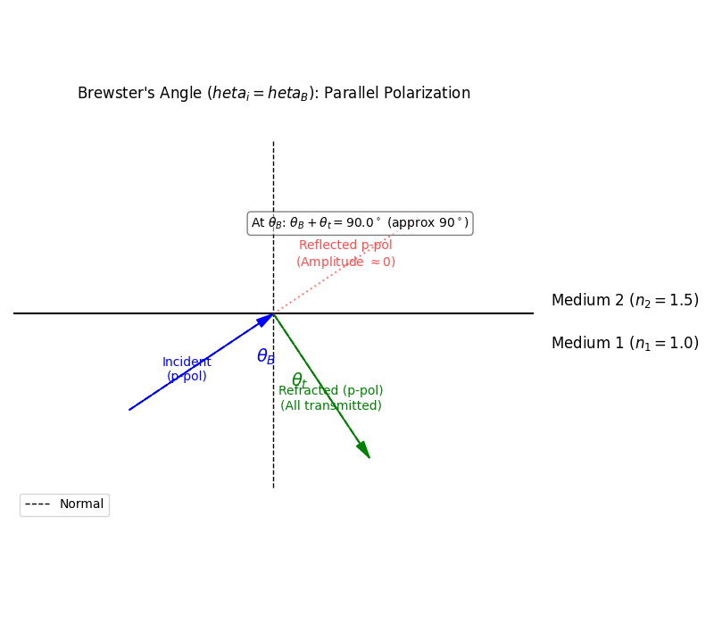

👋 **开篇寄语**
>Never underestimate your power to change yourself!
>
  只要清楚认识自己，不忘初心，砥砺前行，就能实现梦想。
  
## 第一章 矢量与场论基础
### 1-1 矢量与正交坐标系

#### 1. 矢量 (Vector) ➡️

*   **物理表述** (S5): 矢量是既有大小又有方向的量。
*   **几何描述** (S5): 用有向线段表示，箭头表示方向，长度表示大小。
*   **数学表述** (S5):
    *   表示法: $\vec{A}$ 或 $\mathbf{A}$ (课件中常用 $\vec{A}$ 或 $\bar{A}$ 形式)
    *   大小 (模):
        $\boxed{|\vec{A}| = A}$
    *   直角坐标系分量表示:
        $\vec{A} = A_x \vec{a}_x + A_y \vec{a}_y + A_z \vec{a}_z$
        或简记为:
        $\vec{A} = [A_x, A_y, A_z]$
    *   单位矢量 $\vec{a}_A = \frac{\vec{A}}{|\vec{A}|} = \frac{\vec{A}}{A}$

*   **注意点** ❗ (S5): 某方向的单位矢量 $\vec{a}_A$ 不总是常矢量 (其方向可能随空间点变化，例如在曲线坐标系中)。

---

#### 2. 矢量运算➕➖✖️

##### 2.1 加法和减法

*   **分量运算**:
    $\vec{C} = \vec{A} \pm \vec{B} = (A_x \pm B_x)\vec{a}_x + (A_y \pm B_y)\vec{a}_y + (A_z \pm B_z)\vec{a}_z$
*   **运算律**:
    *   交换律: $\vec{A}+\vec{B} = \vec{B}+\vec{A}$
    *   结合律 : $\vec{A}+(\vec{B}+\vec{C}) = (\vec{A}+\vec{B})+\vec{C}$
*   **几何方法**:
    *   平行四边形法则 
    *   首尾相接法则

##### 2.2 点乘

*   **定义**:
    $\boxed{\vec{A} \cdot \vec{B} = |\vec{A}||\vec{B}| \cos \theta_{AB} = AB \cos \theta_{AB}}$
    其中 $\theta_{AB}$ 是 $\vec{A}$ 和 $\vec{B}$ 之间的夹角。
*   **结果**: 一个标量。
*   **运算律**:
    *   交换律 (Commutative): $\vec{A} \cdot \vec{B} = \vec{B} \cdot \vec{A}$
    *   分配律 (Distributive): $\vec{A} \cdot (\vec{B}+\vec{C}) = \vec{A} \cdot \vec{B} + \vec{A} \cdot \vec{C}$
*   **自身点乘**:
    $\vec{A} \cdot \vec{A} = A^2 \implies A = \sqrt{\vec{A} \cdot \vec{A}}$
*   **应用**: 求矢量在一个方向上的投影；判断矢量正交 ($\vec{A} \cdot \vec{B} = 0$ if $\vec{A} \perp \vec{B}$)。
*   **示例 (S7)**: 证明三角余弦定理 $C^2 = A^2 + B^2 - 2AB \cos \alpha$ (其中 $\vec{C} = \vec{A} + \vec{B}$，$\alpha = \pi - \theta_{AB}$)。

##### 2.3 叉乘  ✖️

*   **定义 (大小和方向)**:
    $\boxed{\vec{A} \times \vec{B} = \vec{a}_n |\vec{A}||\vec{B}| \sin \theta_{AB}}$
    其中 $\theta_{AB}$ 是 $\vec{A}$ 和 $\vec{B}$ 之间的夹角 ($0 \le \theta_{AB} \le \pi$)。
    *   **大小**: $|\vec{A} \times \vec{B}| = AB |\sin \theta_{AB}|$，等于以 $\vec{A}$ 和 $\vec{B}$ 为邻边的平行四边形的面积。
    *   **方向**: $\vec{a}_n$ 是垂直于 $\vec{A}$ 和 $\vec{B}$ 构成的平面的单位矢量，其指向由右手螺旋规则 (Right-hand rule) 确定 (从 $\vec{A}$ 转向 $\vec{B}$)。
*   **结果**: 一个矢量。
*   **直角坐标系行列式表示**:
    $\vec{A} \times \vec{B} = \begin{vmatrix} \vec{a}_x & \vec{a}_y & \vec{a}_z \\ A_x & A_y & A_z \\ B_x & B_y & B_z \end{vmatrix} = \vec{a}_x (A_y B_z - A_z B_y) + \vec{a}_y (A_z B_x - A_x B_z) + \vec{a}_z (A_x B_y - A_y B_x)$
*   **运算律**:
    *   反交换律 (Anti-commutative): $\vec{A} \times \vec{B} = -\vec{B} \times \vec{A}$
    *   分配律 (Distributive): $\vec{A} \times (\vec{B}+\vec{C}) = \vec{A} \times \vec{B} + \vec{A} \times \vec{C}$
*   **自身叉乘**:
    $\vec{A} \times \vec{A} = 0$

##### 2.4 三重积

*   **标量三重积 (Scalar Triple Product)**:
    *   定义: $\vec{A} \cdot (\vec{B} \times \vec{C})$
    *   结果: 一个标量。
    *   几何意义: 其绝对值 $| \vec{A} \cdot (\vec{B} \times \vec{C}) |$ 代表由 $\vec{A}, \vec{B}, \vec{C}$ 三个矢量构成的平行六面体的体积。
    *   轮换对称性: $\vec{A} \cdot (\vec{B} \times \vec{C}) = \vec{B} \cdot (\vec{C} \times \vec{A}) = \vec{C} \cdot (\vec{A} \times \vec{B})$
    *   行列式表示 (见 S10, 推广到正交曲线坐标系):
        $\boxed{\vec{C} \cdot (\vec{A} \times \vec{B}) = \begin{vmatrix} C_{u1} & C_{u2} & C_{u3} \\ A_{u1} & A_{u2} & A_{u3} \\ B_{u1} & B_{u2} & B_{u3} \end{vmatrix}}$ (在直角坐标系中 $u_i=x,y,z$)
*   **矢量三重积 (Vector Triple Product)**:
    *   定义: $\vec{A} \times (\vec{B} \times \vec{C})$
    *   结果: 一个矢量。
    *   展开公式 ("BAC-CAB" rule):
        $\boxed{\vec{A} \times (\vec{B} \times \vec{C}) = \vec{B}(\vec{A} \cdot \vec{C}) - \vec{C}(\vec{A} \cdot \vec{B})}$
    *   注意: $\vec{A} \times (\vec{B} \times \vec{C}) \neq (\vec{A} \times \vec{B}) \times \vec{C}$ (不满足结合律)。

---

#### 3. 正交曲线坐标系🌐

*   **基本概念** (S11):
    *   曲线坐标: 空间点 P 由三个有序数 $(u_1, u_2, u_3)$ 唯一确定。
    *   坐标曲面: $u_i = C_i$ (常数) 构成的曲面。
    *   坐标曲线: 任意两个坐标曲面的交线。沿着 $u_i$ 坐标曲线，只有 $u_i$ 变化，另两个坐标保持不变。
    *   正交: 如果三个坐标曲面在任意交点处都相互垂直，则称为正交曲线坐标系。

*   **单位矢量** $\vec{a}\_{u1}, \vec{a}\_{u2}, \vec{a}\_{u3}$ (S12):
    *   定义: 分别沿着 $u_1, u_2, u_3$ 坐标曲线增加的方向的切向单位矢量。
    *   正交性: $\vec{a}\_{ui} \cdot \vec{a}\_{uj} = \delta\_{ij}$ (Kronecker delta)
    *   右手系: 满足右手螺旋规则，如 $\vec{a}\_{u1} \times \vec{a}\_{u2} = \vec{a}\_{u3}$ (及其轮换)。
    *   矢量表示: $\vec{A} = A_{u1}\vec{a}\_{u1} + A_{u2}\vec{a}\_{u2} + A_{u3}\vec{a}\_{u3}$
    *   **易错点** ❗ (S12, S18): 在正交曲线坐标系中（除直角坐标系外），单位矢量 $\vec{a}_{ui}$ 的方向通常随坐标位置变化，不是常矢量！(见 S23 示例)

*   **微分元** (Differential Elements) (S13, S14):
    *   度量系数 (Metric Coefficients) / 拉梅系数 (Lamé Coefficients): $h_1, h_2, h_3$。它们将坐标的微分 $du_i$ 转换为实际的长度微分 $dl_i$。
    *   微分长度元 (Differential Length): $dl_i = h_i du_i$
        *   矢量形式:
            $\boxed{d\vec{l} = \vec{a}\_{u1} dl_1 + \vec{a}\_{u2} dl_2 + \vec{a}\_{u3} dl_3 = \vec{a}\_{u1} h_1 du_1 + \vec{a}\_{u2} h_2 du_2 + \vec{a}\_{u3} h_3 du_3}$
    *   微分面积元 (Differential Area):
        *   $d\vec{S}_1 = \vec{a}\_{u1} (dl_2 dl_3) = \vec{a}\_{u1} h_2 h_3 du_2 du_3$ (垂直于 $\vec{a}\_{u1}$ 方向的面元)
        *   $d\vec{S}_2 = \vec{a}\_{u2} (dl_1 dl_3) = \vec{a}\_{u2} h_1 h_3 du_1 du_3$
        *   $d\vec{S}_3 = \vec{a}\_{u3} (dl_1 dl_2) = \vec{a}\_{u3} h_1 h_2 du_1 du_2$
    *   微分体积元 (Differential Volume):
        $\boxed{dv = dl_1 dl_2 dl_3 = h_1 h_2 h_3 du_1 du_2 du_3}$

---

#### 4. 三种基本正交坐标系

##### 4.1 直角坐标系📐

*   坐标: $(u_1, u_2, u_3) = (x, y, z)$
*   单位矢量: $\vec{a}_x, \vec{a}_y, \vec{a}_z$ (是常矢量)
*   度量系数: $h_1=1, h_2=1, h_3=1$
*   微分元:
    *   $d\vec{l} = \vec{a}_x dx + \vec{a}_y dy + \vec{a}_z dz$
    *   $d\vec{S}_x = \vec{a}_x dy dz$, $d\vec{S}_y = \vec{a}_y dx dz$, $d\vec{S}_z = \vec{a}_z dx dy$
    *   $dv = dx dy dz$

##### 4.2 柱坐标系🥫

*   坐标: $(u_1, u_2, u_3) = (r, \phi, z)$
    *   范围: $r \ge 0$, $0 \le \phi < 2\pi$, $-\infty < z < \infty$
*   单位矢量: $\vec{a}\_r, \vec{a}\_\phi, \vec{a}\_z$
    *   **注意点** ❗: $\vec{a}_r, \vec{a}\_\phi$ 的方向随 $\phi$ 变化，不是常矢量。$\vec{a}_z$ 是常矢量。
*   度量系数: $h_1=1, h_2=r, h_3=1$
*   微分元:
    *   $d\vec{l} = \vec{a}_r dr + \vec{a}\_\phi r d\phi + \vec{a}_z dz$
    *   $d\vec{S}_r = \vec{a}_r r d\phi dz$, $d\vec{S}\_\phi = \vec{a}\_\phi dr dz$, $d\vec{S}_z = \vec{a}_z r dr d\phi$
    *   $dv = r dr d\phi dz$

##### 4.3 球坐标系🌍
*   坐标: $(u_1, u_2, u_3) = (R, \theta, \phi)$
    *   范围: $R \ge 0$, $0 \le \theta \le \pi$, $0 \le \phi < 2\pi$
    *   $R$: 径向距离, $\theta$: 天顶角 (与+z轴夹角), $\phi$: 方位角 (与+x轴在xy平面投影夹角)
*   单位矢量: $\vec{a}_R, \vec{a}\_\theta, \vec{a}\_\phi$
    *   **注意点** ❗: $\vec{a}_R, \vec{a}\_\theta, \vec{a}\_\phi$ 的方向都随 $\theta$ 和 $\phi$ 变化，都不是常矢量。
*   度量系数: $h_1=1, h_2=R, h_3=R \sin \theta$
*   微分元:
    *   $d\vec{l} = \vec{a}_R dR + \vec{a}\_\theta R d\theta + \vec{a}\_\phi R \sin \theta d\phi$
    *   $d\vec{S}_R = \vec{a}_R R^2 \sin \theta d\theta d\phi$, $d\vec{S}\_\theta = \vec{a}\_\theta R \sin \theta dR d\phi$, $d\vec{S}\_\phi = \vec{a}\_\phi R dR d\theta$
    *   $dv = R^2 \sin \theta dR d\theta d\phi$

---

#### 5. 坐标系转换 🔄 

##### 5.1 坐标变量转换

*   **直角 $\leftrightarrow$ 柱** (S19):
    *   $x = r \cos \phi, \quad y = r \sin \phi, \quad z = z$
    *   $r = \sqrt{x^2 + y^2}, \quad \phi = \arctan(y/x), \quad z = z$
*   **直角 $\leftrightarrow$ 球** (S19):
    *   $x = R \sin \theta \cos \phi, \quad y = R \sin \theta \sin \phi, \quad z = R \cos \theta$
    *   $R = \sqrt{x^2 + y^2 + z^2}, \quad \theta = \arccos(z / \sqrt{x^2 + y^2 + z^2}), \quad \phi = \arctan(y/x)$
*   **柱 $\leftrightarrow$ 球** (S20):
    *   $r = R \sin \theta, \quad \phi = \phi, \quad z = R \cos \theta$
    *   $R = \sqrt{r^2 + z^2}, \quad \theta = \arctan(r/z), \quad \phi = \phi$
##### 5.2 单位矢量转换

这些矩阵用于将一个坐标系的单位矢量表示为另一个坐标系的单位矢量的线性组合。

1.**直角坐标系 $\longrightarrow$ 柱坐标系**
    将直角坐标系的单位矢量 $(\\vec{a}\_x, \\vec{a}\_y, \\vec{a}\_z)$ 表示为柱坐标系单位矢量 $(\\vec{a}\_r, \\vec{a}\_{\phi}, \\vec{a}\_z)$ 的组合：
    $$
    \\boxed{
    \\begin{bmatrix} \\vec{a}\_{x} \\\\ \\vec{a}\_{y} \\\\ \\vec{a}\_{z} \\end{bmatrix}
    =
    \\begin{bmatrix}
    \\cos\\phi & -\\sin\\phi & 0 \\\\
    \\sin\\phi & \\cos\\phi & 0 \\\\
    0 & 0 & 1
    \\end{bmatrix}
    \\begin{bmatrix} \\vec{a}\_{r} \\\\ \\vec{a}\_{\\phi} \\\\ \\vec{a}\_{z} \\end{bmatrix}
    }
    $$

2.**柱坐标系 $\longrightarrow$ 直角坐标系**
    将柱坐标系的单位矢量 $(\\vec{a}\_r, \\vec{a}\_{\phi}, \\vec{a}\_z)$ 表示为直角坐标系单位矢量 $(\\vec{a}\_x, \\vec{a}\_y, \\vec{a}\_z)$ 的组合：
    $$
    \\boxed{
    \\begin{bmatrix} \\vec{a}\_{r} \\\\ \\vec{a}\_{\phi} \\\\ \\vec{a}\_{z} \\end{bmatrix}
    =
    \\begin{bmatrix}
    \\cos\\phi & \\sin\\phi & 0 \\\\
    -\\sin\\phi & \\cos\\phi & 0 \\\\
    0 & 0 & 1
    \\end{bmatrix}
    \\begin{bmatrix} \\vec{a}\_{x} \\\\ \\vec{a}\_{y} \\\\ \\vec{a}\_{z} \\end{bmatrix}
    }
    $$
    *(注意：这个矩阵是上一个矩阵的转置，因为变换是正交的)*

3.**直角坐标系 $\longrightarrow$ 球坐标系**
    将直角坐标系的单位矢量 $(\\vec{a}\_x, \\vec{a}\_y, \\vec{a}\_z)$ 表示为球坐标系单位矢量 $(\\vec{a}\_R, \\vec{a}\_{\theta}, \\vec{a}\_{\phi})$ 的组合：
    $$
    \\boxed{
    \\begin{bmatrix} \\vec{a}\_{x} \\\\ \\vec{a}\_{y} \\\\ \\vec{a}\_{z} \\end{bmatrix}
    =
    \\begin{bmatrix}
    \\sin\\theta\\cos\\phi & \\cos\\theta\\cos\\phi & -\\sin\\phi \\\\
    \\sin\\theta\\sin\\phi & \\cos\\theta\\sin\\phi & \\cos\\phi \\\\
    \\cos\\theta & -\\sin\\theta & 0
    \\end{bmatrix}
    \\begin{bmatrix} \\vec{a}\_R \\\\ \\vec{a}\_{\theta} \\\\ \\vec{a}\_{\phi} \\end{bmatrix}
    }
    $$

4.**球坐标系 $\longrightarrow$ 直角坐标系**
    将球坐标系的单位矢量 $(\\vec{a}\_R, \\vec{a}\_{\theta}, \\vec{a}\_{\phi})$ 表示为直角坐标系单位矢量 $(\\vec{a}\_x, \\vec{a}\_y, \\vec{a}\_z)$ 的组合：
    $$
    \\boxed{
    \\begin{bmatrix} \\vec{a}\_R \\\\ \\vec{a}\_{\theta} \\\\ \\vec{a}\_{\phi} \\end{bmatrix}
    =
    \\begin{bmatrix}
    \\sin\\theta\\cos\\phi & \\sin\\theta\\sin\\phi & \\cos\\theta \\\\
    \\cos\\theta\\cos\\phi & \\cos\\theta\\sin\\phi & -\\sin\\theta \\\\
    -\\sin\\phi & \\cos\\phi & 0
    \\end{bmatrix}
    \\begin{bmatrix} \\vec{a}\_{x} \\\\ \\vec{a}\_{y} \\\\ \\vec{a}\_{z} \\end{bmatrix}
    }
    $$
    *(同样，这个矩阵是上一个矩阵的转置)*

5.**柱坐标系 $\longrightarrow$ 球坐标系**
    将柱坐标系的单位矢量 $(\\vec{a}\_r, \\vec{a}\_{\phi}, \\vec{a}\_z)$ 表示为球坐标系单位矢量 $(\\vec{a}\_R, \\vec{a}\_{\theta}, \\vec{a}\_{\phi})$ 的组合：
    $$
    \\boxed{
    \\begin{bmatrix} \\vec{a}\_{r} \\\\ \\vec{a}\_{\phi} \\\\ \\vec{a}\_{z} \\end{bmatrix}
    =
    \\begin{bmatrix}
    \\sin\\theta & \\cos\\theta & 0 \\\\
    0 & 0 & 1 \\\\
    \\cos\\theta & -\\sin\\theta & 0
    \\end{bmatrix}
    \\begin{bmatrix} \\vec{a}\_R \\\\ \\vec{a}\_{\theta} \\\\ \\vec{a}\_{\phi} \\end{bmatrix}
    }
    $$
    *(注意：$\\vec{a}\_{\phi}$ 在两个坐标系中是相同的)*

6.**球坐标系 $\longrightarrow$ 柱坐标系**
    将球坐标系的单位矢量 $(\\vec{a}\_R, \\vec{a}\_{\theta}, \\vec{a}\_{\phi})$ 表示为柱坐标系单位矢量 $(\\vec{a}\_r, \\vec{a}\_{\phi}, \\vec{a}\_z)$ 的组合：
    $$
    \\boxed{
    \\begin{bmatrix} \\vec{a}\_R \\\\ \\vec{a}\_{\theta} \\\\ \\vec{a}\_{\phi} \\end{bmatrix}
    =
    \\begin{bmatrix}
    \\sin\\theta & 0 & \\cos\\theta \\\\
    \\cos\\theta & 0 & -\\sin\\theta \\\\
    0 & 1 & 0
    \\end{bmatrix}
    \\begin{bmatrix} \\vec{a}\_{r} \\\\ \\vec{a}\_{\phi} \\\\ \\vec{a}\_{z} \\end{bmatrix}
    }
    $$
    *(这个矩阵也是上一个矩阵的转置)*

这些转换矩阵在处理涉及不同坐标系表达的矢量场问题时非常重要。
**注意点** ❗ (S18, S24):
*   在柱坐标系或球坐标系中，只有在同一点的矢量才能直接相加减。
*   如果要对不同点定义的矢量（用柱坐标或球坐标表示）进行加减运算，必须先将它们转换到直角坐标系下，利用直角坐标系单位矢量是常矢量的特性进行运算，然后如果需要，再转换回原来的坐标系。（见 S24-S25 示例）

---
#### 6. 学习总结 🎓

本节学习了矢量的基本概念和运算规则，以及正交坐标系的基础知识，是后续学习场论分析的关键：

1.  ✅ **矢量定义**: 理解了矢量的物理意义、几何表示和数学表达。
2.  ➕➖✖️ **矢量运算**: 掌握了矢量的加减法、点乘、叉乘以及三重积的计算方法和物理意义。
3.  🌐 **正交坐标系**: 学习了正交曲线坐标系的一般概念，重点掌握了三种基本坐标系：
    *   📐 直角坐标系 (Cartesian)
    *   🥫 柱坐标系 (Cylindrical)
    *   🌍 球坐标系 (Spherical)
4.  📏 **微分元**: 了解了如何在这些坐标系中计算微分长度、微分面积和微分体积，理解了拉梅系数 ($h_i$) 的作用。
5.  🔄 **坐标转换**: 掌握了三种坐标系之间坐标变量和单位矢量的相互转换方法。
6.  ⚠️ **关键注意点**: 深刻认识到柱坐标和球坐标的单位矢量不是常矢量，它们的方向随空间位置变化，这对矢量运算（特别是涉及不同点的矢量运算）有重要影响。
---

### 1-2 梯度与散度

#### 1. 标量场和矢量场🌡️💨

##### 1.1 场的定义 
*   场 (Field): 场所、空间。如果在空间的每一点都对应某个物理量的一个确定值，则称在此空间确定了该量的一个场。
*   标量场 (Scalar Field): 标量所在的场所或空间。空间中每一点对应一个标量值。
    *   示例: 温度场 $T(x,y,z)$，密度场 $\rho(x,y,z)$，电势场 $\phi(x,y,z)$，高度场 $h(x,y,z)$。
    *   数学表示: $V = V(x,y,z)$ 或 $V=V(P)$。
*   矢量场 (Vector Field): 矢量所在的场所或空间。空间中每一点对应一个矢量。
    *   示例: 力场 $\vec{F}(x,y,z)$，流速场 $\vec{v}(x,y,z)$，电场 $\vec{E}(x,y,z)$，磁场 $\vec{B}(x,y,z)$。
    *   数学表示: $\vec{A} = \vec{A}(x,y,z)$ 或 $\vec{A}=\vec{A}(P)$。

##### 1.2 场线 📈

*   **等值线 (Contour Line)** (S4): 在平面标量场中，具有相同数值的点连成的曲线。
    *   数学表示: $u(x, y) = C$ (C为任意常数)
*   **等值面 (Contour Surface)** (S4): 在空间标量场中，使标量场取得相同值的点构成的空间曲面。
    *   数学表示: $u(x, y, z) = C$ (C为任意常数)
    *   性质: 等值面直观地描述了物理量的分布状况和变化情况。标量场的函数是单值函数，各等值面是互不相交的。
*   **矢量线 (Vector Line)** (S5): 描述矢量场的一种几何方法，是有方向的曲线。
    *   定义: 矢量线上每一点的切线方向为该点矢量场的方向。
    *   线的疏密程度定性地表示该点矢量场的大小（密则强，疏则弱）。
    *   矢量线微分方程 (直角坐标系):
        根据矢量线定义，线上任意一点的矢量场 $\vec{F}$ 与该点的线元 $d\vec{l}$ 方向相同，即 $\vec{F} \times d\vec{l} = 0$。
        $\vec{F} = F_x \vec{a}_x + F_y \vec{a}_y + F_z \vec{a}_z$
        $d\vec{l} = dx \vec{a}_x + dy \vec{a}_y + dz \vec{a}_z$
        $\vec{F} \times d\vec{l} = \begin{vmatrix} \vec{a}_x & \vec{a}_y & \vec{a}_z \\ F_x & F_y & F_z \\ dx & dy & dz \end{vmatrix} = 0$
        导出微分方程组：
        $\boxed{\frac{dx}{F_x} = \frac{dy}{F_y} = \frac{dz}{F_z}}$
    *   通过求解此微分方程组的通解，可以得到矢量线簇的方程。
    *   **注意点** ❗ (S6): 矢量线能够描述矢量场在空间的方向，但不能直接定量描述矢量场的大小（疏密程度只是定性表示）。
*   **示例 1 (S6)**: 点电荷 $q$ 在原点产生的电场 $\vec{E} = \frac{q}{4\pi\epsilon_0 r^3} \vec{r}$。
    $\vec{r} = x\vec{a}_x + y\vec{a}_y + z\vec{a}_z$
    $\vec{E} = E_x \vec{a}_x + E_y \vec{a}_y + E_z \vec{a}_z = \frac{q}{4\pi\epsilon_0 r^3} (x\vec{a}_x + y\vec{a}_y + z\vec{a}_z)$
    矢量线微分方程: $\frac{dx}{E_x} = \frac{dy}{E_y} = \frac{dz}{E_z} \implies \frac{dx}{x} = \frac{dy}{y} = \frac{dz}{z}$
    通解为 $y = C_1 x, y = C_2 z$。这表示电力线是一簇从原点出发的径向射线。

---

#### 2. 标量场的梯度⛰️ 

为了考察标量场在空间的分布和变换规律，引进等值面、方向导数和梯度。
##### 2.1 标量场的方向导数

* **方向导数**: 标量场 $V=V(P)$ 自 $P\_0$ 点处沿 $\\vec{l}$ 方向上对空间长度（距离）的变化率。
    $$
    \\boxed{\\left. \\frac{\\partial V}{\\partial l} \\right|\_{P\_0} = \\lim\_{\\Delta l \\to 0} \\frac{V(P) - V(P\_0)}{\\Delta l}}
    $$
    其中 P 点沿 $\vec{l}$ 方向距离 $P_0$ 点 $\Delta l$。
*   物理意义: 描述标量场沿某一特定方向的变化快慢。
    *   $\frac{\partial V}{\partial l} > 0$: $V(P)$ 沿 $\vec{a}_l$ 方向增加。
    *   $\frac{\partial V}{\partial l} < 0$: $V(P)$ 沿 $\vec{a}_l$ 方向减少。
*   直角坐标系下的计算 (复合函数求导):
    设 $\vec{l}$ 的方向余弦为 $(\cos\alpha, \cos\beta, \cos\gamma)$，即 $\vec{a}_l = \cos\alpha \vec{a}_x + \cos\beta \vec{a}_y + \cos\gamma \vec{a}_z$。
    $dx = dl \cos\alpha$, $dy = dl \cos\beta$, $dz = dl \cos\gamma$。
    $\frac{\partial V}{\partial l} = \frac{\partial V}{\partial x} \frac{dx}{dl} + \frac{\partial V}{\partial y} \frac{dy}{dl} + \frac{\partial V}{\partial z} \frac{dz}{dl}$
    $\boxed{\frac{\partial V}{\partial l} = \frac{\partial V}{\partial x} \cos\alpha + \frac{\partial V}{\partial y} \cos\beta + \frac{\partial V}{\partial z} \cos\gamma}$

##### 2.2 标量场的梯度 

*   **梯度**(Gradient): 标量场 $V(u_1, u_2, u_3)$ 的梯度定义为一个矢量，其
    *   大小为标量场在该点空间最大变化率。
    *   方向为标量场增加率最大的方向（即该点等值面的法线方向 $\vec{a}_n$）。
    *   数学定义:
        $\boxed{\text{grad} V \equiv \nabla V = \vec{a}_n \frac{dV}{dn}}$
        其中 $\frac{dV}{dn}$ 是沿法线方向 $\vec{a}_n$ 的方向导数，即最大方向导数。
*   梯度与方向导数的关系 (S10):
    任意方向 $\vec{a}_l$ 上的方向导数等于梯度在该方向上的投影。
    $\frac{\partial V}{\partial l} = \frac{dV}{dn} \cos\alpha = |\nabla V| \cos\alpha = \nabla V \cdot \vec{a}_l$
    其中 $\alpha$ 是 $\vec{a}_l$ 与法线方向 $\vec{a}_n$ 的夹角。
*   梯度的微分表示 (S10):
    标量场 $V$ 的全微分 $dV$ 可以表示为梯度 $\nabla V$ 与位移矢量 $d\vec{l}$ 的点积：
    $dV = \frac{\partial V}{\partial l} dl = (\nabla V \cdot \vec{a}_l) dl = \nabla V \cdot (\vec{a}_l dl) = \nabla V \cdot d\vec{l}$
    $\boxed{dV = \nabla V \cdot d\vec{l}}$
*   **Nabla算子 (∇)** (S11, S12):
    定义矢量微分算子 $\nabla$ 。
    *   正交曲线坐标系下的表达式:
        $$
        \nabla = \\vec{a}\_{u1} \\frac{1}{h\_1} \\frac{\\partial}{\\partial u\_1} + \\vec{a}\_{u2} \\frac{1}{h\_2} \\frac{\\partial}{\\partial u\_2} + \\vec{a}\_{u3} \\frac{1}{h\_3} \\frac{\\partial}{\\partial u\_3}
        $$
    *   梯度是 $\nabla$ 算子作用于标量场的结果:
        $$
        \\boxed{\\nabla V = \\vec{a}\_{u1} \\frac{1}{h\_1} \\frac{\\partial V}{\\partial u\_1} + \\vec{a}\_{u2} \\frac{1}{h\_2} \\frac{\\partial V}{\\partial u\_2} + \\vec{a}\_{u3} \\frac{1}{h\_3} \\frac{\\partial V}{\\partial u\_3}}
        $$
*   **三种坐标系下的梯度表达式** (S12):
    *   直角坐标系 ($h\_1=1, h\_2=1, h\_3=1$):
        $$
        \\boxed{\\nabla V = \\vec{a}\_{x} \\frac{\\partial V}{\\partial x} + \\vec{a}\_{y} \\frac{\\partial V}{\\partial y} + \\vec{a}\_{z} \\frac{\\partial V}{\\partial z}}
        $$
    *   柱坐标系 ($h\_1=1, h\_2=r, h\_3=1$):
        $$
        \\boxed{\\nabla V = \\vec{a}\_{r} \\frac{\\partial V}{\\partial r} + \\vec{a}\_{\\phi} \\frac{1}{r} \\frac{\\partial V}{\\partial \\phi} + \\vec{a}\_{z} \\frac{\\partial V}{\\partial z}}
        $$
    *   球坐标系 ($h\_1=1, h\_2=R, h\_3=R\\sin\\theta$):
        $$
        \\boxed{\\nabla V = \\vec{a}\_{R} \\frac{\\partial V}{\\partial R} + \\vec{a}\_{\\theta} \\frac{1}{R} \\frac{\\partial V}{\\partial \\theta} + \\vec{a}\_{\\phi} \\frac{1}{R\\sin\\theta} \\frac{\\partial V}{\\partial \\phi}}
        $$
*   **梯度的性质** (S13):
    1.  标量场 $u(M)$ 中每一点 $M$ 处的梯度垂直于通过该点的等值面。
    2.  梯度的方向指向 $u(M)$ 的增大方向。
    3.  标量场 $u(M)$ 在给定点 $M_0$ 沿任意方向 $\vec{l}$ 的方向导数等于 $u$ 的梯度在 $\vec{l}$ 方向上的投影: $\frac{\partial u}{\partial l} = \nabla u \cdot \vec{a}_l$。
    4.  沿梯度方向，标量场 $u$ 的变化最快。

*   **示例 3 (S14)**: 利用梯度重新求解 例2 (S9) 中 $u = \sqrt{x^2+y^2+z^2}$ 在 $M(1,0,1)$ 处沿 $\vec{l}=\vec{a}_x+2\vec{a}_y+2\vec{a}_z$ 的方向导数。
    1.  计算梯度 $\nabla u$:
        $\nabla u = \vec{a}_x \frac{\partial u}{\partial x} + \vec{a}_y \frac{\partial u}{\partial y} + \vec{a}_z \frac{\partial u}{\partial z} = \vec{a}_x \frac{x}{u} + \vec{a}_y \frac{y}{u} + \vec{a}_z \frac{z}{u}$
    2.  计算 $M(1,0,1)$ 处的梯度:
        $u(M) = \sqrt{1^2+0^2+1^2} = \sqrt{2}$
        $\left. \nabla u \right|_M = \vec{a}_x \frac{1}{\sqrt{2}} + \vec{a}_y \frac{0}{\sqrt{2}} + \vec{a}_z \frac{1}{\sqrt{2}} = \frac{1}{\sqrt{2}}(\vec{a}_x + \vec{a}_z)$
    3.  计算 $\vec{l}$ 方向的单位矢量 $\vec{a}_l$:
        $|\vec{l}| = \sqrt{1^2+2^2+2^2} = 3$
        $\vec{a}_l = \frac{\vec{l}}{|\vec{l}|} = \frac{1}{3}(\vec{a}_x+2\vec{a}_y+2\vec{a}_z)$
    4.  计算方向导数:
        $\frac{\partial u}{\partial l} = \nabla u \cdot \vec{a}_l = \frac{1}{\sqrt{2}}(\vec{a}_x + \vec{a}_z) \cdot \frac{1}{3}(\vec{a}_x+2\vec{a}_y+2\vec{a}_z) = \frac{1}{3\sqrt{2}}(1\cdot 1 + 0\cdot 2 + 1\cdot 2) = \frac{3}{3\sqrt{2}} = \frac{1}{\sqrt{2}}$

*   **示例 5 (S17)**: 求位置矢量模 $R = |\\vec{R}|$ 的梯度 $\\nabla R$。
    在球坐标系中 $R$ 就是坐标变量 $u\_1=R$。
    $$
    \\nabla R = \\vec{a}\_{R} \\frac{\\partial R}{\\partial R} + \\vec{a}\_{\\theta} \\frac{1}{R} \\frac{\\partial R}{\\partial \\theta} + \\vec{a}\_{\\phi} \\frac{1}{R\\sin\\theta} \\frac{\\partial R}{\\partial \\phi} = \\vec{a}\_{R} \\cdot 1 + \\vec{a}\_{\\theta} \\cdot 0 + \\vec{a}\_{\\phi} \\cdot 0 = \\vec{a}\_{R}
    $$
    所以，位置矢量模的梯度就是径向单位矢量 $\\vec{a}\_{R}$。

---

#### 3. 矢量场的散度 💧🌬️ 

##### 3.1 矢量的通量

*   **通量 (Flux)**: 矢量场 $\vec{A}$ 通过某个曲面 $S$ 的通量定义为 $\vec{A}$ 在该曲面上的面积分。
    $\boxed{\Phi = \int_S \vec{A} \cdot d\vec{S} = \int_S \vec{A} \cdot \vec{a}_n ds = \int_S A \cos\theta ds}$
    其中 $d\vec{S} = \vec{a}_n ds$ 是面元矢量，$\vec{a}_n$ 是面元的法向单位矢量，$\theta$ 是 $\vec{A}$ 与 $\vec{a}_n$ 的夹角。
*   几何意义: 穿过曲面 $S$ 的矢量线净数。通量是标量。
*   **闭合曲面通量**: 如果 $S$ 是一个闭合曲面，通量 $\Phi = \oint_S \vec{A} \cdot d\vec{S}$ 代表从闭合面内部流出的矢量线净数。
    *   $\Phi > 0$: 曲面内部有正源（发出通量线）。
    *   $\Phi < 0$: 曲面内部有负源（吸收通量线）。
    *   $\Phi = 0$: 曲面内部无净源，或源汇代数和为零。
*   通量可以作为判断封闭曲面内通量源存在的判据。

##### 3.2 矢量场的散度

*   **散度 (Divergence)**: 矢量场 $\vec{A}$ 在某点的散度定义为：当包围该点的闭合面所围体积 $\Delta V$ 趋于零时，从该体积流出的净通量与 $\Delta V$ 的比值。
    $\boxed{\text{div} \vec{A} \equiv \nabla \cdot \vec{A} = \lim_{\Delta V \to 0} \frac{\oint_S \vec{A} \cdot d\vec{S}}{\Delta V}}$
*   物理意义: 描述矢量场在某一点的源的强度，即单位体积的通量量，也称为通量源密度。散度是标量。
*   散度的符号意义:
    *   $\nabla \cdot \vec{A} > 0$: 该点为正源 (source)，矢量线从该点发出。
    *   $\nabla \cdot \vec{A} < 0$: 该点为负源 (sink) 或汇，矢量线汇聚于该点。
    *   $\nabla \cdot \vec{A} = 0$: 该点无源，穿入和穿出该点的通量线相等。
*   散度是 $\nabla$ 算子与矢量场的点积。

*   **三种坐标系下的散度表达式** (S23):
    *   直角坐标系:
        $\boxed{\nabla \cdot \vec{A} = \frac{\partial A_x}{\partial x} + \frac{\partial A_y}{\partial y} + \frac{\partial A_z}{\partial z}}$ (推导见 S21-S22)
    *   柱坐标系:
        $\boxed{\nabla \cdot \vec{A} = \frac{1}{r} \frac{\partial (r A_r)}{\partial r} + \frac{1}{r} \frac{\partial A_\phi}{\partial \phi} + \frac{\partial A_z}{\partial z}}$
    *   球坐标系:
        $\boxed{\nabla \cdot \vec{A} = \frac{1}{R^2} \frac{\partial (R^2 A_R)}{\partial R} + \frac{1}{R\sin\theta} \frac{\partial (A_\theta \sin\theta)}{\partial \theta} + \frac{1}{R\sin\theta} \frac{\partial A_\phi}{\partial \phi}}$
    *   **注意点** ❗ (S23): 推导柱坐标和球坐标散度公式时，需要考虑单位矢量随坐标变化的导数，例如 $\\frac{\\partial \\vec{a}\_{r}}{\\partial \\phi} = \\vec{a}\_{\\phi}$, $\\frac{\\partial \\vec{a}\_{\\phi}}{\\partial \\phi} = -\\vec{a}\_{r}$ 等。

---

#### 4. 高斯散度定理 ∮∫ (S24)

*  **高斯散度定理**: 设 $S$ 是矢量场 $\vec{A}$ 空间内的一个闭合面，$V$ 是闭合面 $S$ 所围的体积，则矢量场 $\vec{A}$ 的散度在体积 $V$ 上的积分等于矢量场 $\vec{A}$ 通过闭合面 $S$ 的通量。
    $\boxed{\int_V (\nabla \cdot \vec{A}) dV = \oint_S \vec{A} \cdot d\vec{S}}$
*   证明思路 (S24): 将体积 $V$ 分割成许多无穷小体积元 $\Delta v_i$，每个体积元边界面的通量根据散度定义近似为 $(\nabla \cdot \vec{A})_i \Delta v_i$。将所有体积元的通量相加，内部相邻界面的通量因法向相反相互抵消，最终只剩下最外层闭合面 $S$ 上的通量。当 $\Delta v_i \to 0$ 时，求和变成积分。
*   意义: 该定理建立了矢量场的体积分与其在边界闭合曲面上的面积分之间的关系。它将体积内的源（散度）与流出边界的通量联系起来。

---
#### 5. 学习总结 🎓 (梯度与散度)

本节学习了场的基本概念以及两种重要的场算子：梯度和散度。

1.  **场的概念**: 区分了标量场和矢量场，了解了使用等值面和矢量线描述场的方法。
2.  ⛰️ **标量场的梯度 ($\nabla V$)**:
    *   理解了方向导数的概念。
    *   掌握了梯度的定义：一个矢量，指向标量场最大增加率的方向，大小为该最大变化率。
    *   梯度垂直于等值面。
    *   掌握了 $\nabla$ 算子及其在三种坐标系下计算梯度的公式。
3.  💧 **矢量场的散度 ($\nabla \cdot \vec{A}$)**:
    *   理解了矢量通量的概念及其物理意义。
    *   掌握了散度的定义：单位体积的净流出通量，代表了场的源密度。
    *   掌握了 $\nabla$ 算子与矢量点乘得到散度，并了解其在三种坐标系下的计算公式。
4.  ∮∫ **高斯散度定理**:
    *   理解并掌握了该定理的内容：矢量场在某体积内散度的体积分等于该矢量场穿过包围该体积闭合面的通量。
    *   认识到该定理是连接场与其源的重要桥梁。
### 1-3 旋度
#### 1.1 🌀 环量

*   **定义**: 矢量场 $\vec{A}$ 通过一闭合路径 $C$ 的净环流（环量） $\Gamma$，定义为该矢量沿闭合路径的标量线积分。
    $$ \Gamma = \oint_C \vec{A} \cdot d\vec{l} = \oint_C A \cos\theta dl $$
    其中 $d\vec{l}$ 是环路上的线元矢量。
*   **物理意义**:
    *   若 $\vec{A}$ 是力 $\vec{F}$，环量是物体沿路径 $C$ 移动一周所做的功。
    *   若 $\vec{A}$ 是电场强度 $\vec{E}$，环量是电动势。
    *   若 $\vec{A}$ 是磁场强度 $\vec{H}$，环量是穿过以 $C$ 为边界的曲面 $S$ 的总电流（安培环路定理）。
*   **核心思想**: 环量在总量上反映场在某回路上的旋涡特性。
    *   环量 $\neq 0 \implies$ 场中存在旋涡源。
    *   环量 $= 0 \implies$ 场中无旋涡源。

#### 1.2 📐 环量面密度

*   **定义**: 过矢量场 $\\vec{A}$ 中任一点 $M$ 处取一面元 $\\Delta s$，其法向单位矢量为 $\\hat{a}\_n$。当 $\\Delta s$ 保持 $\\hat{a}\_n$ 不变，并向 $M$ 点无限缩小时，环量与面积之比的极限，定义为环量面密度。
    $$
    \\boxed{\\lim\_{\\Delta s \\to 0} \\frac{\\oint\_C \\vec{A} \\cdot d\\vec{l}}{\\Delta s}}
    $$
    其中 $C$ 是 $\\Delta s$ 的边界。
*   **特性**:
    *   反映任一点附近的环量状态。
    *   表示单位面积内的环量。
    *   面元法向 $\\hat{a}\_n$ 与环路 $C$ 的方向满足右手螺旋关系。👍
#### 1.3 旋度

*   **定义**: 矢量场 $\\vec{A}$ 在点 $M$ 处的旋度是一个矢量：
    *   方向 $\\hat{a}\_n$: 使得环量面密度最大的环线所围面积的法向。
    *   模: 该点最大的环量面密度。
    $$
    \\boxed{\\text{rot}\\,\\vec{A} = \\nabla \\times \\vec{A} = \\hat{a}\_n \\lim\_{\\Delta s \\to 0} \\left| \\frac{\\oint\_C \\vec{A} \\cdot d\\vec{l}}{\\Delta s} \\right|\_{\\text{max}}}
    $$
*   **投影**: 矢量场 $\\vec{A}$ 在点 $M$ 处沿任意方向 $\\hat{a}\_n$ 的环量面密度等于旋度在该方向上的投影。
    $$
    \\lim\_{\\Delta s \\to 0} \\frac{\\oint\_C \\vec{A} \\cdot d\\vec{l}}{\\Delta s} = (\\text{rot}\\,\\vec{A})\_n = (\\text{rot}\\,\\vec{A}) \\cdot \\hat{a}\_n = (\\nabla \\times \\vec{A}) \\cdot \\hat{a}\_n
    $$
#### 🧮 旋度计算公式

*   **核心思想**: 求解 $\\nabla \\times \\vec{A}$ 在直角坐标系中三个方向上的分量（即投影）。

*   **直角坐标系**:
    推导 $(\\nabla \\times \\vec{A})\_x$ 分量：考虑 $yoz$ 平面上边长为 $\\Delta y, \\Delta z$ 的小矩形。
    $$
    (\\nabla \\times \\vec{A})\_x = \\lim\_{\\Delta s\_x \\to 0} \\frac{\\oint\_C \\vec{A} \\cdot d\\vec{l}}{\\Delta s\_x} = \\frac{\\partial A\_z}{\\partial y} - \\frac{\\partial A\_y}{\\partial z}
    $$
    同理可得 $y, z$ 分量。
    最终得到行列式形式：
    $$
    \\boxed{ \\nabla \\times \\vec{A} = \\begin{vmatrix} \\hat{a}\_x & \\hat{a}\_y & \\hat{a}\_z \\\\ \\frac{\\partial}{\\partial x} & \\frac{\\partial}{\\partial y} & \\frac{\\partial}{\\partial z} \\\\ A\_x & A\_y & A\_z \\end{vmatrix} = \\hat{a}\_x \\left(\\frac{\\partial A\_z}{\\partial y} - \\frac{\\partial A\_y}{\\partial z}\\right) + \\hat{a}\_y \\left(\\frac{\\partial A\_x}{\\partial z} - \\frac{\\partial A\_z}{\\partial x}\\right) + \\hat{a}\_z \\left(\\frac{\\partial A\_y}{\\partial x} - \\frac{\\partial A\_x}{\\partial y}\\right) }
    $$

*   **圆柱坐标系**: 
    $$
    \\nabla \\times \\vec{A} = \\frac{1}{r} \\begin{vmatrix} \\hat{a}\_{r} & r\\hat{a}\_{\\phi} & \\hat{a}\_{z} \\\\ \\frac{\\partial}{\\partial r} & \\frac{\\partial}{\\partial \\phi} & \\frac{\\partial}{\\partial z} \\\\ A\_{r} & r A\_{\\phi} & A\_{z} \\end{vmatrix}
    $$

*   **球坐标系**:
    $$
    \\nabla \\times \\vec{A} =\\frac{1}{R^2 \\sin\\theta} \\begin{vmatrix} \\hat{a}\_R & R\\hat{a}\_{\\theta} & R\\sin\\theta\\hat{a}\_{\\phi} \\\\ \\frac{\\partial}{\\partial R} & \\frac{\\partial}{\\partial \\theta} & \\frac{\\partial}{\\partial \\phi} \\\\ A\_R & R A\_{\\theta} & R\\sin\\theta A\_{\\phi} \\end{vmatrix}
    $$
#### 💡 旋度与散度的意义

*   旋度 (Curl, $\nabla \times \vec{A}$): **矢量函数**
    1.  表示场分量沿垂直于它们方向的变化率。
    2.  表示场中各点场量与旋涡源的关系。🌀
*   散度 (Divergence, $\nabla \cdot \vec{A}$): **标量函数**
    1.  表示场分量沿自身方向的变化率。
    2.  表示场中各点场量与通量源的关系。💧

---

#### 2.  斯托克斯定理 🗺️

*   **定理内容**: 矢量场 $\vec{A}$ 沿任意闭合路径 $C$ 的线积分（环量），等于该矢量场的旋度 $\nabla \times \vec{A}$ 通过以 $C$ 为边界的任意开放曲面 $S$ 的面积分（通量）。
    $$ \boxed{ \oint_C \vec{A} \cdot d\vec{l} = \int_S (\nabla \times \vec{A}) \cdot d\vec{s} } $$
    *   $d\vec{s} = \hat{n} ds$，其中 $\hat{n}$ 的方向与 $C$ 的方向满足右手螺旋关系。👍
*   **证明思路**:
    1.  将曲面 $S$ 分割成许多小面元 $\Delta s_i$，边界为 $c_i$。
    2.  对每个小面元应用环量面密度的定义：$\oint_{c_i} \vec{A} \cdot d\vec{l} \approx (\nabla \times \vec{A}) \cdot \Delta \vec{s}_i$。
    3.  将所有小回路的环量相加：$\sum_i \oint_{c_i} \vec{A} \cdot d\vec{l} \approx \sum_i (\nabla \times \vec{A}) \cdot \Delta \vec{s}_i$。
    4.  由于内部相邻边界上的线积分方向相反，相互抵消。
    5.  最终只剩下沿最外层边界 $C$ 的线积分。
    6.  当 $\Delta s_i \to 0$ 时，近似变精确，求和变积分，得到定理。
*   **重要性**: 建立了环量（线积分）和旋度（面积分）之间的转换关系，在电磁学中非常有用。

*   **例题 1 & 2 (P30, P32)**: 通过具体计算矢量场的线积分和其旋度的面积分，验证了斯托克斯定理的正确性。✅

---

#### 3.  两个恒等式 💡

*   **恒等式 1**: 标量场梯度的旋度恒等于零。
    $$ \boxed{ \nabla \times (\nabla u) = 0 } $$
    *   证明: 在直角坐标系下展开，利用二阶混合偏导数相等的性质即可证明。
    *   **推论**: 如果一个矢量场 $\vec{A}$ 的旋度处处为零 ($\nabla \times \vec{A} = 0$)，则该场可以表示为某个标量场 $u$ 的梯度 $\vec{A} = -\nabla u$ （或 $\vec{A} = \nabla u$，取决于势的定义）。这种场称为无旋场 (irrotational field) 或保守场。

*   **恒等式 2**: 矢量场旋度的散度恒等于零。
    $$ \boxed{ \nabla \cdot (\nabla \times \vec{A}) = 0 } $$
    *   证明: 在直角坐标系下展开即可证明。
    *   **推论**: 如果一个矢量场 $\vec{B}$ 的散度处处为零 ($\nabla \cdot \vec{B} = 0$)，则该场可以表示为某个矢量场 $\vec{A}$ 的旋度 $\vec{B} = \nabla \times \vec{A}$。这种场称为无散场 (solenoidal field)。$\vec{A}$ 称为矢量磁位。

---

#### 4.  ▽ 算子和拉普拉斯算子⚙️

#### 4.1 ▽ 算子

*   **定义**: 矢量微分算子，也称 Nabla 算子或 Del 算子。
    *   直角坐标系: $$ \nabla = \hat{a}_x \frac{\partial}{\partial x} + \hat{a}_y \frac{\partial}{\partial y} + \hat{a}_z \frac{\partial}{\partial z} $$
*   **特性**: 具有矢量和微分算子的双重特性。
*   **运算**:
    *   梯度 (Gradient): $\nabla u$ （作用于标量，得矢量）
    *   散度 (Divergence): $\nabla \cdot \vec{A}$ （作用于矢量，得标量）
    *   旋度 (Curl): $\nabla \times \vec{A}$ （作用于矢量，得矢量）
*   ⚠️ **注意点**: 运算顺序和点乘/叉乘的位置很重要。例如：
    *   $\vec{A} \cdot \nabla = A_x \frac{\partial}{\partial x} + A_y \frac{\partial}{\partial y} + A_z \frac{\partial}{\partial z}$ 是一个标量算子。
    *   $\nabla \cdot \vec{A}$ 是散度，是一个标量值。
    *   一般 $\vec{A} \cdot \nabla \neq \nabla \cdot \vec{A}$。

*   **运算规则 (乘积形式)**:
    *   **规则1**: 运算中，可先把带有下标 $c$ 的量看作常数，运算结束后再去掉下标。
        *   例: $\nabla (uv) = \nabla(u_c v) + \nabla(u v_c) = u_c \nabla v + v_c \nabla u \implies \nabla (uv) = u\nabla v + v\nabla u$
    *   **规则2**: 常数矢量始终在 $\nabla$ 左侧，函数矢量始终在 $\nabla$ 右侧。
        *   例: $\nabla \cdot (\vec{A} \times \vec{B}) = \nabla \cdot (\vec{A}_c \times \vec{B}) + \nabla \cdot (\vec{A} \times \vec{B}_c)$
            运用恒等式 $\nabla \cdot (\vec{C} \times \vec{D}) = \vec{D} \cdot (\nabla \times \vec{C})$ （其中 $\vec{C}$ 是常数）和 $\nabla \cdot (\vec{D} \times \vec{C}) = -\vec{C} \cdot (\nabla \times \vec{D})$
            得: $\nabla \cdot (\vec{A} \times \vec{B}) = \vec{B} \cdot (\nabla \times \vec{A}_c) - \vec{A}_c \cdot (\nabla \times \vec{B}) \implies \nabla \cdot (\vec{A} \times \vec{B}) = \vec{B} \cdot (\nabla \times \vec{A}) - \vec{A} \cdot (\nabla \times \vec{B})$

#### 4.2 拉普拉斯算子 
*   **定义**: $\nabla^2 = \nabla \cdot \nabla$
    *   直角坐标系: $$ \nabla^2 = \frac{\partial^2}{\partial x^2} + \frac{\partial^2}{\partial y^2} + \frac{\partial^2}{\partial z^2} $$
*   **作用对象**:
    *   作用于标量 $u$: $\nabla^2 u = \nabla \cdot (\nabla u)$ (标量)
    *   作用于矢量 $\vec{A}$: $\nabla^2 \vec{A} = (\nabla^2 A_x)\hat{a}_x + (\nabla^2 A_y)\hat{a}_y + (\nabla^2 A_z)\hat{a}_z$ (矢量, 仅直角坐标系下成立)
*   **重要矢量恒等式**:
    $$ \boxed{ \nabla \times (\nabla \times \vec{A}) = \nabla(\nabla \cdot \vec{A}) - \nabla^2 \vec{A} } $$
    *   证明: 可在直角坐标系下展开两侧进行验证。

---

#### 5.  亥姆赫兹定理与矢量场分类🧩

#### 5.1 亥姆赫兹定理 
*   **定理内容**: 任何一个行为良好（在无限远处足够快地衰减）的矢量场 $\vec{A}$，可以唯一地表示为一个无旋场（标量势 $u$ 的梯度）和一个无散场（矢量势 $\vec{F}$ 的旋度）之和。
    $$ \boxed{ \vec{A}(\vec{r}) = -\nabla u(\vec{r}) + \nabla \times \vec{F}(\vec{r}) } $$
    (注意: 梯度项前的符号有时定义为正)。
    其中标量势 $u$ 由场的散度决定，矢量势 $\vec{F}$ 由场的旋度决定。
    $$ u(\vec{r}) = \frac{1}{4\pi} \int_V \frac{\nabla' \cdot \vec{A}(\vec{r}')}{|\vec{r}-\vec{r}'|} dv' - \frac{1}{4\pi} \oint_S \frac{\hat{n}' \cdot \vec{A}(\vec{r}')}{|\vec{r}-\vec{r}'|} ds' $$
    $$ \vec{F}(\vec{r}) = \frac{1}{4\pi} \int_V \frac{\nabla' \times \vec{A}(\vec{r}')}{|\vec{r}-\vec{r}'|} dv' - \frac{1}{4\pi} \oint_S \frac{\hat{n}' \times \vec{A}(\vec{r}')}{|\vec{r}-\vec{r}'|} ds' $$
    (积分项来自课件，体积积分对应源，面积积分对应边界条件)
*   **唯一性**:
    *   在有界空间，矢量场由其散度、旋度以及边界条件唯一确定。
    *   若区域 V 内 $\nabla \cdot \vec{A} = 0$ 且 $\nabla \times \vec{A} = 0$，则场由其在边界面上的分布完全确定。
    *   在无界空间，若场有界且正则（场值和源密度衰减满足一定条件，如场 $\propto 1/r$，源 $\propto 1/r^2$），则场由其散度和旋度唯一确定。

#### 5.2 📊 矢量场分类

根据散度和旋度是否为零，矢量场可分为四类：

1.  🌀 **无散无旋场 (Solenoidal and Irrotational)**
    *   $\nabla \cdot \vec{F} = 0$, $\nabla \times \vec{F} = 0$
    *   例子: 静电场（无源区），均匀场。
    *   特性: 可表示为 $\vec{F} = \nabla u$ 且 $\nabla^2 u = 0$ (拉普拉斯方程)。
2.  🌪️ **无散有旋场 (Solenoidal but not Irrotational)**
    *   $\nabla \cdot \vec{F} = 0$, $\nabla \times \vec{F} \neq 0$
    *   例子: 稳恒磁场（由电流产生）。
    *   特性: 可表示为 $\vec{F} = \nabla \times \vec{A}$。场线闭合或从无穷远处来回到无穷远处去。
3.  💧 **有散无旋场 (Irrotational but not Solenoidal)**
    *   $\nabla \cdot \vec{F} \neq 0$, $\nabla \times \vec{F} = 0$
    *   例子: 静电场（有源区）。
    *   特性: 可表示为 $\vec{F} = -\nabla u$。场线从正源发出，终止于负源或无穷远处。
4.  🌊 **有散有旋场 (Neither Solenoidal nor Irrotational)**
    *   $\nabla \cdot \vec{F} \neq 0$, $\nabla \times \vec{F} \neq 0$
    *   例子: 时变场中的电场（有电荷且有变化磁场），或者流体场中既有源/汇又有涡旋。
    *   特性: 必须用亥姆霍兹定理分解为无旋和无散部分。

*   **例题 6 (P36)**:
    *   $\vec{A}=(2xy+zy)\hat{a}_x + (x^2+zx)\hat{a}_y + xy\hat{a}_z$
        *   计算得 $\nabla \times \vec{A} = 0$, $\nabla \cdot \vec{A} = 2y \neq 0$.
        *   结论: $\vec{A}$ 是无旋有散场，可以表示为某个标量函数的梯度 $\vec{A} = \nabla u$。其源是通量源 $\nabla \cdot \vec{A} = 2y$。
    *   $\vec{B}=-\cos\phi \hat{a}_r + \cos\phi \hat{a}\_\phi + \frac{z}{r}(\sin\phi + \cos\phi)\hat{a}_z$
        *   计算得 $\nabla \cdot \vec{B} = 0$, $\nabla \times \vec{B} \neq 0$.
        *   结论: $\vec{B}$ 是无散有旋场，可以表示为某个矢量函数的旋度 $\vec{B} = \nabla \times \vec{C}$。其源是旋涡源 $\nabla \times \vec{B}$。

---

#### 6.  矢径的“三度”计算📍

*   **背景**: 在电磁理论中经常需要计算矢径 $\vec{R}$ 的梯度、散度和旋度。
*   **定义**:
    *   源点 $M(\vec{r}')$，场点 $P(\vec{r})$。
    *   矢径 $\vec{R} = \vec{r} - \vec{r}'$。
    *   **特殊情况**: 若源点在坐标原点 $O$ ($\vec{r}' = 0$)，则 $\vec{R} = \vec{r} = x\hat{a}_x + y\hat{a}_y + z\hat{a}_z$。
    *   模 $R = |\vec{R}| = \sqrt{(x-x')^2 + (y-y')^2 + (z-z')^2}$。
*   **重要结果** (以 $\vec{R} = \vec{r}$ 为例，即源点在原点):
    *   梯度 (Gradient of magnitude R):
        $$ \nabla R = \nabla \sqrt{x^2+y^2+z^2} = \frac{x\hat{a}_x + y\hat{a}_y + z\hat{a}_z}{R} = \frac{\vec{R}}{R} = \hat{a}_R $$
    *   散度 (Divergence of $\vec{R}$):
        $$ \nabla \cdot \vec{R} = \frac{\partial x}{\partial x} + \frac{\partial y}{\partial y} + \frac{\partial z}{\partial z} = 1+1+1 = 3 $$
        (球坐标系: $\nabla \cdot \vec{R} = \frac{1}{R^2} \frac{\partial}{\partial R}(R^2 \cdot R) = 3$)
    *   旋度 (Curl of $\vec{R}$):
        $$ \nabla \times \vec{R} = 0 $$
        ($\vec{R}$ 是 $R^2/2$ 的梯度 $\vec{R} = \nabla(R^2/2)$，梯度的旋度为零)
*   **其他相关计算**:
    *   $\nabla (1/R) = -\frac{\vec{R}}{R^3} = -\frac{\hat{a}_R}{R^2}$
    *   $\nabla \times (\vec{R}/R^3) = \nabla \times (-\nabla(1/R)) = 0$
    *   若 $A$ 为常数标量: $\nabla \cdot (A\vec{R}) = A(\nabla \cdot \vec{R}) = 3A$
    *   若 $f(R)$ 是 $R$ 的标量函数: $\nabla \times [f(R)\vec{R}] = \nabla f(R) \times \vec{R} + f(R) (\nabla \times \vec{R}) = (f'(R)\nabla R) \times \vec{R} + 0 = f'(R) \frac{\vec{R}}{R} \times \vec{R} = 0$

*   🚀 **计算技巧**: 处理与 $R$ (距离) 相关的梯度、散度、旋度问题时，球坐标系通常最简单。

---

#### 7.  本章学习总结🎓

本节课我们重点学习了矢量场的旋度 ($\nabla \times \vec{A}$)：

1.  **概念与物理意义**: 从环量出发，定义了环量面密度，进而引出旋度的概念。旋度描述了矢量场在一点附近的旋转或涡旋强度和方向，与旋涡源直接相关。🌀
2.  **计算方法**: 掌握了在直角坐标、圆柱坐标和球坐标下计算旋度的公式，特别是行列式形式。🧮
3.  **斯托克斯定理**: 理解并能应用斯托克斯定理，它建立了旋度的面积分与矢量场沿边界的线积分之间的重要关系。🗺️
4.  **重要恒等式**: 学习了两个关键恒等式：$\nabla \times (\nabla u) = 0$ 和 $\nabla \cdot (\nabla \times \vec{A}) = 0$，它们是判断场是否为无旋场或无散场的基础，并引出了标量势和矢量势的概念。💡
5.  **▽算子与拉普拉斯算子**: 熟悉了 $\nabla$ 算子的运算规则及其在梯度、散度、旋度中的应用，以及拉普拉斯算子 $\nabla^2$ 的定义和相关矢量恒等式 $\nabla \times (\nabla \times \vec{A}) = \nabla(\nabla \cdot \vec{A}) - \nabla^2 \vec{A}$。⚙️💨
6.  **亥姆赫兹定理与场分类**: 理解了亥姆赫兹定理的核心思想：任何矢量场可唯一分解为无旋场和无散场之和，由场的散度、旋度和边界条件唯一确定。并能根据散度和旋度对矢量场进行分类。🧩📊
7.  **矢径的计算**: 掌握了矢径 $\vec{R}$ 的梯度、散度、旋度的计算，这些在电磁场问题中非常常用。📍

**关键 takeaway**: 旋度是描述矢量场旋转性质的核心物理量，斯托克斯定理和亥姆赫兹定理是矢量场理论中的基石。

---

**作业**: P39: 1-16, 1-19 ✍️
## 第二章 静电场
### 2-1 静电场的基本方程

#### 1. 绪论与应用

静电场理论是电磁学的基础，有着广泛的应用：

*   阴极射线管 (CRT) 📺
*   静电复印 (Xerography) 📠
*   喷墨打印机 (Ink-jet printer) 🖨️
*   驻极体话筒 (Electret microphone) 🎤
*   静电除尘 🏭
*   静电印花、农业设施（病虫预防、环境控制）等。

#### 2. 库仑定律 📏

*   **历史背景:** 电磁学三大实验定律（库伦定律、安培定律、法拉第电磁感应定律）奠定了宏观电磁现象的定量研究基础。麦克斯韦基于此提出假设，最终建立了麦克斯韦方程组。
*   **库仑定律:** 描述真空中两个静止点电荷 $q'$ 和 $q$ 之间的相互作用力。$q'$ 对 $q$ 的作用力为：
    $\boxed{\vec{F} = \hat{a}_R \frac{q'q}{4\pi\epsilon_0 R^2} = \frac{q'q}{4\pi\epsilon_0 R^3} \vec{R}}$
    其中：
    *   $\vec{R} = \vec{r} - \vec{r}'$ 是从 $q'$ 指向 $q$ 的矢量。
    *   $R = |\vec{R}|$ 是两个点电荷之间的距离。
    *   $\hat{a}_R = \vec{R}/R$ 是方向单位矢量。
    *   $\epsilon_0 \approx 8.85 \times 10^{-12} \, F/m$ 是真空介电常数。
*   **叠加原理:** 多个点电荷同时存在时，某一点电荷受到的总作用力等于其他所有点电荷单独作用于该点电荷的作用力的矢量和。
    $\vec{F} = \sum_{i=1}^N \frac{q_i q}{4\pi\epsilon_0 R_i^3} \vec{R}_i$

#### 3. 电场强度 $\vec{E}$ 💪

*   **定义:** 电场是存在于电荷周围的一种特殊物质。电场强度 $\vec{E}$ 用于描述电场的强弱和方向。定义为放入电场中某点的单位正`检验电荷` $q_0$ 所受的电场力。
    $\boxed{\vec{E} = \lim_{q_0 \to 0} \frac{\vec{F}}{q_0}}$
    单位：V/m (伏特/米) 或 N/C (牛顿/库伦)。
    *   **注意点:** 引入的检验电荷 $q_0$ 必须足够小，以免影响原电场的分布。
*   **点电荷的电场:** 距离点电荷 $q$ 为 $R$ 处的电场强度为：
    $\vec{E} = \frac{q}{4\pi\epsilon_0 R^3} \vec{R} = \hat{a}_R \frac{q}{4\pi\epsilon_0 R^2}$
*   **电场强度叠加原理:** 多个点电荷产生的电场强度等于各个点电荷单独在该点产生的电场强度的矢量和。
    $\vec{E} = \sum_{i=1}^N \frac{q_i}{4\pi\epsilon_0 |\vec{r} - \vec{r}_i'|^3} (\vec{r} - \vec{r}_i')$
*   **电场强度方向:** `电场强度` $\vec{E}$ 的`大小`等于单位正电荷在该点所受电场力的大小，其`方向`与正电荷在该点所受电场力方向一致。

#### 4. 分布电荷☁️

*   宏观上，电荷常连续分布在一定区域内，用电荷密度描述：
    *   **体电荷密度** ($\rho$): $\rho(\vec{r}') = \lim_{\Delta V' \to 0} \frac{\Delta q}{\Delta V'} = \frac{dq(\vec{r}')}{dV'}$ (单位: C/m³)
    *   **面电荷密度** ($\rho_s$): $\rho_s(\vec{r}') = \lim_{\Delta S' \to 0} \frac{\Delta q}{\Delta S'} = \frac{dq(\vec{r}')}{dS'}$ (单位: C/m²)
    *   **线电荷密度** ($\rho_l$): $\rho_l(\vec{r}') = \lim_{\Delta l' \to 0} \frac{\Delta q}{\Delta l'} = \frac{dq(\vec{r}')}{dl'}$ (单位: C/m)
*   **分布电荷产生的电场 (叠加原理):**
    *   体电荷: $\vec{E}(\vec{r}) = \int_{V'} \frac{\rho(\vec{r}') (\vec{r} - \vec{r}')}{4\pi\epsilon_0 |\vec{r} - \vec{r}'|^3} dV'$
    *   面电荷: $\vec{E}(\vec{r}) = \int_{S'} \frac{\rho_s(\vec{r}') (\vec{r} - \vec{r}')}{4\pi\epsilon_0 |\vec{r} - \vec{r}'|^3} dS'$
    *   线电荷: $\vec{E}(\vec{r}) = \int_{L'} \frac{\rho_l(\vec{r}') (\vec{r} - \vec{r}')}{4\pi\epsilon_0 |\vec{r} - \vec{r}'|^3} dl'$
    *   **技巧:** 计算分布电荷电场时，选择合适的`坐标系`并利用`对称性`可以大大简化计算。

#### 5. 高斯通量定理 ∮

*   **背景:** 根据亥姆霍兹定理，矢量场由其散度和旋度唯一确定。我们需要求解静电场的散度和旋度。
*   **立体角** ($\Omega$): 描述一个面相对一个点张开的角度。闭合曲面包围其内部任一点的立体角恒为 $4\pi$，不包围时为 0。
*   **高斯定理 (积分形式):** 通过任一闭合曲面S的电场强度通量等于该闭合面所包围的总电荷量除以 $\epsilon_0$。
    $\boxed{\oint_S \vec{E} \cdot d\vec{S} = \frac{Q_{enc}}{\epsilon_0} = \frac{1}{\epsilon_0} \int_V \rho dV}$
    *   $Q_{enc}$ 是闭合面S`包围`的净电荷。
    *   电场线`源`于正电荷，`止`于负电荷。通过闭合面的净通量反映了内部电荷的代数和。
*   **高斯定理 (微分形式):** 利用散度定理 ($\oint_S \vec{A} \cdot d\vec{S} = \int_V (\nabla \cdot \vec{A}) dV$) 可得：
    $\boxed{\nabla \cdot \vec{E} = \frac{\rho}{\epsilon_0}}$
    表明`电荷`是电场强度的`通量源`。
    *   **注意点:** 微分形式仅适用于电荷`体分布`的情况。对于面、线、点电荷，$\rho$ 需用狄拉克 $\delta$ 函数表示。
*   **应用:** 对于具有高度对称性（球对称、柱对称、面对称）的电荷分布，可用高斯定理方便地求解电场强度。

#### 6. 静电场的旋度 🌀

*   对于点电荷电场 $\vec{E} = \frac{q}{4\pi\epsilon_0 R^3} \vec{R} = -\nabla \left( \frac{q}{4\pi\epsilon_0 R} \right)$。
*   由于任何标量函数 $u$ 的梯度的旋度恒为零 ($\nabla \times (\nabla u) = 0$)，所以点电荷电场的旋度为零。
*   根据叠加原理，任意静电场的旋度均为零：
    $\boxed{\nabla \times \vec{E} = 0}$
*   这表明静电场是`无旋场`，也是`保守场`。
*   **斯托克斯定理应用:**
    $\boxed{\oint_C \vec{E} \cdot d\vec{l} = \int_S (\nabla \times \vec{E}) \cdot d\vec{S} = 0}$
    表明静电场中`沿闭合路径的线积分恒为零`。即，移动电荷在静电场中沿`任意闭合路径`一周，`电场力做功为零`。这也意味着静电场中两点间的线积分与路径无关。

#### 7. 电位 $\phi$ 📉

*   **定义:** 由于静电场是无旋场 ($\nabla \times \vec{E} = 0$)，电场强度 $\vec{E}$ 可以表示为一个标量函数 $\phi$ 的负梯度：
    $\boxed{\vec{E} = -\nabla \phi}$
    标量函数 $\phi$ 称为`电位`，单位是 V (伏特)。
    *   负号表示电场强度指向电位`降低最快`的方向。
*   **电位差 (电压):** A、B 两点间的电位差定义为：
    $U_{AB} = \phi_A - \phi_B = \int_B^A \vec{E} \cdot d\vec{l}$
    它等于单位正电荷从B点移动到A点电场力所做的功。
*   **参考点:** 电位具有相对性，需要选择一个`参考点` (零电位点)。通常选择`无限远处` ($\phi_\infty = 0$) 或`大地` ($\phi_{ground}=0$)。某点的电位等于单位正电荷从该点移动到参考点电场力所做的功。
*   **点电荷的电位 (取 $\phi_\infty = 0$):**
    $\phi(\vec{r}) = \frac{q}{4\pi\epsilon_0 R} = \frac{q}{4\pi\epsilon_0 |\vec{r} - \vec{r}'|}$
*   **分布电荷的电位 (叠加原理):**
    *   体电荷: $\phi(\vec{r}) = \int_{V'} \frac{\rho(\vec{r}')}{4\pi\epsilon_0 |\vec{r} - \vec{r}'|} dV'$
    *   面电荷: $\phi(\vec{r}) = \int_{S'} \frac{\rho_s(\vec{r}')}{4\pi\epsilon_0 |\vec{r} - \vec{r}'|} dS'$
    *   线电荷: $\phi(\vec{r}) = \int_{L'} \frac{\rho_l(\vec{r}')}{4\pi\epsilon_0 |\vec{r} - \vec{r}'|} dl'$
*   **等位面:** 电位值相等的点构成的曲面。
    *   `电场线`处处`垂直`于等位面。
    *   电场线由高电位指向低电位。

#### 8. 电偶极子  +/-

*   **定义:** 相距很近 ($d$) 的一对等量异号点电荷 ($\pm q$) 构成电偶极子。
*   **电偶极矩:** $\vec{p} = q\vec{d}$ (方向由 -q 指向 +q)。
*   **电偶极子的电位 (远场):** 距离远大于 $d$ 时 ($r \gg d$)
    $\phi(\vec{r}) \approx \frac{\vec{p} \cdot \hat{a}_R}{4\pi\epsilon_0 R^2} = \frac{p \cos\theta}{4\pi\epsilon_0 R^2}$ (球坐标)
*   **电偶极子的电场 (远场):** 通过 $\vec{E} = -\nabla \phi$ 计算得到。

#### 9. 静电场基本方程总结

| 形式       | 高斯定理 (散度)                                      | 无旋性 (旋度)                     | 辅助关系                 |
| :--------- | :--------------------------------------------------- | :-------------------------------- | :----------------------- |
| **积分形式** | $\oint_S \vec{E} \cdot d\vec{S} = Q_{enc}/\epsilon_0$ | $\oint_C \vec{E} \cdot d\vec{l} = 0$ |                          |
| **微分形式** | $\nabla \cdot \vec{E} = \rho/\epsilon_0$              | $\nabla \times \vec{E} = 0$       | $\vec{E} = -\nabla \phi$ |

---

### 2-2 电场中媒质和边界条件

#### 1. 媒质的分类 🧱

根据导电特性，物质分为：

*   `导体` (Conductor): 存在大量自由电子，在外电场下易导电。
*   `绝缘体/电介质` (Insulator/Dielectric): 电子被束缚在原子/分子内，不易导电。
*   `半导体` (Semiconductor): 导电性介于导体和绝缘体之间。

#### 2. 静电场中的导体 🪙

*   **静电平衡 (Electrostatic Equilibrium):** 导体内部没有宏观电荷移动的状态。
    *   `导体内部`电场强度恒为零 ($\vec{E}_{in} = 0$)。 (自由电子移动产生感应电场抵消外电场)
    *   整个导体是`一个等位体` ($\phi = \text{const}$)。
    *   导体内部`净电荷密度`为零 ($\rho_{in}=0$)。
    *   导体`净余电荷` (若有) `全部分布在导体表面`上。
    *   导体`表面`外的电场强度`垂直`于导体表面。
*   **静电感应 (Electrostatic Induction):** 外电场使导体中的自由电荷重新分布，在导体表面形成`感应电荷`的现象。

#### 3. 静电场中的电介质 🏺

*   **分子类型:**
    *   `无极分子`: 正负电荷中心重合，本身无偶极矩。
    *   `有极分子`: 正负电荷中心不重合，本身有固有偶极矩，但无外场时随机取向，宏观偶极矩为零。
*   **电介质的极化 (Polarization):** 在外电场作用下，电介质内部产生宏观电偶极矩的现象。
    *   无极分子: 外场使正负电荷中心分离，产生`感应偶极矩`。
    *   有极分子: 外场使固有偶极矩`取向排列`。
*   **极化电荷 (Bound Charge):** 极化使得电介质内部电荷重新分布，虽然分子是电中性的，但在介质`表面`或`不均匀区域`可能出现净电荷，称为极化电荷或`束缚电荷`。这些电荷不能自由移动。
*   **极化强度矢量 $\vec{P}$:** 定义为单位体积内的`电偶极矩`矢量和。
    $\vec{P} = \lim_{\Delta v \to 0} \frac{\sum_{k=1}^N \vec{p}_k}{\Delta v}$
    单位：C/m²。
*   **极化电荷密度:**
    *   体极化电荷密度: $\rho_p = -\nabla \cdot \vec{P}$
    *   面极化电荷密度: $\rho_{sp} = \vec{P} \cdot \hat{n}$ ($\hat{n}$ 为表面外法线)
*   **电位移矢量 $\vec{D}$:** 引入辅助矢量 $\vec{D}$ 以简化包含介质时的电场计算。
    $\boxed{\vec{D} = \epsilon_0 \vec{E} + \vec{P}}$
    单位：C/m²。
*   **高斯定理 (含介质):** $\nabla \cdot \vec{E} = (\rho + \rho_p)/\epsilon_0$。将 $\rho_p = -\nabla \cdot \vec{P}$ 代入，并结合 $\vec{D}$ 的定义，得到：
    $\boxed{\nabla \cdot \vec{D} = \rho}$
    其中 $\rho$ 是`自由电荷体密度`。
    *   **积分形式:** $\boxed{\oint_S \vec{D} \cdot d\vec{S} = Q_{free, enc}}$
    *   **意义:** 电位移矢量 $\vec{D}$ 的通量源是`自由电荷`，与束缚电荷无关。
*   **本构关系:** 描述 $\vec{D}, \vec{E}, \vec{P}$ 之间关系的方程。对于`线性`、`各向同性`介质：
    $\vec{P} = \chi_e \epsilon_0 \vec{E}$ ($\chi_e$ 为`电极化率`)
    $\vec{D} = \epsilon_0 (1 + \chi_e) \vec{E} = \epsilon_r \epsilon_0 \vec{E} = \epsilon \vec{E}$
    *   $\epsilon = \epsilon_r \epsilon_0$ 是介质的`介电常数` (permittivity)。
    *   $\epsilon_r = 1 + \chi_e$ 是`相对介电常数` (relative permittivity)，无量纲。
    *   **注意点:** 对于`各向异性`介质，$\epsilon$ 是一个张量。

#### 4. 泊松方程和拉普拉斯方程 📐

*   结合 $\nabla \cdot \vec{D} = \rho$, $\vec{D} = \epsilon \vec{E}$ 和 $\vec{E} = -\nabla \phi$ (假设 $\epsilon$ 均匀)，得到：
    $\nabla \cdot (\epsilon \vec{E}) = \nabla \cdot (-\epsilon \nabla \phi) = -\epsilon \nabla^2 \phi = \rho$
    *   **泊松方程 (Poisson's Equation):**
        $\boxed{\nabla^2 \phi = -\frac{\rho}{\epsilon}}$
        适用于`有源`区域 (存在自由电荷 $\rho$)。
    *   **拉普拉斯方程 (Laplace's Equation):**
        $\boxed{\nabla^2 \phi = 0}$
        适用于`无源`区域 ($\rho = 0$)。
    *   $\nabla^2$ 是拉普拉斯算子。
*   求解这两类方程是静电场边值问题的核心。

#### 5. 静电场的边界条件 🥅

在不同媒质的`分界面`上，电场矢量 $\vec{E}$ 和电位移矢量 $\vec{D}$ 通常会发生突变，其变化规律由边界条件决定。设界面法向单位矢量 $\hat{n}$ 由媒质2指向媒质1。

*   *   **切向分量:** 来自 $\\oint \\vec{E} \\cdot d\\vec{l} = 0$。
    $$
    \\boxed{E\_{1t} = E\_{2t}} \\quad \\text{或} \\quad \\boxed{\\hat{n} \\times (\\vec{E}\_1 - \\vec{E}\_2) = 0}
    $$
    电场强度的切向分量`在边界处恒连续`。
    $$
    \\frac{D\_{1t}}{\\epsilon\_1} = \\frac{D\_{2t}}{\\epsilon\_2}
    $$
    (电位移切向分量通常不连续)
*   **法向分量 (Normal Component):** 来自 $\oint \vec{D} \cdot d\vec{S} = Q_{free}$。
    $\boxed{D_{1n} - D_{2n} = \rho_s}$  或  $\boxed{\hat{n} \cdot (\vec{D}_1 - \vec{D}_2) = \rho_s}$
    电位移矢量的法向分量之差等于界面上的`自由面电荷密度` $\rho_s$。
    *   若界面无自由电荷 ($\rho_s = 0$)，则 $D_{1n} = D_{2n}$ (法向分量连续)。
    $\epsilon_1 E_{1n} - \epsilon_2 E_{2n} = \rho_s$ (电场强度法向分量通常不连续)
*   **电位的边界条件:**
    *   $\phi_1 = \phi_2$ (电位在界面处`连续`)
    *   $\epsilon_1 \frac{\partial \phi_1}{\partial n} - \epsilon_2 \frac{\partial \phi_2}{\partial n} = -\rho_s$ (电位的法向导数通常不连续)
*   **理想介质分界面 ($\rho_s = 0$):**
    *   $E_{1t} = E_{2t}$
    *   $D_{1n} = D_{2n}$  ($\epsilon_1 E_{1n} = \epsilon_2 E_{2n}$)
    *   **电场线折射:** $\frac{\tan\theta_1}{\tan\theta_2} = \frac{\epsilon_1}{\epsilon_2}$ ($\theta$ 是电场线与法线的夹角)
*   **理想导体 (PEC) 表面 ($\epsilon_2 \to \infty$, $E_2=0, D_2=0$):**
    *   $E_t = 0$ (导体表面电场`切向分量为零`)
    *   $D_n = \rho_s$ ($\epsilon E_n = \rho_s$) (电位移法向分量等于表面自由电荷密度)
    *   $\phi = \text{const}$ (导体是`等位体`)

---

### 2-3 电容和能量

#### 1. 电容器与电容🔋

*   **电容器:** 由两个相互绝缘的导体组成的系统，可以储存电荷和电能。
*   **电容:** 描述电容器储存电荷能力的物理量。对于一个二导体系统（极板分别带 $+\text{Q}$ 和 $-\text{Q}$），电容定义为：
    $\boxed{C = \frac{Q}{U_{12}}}$
    其中 $Q$ 是一个导体上的电荷量大小，$U_{12}$ 是两导体间的`电压` (电位差)。单位：F (法拉)。
*   **孤立导体的电容:** 可视为该导体与无限远处（或大地）构成的电容器的电容，$C = Q/\phi$。
*   **电容的性质:** 电容仅取决于导体的`几何形状`、`尺寸`、`相对位置`以及导体间`介质`的`介电常数` $\epsilon$，与导体上的电荷量 $Q$ 和电位差 $U$ 无关。
*   **计算步骤:**
    1.  假设两导体分别带电 $\pm Q$。
    2.  求解两导体之间的电场 $\vec{E}$ (通常用高斯定理或拉普拉斯方程)。
    3.  计算两导体之间的电位差 $U_{12} = \int_1^2 \vec{E} \cdot d\vec{l}$。
    4.  根据定义 $C = Q/U_{12}$ 计算电容。
*   **常见电容器:**
    *   平行板电容器: $C = \frac{\epsilon S}{d}$
    *   圆柱形(同轴)电容器: $C = \frac{2\pi\epsilon L}{\ln(b/a)}$
    *   球形电容器: $C = \frac{4\pi\epsilon ab}{b-a}$
    *  球壳电容：$C = {4\pi\epsilon a}$
*   **电容器的串并联:**
    *   串联: $1/C_{eq} = 1/C_1 + 1/C_2 + ...$
    *   并联: $C_{eq} = C_1 + C_2 + ...$

#### 2. 多导体系统的电容 🕸️

*   对于N个导体组成的系统，导体 $i$ 上的电荷 $Q_i$ 与所有导体的电位 $\phi_j$ 相关。
*   **电容系数:** $Q_i = \sum_{j=1}^N \beta_{ij} \phi_j$
*   **电位系数:** $\phi_i = \sum_{j=1}^N p_{ij} Q_j$
*   **部分电容:**
    *   `自部分电容`: $C_{ii} = \sum_{j=1}^N \beta_{ij}$ (导体i对地/参考点的电容)
    *   `互部分电容`: $C_{ij} = -\beta_{ij}$ (i≠j) (导体i与导体j之间的电容)
    *   $Q_i = \sum_{j=1}^N C_{ij} (\phi_i - \phi_j)$
    *   对于互易介质: $\beta_{ij} = \beta_{ji}$, $p_{ij} = p_{ji}$, $C_{ij} = C_{ji}$。

#### 3. 静电场能量⚡️

*   **能量来源:** 建立电荷分布需要克服电场力做功，这些功`储存`在静电场中，形成静电能量 (势能)。
*   **点电荷系统能量:** 将N个点电荷从无限远处移到最终位置所做的总功。
    $\boxed{W_e = \frac{1}{2} \sum_{i=1}^N Q_i \phi_i}$
    其中 $\phi_i$ 是除 $Q_i$ 外`其他所有电荷`在 $Q_i$ 处产生的电位。
*   **连续电荷分布能量:**
    $\boxed{W_e = \frac{1}{2} \int_V \rho \phi \, dV}$ (体分布)
    $W_e = \frac{1}{2} \int_S \rho_s \phi \, dS$ (面分布)
    $W_e = \frac{1}{2} \int_L \rho_l \phi \, dL$ (线分布)
*   **用场量表示能量:** 通过 $\rho = \nabla \cdot \vec{D}$ 和矢量恒等式变换，可得：
    $\boxed{W_e = \frac{1}{2} \int_V \vec{E} \cdot \vec{D} \, dV}$ (积分遍及全空间)
*   **静电能量密度:** 单位体积内储存的静电能量。
    $\boxed{w_e = \frac{1}{2} \vec{E} \cdot \vec{D}}$
    对于线性介质: $w_e = \frac{1}{2} \epsilon E^2 = \frac{1}{2\epsilon} D^2$。
    *   **注意点:** $\int \rho\phi dV$ 形式表示能量集中在电荷上，$\int \vec{E}\cdot\vec{D} dV$ 形式表示能量分布在`电场`存在的整个空间。两者计算的总能量相同，但后者可以计算无电荷区域的能量。
*   **电容器储能:**
    $W_e = \frac{1}{2} Q U = \frac{1}{2} C U^2 = \frac{1}{2} \frac{Q^2}{C}$

#### 4. 静电场力 F

*   **虚位移原理:** 利用能量关系计算复杂带电体系统受到的静电力。
*   **广义坐标 $g_i$:** 描述系统状态的独立几何参数。
*   **广义力 $F_i$:** 对应于广义坐标 $g_i$ 的力或力矩。$F_i dg_i$ 是电场力在虚位移 $dg_i$ 中做的功。
*   **能量平衡:** $dW_s = dW_e + F_i dg_i$ ($dW_s$ 是外源提供的能量)
*   **计算静电力:**
    *   **常电荷系统 (孤立系统, $Q$=const):** $dW_s=0$。
        $\boxed{F_i = - \left( \frac{\partial W_e}{\partial g_i} \right)_Q}$
        电场力做功，系统静电能`减少`。
    *   **常电位系统 (连接电源, $\phi$=const):** $dW_s = \sum \phi_k dq_k = 2 dW_e$。
        $\boxed{F_i = + \left( \frac{\partial W_e}{\partial g_i} \right)_\phi}$
        电场力做功，系统静电能`增加` (由电源提供能量)。
    *   **注意点:** 计算偏导数时，要明确是保持`电荷`恒定还是保持`电位`恒定。

---

### 本章学习总结 

本章系统学习了静电场的基本规律和分析方法：

1.  **基本定律与概念:** 掌握了`库伦定律`、`电场强度` $\vec{E}$、`电位` $\phi$ 的定义、计算方法和叠加原理。理解了点电荷和连续分布电荷产生的场。
2.  **静电场的基本方程:** 熟练掌握了静电场的`高斯定理` ($\nabla \cdot \vec{E} = \rho/\epsilon_0$) 和`无旋性` ($\nabla \times \vec{E} = 0$) 的微分和积分形式，以及 $\vec{E} = -\nabla \phi$ 的关系。
3.  **场与媒质:** 了解了导体和电介质在静电场中的特性。理解了`静电平衡`、`静电感应`、`介质极化`的概念。掌握了`极化强度` $\vec{P}$、`电位移` $\vec{D}$ 的引入及其物理意义，以及包含介质的高斯定理 $\nabla \cdot \vec{D} = \rho$。
4.  **边值问题:** 掌握了`泊松方程`和`拉普拉斯方程`。熟悉了不同媒质分界面上的`边界条件` ($E_t$ 连续, $D_n$ 连续性与 $\rho_s$ 相关)。
5.  **电容与能量:** 理解了`电容`的定义和计算方法。掌握了静电`能量`的两种计算公式 ($W_e = \frac{1}{2} \int \rho\phi dV$ 和 $W_e = \frac{1}{2} \int \vec{E}\cdot\vec{D} dV$) 以及能量密度 $w_e$ 的概念。
6.  **静电力:** 了解了利用`虚位移`原理计算静电力的方法，区分了常电荷和常电位两种情况。

静电场是后续学习稳恒电流场、时变电磁场的基础，务必牢固掌握其基本概念、定律和分析方法。

---
## 第三章 恒定电场 
### 3-1 电流和电流密度 

#### 1.1 电流 

*   **定义:** 电荷在电场作用下的宏观定向运动形成电流。
*   **分类:**
    *   恒定电流 (Steady Current / DC): 不随时间变化的电流。
    *   时变电流 (Time-variant Current / AC): 随时间变化的电流。
*   **电流种类:**
    *   传导电流 (Conduction Current): 导体中自由电子(或空穴)或电解液中离子的运动。
    *   运流电流 (Convention Current): 真空或气体中带电离子的运动。
    *   位移电流 (Displacement Current): 由随时间变化的电场引起 (本章主要关注前两种在恒定电流情况下的表现)。

#### 1.2 电流密度 🌊

*   **电流强度 (I):** 单位时间内通过某截面S的电荷量 $\Delta q$。
    *   定义式: $I = \lim_{\Delta t \to 0} \frac{\Delta q}{\Delta t} = \frac{dq}{dt}$ (单位: 安培 A)
    *   方向: 规定为正电荷运动的方向。

*   **体电流密度矢量 ($\vec{J}$):** 描述电流微观特性的物理量。
    *   定义式: $\vec{J} = \lim_{\Delta S \to 0} \frac{\Delta I}{\Delta S} \vec{n} = \frac{dI}{dS} \vec{n}$ (单位: A/m²)
    *   方向: 空间任一点正电荷运动的方向。
    *   大小: 与正电荷运动方向垂直的单位面积上的电流强度。
    *   电流强度与电流密度的关系 (电流强度是电流密度的通量): $I = \int_S \vec{J} \cdot d\vec{S}$

*   **电流密度与电荷体密度 ($\rho$) 和速度 ($\vec{v}$) 的关系:**
    *   $\boxed{\vec{J} = \rho \vec{v}}$
    *   若由多种电荷组成: $\vec{J} = \sum_n \rho_i \vec{v}_i$
*   **注意点 🤔:** 可能存在某点净电荷密度为零 ($\\rho = \\rho\_+ + \\rho\_- = 0$)，但由于正负电荷运动速度不同 ($\\vec{v}\_+ \\neq \\vec{v}\_-$)，该点仍有电流密度 ($\\vec{J} = \\rho\_+ \\vec{v}\_+ + \\rho\_- \\vec{v}\_- \\neq 0$)。

*   **面电流密度 ($\vec{J}_s$):** 电荷在厚度可忽略的薄层内定向运动形成的电流。
    *   定义式: $\vec{J}_s = \frac{dI}{dl} \vec{n}$ (单位: A/m) (dl 为垂直于电流方向的宽度元)
    *   与面电荷密度 ($\rho_s$) 关系: $\vec{J}_s = \rho_s \vec{v}$

*   **线电流 (I):** 电荷在横截面积可忽略的细线内定向运动形成的电流。
    *   与线电荷密度 ($\rho_l$) 关系: $I = \rho_l v$
    *   电流元: $I d\vec{l}$ (表示长度元 $d\vec{l}$ 中流过的电流) 🧵

#### 1.3 示例 1: 旋转带电球体的面电流密度 ✅

*   **问题:** 半径为 $a$ 的导体球面均匀分布电荷 $q$，以角速度 $\omega$ 绕 $z$ 轴旋转，求球面上的面电流密度 $\vec{J}_s$。
*   **解:**
    *   球面电荷密度: $\rho_s = \frac{q}{4\pi a^2}$
    *   球面上任一点 $P(\theta)$ 的线速度: $\vec{v} = \vec{\omega} \times \vec{R} = \hat{a}_\phi (\omega a \sin\theta)$ (其中 $\theta$ 为与 $z$ 轴的夹角)
    *   面电流密度: $\vec{J}_s = \rho_s \vec{v} = \frac{q}{4\pi a^2} (\hat{a}\_\phi \omega a \sin\theta) = \hat{a}\_\phi \frac{q \omega \sin\theta}{4\pi a}$

---

### 3-2 欧姆定律和焦耳定律 

#### 2.1 欧姆定律💡

*   **起因:** 导体中自由电子在外电场 $\vec{E}$ 作用下定向运动，形成传导电流 $\vec{J}$。
*   **微分形式 (点形式):** 描述导体内任意一点电场强度与电流密度的关系。
    *   对于各向同性导体: $\boxed{\vec{J} = \sigma \vec{E}}$
    *   $\sigma$: 电导率 (Conductivity)，单位 S/m (西门子/米)。

*   **积分形式 (电路形式):** 适用于宏观电路分析。
    *   对于一段长度为 $l$、横截面积为 $S$、电导率均匀的均匀导线:
        *   $U_{12} = E l$
        *   $I = J S$
        *   代入 $\vec{J} = \sigma \vec{E}$: $U_{12} = (\frac{l}{\sigma S}) I = R I$
        *   $R = \frac{l}{\sigma S}$: 导体的电阻 (Resistance)。🔌

*   **理想导体与理想介质:**
    *   理想导体 (Perfect Conductor): $\sigma \to \infty$。内部 $\vec{E}=0, \vec{J}=0$，电流只分布在表面。✨
    *   理想介质 (Perfect Dielectric/Insulator): $\sigma = 0$。内部不能存在传导电流。🧱

*   **全源欧姆定律:** 考虑电源内部存在非静电力 (局外力) 做功的情况。
    *   局外场 ($\vec{E}'$): 非静电力的等效电场，非保守场。
    *   微分形式: $\boxed{\vec{J} = \sigma (\vec{E} + \vec{E}')}$ 🔋 ( $\vec{E}$ 是静电场)

#### 2.2 焦耳定律🔥

*   **起因:** 导电媒质中运动电子与晶格碰撞，将电能转化为内能 (热能)，导致导体温度升高，即电流的热效应。
*   **焦耳热:** 电能转化而来的热能。这种能量损耗需由外源不断补充以维持电流。
*   有耗媒质 (Lossy Medium): 在传导电流过程中消耗电能的媒质。
*   **微分形式:** 描述单位体积内电流消耗的功率，即焦耳功率体密度 ($p$)。
    *   $dA = (dq\vec{E}) \cdot (\vec{v}dt) = (\rho dV \vec{E}) \cdot \vec{v} dt = \vec{E} \cdot (\rho \vec{v}) dV dt = \vec{E} \cdot \vec{J} dV dt$
    *   $p = \frac{dP}{dV} = \frac{dA/dt}{dV} = \boxed{\vec{E} \cdot \vec{J}}$ (单位: W/m³)
    *   对于线性各向同性介质: $p = \sigma E^2 = \frac{J^2}{\sigma}$

*   **积分形式:** 整个体积 $V$ 内的总消耗功率 $P$。
    *   $P = \int_V p dV = \int_V \vec{E} \cdot \vec{J} dV$
    *   对于均匀导体 (电路形式): $P = U I = I^2 R = \frac{U^2}{R}$

#### 2.3 示例 2: 有损耗平行板电容器 ✅

*   **问题:** 平行板电容器 $S=16 \text{cm}^2, d=0.2 \text{cm}, \epsilon=3\epsilon_0, \sigma=4 \times 10^{-6} \text{S/m}, U=100 \text{V}$。求 $\vec{E}, \vec{J}, p, I, P_{total}$。
*   **解:**
    *   $\vec{E} = \hat{a}_y \frac{U}{d} = \hat{a}_y \frac{100}{0.2 \times 10^{-2}} = \hat{a}_y 5 \times 10^4 \text{ V/m}$
    *   $\vec{J} = \sigma \vec{E} = \hat{a}_y (4 \times 10^{-6})(5 \times 10^4) = \hat{a}_y 0.2 \text{ A/m}^2$
    *   $p = \vec{E} \cdot \vec{J} = (5 \times 10^4)(0.2) = 10^4 \text{ W/m}^3$
    *   $I = J S = (0.2)(16 \times 10^{-4}) = 32 \times 10^{-6} \text{ A} = 32 \mu A$
    *   $P = p \cdot (S d) = (10^4)(16 \times 10^{-4})(0.2 \times 10^{-2}) = 0.032 \text{ W}$

---

### 3-3 恒定电流的基本方程 

#### 3.1 电流连续性方程

*   **基础:** 电荷守恒定律 (Principle of Charge Conservation)。
*   **物理意义:** 单位时间内流出一个闭合曲面 $S$ 的净电流等于该闭合曲面所包围体积 $V$ 内电荷减少的速率。
*   **积分形式:** $\oint_S \vec{J} \cdot d\vec{S} = -\frac{d}{dt} \int_V \rho dV = -\int_V \frac{\partial \rho}{\partial t} dV$
*   **微分形式:** 应用高斯散度定理 $\oint_S \vec{J} \cdot d\vec{S} = \int_V (\nabla \cdot \vec{J}) dV$
    *   $\boxed{\nabla \cdot \vec{J} = -\frac{\partial \rho}{\partial t}}$ 💧➡️💧

#### 3.2 恒定电流场的基本方程

*   **恒定电流条件:** 电荷分布不随时间变化，$\frac{\partial \rho}{\partial t} = 0$。
*   **电流连续性方程简化:**
    *   微分形式: $\boxed{\nabla \cdot \vec{J} = 0}$ (恒定电流场的散度为零)
    *   积分形式: $\boxed{\oint_S \vec{J} \cdot d\vec{S} = 0}$ (流出任何闭合面的净电流恒为零)
    *   **推论:** 恒定电流线是闭合曲线 (无源, 无汇)。这对应于电路理论中的基尔霍夫电流定律 (KCL)。

*   **恒定电场的环路定理 (源外):**
    *   恒定电场是保守场 (在无源区域)。
    *   微分形式: $\boxed{\nabla \times \vec{E} = 0}$ (恒定电场的旋度为零)
    *   积分形式: $\oint_C \vec{E} \cdot d\vec{l} = 0$

*   **恒定电流场控制方程总结 (源外):**
    *   $\nabla \cdot \vec{J} = 0$
    *   $\nabla \times (\vec{J}/\sigma) = 0$ (结合欧姆定律 $\vec{E} = \vec{J}/\sigma$)

---

### 3-4 电流密度的边界条件 

*   **背景:** 考虑不同导电媒质 ($\sigma_1, \sigma_2$) 交界面上的电流行为。
*   **推导:**
    *   由 $\oint_S \vec{J} \cdot d\vec{S} = 0$ 应用于界面处小扁圆柱体 (高斯面):
        *   得到法向分量连续: $\boxed{J_{1n} = J_{2n}}$
    *   由 $\oint_C \vec{E} \cdot d\vec{l} = 0$ 应用于界面处小矩形回路 (安培环路):
        *   得到切向电场分量连续: $E_{1t} = E_{2t}$
        *   结合 $\vec{J} = \sigma \vec{E}$: $\boxed{\frac{J_{1t}}{\sigma_1} = \frac{J_{2t}}{\sigma_2}}$

*   **电流线的折射:** 📐
    *   设 $\theta_1$ 和 $\theta_2$ 分别为电流线与法线的夹角。
    *   $\tan\theta_1 = J_{1t}/J_{1n}$, $\tan\theta_2 = J_{2t}/J_{2n}$
    *   折射定律: $\boxed{\frac{\tan\theta_1}{\tan\theta_2} = \frac{\sigma_1}{\sigma_2}}$
    *   **注意点 🤔:** 电流线从高电导率介质进入低电导率介质时，会偏离法线 ($\sigma_1 > \sigma_2 \implies \theta_1 > \theta_2$)；反之则靠近法线。

*   **界面自由电荷密度 ($\rho_s$):**
    *   由高斯定律边界条件: $\rho_s = D_{1n} - D_{2n} = \epsilon_1 E_{1n} - \epsilon_2 E_{2n}$
    *   结合 $J_{1n} = J_{2n}$ ($\sigma_1 E_{1n} = \sigma_2 E_{2n}$):
    *   $\rho_s = (\epsilon_1 - \epsilon_2 \frac{\sigma_1}{\sigma_2}) E_{1n} = (\frac{\epsilon_1}{\sigma_1} - \frac{\epsilon_2}{\sigma_2}) J_{1n}$
    *   **结论:** 除非 $\frac{\epsilon_1}{\sigma_1} = \frac{\epsilon_2}{\sigma_2}$ (弛豫时间相同)，否则在存在稳恒电流时，不同媒质分界面上一般会有自由电荷积累。

---

### 3-5 电流电场与静电场的比拟 

*   **基础:** 恒定电流场 (无源区) 和 静电场 (无源区，$\rho=0$) 都满足拉普拉斯方程 ($\nabla^2 \phi = 0$)，且边界条件形式类似。根据唯一性定理，若定解条件相同，则解 (电位分布) 相同。
**方程类比:**

| 物理场                     | 控制方程 (微分)           | 本构关系                         | 散度/环路                     | 通量/电荷/电流                          |
| :---------------------- | :------------------ | :--------------------------- | :------------------------ | :-------------------------------- |
| **恒定电流**                | $\nabla^2 \phi = 0$ | $\vec{J} = \sigma \vec{E}$   | $\nabla \cdot \vec{J}=0$  | $I = \int \vec{J}\cdot d\vec{S}$  |
| ($\vec{E}=-\nabla\phi$) |                     | $\vec{E}=-\nabla\phi$        | $\nabla \times \vec{E}=0$ |                                   |
| **静电场** ($\rho=0$)      | $\nabla^2 \phi = 0$ | $\vec{D} = \epsilon \vec{E}$ | $\nabla \cdot \vec{D}=0$  | $q = \oint \vec{D}\cdot d\vec{S}$ |
| ($\vec{E}=-\nabla\phi$) |                     | $\vec{E}=-\nabla\phi$        | $\nabla \times \vec{E}=0$ |                                   |

*   **边界条件类比:**

| 物理场      | 法向分量                                                                                                              | 切向分量            | 电位关系              |
| :------- | :---------------------------------------------------------------------------------------------------------------- | :-------------- | :---------------- |
| **恒定电流** | $J_{1n}=J_{2n}$ ($\sigma_1 \frac{\partial \phi_1}{\partial n} = \sigma_2 \frac{\partial \phi_2}{\partial n}$)     | $E_{1t}=E_{2t}$ | $\phi_1 = \phi_2$ |
| **静电场**  | $D_{1n}=D_{2n}$ ($\epsilon_1 \frac{\partial \phi_1}{\partial n} = \epsilon_2 \frac{\partial \phi_2}{\partial n}$) | $E_{1t}=E_{2t}$ | $\phi_1 = \phi_2$ |

*   **物理量对应关系:**
    *   $\vec{J} \leftrightarrow \vec{D}$
    *   $\sigma \leftrightarrow \epsilon$
    *   $I \leftrightarrow q$ (电流 $\leftrightarrow$ 电荷)
    *   $G \leftrightarrow C$ (电导 $\leftrightarrow$ 电容)
    *   $\vec{E} \leftrightarrow \vec{E}$
    *   $\phi \leftrightarrow \phi$

*   **结论:** 对于相同几何结构和边界条件，恒定电流场的电位分布、电场线分布与静电场的分布完全相同，只是 $\vec{J}$ 线对应于 $\vec{D}$ 线。

---

### 3-6 电导与接地电阻 

#### 6.1 电导 (G) 👍

*   **定义:** 导体导电能力的量度，电阻的倒数 (对于特定导体或结构)。
    *   $G = \frac{I}{U}$ (单位: S, 西门子)
*   **影响因素:** 电极形状、尺寸、相对位置、媒质电导率 $\sigma$。
*   **计算方法:**
    1.  **直接法:**
        *   假设电流 $I \rightarrow$ 计算 $\vec{J} \rightarrow$ 计算 $\vec{E} = \vec{J}/\sigma \rightarrow$ 计算 $U = \int \vec{E} \cdot d\vec{l} \rightarrow G = I/U$
        *   假设电压 $U$ (即电位 $\phi$) $\rightarrow$ 计算 $\vec{E} = -\nabla\phi \rightarrow$ 计算 $\vec{J} = \sigma\vec{E} \rightarrow$ 计算 $I = \int_S \vec{J} \cdot d\vec{S} \rightarrow G = I/U$
    2.  **静电比拟法:**
        *   计算相同结构、填充介质为 $\epsilon$ 的电容 $C$。
        *   利用对应关系: $\boxed{G = \frac{\sigma}{\epsilon} C}$
        *   **易错点 ⚠️:** 此方法仅适用于恒定电流场与静电场边界条件可以完全类比的情况。

#### 6.2 接地体和接地电阻

*   **接地 (Grounding):** 将电气设备的某部分与大地 (Earth) 可靠连接。
    *   保护接地: 保障人身安全。
    *   工作接地: 保证设备正常运行，或利用大地作传输线。
*   **接地体 (Grounding Electrode):** 埋入地下的金属导体或导体系统。
*   **接地电阻 (Grounding Resistance, R):** 接地体与大地之间呈现的等效电阻，是衡量接地系统性能的重要指标。
    *   主要由三部分组成: 接地体自身电阻、接地体与土壤的接触电阻、土壤的电阻。通常后两者占主导。
*   **计算接地电阻:**
    *   对于深埋接地体 (地面影响可忽略)，常可用静电比拟法。
    *   对于浅埋接地体 (需考虑地面影响)，可用镜像法等。

#### 6.3 示例: 接地电阻计算 ✅

*   **例6 (深埋球形接地体):** 半径 $a$，导体电导率 $\sigma_0 \gg$ 土壤电导率 $\sigma$。
    *   比拟为半径 $a$ 的导体球在介电常数为 $\epsilon$ 的无限大介质中的电容 $C = 4\pi \epsilon a$。
    *   电导 $G = \frac{\sigma}{\epsilon} C = 4\pi \sigma a$。
    *   接地电阻 $\boxed{R = \frac{1}{G} = \frac{1}{4\pi \sigma a}}$。

*   **例7 (半球形接地体):** 半径 $a$ 的半球形电极置于地面，土壤电导率 $\sigma$。
    *   电流 $I$ 从半球面流入大地 (面积 $2\pi r^2$)。 $J = I / (2\pi r^2)$。
    *   $E = J/\sigma = I / (2\pi \sigma r^2)$。
    *   $U = \int_a^\infty E dr = \int_a^\infty \frac{I}{2\pi \sigma r^2} dr = \frac{I}{2\pi \sigma a}$。
    *   接地电阻 $\boxed{R = \frac{U}{I} = \frac{1}{2\pi \sigma a}}$。
    *   **注意点 🤔:** 半球接地电阻是同半径全埋球体电阻的两倍。

#### 6.4 跨步电压⚠️

*   **定义:** 在接地体附近，当有大电流 (如故障电流) 流入大地时，地面上相距一步 (通常设为 $b$) 的两点之间的电位差。
*   **危害:** 可能超过安全限值，对人或牲畜造成电击危险。
*   **计算 (以半球接地体为例):**
    *   地面上距中心 $x$ 处的电位: $\phi_x = \frac{I}{2\pi \sigma x}$ (相对于无穷远)。
    *   跨步电压: $U_b = |\phi_{x-b} - \phi_x| = |\frac{I}{2\pi \sigma (x-b)} - \frac{I}{2\pi \sigma x}| = \frac{I b}{2\pi \sigma x(x-b)}$。
    *   当 $x \gg b$ 时: $U_b \approx \frac{I b}{2\pi \sigma x^2}$。
*   **应用:** 用于计算危险区域范围，指导安全措施设计。

---

### 本章学习总结

本章我们学习了恒定电流的基本概念和规律：

1.  **电流与电流密度:** 理解了宏观电流强度 $I$ 和微观电流密度 $\vec{J}$ 的定义、关系 ($\vec{J}=\rho\vec{v}, I = \int \vec{J}\cdot d\vec{S}$) 以及面电流、线电流的概念。💧🌊
2.  **基本定律:** 掌握了描述导电媒质中电流与电场关系的欧姆定律 ($\vec{J}=\sigma\vec{E}$) 和描述电流热效应的焦耳定律 ($p=\vec{E}\cdot\vec{J}$)，包括其微分形式和积分形式。💡🔥
3.  **基本方程:** 学习了基于电荷守恒的电流连续性方程 ($\nabla \cdot \vec{J} = -\partial\rho/\partial t$) 及其在恒定电流条件下的简化形式 ($\nabla \cdot \vec{J}=0$)，以及恒定电场的无旋性 ($\nabla \times \vec{E}=0$)。🔄
4.  **边界条件:** 掌握了电流密度在不同媒质分界面上的法向分量连续 ($J_{1n}=J_{2n}$) 和切向电场分量连续 ($E_{1t}=E_{2t}$ 或 $J_{1t}/\sigma_1 = J_{2t}/\sigma_2$)，以及电流线的折射规律。🚪📐
5.  **场比拟:** 理解了恒定电流场与静电场的相似性和比拟关系 ($\sigma \leftrightarrow \epsilon, G \leftrightarrow C$)，为求解某些电导问题提供了便捷方法。↔️
6.  **电导与接地电阻:** 学习了电导 $G$ 的计算方法和接地电阻 $R$ 的概念与计算，了解了跨步电压的意义。👍🌍⚠️
---
## 第四章 静磁场
### 4-1 静磁场的基本方程
#### 1. 安培力定律与毕奥-沙伐定律 📏

*   **安培力定律:** 描述真空中两个电流元 $I\_1 d\\vec{l}\_1$ 和 $I\_2 d\\vec{l}\_2$ 之间的相互作用力。$I\_1 d\\vec{l}\_1$ 对 $I\_2 d\\vec{l}\_2$ 的作用力为：
    $$
    \\boxed{d\\vec{F}\_{12} = \\frac{\\mu\_0 I\_2 d\\vec{l}\_2 \\times (I\_1 d\\vec{l}\_1 \\times \\hat{a}\_R)}{4\\pi R\_{21}^2} = \\frac{\\mu\_0 I\_1 I\_2 d\\vec{l}\_2 \\times [d\\vec{l}\_1 \\times (\\vec{r}\_2 - \\vec{r}\_1)]}{4\\pi |\\vec{r}\_2 - \\vec{r}\_1|^3}}
    $$
    其中：
    *   $\\mu\_0 = 4\\pi \\times 10^{-7}$ H/m 是真空磁导率。
    *   $\\vec{r}\_1, \\vec{r}\_2$ 分别是电流元 $I\_1 d\\vec{l}\_1, I\_2 d\\vec{l}\_2$ 的位置矢量。
    *   $\\vec{R}\_{21} = \\vec{r}\_2 - \\vec{r}\_1$, $R\_{21} = |\\vec{R}\_{21}|$, $\\hat{a}\_R = \\vec{R}\_{21}/R\_{21}$。
*   **两个闭合回路间的力:** 对 $d\\vec{F}\_{12}$ 沿两个回路 $C\_1$ 和 $C\_2$ 积分：
    $$
    \\vec{F}\_{12} = \\frac{\\mu\_0 I\_1 I\_2}{4\\pi} \\oint\_{C\_2} \\oint\_{C\_1} \\frac{d\\vec{l}\_2 \\times [d\\vec{l}\_1 \\times (\\vec{r}\_2 - \\vec{r}\_1)]}{|\\vec{r}\_2 - \\vec{r}\_1|^3}
    $$
    *   作用力与反作用力关系： $\\vec{F}\_{12} = -\\vec{F}\_{21}$。
    *   力的方向与两个电流元都垂直。
*   **磁感应强度 $\\vec{B}$:** 安培力可看作是一个电流回路产生的磁场对另一个电流回路的作用。定义回路 $C\_1$ 产生的磁感应强度 $\\vec{B}\_{12}$，使得作用在回路 $C\_2$ 上的力为 $\\vec{F}\_{12} = \\oint\_{C\_2} I\_2 d\\vec{l}\_2 \\times \\vec{B}\_{12}$。
*   **毕奥-沙伐定律:** 计算电流元 $Id\\vec{l}'$ 在场点 $\\vec{r}$ 处产生的磁感应强度 $d\\vec{B}$：
    $$
    \\boxed{d\\vec{B} = \\frac{\\mu\_0}{4\\pi} \\frac{Id\\vec{l}' \\times (\\vec{r} - \\vec{r}')}{|\\vec{r} - \\vec{r}'|^3} = \\frac{\\mu\_0}{4\\pi} \\frac{Id\\vec{l}' \\times \\hat{a}\_R}{R^2}}
    $$
    其中 $\\vec{R} = \\vec{r} - \\vec{r}'$, $R = |\\vec{R}|$, $\\hat{a}\_R = \\vec{R}/R$。
    *   磁感应强度 $\\vec{B}$ 的单位是 T (特斯拉) 或 Wb/m² (韦伯/平方米)。
    *   $d\\vec{B}$ 的方向由右手螺旋定则确定，垂直于 $d\\vec{l}'$ 和 $\\vec{R}$ 构成的平面。
*   **分布电流产生的磁场:**
    *   体电流密度 $\\vec{J}(\\vec{r}')$: $\\vec{B}(\\vec{r}) = \\frac{\\mu\_0}{4\\pi} \\int\_{V'} \\frac{\\vec{J}(\\vec{r}') \\times (\\vec{r} - \\vec{r}')}{|\\vec{r} - \\vec{r}'|^3} dV'$
    *   面电流密度 $\\vec{J}\_s(\\vec{r}')$: $\\vec{B}(\\vec{r}) = \\frac{\\mu\_0}{4\\pi} \\int\_{S'} \\frac{\\vec{J}\_s(\\vec{r}') \\times (\\vec{r} - \\vec{r}')}{|\\vec{r} - \\vec{r}'|^3} dS'$
    *   线电流 $I$: $\\vec{B}(\\vec{r}) = \\frac{\\mu\_0}{4\\pi} \\oint\_{C'} \\frac{I d\\vec{l}' \\times (\\vec{r} - \\vec{r}')}{|\\vec{r} - \\vec{r}'|^3}$
*   **安培力的其他形式:**
    *   对线电流: $\\vec{F} = \\int\_l I d\\vec{l} \\times \\vec{B}$
    *   对体电流: $\\vec{F} = \\int\_V \\vec{J} \\times \\vec{B} dV$
    *   对面电流: $\\vec{F} = \\int\_S \\vec{J}\_s \\times \\vec{B} dS$
*   **与静电场的对比:**
    *   相同点: 都是平方反比定律，满足叠加原理。
    *   不同点: 静电场源是电荷(标量)，磁场源是电流(矢量)；$d\\vec{E}$ 方向沿 $\\vec{R}$，$d\\vec{B}$ 方向垂直于 $Id\\vec{l}'$ 和 $\\vec{R}$。
*   **计算步骤:**
    1.  确定电流分布，选择合适的坐标系和电流元 $Id\\vec{l}'$。
    2.  写出电流元产生的 $d\\vec{B}$ (毕奥-沙伐定律)。
    3.  利用叠加原理，对 $d\\vec{B}$ 进行积分，注意将矢量积分转化为标量积分。
#### 2. 磁场散度与磁通连续性原理 💧

*   **磁场的散度:** 对毕奥-沙伐定律求散度，并利用矢量恒等式 $\nabla \cdot (\nabla \times \vec{A}) = 0$ 和 $\nabla \times (\vec{J}/R) = (\nabla \times \vec{J})/R + \nabla(1/R) \times \vec{J}$ (对源坐标求导时 $\nabla' \cdot \vec{J}' = 0$)，可得：
    $\boxed{\nabla \cdot \vec{B} = 0}$
    这表明磁场是一个无散场。
    *   物理意义：自然界中不存在单独的磁极 (Magnetic Monopole)，磁力线总是闭合曲线。
*   **磁通量 ($\Phi_m$):** 通过某个曲面 S 的磁感应强度通量：$\Phi_m = \int_S \vec{B} \cdot d\vec{S}$。单位：Wb (韦伯)。
*   **磁通连续性原理:** 对 $\nabla \cdot \vec{B} = 0$ 应用高斯散度定理，得到通过任意闭合曲面的总磁通量为零：
    $\boxed{\oint_S \vec{B} \cdot d\vec{S} = 0}$
    物理意义：进入闭合曲面的磁力线等于穿出该闭合曲面的磁力线，磁力线无始无终。

#### 3. 安培环路定律🔄

*   **积分形式:** 磁感应强度 $\vec{B}$ 沿任意闭合路径 C 的线积分等于穿过以该路径为边界的任意曲面 S 的净电流 $I_{enc}$ 乘以 $\mu_0$。
    $\boxed{\oint_C \vec{B} \cdot d\vec{l} = \mu_0 I_{enc} = \mu_0 \int_S \vec{J} \cdot d\vec{S}}$
    *   $I_{enc}$ 是被环路C包围的净电流。电流方向与环路 C 的关系由右手定则确定。
*   **微分形式:** 对积分形式应用斯托克斯定理 ($\oint_C \vec{A} \cdot d\vec{l} = \int_S (\nabla \times \vec{A}) \cdot d\vec{S}$)，得到：
    $\boxed{\nabla \times \vec{B} = \mu_0 \vec{J}}$
    表明电流密度 $\vec{J}$ 是磁感应强度 $\vec{B}$ 的旋涡源。
*   **应用:** 对于具有高度对称性的电流分布 (如无限长直导线、无限长螺线管、同轴线、环形螺线管)，可用安培环路定律方便地求解磁感应强度。

#### 4. 磁矢位$\vec{A}$ 🧭

*   **引入:** 由于磁场是无散场 ($\nabla \cdot \vec{B} = 0$)，根据矢量恒等式 $\nabla \cdot (\nabla \times \vec{A}) = 0$，可以引入一个辅助函数（矢量位）$\vec{A}$，使得：
    $\boxed{\vec{B} = \nabla \times \vec{A}}$
    $\vec{A}$ 称为磁矢位。
*   **规范条件:** 仅由旋度定义 $\vec{A}$ 是不唯一的，因为对任意标量函数 $\phi$，$\nabla \times (\vec{A} + \nabla \phi) = \nabla \times \vec{A}$。为了唯一确定 $\vec{A}$，需要额外指定其散度。常用的规范是库伦规范 (Coulomb Gauge)：
    $\boxed{\nabla \cdot \vec{A} = 0}$
*   **磁矢位的泊松方程:** 将 $\vec{B} = \nabla \times \vec{A}$ 代入安培环路定律 $\nabla \times \vec{B} = \mu_0 \vec{J}$，并使用矢量恒等式 $\nabla \times (\nabla \times \vec{A}) = \nabla(\nabla \cdot \vec{A}) - \nabla^2 \vec{A}$ 和库伦规范 $\nabla \cdot \vec{A} = 0$，得到：
    $\boxed{\nabla^2 \vec{A} = -\mu_0 \vec{J}}$
    这是一个矢量泊松方程。其分量形式为 $\nabla^2 A_k = -\mu_0 J_k$ ($k=x,y,z$)。
*   **磁矢位的解:** 通过与静电位泊松方程 $\nabla^2 \phi = -\rho/\epsilon_0$ 及其解 $\phi = \int \frac{\rho' dV'}{4\pi\epsilon_0 R}$ 类比，可得磁矢位的解：
    *   体电流: $\boxed{\vec{A}(\vec{r}) = \frac{\mu_0}{4\pi} \int_{V'} \frac{\vec{J}(\vec{r}')}{|\vec{r} - \vec{r}'|} dV'}$
    *   面电流: $\vec{A}(\vec{r}) = \frac{\mu_0}{4\pi} \int_{S'} \frac{\vec{J}_s(\vec{r}')}{|\vec{r} - \vec{r}'|} dS'$
    *   线电流: $\vec{A}(\vec{r}) = \frac{\mu_0}{4\pi} \oint_{C'} \frac{I d\vec{l}'}{|\vec{r} - \vec{r}'|}$
*   **磁通量与磁矢位的关系:** 利用斯托克斯定理，通过曲面 S 的磁通量可表示为：
    $\Phi_m = \int_S \vec{B} \cdot d\vec{S} = \int_S (\nabla \times \vec{A}) \cdot d\vec{S} = \oint_C \vec{A} \cdot d\vec{l}$
    物理意义：磁矢位 $\vec{A}$ 沿任意闭合路径的线积分等于穿过以该路径为边界的任意曲面的总磁通量。

#### 5. 静磁场基本方程总结

| 形式       | 安培环路定律 (旋度)                                      | 磁通连续性 (散度)                           | 辅助关系                                               |
| :------- | :----------------------------------------------- | :----------------------------------- | :------------------------------------------------- |
| **积分形式** | $\oint_C \vec{B} \cdot d\vec{l} = \mu_0 I_{enc}$ | $\oint_S \vec{B} \cdot d\vec{S} = 0$ |                                                    |
| **微分形式** | $\nabla \times \vec{B} = \mu_0 \vec{J}$          | $\nabla \cdot \vec{B} = 0$           | $\vec{B} = \nabla \times \vec{A}(\nabla\cdot A=0)$ |

---

### 4-2 磁化和边界条件

#### 1. 磁偶极子+/-

*   **定义:** 一个线度很小，形状任意的电流环。线度小是相对于观察点距离而言。
*   **磁偶极矩 $\\vec{p}\_m$:** 对于面积为 $S$、电流为 $I$ 的平面小线圈：
    $\\vec{p}\_m = I \\vec{S} = I S \\hat{n}$
    其中 $\\vec{S}$ 是面积矢量，方向由右手定则确定。
*   **磁偶极子的磁矢位:**
    $\\vec{A}(\\vec{r}) = \\frac{\\mu\_0}{4\\pi} \\frac{\\vec{p}\_m \\times \\hat{a}\_R}{R^2}$
*   **磁偶极子的磁感应强度:**
    $\\vec{B} = \\nabla \\times \\vec{A} = \\frac{\\mu\_0 p\_m}{4\\pi R^3} (2\\cos\\theta \\hat{a}\_R + \\sin\\theta \\hat{a}\_{\theta})$ (球坐标)
    *   **注意点:** 场分布形式与电偶极子的电场类似。

#### 2. 静磁场媒质的磁化 🧲

*   **磁性来源:** 物质的磁性源于原子内部电子的轨道运动（轨道磁矩）和电子自旋（自旋磁矩）。宏观上，可将分子等效为分子电流环（束缚电流），具有分子磁矩 $\\vec{p}\_m$。
*   **磁化:** 在外磁场作用下，物质内部的分子磁矩发生取向排列或感生出附加磁矩，使得物质宏观上呈现出净磁矩的现象。
*   **磁化强度矢量 $\\vec{M}$:** 定义为单位体积内的磁偶极矩矢量和。
    $$
    \\boxed{\\vec{M} = \\lim\_{\\Delta v \\to 0} \\frac{\\sum \\vec{p}\_{mi}}{\\Delta v}}
    $$
    单位：A/m。
*   **磁化电流 (等效束缚电流):** 磁化在宏观上等效于产生了额外的电流。
    *   磁化体电流密度: 
        $$
        \\boxed{\\vec{J}\_m = \\nabla \\times \\vec{M}}
        $$
    *   磁化面电流密度: 
        $$
        \\boxed{\\vec{J}\_{ms} = \\vec{M} \\times \\hat{n}}
        $$
        ($\\hat{n}$ 为表面外法线)
    *   **注意点:** 磁化电流是束缚电流，不是自由电荷的定向移动。
*   **媒质分类:**
    *   抗磁性: $\\vec{M}$ 与外场方向相反，减弱磁场。$\\chi\_m < 0$ (很小)。
    *   顺磁性: $\\vec{M}$ 与外场方向相同，微弱增强磁场。$\\chi\_m > 0$ (较小)。
    *   铁磁性: 存在磁畴，$\\vec{M}$ 显著增强磁场。$\\chi\_m \\gg 1$，具有磁滞、非线性。
    *   亚铁磁性: 磁化比铁磁质弱，电阻率高。

*   **磁场强度 $\\vec{H}$:** 引入辅助矢量 $\\vec{H}$ 以便仅考虑自由电流的作用。安培环路定律包含总电流 $\\vec{J}\_{\\text{total}} = \\vec{J}\_{\\text{free}} + \\vec{J}\_m$。
    $\\nabla \\times \\vec{B} = \\mu\_0 (\\vec{J}\_{\\text{free}} + \\nabla \\times \\vec{M})$
    $\\nabla \\times (\\frac{\\vec{B}}{\\mu\_0} - \\vec{M}) = \\vec{J}\_{\\text{free}}$
    定义磁场强度 $\\vec{H}$：
    $$
    \\boxed{\\vec{H} = \\frac{\\vec{B}}{\\mu\_0} - \\vec{M}}
    $$
    单位：A/m。
    则媒质中的安培环路定律为：
    *   微分形式: 
        $$
        \\boxed{\\nabla \\times \\vec{H} = \\vec{J}\_{\\text{free}}}
        $$
    *   积分形式: 
        $$
        \\boxed{\\oint\_C \\vec{H} \\cdot d\\vec{l} = I\_{\\text{free, enc}}}
        $$
    *   $\\vec{H}$ 的旋度源是自由电流。
*   **本构关系:** 对于线性、各向同性媒质：
    $\\vec{M} = \\chi\_m \\vec{H}$ ($\\chi\_m$ 是磁化率)
    $\\vec{B} = \\mu\_0 (\\vec{H} + \\vec{M}) = \\mu\_0 (1 + \\chi\_m) \\vec{H} = \\mu\_0 \\mu\_r \\vec{H} = \\mu \\vec{H}$
    *   $\\mu = \\mu\_0 \\mu\_r$ 是媒质的磁导率。
    *   $\\mu\_r = 1 + \\chi\_m$ 是相对磁导率，无量纲。

#### 3. 静磁场的边界条件 🥅

描述不同媒质分界面上磁场矢量 $\\vec{B}$ 和 $\\vec{H}$ 的关系。设 $\\hat{n}$ 为由媒质2指向媒质1的法向单位矢量。

*   **法向分量:** 由 $\\oint\_S \\vec{B} \\cdot d\\vec{S} = 0$ 得到：
    $$
    \\boxed{B\_{1n} = B\_{2n}} \\quad \\text{或} \\quad \\boxed{\\hat{n} \\cdot (\\vec{B}\_1 - \\vec{B}\_2) = 0}
    $$
    磁感应强度的法向分量在边界处恒连续。
    $\\mu\_1 H\_{1n} = \\mu\_2 H\_{2n}$ (磁场强度的法向分量通常不连续)
*   **切向分量:** 由 $\\oint\_C \\vec{H} \\cdot d\\vec{l} = I\_{\\text{free}}$ 得到：
    $$
    \\boxed{\\hat{n} \\times (\\vec{H}\_1 - \\vec{H}\_2) = \\vec{J}\_s}
    $$
    其中 $\\vec{J}\_s$ 是界面上的自由面电流密度矢量。
    *   如果界面上无自由面电流 ($\\vec{J}\_s = 0$)，则 $H\_{1t} = H\_{2t}$。
    *   磁场强度的切向分量仅在无自由面电流时连续。
    $\\frac{B\_{1t}}{\\mu\_1} - \\frac{B\_{2t}}{\\mu\_2} = J\_s$ (磁感应强度的切向分量通常不连续)
*   **磁场线折射 (无 $\\vec{J}\_s$):**
    $\\frac{\\tan\\alpha\_1}{\\tan\\alpha\_2} = \\frac{\\mu\_1}{\\mu\_2}$ ($\\alpha$ 是磁场线与法线的夹角)。
*   **磁矢位边界条件:**
    $\\vec{A}\_1 = \\vec{A}\_2$ (磁矢位在界面连续)
    $\\hat{n} \\times (\\frac{1}{\\mu\_1} \\nabla \\times \\vec{A}\_1 - \\frac{1}{\\mu\_2} \\nabla \\times \\vec{A}\_2) = \\vec{J}\_s$ (结合了切向 $\\vec{H}$)

---
### 4-3 电感和能量
#### 1. 电感 

##### 1.1 磁链 🔗

*   **定义:** 在线性、各向同性媒质中，穿过一个回路的磁通量 $\Phi$ 与产生该磁场的电流 $I$ 成正比。
    *   磁通量公式: $\Phi = \int_S \vec{B} \cdot d\vec{S}$
    *   磁感应强度 B 由电流产生 (例如，毕奥-萨伐尔定律):
        $\vec{B}(\vec{r})=\frac{\mu I}{4 \pi} \oint_C \frac{d \vec{l}^{\prime} \times\left(\vec{r}-\vec{r}^{\prime}\right)}{\left|\vec{r}-\vec{r}^{\prime}\right|^3}$
*   **磁链 Ψ:** 与回路电流交链的磁通总量称为磁链。
    *   公式: $\boxed{\Psi = \int_S \frac{I'}{I} \vec{B} \cdot d\vec{S}}$
        *   $I'$: 磁感应强度 $\vec{B}$ 的闭合曲线所链环的部分电流。
        *   $I$: 回路的总电流。
    *   **特殊情况:** 如果磁场 $\vec{B}$ 与回路的总电流 $I$ 交链 ($I'=I$)，则 $\Psi = \int_S \vec{B} \cdot d\vec{S} = \Phi$。
    *   **N匝线圈:** 对于有N匝、电流为I的线圈，$\Psi = \int_S \frac{NI}{I} \vec{B} \cdot d\vec{S} = N \int_S \vec{B} \cdot d\vec{S} = N\Phi$。
*   **粗导线回路:** 对于截面不为零的导线构成的回路：
    *   内磁链 $\Psi_{in}$: 磁场在导体内闭合，形成的磁链与部分电流交链。
    *   外磁链 $\Psi_{ex}$: 磁场在导体外部闭合，形成的磁链与总电流交链。

*   **磁链 Ψ vs 磁通 Φ:** 🤔
    *   **单位:** 均为韦伯 (Wb)。
    *   **含义:**
        *   Φ: 反映通过某个**面积**的磁场量，不体现与哪个电流交链。
        *   Ψ: 考虑了与电流**交链**的贡献，是与整个回路相关的概念。

##### 1.2 单回路电感 💡

*   **定义:** 载有电流 $I$ 的回路 $C$ 的磁链 $\Psi$ 与电流 $I$ 之比，称为该回路的自感 $L$。
    *   公式: $\boxed{L = \frac{\Psi}{I}}$ (单位: 亨利 H)
    *   **注意点:** 自感 $L$ 是表征回路自身产生磁链能力的物理量，仅与回路的形状、尺寸、匝数以及周围媒质的磁导率有关，与电流 $I$ 无关（在线性媒质中）。
    *   自感也可以用磁矢量势 $\vec{A}$ 表示: $\Phi = \oint_C \vec{A} \cdot d\vec{l}$。
*   **粗导线回路的自感:**
    *   **内自感** $L_{in}$: 与内磁链相关的自感，$L_{in} = \frac{\Psi_{in}}{I}$。
    *   **外自感** $L_{ex}$: 与外磁链相关的自感，$L_{ex} = \frac{\Psi_{ex}}{I}$。
    *   **总自感:** $L = L_{in} + L_{ex} = \frac{\Psi_{in} + \Psi_{ex}}{I}$。

*   **【例1】同轴电缆单位长度的自感 (内壳可忽略)** 🔌
    *   内导体半径 $a$，外导体半径 $b$，中间媒质磁导率 $\mu_0$。
    *   **(a) 内自感 $L_{in}$ ($0 \le \rho \le a$):**
        *   根据安培环路定律: $B_{in} = \frac{\mu_0 I \rho}{2\pi a^2}$
        *   内磁链: $d\Psi_{in} = \frac{I'}{I} d\Phi_{in} = {\pi\rho^2/\pi a^2}(B_{in} \cdot 1 \cdot d\rho) = \frac{\mu_0 I \rho^3}{2\pi a^4} d\rho$
        *   积分得: $\Psi_{in} = \int_0^a d\Psi_{in} = \frac{\mu_0 I}{8\pi}$
        *   内自感: $\boxed{L_{in} = \frac{\Psi_{in}}{I} = \frac{\mu_0}{8\pi}}$ (H/m)
    *   **(b) 外自感 $L_{ex}$ ($a \le \rho \le b$):**
        *   根据安培环路定律: $B_{ex} = \frac{\mu_0 I}{2\pi \rho}$
        *   外磁链 (此时 $I'=I$, $\Psi_{ex}=\Phi_{ex}$): $\Psi_{ex} = \int_a^b B_{ex} (1 \cdot d\rho) = \int_a^b \frac{\mu_0 I}{2\pi \rho} d\rho = \frac{\mu_0 I}{2\pi} \ln(\frac{b}{a})$
        *   外自感: $\boxed{L_{ex} = \frac{\Psi_{ex}}{I} = \frac{\mu_0}{2\pi} \ln(\frac{b}{a})}$ (H/m)
    *   **总自感 (单位长度):** $\boxed{L = L_{in} + L_{ex} = \frac{\mu_0}{8\pi} + \frac{\mu_0}{2\pi} \ln(\frac{b}{a})}$

*   **【例2】同轴电缆单位长度的自感 (考虑外壳厚度)**
    *   内半径 $a$，外导体 内半径 $b$，外导体 外半径 $d$。
    *   需要计算 $L_{in}$ (同上), $L_{ex}$ ($a \le \rho \le b$, 同上), $L_3$ ($b \le \rho \le d$, 外导体内部)。
    *   $L_3$ (根据讲义公式): $L_3 = \frac{\mu_0}{2\pi} \left[ \frac{d^2}{d^2-b^2} \ln \frac{d}{b} - \frac{b^2-3d^2}{4(d^2-b^2)} \right]$ (推导过程较复杂，此处直接引用结果)
    *   **总自感 (单位长度):** $L = L_{in} + L_{ex} + L_3 = \frac{\mu_0}{8\pi} + \frac{\mu_0}{2\pi} \ln \frac{b}{a} + \frac{\mu_0}{2\pi} \left[ \frac{d^2}{d^2-b^2} \ln \frac{d}{b} - \frac{b^2-3d^2}{4(d^2-b^2)} \right]$
        *   **注意:** 讲义中最终公式组合形式可能有简化或不同表示，以讲义为准。

*   **【例3】平行双导线单位长度的自感** ↔️
    *   导线半径 $a$，轴线距离 $D$，$D \gg a$，媒质 $\mu_0$。
    *   **外自感 $L_{ex}$:**
        *   近似认为电流集中在轴线上计算外部磁场。
        *   两线间磁场: $B_y(x) = \frac{\mu_0 I}{2\pi x} + \frac{\mu_0 I}{2\pi (D-x)}$
        *   外磁链 (积分区间 $a$ 到 $D-a$): $\Psi_{ex} = \int_a^{D-a} B_y(x) dx = \frac{\mu_0 I}{\pi} \ln(\frac{D-a}{a})$
        *   外自感: $L_{ex} = \frac{\Psi_{ex}}{I} = \frac{\mu_0}{\pi} \ln(\frac{D-a}{a}) \approx \boxed{\frac{\mu_0}{\pi} \ln(\frac{D}{a})}$ (当 $D \gg a$)
    *   **内自感 $L_{in}$:**
        *   每根导线的内自感为 $\frac{\mu_0}{8\pi}$。
        *   回路总内自感: $L_{in, total} = 2 \times \frac{\mu_0}{8\pi} = \boxed{\frac{\mu_0}{4\pi}}$
    *   **总自感 (单位长度):** $\boxed{L = L_{in, total} + L_{ex} = \frac{\mu_0}{4\pi} + \frac{\mu_0}{\pi} \ln(\frac{D}{a})}$

##### 1.3 双回路互感 🤝🔄

*   **定义:** 一个回路中的电流在另一个回路中产生的磁链与该电流之比。
*   **场景:** 回路 $C_1$ (电流 $I_1$) 和 $C_2$ (电流 $I_2$)。
    *   $C_1$ 的总磁链: $\Psi_1 = \Psi_{11} + \Psi_{12}$
        *   $\Psi_{11}$: $I_1$ 在 $C_1$ 中产生的自感磁链。
        *   $\Psi_{12}$: $I_2$ 在 $C_1$ 中产生的互感磁链。
    *   $C_2$ 的总磁链: $\Psi_2 = \Psi_{22} + \Psi_{21}$
        *   $\Psi_{22}$: $I_2$ 在 $C_2$ 中产生的自感磁链。
        *   $\Psi_{21}$: $I_1$ 在 $C_2$ 中产生的互感磁链。
*   **自感:** $L_{11} = \frac{\Psi_{11}}{I_1}$, $L_{22} = \frac{\Psi_{22}}{I_2}$。
*   **互感:** $M_{12} = \frac{\Psi_{12}}{I_2}$, $M_{21} = \frac{\Psi_{21}}{I_1}$。
*   **重要定理:** $\boxed{M_{12} = M_{21} = M}$。两个回路之间只有一个互感值 $M$。
*   **计算公式 (诺依曼公式):**
    *   $\\Psi\_{21} = \\oint\_{C\_2} \\vec{A}\_1 \\cdot d\\vec{l}\_2 = \\oint\_{C\_2} \\left( \\frac{\\mu I\_1}{4\\pi} \\oint\_{C\_1} \\frac{d\\vec{l}\_1}{R} \\right) \\cdot d\\vec{l}\_2$
    *   $$
        \\boxed{M = M\_{21} = \\frac{\\mu}{4\\pi} \\oint\_{C\_1} \\oint\_{C\_2} \\frac{d\\vec{l}\_1 \\cdot d\\vec{l}\_2}{R}}
        $$
        *   $R$: $d\\vec{l}\_1$ 和 $d\\vec{l}\_2$ 之间的距离。
*   **N1匝和N2匝线圈:** $M = N_1 N_2 \left( \frac{\mu}{4\pi} \oint_{C_{1,unit}} \oint_{C_{2,unit}} \frac{d\vec{l}_1 \cdot d\vec{l}_2}{R} \right)$。互感是单匝情况的 $N_1 N_2$ 倍。
*   **矩阵形式 (N个回路):**
    $\begin{bmatrix} \Psi_1 \\ \Psi_2 \\ \vdots \\ \Psi_N \end{bmatrix} = \begin{bmatrix} L_{11} & M_{12} & \dots & M_{1N} \\ M_{21} & L_{22} & \dots & M_{2N} \\ \vdots & \vdots & \ddots & \vdots \\ M_{N1} & M_{N2} & \dots & L_{NN} \end{bmatrix} \begin{bmatrix} I_1 \\ I_2 \\ \vdots \\ I_N \end{bmatrix}$ 或 $[\Psi] = [L][I]$ (其中 $L_{ij} = M_{ij}$ for $i \ne j$, $L_{ii}$ 是自感)。

*   **【例5】长直导线与三角形回路间的互感**
    *   长直导线电流 $I$。三角形底边长 $b$，顶点距导线 $d$，高 $h=\sqrt{3}(b+d-x)$ (60度角)。
    *   计算磁通量 $\Psi = \int_d^{d+b} B(x) \cdot z(x) dx = \int_d^{d+b} \frac{\mu_0 I}{2\pi x} \sqrt{3}(b+d-x) dx$
    *   积分结果: $\Psi = \frac{\sqrt{3} \mu_0 I}{2\pi} [ (b+d)\ln(1+\frac{b}{d}) - b ]$
    *   互感: $M = \frac{\Psi}{I} = \boxed{\frac{\sqrt{3} \mu_0}{2\pi} [ (b+d)\ln(1+\frac{b}{d}) - b ]}$
    *   **注意:** 讲义中给出的结果可能有印刷错误 (例如因子 $\sqrt{3}$ 变成 3)，需以推导为准。

*   **【例6】两平行共轴圆线圈间的互感 ($a_1, a_2$ 为半径, $d$ 为距离)**
    *   条件: $a_1 \ll d$ 或 $a_2 \ll d$。
    *   **方法1 (诺依曼公式+近似):** 计算复杂，近似后得到结果。
    *   **方法2 (磁矢量势法):**
        *   将小线圈 (如半径 $a_1$) 视为磁偶极子，磁矩 $m = I_1 \pi a_1^2$。
        *   计算其在 $a_2$ 线圈处的磁矢量势 $\vec{A}_1$。
        *   计算磁链 $\Psi_{12} = \oint_{C_2} \vec{A}_1 \cdot d\vec{l}_2$。
        *   结果 (假设 $a_1$ 是小线圈): $\boxed{M = \frac{\mu_0 \pi a_1^2 a_2^2}{2(d^2+a_2^2)^{3/2}}}$
        *   若 $a_1, a_2 \ll d$: $M \approx \frac{\mu_0 \pi a_1^2 a_2^2}{2d^3}$。

---

#### 2. 磁场能量 🔋⚡

##### 2.1 电流回路的磁场能量

*   **来源:** 建立电流的过程中，电源克服感应电动势做功，能量储存在磁场中。
*   **单个回路 (自感 L):**
    *   电流从 0 增加到 $I$。感应电动势 $\xi = -L \frac{di}{dt}$。
    *   电源提供能量 $dW = U \cdot i \cdot dt = (-\xi) i dt = (L \frac{di}{dt}) i dt = L i di$。
    *   总能量: $W_m = \int_0^I L i di = \boxed{\frac{1}{2} L I^2}$。
    *   其他形式: $W_m = \int_0^\Psi i d\Psi = \boxed{\frac{1}{2} \Psi I} = \frac{1}{2} \frac{\Psi^2}{L}$ (在线性媒质中)。
*   **两个耦合回路 (L11, L22, M):**
    *   建立电流过程 (分步法):
        1.  $i_1: 0 \to I_1$, $i_2=0$。 能量 $W_1 = \frac{1}{2} L_{11} I_1^2$。
        2.  $i_1=I_1$, $i_2: 0 \to I_2$。 能量 $W_2 = \frac{1}{2} L_{22} I_2^2 + M I_1 I_2$ (第二项是维持 $I_1$ 不变，电源对 $C_1$ 做的功)。
    *   总能量: $W_m = W_1 + W_2 = \boxed{\frac{1}{2} L_{11} I_1^2 + \frac{1}{2} L_{22} I_2^2 + M I_1 I_2}$。
*   **N个回路:**
    *   $W_m = \boxed{\frac{1}{2} \sum_{k=1}^N \Psi_k I_k} = \frac{1}{2} [I]^T [\Psi] = \frac{1}{2} [I]^T [L] [I]$。

##### 2.2 用磁场表示磁场能量 🧱

*   **从能量公式出发:** $W_m = \frac{1}{2} \int_V \vec{A} \cdot \vec{J} dv$ (连续电流分布)。
*   **利用矢量恒等式和安培定律:** $\vec{J} = \nabla \times \vec{H}$，$\vec{A} \cdot (\nabla \times \vec{H}) = \vec{H} \cdot (\nabla \times \vec{A}) - \nabla \cdot (\vec{A} \times \vec{H}) = \vec{H} \cdot \vec{B} - \nabla \cdot (\vec{A} \times \vec{H})$。
*   **积分变换和边界条件:**
    *   $W_m = \frac{1}{2} \int_V (\vec{H} \cdot \vec{B}) dv - \frac{1}{2} \oint_S (\vec{A} \times \vec{H}) \cdot d\vec{S}$。
    *   对于无限大空间，面积分项为零。
*   **结果:** $\boxed{W_m = \frac{1}{2} \int_V \vec{H} \cdot \vec{B} dv}$。
*   **磁场能量密度 (Magnetic Energy Density)**: 单位体积内存储的磁场能量。
    *   $w_m = \frac{dW_m}{dv} = \boxed{\frac{1}{2} \vec{H} \cdot \vec{B}}$ (J/m³)
    *   在线性各向同性媒质中 ($\vec{B} = \mu \vec{H}$): $w_m = \boxed{\frac{1}{2} \mu H^2 = \frac{B^2}{2\mu}}$。

*   **【例7】同轴电缆单位长度的储能 (能量密度法)**
    *   计算各区域的 $H$。
    *   计算各区域的 $w_m = \frac{1}{2} \mu_0 H^2$。
    *   积分 $W_m = \int w_m dv = \int w_m (2\pi \rho d\rho \cdot 1)$。
        *   $W_{m1} (0<\rho<a) = \frac{\mu_0 I^2}{16\pi}$
        *   $W_{m2} (a<\rho<b) = \frac{\mu_0 I^2}{4\pi} \ln(\frac{b}{a})$
        *   $W_{m3} (b<\rho<c)$ (需要积分 $H_3^2$)
    *   $W_m = W_{m1} + W_{m2} + W_{m3}$。
    *   **验算:** 结果应等于 $\frac{1}{2} L I^2$，其中 $L$ 是例1或例2计算得到的总电感。

---

#### 3. 磁场力  💪⚙️🧲

*   **来源:** 运动电荷(电流)在磁场中受到的力。
*   **安培力定律 (宏观):**
    *   线电流: $\vec{F} = I \oint_C d\vec{l} \times \vec{B}$
    *   面电流: $\vec{F} = \int_S \vec{J}_s \times \vec{B} dS$
    *   体电流: $\vec{F} = \int_V \vec{J} \times \vec{B} dv$
*   **洛伦兹力定律 (微观):**
    *   运动电荷 $q$ (速度 $\vec{v}$) 在磁场 $\vec{B}$ 中受力: $\boxed{\vec{F}_m = q (\vec{v} \times \vec{B})}$。
    *   **特点:** $\vec{F}_m$ 始终垂直于 $\vec{v}$ 和 $\vec{B}$。磁场力对自由电荷 **不做功**，只改变运动方向。
    *   **完整洛伦兹力 (含电场 $\vec{E}$):** $\boxed{\vec{F} = q(\vec{E} + \vec{v} \times \vec{B})}$。
*   **虚位移法计算磁场力:** 利用能量守恒原理计算力或力矩。

##### 3.1 各回路磁链保持不变

*   **条件:** 假设在虚位移 $dg$ (广义坐标)过程中，所有回路的磁链 $\Psi_k$ 保持不变。
*   **能量关系:** $dW_{source} = dW_m + dW_{mech}$ ($dW_{mech} = F_g dg$)。
*   **磁链不变 $\implies$ 感应电动势 $\xi_k = -d\Psi_k/dt = 0$。**
*   **电源不做功:** $dW_{source} = \sum \xi_k I_k dt = 0$。
*   **力:** $0 = dW_m + F_g dg \implies \boxed{F_g = - \frac{\partial W_m}{\partial g} \bigg|_{\Psi=const}}$。
    *   **结论:** 恒定磁链下，磁场力做的功等于系统磁场能量的减少量。力倾向于使系统磁能减小。

##### 3.2 各回路电流保持不变

*   **条件:** 假设在虚位移 $dg$ 过程中，所有回路的电流 $I_k$ 保持不变。
*   **位移导致 $\Psi_k$ 变化:** $d\Psi_k \ne 0$。
*   **电源需做功:** 为维持 $I_k$ 恒定，电源需克服感应电动势 $\xi_k = -d\Psi_k/dt$ 做功。$dW_{source} = \sum (-\xi_k) I_k dt = \sum I_k d\Psi_k$。
*   **能量关系:**
    *   $W_m = \frac{1}{2} \sum \Psi_k I_k \implies dW_m = \frac{1}{2} \sum I_k d\Psi_k$ (因为 $I_k$ 恒定)。
    *   因此: $dW_{source} = 2 dW_m$。
*   **代入能量守恒:** $2 dW_m = dW_m + dW_{mech} \implies dW_m = dW_{mech} = F_g dg$。
*   **力:** $\boxed{F_g = + \frac{\partial W_m}{\partial g} \bigg|_{I=const}}$。
    *   **结论:** 恒定电流下，磁场力做的功等于系统磁场能量的增加量。力倾向于使系统磁能增加。
    *   **能量分配:** 电源提供的能量一半用于增加系统磁能，一半用于对外做机械功。
    *   **对于仅互感 M 变化:** $W_m = \dots + M(g) I_1 I_2 + \dots$, $F_g = I_1 I_2 \frac{dM}{dg}$。

##### 3.3 计算方法选择与力的方向 🤔✅

*   **选择依据:**
    *   如果系统磁能 $W_m$ 更容易表示为 **几何参数 (g) 和 电流 (I)** 的函数 (即 L 和 M 更容易求)，则用 **恒定电流** 法 $F_g = (\frac{\partial W_m}{\partial g})_I$ 更方便。
    *   如果系统磁能 $W_m$ 更容易表示为 **几何参数 (g) 和 磁链 ($\Psi$)** 的函数，则用 **恒定磁链** 法 $F_g = -(\frac{\partial W_m}{\partial g})_\Psi$ 更方便。
*   **力的方向:**
    *   $F_g > 0$: 力的方向指向广义坐标 $g$ **增大**的方向。
    *   $F_g < 0$: 力的方向指向广义坐标 $g$ **减小**的方向。

*   **【例8】电磁铁吸引力**
    *   系统: U型铁芯，间隙 $l$，面积 $S$。
    *   假设铁芯理想导磁 ($\mu \to \infty$)，能量只在气隙中。气隙磁场 $B_0$，磁链 $\Psi = B_0 S$ (单匝等效)。
    *   气隙总能量 $W_m = 2 \times (\frac{B_0^2}{2\mu_0}) \times (S l) = \frac{B_0^2 S l}{\mu_0} = \frac{\Psi^2 l}{\mu_0 S}$。
    *   用恒定磁链法 ($\Psi$=常数): $F = -\frac{\partial W_m}{\partial l} \bigg|_{\Psi} = -\frac{\partial}{\partial l} (\frac{\Psi^2 l}{\mu_0 S}) = \boxed{-\frac{\Psi^2}{\mu_0 S}} = \boxed{-\frac{B_0^2 S}{\mu_0}}$。
    *   **负号**表示力是吸引力，方向与 $l$ 增大的方向相反。

*   **【例9】两线圈间的磁场力**
    *   系统: 例6中的两平行共轴圆线圈 ($d \gg a_1, a_2$)。
    *   用恒定电流法 ($I_1, I_2$ = 常数): $F_{21} = \frac{\partial W_m}{\partial d} \bigg|_{I} = I_1 I_2 \frac{\partial M}{\partial d}$。
    *   互感 $M \approx \frac{\mu_0 \pi a_1^2 a_2^2}{2(d^2+a_2^2)^{3/2}}$。
    *   求导得: $\frac{\partial M}{\partial d} = -\frac{3 \mu_0 \pi a_1^2 a_2^2 d}{2 (d^2+a_2^2)^{5/2}}$。
    *   力: $\boxed{F_{21} = - \frac{3 \pi \mu_0 I_1 I_2 a_1^2 a_2^2 d}{2(d^2+a_2^2)^{5/2}}}$。
    *   **负号**表示当 $I_1, I_2$ 方向相同时 (如讲义图示)，力为吸引力 (使 $d$ 减小)；方向相反时，力为排斥力。

---

#### 学习总结

1.  **电感:**
    *   核心概念是磁链 $\Psi$，它描述了磁通量与回路电流的链环关系。
    *   自感 $L = \Psi/I$ 表征了单个回路产生磁链的能力。分为内自感和外自感。
    *   互感 $M = \Psi_{ij}/I_j$ ($i \ne j$) 表征了不同回路间的磁场耦合程度，$M_{12}=M_{21}$。
    *   电感的计算依赖于系统的几何结构和媒质性质，可以通过磁链定义、诺依曼公式或能量关系计算。

2.  **磁场能量:**
    *   磁场是能量的载体，磁场能量 $W_m$ 在建立电流时由电源提供并存储在磁场中。
    *   能量可以通过电感计算 ($W_m = \frac{1}{2}LI^2$ 或 $\frac{1}{2}\sum_i\sum_j L_{ij}I_i I_j$)。
    *   也可以通过场量计算 $W_m = \frac{1}{2} \int_V \vec{H} \cdot \vec{B} dv$，对应能量密度 $w_m = \frac{1}{2} \vec{H} \cdot \vec{B}$。

3.  **磁场力:**
    *   可以通过安培力或洛伦兹力公式计算。
    *   虚位移法是计算总力或力矩的有效方法，根据能量 $W_m$ 对广义坐标 $g$ 求导得到力 $F_g$。
    *   需要区分 **恒定磁链** ($F_g = -(\partial W_m/\partial g)_\Psi$) 和 **恒定电流** ($F_g = +(\partial W_m/\partial g)_I$) 两种情况，选择合适的计算方法。力倾向于使系统向能量更稳定的状态运动 (恒 $\Psi$ 时 $W_m$ 减小，恒 $I$ 时 $W_m$ 增加，但后者伴随电源做功)。

**易错点提醒:** ⚠️
*   区分磁链 $\Psi$ 和磁通量 $\Phi$ 的概念。
*   计算内、外自感时注意电流分布和积分范围。
*   使用虚位移法计算力时，要明确是保持电流恒定还是磁链恒定，公式符号不同。
*   注意公式的适用条件（如线性媒质、特定几何近似等）。

---
## 第五章 静态场边值问题
### 5-1 镜像法

#### 1. 静态场边值问题概述 💡

*   **背景:** 在许多实际问题中，我们并不直接知道场源（电荷或电流）的精确分布，而是知道在某些区域的边界上，场量（如电位 $\phi$ 或其法向导数）满足的条件。这类问题称为静态场边值问题。
*   **分类回顾:**
    *   **分布型问题:** 已知场源分布，直接用积分公式求场。
    *   **边值型问题:** 已知边界上的场量值，求解区域内的场分布。
*   **核心方程:**
    *   静电场: 泊松方程 $\boxed{\nabla^2 \phi = -\frac{\rho}{\epsilon}}$ (有源区)，或拉普拉斯方程 $\boxed{\nabla^2 \phi = 0}$ (无源区)。
    *   静磁场 (通过磁矢位 $\vec{A}$): $\boxed{\nabla^2 \vec{A} = -\mu_0 \vec{J}}$ (库伦规范下)。
*   **三类边值条件 (以静电场电位为例):**
    1.  **第一类 (狄里赫利问题):** 边界 $S$ 上给定电位值 $\phi|_S = f_1(S)$。
    2.  **第二类 (纽曼问题):** 边界 $S$ 上给定电位的法向导数值 $\frac{\partial \phi}{\partial n}|_S = f_2(S)$。
    3.  **第三类 (混合问题):** 边界 $S$ 分为 $S_1$ 和 $S_2$，分别给定第一类和第二类条件。
*   **求解方法概述:**
    *   **解析法:** 如分离变量法、镜像法、格林函数法等。适用于几何形状规则的问题。
    *   **数值计算法:** 如有限差分法、有限元法等。适用于复杂边界问题。
    *   **实验研究法:** 如导电纸模拟法等。

#### 2. 唯一性定理🎯

*   **定理内容:** 对于给定的体积 $V$ 内的源分布（电荷密度 $\rho$ 或电流密度 $\vec{J}$），以及包围该体积的边界 $S$ 上的边界条件（第一类、第二类或混合类），则体积 $V$ 内的场（电位 $\phi$ 或磁矢位 $\vec{A}$）是唯一确定的。
*   **指导意义:**
    1.  保证了边值问题解的唯一性。
    2.  是许多间接求解方法（如镜像法）的理论基础：只要找到一个满足所有源分布和边界条件的解，那么这个解就是唯一的正确解，不论它是如何得到的。
*   **证明思路 (静电场为例):**
    *   假设存在两个不同的解 $\phi_1$ 和 $\phi_2$，令 $\phi_d = \phi_1 - \phi_2$。
    *   $\phi_d$ 满足拉普拉斯方程 $\nabla^2 \phi_d = 0$ (因为源相同，相减后源项抵消)。
    *   $\phi_d$ 满足齐次边界条件 (如 $\phi_d|_S = 0$ 或 $\frac{\partial \phi_d}{\partial n}|_S = 0$)。
    *   利用格林第一恒等式或散度定理，证明在体积 $V$ 内 $\int_V |\nabla \phi_d|^2 dV = 0$。
    *   由于被积函数非负，所以 $\nabla \phi_d = 0 \implies \phi_d = \text{const}$。
    *   根据齐次边界条件，const = 0。
    *   因此 $\phi_d = 0 \implies \phi_1 = \phi_2$。

#### 3. 叠加原理➕

*   **适用性:** 仅适用于线性方程和线性媒质。
*   **对于拉普拉斯方程:** 若 $\phi_1, \phi_2, \dots, \phi_n$ 分别是 $\nabla^2 \phi = 0$ 的解，则其线性组合 $\phi = \sum a_i \phi_i$ 也是解。
*   **对于泊松方程:** 若 $\phi_0$ 是 $\nabla^2 \phi = -\rho/\epsilon$ 的一个特解，$\phi_L$ 是对应齐次方程 $\nabla^2 \phi = 0$ 的通解，则 $\phi = \phi_0 + \phi_L$ 是泊松方程的通解。
*   **应用:** 可以将复杂的边值问题分解为若干个较简单的边值问题之和，分别求解后再叠加。
    *   **注意点:** 分解时，源的分布和边界条件也需要相应分解和叠加。
    *   例如，求解由多个不同原因引起的边界条件问题时，可以分别考虑每个原因单独作用时的解，然后将这些解叠加。

---

#### 4. 镜像法🪞

*   **基本思想:** 用场域以外的若干虚拟电荷 (镜像电荷) 来等效替代原有边界 (如导体表面、介质分界面) 上的感应电荷或极化电荷的影响。
*   **核心目标:**
    1.  使新的、包含镜像电荷的系统在原场域内产生的场与原问题完全相同。
    2.  满足原问题在边界上的条件。
    3.  将原来具有复杂边界的问题转化为一个在无限大均匀空间 (或更简单边界) 中的点电荷 (或其他简单源) 的场问题，从而简化计算。
*   **理论依据:** 唯一性定理。只要我们构造的包含镜像电荷的系统满足了原问题的所有源分布和边界条件，那么它在原场域内的解就是正确的、唯一的解。
*   **镜像电荷的确定原则:**
    1.  镜像电荷必须位于所研究的场域之外。
    2.  镜像电荷的位置、大小和符号由原电荷和边界条件共同确定，目的是使叠加后的场在原边界上满足给定的条件。

##### 4.1 点电荷与无限大接地导体平面 🌍⚡

*   **问题:** 点电荷 $+q$ 位于 $z=h$ 处，上方为真空/介质 $\epsilon$，下方为 $z=0$ 处的无限大接地导体平面 ($\phi=0$)。求 $z>0$ 区域的电场/电位。
*   **镜像系统:**
    *   在 $z>0$ 区域，场由原电荷 $+q$ (位于 $(0,0,h)$) 和一个镜像电荷 $-q$ (位于 $(0,0,-h)$) 在无限大均匀介质 $\epsilon$ 中共同产生。
    *   镜像电荷 $-q$ 位于原电荷关于导体平面的对称位置，电荷量等大反号。
*   **电位计算 ($z>0$):**
    $\phi(x,y,z) = \frac{1}{4\pi\epsilon} \left( \frac{q}{\sqrt{x^2+y^2+(z-h)^2}} + \frac{-q}{\sqrt{x^2+y^2+(z+h)^2}} \right)$
    *   在导体平面 $z=0$ 上，$\phi(x,y,0) = 0$，满足边界条件。
*   **注意点 ❗:**
    *   镜像法得到的解仅在原场域 ($z>0$) 内有效。在导体内部 ($z<0$)，实际电场为零，而镜像系统在该区域产生的场并非真实场。
    *   导体表面上的感应电荷密度 $\rho_s = -\epsilon \frac{\partial \phi}{\partial n}|_{z=0} = -\epsilon \frac{\partial \phi}{\partial z}|_{z=0}$。
    *   总感应电荷量等于镜像电荷 $-q$。

*   **应用:** 计算点电荷对导体平面的作用力 $\vec{F} = \frac{-q^2}{4\pi\epsilon (2h)^2} \hat{a}_z$ (吸引力)。

##### 4.2 点电荷与无限大介质平面 🌈

*   **问题:** 点电荷 $q$ 位于介质1 ($\epsilon_1$) 中 $z=h$ 处，下方为 $z=0$ 处的介质2 ($\epsilon_2$) 与介质1的无限大分界面。求两区域的电场/电位。
*   **镜像系统:**
    *   **在介质1区域 ($z>0$):** 电位由原电荷 $q$ (位于 $(0,0,h)$) 和位于 $(0,0,-h)$ 的镜像电荷 $q'$ 共同产生，整个空间视为均匀介质 $\epsilon_1$。
        *   $\boxed{q' = \frac{\epsilon_1 - \epsilon_2}{\epsilon_1 + \epsilon_2} q}$
        *   $\phi_1(x,y,z) = \frac{1}{4\pi\epsilon_1} \left( \frac{q}{R_1} + \frac{q'}{R_2} \right)$
            *   $R_1 = \sqrt{x^2+y^2+(z-h)^2}$, $R_2 = \sqrt{x^2+y^2+(z+h)^2}$
    *   **在介质2区域 ($z<0$):** 电位由位于原电荷位置 $(0,0,h)$ 的一个等效电荷 $q''$ 产生，整个空间视为均匀介质 $\epsilon_2$。
        *   $\boxed{q'' = \frac{2\epsilon_2}{\epsilon_1 + \epsilon_2} q}$
        *   $\phi_2(x,y,z) = \frac{1}{4\pi\epsilon_2} \frac{q''}{R_1}$
*   **边界条件 (在 $z=0$ 处):**
    *   $\phi_1|\_{z=0} = \phi_2|\_{z=0}$ (电位连续)
    *   $\epsilon_1 \frac{\partial \phi_1}{\partial z}|\_{z=0} = \epsilon_2 \frac{\partial \phi_2}{\partial z}|\_{z=0}$ (法向电位移矢量连续)
*   **介质分界面上的极化电荷面密度 $\rho_{sp}$:**
    *   $\rho\_{sp} = (\vec{P}_1 - \vec{P}_2) \cdot \hat{a}_z|\_{z=0}$
    *   或者，由于镜像系统在原场域内等效，可以用 $q'$ 和 $q''$ 来理解分界面上的效应。
*   **特殊情况:**
    *   若 $\epsilon_2 \to \infty$ (介质2为理想导体)，则 $q' = -q$, $q''=0$。退化为接地导体平面情况。
    *   若 $\epsilon_1 = \epsilon_2$ (同种介质)，则 $q'=0, q''=q$。无界面，只有原电荷。

##### 4.3 点电荷与导体球 🔮

*   **1. 点电荷与接地导体球:**
    *   **问题:** 点电荷 $q$ 位于球心外 $d$ 处，导体球半径为 $R$，接地 ($\phi_{sphere}=0$)。
    *   **镜像系统 (球外):** 原电荷 $q$ 和位于球内的镜像电荷 $q'$。
        *   镜像电荷位置 (沿 $q$ 与球心的连线，距球心 $b$): $\boxed{b = \frac{R^2}{d}}$
        *   镜像电荷量: $\boxed{q' = -\frac{R}{d} q}$
    *   球外电位由 $q$ 和 $q'$ 在无限大均匀介质中共同产生。
    *   导体球表面感应电荷分布不均匀，总感应电荷等于 $q'$。

*   **2. 点电荷与孤立 (不接地) 导体球 (例如，总电荷为 $Q_{total}$，或初为电中性 $Q_{total}=0$):**
    *   **步骤1 (假设接地):** 先按接地导体球处理，得到镜像电荷 $q'_1 = -\frac{R}{d}q$ 位于 $b_1 = \frac{R^2}{d}$。此时球上总感应电荷为 $q'_1$，球面电位为零。
    *   **步骤2 (恢复总电荷):** 为了使球上总电荷为 $Q_{total}$，需要在球上再添加电荷 $Q_{add} = Q_{total} - q'_1$。这个电荷会均匀分布在孤立导体球表面，其效果等效于在球心处放置一个点电荷 $q''_2 = Q_{add}$。
    *   **镜像系统 (球外):** 原电荷 $q$，第一镜像电荷 $q'_1$ (位于 $b_1$)，第二镜像电荷 $q''_2$ (位于球心)。
    *   球外电位由这三个电荷在无限大均匀介质中共同产生。
    *   若球初为电中性 ($Q_{total}=0$), 则 $q''_2 = -q'_1 = \frac{R}{d}q$。
*   **注意点 ❗:**
    *   镜像电荷始终位于所求场域之外 (导体球内部)。
    *   导体球内部电场仍为零。

##### 4.4 接地导体劈的镜像 📐

*   **问题:** 点电荷 $q$ 位于夹角为 $\alpha$ 的两个接地导体平面形成的劈角内。
*   **适用条件:** 仅当 $\alpha = 180^\circ/n$ ($n$ 为整数) 时，可以用有限个镜像电荷精确求解。
*   **镜像系统:** 通过多次反射（镜像的镜像），最终会形成 $2n-1$ 个镜像电荷（加上原电荷共 $2n$ 个）。这些电荷交替正负，分布在以劈的顶点为圆心、以原电荷到顶点的距离为半径的圆周上。
*   **常见情况:**
    *   $\alpha = 90^\circ (n=2)$: 3个镜像电荷。
    *   $\alpha = 60^\circ (n=3)$: 5个镜像电荷。
*   如果 $\alpha$ 不满足上述条件，则镜像过程无限，无法用有限个镜像电荷精确求解。

---

#### 5. 本节学习总结 🎓

本节我们学习了求解静态场边值问题的一种重要解析方法——镜像法：

1.  **理论基础:** 唯一性定理保证了只要构造的镜像系统满足原边值问题的所有条件，其在原场域内的解就是正确的。
2.  **核心思想:** 用场域外的虚拟镜像电荷等效替代边界上的感应/极化电荷效应，简化问题。
3.  **主要应用场景:**
    *   **点电荷与接地导体平面:** 镜像电荷等大反号，对称分布。
    *   **点电荷与介质平面:** 需要在两个区域分别设置不同的镜像/等效电荷系统。
    *   **点电荷与导体球:**
        *   接地导体球: 一个球内镜像电荷。
        *   孤立导体球: 在接地基础上，再叠加一个位于球心的镜像电荷以满足总电荷条件。
    *   **接地导体劈:** 仅当劈角为 $180^\circ/n$ 时适用，产生 $2n-1$ 个镜像。
4.  **关键点:**
    *   镜像电荷必须位于所求场域之外。
    *   镜像法得到的解仅在原场域内有效。
    *   镜像系统的构造以满足边界条件为准则。

镜像法是一种巧妙的技巧，能够将一些具有特定对称性的复杂边值问题转化为简单的点电荷场问题，但其适用范围有限。对于更一般的问题，需要依赖其他解析方法或数值方法。

---

## 第六章 时变电磁场 

### 6-1 麦克斯韦方程组

#### 📜 1. 引言

1800年之后，电和磁这两个曾经“独立”的领域开始交会。
*   **第一件大事 (1820年):** 🇩🇰 奥斯特发现电流的磁效应（电流线周围小磁针偏转），并创造了 "Electromagnetics" 一词。核心意义：电可以产生磁。
*   **第二件大事 (1821-1831年):** 🇬🇧 法拉第发现磁场随时间的变化产生电场（电磁感应现象）。
*   **第三件大事 (1831年起):** 🇬🇧 麦克斯韦出现，并在法拉第工作基础上，将电磁理论推向高峰。
*   **第四件大事 (1886-1888年):** 🇩🇪 赫兹通过实验产生了电磁波，证实了其存在，并发现电磁波与光类似，具有反射、折射、绕射和偏振等特性。

---

#### 💡 2. 法拉第电磁感应定律

核心：时变的磁场产生时变电场。

*   **现象描述:** 若闭合导体回路 $C$ 所限定的曲面 $S$ 的磁通 $\Phi$ (磁链) 发生变化，回路中会产生感应电动势 $\xi$，从而引起感应电流。
*   **法拉第定律:** 给出感应电动势 $\xi$ 与磁通 $\Phi$ 时变率之间的正比关系。
*   **楞次定律:** 感应电流的方向总是使其产生的磁场阻止原磁通的变化。磁通正方向与感应电动势方向成右手螺旋关系。
*   **法拉第电磁感应定律 (综合):**
    $$ \boxed{ \xi = -\frac{d\Phi}{dt} = -\frac{d}{dt}\int_S \vec{B} \cdot d\vec{s} } $$
    注意点：回路中感应电动势与构成回路的导体性质无关，穿过回路所围面积的磁通变化是产生感应电动势的唯一条件。

*   **感应电动势的本质:** 感应电场 $\vec{E}_{in}$！
    麦克斯韦认为：感应电场是磁场随时间变化的结果，不仅存在于导体内，也存在于导体周围的空间。适用于导体回路，也适用于空间任意回路。
*   **总电场:** 空间总电场 $\\vec{E}$ 是库仑电场 $\\vec{E}\_c$ (由电荷产生，无旋) 和感应电场 $\\vec{E}\_{in}$ (由变化磁场产生，有旋) 的叠加：
    $$
    \\vec{E} = \\vec{E}\_c + \\vec{E}\_{in}
    $$
    其中，库仑电场环路积分为零：$\\oint\_C \\vec{E}\_c \\cdot d\\vec{l} = 0$。
*   **推广的法拉第电磁感应定律积分形式:**
    $$ \boxed{ \oint_C \vec{E} \cdot d\vec{l} = -\frac{d}{dt}\int_S \vec{B} \cdot d\vec{s} } $$
    注意点：磁通变化可由磁场随时间变化引起，也可由回路移动引起，或两者共同引起。

*   **媒质静止情况:** 磁通变化仅由磁场随时间变化引起。
    $$ \frac{d}{dt}\int_S \vec{B} \cdot d\vec{s} = \int_S \frac{\partial\vec{B}}{\partial t} \cdot d\vec{s} $$
    则：
    $$ \oint_C \vec{E} \cdot d\vec{l} = \int_S (\nabla \times \vec{E}) \cdot d\vec{S} = -\int_S \frac{\partial\vec{B}}{\partial t} \cdot d\vec{s} $$
*   **法拉第电磁感应定律微分形式 (点形式):**
    $$ \boxed{ \nabla \times \vec{E} = -\frac{\partial\vec{B}}{\partial t} } $$
    核心：
    1.  时变磁场可以产生电场！这与导线回路无关，反映了电磁感应的本质。
    2.  时变磁场是电场的旋度源。

---

#### 🌊 3. 位移电流

法拉第电磁感应定律揭示：$\nabla \times \vec{E} = -\frac{\partial\vec{B}}{\partial t}$ (变化的磁场激发有旋电场)。
那么，变化的电场能否激发磁场 ($\frac{\partial\vec{E}}{\partial t}$ → $\vec{H}$)？

*   **安培环路定律的矛盾:**
    原安培环路定律：$\nabla \times \vec{H} = \vec{J}$。
    对其两边取散度：$\nabla \cdot (\nabla \times \vec{H}) = \nabla \cdot \vec{J}$。
    因为任意旋度的散度恒为零 ($\nabla \cdot (\nabla \times \vec{A}) = 0$)，所以得到 $\nabla \cdot \vec{J} = 0$。
    但这只适用于恒定电流。对于时变场，根据电荷守恒定律（电流连续性方程）：$\nabla \cdot \vec{J} = -\frac{\partial\rho}{\partial t}$。
    两者矛盾！🚫 说明原安培环路定律不适用于时变电磁场。

*   **电容器充放电的例子:**
    对于电容器充电电路，对同一闭合路径 $C$：
    1.  若取穿过导线的曲面 $S_1$，则 $\oint_C \vec{H} \cdot d\vec{l} = i(t)$。
    2.  若取穿过电容器两极板间的曲面 $S_2$ (无传导电流)，则 $\oint_C \vec{H} \cdot d\vec{l} = 0$。
    矛盾！

*   **麦克斯韦的修正:**
    麦克斯韦认为电容器两板间存在另一种形式的电流——位移电流，其值与传导电流 $i(t)$ 相等。它是由时变电场引起的。
    假设高斯定理对时变场仍成立：$\\nabla \\cdot \\vec{D} = \\rho$。
    代入电荷守恒定律：
    $$
    \\nabla \\cdot \\vec{J} = -\\frac{\\partial\\rho}{\\partial t} = -\\frac{\\partial(\\nabla \\cdot \\vec{D})}{\\partial t} = -\\nabla \\cdot (\\frac{\\partial\\vec{D}}{\\partial t})
    $$
    整理得：
    $$
    \\nabla \\cdot (\\vec{J} + \\frac{\\partial\\vec{D}}{\\partial t}) = 0
    $$
    定义位移电流密度 $\\vec{J}\_D$：
    $$
    \\boxed{ \\vec{J}\_D = \\frac{\\partial\\vec{D}}{\\partial t} } \\quad (A/m^2)
    $$
    此时，总电流密度 $\\vec{J}\_{\\text{total}} = \\vec{J} + \\vec{J}\_D$ 的散度为零，满足电流连续性。

*   **安培-麦克斯韦全电流定律:**
    *   **微分形式:**
        $$ \boxed{ \nabla \times \vec{H} = \vec{J} + \vec{J}_D = \vec{J} + \frac{\partial\vec{D}}{\partial t} } $$
    *   **积分形式:**
        $$ \boxed{ \oint_C \vec{H} \cdot d\vec{l} = \int_S (\vec{J} + \frac{\partial\vec{D}}{\partial t}) \cdot d\vec{s} = I + I_D } $$
    核心：
    1.  位移电流的引入预示着变化的电场可以产生磁场 (麦克斯韦的创造性预测)。
    2.  在时变电磁场中，只有传导电流与位移电流之和才是连续的。

*   **例1 (平板电容器):** 证明了全电流定律保证了电流的连续性，极板间位移电流 $i_D$ 等于导线中传导电流 $i_C$。
    $E = u/d$, $D = \varepsilon_0 E = \varepsilon_0 u/d$
    $J_D = \frac{\partial D}{\partial t} = \frac{\varepsilon_0}{d} \frac{du}{dt}$
    $i_D = \int_S J_D ds = \frac{\varepsilon_0 S}{d} \frac{du}{dt} = C \frac{du}{dt} = i_C$

*   **例2 (海水中位移电流与传导电流振幅比):**
    $J_D = -\varepsilon_0\varepsilon_r\omega E_m \sin(\omega t)$
    $J_C = \sigma E_m \cos(\omega t)$
    振幅比 $\frac{J_{Dm}}{J_{Cm}} = \frac{\varepsilon_0\varepsilon_r\omega}{\sigma} = \frac{\varepsilon_0\varepsilon_r 2\pi f}{\sigma}$。频率越高，位移电流占比越大。

*   **例3 (无源理想介质中由磁场求位移电流):**
    $\vec{J} = 0$，则 $\vec{J}_D = \nabla \times \vec{H}$。

---

#### 🏛️ 4. 麦克斯韦方程组
库仑定律、毕奥-萨伐尔定律、法拉第电磁感应定律是三大实验定律，分别适用于静电场、静磁场和缓变电磁场，不具普遍性。但它们为麦克斯韦理论提供了基础。

*   **麦克斯韦的科学假设:**
    *   两个基本假设:
        1.  位移电流 (时变电场产生磁场)。
        2.  有旋电场 (时变磁场产生电场)。
    *   其它假设:
        1.  高斯定律在时变条件下也成立。
        2.  磁通连续性原理在时变条件下也成立。

##### 4.1 麦克斯韦方程组积分形式 🌍

描述大范围内场与场源（电荷、电流、时变场）的关系。
1.  **全电流定律 (安培-麦克斯韦定律):**
    $$ \boxed{ \oint_C \vec{H} \cdot d\vec{l} = \int_S (\vec{J} + \frac{\partial\vec{D}}{\partial t}) \cdot d\vec{s} } \quad \text{(第一方程)} $$
2.  **法拉第电磁感应定律:**
    $$ \boxed{ \oint_C \vec{E} \cdot d\vec{l} = -\int_S \frac{\partial\vec{B}}{\partial t} \cdot d\vec{s} } \quad \text{(第二方程)} $$
3.  **高斯磁通定律 (磁通连续性):**
    $$ \boxed{ \oint_S \vec{B} \cdot d\vec{s} = 0 } \quad \text{(第三方程)} $$
4.  **高斯电通定律:**
    $$ \boxed{ \oint_S \vec{D} \cdot d\vec{s} = Q = \int_V \rho dv } \quad \text{(第四方程)} $$

##### 4.2 麦克斯韦方程组微分形式 (点形式) 📍

描述空间任意一点场的变化规律。
1.  **全电流定律 (安培-麦克斯韦定律):**
    $$ \boxed{ \nabla \times \vec{H} = \vec{J} + \frac{\partial\vec{D}}{\partial t} } \quad \text{(第一方程)} $$
2.  **法拉第电磁感应定律:**
    $$ \boxed{ \nabla \times \vec{E} = -\frac{\partial\vec{B}}{\partial t} } \quad \text{(第二方程)} $$
3.  **高斯磁通定律 (磁通连续性):**
    $$ \boxed{ \nabla \cdot \vec{B} = 0 } \quad \text{(第三方程)} $$
4.  **高斯电通定律:**
    $$ \boxed{ \nabla \cdot \vec{D} = \rho } \quad \text{(第四方程)} $$

物理意义:
*   时变电场：有散有旋。源是电荷（通量源）和变化的磁场（旋涡源）。
*   时变磁场：无散有旋。源是电流（传导电流+位移电流）和变化的电场。磁力线总是闭合的。

*   **无源区域 ($\vec{J}=0, \rho=0$):**
    $\nabla \times \vec{H} = \frac{\partial\vec{D}}{\partial t}$
    $\nabla \times \vec{E} = -\frac{\partial\vec{B}}{\partial t}$
    $\nabla \cdot \vec{B} = 0$
    $\nabla \cdot \vec{D} = 0$
    在无源区，时变电磁场有旋无散，相互转换、相互交链，形成独立于源的物质——电磁波。这被赫兹实验证实。

##### 4.3 麦克斯韦方程组的独立性 🔗

四个方程并非完全独立。
*   由第二方程 $\nabla \times \vec{E} = -\frac{\partial\vec{B}}{\partial t}$ 两边取散度，可得 $\nabla \cdot (\frac{\partial\vec{B}}{\partial t}) = 0$，即 $\frac{\partial(\nabla \cdot \vec{B})}{\partial t} = 0$。
    若初始时 $\nabla \cdot \vec{B} = 0$ (对于静态场成立)，则对于时变场 $\nabla \cdot \vec{B} = 0$ 也恒成立。即第三方程可由第二方程导出。
*   由第一方程 $\nabla \times \vec{H} = \vec{J} + \frac{\partial\vec{D}}{\partial t}$ 两边取散度，并利用电荷守恒 $\nabla \cdot \vec{J} = -\frac{\partial\rho}{\partial t}$，可得：
    $\nabla \cdot (\nabla \times \vec{H}) = 0 = \nabla \cdot \vec{J} + \nabla \cdot (\frac{\partial\vec{D}}{\partial t}) = -\frac{\partial\rho}{\partial t} + \frac{\partial(\nabla \cdot \vec{D})}{\partial t} = \frac{\partial}{\partial t} (\nabla \cdot \vec{D} - \rho)$。
    若初始时 $\nabla \cdot \vec{D} = \rho$ (对于静态场成立)，则对于时变场 $\nabla \cdot \vec{D} = \rho$ 也恒成立。即第四方程可由第一方程和电荷守恒定律导出。

独立方程组可以选为：
1.  $\nabla \times \vec{H} = \vec{J} + \frac{\partial\vec{D}}{\partial t}$
2.  $\nabla \times \vec{E} = -\frac{\partial\vec{B}}{\partial t}$
3.  $\nabla \cdot \vec{D} = \rho$
或
4.  $\nabla \times \vec{H} = \vec{J} + \frac{\partial\vec{D}}{\partial t}$
5.  $\nabla \times \vec{E} = -\frac{\partial\vec{B}}{\partial t}$
6.  $\nabla \cdot \vec{J} + \frac{\partial\rho}{\partial t} = 0$ (电流连续性方程)

在无源情况下，独立方程只有两个（两个旋度方程）。

##### 4.4 本构关系 🧱

麦克斯韦方程组中有 $\vec{E}, \vec{D}, \vec{B}, \vec{H}, \vec{J}, \rho$ 等场量，共16个标量变量（$\vec{E},\vec{D},\vec{B},\vec{H},\vec{J}$各3个，$\rho$ 1个）。
独立方程只有7个标量方程（两个旋度方程各3个，一个散度方程1个，或一个旋度+一个电流连续性）。
还需要9个标量方程才能确定16个变量。这由媒质的电磁特性决定，称为媒质的本构关系。

*   **对于线性各向同性媒质:**
    $$ \vec{D} = \varepsilon \vec{E} $$
    $$ \vec{B} = \mu \vec{H} $$
    $$ \vec{J} = \sigma \vec{E} \quad (\text{传导电流}) $$
*   对于各向异性媒质，$\varepsilon, \mu, \sigma$ 为张量。

**限定形式的麦克斯韦方程组:** 联立本构关系和麦克斯韦方程组。
同时，电流连续性方程也是重要补充：
$$ \nabla \cdot \vec{J} = -\frac{\partial \rho}{\partial t} \quad \text{或} \quad \int_V (\nabla \cdot \vec{J} + \frac{\partial \rho}{\partial t}) dv = 0 $$

---

### 6-2 边界条件和波动方程

#### 🚧 1. 时变电磁场的边界条件

实际问题中常涉及不同介质分界面。边界条件描述场矢量越过分界面时场量的变化规律。
由麦克斯韦方程组的积分形式推导（积分区域无限缩小至分界面上的一个点）。
与静态场相比，时变场的两个旋度方程多了时间导数项。

1.  **磁场强度 H 的切向分量:**
    在分界面取小矩形回路，应用 $\\oint\_C \\vec{H} \\cdot d\\vec{l} = \\int\_S (\\vec{J} + \\frac{\\partial\\vec{D}}{\\partial t}) \\cdot d\\vec{S}$。
    当小矩形高趋于0时，$\\frac{\\partial\\vec{D}}{\\partial t}$ 项的面积分为0（因 $\\frac{\\partial\\vec{D}}{\\partial t}$ 有限）。
    $$
    \\boxed{ \\vec{n} \\times (\\vec{H}\_1 - \\vec{H}\_2) = \\vec{J}\_s }
    $$
    其中 $\\vec{n}$ 为从介质2指向介质1的法向量，$\\vec{J}\_s$ 为分界面上的自由面电流密度。
    若无自由面电流，$\\vec{H}\_{1t} = \\vec{H}\_{2t}$。

2.  **电场强度 E 的切向分量:**
    类似地，应用 $\\oint\_C \\vec{E} \\cdot d\\vec{l} = -\\int\_S \\frac{\\partial\\vec{B}}{\\partial t} \\cdot d\\vec{S}$。
    当小矩形高趋于0时，$\\frac{\\partial\\vec{B}}{\\partial t}$ 项的面积分为0。
    $$
    \\boxed{ \\vec{n} \\times (\\vec{E}\_1 - \\vec{E}\_2) = 0 \\quad \\Rightarrow \\quad \\vec{E}\_{1t} = \\vec{E}\_{2t} }
    $$
    电场强度的切向分量总是连续的。

3.  **磁感应强度 B 的法向分量:**
    在分界面取小扁鼓形闭合面，应用 $\\oint\_S \\vec{B} \\cdot d\\vec{S} = 0$。
    当小扁鼓高趋于0时，侧面积分为0。
    $$
    \\boxed{ \\vec{n} \\cdot (\\vec{B}\_1 - \\vec{B}\_2) = 0 \\quad \\Rightarrow \\quad B\_{1n} = B\_{2n} }
    $$
    磁感应强度的法向分量总是连续的。

4.  **电位移矢量 D 的法向分量:**
    类似地，应用 $\\oint\_S \\vec{D} \\cdot d\\vec{S} = \\int\_V \\rho dV$。
    当小扁鼓高趋于0时，体积分为 $\\rho\_s dS$ (面电荷)。
    $$
    \\boxed{ \\vec{n} \\cdot (\\vec{D}\_1 - \\vec{D}\_2) = \\rho\_s }
    $$
    其中 $\\rho\_s$ 为分界面上的自由面电荷密度。
    若无自由面电荷，$D\_{1n} = D\_{2n}$。

总结:
*   分界面上切向电场强度和法向磁感应强度总是连续。
*   分界面上切向磁场强度和法向电位移可能不连续，不连续量取决于面电流密度和面电荷密度。
注意点：Maxwell方程只有三个独立，边界条件也只有三个独立。例如，由第二边界条件可推导第三边界条件（在静态场const=0条件下）。

##### 1.3 理想介质表面的边界条件 ($\\vec{J}\_s=0, \\rho\_s=0, \\sigma=0$)

*   $\\vec{H}\_{1t} = \\vec{H}\_{2t}$
*   $\\vec{E}\_{1t} = \\vec{E}\_{2t}$
*   $B\_{1n} = B\_{2n}$
*   $D\_{1n} = D\_{2n}$
所有切向和法向分量都连续。

##### 1.4 理想导体表面的边界条件 (介质2为理想导体 $\\sigma\_2 \\to \\infty$)

理想导体内：$\\vec{E}\_2 = 0$, $\\vec{B}\_2 = 0$ (因时变场不能在理想导体内建立静态场，$\\frac{\\partial\\vec{B}\_2}{\\partial t}$ 使 $\\vec{B}\_2$ 无法维持非零)。
*   $\\vec{n} \\times \\vec{H}\_1 = \\vec{J}\_s$ (磁场在表面相切，大小等于面电流密度)
*   $\\vec{n} \\times \\vec{E}\_1 = 0$  (电场在表面垂直)
*   $\\vec{n} \\cdot \\vec{B}\_1 = 0$  (磁场在表面相切)
*   $\\vec{n} \\cdot \\vec{D}\_1 = \\rho\_s$ (法向电位移等于面电荷密度)
结论:
*   电场总是垂直于理想导体表面。
*   磁场总是与理想导体表面相切。
*   理想导体表面法向电位移等于面电荷密度，切向磁场强度等于面电流密度。
*   理想导体表面切向电场和法向磁场为零。
---
#### 💰 2. 坡印廷定理和坡印廷矢量

##### 2.1 坡印廷定理 (Poynting Theorem)

描述时变场中能量守恒与转换的关系。
在线性各向同性媒质中，电磁场能量密度 $w = w_e + w_m = \frac{1}{2}\vec{D}\cdot\vec{E} + \frac{1}{2}\vec{B}\cdot\vec{H}$。
从麦克斯韦第一、二方程出发：
$\nabla \cdot (\vec{E} \times \vec{H}) = \vec{H} \cdot (\nabla \times \vec{E}) - \vec{E} \cdot (\nabla \times \vec{H})$
$= \vec{H} \cdot (-\frac{\partial\vec{B}}{\partial t}) - \vec{E} \cdot (\vec{J} + \frac{\partial\vec{D}}{\partial t})$
$= - (\vec{H} \cdot \frac{\partial\vec{B}}{\partial t} + \vec{E} \cdot \frac{\partial\vec{D}}{\partial t}) - \vec{E} \cdot \vec{J}$
对于线性和参数不随时间变化的媒质：
$\vec{H} \cdot \frac{\partial\vec{B}}{\partial t} = \frac{\partial}{\partial t} (\frac{1}{2} \vec{B}\cdot\vec{H})$
$\vec{E} \cdot \frac{\partial\vec{D}}{\partial t} = \frac{\partial}{\partial t} (\frac{1}{2} \vec{D}\cdot\vec{E})$
所以：
$$ \boxed{ -\nabla \cdot (\vec{E} \times \vec{H}) = \frac{\partial}{\partial t}(\frac{1}{2}\vec{D}\cdot\vec{E} + \frac{1}{2}\vec{B}\cdot\vec{H}) + \vec{E}\cdot\vec{J} } $$
或
$$ -\nabla \cdot (\vec{E} \times \vec{H}) = \frac{\partial w}{\partial t} + p_j $$
其中 $p_j = \vec{E}\cdot\vec{J}$ 是单位体积内电流做功的功率（欧姆损耗功率密度）。

对上式体积分并应用高斯散度定理：
$$ \boxed{ -\oint_S (\vec{E} \times \vec{H}) \cdot d\vec{s} = \frac{\partial}{\partial t}\int_V w \,dV + \int_V \vec{E}\cdot\vec{J} \,dV } $$
物理意义:
*   等号左边：通过闭合面 $S$ 流入体积 $V$ 的总电磁功率。
*   等号右边第一项：体积 $V$ 内电磁场能量的增加率。
*   等号右边第二项：体积 $V$ 内电场对电流做功的功率 (源或损耗)。

##### 2.2 坡印廷矢量 (Poynting Vector) ➡️

定义坡印廷矢量 (能流密度矢量):
$$ \boxed{ \vec{S} = \vec{E} \times \vec{H} } \quad (W/m^2) $$
*   **方向:** 表示电磁能量流动的方向 (垂直于 $\vec{E}$ 和 $\vec{H}$)。
*   **大小:** 表示单位时间内垂直穿过单位面积的电磁能量。

坡印廷定理可表示为：
$$ -\oint_S \vec{S} \cdot d\vec{s} = \frac{dW}{dt} + P_j $$
注意点：坡印廷矢量表明电磁能量传播方向垂直于电场和磁场。

---

##### 💰 例3 (圆柱导线): 证明从导体表面流入的电磁能流等于导线内部欧姆热损耗功率。

**问题设置：**
考虑一根半径为 $a$，长度为 $l$，电导率为 $\\sigma$ 的圆柱形导线，导线中通有稳恒电流 $I$。

**1. 导线内部的场量 (稳恒电流情况):**

*   **电流密度 $\\vec{J}$：** 假设电流均匀分布在导线横截面上。
    $$
    \\vec{J} = \\frac{I}{\\pi a^2} \\vec{a}\_z \\quad (\\text{假设电流沿 z 轴方向})
    $$
*   **电场强度 $\\vec{E}$：** 根据欧姆定律的微分形式 $\\vec{J} = \\sigma \\vec{E}$。
    $$
    \\vec{E} = \\frac{\\vec{J}}{\\sigma} = \\frac{I}{\\sigma \\pi a^2} \\vec{a}\_z
    $$
    电场方向与电流方向一致，沿导线轴向。
*   **磁场强度 $\\vec{H}$：** 根据安培环路定律，在导线表面 (径向距离 $r=a$)：
    $\\oint\_C \\vec{H} \\cdot d\\vec{l} = I\_{\\text{enc}} = I$
    $H\_{\\phi} \\cdot 2\\pi a = I$
    $$
    \\vec{H} = \\frac{I}{2\\pi a} \\vec{a}\_{\\phi} \\quad (\\text{在导线表面 } r=a)
    $$
    磁场方向为环绕导线的同心圆方向（根据右手定则）。

**2. 导体表面流入的电磁能流 (坡印廷矢量积分):**

坡印廷矢量 $\\vec{S} = \\vec{E} \\times \\vec{H}$。我们需要计算在导线表面的坡印廷矢量，并对其在整个导线表面（不包括两端，因为我们考虑的是从侧面流入的能量）进行面积分。

*   **在导线表面 ($r=a$) 的坡印廷矢量：**
    $$
    \\vec{S} = \\vec{E} \\times \\vec{H} = \\left( \\frac{I}{\\sigma \\pi a^2} \\vec{a}\_z \\right) \\times \\left( \\frac{I}{2\\pi a} \\vec{a}\_{\\phi} \\right)
    $$
    利用柱坐标系中单位矢量的叉乘关系：$\\vec{a}\_z \\times \\vec{a}\_{\\phi} = -\\vec{a}\_r$。
    $$
    \\vec{S} = \\frac{I^2}{2\\sigma \\pi^2 a^3} (-\\vec{a}\_r) = -\\frac{I^2}{2\\sigma \\pi^2 a^3} \\vec{a}\_r
    $$
    注意：坡印廷矢量的方向是 $-\\vec{a}\_r$，即指向导线内部（径向向内）。这表示能量是从导线外部流入导线内部的。

*   **计算通过导体侧表面的总功率 $P\_{in}$：**
    导线的侧表面积元 $d\\vec{s} = a \\, d\\phi \\, dz \\, \\vec{a}\_r$ (法向量指向外部)。
    我们计算的是流入的功率，所以应该是 $-\\oint\_S \\vec{S} \\cdot d\\vec{s}$，或者直接积分 $\\vec{S} \\cdot (-d\\vec{s})$。
    这里我们用坡印廷定理的左边：$-\\oint\_S \\vec{S} \\cdot d\\vec{s}$。
    由于导线侧表面的法向量是 $\\vec{a}\_r$，而 $\\vec{S}$ 的方向是 $-\\vec{a}\_r$：
    $$
    P\_{in} = -\\oint\_{\\text{侧面}} \\vec{S} \\cdot d\\vec{s} = -\\int\_0^l \\int\_0^{2\\pi} \\left( -\\frac{I^2}{2\\sigma \\pi^2 a^3} \\vec{a}\_r \\right) \\cdot (a \\, d\\phi \\, dz \\, \\vec{a}\_r)
    $$
    $$
    P\_{in} = \\int\_0^l \\int\_0^{2\\pi} \\frac{I^2}{2\\sigma \\pi^2 a^3} a \\, d\\phi \\, dz
    $$
    $$
    P\_{in} = \\frac{I^2 a}{2\\sigma \\pi^2 a^3} \\int\_0^l dz \\int\_0^{2\\pi} d\\phi
    $$
    $$
    P\_{in} = \\frac{I^2}{2\\sigma \\pi^2 a^2} \\cdot l \\cdot 2\\pi
    $$
    $$
    P\_{in} = \\frac{I^2 l}{\\sigma \\pi a^2}
    $$

**3. 导线内部的欧姆热损耗功率 $P\_{loss}$：**

欧姆损耗功率密度为 $p\_j = \\vec{E} \\cdot \\vec{J}$。总损耗功率是将其在导线体积内积分。
$$
p\_j = \\vec{E} \\cdot \\vec{J} = \\left( \\frac{I}{\\sigma \\pi a^2} \\vec{a}\_z \\right) \\cdot \\left( \\frac{I}{\\pi a^2} \\vec{a}\_z \\right) = \\frac{I^2}{\\sigma (\\pi a^2)^2}
$$
导线的体积元 $dV = r \\, dr \\, d\\phi \\, dz$。
$$
P\_{loss} = \\int\_V p\_j \\, dV = \\int\_0^l \\int\_0^{2\\pi} \\int\_0^a \\frac{I^2}{\\sigma (\\pi a^2)^2} r \\, dr \\, d\\phi \\, dz
$$
$$
P\_{loss} = \\frac{I^2}{\\sigma (\\pi a^2)^2} \\int\_0^l dz \\int\_0^{2\\pi} d\\phi \\int\_0^a r \\, dr
$$
$$
P\_{loss} = \\frac{I^2}{\\sigma (\\pi a^2)^2} \\cdot l \\cdot 2\\pi \\cdot \\left[ \\frac{r^2}{2} \\right]\_0^a
$$
$$
P\_{loss} = \\frac{I^2 \\cdot l \\cdot 2\\pi}{\\sigma \\pi^2 a^4} \\cdot \\frac{a^2}{2}
$$
$$
P\_{loss} = \\frac{I^2 l}{\\sigma \\pi a^2}
$$
我们也可以用更熟悉的方式计算：导线电阻 $R = \\frac{l}{\\sigma S\_{\\text{section}}} = \\frac{l}{\\sigma \\pi a^2}$。
则 $P\_{loss} = I^2 R = I^2 \\frac{l}{\\sigma \\pi a^2}$。

**4. 结论：**

比较 $P\_{in}$ 和 $P\_{loss}$：
$$
P\_{in} = \\frac{I^2 l}{\\sigma \\pi a^2}
$$
$$
P\_{loss} = \\frac{I^2 l}{\\sigma \\pi a^2}
$$
因此，$P\_{in} = P\_{loss}$。
**证明了从导体表面流入的电磁能流等于导线内部的欧姆热损耗功率。** 这符合能量守恒。电磁场将能量从外部“泵入”导线，然后在导线内部转化为热能。

---
##### 💰 例4 (同轴线): 说明功率是通过内外导体间的空间传递的，导体本身不传输功率，只起引导电磁波的作用。

**问题设置：**
考虑一根理想同轴传输线，内导体半径为 $a$，外导体半径为 $b$。内外导体间填充理想介质 (电导率 $\\sigma\_{\\text{dielectric}} = 0$，介电常数为 $\\varepsilon$，磁导率为 $\\mu$)。假设内导体通有电流 $I$ (例如沿 $+z$ 方向)，外导体通有电流 $-I$ (沿 $-z$ 方向)。内外导体间存在电压 $U$。

**1. 内外导体间的场量 (假设为 TEM 模，即电场和磁场都垂直于传播方向 $z$):**

*   **电场强度 $\\vec{E}$ (径向)：**
    根据高斯定律，在半径为 $r$ ($a < r < b$) 的高斯圆柱面上：
    $\\oint\_S \\vec{D} \\cdot d\\vec{s} = Q\_{\\text{enc}}$ (单位长度上的电荷为 $\\lambda$)
    $D\_r \\cdot 2\\pi r \\cdot 1 = \\lambda \\Rightarrow E\_r = \\frac{\\lambda}{2\\pi\\varepsilon r}$
    电压 $U = -\\int\_b^a E\_r dr = -\\int\_b^a \\frac{\\lambda}{2\\pi\\varepsilon r} dr = \\frac{\\lambda}{2\\pi\\varepsilon} \\ln(\\frac{b}{a})$
    所以 $\\lambda = \\frac{2\\pi\\varepsilon U}{\\ln(b/a)}$。
    代回 $E\_r$：
    $$
    \\vec{E} = \\frac{U}{r \\ln(b/a)} \\vec{a}\_r
    $$
*   **磁场强度 $\\vec{H}$ (角向)：**
    根据安培环路定律，在半径为 $r$ ($a < r < b$) 的圆形回路上：
    $\\oint\_C \\vec{H} \\cdot d\\vec{l} = I\_{\\text{enc}} = I$
    $H\_{\\phi} \\cdot 2\\pi r = I$
    $$
    \\vec{H} = \\frac{I}{2\\pi r} \\vec{a}\_{\\phi}
    $$

**2. 计算通过内外导体间横截面的功率流 (坡印廷矢量积分):**

*   **坡印廷矢量 $\\vec{S} = \\vec{E} \\times \\vec{H}$：**
    $$
    \\vec{S} = \\left( \\frac{U}{r \\ln(b/a)} \\vec{a}\_r \\right) \\times \\left( \\frac{I}{2\\pi r} \\vec{a}\_{\\phi} \\right)
    $$
    利用 $\\vec{a}\_r \\times \\vec{a}\_{\\phi} = \\vec{a}\_z$。
    $$
    \\vec{S} = \\frac{UI}{2\\pi r^2 \\ln(b/a)} \\vec{a}\_z
    $$
    注意：坡印廷矢量的方向是 $\\vec{a}\_z$，即沿着同轴线的轴向传播。这表示能量是在内外导体之间的介质中沿轴向流动的。

*   **计算通过内外导体间横截面的总功率 $P\_{\\text{trans}}$：**
    横截面积元 $d\\vec{s} = r \\, dr \\, d\\phi \\, \\vec{a}\_z$。
    $$
    P\_{\\text{trans}} = \\int\_S \\vec{S} \\cdot d\\vec{s} = \\int\_0^{2\\pi} \\int\_a^b \\left( \\frac{UI}{2\\pi r^2 \\ln(b/a)} \\vec{a}\_z \\right) \\cdot (r \\, dr \\, d\\phi \\, \\vec{a}\_z)
    $$
    $$
    P\_{\\text{trans}} = \\frac{UI}{2\\pi \\ln(b/a)} \\int\_0^{2\\pi} d\\phi \\int\_a^b \\frac{1}{r} dr
    $$
    $$
    P\_{\\text{trans}} = \\frac{UI}{2\\pi \\ln(b/a)} \\cdot 2\\pi \\cdot [\\ln r]\_a^b
    $$
    $$
    P\_{\\text{trans}} = \\frac{UI}{\\ln(b/a)} \\cdot (\\ln b - \\ln a)
    $$
    $$
    P\_{\\text{trans}} = \\frac{UI}{\\ln(b/a)} \\cdot \\ln(b/a)
    $$
    $$
    P\_{\\text{trans}} = UI
    $$

**3. 讨论：**

*   计算得到的传输功率 $P\_{\\text{trans}} = UI$，这与我们从电路理论中得到的直流功率公式是一致的。
*   **关键在于能量的流动路径：** 坡印廷矢量 $\\vec{S}$ 完全位于内外导体之间的介质空间中，并且其方向沿着同轴线的轴向。
*   **理想导体的作用：** 如果我们考虑的是理想导体（电导率 $\\sigma \\to \\infty$），那么导体内部的电场为零（对于时变场，准确说是切向电场为零；对于直流，内部电场为零）。因此，在理想导体内部，$\\vec{E} = 0$，所以导体内部的坡印廷矢量 $\\vec{S} = \\vec{E} \\times \\vec{H} = 0$。这意味着能量不会在理想导体内部传输。
*   **实际导体：** 对于实际导体，其电导率有限，内部会有微弱的电场，因此会有少量能量流入导体并转化为欧姆损耗（如例3所示），但这部分能量通常远小于在介质中传输的能量。

**4. 结论：**

*   对于同轴线（以及其他波导结构），电磁功率主要是在导体之间的介质空间中传输的。
*   导体（无论是理想的还是实际的）的主要作用是引导电磁波的传播方向，约束电磁场，而不是作为能量传输的主要载体。
*   这个例子有力地说明了场论观点下能量传输的图像，与电路理论中认为能量沿着导线传输的简化图像有所不同，但最终计算的功率是一致的。

这两个例子都很好地体现了坡印廷定理的应用，并帮助我们理解电磁能量是如何流动和转换的。

---
#### 🌊 3. 波动方程

在时变情况下，电场与磁场相互激励，形成电磁波。
由麦克斯韦方程组可建立电磁场的波动方程，揭示电磁场的运动规律。
设媒质均匀、线性、各向同性。对麦克斯韦旋度方程两边再取旋度：
$\nabla \times (\nabla \times \vec{E}) = \nabla(\nabla \cdot \vec{E}) - \nabla^2\vec{E} = -\frac{\partial(\nabla \times \vec{B})}{\partial t}$
$\nabla \times (\nabla \times \vec{H}) = \nabla(\nabla \cdot \vec{H}) - \nabla^2\vec{H} = \nabla \times \vec{J} + \frac{\partial(\nabla \times \vec{D})}{\partial t}$

利用本构关系和高斯定律，最终得到：
*   **电场E的波动方程 (非齐次):**
    $$ \boxed{ \nabla^2\vec{E} - \mu\varepsilon\frac{\partial^2\vec{E}}{\partial t^2} = \mu\frac{\partial\vec{J}}{\partial t} + \nabla(\frac{\rho}{\varepsilon}) } $$
*   **磁场H的波动方程 (非齐次):**
    $$ \boxed{ \nabla^2\vec{H} - \mu\varepsilon\frac{\partial^2\vec{H}}{\partial t^2} = -\nabla \times \vec{J} } $$
标准波动方程形式：$\nabla^2 u - \frac{1}{v^2} \frac{\partial^2 u}{\partial t^2} = -g$。
其中 $v = \frac{1}{\sqrt{\mu\varepsilon}}$ 是波速。

*   **齐次波动方程 (无源区 $\vec{J}=0, \rho=0$):**
    $$ \boxed{ \nabla^2\vec{E} - \mu\varepsilon\frac{\partial^2\vec{E}}{\partial t^2} = 0 } $$
    $$ \boxed{ \nabla^2\vec{H} - \mu\varepsilon\frac{\partial^2\vec{H}}{\partial t^2} = 0 } $$
结论:
*   时变电磁场满足波动方程，因此时变电磁场是波。麦克斯韦据此预言了电磁波的存在。
*   在自由空间中，$v = \frac{1}{\sqrt{\mu_0\varepsilon_0}} \approx 3 \times 10^8 m/s$ (光速)。因此麦克斯韦预言光是电磁波。
注意点：波动方程将电场与磁场方程分离开来（去耦），但方程变为二阶偏微分方程，难度加大。

---

#### 🔑 4. 时变电磁场的位函数

引入位函数简化计算。
*   **矢量磁位 A:**
    由 $\\nabla \\cdot \\vec{B} = 0$，可引入矢量磁位 $\\vec{A}$，使得：
    $$
    \\vec{B} = \\nabla \\times \\vec{A}
    $$
*   **标量电位 φ:**
    将 $\\vec{B} = \\nabla \\times \\vec{A}$ 代入 $\\nabla \\times \\vec{E} = -\\frac{\\partial\\vec{B}}{\\partial t}$：
    $\\nabla \\times \\vec{E} = -\\frac{\\partial(\\nabla \\times \\vec{A})}{\\partial t} = -\\nabla \\times (\\frac{\\partial\\vec{A}}{\\partial t})$
    $\\nabla \\times (\\vec{E} + \\frac{\\partial\\vec{A}}{\\partial t}) = 0$
    由于无旋场的旋度为零，可引入标量电位 $\\phi$ (利用 $\\nabla \\times (\\nabla\\phi) = 0$)：
    $\\vec{E} + \\frac{\\partial\\vec{A}}{\\partial t} = -\\nabla\\phi$
    $$
    \\vec{E} = \\underbrace{-\\nabla\\phi}\_{\\text{无旋部分}} + \\underbrace{(-\\frac{\\partial\\vec{A}}{\\partial t})}\_{\\text{有旋部分 (如果A随时间变化)}}
    $$
    *   $-\\nabla\\phi$ 这一项代表了电场中类似于静电场的那种“有源”但“无旋”的贡献。
    *   $-\\frac{\\partial\\vec{A}}{\\partial t}$ 这一项则与变化的磁场（通过 $\\vec{A}$ 与 $\\vec{B}$ 的关系）产生的感应电场（有旋电场）有关。
    因此，在时变场中，$\\phi$ 通常被称为**标量电位** 或简称为**电位**，但要理解它的含义已经从单纯的静电势扩展了。它与矢量磁位 $\\vec{A}$ 一起，共同决定了电场 $\\vec{E}$。

注意点: 上述定义不能唯一确定 $\\vec{A}$ 和 $\\phi$。若令 $\\vec{A}' = \\vec{A} + \\nabla\\Phi$，$\\phi' = \\phi - \\frac{\\partial\\Phi}{\\partial t}$ (其中 $\\Phi$ 为任意标量函数)，则 $\\vec{E}$ 和 $\\vec{B}$ 保持不变。这种变换称为规范变换。

*   **洛伦兹规范条件:**
    为了使 $\\vec{A}$ 和 $\\phi$ 唯一，并简化方程，引入规范条件。常用的为洛伦兹规范：
    $$
    \\boxed{ \\nabla \\cdot \\vec{A} + \\mu\\varepsilon\\frac{\\partial\\phi}{\\partial t} = 0 }
    $$
*   **位函数的波动方程 (达朗贝尔方程):**
    将 $\\vec{E}$ 和 $\\vec{B}$ 用 $\\vec{A}$ 和 $\\phi$ 表示，代入麦克斯韦方程组，并应用洛伦兹规范，可得到：
    $$
    \\boxed{ \\nabla^2\\vec{A} - \\mu\\varepsilon\\frac{\\partial^2\\vec{A}}{\\partial t^2} = -\\mu\\vec{J} }
    $$
    $$
    \\boxed{ \\nabla^2\\phi - \\mu\\varepsilon\\frac{\\partial^2\\phi}{\\partial t^2} = -\\frac{\\rho}{\\varepsilon} }
    $$
优点:
*   将求解6个标量的 $\\vec{E}$ 和 $\\vec{H}$ 问题，转化为求解4个标量的 $\\vec{A}$ (3个分量) 和 $\\phi$ (1个分量) 的问题。
*   求解步骤：已知源 $\\vec{J}, \\rho$ → 求解位函数 $\\vec{A}, \\phi$ 的波动方程 → 利用 $\\vec{E} = -\\nabla\\phi - \\frac{\\partial\\vec{A}}{\\partial t}$ 和 $\\vec{B} = \\nabla \\times \\vec{A}$ 计算场量。

---
### 6-3 时谐电磁场

#### ⏱️ 1. 时谐电磁场的复数表示法

时变场对时间变化方式任意，但可通过傅里叶变换分解为不同频率简谐场的叠加。
如果场源以一定角频率 $\\omega$ 作时谐 (正弦或余弦) 变化，产生的电磁场也以同样角频率作时谐变化，称为时谐电磁场或正弦电磁场。工程中常用正弦激励。

*   **时谐标量函数:** $u(\\vec{r}, t) = u\_m(\\vec{r}) \\cos[\\omega t + \\phi(\\vec{r})]$
    其中 $u\_m(\\vec{r})$ 为振幅，$\\phi(\\vec{r})$ 为初始相位。它们是空间坐标的函数，与时间无关。
    根据欧拉公式 $e^{j\\alpha} = \\cos\\alpha + j\\sin\\alpha$:
    $u(\\vec{r}, t) = \\text{Re}[u\_m(\\vec{r}) e^{j(\\omega t+\\phi(\\vec{r}))}] = \\text{Re}[u\_m(\\vec{r}) e^{j\\phi(\\vec{r})} e^{j\\omega t}]$
    定义复振幅 (或相量) $\\dot{U}\_m(\\vec{r})$:
    $$
    \\dot{U}\_m(\\vec{r}) = u\_m(\\vec{r})e^{j\\phi(\\vec{r})}
    $$
    则瞬时值可表示为：
    $$
    u(\\vec{r}, t) = \\text{Re}[\\dot{U}\_m(\\vec{r})e^{j\\omega t}]
    $$
    好处:
    1.  时间变量 $t$ 转化为时间因子 $e^{j\\omega t}$。
    2.  空间和时间部分相互独立。
    3.  时间导数运算 $\\frac{\\partial}{\\partial t}$ 变换为代数运算 $j\\omega$：
        $\\frac{\\partial u}{\\partial t} = \\text{Re}[j\\omega \\dot{U}\_m(\\vec{r}) e^{j\\omega t}]$

*   **时谐矢量函数 (复矢量):**
    $\\vec{E}(x,y,z,t) = \\text{Re}[\\vec{\\dot{E}}\_m(x,y,z) e^{j\\omega t}]$
    其中复矢量 $\\vec{\\dot{E}}\_m(x,y,z)$ 为：
    $\\vec{\\dot{E}}\_m = \\vec{a}\_x \\dot{E}\_{xm} + \\vec{a}\_y \\dot{E}\_{ym} + \\vec{a}\_z \\dot{E}\_{zm}$
    $\\dot{E}\_{xm}(x,y,z) = E\_{xm}(x,y,z) e^{j\\phi\_x(x,y,z)}$ (各分量为复振幅)

易错点:
*   复矢量/复振幅只与空间有关，与时间无关。
*   复矢量不是真实的场矢量，真实的场矢量是其相应的瞬时矢量。
*   只有频率相同的时谐场之间才能用复矢量运算。

---
#### 🔢 2. 麦克斯韦方程复数形式

将 $\frac{\partial}{\partial t}$ 替换为 $j\omega$，场量用其复矢量表示 (通常省去下标 $m$ 和点号，用 $\vec{E}, \vec{H}, \vec{D}, \vec{B}, \vec{J}, \rho$ 表示复振幅/复矢量)。
1.  $$ \boxed{ \nabla \times \vec{H} = \vec{J} + j\omega\vec{D} } $$
2.  $$ \boxed{ \nabla \times \vec{E} = -j\omega\vec{B} } $$
3.  $$ \boxed{ \nabla \cdot \vec{B} = 0 } $$
4.  $$ \boxed{ \nabla \cdot \vec{D} = \rho } $$
本构关系仍为：$\vec{D} = \varepsilon\vec{E}$, $\vec{B} = \mu\vec{H}$, $\vec{J} = \sigma\vec{E}$。

##### 2.1 矢量齐次亥姆霍兹方程

对于无源区的齐次波动方程，$\frac{\partial^2}{\partial t^2}$ 替换为 $(j\omega)^2 = -\omega^2$。
$$ \nabla^2\vec{E} - \mu\varepsilon(-\omega^2)\vec{E} = 0 \quad \Rightarrow \quad \boxed{ \nabla^2\vec{E} + k^2\vec{E} = 0 } $$
$$ \nabla^2\vec{H} - \mu\varepsilon(-\omega^2)\vec{H} = 0 \quad \Rightarrow \quad \boxed{ \nabla^2\vec{H} + k^2\vec{H} = 0 } $$
其中 $k = \omega\sqrt{\mu\varepsilon}$ 称为波数 (wavenumber)。

##### 2.2 时谐场的位函数的复数形式

*   $\vec{E} = -\nabla\phi - j\omega\vec{A}$
*   $\vec{B} = \nabla \times \vec{A}$
*   洛伦兹规范：$\nabla \cdot \vec{A} + j\omega\mu\varepsilon\phi = 0$
*   位函数的波动方程 (非齐次亥姆霍兹方程):
    $$ \boxed{ \nabla^2\vec{A} + k^2\vec{A} = -\mu\vec{J} } $$
    $$ \boxed{ \nabla^2\phi + k^2\phi = -\frac{\rho}{\varepsilon} } $$

---

#### ✨ 3. 复坡印廷定理 (频域Poynting定理)

##### 3.1 平均坡印廷矢量

瞬时坡印廷矢量 $\\vec{S}(\\vec{r},t) = \\vec{E}(\\vec{r},t) \\times \\vec{H}(\\vec{r},t)$。
对其在一个周期内取平均值，得到平均坡印廷矢量 $\\vec{S}\_{av}(\\vec{r})$:
$\\vec{S}\_{av}(\\vec{r}) = \\frac{1}{T} \\int\_{0}^{T} \\vec{S}(\\vec{r},t) dt$
可以证明 (参考P229 例6-9)：
$$
\\boxed{ \\vec{S}\_{av}(\\vec{r}) = \\frac{1}{2}\\text{Re}[\\vec{E}(\\vec{r}) \\times \\vec{H}\*(\\vec{r})] }
$$
其中 $\\vec{H}\*(\\vec{r})$ 是磁场复矢量的共轭。
##### 3.2 复坡印廷矢量

定义复坡印廷矢量 $\vec{\dot{S}}(\vec{r})$:
$$ \boxed{ \vec{\dot{S}}(\vec{r}) = \frac{1}{2}\vec{E}(\vec{r}) \times \vec{H}^*(\vec{r}) } $$
则平均坡印廷矢量是复坡印廷矢量的实部：$\vec{S}_{av}(\vec{r}) = \text{Re}[\vec{\dot{S}}(\vec{r})]$。
*   $\text{Re}[\vec{\dot{S}}(\vec{r})]$: 平均功率流密度 (有功功率流密度)。
*   $\text{Im}[\vec{\dot{S}}(\vec{r})]$: 无功功率流密度 (与储能有关)。

*   **复介电常数和复磁导率:**
    有耗介质中，$\varepsilon$ 和 $\mu$ 通常为复数，并与频率有关 (色散特性)。
    $\tilde{\varepsilon} = \varepsilon' (\omega) - j\varepsilon''(\omega)$
    $\tilde{\mu} = \mu'(\omega) - j\mu''(\omega)$
    $\tilde{\sigma} = \sigma'(\omega) - j\sigma''(\omega)$ (一般导体的电导率 $\sigma$ 可视为实数)
    虚部反映介质的损耗：
    *   $\varepsilon''$: 极化损耗 (介质损耗)
    *   $\mu''$: 磁化损耗
    损耗正切角 $\tan\delta_e = \frac{\varepsilon''}{\varepsilon'}$, $\tan\delta_m = \frac{\mu''}{\mu'}$ 表征介质损耗特性。

*   **等效复介电常数 (含电导率):**
    对于有电导率 $\sigma$ 的介质，全电流定律为 $\nabla \times \vec{H} = \sigma\vec{E} + j\omega(\varepsilon' - j\varepsilon'')\vec{E} = (\sigma + \omega\varepsilon'')\vec{E} + j\omega\varepsilon'\vec{E}$
    可以定义等效复介电常数 $\tilde{\varepsilon}_c$ (或将 $\varepsilon''$ 替换为 $\varepsilon'' + \frac{\sigma}{\omega}$):
    $\nabla \times \vec{H} = j\omega [\varepsilon' - j(\varepsilon'' + \frac{\sigma}{\omega})] \vec{E} = j\omega\tilde{\varepsilon}_c \vec{E}$
    这样，有耗介质和理想介质的麦克斯韦方程在形式上完全相同。

*   **复坡印廷定理 (时谐场):**
    对 $\\frac{1}{2}\\nabla \\cdot (\\vec{E} \\times \\vec{H}\*)$ 展开，可得 (参考P228)：
    $$
    -\\oint\_S \\frac{1}{2}(\\vec{E} \\times \\vec{H}\*) \\cdot d\\vec{s} = \\int\_V \\frac{1}{2}\\vec{J}\\cdot\\vec{E}\* \\,dV + j2\\omega\\int\_V (\\frac{1}{4}\\mu H H\* - \\frac{1}{4}\\varepsilon E E\*) \\,dV
    $$
    或
    $$
    -\\oint\_S \\vec{\\dot{S}} \\cdot d\\vec{s} = P\_{\\text{Loss,av}} + j2\\omega(W\_{m,av} - W\_{e,av})
    $$
    物理意义:
    *   等号左边：流入闭合面S的复功率。
    *   右边实部 $P\_{\\text{Loss,av}}$: S面所包围体积内平均损耗功率 ($\\frac{1}{2}\\sigma\\vec{E}\\cdot\\vec{E}\* = \\frac{1}{2}\\sigma|\\vec{E}|^2$ 的体积积分)。
    *   右边虚部 $2\\omega(W\_{m,av} - W\_{e,av})$: S面所包围体积内平均磁场储能与平均电场储能之差乘以 $2\\omega$。

    注意点：
    *   平均电场能量密度: $w\_{e,av} = \\frac{1}{4}\\text{Re}[\\vec{E}\\cdot\\vec{D}\*]$
    *   平均磁场能量密度: $w\_{m,av} = \\frac{1}{4}\\text{Re}[\\vec{B}\\cdot\\vec{H}\*]$
    *   平均损耗功率密度: $p\_{av} = \\frac{1}{2}\\text{Re}[\\vec{J}\\cdot\\vec{E}\*]$

##### 3.3 对比坡印廷定理和复坡印廷定理 

**1. （瞬时）坡印廷定理：**
$$
-\\oint\_S (\\vec{E} \\times \\vec{H}) \\cdot d\\vec{s} = \\frac{\\partial}{\\partial t}\\int\_V (\\underbrace{\\frac{1}{2}\\vec{D}\\cdot\\vec{E}}\_{w\_e} + \\underbrace{\\frac{1}{2}\\vec{B}\\cdot\\vec{H}}\_{w\_m}) \\,dV + \\int\_V \\vec{E}\\cdot\\vec{J} \\,dV
$$
这里，$\\frac{\\partial}{\\partial t}\\int\_V (w\_e + w\_m) \\,dV$ 表示的是体积 $V$ 内总瞬时电磁场能量的增加率。$w\_e$ 和 $w\_m$ 都是瞬时能量密度，它们是时间和空间的函数，可以独立变化。在这个瞬时描述中，电场能量和磁场能量是直接相加来构成总能量的。

**2. 复坡印廷定理 (时谐场)：**
$$
-\\oint\_S \\frac{1}{2}(\\vec{E} \\times \\vec{H}\*) \\cdot d\\vec{s} = \\int\_V \\frac{1}{2}\\vec{J}\\cdot\\vec{E}\* \\,dV + j2\\omega\\int\_V (\\frac{1}{4}\\mu H H\* - \\frac{1}{4}\\varepsilon E E\*) \\,dV
$$
这里，等号右边的虚部是 $j2\\omega(W\_{m,av} - W\_{e,av})$，其中：
*   $W\_{m,av} = \\int\_V \\frac{1}{4}\\mu |\\vec{H}|^2 dV$ 是体积 $V$ 内的平均磁场储能。
*   $W\_{e,av} = \\int\_V \\frac{1}{4}\\varepsilon |\\vec{E}|^2 dV$ 是体积 $V$ 内的平均电场储能。

**为什么会有这种差异？**

关键在于复坡印廷定理描述的是时谐稳态下的平均能量关系，而瞬时坡印廷定理描述的是任意时刻的瞬时能量平衡。

**1. 瞬时能量的存储与转化：**

在瞬时情况下，电场能量和磁场能量可以相互转化。例如，在一个LC振荡回路中，能量会在电容器的电场和电感器的磁场之间来回转换。总能量（在无损耗情况下）保持不变，但 $w\_e$ 和 $w\_m$ 会随时间变化。瞬时坡印廷定理的能量项是 $w\_e + w\_m$ 的变化率，反映了总能量的净增减。

**2. 时谐稳态下的平均储能与无功功率：**

在时谐稳态下，我们更关心的是在一个周期内的平均行为。
复坡印廷矢量的虚部与无功功率 (Reactive Power) 相关。无功功率描述的是能量在储能元件（如电感、电容）和源之间来回交换的部分，它在一个周期内的净做功为零，但代表了能量的“吞吐”。

*   **电感性元件 (主要储存磁能):** 在交流电路中，理想电感消耗的无功功率是正的（通常约定电流滞后电压为感性）。
*   **电容性元件 (主要储存电能):** 在交流电路中，理想电容消耗的无功功率是负的（通常约定电流超前电压为容性）。

**从数学推导角度看差异的来源：**

回顾复坡印廷定理的推导，我们从麦克斯韦方程的复数形式出发：
$\\nabla \\times \\vec{E} = -j\\omega\\vec{B}$
$\\nabla \\times \\vec{H}\* = \\vec{J}\* - j\\omega\\vec{D}\*$ (取共轭)

然后计算 $\\nabla \\cdot (\\vec{E} \\times \\vec{H}\*) = \\vec{H}\* \\cdot (\\nabla \\times \\vec{E}) - \\vec{E} \\cdot (\\nabla \\times \\vec{H}\*)$
$$
\\nabla \\cdot (\\vec{E} \\times \\vec{H}\*) = \\vec{H}\* \\cdot (-j\\omega\\vec{B}) - \\vec{E} \\cdot (\\vec{J}\* - j\\omega\\vec{D}\*)
$$
$$
\\nabla \\cdot (\\vec{E} \\times \\vec{H}\*) = -j\\omega (\\vec{H}\* \\cdot \\vec{B}) - \\vec{E} \\cdot \\vec{J}\* + j\\omega (\\vec{E} \\cdot \\vec{D}\*)
$$
整理后得到（乘以 $1/2$ 并体积分）：
$$
-\\oint\_S \\frac{1}{2}(\\vec{E} \\times \\vec{H}\*) \\cdot d\\vec{s} = \\int\_V \\frac{1}{2}\\vec{E}\\cdot\\vec{J}\* \\,dV + j\\omega \\int\_V \\frac{1}{2} (\\vec{H}\* \\cdot \\vec{B} - \\vec{E} \\cdot \\vec{D}\*) \\,dV
$$
对于线性各向同性媒质，$\\vec{B} = \\mu\\vec{H}$ 和 $\\vec{D} = \\varepsilon\\vec{E}$，并且 $\\mu, \\varepsilon$ 是实数（对于无耗储能部分）：
*   $\\frac{1}{2} \\vec{H}\* \\cdot \\vec{B} = \\frac{1}{2} \\vec{H}\* \\cdot (\\mu\\vec{H}) = \\frac{1}{2} \\mu |\\vec{H}|^2$
*   $\\frac{1}{2} \\vec{E} \\cdot \\vec{D}\* = \\frac{1}{2} \\vec{E} \\cdot (\\varepsilon\\vec{E}\*) = \\frac{1}{2} \\varepsilon |\\vec{E}|^2$

注意，在一个周期内，时谐场的瞬时能量密度 $w\_e(t) = \\frac{1}{2}\\varepsilon |\\vec{\\mathcal{E}}(t)|^2$ 和 $w\_m(t) = \\frac{1}{2}\\mu |\\vec{\\mathcal{H}}(t)|^2$ 的平均值分别是：
*   $W\_{e,av} = \\frac{1}{T}\\int\_0^T \\frac{1}{2}\\varepsilon (\\text{Re}[\\vec{E}e^{j\\omega t}])^2 dt = \\frac{1}{4}\\varepsilon |\\vec{E}|^2$
*   $W\_{m,av} = \\frac{1}{T}\\int\_0^T \\frac{1}{2}\\mu (\\text{Re}[\\vec{H}e^{j\\omega t}])^2 dt = \\frac{1}{4}\\mu |\\vec{H}|^2$

所以，我们代回到上面的积分项中：
$j\\omega \\int\_V (\\frac{1}{2} \\mu |\\vec{H}|^2 - \\frac{1}{2} \\varepsilon |\\vec{E}|^2) \\,dV = j\\omega \\int\_V (2W\_{m,av\\\_density} - 2W\_{e,av\\\_density}) \\,dV$
这里 $W\_{m,av\\\_density} = \\frac{1}{4}\\mu |\\vec{H}|^2$ 和 $W\_{e,av\\\_density} = \\frac{1}{4}\\varepsilon |\\vec{E}|^2$ 分别是平均磁场和电场能量密度。
因此，虚部可以写成 $j2\\omega (W\_{m,av} - W\_{e,av})$，其中 $W\_{m,av}$ 和 $W\_{e,av}$ 是体积内的总平均储能。

**物理意义的解释：**

*   **瞬时定理的能量项 $\\frac{\\partial}{\\partial t}(w\_e+w\_m)$：** 它直接描述了系统总能量的净变化速率。如果这个值为正，说明系统总能量在增加；如果为负，则在减少。
*   **复数定理的虚部 $2\\omega(W\_{m,av} - W\_{e,av})$：** 这个量与系统在一个周期内无功功率的交换有关。
    *   如果 $W\_{m,av} > W\_{e,av}$，系统整体呈现“感性”，意味着在一个周期内，磁场储能占主导，系统会从源吸收无功功率用于建立磁场，然后再返还给源。
    *   如果 $W\_{e,av} > W\_{m,av}$，系统整体呈现“容性”，电场储能占主导，系统会从源吸收无功功率用于建立电场，然后再返还给源。
    *   这个差值乘以 $2\\omega$ 正比于系统与外部交换的峰值无功功率。它不代表能量的净增加或减少，而是代表能量在源和场之间来回“摆动”的幅度。

**类比电路：**

*   **瞬时功率：** 在一个RLC电路中，瞬时功率 $p(t) = u(t)i(t)$ 可以分解为电阻消耗的功率和电感、电容储能的变化率。
*   **复功率：** 在交流稳态电路中，复功率 $\\vec{S} = P + jQ$。
    *   $P$ (有功功率) 对应于电阻的平均功耗。
    *   $Q$ (无功功率) 对应于电感和电容的储能。$Q = \\omega L I\_{rms}^2 - \\frac{1}{\\omega C} I\_{rms}^2 = 2\\omega (W\_L - W\_C)$，其中 $W\_L = \\frac{1}{2} L I\_{rms}^2$ 是平均磁能，$W\_C = \\frac{1}{2} C U\_{C,rms}^2 = \\frac{1}{2C\\omega^2}I\_{rms}^2$ 是平均电能（这里用电流有效值表示方便比较）。这个差值形式与电磁场中的 $W\_{m,av} - W\_{e,av}$ 是类似的。

**总结：**

瞬时坡印廷定理关注的是总能量的实时变化，所以电场和磁场能量直接相加。
复坡印廷定理（的虚部）关注的是时谐稳态下，系统与外界周期性能量交换的净效应，这与平均磁场储能和平均电场储能的差值有关，反映了系统整体的感性或容性，以及无功功率的大小。数学上的推导自然地引出了这个差值形式，这与能量在电场和磁场之间以不同相位进行存储和释放有关。

---
### 📖 本章学习总结 📖

本章系统学习了时变电磁场的基本规律和分析方法：

1.  🌟 **法拉第电磁感应定律**: 核心是变化的磁场能产生电场 ($\nabla \times \vec{E} = -\frac{\partial\vec{B}}{\partial t}$)，这是产生感应电动势的本质。
2.  🌊 **位移电流**: 麦克斯韦的关键修正，指出变化的电场也能产生磁场 ($\vec{J}_D = \frac{\partial\vec{D}}{\partial t}$)，使得安培环路定律 ($\nabla \times \vec{H} = \vec{J} + \frac{\partial\vec{D}}{\partial t}$) 适用于时变场，并保证了电流的连续性。
3.  🏛️ **麦克斯韦方程组**: 统一了电场和磁场，是宏观电磁现象的完整描述。包括积分形式和微分形式，并理解了其物理意义和方程组的独立性。本构关系 ($\vec{D}=\varepsilon\vec{E}, \vec{B}=\mu\vec{H}, \vec{J}=\sigma\vec{E}$) 是求解具体问题的必要补充。
4.  🚧 **边界条件**: 描述了电磁场在不同介质分界面上的行为，由麦克斯韦方程组积分形式推导得到，对于求解特定区域的场分布至关重要。
5.  💰 **坡印廷定理与坡印廷矢量**: 描述了电磁场的能量守恒和能量流动 ($\vec{S} = \vec{E} \times \vec{H}$)，揭示了电磁能的传播特性。
6.  🌊 **波动方程**: 从麦克斯韦方程组导出，证明了电磁波的存在及其传播速度 ($v = \frac{1}{\sqrt{\mu\varepsilon}}$)，是电磁波理论的数学基础。
7.  🔑 **位函数**: 引入矢量磁位 $\vec{A}$ 和标量电位 $\phi$ 可以简化时变电磁场的求解，尤其是在洛伦兹规范条件下，位函数满足非齐次波动方程。
8.  ⏱️ **时谐电磁场**: 针对工程中常见的正弦变化场，引入复数表示法（相量法），将时间微分 $\frac{\partial}{\partial t}$ 替换为 $j\omega$，大大简化了分析。
    *   频域麦克斯韦方程和亥姆霍兹方程是时谐场分析的基本工具。
    *   复坡印廷定理和复坡印廷矢量用于分析时谐场的平均功率流和储能。
    *   复介电常数和复磁导率描述了有耗介质的特性。

通过本章学习，我们理解了电场和磁场是如何相互联系、相互转化并形成电磁波的，掌握了分析时变电磁场和电磁波的基本理论和方法。

---

## 第七章 时变电磁波与平面波

### 📖 本章内容提要
*   7-1 介质中的均匀平面波
    *   引言：波动方程，等相位面，平面波与均匀平面波的概念。
    *   理想介质中均匀平面波的波动方程：时域解与频域解。
    *   理想介质中的均匀平面波的特性：TEM波，传播参数，能量。
    *   沿任意方向传播的均匀平面波：波矢量。
*   7-2 均匀平面波的极化
    *   极化的定义与意义。
    *   极化种类：线极化、圆极化、椭圆极化及其判别。
*   7-3 导电媒质中的均匀平面波
    *   导电媒质中的波动方程：等效复介电常数，复波数，传播常数。
    *   导电媒质中均匀平面波的特性：衰减，相移，波阻抗。
    *   低损耗媒质和良导体媒质。
    *   穿透深度和表面电阻。
    *   色散与群速。
*   7-4 均匀平面波的垂直与斜入射
    *   垂直入射：反射与折射，理想导体与理想介质分界面，驻波，行驻波。
    *   多层理想介质的垂直入射：总场波阻抗。
    *   斜入射：入射平面，反射定律与折射定律（斯涅尔定律）。
    *   垂直极化波与平行极化波：菲涅尔公式。
    *   全反射与全折射：临界角，布儒斯特角。
    *   理想导体表面的斜入射：TE波与TM波。

---

### 📜 7-1 介质中的均匀平面波

#### 1. 🌟 引言
*   波动方程是描述电磁波传播的基本方程。在特定边界和初始条件下，其解即为电磁波。
    $$
    \begin{cases}
    \nabla^2 \vec{E}(\vec{r},t) - \frac{1}{v^2} \frac{\partial^2 \vec{E}(\vec{r},t)}{\partial t^2} = 0 \\
    \nabla^2 \vec{H}(\vec{r},t) - \frac{1}{v^2} \frac{\partial^2 \vec{H}(\vec{r},t)}{\partial t^2} = 0
    \end{cases}
    , \quad \text{波速 } v = \frac{1}{\sqrt{\mu\epsilon}}
    $$
*   等相位面（波阵面/波前）：空间中相位相同的点构成的曲面。
*   波的分类：平面波（等相面为平面）、柱面波（等相面为同轴柱面）、球面波（等相面为同心球面）。
*   平面电磁波：等相位面是垂直于传播方向的无限大平面。
    *   理想平面波源是无限大平面源。
    *   远场区可近似为平面波。
*   均匀平面电磁波：等相位面上各点场强大小相等、方向相同。场量仅与传播方向坐标和时间有关。

#### 2. 💡 理想介质中的均匀平面波

##### 2.1 理想介质中的波动方程
*   时域波动方程：
	$$
    \begin{cases}
    \nabla^2 \vec{E}(\vec{r},t) - \frac{1}{v^2} \frac{\partial^2 \vec{E}(\vec{r},t)}{\partial t^2} = 0 \\
    \nabla^2 \vec{H}(\vec{r},t) - \frac{1}{v^2} \frac{\partial^2 \vec{H}(\vec{r},t)}{\partial t^2} = 0
    \end{cases}
    , \quad \text{波速 } v = \frac{1}{\sqrt{\mu\epsilon}}
    $$
*   频域亥姆霍兹方程：
    $$
    \boxed{
    \begin{cases}
    \nabla^2 \vec{E}(\vec{r}) + k^2 \vec{E}(\vec{r}) = 0 \\
    \nabla^2 \vec{H}(\vec{r}) + k^2 \vec{H}(\vec{r}) = 0
    \end{cases}
    , \quad k = \omega\sqrt{\mu\epsilon} \text{ (波数)}
    }
    $$

##### 2.1.1 🕰️ 时域场的波动方程的解 (沿z轴传播)
*   场量仅是 $z$ 和 $t$ 的函数。
*   纵向分量分析：由 $\nabla \cdot \vec{D} = 0$ 和 $\nabla \times \vec{H} = \epsilon \frac{\partial \vec{E}}{\partial t}$ 的z分量，可推得 $E_z(z,t) = 0$。同理 $H_z(z,t) = 0$。
    ➡️ 均匀平面波是横电磁波 (TEM波)，电场和磁场都没有沿传播方向的分量。
*   横向场特性：$\vec{E}_t \perp \vec{H}_t \perp \vec{a}_z$ (传播方向)。
*   求解步骤（设 $\vec{E} = \vec{a}_x E_x(z,t)$）：
    1.  **电场解**：$\frac{\partial^2 E_x}{\partial z^2} - \frac{1}{v^2} \frac{\partial^2 E_x}{\partial t^2} = 0$
        通解：$\boxed{E_x(z,t) = f_1(t - z/v) + f_2(t + z/v) = E_x^+(z,t) + E_x^-(z,t)}$
        *   $f_1(t-z/v)$: 入射波 (沿+z方向)。
        *   $f_2(t+z/v)$: 反射波 (沿-z方向)。
    2.  **磁场解**：由 $\frac{\partial E_x}{\partial z} = -\mu \frac{\partial H_y}{\partial t}$
        $\boxed{H_y^+(z,t) = \frac{1}{\eta} E_x^+(z,t)}, \quad \boxed{H_y^-(z,t) = -\frac{1}{\eta} E_x^-(z,t)}$
        其中，本征波阻抗 $\boxed{\eta = \sqrt{\frac{\mu}{\epsilon}}}$。
        自由空间：$\eta_0 = \sqrt{\frac{\mu_0}{\epsilon_0}} \approx 120\pi \Omega \approx 377 \Omega$。

##### 2.1.2 ⚡ 时谐场的波动方程的解 (沿z轴传播)
*   频域方程：
    $$
    \\frac{d^2 \\dot{E}\_x}{dz^2} + \\beta^2 \\dot{E}\_x = 0
    $$
    其中相位常数
    $$
    \\boxed{\\beta = \\omega\\sqrt{\\mu\\epsilon} = k}
    $$
*   频域解：
    $$
    \\dot{E}\_x(z) = E\_{xm}^+ e^{-j\\beta z} + E\_{xm}^- e^{j\\beta z}
    $$
    $$
    \\dot{H}\_y(z) = \\frac{1}{\\eta} (E\_{xm}^+ e^{-j\\beta z} - E\_{xm}^- e^{j\\beta z})
    $$
*   瞬时值：通过 $\\text{Re}[\\dot{E}\_x(z)e^{j\\omega t}]$ 和 $\\text{Re}[\\dot{H}\_y(z)e^{j\\omega t}]$ 得到。
##### 2.2 🌟 均匀平面波的特性
1.  **构成**：一维电磁场构成均匀平面波，具有波的传播特性。
2.  **TEM波**：$\vec{E} \perp \vec{H} \perp \vec{a}_n$ (传播方向)，构成右手系。$\vec{E} = \eta \vec{H} \times \vec{a}_n$。
3.  **传播参数**：
    *   周期 $T = 1/f = 2\pi/\omega$。
    *   相速 $v_p = \frac{\omega}{\beta} = \frac{1}{\sqrt{\mu\epsilon}}$。
    *   波长 $\lambda = v_p T = \frac{2\pi}{\beta}$。
    *   波数 $k = \beta$ (无耗媒质)。
    *   能量：平均坡印廷矢量 $\vec{\bar{S}}_{av} = \vec{a}_z \frac{E_{0m}^2}{2\eta}$ (仅+z向波，$\eta$为实数)。$w_e = w_m$。

**理想介质中均匀平面波传播特点总结** ✨:
*   $\vec{E} \perp \vec{H} \perp \vec{k}$ (TEM波)。
*   $\vec{E}$ 与 $\vec{H}$ 振幅不变，无衰减。
*   $\eta$ 为实数，$\vec{E}$ 与 $\vec{H}$ 同相。
*   $v_p$ 与频率无关，无色散。
*   $w_e = w_m$。
*   能量传输速度 $= v_p$。

#### 3. 🗺️ 沿任意方向传播的平面波
*   等相位面上的所有 $\vec{r}$ 有 $\vec{r} \cdot \vec{a}_n = \xi = const$。
*   电场解 $\vec{E} = \vec{E}_0 e^{-j\vec{k}\cdot\vec{r}}$，其中波矢量 $\boxed{\vec{k} = k\vec{a}_n = \beta\vec{a}_n}$。
*   $k^2 = k_x^2 + k_y^2 + k_z^2 = \omega^2\mu\epsilon$。
*   Maxwell方程的平面波形式：
    $$
    \boxed{
    \begin{cases}
    \vec{k} \times \vec{E} = \omega\mu \vec{H} \\
    \vec{k} \times \vec{H} = -\omega\epsilon \vec{E} \\
    \vec{k} \cdot \vec{H} = 0 \\
    \vec{k} \cdot \vec{E} = 0
    \end{cases}
    }
    $$
    
---

### 🌀 7-2 均匀平面波的极化

#### 1. 🌟 平面电磁波的极化
*   极化：空间任一固定点上，电场强度 $\vec{E}$ 的末端点随时间 $t$ 变化的轨迹。
*   $\vec{E}$ 的极化确定后，$\vec{H}$ 的极化也随之确定。
*   一般情况 (波沿+z轴传播)：
    $E_x(z,t) = E_{xm} \cos(\omega t - \beta z + \phi_x)$
    $E_y(z,t) = E_{ym} \cos(\omega t - \beta z + \phi_y)$
    合成电场末端点轨迹的夹角 $\alpha = \arctan(E_y/E_x)$。

#### 2. 🌿 极化种类
*   线极化 (Linear Polarization) 📏:
    *   条件：相位差 $\Delta\phi = \phi_y - \phi_x = m\pi$ ($m=0, \pm 1, \pm 2, ...$)。
    *   特点：$\vec{E}$ 的大小随时间变化，但方向不变（夹角 $\alpha$ 不随时间变化）。电场末端点轨迹为一直线。
    *   垂直极化波：$\vec{E}$ 垂直于大地。
    *   水平极化波：$\vec{E}$ 平行于大地。

*   圆极化 (Circular Polarization) ⭕:
    *   条件：幅度相等 $E_{xm} = E_{ym} = E_m$，相位差 $\Delta\phi = \phi_y - \phi_x = \pm \pi/2 + 2m\pi$。
    *   特点：$\vec{E}$ 的大小不变，方向随时间旋转。电场末端点轨迹为一圆。
        $|\vec{E}| = \sqrt{E_x^2 + E_y^2} = E_m = const$
        $\alpha = \pm (\omega t - \beta z + \phi_x)$
    *   右旋圆极化 (RHCP) 👍: $\Delta\phi = -\pi/2 + 2m\pi$ ($E_y$ 相位滞后 $E_x$ $\pi/2$)。在 $z=const$ 平面，$\vec{E}$ 顺时针旋转 (对着波的传播方向看)。
    
    *   左旋圆极化 (LHCP) 👎: $\Delta\phi = +\pi/2 + 2m\pi$ ($E_y$ 相位超前 $E_x$ $\pi/2$)。在 $z=const$ 平面，$\vec{E}$ 逆时针旋转 (对着波的传播方向看)。
    
*   椭圆极化 (Elliptical Polarization) 🥚:
    *   条件：除线极化和圆极化以外的其他情况 (即 $E_{xm} \neq E_{ym}$ 或 $\Delta\phi \neq m\pi$ 且 $\Delta\phi \neq \pm \pi/2 + 2m\pi$ 同时 $E_{xm} = E_{ym}$ 不成立)。
    *   特点：$\vec{E}$ 的大小和方向都随时间变化。电场末端点轨迹为一椭圆。
        方程：$(\frac{E_x}{E_{xm}})^2 + (\frac{E_y}{E_{ym}})^2 - 2\frac{E_x E_y}{E_{xm}E_{ym}}\cos(\Delta\phi) = \sin^2(\Delta\phi)$
    *   旋向判断同圆极化。

#### 3. 💡 极化特性
*   两个正交的线极化波的合成波可以是线极化、圆极化或椭圆极化波。
*   任一线极化、圆极化或椭圆极化波可分解为两个正交的线极化波。
*   一个线极化波可以分解为两个振幅相等、旋向相反的圆极化波。
*   一个椭圆极化波可以分解为两个旋向相反、振幅不等的圆极化波。

---

### 🌊 7-3 导电媒质中的均匀平面波

#### 1. 🌟 导电媒质中的波动方程
*   在导电媒质中 ($\sigma \neq 0$)，Maxwell方程 $\nabla \times \vec{H} = \vec{J} + \frac{\partial \vec{D}}{\partial t} = \sigma\vec{E} + j\omega\epsilon\vec{E} = j\omega(\epsilon - j\frac{\sigma}{\omega})\vec{E} = j\omega\epsilon_c \vec{E}$
*   等效复介电常数：$\boxed{\epsilon_c = \epsilon - j\frac{\sigma}{\omega}}$。
*   导电媒质中的波动方程与理想介质形式相同，只需将 $\epsilon$ 替换为 $\epsilon_c$。
    $\nabla^2 \vec{E} + k_c^2 \vec{E} = 0$，其中复波数 $\boxed{k_c^2 = \omega^2\mu\epsilon_c = \omega^2\mu\epsilon (1 - j\frac{\sigma}{\omega\epsilon})}$。
*   传播常数 $\gamma = jk_c = \alpha + j\beta$。
    *   衰减常数 $\alpha = \omega \sqrt{\frac{\mu\epsilon}{2} \left[ \sqrt{1 + (\frac{\sigma}{\omega\epsilon})^2} - 1 \right]}$ (Np/m)
    *   相位常数 $\beta = \omega \sqrt{\frac{\mu\epsilon}{2} \left[ \sqrt{1 + (\frac{\sigma}{\omega\epsilon})^2} + 1 \right]}$ (rad/m)
*   电场解 (沿+z传播)：$\vec{E}(z) = \vec{E}_0 e^{-\gamma z} = \vec{E}_0 e^{-\alpha z} e^{-j\beta z}$。
    *   $e^{-\alpha z}$: 衰减因子，振幅随z指数衰减。
    *   $e^{-j\beta z}$: 相位因子，相位随z线性滞后。

#### 2. 🔗 导电媒质本征波阻抗
*   $\boxed{\eta_c = \sqrt{\frac{\mu}{\epsilon_c}} = \sqrt{\frac{\mu}{\epsilon - j\sigma/\omega}} = |\eta_c|e^{j\theta_\eta}}$
    $|\eta_c| = \frac{\sqrt{\mu/\epsilon}}{\left[1+(\sigma/\omega\epsilon)^2\right]^{1/4}}$
    $\theta_\eta = \frac{1}{2} \arctan(\frac{\sigma}{\omega\epsilon})$，范围 $0 \le \theta_\eta \le \pi/4$。
*   $\eta_c$ 是复数，具有感性相角，表示磁场相位滞后于电场相位 $\theta_\eta$。
*   $|\eta_c| < \sqrt{\mu/\epsilon}$ (理想介质波阻抗)。

#### 3. 📉 导电媒质中平面波特性
*   电场和磁场瞬时值：
    $E_x(z,t) = E_{m0} e^{-\alpha z} \cos(\omega t - \beta z)$
    $H_y(z,t) = \frac{E_{m0}}{|\eta_c|} e^{-\alpha z} \cos(\omega t - \beta z - \theta_\eta)$
*   相速 $v_p = \frac{\omega}{\beta} = \frac{1}{\sqrt{\mu\epsilon} \sqrt{\frac{1}{2}[\sqrt{1+(\sigma/\omega\epsilon)^2}+1]}} < \frac{1}{\sqrt{\mu\epsilon}}$。
*   波长 $\lambda = \frac{2\pi}{\beta} < \lambda_{\text{理想}}$。
*   相速和波长均小于理想介质，且与频率有关 (色散现象)。
*   平均坡印廷矢量 $\vec{\bar{S}}_{av} = \vec{a}_z \frac{E_{m0}^2}{2|\eta_c|} e^{-2\alpha z} \cos\theta_\eta$。能量不断损耗（焦耳热）。
*   平均磁能密度 $w_{mav} >$ 平均电能密度 $w_{eav}$。

#### 4. 💨 低损耗媒质和良导体媒质
*   损耗角正切 $\tan\delta_c = \frac{\sigma}{\omega\epsilon} = \frac{|\sigma\vec{E}|}{|j\omega\epsilon\vec{E}|}$ (传导电流幅值与位移电流幅值之比)。
*   低损耗媒质 (弱导电媒质)：$\sigma/\omega\epsilon \ll 1$ (如聚四氟乙烯、石英)。
    *   $\alpha \approx \frac{\sigma}{2} \sqrt{\frac{\mu}{\epsilon}}$, $\beta \approx \omega\sqrt{\mu\epsilon}$, $\eta_c \approx \sqrt{\frac{\mu}{\epsilon}}(1+j\frac{\sigma}{2\omega\epsilon})$。
    *   特性接近理想介质，有微弱衰减。
*   良导体 (Good Conductor)：$\sigma/\omega\epsilon \gg 1$ (如铜、银)。
    *   $\boxed{\alpha \approx \beta \approx \sqrt{\frac{\omega\mu\sigma}{2}} = \sqrt{\pi f \mu\sigma}}$
    *   $\eta_c \approx \sqrt{\frac{\omega\mu}{\sigma}} e^{j\pi/4} = (1+j)\sqrt{\frac{\omega\mu}{2\sigma}}$
    *   磁场相位滞后电场 $45^\circ$。
    *   波在良导体中迅速衰减。

#### 5. 🎯 穿透深度和表面电阻
*   穿透深度 (集肤深度) $\delta$：电磁波场强振幅衰减到表面处 $1/e$ (约0.368) 时所传播的距离。
    $\boxed{\delta = \frac{1}{\alpha}}$
    对于良导体：$\boxed{\delta = \frac{1}{\sqrt{\pi f \mu\sigma}}}$
    *   导电性能越好、频率越高，穿透深度越小。
    *   高频电流主要集中在导体表面薄层内，称为集肤效应 (趋肤效应)。
*   表面阻抗 $Z_s$：导体表面处切向电场 $E_x$ 与切向磁场 $H_y$ 之比。
    $Z_s = \frac{E_x|_{z=0}}{H_y|_{z=0}} = \eta_c = R_s + jX_s$
    *   表面电阻 $R_s$：$R_s = \text{Re}(\eta_c) = \sqrt{\frac{\omega\mu}{2\sigma}} = \frac{1}{\sigma\delta}$
    *   表面电抗 $X_s$：$X_s = \text{Im}(\eta_c) = \sqrt{\frac{\omega\mu}{2\sigma}} = R_s$
    *   $R_s$ 相当于厚度为 $\delta$、宽度和长度均为单位1的导体块的直流电阻。
*   单位面积导体内传导电流的热损耗功率：$P_\sigma = \frac{1}{2} |J_{sm}|^2 R_s = \frac{1}{2} |H_{ym}|_{z=0}^2 R_s$。

#### 6. 🌈 色散与群速
*   色散：波的相速随频率而变的现象。
    *   媒质色散：媒质参数 $\epsilon, \mu, \sigma$ 与频率有关。
    *   波的色散：波的相速与频率有关。
    *   理想介质是非色散媒质 ($v_p$ 与 $\omega$ 无关)。
    *   导电媒质是色散媒质 ($v_p$ 与 $\omega$ 有关，良导体中 $v_p \approx \sqrt{2\omega/\mu\sigma}$)。
*   群速 $v_g$：携带信号的波包（由不同频率波叠加而成）的传播速度。
    $\boxed{v_g = \frac{d\omega}{d\beta}}$ 或 $v_g = \frac{v_p}{1 - \frac{\omega}{v_p}\frac{dv_p}{d\omega}}$
    *   群速是信号传播和能量传播的速度。
    *   无色散：$dv_p/d\omega = 0 \Rightarrow v_g = v_p$。
    *   正常色散：$dv_p/d\omega < 0 \Rightarrow v_g < v_p$。
    *   反常色散：$dv_p/d\omega > 0 \Rightarrow v_g > v_p$。

---

### ⚔️ 7-4 均匀平面波的垂直与斜入射

#### 1. 🌊 垂直入射
##### 1.1 一般公式 (媒质1入射到媒质2)
*   入射波：$\vec{E}_i, \vec{H}_i$；反射波：$\vec{E}_r, \vec{H}_r$；折射波 (透射波)：$\vec{E}_t, \vec{H}_t$。
*   媒质1中合成场：$\vec{E}_1 = \vec{E}_i + \vec{E}_r$, $\vec{H}_1 = \vec{H}_i + \vec{H}_r$。
*   媒质2中场：$\vec{E}_2 = \vec{E}_t$, $\vec{H}_2 = \vec{H}_t$。
*   边界条件 (z=0)：$E_{1t} = E_{2t} \Rightarrow E_{im} + E_{rm} = E_{tm}$
    $H_{1t} = H_{2t} \Rightarrow H_{im} + H_{rm} = H_{tm} \Rightarrow \frac{1}{\eta_{c1}}(E_{im} - E_{rm}) = \frac{1}{\eta_{c2}}E_{tm}$
*   反射系数 R 和 折射系数 T：
    $\boxed{R = \frac{E_{rm}}{E_{im}} = \frac{\eta_{c2} - \eta_{c1}}{\eta_{c2} + \eta_{c1}}}$
    $\boxed{T = \frac{E_{tm}}{E_{im}} = \frac{2\eta_{c2}}{\eta_{c2} + \eta_{c1}}}$
    关系：$\boxed{1+R = T}$

##### 1.2 理想介质 $\rightarrow$ 理想导体
*   媒质1：理想介质 ($\sigma_1=0, \eta_{c1}=\eta_1=\sqrt{\mu_1/\epsilon_1}, \gamma_1=j\beta_1$)
*   媒质2：理想导体 ($\sigma_2=\infty, \eta_{c2}=0$)
*   $R = \frac{0-\eta_1}{0+\eta_1} = -1 \Rightarrow E_{rm} = -E_{im}$
*   $T = \frac{2 \cdot 0}{0+\eta_1} = 0 \Rightarrow E_{tm} = 0$ (无透射波)
*   反射波电场与入射波电场在界面处大小相等、方向相反（相位差 $\pi$）。
*   媒质1中合成场 (驻波)：
    $\vec{E}\_1(z,t) = \vec{a}_x [-2E\_{im}\sin(\beta_1 z)] \sin(\omega t)$
    $\vec{H}\_1(z,t) = \vec{a}_y [\frac{2E\_{im}}{\eta_1}\cos(\beta_1 z)] \cos(\omega t)$
    *   驻波 (Standing Wave)：合成波在空间没有移动，只是在原位置振动。
    *   波节点 (电场为0)：$\beta_1 z = -n\pi \Rightarrow z = -n\lambda_1/2$。
    *   波腹点 (电场最大)：$\beta_1 z = -(n+1/2)\pi \Rightarrow z = -(n+1/2)\lambda_1/2$。
    *   电场和磁场的驻波在空间位置上错开 $\lambda_1/4$，时间上错开 $\pi/2$。
    *   平均坡印廷矢量为0，无净能量传输。

##### 1.3 理想介质 $\rightarrow$ 理想介质
*   $\\eta\_{c1}=\\eta\_1, \\eta\_{c2}=\\eta\_2$ (均为实数)。$R, T$ 均为实数。
*   媒质1中合成场 (行驻波)：
    $\\vec{E}\_1(z) = \\vec{a}\_x E\_{im} [(1+R)e^{-j\\beta\_1 z} - 2R\\sin(\\beta\_1 z)j e^{-j\\pi/2}]$ (假设相位，与课件略有不同，但本质一致)
    或者
    $$
    \\vec{E}\_1(z) = \\vec{a}\_x E\_{im} (e^{-j\\beta\_1 z} + Re^{j\\beta\_1 z})
    $$
    $$
    \\vec{H}\_1(z) = \\vec{a}\_y \\frac{E\_{im}}{\\eta\_1} (e^{-j\\beta\_1 z} - Re^{j\\beta\_1 z})
    $$
*   驻波系数 $\\rho$ (驻波比)：
    $$
    \\rho = \\frac{|\\vec{E}|\_{\\text{max}}}{|\\vec{E}|\_{\\text{min}}} = \\frac{1+|R|}{1-|R|}
    $$
    *   行波：$|R|=0 \\Rightarrow \\rho=1$。
    *   纯驻波：$|R|=1 \\Rightarrow \\rho=\\infty$。
*   能量关系：$S\_{av}^i = S\_{av}^r + S\_{av}^t \\Rightarrow 1 = |R|^2 + \\frac{\\eta\_1}{\\eta\_2}|T|^2$ (注意这里 $|T|^2$ 指的是电场透射系数的平方)。
    或者，功率关系：$1 = R^2 + T\\frac{\\eta\_1}{\\eta\_2}$ (若 $R,T$ 定义为场强比)。
##### 1.4 多层理想介质的垂直入射
*   引入总场波阻抗 (输入波阻抗) $Z_{in}(z)$：$Z_{in}(z) = E(z)/H(z)$。
*   对于两层介质，在 $z<0$ (媒质1) 处看媒质2：
    $Z_{in1}(z) = \eta_1 \frac{e^{-j\beta_1 z} + R e^{j\beta_1 z}}{e^{-j\beta_1 z} - R e^{j\beta_1 z}} = \eta_1 \frac{\eta_2 \cos(\beta_1|z|) + j\eta_1 \sin(\beta_1|z|)}{\eta_1 \cos(\beta_1|z|) + j\eta_2 \sin(\beta_1|z|)}$ (当 $z<0, |z|=-z$)
*   在 $z=0$ 处，若将媒质2和媒质3等效为一个具有等效波阻抗 $\eta_e = Z_{in2}(z=0)$ 的介质，则 $R_1 = (\eta_e - \eta_1)/(\eta_e + \eta_1)$。
    $Z_{in2}(z=0) = \eta_2 \frac{\eta_3 \cos(\beta_2 d) + j\eta_2 \sin(\beta_2 d)}{\eta_2 \cos(\beta_2 d) + j\eta_3 \sin(\beta_2 d)}$ (d为媒质2厚度)。
*   应用：
    *   半波介质窗 ($\eta_1=\eta_3, d=n\lambda_2/2$): $R_1=0$，全透射。
    *   四分之一波长匹配层 ($\eta_1 \neq \eta_3, d=(2n+1)\lambda_2/4$): 若 $\eta_2 = \sqrt{\eta_1\eta_3}$，则 $R_1=0$，全透射。

#### 2. 📐 斜入射

##### 2.1 反射定律与折射定律
*   入射平面：入射波矢量 $\vec{k}_i$ 与分界面法线构成的平面。
*   入射角 $\theta_i$，反射角 $\theta_r$，折射角 $\theta_t$。
*   边界条件 (切向电场连续)：在界面上，入射波、反射波、折射波的相位必须时刻相等。
    $\vec{k}_i \cdot \vec{r}|_{z=0} = \vec{k}_r \cdot \vec{r}|_{z=0} = \vec{k}_t \cdot \vec{r}|_{z=0}$
    $k_i \sin\theta_i = k_r \sin\theta_r = k_t \sin\theta_t$
*   反射定律 (Snell's Law of Reflection)：$k_i = k_r \Rightarrow \boxed{\theta_i = \theta_r}$ (入射角等于反射角)。
*   折射定律 (Snell's Law of Refraction)：$\frac{\sin\theta_t}{\sin\theta_i} = \frac{k_i}{k_t} = \frac{v_2}{v_1} = \frac{n_1}{n_2}$
    其中 $n_1 = c/v_1 = \sqrt{\mu_{r1}\epsilon_{r1}}$，$n_2 = c/v_2 = \sqrt{\mu_{r2}\epsilon_{r2}}$ 为折射率。

##### 2.2 垂直极化波 (电场垂直于入射平面)  垂直
*   电场只有y分量 $\vec{E} = \vec{a}_y E_y$。
*   反射系数 $R_\perp$ 和 折射系数 $T_\perp$ (菲涅尔公式)：
    $\boxed{R_\perp = \frac{E_{rmy}}{E_{imy}} = \frac{\eta_2 \cos\theta_i - \eta_1 \cos\theta_t}{\eta_2 \cos\theta_i + \eta_1 \cos\theta_t}}$
    $\boxed{T_\perp = \frac{E_{tmy}}{E_{imy}} = \frac{2\eta_2 \cos\theta_i}{\eta_2 \cos\theta_i + \eta_1 \cos\theta_t}}$
    $1+R_\perp = T_\perp \frac{\cos\theta_t}{\cos\theta_i}$ (与课件略有出入，定义不同导致，这里是场强比)

##### 2.3 平行极化波 (电场平行于入射平面) 
*   磁场只有y分量 $\vec{H} = \vec{a}_y H_y$。
*   反射系数 $R_\|$ 和 折射系数 $T_\|$ (菲涅尔公式)：
    $\boxed{R_\| = \frac{E_{rmx'}}{E_{imx'}} = \frac{\eta_2 \cos\theta_t - \eta_1 \cos\theta_i}{\eta_2 \cos\theta_t + \eta_1 \cos\theta_i}}$
    $\boxed{T_\| = \frac{E_{tmx'}}{E_{imx'}} = \frac{2\eta_2 \cos\theta_i}{\eta_2 \cos\theta_t + \eta_1 \cos\theta_i}}$
    $1+R_\| = T_\|$

##### 2.4 全反射与全折射
*   全反射 (Total Internal Reflection)：当光从光密媒质 ($\epsilon_1 > \epsilon_2$) 入射到光疏媒质时。
    *   $\cos\theta_t = \sqrt{1-\sin^2\theta_t} = \sqrt{1 - (\frac{n_1}{n_2})^2\sin^2\theta_i}$
    *   当 $\sin\theta_i > n_2/n_1 = \sqrt{\epsilon_2/\epsilon_1}$ 时，$\cos\theta_t$ 为纯虚数，$R_\perp, R_\|$ 的模为1，即 $|R_\perp|=1, |R_\|=1$。
    *   对于非磁性媒质 ($\mu_1=\mu_2=\mu_0$)，临界角$\theta_c$：$\boxed{\sin\theta_c = \frac{n_2}{n_1} = \sqrt{\frac{\epsilon_2}{\epsilon_1}}}$
    *   当 $\theta_i > \theta_c$ 时发生全反射。折射波沿界面传播并指数衰减进入第二媒质，称为隐失波或表面波。

*   全折射 (Total Refraction / Brewster Angle)：仅对平行极化波存在。
    *   当 $R_\| = 0$ 时，$\eta_2 \cos\theta_t = \eta_1 \cos\theta_i$。
    *   对于非磁性媒质 ($\mu_1=\mu_2=\mu_0$)，全折射角 (布儒斯特角 $\theta_B$) 满足：
        $\boxed{\tan\theta_B = \frac{n_2}{n_1} = \sqrt{\frac{\epsilon_2}{\epsilon_1}}}$
    *   此时反射波中无平行极化分量，只有垂直极化分量，可用于起偏。

##### 2.5 理想导体表面的斜入射
*   $\eta_2=0 \Rightarrow R_\perp = -1, T_\perp = 0$
*   $\eta_2=0 \Rightarrow R_\| = -1, T_\| = 0$ (这里 E_x' 定义为沿传播方向投影，若按切向分量，符号会变)
    实际上 $E_{tx'}=0$，但 $H_{ty} \neq 0$。
*   **垂直极化 (TE波)**：电场合成波沿x方向传播，z方向驻波。场量在x方向无电场分量，称为横电波 (TE波)。
*   **平行极化 (TM波)**：磁场合成波沿x方向传播，z方向驻波。场量在x方向无磁场分量，称为横磁波 (TM波)。

---

### 🎓 本章学习总结

本章系统学习了时变电磁波的基本概念和传播特性，重点围绕均匀平面波展开。
1.  **基本概念与方程** 📜:
    *   掌握了波动方程的推导和形式，理解了电磁波是其在特定条件下的解。
    *   熟悉了平面波、均匀平面波的定义，以及等相位面、波阵面的概念。
2.  **理想介质中的均匀平面波** 💡:
    *   深入理解了均匀平面波的TEM特性，即电场、磁场和传播方向三者相互垂直。
    *   掌握了时域和频域（时谐）波动方程的求解方法，能够写出入射波和反射波的表达式。
    *   熟记了本征波阻抗 $\eta$、相位常数 $\beta$、相速 $v_p$ 和波长 $\lambda$ 等重要参数的定义和计算。
    *   理解了理想介质中平面波的传播特点：无衰减、无色散、能量均分等。
    *   学会了使用波矢量 $\vec{k}$ 描述沿任意方向传播的平面波。
3.  **均匀平面波的极化** 🌀:
    *   理解了极化的物理意义，即电场矢量末端随时间变化的轨迹。
    *   掌握了线极化、圆极化（左旋、右旋）和椭圆极化的判别条件和特性。
    *   了解了不同极化波之间的分解与合成关系。
4.  **导电媒质中的均匀平面波** 🌊:
    *   引入了等效复介电常数 $\epsilon_c$ 和传播常数 $\gamma = \alpha + j\beta$ 的概念。
    *   理解了波在导电媒质中传播时的衰减特性 ($\alpha$) 和相移特性 ($\beta$)。
    *   掌握了导电媒质的复本征波阻抗 $\eta_c$及其物理意义（感性）。
    *   区分了低损耗媒质和良导体的近似条件及其参数计算。
    *   重点理解了良导体中的集肤效应和穿透深度 $\delta$，以及表面电阻 $R_s$ 的概念。
    *   理解了色散现象和群速 $v_g$ 的定义，知道导电媒质是色散的。
5.  **均匀平面波的垂直与斜入射** ⚔️:
    *   掌握了垂直入射时反射系数 $R$ 和折射系数 $T$ 的推导和应用。
    *   理解了理想导体界面上的全反射和驻波的形成。
    *   理解了理想介质界面上的行驻波现象和驻波系数 $\rho$。
    *   了解了多层介质垂直入射时利用总场波阻抗进行分析的方法，以及半波窗和四分之一波长匹配层的应用。
    *   掌握了斜入射时的反射定律和折射定律（斯涅尔定律）。
    *   区分了垂直极化波和平行极化波，并能应用菲涅尔公式计算其反射和折射系数。
    *   理解了全反射现象（临界角 $\theta_c$）和全折射现象（布儒斯特角 $\theta_B$）的条件和物理意义。
    *   了解了斜入射到理想导体表面时TE波和TM波的形成。

通过本章的学习，对电磁波在不同媒质中的传播规律有了更深刻的理解，为后续学习天线、波导等内容奠定了坚实的基础。需要注意公式的适用条件以及不同定义下符号的差异。

---

## **《电磁波与电磁场》核心知识点**

### **第一章 矢量与场论基础**

本章是全课程的数学基础，务必掌握梯度、散度、旋度的计算和物理意义。

#### **1. 坐标系与矢量运算**
*   **三种坐标系**: 必须熟记直角、圆柱、球坐标系的微分元（$d\vec{l}, d\vec{S}, dv$）和度量系数（$h_1, h_2, h_3$）。
    *   **直角 (x, y, z):** $h_1=1, h_2=1, h_3=1$
    *   **圆柱 (r, φ, z):** $h_1=1, h_2=r, h_3=1$
    *   **球 (R, θ, φ):** $h_1=1, h_2=R, h_3=R\sin\theta$
*   **关键点**: 圆柱和球坐标的单位矢量**不是常矢量**，它们的方向随位置变化。

#### **2. 场论三大算子**
*   **梯度 (Gradient) `∇V`**:
    *   **作用对象**: 标量场V。
    *   **结果**: 矢量。
    *   **物理意义**: 指向标量场**增长最快**的方向，大小为该方向的变化率。梯度方向**垂直于等值面**。
    *   **公式**: $\nabla V = \vec{a}\_{u1} \frac{1}{h_1} \frac{\partial V}{\partial u_1} + \vec{a}\_{u2} \frac{1}{h_2} \frac{\partial V}{\partial u_2} + \vec{a}\_{u3} \frac{1}{h_3} \frac{\partial V}{\partial u_3}$

*   **散度 (Divergence) `∇·A`**:
    *   **作用对象**: 矢量场A。
    *   **结果**: 标量。
    *   **物理意义**: 描述矢量场在某一点的**源的强度**（通量源密度）。正散度为源，负散度为汇。
    *   **公式**: $\nabla \cdot \vec{A} = \frac{1}{h_1 h_2 h_3} \left[ \frac{\partial}{\partial u_1}(h_2 h_3 A_{u1}) + \frac{\partial}{\partial u_2}(h_1 h_3 A_{u2}) + \frac{\partial}{\partial u_3}(h_1 h_2 A_{u3}) \right]$

*   **旋度 (Curl) `∇×A`**:
    *   **作用对象**: 矢量场A。
    *   **结果**: 矢量。
    *   **物理意义**: 描述矢量场在某一点的**环流强度**（旋涡源密度），方向为环流最强平面的法向。
    *   **公式 (行列式)**: $\nabla \times \vec{A} = \frac{1}{h_1 h_2 h_3} \begin{vmatrix} h_1\vec{a}\_{u1} & h_2\vec{a}\_{u2} & h_3\vec{a}\_{u3} \\\\\\frac{\partial}{\partial u_1} & \frac{\partial}{\partial u_2} & \frac{\partial}{\partial u_3} \\\\ h_1 A\_{u1} & h_2 A\_{u2} & h_3 A\_{u3} \end{vmatrix}$

#### **3. 两大积分定理与亥姆霍兹定理**
*   **高斯散度定理**: 体积分与闭合面积分转换。
    $\int_V (\nabla \cdot \vec{A}) dV = \oint_S \vec{A} \cdot d\vec{S}$
*   **斯托克斯定理**: 面积分与闭合路径积分转换。
    $\int_S (\nabla \times \vec{A}) \cdot d\vec{S} = \oint_C \vec{A} \cdot d\vec{l}$
*   **亥姆霍兹定理**: 任何矢量场可唯一分解为**无旋场**（梯度的负）和**无散场**（旋度）之和。场的性质由其**散度**和**旋度**唯一确定。

---

### **第二章 静电场**
核心是高斯定律和电位。

#### **1. 基本方程**
| 方程 | 微分形式 | 积分形式 | 物理意义 |
| :--- | :--- | :--- | :--- |
| **高斯定律** | $\nabla \cdot \vec{D} = \rho$ | $\oint_S \vec{D} \cdot d\vec{S} = Q_{enc}$ | 电荷是电场的**通量源** |
| **无旋性** | $\nabla \times \vec{E} = 0$ | $\oint_C \vec{E} \cdot d\vec{l} = 0$ | 静电场是**保守场** |

#### **2. 核心关系与方程**
*   **电场与电位**: $\vec{E} = -\nabla \phi$
*   **泊松/拉普拉斯方程**: $\nabla^2 \phi = -\rho/\epsilon$ (有源区)；$\nabla^2 \phi = 0$ (无源区)
*   **本构关系**: $\vec{D} = \epsilon \vec{E} = \epsilon_0 \epsilon_r \vec{E}$
*   **极化**: $\vec{D} = \epsilon_0 \vec{E} + \vec{P}$ (P为极化强度)

#### **3. 边界条件** (界面法向由2指向1)
*   **切向**: $E_{1t} = E_{2t}$
*   **法向**: $D_{1n} - D_{2n} = \rho_s$ (若无自由面电荷，则 $D_{1n} = D_{2n}$)
*   **导体表面**: $E_t = 0$, $D_n = \rho_s$

#### **4. 电容与能量**
*   **电容计算三步法**:
    1.  假设导体带电 $\pm Q$。
    2.  用高斯定律求出 $\vec{E}$ (或 $\vec{D}$)。
    3.  积分求电压 $U = \int \vec{E} \cdot d\vec{l}$。
    4.  计算 $C=Q/U$。
*   **静电能量**:
    *   **源表示**: $W_e = \frac{1}{2} \int \rho \phi dV$
    *   **场表示**: $W_e = \frac{1}{2} \int \vec{D} \cdot \vec{E} dV$
    *   **能量密度**: $w_e = \frac{1}{2} \vec{D} \cdot \vec{E} = \frac{1}{2} \epsilon E^2$

---

### **第三章 恒定电场**
核心是欧姆定律和电流连续性，与静电场高度相似。

#### **1. 基本定律与方程**
*   **欧姆定律 (点形式)**: $\vec{J} = \sigma \vec{E}$
*   **焦耳定律 (点形式)**: $p = \vec{E} \cdot \vec{J} = \sigma E^2$
*   **电流连续性方程**: $\nabla \cdot \vec{J} = -\frac{\partial \rho}{\partial t}$
*   **恒定电流场**: $\nabla \cdot \vec{J} = 0$

#### **2. 静电场-恒定电流场比拟**
| 静电场 | 恒定电流场 |
| :--- | :--- |
| $\vec{D}$ (电位移) | $\vec{J}$ (电流密度) |
| $\epsilon$ (介电常数) | $\sigma$ (电导率) |
| $Q$ (电荷) | $I$ (电流) |
| $C$ (电容) | $G$ (电导) |
*   **关系**: 对于同样几何结构，电导 $G = \frac{\sigma}{\epsilon} C$。

---

### **第四章 静磁场**
核心是安培环路定律和磁矢位。

#### **1. 基本方程**
| 方程 | 微分形式 | 积分形式 | 物理意义 |
| :--- | :--- | :--- | :--- |
| **安培环路定律** | $\nabla \times \vec{H} = \vec{J}$ | $\oint_C \vec{H} \cdot d\vec{l} = I_{enc}$ | 电流是磁场的**旋涡源** |
| **无散性** | $\nabla \cdot \vec{B} = 0$ | $\oint_S \vec{B} \cdot d\vec{S} = 0$ | 磁场是**无源场** |

#### **2. 核心关系与方程**
*   **毕奥-萨伐尔定律**: $d\vec{B} = \frac{\mu_0}{4\pi} \frac{I d\vec{l}' \times \vec{R}}{R^3}$ (用于对称性差的情况)
*   **磁矢位**: $\vec{B} = \nabla \times \vec{A}$
*   **泊松方程**: $\nabla^2 \vec{A} = -\mu \vec{J}$
*   **本构关系**: $\vec{B} = \mu \vec{H} = \mu_0 \mu_r \vec{H}$
*   **磁化**: $\vec{B} = \mu_0(\vec{H} + \vec{M})$ (M为磁化强度)

#### **3. 边界条件**
*   **切向**: $\vec{n} \times (\vec{H}\_1 \- \vec{H}\_2) = \vec\{J\}\_s$ (若无自由面电流，则 $H_{1t} = H_{2t}$)
*   **法向**: $B_{1n} = B_{2n}$

#### **4. 电感与能量**
*   **电感**: $L = \Psi/I$ (自感), $M = \Psi_{12}/I_2$ (互感)
*   **磁场能量**:
    *   **源/电路表示**: $W_m = \frac{1}{2} L I^2$
    *   **场表示**: $W_m = \frac{1}{2} \int \vec{B} \cdot \vec{H} dV$
    *   **能量密度**: $w_m = \frac{1}{2} \vec{B} \cdot \vec{H} = \frac{1}{2} \mu H^2$

---

### **第五章 静态场边值问题**
核心是唯一性定理和镜像法。

*   **唯一性定理**: 给定区域内的源和边界条件，则区域内的解是唯一的。
*   **镜像法**: 用场域外的**虚拟电荷**替代边界上的感应电荷效应。
    *   **点电荷 vs 接地导体平面**: 镜像电荷在对称位置，等大反号。
    *   **点电荷 vs 介质平面**: 两个区域需分别设置不同的镜像/等效电荷。
    *   **点电荷 vs 接地导体球**: 镜像电荷在球内，位置 $b=R^2/d$，电荷量 $q' = -q(R/d)$。

---

### **第六章 时变电磁场**
本课程的顶峰，统一了电与磁。

#### **1. 麦克斯韦方程组**
| 方程 | 微分形式 | 积分形式 |
| :--- | :--- | :--- |
| **法拉第定律** | $\nabla \times \vec{E} = -\frac{\partial \vec{B}}{\partial t}$ | $\oint_C \vec{E} \cdot d\vec{l} = -\int_S \frac{\partial \vec{B}}{\partial t} \cdot d\vec{S}$ |
| **安培-麦克斯韦定律**| $\nabla \times \vec{H} = \vec{J} + \frac{\partial \vec{D}}{\partial t}$ | $\oint_C \vec{H} \cdot d\vec{l} = \int_S (\vec{J} + \frac{\partial \vec{D}}{\partial t}) \cdot d\vec{S}$ |
| **高斯电通定律** | $\nabla \cdot \vec{D} = \rho$ | $\oint_S \vec{D} \cdot d\vec{S} = Q_{enc}$ |
| **高斯磁通定律** | $\nabla \cdot \vec{B} = 0$ | $\oint_S \vec{B} \cdot d\vec{S} = 0$ |

#### **2. 波动方程与坡印廷定理**
*   **波动方程 (无源区)**: $\nabla^2\vec{E} - \mu\varepsilon\frac{\partial^2\vec{E}}{\partial t^2} = 0$
*   **坡印廷矢量 (能流密度)**: $\vec{S} = \vec{E} \times \vec{H}$
*   **坡印廷定理 (能量守恒)**: $-\oint_S \vec{S} \cdot d\vec{S} = \frac{\partial W}{\partial t} + P_j$

#### **3. 时谐场 (相量法)**
*   **核心**: $\frac{\partial}{\partial t} \rightarrow j\omega$
*   **时谐麦克斯韦方程**:
    *   $\nabla \times \vec{E} = -j\omega \mu \vec{H}$
    *   $\nabla \times \vec{H} = (\sigma + j\omega \epsilon) \vec{E}$
*   **亥姆霍兹方程**: $\nabla^2\vec{E} + k^2\vec{E} = 0$
*   **平均坡印廷矢量**: $\vec{S}_{av} = \frac{1}{2}\text{Re}[\vec{E} \times \vec{H}^*]$

---

### **第七章 均匀平面波**
麦克斯韦方程组最简单的应用解。

#### **1. 理想介质中的平面波**
*   **性质**: 横电磁波 (TEM)，$\vec{E} \perp \vec{H} \perp \vec{k}$。
*   **传播参数**:
    *   **相速**: $v_p = 1/\sqrt{\mu\epsilon}$
    *   **波数/相位常数**: $k = \beta = \omega\sqrt{\mu\epsilon}$
    *   **波长**: $\lambda = 2\pi/\beta$
    *   **本征波阻抗**: $\eta = \sqrt{\mu/\epsilon}$ (实数)
*   **关系**: $E/H = \eta$

#### **2. 导电媒质中的平面波**
*   **传播常数**: $\gamma = \alpha + j\beta$
*   **衰减常数 $\alpha$**: 描述振幅衰减。
*   **本征波阻抗**: $\eta_c = \sqrt{\frac{j\omega\mu}{\sigma+j\omega\epsilon}}$ (复数)
*   **趋肤深度/穿透深度**: $\delta = 1/\alpha$
*   **良导体近似 ($\sigma \gg \omega\epsilon$)**:
    *   $\alpha \approx \beta \approx \sqrt{\pi f \mu \sigma}$
    *   $\eta_c \approx (1+j)\sqrt{\frac{\pi f \mu}{\sigma}}$
    *   $\delta \approx 1/\sqrt{\pi f \mu \sigma}$

#### **3. 平面波的垂直入射**
*   **反射系数 R**: $R = \frac{\eta_2 - \eta_1}{\eta_2 + \eta_1}$
*   **透射系数 T**: $T = \frac{2\eta_2}{\eta_2 + \eta_1} = 1+R$
*   **驻波比 SWR**: $\rho = \frac{1+|R|}{1-|R|}$

#### **4. 平面波的斜入射**
*   **反射/折射定律 (斯涅尔定律)**:
    *   $\theta_i = \theta_r$
    *   $n_1 \sin\theta_i = n_2 \sin\theta_t$ (其中 $n=\sqrt{\mu_r\epsilon_r}$)
*   **布儒斯特角 (全透射角, 仅平行极化)**: $\tan\theta_B = \sqrt{\epsilon_2/\epsilon_1}$
*   **全反射临界角 (从光密到光疏)**: $\sin\theta_c = \sqrt{\epsilon_2/\epsilon_1}$

---

## **核心公式速查表 (Cheat Sheet)**

### **I. 场论算子 (直角坐标)**
*   **梯度**: $\nabla V = \vec{a}\_{x} \frac{\partial V}{\partial x} + \vec{a}\_{y} \frac{\partial V}{\partial y} + \vec{a}\_{z} \frac{\partial V}{\partial z}$
*   **散度**: $\nabla \cdot \vec{A} = \frac{\partial A_x}{\partial x} + \frac{\partial A_y}{\partial y} + \frac{\partial A_z}{\partial z}$
*   **旋度**: $\nabla \times \vec{A} = \begin{vmatrix} \vec{a}_x & \vec{a}_y & \vec{a}_z \\ \frac{\partial}{\partial x} & \frac{\partial}{\partial y} & \frac{\partial}{\partial z} \\ A_x & A_y & A_z \end{vmatrix}$
*   **拉普拉斯**: $\nabla^2 V = \frac{\partial^2 V}{\partial x^2} + \frac{\partial^2 V}{\partial y^2} + \frac{\partial^2 V}{\partial z^2}$

### **II. 积分定理与恒等式**
*   **高斯散度定理**: $\int_V (\nabla \cdot \vec{A}) dV = \oint_S \vec{A} \cdot d\vec{S}$
*   **斯托克斯定理**: $\int_S (\nabla \times \vec{A}) \cdot d\vec{S} = \oint_C \vec{A} \cdot d\vec{l}$
*   **恒等式**: $\nabla \times (\nabla V) = 0$, $\nabla \cdot (\nabla \times \vec{A}) = 0$

### **III. 静态场**
| | 静电场 | 静磁场 |
| :-- | :--- | :--- |
| **散度** | $\nabla \cdot \vec{D} = \rho$ | $\nabla \cdot \vec{B} = 0$ |
| **旋度** | $\nabla \times \vec{E} = 0$ | $\nabla \times \vec{H} = \vec{J}$ |
| **位函数**| $\vec{E} = -\nabla \phi$ | $\vec{B} = \nabla \times \vec{A}$ |
| **本构** | $\vec{D} = \epsilon \vec{E}$ | $\vec{B} = \mu \vec{H}$ |
| **边界(切)**| $E_{1t} = E_{2t}$ | $H_{1t} - H_{2t} = J_s$ |
| **边界(法)**| $D_{1n} - D_{2n} = \rho_s$ | $B_{1n} = B_{2n}$ |
| **能量密度**| $w_e = \frac{1}{2} \vec{D} \cdot \vec{E}$ | $w_m = \frac{1}{2} \vec{B} \cdot \vec{H}$ |

### **IV. 麦克斯韦方程组 (微分形式)**
*   **时域**:
    *   $\nabla \times \vec{E} = -\frac{\partial \vec{B}}{\partial t}$
    *   $\nabla \times \vec{H} = \vec{J} + \frac{\partial \vec{D}}{\partial t}$
    *   $\nabla \cdot \vec{D} = \rho$
    *   $\nabla \cdot \vec{B} = 0$
*   **频域 (时谐)**:
    *   $\nabla \times \vec{E} = -j\omega\vec{B}$
    *   $\nabla \times \vec{H} = \vec{J} + j\omega\vec{D}$
    *   $\nabla \cdot \vec{D} = \rho$
    *   $\nabla \cdot \vec{B} = 0$

### **V. 平面波**
*   **亥姆霍兹方程**: $\nabla^2\vec{E} + k^2\vec{E} = 0$
*   **波数**: $k = \omega\sqrt{\mu\epsilon}$ (理想介质)
*   **本征波阻抗**: $\eta = \sqrt{\mu/\epsilon}$ (理想介质)
*   **传播常数**: $\gamma = \alpha + j\beta = j\omega\sqrt{\mu\epsilon_c}$
*   **趋肤深度**: $\delta = 1/\alpha$
*   **反射系数**: $R = (\eta_2 - \eta_1)/(\eta_2 + \eta_1)$
*   **驻波比**: $\rho = (1+|R|)/(1-|R|)$
*   **斯涅尔定律**: $n_1 \sin\theta_i = n_2 \sin\theta_t$
*   **布儒斯特角 (TM)**: $\tan\theta_B = n_2/n_1$