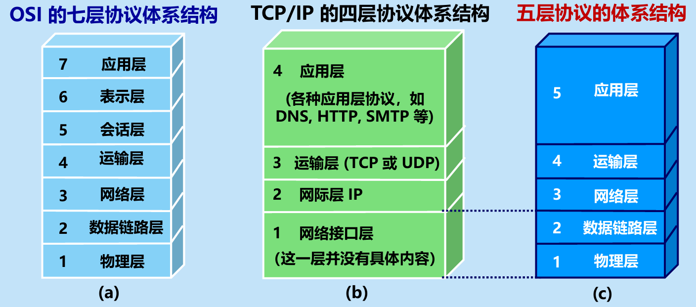
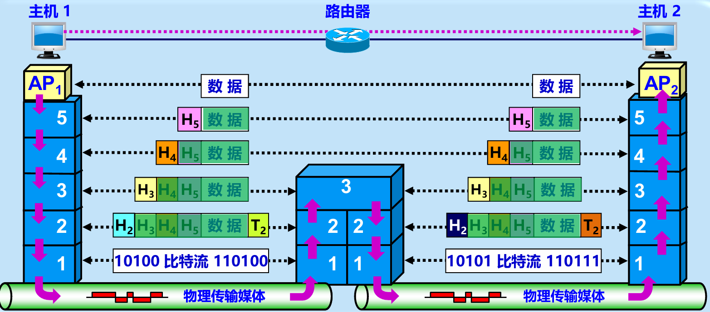
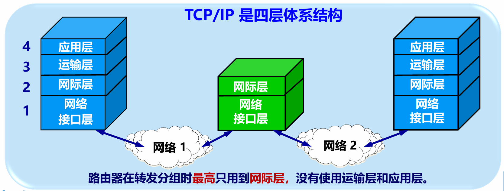

## 1.1 计算机网络在信息时代中的作用 📱

信息时代以网络为核心，呈现出**万物联网**和**人人用网**的特征。

### 1. 大众熟悉的三大类网络
*   📞 **电信网络**：提供电话、电报及传真等服务。
*   📺 **有线电视网络**：向用户传送各种电视节目。
*   💻 计算机网络：使用户能在计算机之间传送数据文件。**发展最快并起到核心作用**。
*   🔄 **三网融合**：将电信网络、有线电视网络融入现代计算机网络技术。

### 2. Internet：全球最大、最重要的计算机网络
*   **称呼演变**：“因特网”（推荐但未推广） ➡️ “互联网”（目前流行最广，事实上的标准译名）。
*   **基本特点（提供服务的基础）**：
    1.  连通性：上网用户间可便捷、经济地交换信息，仿佛直接连通。
    2.  资源共享：实现信息、软件、硬件共享，资源仿佛就在身边。

---

## 1.2 互联网概述 🌍

### 1.2.1 网络的网络
*   **网络**：由若干**节点**（计算机、集线器、交换机或路由器等）和连接节点的**链路**组成。把许多计算机连接在一起。
*   **互连网** (internetwork / internet)：把许多网络通过一些**路由器**相互连接起来，构成覆盖范围更大的计算机网络。即“网络的网络”。与网络相连的计算机常称为**主机**。
*   ☁️ **“云”表示法**：常用来表示网络，主机可以在“云”里，也可以在“云”外。

### 1.2.2 互联网基础结构发展的三个阶段 📈
1.  **第一阶段 (1969 – 1990)**：从单个网络 ARPANET 向互联网发展。
    *   初期 ARPANET 只是单个的分组交换网，不是互连网。
    *   **1983 年**，TCP/IP 协议成为标准，被视为互联网的诞生时间。
2.  **第二阶段 (1985 – 1993)**：建成**三级结构**的互联网。
    *   以美国国家科学基金网 NSFNET 为主，分为：主干网、地区网、校园网（或企业网）。
3.  **第三阶段 (1993 – 现在)**：全球范围的**多层次 ISP 结构**。
    *   ISP (互联网服务提供者)：提供接入互联网服务并收取费用。分为主干 ISP、地区 ISP 和本地 ISP。
    *   IXP (互联网交换点)：允许两个网络直接相连并快速交换分组（峰值吞吐量达 Tbit/s 级，常采用数据链路层交换机）。
    *   **内容提供者**：向用户提供视频等内容，**不向**用户提供互联网转接服务。

> 💡 **关键驱动力**：20世纪90年代 万维网 WWW (World Wide Web) 的问世（由 CERN 开发），成为了互联网指数级增长的主要驱动力。

### 1.2.3 互联网的标准化工作 📜
*   **组织架构**：互联网协会 ISOC ➡️ 互联网体系结构研究委员会 IAB ➡️ 下设 IRTF (研究部) 和 IETF (工程部)。
*   **标准发表形式**：RFC (Request For Comments，请求评论)。
    *   免费下载，任何人可发邮件提意见。
    *   **注意**：并非所有 RFC 都是标准，只有极少部分最后才能变成互联网标准。
*   **标准化过程**：互联网草案 ➡️ 建议标准 ➡️ 草案标准 ➡️ 互联网标准（记为 STDxx）。（还包含实验、信息、历史等非标准轨道）。

---

## 1.3 互联网的组成 🧩

从工作方式上看，互联网可划分为两大块：边缘部分 和 核心部分。

### 1.3.1 互联网的边缘部分 💻
由所有连接在互联网上的**主机**组成，又称为 端系统。
*   **作用**：由用户直接使用，用来进行通信和资源共享。
*   **端系统类型**：小到个人电脑、手机、摄像头，大到大型计算机或服务器。
*   **“计算机之间通信”的真正含义**：主机 A 的**某个进程**和主机 B 上的**另一个进程**进行通信。

**端系统之间的两种通信方式：**
1.  **客户-服务器方式 (C/S 方式)**：
    *   描述**服务和被服务**的关系。客户是请求方，服务器是提供方。
    *   客户程序：主动调用，需知道服务器地址，不需要复杂操作系统。
    *   服务器程序：一直不断被动运行，接受通信请求，需强大硬件和高级操作系统支持。
    *   建立连接后，通信是**双向**的。
2.  **对等连接方式 (P2P 方式)**：
    *   不区分服务请求方和提供方，只要运行了 P2P 软件即可进行**平等通信**。
    *   本质上仍是 C/S 方式，只是每个主机**既是客户又是服务器**。

### 1.3.2 互联网的核心部分 🖲️
由大量**网络**和连接这些网络的 路由器 组成。是最复杂的部分。
*   **作用**：为边缘部分提供连通性，使任何主机能相互通信。
*   **关键设备**：路由器 (router)，任务是实现分组交换，进行**分组转发**（核心部分最重要的功能）。

#### 📌 典型交换技术对比

**1. 电路交换 (Circuit Switching)**
*   **特点**：使用交换机连接大量电话。当N部电话机两两直接相连时，需要的电线对数公式为：
    $$ \boxed{\frac{N(N - 1)}{2}} $$
*   **三个阶段**：建立连接 ➡️ 通话 ➡️ 释放连接。
*   **缺点**：通话双方**始终占用**端到端的通信资源。计算机数据具有突发性，导致通信线路利用率极低（往往不到 10%）。

**2. 分组交换 (Packet Switching)** 🌟互联网采用
*   **原理**：采用 存储转发 技术。
*   **过程**：将较长的**报文**划分成较小的等长数据段 ➡️ 前面添加**首部**（包头）构成**分组**（包） ➡️ 发送端依次发送 ➡️ 路由器暂存、查表、转发 ➡️ 接收端剥去首部还原报文。
*   **路由器工作过程**：暂存分组 ➡️ 检查首部 ➡️ 查找转发表 ➡️ 找到合适接口转发。每个分组**独立选择**传输路径！
*   **优缺点剖析**：
    *   ✅ **高效**：动态分配带宽，逐段占用链路。
    *   ✅ **灵活**：独立选择最合适路由。
    *   ✅ **迅速**：不需建立连接就能发送。
    *   ✅ **可靠**：分布式多路由，生存性好。
    *   ❌ **问题**：排队延迟、不保证带宽、增加开销（控制信息、暂存维护）。

**3. 报文交换 (Message Switching)**
*   **特点**：整个报文进行存储转发，时延较长（几分钟到几小时）。
*   **现状**：现在已很少有人使用。

#### 📊 三种交换方式的比较总结
*   若**连续传送大量数据**且时间远大于连接建立时间：**电路交换**速率较快。
*   传送**突发数据**：**报文交换**和**分组交换**不需要预先分配带宽，信道利用率高。
*   **分组交换 vs 报文交换**：分组长度远小于报文，因此分组交换时延小，灵活性更好。

---

## 🛑 易错点 & 注意点提醒
1.  ⚠️ **互联网 vs 互连网**：
    *   互连网 (`internet`，小写 i)：泛指局部范围互连起来的计算机网络。
    *   互联网 (`Internet`，大写 I)：专指全球最大、最重要的特定计算机网络。两者**不划等号**（互联网 ≠ 互连网）。
2.  ⚠️ **网络的核心 vs 边缘**：
    *   **主机/端系统**属于边缘部分，功能是资源共享和数据处理。
    *   **路由器**属于核心部分，功能是**分组转发**和提供连通性。
3.  ⚠️ **P2P 的本质**：对等连接本质上依然在底层使用了客户/服务器（C/S）方式，千万不要以为它脱离了请求-响应的模型，只是角色的界限模糊了（互为客户和服务器）。
4.  ⚠️ **RFC 文档 ≠ 标准**：网上免费下载的所有 RFC 并非都是“标准”，其中包含了草案、历史、实验等不同阶段的文档，只有经过严格流程最终确定的极少数才是正式的互联网标准。
5.  ⚠️ **分组路径的不确定性**：在分组交换中，属于同一个报文的不同“分组”，它们在核心网中**可能走完全不同的路径**到达目的地（独立选择路由）。

## 1.4 计算机网络在我国的发展 🇨🇳

这一节主要简述了我国互联网事业的起步与繁荣过程：

*   **起步阶段**：1980年铁道部开始联网实验；1989年11月第一个公用分组交换网 CNPAC 建成。
*   **正式接入**：1994年4月20日，我国用 64 kbit/s 专线正式连入互联网，被国际上正式承认为接入互联网的国家。同年9月，中国公用计算机互联网 CHINANET 正式启动。
*   **五大公用计算机网络**（基于互联网技术且规模最大）：
    1.  中国电信互联网 CHINANET
    2.  中国联通互联网 UNINET
    3.  中国移动互联网 CMNET
    4.  中国教育和科研计算机网 CERNET（1994年建成我国首个 IPv4 主干网；2004年建成首个下一代互联网 CNGI 主干网 CERNET2 试验网）
    5.  中国科学技术网 CSTNET
*   **监管与发展**：中国互联网络信息中心 CNNIC 每年两次公布发展情况。到2019年底，国际出口带宽已超 8.8 Tbit/s。
*   **重大事件**：张朝阳创办搜狐(1996)，丁磊创办网易(1997)，王志东创办新浪(1998)，马化腾创立腾讯(1998)，李彦宏创建百度(2000)，马云创建阿里巴巴(1999)及淘宝、支付宝等。

---

## 1.5 计算机网络的类别 🗂️

### 1.5.1 计算机网络的定义
目前并未有严格统一的精确定义，但一个较好的定义是：
计算机网络主要是由一些通用的、**可编程的硬件**互连而成的，并非专门用来实现单一目的，能够传送多种不同类型的数据，并支持广泛的日益增长的应用。
> 💡 **如何理解“可编程的硬件”？**
> 表明这种硬件一定包含有 中央处理器 CPU（如一般计算机、智能手机、智能电视等）。

### 1.5.2 几种不同类别的计算机网络

**1. 按照网络的作用范围分类**
*   🌍 广域网 WAN：几十到几千公里（有时称为远程网），是互联网的核心部分。
*   🏙️ 城域网 MAN：一个城市的范围，约 5~50 公里。
*   🏢 局域网 LAN：较小范围（如 1 公里左右），通常采用高速通信线路。
*   📱 个人区域网 PAN：范围很小，约 10 米左右（无线形式称为 WPAN）。

**2. 按照网络的使用者分类**
*   公用网：按规定交纳费用即可使用的网络（公众网）。
*   专用网：为特殊业务工作需要而建造的网络。

**3. 用来把用户接入到互联网的网络**
*   🔌 接入网 AN：又称本地接入网或居民接入网。
*   **定位**：实际上是本地 ISP 所拥有的网络，它**既不是**互联网的核心部分，**也不是**互联网的边缘部分。是从用户端系统到本地 ISP 的**第一个路由器**（边缘路由器）之间的网络。从覆盖范围看多属于局域网。

---

## 1.6 计算机网络的性能 📊 （核心重点！）

网络性能通常通过以下 **7个重要性能指标** 来度量：

### 1. 速率
*   **含义**：**最重要**的一个性能指标。指数据的传送速率，也称数据率或比特率。
*   **单位**：bit/s（或 kbit/s、Mbit/s、Gbit/s等）。往往指**额定速率**或标称速率，非实际运行速率。
*   *课件单位换算设定*：千 = K = $2^{10}$ = 1024，兆 = M = $2^{20}$，吉 = G = $2^{30}$。1 字节 (Byte) = 8 比特 (bit)。

### 2. 带宽 (bandwidth)
*   **频域含义**：某信号具有的频带宽度，信道允许通过的信号频带范围。单位是**赫兹**（千赫、兆赫等）。
*   **时域含义**：网络某通道传送数据的能力，即单位时间内能通过的“最高数据率”。单位是 **bit/s**。
*   **关系**：两者本质相同。通信链路的“带宽”越宽，其所能传输的“最高数据率”也越高。

### 3. 吞吐量 (throughput)
*   **含义**：单位时间内通过某个网络的实际数据量。
*   **限制**：受网络的带宽或额定速率（绝对上限值）限制。可能会远小于额定速率甚至下降到零。

### 4. 时延 (delay 或 latency)
指数据从网络的一端传送到另一端所需的时间。由四部分组成：
*   **（1）发送时延（传输时延）**：发生在机器内部的发送器中。
    $$ \boxed{发送时延 = \frac{数据帧长度\ (bit)}{发送速率\ (bit/s)}} $$
*   **（2）传播时延**：发生在机器外部的传输信道媒体上，电磁波传播一定距离花费的时间。
    $$ \boxed{传播时延 = \frac{信道长度\ (米)}{信号在信道上的传播速率\ (米/秒)}} $$
    *(电磁波传播速率：自由空间 $3.0 \times 10^5$ km/s；铜线约 $2.3 \times 10^5$ km/s；光纤约 $2.0 \times 10^5$ km/s)*
*   **（3）处理时延**：主机/路由器处理分组（分析首部、提取数据、差错检验、查找路由）所花的时间。
*   **（4）排队时延**：分组在输入输出队列中排队等待的时间。通信量大时会发生队列溢出（丢包），相当于时延无穷大。

> 📝 **【分析举例 1】时延的计算与分析**
> **题目**：光纤链路长 1000 km，传播速率 $2.0 \times 10^5$ km/s。求以下情况的总时延（忽略处理和排队时延）：
> (1) 数据块 100 MB，带宽 1 Mbit/s
> (2) 数据块 100 MB，带宽 100 Mbit/s
> (3) 数据块 1 B，带宽 1 Mbit/s
> (4) 数据块 1 B，带宽 1 Gbit/s
> **解答**：
> 基础传播时延 = $1000 / (2.0 \times 10^5) = 0.005$ s = 5 ms。
> (1) 发送时延 = $\frac{100 \times 2^{20} \times 8}{10^6} \approx 838.9$ s。 总时延 $\approx 838.9$ s。
> (2) 发送时延 = $\frac{100 \times 2^{20} \times 8}{10^8} \approx 8.389$ s。 总时延 $\approx 8.394$ s。（相较(1)大幅缩小）
> (3) 发送时延 = $\frac{1 \times 8}{10^6} = 8\ \mu s$。总时延 = $0.008 + 5 = 5.008$ ms。
> (4) 发送时延 = $\frac{1 \times 8}{10^9} = 0.008\ \mu s$。总时延 = $0.000008 + 5 = 5.000008$ ms。（相较(3)基本无明显减小，此时传播时延占主导）。
> **结论**：不能笼统地认为“数据发送速率越高，传送的总时延就越小”，必须具体分析哪种时延占主导地位！

### 5. 时延带宽积
*   **公式**：$$ \boxed{时延带宽积 = 传播时延 \times 带宽} $$
*   **含义**：又称为以比特为单位的链路长度。链路像一条空心管道，该指标表示从发送端发出但尚未到达接收端的比特数（即管道充满时的比特数）。

### 6. 往返时间 RTT (Round-Trip Time)
*   **含义**：表示从发送方发送完数据，到发送方收到来自接收方的确认总共经历的时间。
*   包含：双倍的传播时延 + 接收方处理/排队时延 + 接收方发送确认的时延（互联网中还包括各中间结点的处理/排队/发送时延）。在卫星通信中 RTT 非常重要。

> 📝 **【分析举例 2】有效数据率的计算**
> **题目**：A将 100 MB 数据以 100 Mbit/s 的速率发给B，RTT = 2 s。A只有在收到B的确认后才能继续发送下一批数据。计算A向B发送数据的有效数据率。
> **解答**：
> 发送时延 = $\frac{100 \times 2^{20} \times 8}{100 \times 10^6} \approx 8.39$ s。
> $$ \boxed{有效数据率 = \frac{数据长度}{发送时间 + RTT}} = \frac{100 \times 2^{20} \times 8}{8.39 + 2} \approx 80.7\ \text{Mbit/s} $$

### 7. 利用率
*   包括信道利用率（有百分之几的时间有数据通过）和网络利用率（全网络信道利用率加权平均）。
*   **利用率与时延的关系**：根据排队论，当信道利用率增大时，该信道引起的时延会**急剧增加**。
    $$ \boxed{D = \frac{D_0}{1 - U}} $$
    *(其中 $D_0$ 是空闲时延，$D$ 是当前时延，$U$ 是当前利用率 $0 \le U < 1$)*

### 1.6.2 计算机网络的非性能特征
除了上述定量指标外，还包括：**费用、质量、标准化、可靠性、可扩展性和可升级性、管理和维护**。这些非性能特征与性能指标有很大关系。

---

## 🛑 易错点 & 注意点提醒
1.  ⚠️ **多处理机系统 ≠ 计算机网络**：若中央处理机之间距离非常近（如仅 1 米甚至更小），称为多处理机系统，不算作计算机网络。
2.  ⚠️ **发送时延 vs 传播时延**：这是极易混淆的概念！
    *   **发送时延**在网卡/发送器内部产生，与链路长度无关，只取决于数据块大小和网卡发送速率（带宽）。
    *   **传播时延**在网线/光纤上产生，与发送速率无关，只取决于介质物理长度和电磁波在介质中的传播速度。
3.  ⚠️ **“高速链路”的陷阱**：当我们说“在高速链路上，比特会传送得更快些”，这种说法是**绝对错误**的！提高链路带宽（发送速率）仅仅减小了**发送时延**（把数据推上信道的速度变快了），而电磁波在光纤中跑的速度（传播速率）并没有变快。

---

## 1.7 计算机网络体系结构 🏗️

### 1.7.1 计算机网络体系结构的形成
计算机网络是一个非常复杂的系统。两台计算机互相传送文件需要解决通路、激活、识别、状态确认、格式转换、差错处理等诸多问题。

*   **分层设计方法**：最初的 ARPANET 研制经验表明，解决庞大复杂的问题，应当采用 分层 的方法，将其转化为若干较小的局部问题。1974年 IBM 提出了 SNA 体系结构。
*   **两种国际标准**：由于不同公司网络体系结构不同，设备很难互连。
    1.  📜 **法律上的国际标准 (OSI/RM)**：ISO 提出的开放系统互连参考模型（七层协议），是个抽象概念，试图达到全球统一的理想境界。
    2.  🌍 **事实上的国际标准 (TCP/IP)**：获得了最广泛的应用。
*   **💡 为什么 ISO/OSI 失败了？**
    *   基于 TCP/IP 的互联网已抢先在全球成功运行。
    *   OSI 标准制定时**没有商业驱动力**，周期太长，设备无法及时进入市场。
    *   OSI 协议实现起来**过分复杂**，运行效率低。
    *   OSI 层次划分不太合理，功能在多层中重复。

### 1.7.2 协议与划分层次 📜
*   网络协议（简称为协议）：是为进行网络中的数据交换而建立的规则、标准或约定。
*   **协议的三个组成要素**：
    1.  语法：数据与控制信息的结构或格式。
    2.  语义：需要发出何种控制信息，完成何种动作以及做出何种响应。
    3.  同步：事件实现顺序的详细说明。
*   **协议的形式**：文字描述（便于人阅读）和 程序代码（让计算机理解）。不论哪种，都必须对信息交换过程做出**精确的解释**。
*   **分层的优缺点**：
    *   **优点**：各层之间独立、灵活性好、结构可分割、易于实现和维护、能促进标准化工作。
    *   **缺点**：有些功能会重复出现，产生额外开销。
*   **体系结构与实现的概念区分**：
    *   体系结构：是网络各层及其协议的集合，是功能的**精确定义**（是**抽象的**，不涉及实现）。
    *   实现：遵循体系结构前提下，用硬件或软件完成这些功能（是**具体的**，运行中的系统）。

### 1.7.3 具有五层协议的体系结构 🏢
为了教学和学习方便，综合 OSI（七层）和 TCP/IP（四层）的优点，采用一种只有五层协议的体系结构：

| 层次 | 名称 | 主要任务与功能 | 协议与数据单元 |
| :--- | :--- | :--- | :--- |
| **5** | **应用层** | 通过应用进程间的交互来完成特定网络应用。 | 协议：DNS, HTTP, SMTP 等。 数据单元：报文 |
| **4** | **运输层** | 负责向两台主机中**进程**之间提供通用的数据传输服务。具复用和分用功能。 | 协议：**TCP** (面向连接/可靠, 单元：报文段) **UDP** (无连接/尽最大努力, 单元：用户数据报) |
| **3** | **网络层** | 为不同**主机**提供通信服务。具体任务：**路由选择**和**转发**。 | 协议：**IP** (网际协议)。 数据单元：IP数据报 (或分组) |
| **2** | **数据链路层** | 实现两个**相邻节点**之间的可靠通信。发现差错即丢弃。 | 数据单元：帧 |
| **1** | **物理层** | 实现比特（0或1）的传输。确定引脚数量及连接方式。 | 数据单元：比特 |

#### 🔄 数据在各层之间的传递过程 (封装与解封装)
*   **发送端 (主机 1)**：数据自上而下传递。每经过一层，就加上该层的**首部**（链路层还要加上**尾部** $T_2$）。最后在物理层变成比特流传送。
*   **中间节点 (路由器)**：路由器在转发分组时，最高只用到 网络层（解封装到网络层查路由表，再重新封装转发），**没有使用运输层和应用层**。
*   **接收端 (主机 2)**：数据自下而上传递。每经过一层，剥去相应的首部（或尾部），最终将原始数据交付给应用进程。
*   **对等层通信**：OSI 模型将对等层之间传送的数据单位称为 协议数据单元 PDU。任何两层水平方向的虚线传递，即为“对等层”间的通信。

### 1.7.4 实体、协议、服务和服务访问点 🔗
这几个概念极易混淆，课件给出了明确界定：
*   实体：表示任何可发送或接收信息的硬件或软件进程。
*   协议：控制**两个对等实体**进行通信的规则的集合。（方向是**水平的**）
*   服务：在协议控制下，两个对等实体间的通信使得本层能够**向上一层提供服务**。上面的服务用户只能看见服务，看不见下面的协议。（方向是**垂直的**）
*   服务访问点 SAP：同一系统中相邻两层实体进行交互的逻辑接口。
*   服务数据单元 SDU：层与层之间交换的数据单位。SDU 可以与 PDU 不一样（可以合并或拆分）。
> ⚠️ 协议极其复杂：协议必须应付所有异常情况，不存在能让“蓝军 100% 获胜”的完美协议（说明在不可靠信道上实现完全可靠的通信逻辑是极其困难的）。

### 1.7.5 TCP/IP 的体系结构 ⏳

*   TCP/IP 是**四层体系结构**：应用层、运输层、网际层、网络接口层。
*   **沙漏计时器模型**：
    *   TCP/IP 协议族呈现沙漏形状，核心是底部的 **IP层**。
    *   Everything over IP：IP 层可以支持多种的运输层协议和应用。
    *   IP over Everything：IP 协议可以在多种类型的网络上运行（如以太网、Wi-Fi 等）。
    *   **设计理念**：网络核心部分越简单越好。
*   **工作方式**：互联网中客户-服务器工作方式，所有的应用层通信实际上都需要使用下面各层所提供的服务。

---

## 🛑 易错点 & 注意点提醒
1.  ⚠️ **物理层 vs 物理媒体**：**物理媒体**（如双绞线、同轴电缆、光缆、无线信道等）**并不在**物理层协议之内，而是在物理层协议的**下面**。物理层规定的是信号、接口、引脚等标准。
2.  ⚠️ **协议 vs 服务 的本质区别**：
    *   **协议**是“水平”的，是两台不同机器上第 $n$ 层实体之间交流的黑话。
    *   **服务**是“垂直”的，是同一台机器上第 $n$ 层为第 $n+1$ 层提供的功能，上一层不需要知道底层协议如何实现（透明性）。
3.  ⚠️ **路由器的工作层次**：经典的路由器主要工作在下三层（物理层、数据链路层、**网络层**）。它不关心运输层的端口号，也不关心应用层的具体数据。
4.  ⚠️ **数据链路层的特殊性**：在数据逐层封装时，只有 数据链路层 既要加首部（头），又要加尾部（$T_2$）。其他层仅加首部。

---

## 🌟 第 1 章：概述 核心知识大串讲与本章总结

第一章是整本《计算机网络》的基石，主要解决三个核心问题：**“网络是什么组成的？”**、**“网络是如何衡量好坏的？”**以及**“网络内部是如何组织分工的？”**。掌握本章，就等于拿到了后续深入学习各层协议的“指南针”。

整体来看，本章的知识体系可以归纳为以下三大逻辑主块：

### 🎯 逻辑主块一：宏观视角 —— 互联网的组成与运行机制
互联网在演进过程中（从单个网络走向多层次 ISP 结构），形成了极其经典的两大模块划分：

*   💻 **边缘部分**：由所有接入互联网的**主机（端系统）**组成。
    *   **核心任务**：供用户直接使用，进行通信和资源共享（本质是**进程间通信**）。
    *   **运行模式**：主要分为经典的 **客户/服务器 (C/S) 方式**（区分服务提供与请求）和平等的 **对等连接 (P2P) 方式**。
*   🖲️ **核心部分**：由大量网络和连接这些网络的**路由器**组成。
    *   **核心任务**：为边缘部分提供连通性服务。
    *   **核心技术**：互联网采用了 分组交换 (Packet Switching) 技术。
    *   **精髓**：发送端将报文切分为带有首部的“分组”，路由器采用**存储转发**机制，根据首部目的地址**独立选择路径**进行转发。这种方式比传统的电路交换更高效、灵活，但也引入了排队时延和额外开销。

### 📊 逻辑主块二：微观视角 —— 衡量网络性能的核心指标
要科学地评价一个网络，必须依赖客观的性能指标。这是本章**最重要的计算考点**：

1.  **速率**（数据率/比特率）与 **带宽**（最高数据率）：衡量网络传输能力的上限。
2.  **吞吐量**：网络实际传输的数据量。
3.  ⏱️ **时延 (Delay)**：本章的重中之重！它由四个部分拼接而成：
    *   **发送时延**（主机推数据上链路的时间，受**带宽**决定）
    *   **传播时延**（电磁波在介质中跑的时间，受**物理距离**决定）
    *   **处理时延**与**排队时延**（路由器内部耗时）。
    *   *⚠️ 核心考点：千万不能笼统认为“带宽越高总时延越小”，必须具体分析哪种时延占主导！*
4.  **时延带宽积**：传播时延 $\times$ 带宽，代表链路这个“空心管道”能容纳的比特数。
5.  **往返时间 RTT**：发送完数据到收到确认的总时间。
6.  **利用率**：利用率 $U$ 绝不是越高越好！根据排队论 $\boxed{D = \frac{D_0}{1 - U}}$，当利用率逼近 1 时，网络时延会急剧（指数级）增大。

### 🏗️ 逻辑主块三：结构视角 —— 计算机网络体系结构
为了应对极其复杂的网络通信问题，先驱们采用了**“分层”**的设计思想，将大问题化解为小问题，最终确立了现代网络的运作规则：

*   **两大概念的博弈**：法律上的国际标准 **OSI 七层模型**（因太复杂、无商业驱动而失败） vs 事实上的标准 **TCP/IP 四层模型**（广泛应用）。
*   **折中的教学模型**：五层协议的体系结构。
    1.  **应用层**：报文（特定网络应用，如 HTTP）
    2.  **运输层**：报文段/用户数据报（进程间通用通信，如 TCP/UDP）
    3.  **网络层（网际层）**：IP数据报（主机间路由选择与转发，如 IP）
    4.  **数据链路层**：帧（相邻节点间的可靠传输）
    5.  **物理层**：比特（0和1的底层物理传输）
*   **数据传递的本质**：发送方自上而下**逐层封装（加首部/尾部）**，接收方自下而上**逐层解封装**。路由器转发通常最高只解封装到网络层。
*   **三大抽象法则**：
    *   协议是“水平”的，是两台机器对等层实体间的通信规则（包含语法、语义、同步三要素）。
    *   服务是“垂直”的，是下层向上层提供的功能，通过**服务访问点 (SAP)** 进行逻辑交互。
    *   **体系结构**是抽象的功能定义，而**实现**是具体的软硬件。
