数据链路层在计算机网络体系结构中起着承上启下的关键作用。网络中的主机、路由器、交换机等都必须实现数据链路层。本章主要讨论两种信道的数据链路层：**点对点信道** 和 **广播信道**。
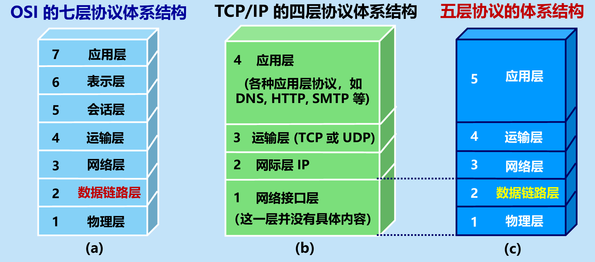
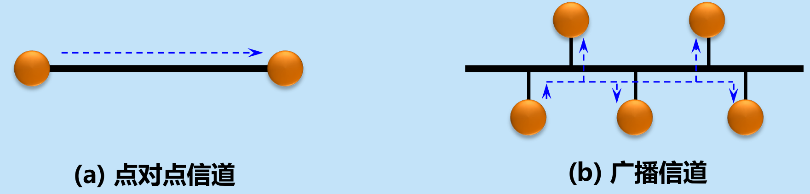

---

## 3.1 使用点对点信道的数据链路层 🛤️

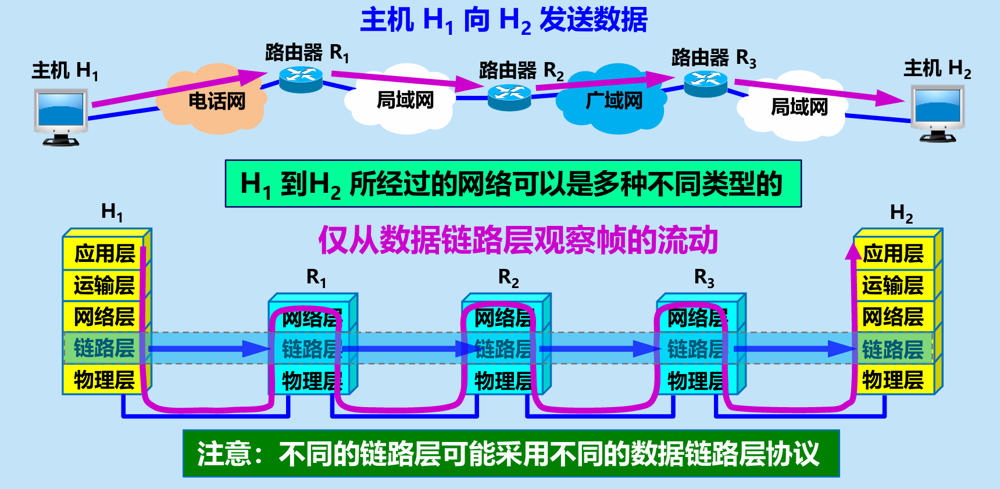

### 3.1.1 数据链路和帧
*   **链路 (Link)**：一条无源的点到点的物理线路段（物理链路）。
*   数据链路 (Data Link)：把实现控制数据传输的协议的硬件和软件加到链路上（逻辑链路）。典型实现是**适配器（网卡）**。
*   数据链路层的协议数据单元（PDU）是：帧。网络层的 IP 数据报在这一层被装入帧中传输。
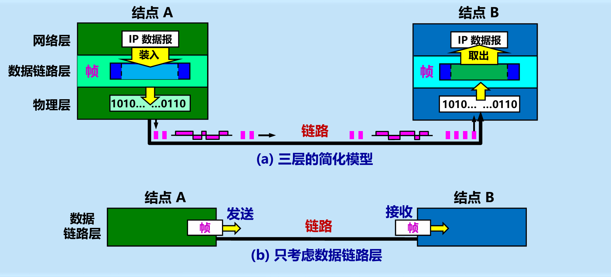
### 3.1.2 三个基本问题 🎯
数据链路层必须解决以下三个基本问题：

**1. 封装成帧 (Framing)**
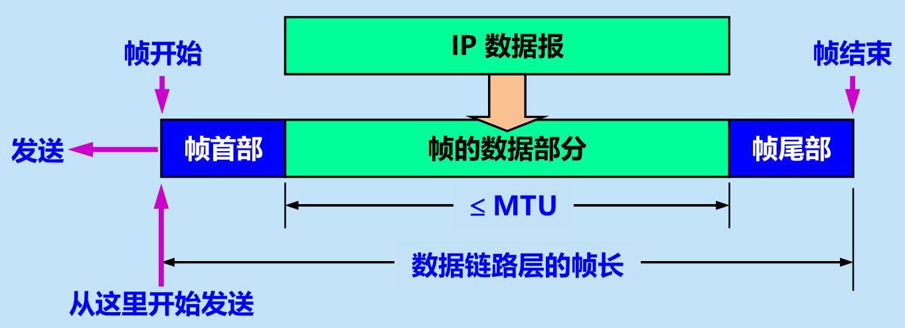
*   在一段数据的前后分别添加首部和尾部，构成一个帧。首尾的重要作用是进行帧定界。
*   **最大传送单元 MTU**：规定了所能传送的帧的**数据部分**长度上限。
*   控制字符 `SOH` (0x01) 表示帧开始，`EOT` (0x04) 表示帧结束。

**2. 透明传输**
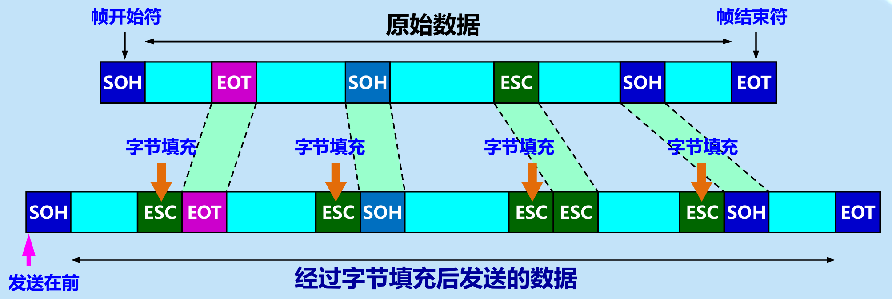
*   **问题**：如果数据中恰好出现了和 `SOH` 或 `EOT` 一样的二进制代码，会被错误地当作帧边界。
*   **透明**：指无论发送什么样比特组合的数据，都能按照原样没有差错地通过。
*   **解决（字节填充法）**：在数据中出现的控制字符前插入转义字符 `ESC`。如果数据中有 `ESC`，则在前面再加一个 `ESC`。

**3. 差错检测**
*   传输过程中可能会产生比特差错（1变0，0变1）。
*   **误码率 BER**：传输错误的比特占总比特的比率。
*   循环冗余检验 CRC (Cyclic Redundancy Check)：
* 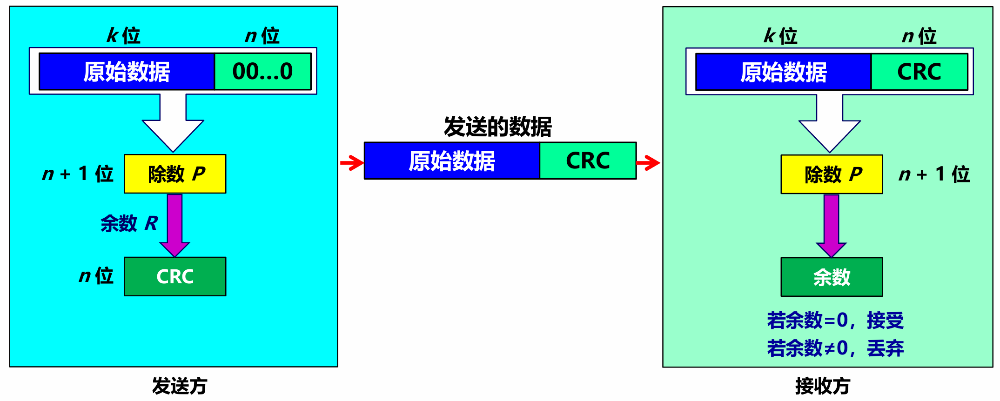
    *   **原理**：在 $k$ 位数据后面添加 $n$ 位冗余码（FCS），组成 $(k+n)$ 位发送。
    *   **计算步骤**：
        1.  用二进制模2运算进行 $2^n \times M$ 的运算（即在原数据 $M$ 后加 $n$ 个0）。
        2.  将结果除以收发双方事先约定的 $(n+1)$ 位除数 $P$。
        3.  得到的 $n$ 位余数 $R$ 就是帧检验序列 FCS。
    *   **接收端**：将收到的帧除以除数 $P$，若 $\text{余数} = 0$ 则接受，若 $\text{余数} \neq 0$ 则丢弃。

📝 **CRC 计算示例**：
> 原始数据 $M = 101001$，除数 $P = 1101$ ($n=3$)
> 1. 加 3 个 0：被除数为 $101001000$
> 2. 模2除法：$101001000 \div 1101$
> 3. 得到商 $Q = 110100$，余数 $R = 001$
> 4. 发送数据：$101001001$

 ⚠️ **易错点提醒**：
 *   **CRC 与 FCS 的区别**：CRC 是一种检错**方法**，而 FCS 是添加在数据后面的**冗余码**。
 *   **可靠传输的区别**：仅用 CRC 只能做到无比特差错（接收的帧均无差错，有差错的都被丢弃了），但这**不是可靠传输**（无法解决帧丢失、重复、失序）。要实现可靠传输，还需加上帧编号、确认和重传机制。

---

## 3.2 点对点协议 PPP 🤝

对于点对点链路，目前使用最广泛的是 PPP (Point-to-Point Protocol)。用户到 ISP 的链路就使用 PPP 协议。

### 3.2.1 PPP 协议的组成
1.  一个将 IP 数据报封装到串行链路的方法。
2.  一个链路控制协议 **LCP**（建立、配置和测试数据链路连接）。
3.  一套网络控制协议 **NCP**（支持不同的网络层协议）。

### 3.2.2 PPP 协议的帧格式
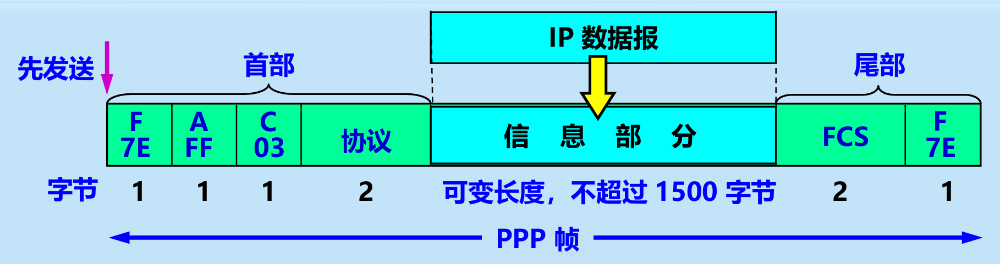
*   **首部**：包含标志字段 `F = 0x7E`，地址字段 `A = 0xFF`，控制字段 `C = 0x03`，以及 2 字节的**协议字段**（0x0021代表IP数据报，0xC021代表LCP数据等）。
*   **尾部**：包含 2 字节 FCS 和 标志字段 `F = 0x7E`。
*   **透明传输机制**：
    *   **异步传输**：使用字节填充法（遇到 0x7E 变为 0x7D, 0x5E 等）。
    *   **同步传输**：使用零比特填充法（发送端只要发现 5 个连续的 1，就立即填入一个 0；接收端发现 5 个连续的 1 后，将后面的 0 删除）。
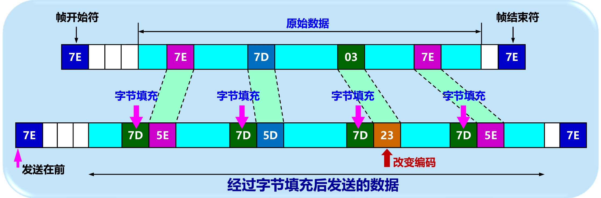

### 3.2.2 PPP 协议的工作状态

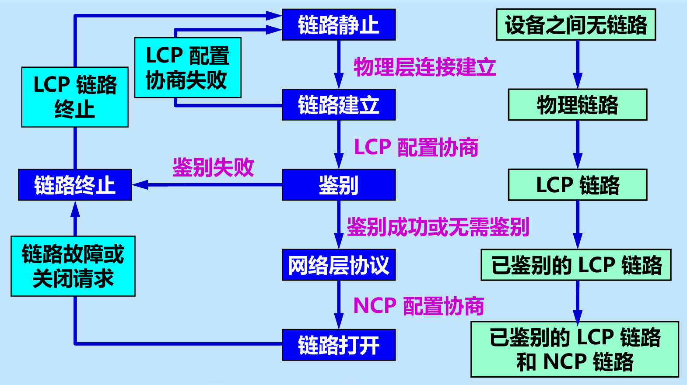
 1. 链路静止 (Link Dead)

- **状态：** 这是 PPP 的初始状态，也是最终归宿。此时**设备之间无链路**，没有任何物理连接。
    
- **转换：** 当外部事件触发（例如硬件检测到载波信号或接通了物理线路），**物理层连接建立**后，状态机就会转移到**链路建立**阶段。
    

 2. 链路建立 (Link Establish)

- **状态：** 此时底层的**物理链路**已经存在。
    
- **动作：** 通信双方开始进行 **LCP 配置协商**。LCP（链路控制协议）负责建立、配置和测试数据链路连接。双方会协商最大接收单元（MRU）、是否需要身份验证以及使用何种验证协议等关键参数。
    
- **结果：**  如果协商失败（**LCP 配置协商失败**），状态会直接回退到**链路静止**。  如果协商成功，**LCP 链路**建立完成，状态进入**鉴别**阶段。
    

 3. 鉴别 (Authenticate)

- **状态：** LCP 通道已打通。这是一个可选阶段，用于验证请求连接方的身份，常用的 PAP 或 CHAP 鉴别协议就是在这个阶段工作的。
    
- **结果：**  如果**鉴别失败**，连接会被立即掐断，进入**链路终止**状态。 如果**鉴别成功或无需鉴别**，该链路升级为**已鉴别的 LCP 链路**，状态机顺利进入**网络层协议**阶段。
    

 4. 网络层协议 (Network-Layer Protocol)

- **状态：** 链路已经过身份验证，准备好对接上层网络。
    
- **动作：** 开始 **NCP 配置协商**。由于 PPP 可以支持多种网络层协议，NCP（网络控制协议）负责针对特定的网络层进行参数配置。例如，最常见的是使用 IPCP 协议来为拨号端动态分配 IP 地址。
    
- **转换：** 当 NCP 协商成功后，标志着**已鉴别的 LCP 链路和 NCP 链路**均已就绪，状态进入**链路打开**。
    

 5. 链路打开 (Link Open)

- **状态：** 这是 PPP 链路的正式工作阶段。此时网络层的数据报（如 IP 数据报）可以在 PPP 链路上自由地双向传输。
    
- **转换：** 链路会一直保持开启传输数据的状态，直到发生物理**链路故障或收到关闭请求**（例如系统主动断开连接），此时会触发状态转移至**链路终止**。
    

 6. 链路终止 (Link Terminate)

- **状态：** 链路正在被清理和拆除。
    
- **动作：** 双方交换 **LCP 链路终止**报文，优雅地关闭网络层和数据链路层的连接，而不是直接拔网线式的物理断开。
    
- **转换：** LCP 链路彻底终止后，系统释放资源，状态机重新回到初始的**链路静止**状态，等待下一次连接的建立。

---

## 3.3 使用广播信道的数据链路层 (局域网) 📢

局域网 (LAN) 具有广播功能，最典型的是以太网 (Ethernet)。为了解决共享信道的冲突问题，以太网采用动态媒体接入控制中的随机接入协议。局域网数据链路层被划分为 **LLC（逻辑链路控制）** 和 **MAC（媒体接入控制）** 两个子层。

### 3.3.1 局域网的数据链路层
**共享信道带来的问题**：若多个设备在共享的广播信道上同时发送数据， 则会造成彼此干扰，导致发送失败若多个设备在共享的广播信道上同时发送数据， 则会造成彼此干扰，导致发送失败。
**媒体共享技术**：
* 静态划分信道： 1. 频分复用 2. 时分复用 3. 波分复用 4. 码分复用 
* 动态媒体接入控制（多点接入）： 1. 随机接入：所有的用户可随机地发送信息。 2. 受控接入：用户必须服从一定的控制。如轮询(polling)。
**以太网的两个标准**：
* DIX Ethernet V2：世界上第一个局域网产品（以太网）的规约。
* IEEE 802.3：第一个 IEEE 的以太网标准。
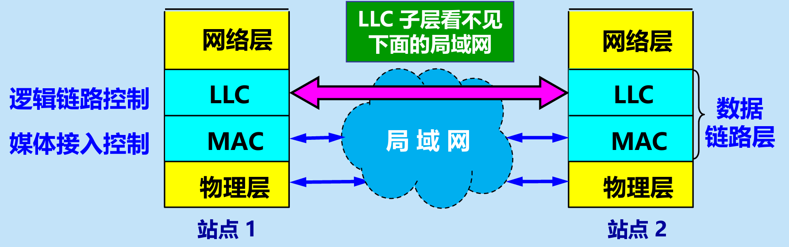
**网卡**：
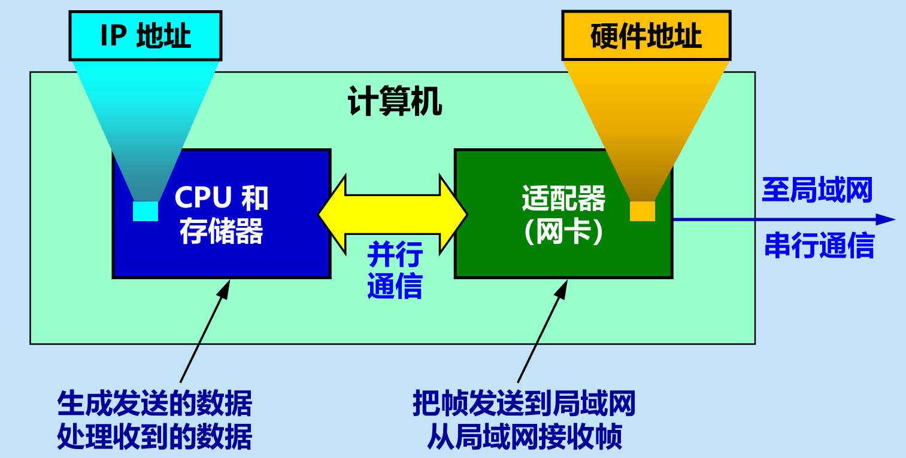
*   功能：串行/并行转换、数据缓存、实现以太网协议。
*   计算机通过适配器和局域网进行通信，MAC 地址固化在网卡的 ROM 中。

### 3.3.2 核心协议：CSMA/CD 协议 💥
CSMA/CD (Carrier Sense Multiple Access with Collision Detection) 即 **载波监听多点接入 / 碰撞检测**。
*   **多点接入**：总线型网络。
*   **载波监听**：发送前和发送中不停检测信道（边发送边监听）。
*   **碰撞检测**：检测电压摆动值，超过门限即认为发生碰撞。
*   **工作方式**：半双工（不能同时发送和接收）。

**碰撞后的处理机制**：
1.  **强化碰撞**：立即停止发送，并发送 32 或 48 bit 的人为干扰信号。
2.  **争用期 (碰撞窗口)**：端到端往返时延 $2\tau$。以太网规定为 $51.2 \mu s$。经过争用期未发生碰撞，则本次发送肯定不会碰撞。
3.  **最短有效帧长**：由于争用期存在，以太网规定最短帧长为 64 字节。小于此长度的帧均为异常冲突的无效帧。
4.  **退避算法**：采用截断二进制指数退避算法。
    *   基本退避时间 $= 2\tau$。
    *   参数 $k = \min[\text{重传次数}, 10]$。
    *   从 $[0, 1, \dots, 2^k - 1]$ 中随机取 $r$，重传时延 $= r \times 2\tau$。
    *   重传 16 次失败则丢弃并向高层报错。

### 3.3.3 以太网的信道利用率 📈
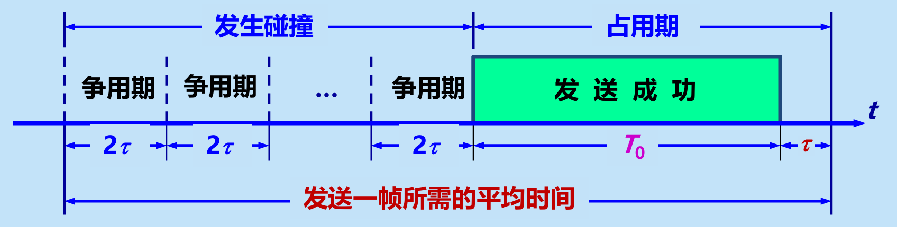
*   发送一帧占用信道时间为：发送时间 $T_0$ + 传播时延 $\tau$。
*   定义参数 $a$：
    $$ \boxed{ a = \frac{\tau}{T_0} } $$
*   信道利用率极限值 $S_{max}$：
    $$ \boxed{ S_{max} = \frac{T_0}{T_0 + \tau} = \frac{1}{1 + a} } $$
*   为提高利用率，$a$ 必须尽可能小（即网线长度受限，帧长不能太短）。

### 3.3.4 以太网的 MAC 层 🏷️
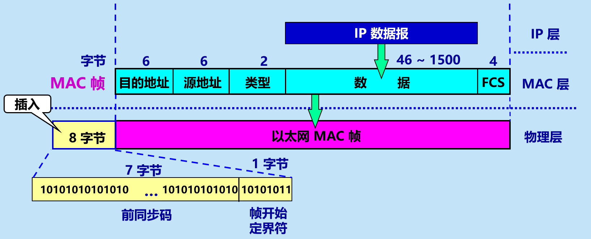
*   **MAC 地址**：48 位（6字节），前 24 位为 OUI（厂家标识），后 24 位为扩展标识。分为单播、多播、广播地址。
*   **MAC 帧格式 (以太网 V2 标准)**：
    *   目的地址 (6B) + 源地址 (6B) + 类型 (2B) + 数据 (46~1500B) + FCS (4B)。
    *   物理层会在帧前插入 **8字节**（7字节前同步码 + 1字节帧开始定界符）以实现比特同步。
    *   若数据不足 46 字节，需加入**填充字段**，保证 MAC 帧长不小于 64 字节。
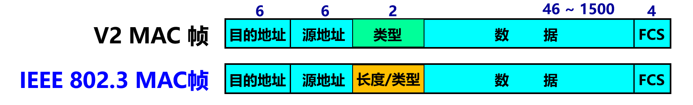
---

## 3.4 扩展的以太网 🌐

### 3.4.1 在物理层扩展
*   使用**集线器 (Hub)**：扩大了物理范围，但碰撞域（冲突域）也随之增大，总吞吐量未提高。
* **集线器**：集线器工作在 OSI 模型的**物理层（Layer 1）**。它下·是一个信号放大和复制器。当它从一个端口收到电信号时，会毫无保留地把信号广播（复制）到除了接收端口之外的所有其他端口。

### 3.4.2 在数据链路层扩展（重点）
*   使用以太网交换机 (Switch)：
    *   **实质**：多接口网桥。
    *   **特点**：每个接口都是一个独立的**碰撞域**；支持全双工；具有并行性，独占传输媒体带宽。
    *   **自学习功能**：通过内部的交换表（MAC地址表）进行硬件转发。
        *   收到帧后，记录 `源MAC地址 -> 接收端口`。
        *   查找目的 MAC 地址：若表中没有，则向除接收端口外的所有端口**广播（泛洪）**；若表中有且端口不同，则直接**转发**；若端口相同，则**丢弃**。
*   **回路问题与 STP**：冗余链路会导致广播风暴。使用生成树协议 STP 逻辑上切断环路，形成树状结构。

📝 **交换机自学习示例**：
> 假设S1(连A,B)与S2(连E)互连。交换表初始为空。
> 1. A 向 B 发帧：S1 记录 `A -> 端口1`，转发给 B；S2 没收到。
> 2. C 向 E 发帧：S1 记录 `C -> 端口2`，泛洪传给 S2；S2 记录 `C -> 接收端口` 并泛洪给 E。
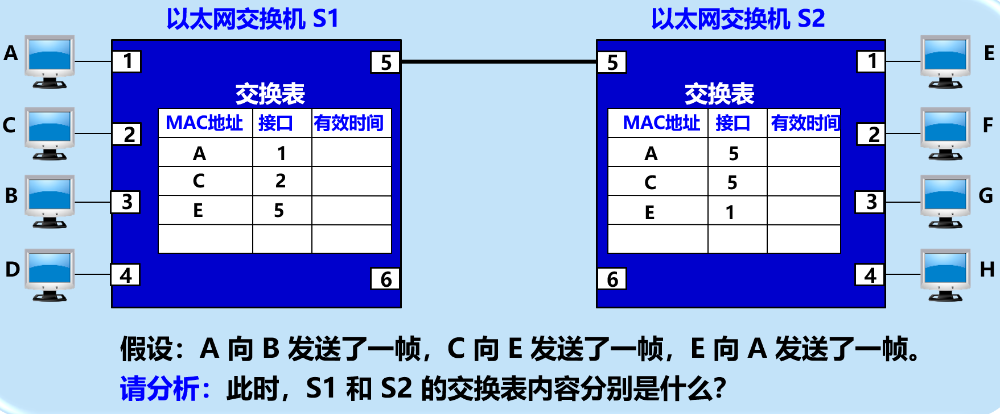

### 3.4.3 虚拟局域网 VLAN 🛡️
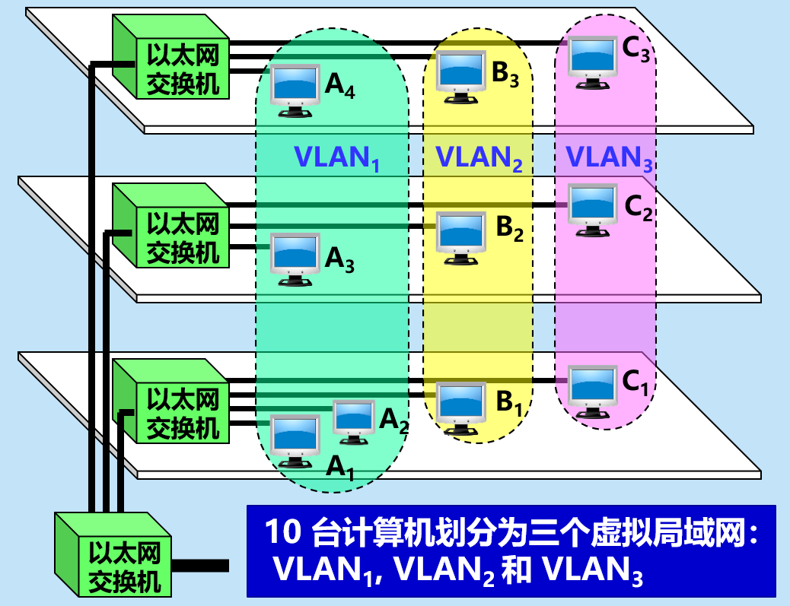
*   **痛点**：所有计算机同属一个广播域，易产生广播风暴，安全性差。
*   **VLAN 定义**：一种服务，限制了接收广播信息的工作站数。每个 VLAN 是一个独立的广播域。
*   **划分方法**：基于端口（最简单常见）、基于 MAC 地址、基于协议类型、基于 IP 子网等。
*   **802.1Q 帧**：在标准以太网帧的源地址后插入 **4 字节的 VLAN 标记**。最大帧长变为 1522 字节。

---

## 3.5 高速以太网 🚀

1.  **100BASE-T (快速以太网)**：100 Mbit/s，保持 MAC 格式不变，全双工不使用 CSMA/CD，半双工使用。
2.  **吉比特以太网 (1G)**：1 Gbit/s，向后兼容。为在半双工下保持 64 字节最小帧长和 100 米网段，引入了 载波延伸（不足512字节填满）和 分组突发（第一个帧延伸后，后续短帧接连发送）。
3.  **10 吉比特以太网 (10GE)**：万兆，**只使用光纤**，**只工作在全双工方式**，不再使用 CSMA/CD 协议。
4.  **宽带接入**：目前光纤宽带 (FTTx) 或 ADSL 均广泛使用 **PPPoE**（在以太网上运行 PPP 协议）进行接入。

---

## 📚 本章学习总结

本章是计算机网络中极为重要的一章，重点考察数据链路层如何在不同网络环境下实现帧的可靠定位与传输。核心要点如下：
1.  **基本概念**：牢记数据链路层的三大问题：封装成帧（定界）、透明传输（字符填充/零比特填充）、差错检测（CRC的模2除法）。
2.  **MAC 协议机制**：深入理解 **CSMA/CD** 的运作流程，特别是 **冲突检测、争用期 ($2\tau$)、最短帧长 (64字节) 和 二进制指数退避算法** 的计算与关联。
3.  **设备对比**：清晰区分**集线器（物理层，扩大碰撞域）** 和 **交换机（链路层，隔离碰撞域，不隔离广播域）**。掌握交换机的**自学习算法**流程。
4.  **VLAN 技术**：理解 VLAN 的本质是**隔离广播域**，掌握 802.1Q 标签的插入位置及其对帧长的影响。