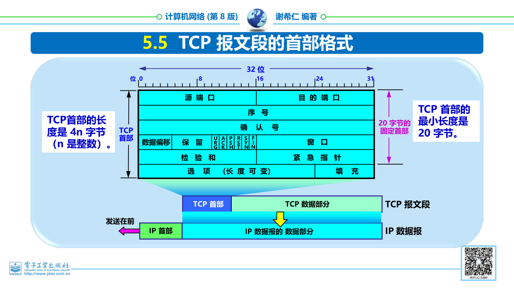
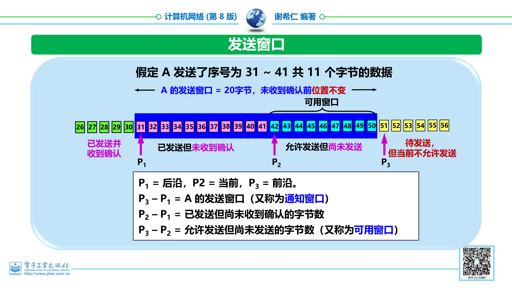
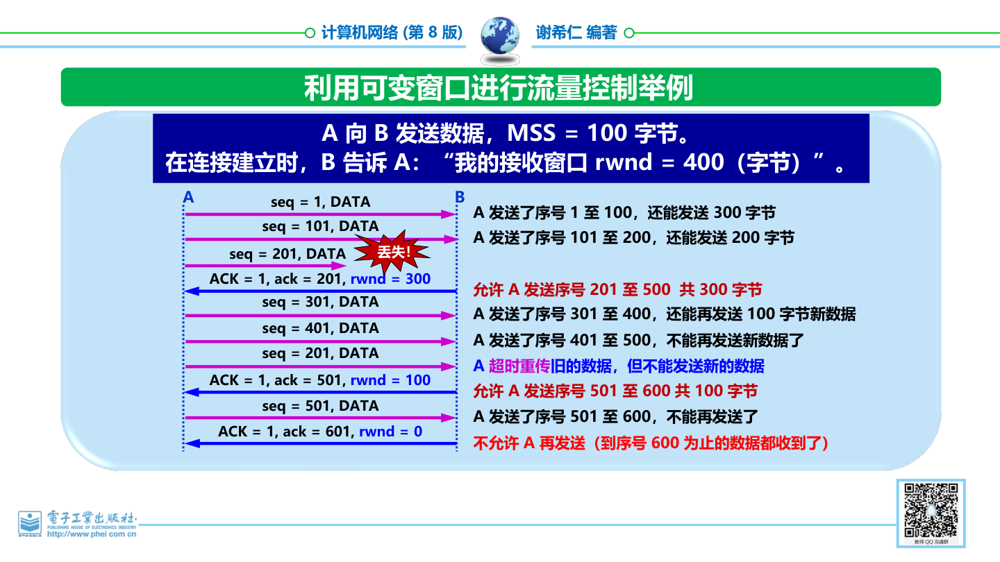
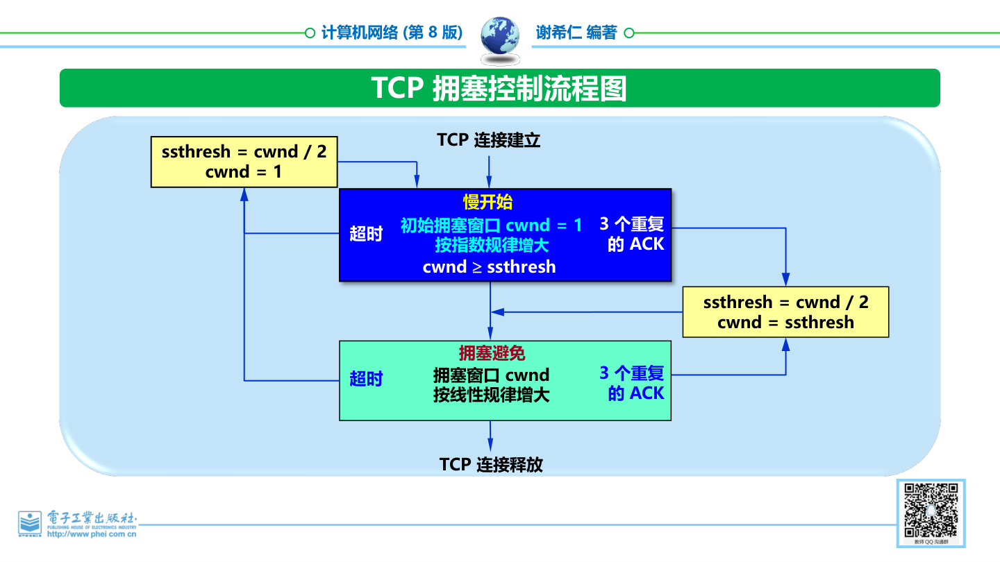
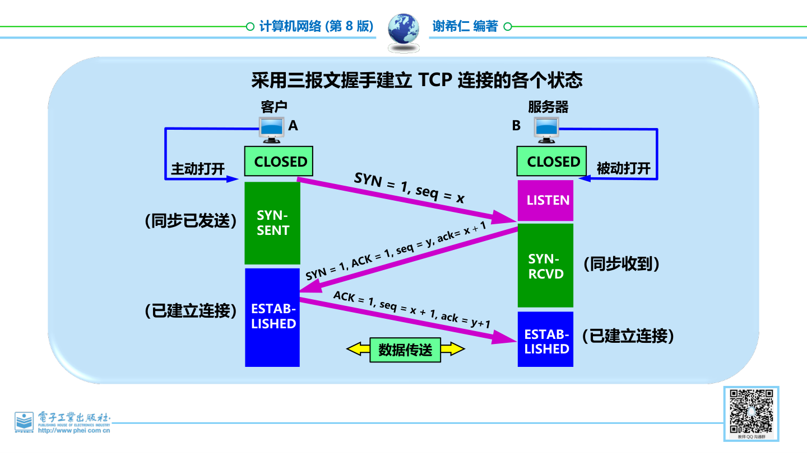
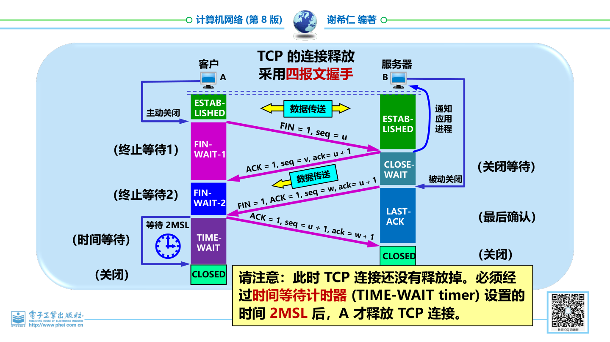

## 5.1 运输层协议概述 📘

### 5.1.1 进程之间的通信

- **位置与作用**：运输层位于计算机网络体系结构中面向通信部分的最高层，同时也是用户功能中的最低层 。它属于边缘部分中的主机实现和使用，而网络核心中的路由器不实现运输层 。
    
- **逻辑通信**：
    
    - 网络层为主机之间的通信提供服务 。
        
    - 运输层为应用层进程之间的通信提供服务 ，提供的是应用进程间的逻辑通信 。
        
- **屏蔽作用**：运输层向高层用户屏蔽了下面网络核心的细节（如网络拓扑、所采用的路由选择协议等），使应用进程看见的就是好像在两个运输层实体之间有一条端到端的逻辑通信信道 。
    
- **信道类型**：
    
    - 使用面向连接的协议（如 TCP）提供全双工可靠信道 。
        
    - 使用无连接的协议（如 UDP）提供不可靠信道 。
        

### 5.1.2 运输层的两个主要协议 📦

互联网的正式标准中，运输层有两个主要协议：

1. **用户数据报协议 UDP**
    
2. **传输控制协议 TCP**
    

**运输协议数据单元 (TPDU)**：两个对等运输实体在通信时传送的数据单位 。

- TCP 传送的数据单位协议是 **TCP报文段** 。
    
- UDP 传送的数据单位协议是 **UDP报文** 或 **用户数据报** 。
    

|**特性**|**UDP**|**TCP**|
|---|---|---|
|**连接性**|传送数据之前不需要先建立连接|提供面向连接的运输服务|
|**可靠性**|收到 UDP 报后不需要给出任何确认；不提供可靠交付，但是一种最有效的工作方式|提供可靠的运输服务|
|**广播/多播**|支持|不提供广播或多播服务|
|**开销**|首部开销小|开销较多|

**典型应用及对应协议**：

- **UDP 应用**：域名解析(DNS)、动态主机配置(DHCP)、路由选择(RIP)、文件传输(TFTP)、流式多媒体通信专用协议等 。
    
- **TCP 应用**：万维网(HTTP)、电子邮件(SMTP)、文件传送(FTP)、远程终端接入(TELNET)等 。
    

### 5.1.3 运输层的端口 🔌

- 复用：应用进程都可以通过运输层再传送到 IP 层（网络层） 。
    
- 分用：运输层从 IP 层收到发送给应用进程的数据后，必须分别交付给指明的各应用进程 。
    

**端口的设定**： 为了解决由于进程的创建和撤销都是动态的而导致发送方无法直接识别进程的问题，运输层把端口设为通信的抽象终点 。

- **软件端口与硬件端口**：软件端口是协议栈层间的抽象的协议端口，是应用层进程与运输实体进行层间交互的地点；而硬件端口是不同硬件设备进行交互的接口 。
    
- 端口用一个 **16位** 端口号进行标志，允许有 $65,535$ 个不同的端口号 。
    
- 端口号只具有本地意义，只是为了标志本计算机应用层中的各进程；在互联网中，不同计算机的相同端口号没有联系 。
    

📌 **注意点**：两个计算机中的进程要互相通信，不仅必须知道对方的端口号，而且还要知道对方的 IP 地址 。

**两大类、三种类型的端口**：

1. **服务器端使用的端口号**：
    
    - **熟知端口**（全球通用端口号）：$0 \sim 1023$，由 IANA 负责分配 。
        
        - _常见熟知端口_：FTP (21), Telnet (23), SMTP (25), DNS (53), TFTP (69), HTTP (80), SNMP (161), HTTPS (443) 。
            
    - **登记端口**：$1024 \sim 49151$，需在 IANA 登记 。
        
2. **客户端使用的端口号**：
    
    - **短暂端口**：$49152 \sim 65535$，通信结束后，被系统收回 。
        

---

## 5.2 用户数据报协议 UDP 🚀

### 5.2.1 UDP 概述

UDP 只在 IP 的数据报服务之上增加了一些功能：**复用和分用** 以及 **差错检测** 。

**UDP 的主要特点**：

1. **无连接**：发送数据之前不需要建立连接 。
    
2. **尽最大努力交付**：即不保证可靠交付 。
    
3. 面向报文：UDP 一次传送和交付一个完整的报文 。发送方 UDP 对应用层交下来的报文，既不合并也不拆分，按照原样发送；接收方 UDP 对 IP 层交上来的 UDP 用户数据报，去除首部后就原封不动地交付上层的应用进程 。
    
4. **没有拥塞控制**：网络出现的拥塞不会使源主机的发送速率降低，很适合多媒体通信的要求 。
    
5. **支持灵活的交互**：支持一对一、一对多、多对一、多对多等交互通信 。
    
6. **首部开销小**：只有8个字节 。
    
7. **总结**：UDP 通信的特点是简单方便，但不可靠 。
    

⚠️ **易错点提醒**：应用程序必须选择合适大小的报文。若报文太长，IP 层在传送时可能要进行分片，降低 IP 层的效率；若报文太短，会使 IP 数据报的首部的相对长度太大，同样降低 IP 层的效率 。

### 5.2.2 UDP 的首部格式 🏷️

UDP 用户数据报由 **首部** 和 **数据** 两个部分组成 。 首部字段仅有 **8个字节**，由4个字段组成，每个字段均为 **2个字节** ：

1. **源端口**：需要对方回信时选用。不需要时可用全0 。
    
2. **目的端口**：终点交付报文时必须使用 。UDP 接收方正是根据首部中的目的端口号，把报文通过相应的端口上交给应用进程；如果发现目的端口号不正确，就丢弃该报文，并由 ICMP 发送“端口不可达”差错报文给发送方 。
    
3. **长度**：UDP 用户数据报的长度，其最小值是8（仅有首部） 。
    
4. **检验和**：检测 UDP 用户数据报在传输中是否有错。有错就丢弃 。
    

**UDP 检验和计算规则**： 在计算检验和时，会临时把 12 字节的 伪首部 和 UDP 用户数据报连接在一起 。伪首部仅仅是为了计算检验和，包含：源 IP 地址(4字节)、目的 IP 地址(4字节)、全0(1字节)、协议号 17(1字节)、UDP长度(2字节) 。UDP 的检验和是把首部和数据部分一起都检验 。

📝 **示例题目：计算 UDP 检验和** 在运算过程中，参与计算的部分包括12字节伪首部、8字节UDP首部以及数据 。若数据长度不是偶数个字节，还要在数据后填充全0（填充部分不发送） 。

按照二进制反码运算求和的方式进行相加计算 。 假设所有16位二进制数相加得出的结果为：

$$\text{求和得出的结果} = \text{1001011011101101}$$

将得出的结果求反码，即可得到检验和填入 UDP 首部中：

$$\boxed{\text{检验和} = \text{0110100100010010}}$$

## 5.3 传输控制协议 TCP 概述 🌐

### 5.3.1 TCP 最主要的特点 🌟

- **连接导向**：TCP 是面向连接的运输层协议 。在无连接的、不可靠的 IP 网络服务基础之上提供可靠交付的服务 。
    
- **端到端通信**：每一条 TCP 连接只能有两个端点 (endpoint)，因此每一条 TCP 连接只能是点对点的（一对一） 。
    
- **服务质量**：TCP 提供可靠交付的服务 。
    
- **通信模式**：TCP 提供全双工通信 。
    
- **传输方式**：TCP 是面向字节流的 。
    
    - TCP 中的“流”指的是流入或流出进程的字节序列 。
        
    - 虽然应用程序和 TCP 的交互是一次一个数据块，但 TCP 把应用程序交下来的数据看成仅仅是一连串无结构的字节流 。
        
    - TCP 不关心应用进程一次把多长的报文发送到 TCP 缓存 。
        
        
    - TCP 根据对方给出的窗口值和当前网络拥塞程度来决定一个报文段应包含多少个字节，从而形成 TCP 报文段 。
        

⚠️ **易错点提醒**：TCP 不保证接收方应用程序所收到的数据块和发送方应用程序所发出的数据块具有对应大小的关系 。但是，接收方应用程序收到的字节流必须和发送方应用程序发出的字节流完全一样 。

### 5.3.2 TCP 的连接 🔗

- TCP 把连接作为最基本的抽象 。
    
- 每一条 TCP 连接有两个端点 。这个端点被叫作套接字 (socket) 或插口 。
    

**套接字的定义与公式**：

$$\boxed{\text{套接字 socket} = (\text{IP地址}:\text{端口号})}$$

每一条 TCP 连接唯一地被通信两端的两个端点（即两个套接字）所确定 ：

$$\text{TCP 连接} ::= \{\text{socket}_1, \text{socket}_2\} = \{(\text{IP}_1:\text{port}_1), (\text{IP}_2:\text{port}_2)\}$$

📌 **注意点**：TCP 连接就是由协议软件所提供的一种抽象 。同一个 IP 地址可以有多个不同的 TCP 连接 ；同一个端口号也可以出现在多个不同的 TCP 连接中 。

**Socket 的多种含义**：

1. 应用编程接口 API 称为 socket API，简称为 socket 。
    
2. socket API 中使用的一个函数名也叫作 socket 。
    
3. 调用 socket 函数的端点称为 socket 。
    
4. 调用 socket 函数时其返回值称为 socket 描述符，可简称为 socket 。
    
5. 在操作系统内核中连网协议的 Berkeley 实现，称为 socket 实现 。
    

---

## 5.4 可靠传输的工作原理 🛡️

IP 网络提供的是不可靠的传输 。

- **理想传输条件的特点**：1. 传输信道不产生差错 ；2. 不管发送方以多快的速度发送数据，接收方总是来得及处理收到的数据 。
    
- 在理想传输条件下，不需要采取任何措施就能够实现可靠传输 。但实际网络都不具备理想传输条件，因此必须使用一些可靠传输协议，在不可靠的传输信道实现可靠传输 。
    

### 5.4.1 停止等待协议 ⏳

- **基本原理**：每发送完一个分组就停止发送，等待对方的确认。在收到确认后再发送下一个分组 。
    
- 1. 无差错情况：A 发送完分组 $M_1$ 后就暂停发送，等待 B 的确认 (ACK) 。B 收到 $M_1$ 向 A 发送 ACK 。A 在收到了对 $M_1$ 的确认后，就再发送下一个分组 $M_2$ 。
    
- **2. 出现差错**：
    
    - 接收方 B 检测出差错就丢弃，或者分组在传输过程中丢失，这两种情况下 B 都不会发送任何信息 。
        
    - **解决方法：超时重传** 。A 为每一个已发送的分组设置一个超时计时器 。只要在超时计时器到期之前收到了相应的确认，就撤销该超时计时器，继续发送下一个分组 。若在规定时间内没收到确认，就认为分组错误或丢失，重发该分组 。
        
- **3. 确认丢失和确认迟到**：
    
    - **确认丢失**：B 发送的确认丢失，A 超时后重传。B 收到重复分组后采取两个行动：(1) 丢弃这个重复的分组，不向上层交付 ；(2) 向 A 发送确认 。
        
    - **确认迟到**：B 的确认迟到，A 超时重传。B 收到重复分组后丢弃，并重传确认分组 。A 收到重复的确认也会作丢弃处理 。
        

**信道利用率计算公式**：

$$\boxed{U = \frac{T_D}{T_D + \text{RTT} + T_A}}$$

当往返时间 $\text{RTT}$ 远大于分组发送时间 $T_D$ 时，信道的利用率会非常低 。该协议的优点是简单，缺点是信道利用率太低 。

**停止等待协议要点总结**：

- 每次只发送一个分组，收到确认后再发下一个 。
    
- 发送方必须暂存已发送的分组的副本，以备重发 。
    
- 对发送的每个分组和确认都进行编号 。
    
- 设置超时计时器，超时重传时间应当比数据在分组传输的平均往返时间更长一些，防止不必要的重传 。
    

### 5.4.2 连续 ARQ 协议 🌊

为了提高传输效率，采用了流水线传输：在收到确认之前，发送方连续发出多个分组 。由于信道上一直有数据不间断地传送，可获得很高的信道利用率 。

- **发送窗口**：发送方维持一个发送窗口，位于发送窗口内的分组都可以被连续发送出去，而不需要等待对方的确认 。
    
- **发送窗口滑动**：发送方每收到一个确认，就把发送窗口向前滑动一个分组的位置 。
    
- **累积确认**：接收方对按序到达的最后一个分组发送确认，表示到这个分组为止的所有分组都已正确收到了 。
    
    - **优点**：容易实现，即使确认丢失也不必重传 。
        
    - **缺点**：不能向发送方反映出接收方已经正确收到的所有分组的信息 。
        

⚠️ **机制缺陷提醒**：连续 ARQ 协议采用 Go-back-N（回退 N），表示需要再退回来重传已发送过的 N 个分组 。因此，当通信线路质量不好时，连续 ARQ 协议会带来负面的影响 。

---

## 5.5 TCP 报文段的首部格式 🧩

TCP 虽然是面向字节流的，但 TCP 传送的数据单元是 **TCP 报文段**。一个 TCP 报文段分为 **首部** 和 **数据** 两部分，TCP 的全部功能都体现在首部中各字段的作用。

TCP 报文段首部的前 $20$ 个字节是固定的，后面有 $4n$ 个字节是根据需要增加的选项，$n$ 是整数。因此：

$$\boxed{\text{TCP 首部最小长度}=20\text{ 字节}}$$

### 5.5.1 固定首部字段 📌

1. **源端口和目的端口**：各占 $2$ 字节。端口是运输层与应用层的服务接口，运输层的复用和分用功能通过端口实现。
    
2. **序号**：占 $4$ 字节。TCP 连接中传送的数据流中的每一个字节都有一个序号，序号字段的值指的是本报文段所发送数据的第一个字节的序号。
    
3. **确认号**：占 $4$ 字节，是期望收到对方下一个报文段的数据的第一个字节的序号。
    
    $$\boxed{\text{若确认号}=N,\ \text{则表示到序号 }N-1\text{ 为止的所有数据都已正确收到}}$$
    
4. **数据偏移**：占 $4$ 位，指出 TCP 报文段的数据起始处距离 TCP 报文段起始处有多远。它的单位是 $32$ 位字，也就是以 $4$ 字节为计算单位。数据偏移实际上就是 TCP 首部长度。
    
5. **保留**：占 $6$ 位，保留为今后使用，但目前应置为 $0$。
    
6. **窗口**：占 $2$ 字节。窗口值告诉对方：从本报文段首部中的确认号算起，接收方目前允许对方发送的数据量，单位是字节。
    
7. **检验和**：占 $2$ 字节，检验范围包括首部和数据两部分。计算检验和时，要在 TCP 报文段前面加上 $12$ 字节的伪首部。
    
8. **紧急指针**：占 $2$ 字节。仅在 $URG=1$ 时有效，指出本报文段中紧急数据的字节数，紧急数据结束后就是普通数据。
    

### 5.5.2 控制位 🚦

TCP 首部中有若干控制位，用来表示报文段的特殊含义：

|控制位|含义|
|---|---|
|$URG$|紧急指针有效，表示报文段中有紧急数据，应尽快传送|
|$ACK$|确认号字段有效。只有 $ACK=1$ 时，确认号字段才有效|
|$PSH$|推送。接收 TCP 收到 $PSH=1$ 的报文段后，应尽快交付接收应用进程|
|$RST$|复位。$RST=1$ 表明 TCP 连接中出现严重差错，必须释放连接再重新建立|
|$SYN$|同步。用于连接建立|
|$FIN$|终止。用于释放连接|

📌 **注意点**：  
当 $SYN=1, ACK=0$ 时，表示这是一个连接请求报文段；当 $SYN=1, ACK=1$ 时，表示这是一个连接接受报文段。

### 5.5.3 选项与填充 🧱

- **选项**：长度可变，最长可达 $40$ 字节。TCP 最初只规定了一种选项，即 最大报文段长度 MSS。
    
- **填充**：使整个 TCP 首部长度是 $4$ 字节的整数倍。
    

**最大报文段长度 MSS** 是 TCP 报文段中数据字段的最大长度，与接收窗口值没有关系。

$$\boxed{\text{TCP 报文段长度}=\text{数据字段长度}+\text{TCP 首部长度}}$$

$$\boxed{\text{MSS}=\text{TCP 报文段长度}-\text{TCP 首部长度}}$$

MSS 不能太小，否则网络利用率降低；也不能太大，否则 IP 层传输时可能要分片，终点还要装配。分片传输出错时，要重传整个分组。因此 MSS 应尽可能大，但要保证在 IP 层传输时不再分片。

⚠️ **易错点提醒**：MSS 是 TCP 报文段中 **数据字段** 的最大长度，不是整个 TCP 报文段的最大长度，也不是接收窗口值。

### 5.5.4 示例题目：序号的计算 📝

现有 $5000$ 个字节的数据。假设报文段的最大数据长度为 $1000$ 个字节，初始序号为 $1001$，则各报文段序号如下：

|报文段|序号|数据字节序号范围|
|---|---:|---|
|报文段 1|$1001$|$1001 \sim 2000$|
|报文段 2|$2001$|$2001 \sim 3000$|
|报文段 3|$3001$|$3001 \sim 4000$|
|报文段 4|$4001$|$4001 \sim 5000$|
|报文段 5|$5001$|$5001 \sim 6000$|

📌 **注意点**：TCP 的序号按字节编号。某报文段的序号不是报文段编号，而是该报文段数据部分第一个字节的序号。

---

## 5.6 TCP 可靠传输的实现 🧷

TCP 使用流水线传输和滑动窗口协议实现高效、可靠的传输。与前面连续 ARQ 中按分组滑动不同，TCP 的滑动窗口是 以字节为单位 的。

### 5.6.1 以字节为单位的滑动窗口 🪟

发送方和接收方分别维持一个发送窗口和一个接收窗口：

- **发送窗口**：在没有收到确认的情况下，发送方可以连续把窗口内的数据全部发送出去。凡是已经发送过的数据，在未收到确认之前都必须暂时保留，以便超时重传。
    
- **接收窗口**：只允许接收落入窗口内的数据。
    

发送方 A 根据接收方 B 给出的窗口值，构造自己的发送窗口。发送窗口里的序号表示允许发送的序号。窗口越大，发送方就可以在收到确认前连续发送更多数据，可能获得更高的传输效率。

假定 A 的发送窗口为 $20$ 字节，并发送了序号 $31 \sim 41$ 共 $11$ 个字节的数据。设：

- $P_1$：发送窗口后沿。
    
- $P_2$：当前发送位置。
    
- $P_3$：发送窗口前沿。
    

则有：

$$\boxed{P_3-P_1=\text{发送窗口大小}}$$

$$\boxed{P_2-P_1=\text{已发送但尚未收到确认的字节数}}$$

$$\boxed{P_3-P_2=\text{允许发送但尚未发送的字节数，即可用窗口}}$$

### 5.6.2 接收窗口与累积确认 📬

若 B 收到了序号为 $32$ 和 $33$ 的数据，但未收到序号为 $31$ 的数据，那么 B 发送的确认报文段中的确认号仍是 $31$，表示期望收到序号 $31$ 的字节。

TCP 要求接收方具有 累积确认 的功能，以减小传输开销。接收方可以在合适的时候发送确认，也可以在自己有数据要发送时把确认信息顺便捎带上。

⚠️ **易错点提醒**：确认号表示“期望收到的下一个字节序号”。即使后面的字节已经到达，只要前面缺了某个字节，确认号仍停留在缺失字节的位置。

### 5.6.3 发送缓存与接收缓存 🧺

**发送缓存** 中暂时存放两类数据：

1. 发送应用程序传送给发送方 TCP、准备发送的数据。
    
2. TCP 已发送出但尚未收到确认的数据。
    

发送窗口通常只是发送缓存的一部分。若发送太快，发送缓存会溢出。

**接收缓存** 中暂时存放两类数据：

1. 按序到达但尚未被接收应用程序读取的数据。
    
2. 未按序到达的数据。
    

若接收应用程序不能及时读取，接收缓存最终会被填满，使接收窗口减小到零；如果能够及时读取，接收窗口就可以增大，但最大不能超过接收缓存的大小。

### 5.6.4 超时重传时间的选择 ⏱️

TCP 发送方在规定时间内没有收到确认，就要重传已发送的报文段。但重传时间不能设置得太短，也不能太长：

- 太短：会引起很多不必要的重传，使网络负荷增大。
    
- 太长：会使网络空闲时间增大，降低传输效率。
    

TCP 采用自适应算法，记录一个报文段发出的时间以及收到相应确认的时间，两者之差就是报文段的往返时间 $RTT$。

**加权平均往返时间 $RTT_S$** 又称为平滑的往返时间：

$$\boxed{\text{新的 }RTT_S=(1-\alpha)\times \text{旧的 }RTT_S+\alpha\times \text{新的 }RTT\text{ 样本}}$$

其中 $0 \le \alpha < 1$。当 $\alpha \to 0$ 时，$RTT$ 值更新较慢；当 $\alpha \to 1$ 时，$RTT$ 值更新较快。课件中给出推荐值：

$$\boxed{\alpha=\frac{1}{8}=0.125}$$

**超时重传时间 $RTO$** 应略大于加权平均往返时间 $RTT_S$：

$$\boxed{RTO=RTT_S+4\times RTT_D}$$

其中 $RTT_D$ 是 $RTT$ 偏差的加权平均值：

$$\boxed{\text{新的 }RTT_D=(1-\beta)\times \text{旧的 }RTT_D+\beta\times |RTT_S-\text{新的 }RTT\text{ 样本}|}$$

课件中给出推荐值：

$$\boxed{\beta=\frac{1}{4}=0.25}$$

### 5.6.5 Karn 算法与修正 🛠️

往返时间 $RTT$ 的测量很复杂。若某个报文段超时后进行了重传，之后收到确认时，发送方无法判断这个确认是对原报文段的确认，还是对重传报文段的确认。

**Karn 算法**：在计算平均往返时间 $RTT$ 时，只要报文段重传了，就不采用其往返时间样本。

但这样又会带来新问题：当报文段时延突然增大很多时，原来的重传时间内收不到确认，于是发生重传；但重传样本又不被采用，导致超时重传时间无法更新，造成很多不必要的重传。

**修正的 Karn 算法**：报文段每重传一次，就把 $RTO$ 增大一些。

$$\boxed{\text{新的 }RTO=\gamma\times \text{旧的 }RTO}$$

课件中给出的典型值为：

$$\boxed{\gamma=2}$$

当不再发生报文段重传时，才根据报文段的往返时延更新平均往返时延 $RTT$ 和超时重传时间 $RTO$。

### 5.6.6 选择确认 SACK 🎯

问题：若接收方收到的报文段无差错，只是未按序号，中间还缺少一些序号的数据，能不能只传送缺少的数据，而不重传已经正确到达接收方的数据？

解决方法是 选择确认 SACK。

使用 SACK 时，原来首部中的确认号用法仍然不变，仍然是累积确认；只是 TCP 首部中增加 SACK 选项，用来报告收到的不连续字节块的边界。

📌 **边界含义**：

$$\boxed{\text{左边界}=\text{字节块第一个字节的序号}}$$

$$\boxed{\text{右边界}=\text{字节块最后一个字节的序号}+1}$$

### 5.6.7 示例题目：SACK 的字节块边界 📝

假设最大报文段长度 $MSS=5000$ 字节，起始序号为 $1$。接收方收到了和前面字节流不连续的两个字节块：

- 第一个字节块：$1501 \sim 3000$。
    
- 第二个字节块：$3501 \sim 4500$。
    

此时缺少的字节是 $1001 \sim 1500$、$3001 \sim 3500$、$4501 \sim 5000$。因此确认报文中的累积确认号仍为：

$$\boxed{\text{确认号}=1001}$$

SACK 选项报告的边界为：

$$\boxed{L_1=1501,\ R_1=3001,\ L_2=3501,\ R_2=4501}$$

---

## 5.7 TCP 的流量控制 🚰

### 5.7.1 利用滑动窗口实现流量控制 🪟

流量控制 的目的，是让发送方的发送速率不要太快，使接收方来得及接收。TCP 可以利用滑动窗口机制很方便地实现对发送方的流量控制。

在 TCP 报文段中，接收方通过窗口字段告诉发送方当前还能接收多少数据。例如：

1. B 发送 $ack=201,\ rwnd=300$，表示允许 A 发送序号 $201 \sim 500$ 共 $300$ 字节。
    
2. B 发送 $ack=501,\ rwnd=100$，表示允许 A 发送序号 $501 \sim 600$ 共 $100$ 字节。
    
3. B 发送 $ack=601,\ rwnd=0$，表示到序号 $600$ 为止的数据都收到了，但暂时不允许 A 再发送新数据。
    

📌 **注意点**：窗口值是动态变化的，接收方缓存空间变大，窗口可以增大；接收方缓存空间变小，窗口可以减小，甚至变为零。

### 5.7.2 零窗口与持续计时器 ⏲️

若接收方发送了零窗口通知，发送方就不能再发送新数据。此时可能发生死锁：如果接收方后来窗口变大，但这个窗口更新通知丢失，发送方会一直等待，接收方也一直等发送方发送数据。

为打破这种僵局，TCP 使用 持续计时器：

- 只要 TCP 连接的一方收到对方的零窗口通知，就启动持续计时器。
    
- 持续计时器到期后，发送一个零窗口探测报文段，课件中说明该报文段仅携带 $1$ 字节的数据。
    
- 对方在确认这个探测报文段时给出当前窗口值。
    
- 若窗口仍然为零，就重新设置持续计时器；若窗口不是零，死锁僵局就被打破。
    

### 5.7.3 TCP 的传输效率 ⚙️

控制 TCP 发送报文段的时机，有三种机制：

1. TCP 维持一个变量，它等于最大报文段长度 MSS。只要缓存中存放的数据达到 MSS 字节，就组装成一个 TCP 报文段发送出去。
    
2. 由发送方应用进程指明要求发送报文段，即 TCP 支持的推送操作。
    
3. 发送方的计时器期限到了，这时就把当前已有的缓存数据装入报文段，但长度不能超过 MSS。
    

### 5.7.4 糊涂窗口综合症 🧃

糊涂窗口综合症 指每次仅发送 $1$ 个字节或很少几个字节的数据时，有效数据传输效率很低的现象。

课件例子中，若有效数据只有 $1$ 字节，而 TCP 首部为 $20$ 字节、IP 首部为 $20$ 字节，则形成 $41$ 字节长的 IP 数据报：

$$\boxed{\text{有效数据传输效率}=\frac{1}{41}=2.44\%}$$

**发送方产生糊涂窗口综合症的原因**：发送方 TCP 每次接收到 $1$ 字节的数据后就立即发送。解决方法是使用 Nagle 算法：先发送第一个数据字节，随后等待确认；若收到确认，或缓存数据已达到发送窗口一半，或已达到报文段最大长度，再发送缓存中的数据。

**接收方产生糊涂窗口综合症的原因**：接收方应用进程消耗数据太慢，例如每次只读取 $1$ 字节，导致接收方不断通告很小的窗口。

解决方法：让接收方等待一段时间，使接收缓存已有足够空间容纳一个最长的报文段，或者等到接收缓存已有一半空闲空间。只要出现两种情况之一，接收方再发出确认报文，并通知当前窗口大小。

⚠️ **易错点提醒**：糊涂窗口综合症既可能由发送方造成，也可能由接收方造成。发送方要避免发送很小的报文段，接收方也不要在缓存刚刚空出一点小空间时就急忙通知很小的窗口。

---

## 5.8 TCP 的拥塞控制 🚦

### 5.8.1 拥塞控制的一般原理 🌐

在某段时间，若网络中对某资源的需求超过该资源所能提供的可用部分，网络性能就会明显变坏，整个网络的吞吐量会随输入负荷增大而下降，这种现象称为 拥塞。最坏结果是系统崩溃。

出现网络拥塞的条件是：

$$\boxed{\sum \text{对资源的需求}>\text{可用资源}}$$

拥塞产生的原因包括：

- 节点缓存容量太小。
    
- 链路容量不足。
    
- 处理机处理速率太慢。
    
- 拥塞本身会进一步加剧拥塞。
    

📌 **注意点**：简单增加某一种资源不一定能解决拥塞，甚至可能使网络性能更坏。例如只增大缓存而不提高输出链路容量和处理机速度，会使排队等待时间大大增加，引起大量超时重传。

### 5.8.2 拥塞控制与流量控制的区别 🧭

|比较项|拥塞控制|流量控制|
|---|---|---|
|控制目的|防止过多数据注入网络，避免路由器或链路过载|抑制发送端发送速率，使接收端来得及接收|
|作用范围|全局性的过程，涉及主机、路由器以及影响网络性能的因素|点对点通信量控制，是端到端的问题|
|关注对象|网络的承载能力|接收方的接收能力|

### 5.8.3 开环控制与闭环控制 🔁

- **开环控制**：设计网络时事先考虑周全，力求工作时不发生拥塞。思路是避免拥塞；但系统运行起来后，不再中途进行改正。
    
- **闭环控制**：基于反馈环路，根据网络当前运行状态采取相应控制措施。思路是在发生拥塞后采取措施进行控制，消除拥塞。
    

闭环控制通常包括三个步骤：

1. 监测网络系统，检测拥塞在何时、何处发生。
    
2. 将拥塞发生的信息传送到可采取行动的地方。
    
3. 调整网络系统运行，以解决出现的问题。
    

可用于监测拥塞的指标包括：因缺少缓存空间而丢弃的分组百分数、平均队列长度、超时重传的分组数、平均分组时延、分组时延的标准差等。

### 5.8.4 TCP 的拥塞控制方法 🧠

TCP 采用基于滑动窗口的方法进行拥塞控制，属于闭环控制方法。发送方维持一个 拥塞窗口 $cwnd$，其大小取决于网络拥塞程度，并动态变化。

发送窗口大小不仅取决于接收方窗口 $rwnd$，还取决于网络拥塞状况：

$$\boxed{\text{发送窗口的上限值}=\min(rwnd,\ cwnd)}$$

控制拥塞窗口变化的原则是：

- 只要网络没有出现拥塞，拥塞窗口就可以增大一些，以便发送更多分组，提高网络利用率。
    
- 只要网络出现拥塞或有可能出现拥塞，就必须减小拥塞窗口，减少注入网络的分组数。
    

发送方判断拥塞采用隐式反馈：

- **超时重传计时器超时**：表示网络已经出现拥塞。
    
- **收到 3 个重复确认**：预示网络可能会出现拥塞。
    

TCP 拥塞控制算法包括：慢开始、拥塞避免、快重传、快恢复。

### 5.8.5 慢开始 🐢

慢开始的目的是探测网络的负载能力或拥塞程度。它由小到大逐渐增大注入网络中的数据字节，也就是逐渐增大拥塞窗口 $cwnd$。

拥塞窗口每次增加量为：

$$\boxed{\Delta cwnd=\min(N,\ SMSS)}$$

其中 $N$ 是原先未被确认、但现在被刚收到的确认报文段所确认的字节数，$SMSS$ 是发送方的最大报文段长度。

在常见示例中，若初始 $cwnd=1$ 个报文段，则每经过一个传输轮次，拥塞窗口按指数规律增长：

$$1 \rightarrow 2 \rightarrow 4 \rightarrow 8 \rightarrow \cdots$$

📌 **注意点**：慢开始的“慢”指一开始设置得很小，而不是增长速度慢。实际增长是按指数规律增加。

### 5.8.6 传输轮次与慢开始门限 🧮

一个 传输轮次 所经历的时间其实就是往返时间 $RTT$。传输轮次强调：把拥塞窗口 $cwnd$ 所允许发送的报文段都连续发送出去，并收到了对已发送的最后一个字节的确认。

慢开始门限 $ssthresh$ 用来防止拥塞窗口增长过大而引起网络拥塞：

- 当 $cwnd < ssthresh$ 时，使用慢开始算法。
    
- 当 $cwnd > ssthresh$ 时，停止使用慢开始算法，改用拥塞避免算法。
    
- 当 $cwnd = ssthresh$ 时，既可使用慢开始算法，也可使用拥塞避免算法。
    

### 5.8.7 拥塞避免 📈

拥塞避免的目的，是让拥塞窗口 $cwnd$ 缓慢增大，避免出现拥塞。每经过一个往返时间 $RTT$，不管期间收到多少确认，发送方的拥塞窗口增加 $1$：

$$\boxed{cwnd=cwnd+1}$$

这具有加法增大的特点，使拥塞窗口按线性规律缓慢增长。

⚠️ **易错点提醒**：拥塞避免并不是完全避免拥塞，而是让拥塞窗口增长得缓慢些，使网络不容易出现拥塞。

### 5.8.8 出现拥塞时的处理 🧯

无论在慢开始阶段还是拥塞避免阶段，只要发送方判断网络出现拥塞，即重传定时器超时，就执行：

$$\boxed{ssthresh=\max\left(\frac{cwnd}{2},\ 2\right)}$$

$$\boxed{cwnd=1}$$

然后执行慢开始算法。这样做的目的是迅速减少主机发送到网络中的分组数，使发生拥塞的路由器有足够时间处理队列中积压的分组。

### 5.8.9 示例题目：慢开始与拥塞避免 📝

课件示例中，TCP 连接初始化时：

$$cwnd=1,\quad ssthresh=16$$

1. 开始执行慢开始，$cwnd$ 按 $1,2,4,8,16$ 增长。
    
2. 当 $cwnd$ 增长到 $ssthresh=16$ 时，改为执行拥塞避免，$cwnd$ 按线性规律增长。
    
3. 当 $cwnd=24$ 时出现超时，发送方判断网络拥塞，于是：
    
    $$\boxed{ssthresh=\frac{24}{2}=12,\quad cwnd=1}$$
    
4. 重新进入慢开始，直到 $cwnd=ssthresh=12$，再改为拥塞避免。
    

### 5.8.10 快重传与快恢复 ⚡

**快重传** 的目的是让发送方尽早知道发生了个别报文段丢失。发送方只要连续收到三个重复确认，就立即进行重传，这样就不会等到超时。

快重传要求接收方立即发送确认，即使收到了失序报文段，也要立即发出对已收到报文段的重复确认。

📌 **注意点**：快重传并不是取消重传计时器，而是在某些情况下可以更早地重传丢失的报文段。

**快恢复**：当发送端收到连续三个重复确认时，不执行慢开始算法，而是执行快恢复：

1. 慢开始门限变为当前拥塞窗口的一半。
    
    $$\boxed{ssthresh=\frac{cwnd}{2}}$$
    
2. 拥塞窗口进行乘法减小。
    
    $$\boxed{cwnd=ssthresh}$$
    
3. 执行拥塞避免算法，使拥塞窗口缓慢线性增大。
    

课件示例中，当 $cwnd=16$ 时收到 $3$ 个重复确认，执行快重传和快恢复：

$$\boxed{ssthresh=\frac{16}{2}=8,\quad cwnd=8}$$

### 5.8.11 主动队列管理 AQM 🧰

TCP 拥塞控制和网络层采取的策略有密切联系。对 TCP 拥塞控制影响最大的，是路由器的分组丢弃策略。

在最简单情况下，路由器队列采用先进先出处理规则和尾部丢弃策略：当队列已满时，后面到达的所有分组都被丢弃。尾部丢弃往往导致一连串分组丢失，使发送方出现超时重传，进入慢开始状态，发送速率突然降低到很小。

若多个 TCP 连接同时因尾部丢弃而进入慢开始状态，会发生 全局同步。

**主动队列管理 AQM** 的思想是：不要等到路由器队列长度达到最大值时才不得不丢弃分组，而是在队列长度达到某个值得警惕的数值时，就主动丢弃到达的分组。

随机早期检测 RED 曾是 AQM 的一种实现方法。RED 路由器维持两个门限 $Th_{min}$ 和 $Th_{max}$：

- 当 $L_{AV}<Th_{min}$ 时，丢弃概率 $p=0$。
    
- 当 $L_{AV}>Th_{max}$ 时，丢弃概率 $p=1$。
    
- 当 $Th_{min}\le L_{AV}\le Th_{max}$ 时，丢弃概率 $0<p<1$。
    

课件指出，RED 的使用效果并不太理想，但对路由器进行主动队列管理仍是必要的。

---

## 5.9 TCP 的运输连接管理 🔗

TCP 是面向连接的协议。TCP 连接有三个阶段：

1. 连接建立。
    
2. 数据传送。
    
3. 连接释放。
    

TCP 的连接管理，就是使 TCP 连接的建立和释放都能正常进行。

### 5.9.1 TCP 的连接建立 🤝

TCP 建立连接的过程叫做握手，采用 三报文握手。它要解决三个问题：

1. 使每一方能够确知对方的存在。
    
2. 允许双方协商一些参数，如最大窗口值、是否使用窗口扩大选项和时间戳选项以及服务质量等。
    
3. 能够对运输实体资源进行分配，如缓存大小、连接表中的项目等。
    

TCP 连接的建立采用客户服务器方式。主动发起连接建立的应用进程叫客户，被动等待连接建立的应用进程叫服务器。

三报文握手过程如下：

1. **服务器准备接受连接请求**：B 的 TCP 服务器进程先创建传输控制块 TCB，准备接受客户进程的连接请求，进入监听状态。
    
2. **第一次握手**：A 的 TCP 向 B 主动发出连接请求报文段。首部中 $SYN=1$，并选择序号 $seq=x$，表示传送数据时第一个数据字节的序号是 $x$。
    
    $$\boxed{SYN=1,\quad seq=x}$$
    
3. **第二次握手**：B 收到连接请求后，如同意连接，就发回确认。确认报文段中 $SYN=1,\ ACK=1$，确认号 $ack=x+1$，并选择自己的序号 $seq=y$。
    
    $$\boxed{SYN=1,\ ACK=1,\ ack=x+1,\ seq=y}$$
    
4. **第三次握手**：A 收到此报文段后向 B 给出确认，$ACK=1$，确认号 $ack=y+1$。若该 ACK 报文段不携带数据，则不消耗序号，下一个数据报文段的序号仍是 $seq=x+1$。
    
    $$\boxed{ACK=1,\ ack=y+1}$$
    

📌 **注意点**：

- $SYN=1$ 的报文段不能携带数据，但要消耗一个序号。
    
- 第二次握手中的 $SYN=1,\ ACK=1$ 报文段也不能携带数据，也要消耗一个序号。
    
- ACK 报文段可以携带数据；如果不携带数据，则不消耗序号。
    

采用三报文握手，是为了防止已失效的连接请求报文段突然又传送到了，导致 TCP 连接建立错误。

### 5.9.2 TCP 的连接释放 👋

TCP 连接释放过程比较复杂。数据传输结束后，通信双方都可以释放连接。TCP 连接释放采用 四报文握手。

四报文握手过程如下：

1. **第一次挥手**：A 的应用进程先向其 TCP 发出连接释放报文段，并停止再发送数据，主动关闭 TCP 连接。A 把连接释放报文段首部中的 $FIN=1$，其序号 $seq=u$，等待 B 的确认。
    
    $$\boxed{FIN=1,\quad seq=u}$$
    
2. **第二次挥手**：B 发出确认，$ACK=1$，确认号 $ack=u+1$，该报文段序号为 $seq=v$。从 A 到 B 这个方向的连接就释放了，TCP 连接处于半关闭状态。B 若发送数据，A 仍要接收。
    
    $$\boxed{ACK=1,\quad ack=u+1,\quad seq=v}$$
    
3. **第三次挥手**：若 B 已经没有要向 A 发送的数据，其应用进程就通知 TCP 释放连接。B 发送 $FIN=1,\ ACK=1$，确认号仍为 $ack=u+1$。
    
    $$\boxed{FIN=1,\ ACK=1,\ ack=u+1}$$
    
4. **第四次挥手**：A 收到连接释放报文段后，必须发出确认。$ACK=1$，确认号 $ack=w+1$，自己的序号为 $seq=u+1$。
    
    $$\boxed{ACK=1,\ ack=w+1,\ seq=u+1}$$
    

📌 **注意点**：FIN 报文段即使不携带数据，也要消耗一个序号。

### 5.9.3 为什么必须等待 2MSL ⏳

主动关闭方 A 发送最后一个 ACK 后，TCP 连接还没有立即释放，必须经过时间等待计时器设置的 $2MSL$ 后，A 才释放 TCP 连接。

必须等待 $2MSL$ 的原因有两个：

1. 保证 A 发送的最后一个 ACK 报文段能够到达 B。若这个 ACK 丢失，B 会重传 FIN，A 还能够再次发送 ACK。
    
2. 防止已失效的连接请求报文段出现在本连接中。
    

### 5.9.4 保活计时器 🫀

保活计时器用于防止 TCP 连接出现长时期空闲。课件中给出的设置如下：

- 通常设置为 $2$ 小时。
    
- 若服务器过了 $2$ 小时还没有收到客户的信息，就发送探测报文段。
    
- 若发送了 $10$ 个探测报文段，每一个相隔 $75$ 秒，仍没有响应，就假定客户出了故障，因而终止该连接。
    

### 5.9.5 TCP 的有限状态机 🗺️

TCP 的有限状态机描述 TCP 连接在建立、数据传送和释放过程中的状态变迁。常见状态包括：

|状态|含义|
|---|---|
|CLOSED|关闭|
|LISTEN|监听|
|SYN-SENT|同步已发送|
|SYN-RCVD|同步收到|
|ESTABLISHED|连接已建立，可进行数据传送|
|FIN-WAIT-1|终止等待 1|
|FIN-WAIT-2|终止等待 2|
|CLOSE-WAIT|关闭等待|
|LAST-ACK|最后确认|
|TIME-WAIT|时间等待|
|CLOSING|正在关闭|

⚠️ **易错点提醒**：连接建立是三报文握手，连接释放是四报文握手；$SYN$ 和 $FIN$ 即使不携带数据，也会消耗一个序号。

---

## 🎯 本章学习总结

1. **运输层的定位**：运输层向应用层提供进程之间的逻辑通信，屏蔽网络核心细节。UDP 提供无连接、尽最大努力交付的服务；TCP 提供面向连接、可靠、全双工、面向字节流的服务。
    
2. **端口与套接字**：端口是运输层通信的抽象终点，端口号只具有本地意义。TCP 连接由通信两端的两个套接字唯一确定。
    
3. **UDP 的核心**：UDP 只在 IP 数据报服务之上增加复用、分用和差错检测。它面向报文，首部只有 $8$ 字节，简单高效但不保证可靠交付。
    
4. **TCP 的可靠传输**：TCP 使用以字节为单位的滑动窗口、累积确认、超时重传、自适应 $RTO$、Karn 算法以及 SACK 等机制，在不可靠的 IP 网络上实现可靠传输。
    
5. **TCP 的流量控制**：流量控制关注接收方是否来得及接收。接收方通过窗口字段限制发送方发送速率；零窗口时使用持续计时器避免死锁。
    
6. **TCP 的拥塞控制**：拥塞控制关注网络是否承受得住。发送方通过拥塞窗口 $cwnd$ 控制注入网络的数据量，核心算法包括慢开始、拥塞避免、快重传和快恢复。
    
7. **TCP 的连接管理**：连接建立采用三报文握手，连接释放采用四报文握手。主动关闭方最后要等待 $2MSL$，以保证最后 ACK 能到达，并防止已失效报文段影响新的连接。
