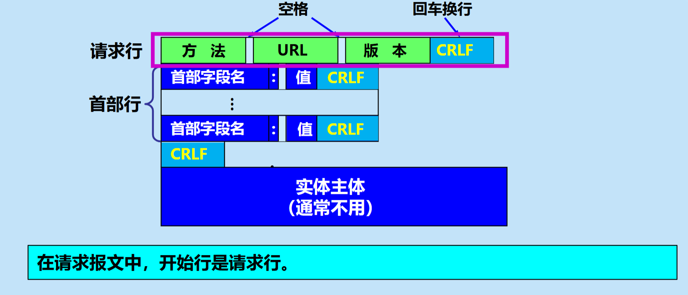
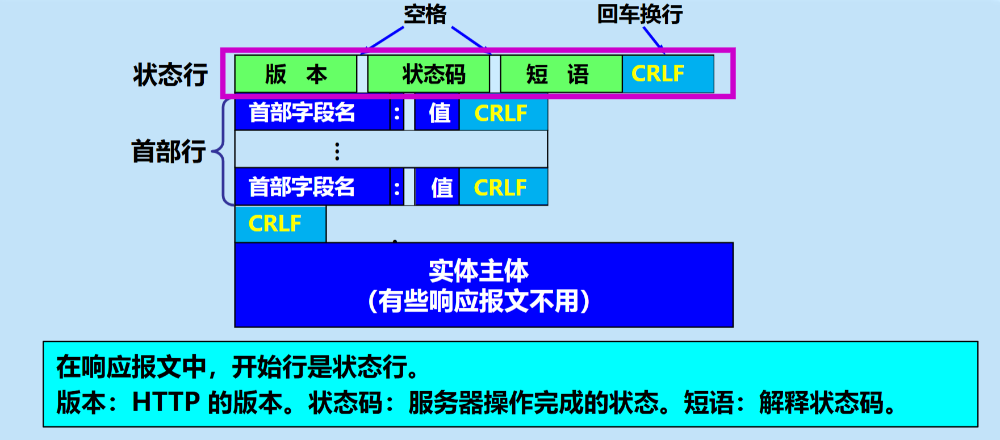

# 6.1 域名系统DNS
## 1. 计算机网络体系结构与应用层协议基础

在计算机网络的五层协议体系结构中，**应用层**位于最高层（第5层）。它的下层依次是运输层、网络层、数据链路层和物理层。

### 1.1 应用层协议的定义 📜
应用层协议精确定义了不同主机中的多个 <font color="orange">应用进程</font> 之间的通信规则。
主要包括以下四个方面：
*   **报文类型**：如请求报文和响应报文。
*   **报文语法**：报文中的各个字段及其详细描述。
*   **字段语义**：包含在字段中的信息的含义。
*   **通信规则**：进程何时、如何发送报文，以及对报文进行响应的规则。

### 1.2 客户/服务器（C/S）方式 🖥️
许多网络应用（如万维网HTTP、电子邮件SMTP/POP3、文件传输FTP）都基于客户/服务器方式：
*   **客户 (client)**：服务请求方（应用进程）。
*   **服务器 (server)**：服务提供方（应用进程）。

---

## 2. 域名系统 DNS (Domain Name System) 概述

### 2.1 核心作用与特点 🎯
*   **核心作用**：互联网使用的命名系统，用来把人们使用的机器名字（域名）转换为 **IP 地址**。为互联网的各种网络应用提供了核心服务。
    $\boxed{\text{域名 (如 www.myschool.edu)} \xrightarrow{\text{DNS 解析}} \text{IP 地址 (如 211.44.55.66)}}$
*   **结构**：采用层次树状结构的命名方法。
*   **系统性质**：是一个联机分布式数据库系统，采用客户服务器方式。
*   **通信协议**：DNS 客户与服务器之间使用 **UDP** 进行通信。
*   **解析机制**：由若干个 <font color="orange">域名服务器</font> 程序共同完成解析。运行该程序的机器称为域名服务器。

---

## 3. 互联网的域名结构 🌳

### 3.1 层次树状结构方法
任何一个连接在互联网上的主机或路由器，都有一个唯一的层次结构的名字，即 **域名 (domain name)**。
*   **域 (domain)**：名字空间中一个可被管理的划分。可以划分为子域，子域还可继续划分子域（形成顶级域、二级域、三级域等）。
*   **标号 (label)**：域名由标号序列组成，各标号之间用点 `.` 隔开。

$\boxed{\text{三级域名} \ . \ \text{二级域名} \ . \ \text{顶级域名}}$
*示例：* `mail.cctv.com` （`com`为级别最高的顶级域名，`mail`为级别最低的三级域名）。

### 3.2 域名命名的字符规定 📏
*   每一个标号不超过 $63$ 个字符。
*   不区分大小写字母。
*   完整域名总共不超过 $255$ 个字符。
*   域名树的树叶就是计算机的名字，不能再继续往下划分子域。

> ⚠️ **易错点提醒**
> **域名只是一个逻辑概念**，并不代表计算机所在的物理地点。名字空间的划分是按照机构的组织来划分的，与物理网络无关，与IP地址中的“子网”也没有关系。

### 3.3 全球顶级域名 TLD (Top Level Domain) 分类
1.  **国家顶级域名 nTLD (或 ccTLD)**：采用 ISO 3166 的规定（如 `.cn`, `.uk`），总数已达 316 个。
2.  **通用顶级域名 gTLD**：如 `.com`, `.net`, `.org`, `.edu`, `.gov` 等，总数已达 20 个。
3.  **基础结构域名 (infrastructure domain)**：只有一个 `.arpa`，用于反向域名解析。
4.  **新顶级域名 (New gTLD)**：真正的企业网络商标，任何公司/机构都有权向 ICANN 申请。

---

## 4. 域名服务器 🗄️

### 4.1 “区”与“域”的概念对比
实现域名系统使用分布在各地的 DNS 服务器。一个服务器所负责管辖的（或有权限的）范围叫做 <font color="orange">区</font> (zone)。
每一个区设置相应的**权限域名服务器**，用来保存该区中所有主机的域名到IP地址的映射。在一个区中的所有节点必须是能够连通的。

> 💡 **注意点**
> DNS 服务器的管辖范围 **不是以“域”为单位，而是以“区”为单位**。区可能是域的一部分，或者等于域（区 $\le$ 域）。每个域名服务器都只对域名体系中的一部分进行管辖。

### 4.2 域名服务器的四种类型 🏢

#### ① 根域名服务器 (Root DNS Server)
*   最高层次，最为重要。知道所有顶级域名服务器的域名和IP地址。
*   本地域名服务器无法解析时，**首先**求助于它。若根服务器瘫痪，整个互联网的 DNS 系统将无法工作。
*   **装置情况**：共有 $13$ 套装置，总共只有 $13$ 个不同 IP 地址的域名（a~m.root-servers.net）。但采用任播 (anycast) 技术，由多台机器组成（截至2020年9月，全球1098个，我国28个）。
*   **注意**：根服务器 <font color="orange">不直接</font> 把域名转换成IP地址，而是告诉客户端下一步应当找哪一个顶级域名服务器。

#### ② 顶级域名服务器 (TLD 服务器)
*   负责管理在该顶级域名服务器注册的所有二级域名。
*   收到查询时，给出相应回答（可能是最终IP，也可能是下一步要找的服务器IP）。

#### ③ 权限域名服务器
*   负责一个区 (zone) 的域名服务器。
*   如果不能给出最后回答，会指引 DNS 客户下一步找哪个权限域名服务器。

#### ④ 本地域名服务器 (默认域名服务器)
*   **非常重要**。每个 ISP 或大学都可以拥有一个。
*   主机发出 DNS 查询时，请求报文 <font color="orange">发送</font> 给本地域名服务器。
*   如果是查询同属于一个本地 ISP 的主机，它可以直接转换，不需要再询问其他服务器。

### 4.3 提高域名服务器的可靠性 🛡️
*   **主辅机制**：DNS 数据复制到几个服务器保存。一个是 <font color="orange">主域名服务器</font>，其他的是 <font color="orange">辅助域名服务器</font>。
*   **数据一致性**：主服务器出现故障时，辅助服务器保证查询不中断。更改数据只能在主服务器进行，并定期复制到辅助服务器中。

---

## 5. 域名的解析过程 🔍

域名解析分为两种查询方式，通常结合使用：

### 5.1 迭代查询 (Iterative Query) - 常用搭配 🔄
**典型场景**：主机向本地域名服务器使用递归查询，本地域名服务器向外网查询时使用迭代查询。
*   **步骤解析（以查询 y.abc.com 为例）：**
    1.  主机 `m.xyz.com` 向本地域名服务器 `dns.xyz.com` 发出查询请求（递归查询）。
    2.  本地域名服务器向 **根域名服务器** 查询。
    3.  根服务器返回 **顶级域名服务器 (`dns.com`)** 的IP地址。
    4.  本地域名服务器向 **顶级域名服务器** 查询。
    5.  顶级服务器返回 **权限域名服务器 (`dns.abc.com`)** 的IP地址。
    6.  本地域名服务器向 **权限域名服务器** 查询。
    7.  权限服务器返回最终结果 `y.abc.com` 的 IP 地址。
    8.  本地域名服务器将最终 IP 地址返回给主机。

### 5.2 递归查询 (Recursive Query) - 较少使用 🔀
**特点**：如果被询问的服务器不知道，它就以 DNS 客户的身份，替请求者向其他服务器继续发出查询请求。
*   **路径**：主机 $\rightarrow$ 本地 DNS $\rightarrow$ 根 DNS $\rightarrow$ 顶级 DNS $\rightarrow$ 权限 DNS。（一层层往下问，再一层层原路返回）。由于根服务器负担会极大，互联网上**很少**使用全链路递归查询。

---

## 6. 高速缓存 (Cache) ⚡

为了提高效率，DNS 引入了**高速缓存域名服务器**机制。
*   **存放内容**：存放最近用过的名字以及从何处获得名字映射信息的记录。
*   **作用**：大大减轻根域名服务器的负荷，使 DNS 查询请求和回答报文的数量大为减少。
*   **计时器 (TTL)**：为每项内容设置计时器。响应中会指明绑定 <font color="orange">有效存在的时间值</font>。超过合理时间的项会被清除，以保证域名转换的准确性。

---

## 🏆 本章学习总结

1.  **应用层角色**：处于网络体系结构最上层，通过应用层协议（如DNS、HTTP）规定了 <font color="orange">应用进程</font> 之间的交互规则，常采用 C/S 模型。
2.  **DNS结构性质**：DNS 是互联网的核心基石之一，采用联机分布式数据库和树状层级命名空间，底层基于 **UDP** 协议传输。
3.  **核心易混淆概念**：一定要区分“域(Domain)”和“区(Zone)”。DNS 实际的管辖与授权单位是“区”，每个区对应权限域名服务器。
4.  **服务器层级**：熟记本地域名服务器（最贴近用户）和根/顶级/权限域名服务器的作用划分；特别注意全球只有13个根服务器的 IP 地址，但借助任播技术部署了上千个物理节点。
5.  **解析与优化**：掌握“主机到本地DNS是递归，本地DNS到外网是迭代”的经典查询流程，并理解高速缓存及生命周期（计时器）在减少网络开销上的重要作用。

---

# 6.4 万维网 WWW

## 6.4.1 万维网概述 📖

*   **万维网（WWW）的本质**：万维网**并非**某种特殊的计算机网络，而是一个<font color="orange">大规模的、联机式的信息储藏所</font>。
*   **访问方式**：采用<font color="orange">链接</font>的方法，非常方便地从一个站点访问另一个站点，提供**分布式服务**。
*   **万维网的基础**：
    *   它是<font color="orange">分布式超媒体（hypermedia）系统</font>，是超文本（hypertext）系统的扩充。
    *   **超文本**：由多个信息源链接成，是万维网的基础（仅包含文本信息）。
    *   **超媒体与超文本的区别**：超媒体文档还包含图形、图像、声音、动画及视频等。
*   **工作方式**：采用**客户服务器（C/S）方式**。
    *   **客户程序**：浏览器。
    *   **服务器程序**：在万维网文档所驻留的主机上运行（万维网服务器）。
    *   **页面（page）**：客户程序主窗口上显示出的万维网文档。

💡 **万维网必须解决的4个问题**：
1.  **怎样标志分布在互联网上的文档？** ➡️ 使用 <font color="orange">统一资源定位符 URL</font>。
2.  **用什么协议实现链接？** ➡️ 使用 <font color="orange">超文本传送协议 HTTP</font>（应用层协议，使用 TCP 保证可靠）。
3.  **怎样使文档在各种主机上显示？** ➡️ 使用 <font color="orange">超文本标记语言 HTML</font>。
4.  **怎样方便地找到信息？** ➡️ 使用各种 <font color="orange">搜索引擎</font>。

---

## 6.4.2 统一资源定位符 URL 🔗

URL 是对互联网上资源位置和访问方法的一种<font color="orange">简洁表示</font>，相当于一个文件名在网络范围的扩展。

### 📌 URL 的一般格式
由以冒号（`:`）隔开的两大部分组成，大小写无要求：
`<协议>://<主机>:<端口>/<路径>`

*   **协议**：如 `ftp`（文件传送协议）、`http`（超文本传送协议）、`News`（USENET新闻）。
*   **主机**：存放资源的主机域名或点分十进制的 IP 地址。
*   **端口**：可省略，HTTP 默认端口号是 **80**。
*   **路径**：资源所在目录位置，**区分大小写**。省略时指向主页（home page）。

---

## 6.4.3 超文本传送协议 HTTP 🚀

HTTP 是**面向事务的**应用层协议，定义了浏览器与服务器通信的格式和规则。

### 📌 1. HTTP 的操作过程与特点
*   使用 **TCP 连接**进行可靠传送。不仅传送超文本，还传送图像、声音等。
*   **工作过程**：浏览器发起建立 TCP 连接 ➡️ 发出 HTTP 请求报文 ➡️ 服务器返回 HTTP 响应报文 ➡️ 释放 TCP 连接。
*   **核心特点**：
    *   使用面向连接的 TCP，但 **HTTP 协议本身是<font color="orange">无连接的</font>**。
    *   **HTTP 是<font color="orange">无状态的</font>（stateless）**。简化了服务器设计，易支持大量并发请求。

> ⚠️ **易错点提醒**：HTTP 使用的是有连接的 TCP 协议，但 HTTP 协议自身是“无连接、无状态”的。不要将两者混淆！

### 📌 2. 请求万维网文档所需的时间 ⏱️
*   **RTT（往返时间）**：
    *   第一次 RTT：三报文握手建立 TCP 连接的前两次。
    *   第二次 RTT：请求和接收文档。
*   **基础时间计算公式**：
    $$ \boxed{\text{所需的时间} \ge 2 \times \text{RTT} + \text{文档的传输时间}} $$

### 📌 3. HTTP 版本的演进
#### ❌ HTTP/1.0 的缺点：<font color="orange">非持续连接</font>
*   每请求一个文档就要有**两倍 RTT** 的开销。每次都要建立新 TCP 连接，服务器负担极重。
*   *示例题目*：主页上有10个链接的图片，使用 HTTP/1.0 所需时间为：
    $$ \text{时间} \ge 22 \times \text{RTT} + 11\text{个文档的传输时间} $$

#### ✅ HTTP/1.1：使用<font color="orange">持续连接</font>
服务器发送响应后保持连接不释放，可继续传送后续报文。分为两种方式：
1.  **非流水线方式**：收到前一个响应后才能发下一个请求。缺点是 TCP 连接有空闲状态。
	* $$ \text{时间} \ge 2 \times \text{RTT} + 10 \times \text{RTT} + 11\text{个文档的传输时间} $$
2.  **流水线方式**：收到响应前就能接连发送新请求，服务器连续发回响应，效率高。
    *   *示例*（同样1主页+10图片）：
        $$ \text{时间} \ge 1 \times \text{RTT} + 11\text{个文档的传输时间} $$

#### 🚀 HTTP/2：升级版本
*   并行发回响应（同一 TCP 连接）。
*   复用 TCP 连接进行多个请求。
*   划分二进制编码的帧，采用**新压缩算法**，不发送重复首部，提高传输效率。

### 📌 4. 代理服务器 (Proxy Server) 🛡️
*   又称为 <font color="orange">万维网高速缓存（Web cache）</font>。
*   **作用**：代表浏览器发出 HTTP 请求，将获取的对象存入本地。若后续请求同对象且缓存命中，则直接返回，可大大<font color="orange">减少访问互联网服务器的时延</font>。

### 📌 5. HTTP 报文结构 📝
分为 **请求报文** 和 **响应报文**。面向正文，由 ASCII 码串组成，包含三个部分：
1.  **开始行**：区分请求/响应（请求报文叫**请求行**，响应报文叫**状态行**）。
2.  **首部行**：说明信息，可多行或不用。
3.  **实体主体**：请求报文一般不用，响应报文可能没有。



*   **常见请求方法**：`GET`（读取）、`POST`（添加信息）、`HEAD`、`PUT`、`DELETE` 等。
*   **状态码分类**（三位数字）：
    *   `1xx`：通知信息
    *   `2xx`：成功（如 `202 Accepted`）
    *   `3xx`：重定向
    *   `4xx`：客户的差错（如 `400 Bad Request`, `404 Not Found`）
    *   `5xx`：服务器的差错
请求报文示例：
```HTTP
POST /api/login HTTP/1.1                 <-- 【1. 请求行】
Host: www.myschool.edu                   <-- 【2. 首部行开始】
User-Agent: Mozilla/5.0 (Windows NT 10.0)
Content-Type: application/json
Content-Length: 36                       <-- 【2. 首部行结束】
                                         <-- 【3. 空行】(必不可少)
{"username":"admin", "password":"123"}   <-- 【4. 请求体】
```

响应报文示例：
```HTTP
HTTP/1.1 200 OK                          <-- 【1. 状态行】
Server: nginx/1.21.0                     <-- 【2. 响应头开始】
Date: Wed, 13 May 2026 12:00:00 GMT
Content-Type: application/json
Content-Length: 42                       <-- 【2. 响应头结束】
                                         <-- 【3. 空行】(必不可少)
{"status":"success", "data":"Welcome!"}  <-- 【4. 响应体】
```


### 📌 6. Cookie 机制 🍪
由于 HTTP 是无状态的，万维网使用 <font color="orange">Cookie</font> 来跟踪传递的**状态信息**。服务器创建唯一识别码并在响应中发给客户，客户存入 Cookie 文件并在后续请求中携带，以便服务器在后台数据库识别用户。

```HTTP
GET /user/profile HTTP/1.1
Host: www.example.com
Cookie: session_id=123456abc; theme=dark   <-- 这里就是浏览器发出的请求头！
User-Agent: Mozilla/5.0
```

---

## 6.4.4 万维网的文档 📄

### 📌 1. 超文本标记语言 HTML / XML / CSS
*   **HTML**：制作页面的**标准语言**，消除不同计算机间交流障碍。利用 `<标签>` 进行排版（如 `<HTML>`, `<BODY>`, `<p>`, `<a>`, `` 等）。
    > ⚠️ **注意点**：HTML **不是**应用层协议，只是一种语言。
*   **XML（可扩展标记语言）**：宗旨是<font color="orange">传输数据</font>，而非显示数据。允许用户自定义标签，将界面与结构化数据分开。
*   **XHTML**：更严格的 HTML 版本，基于 XML。
*   **CSS（层叠样式表）**：用于为 HTML 文档定义布局（排版、字体、颜色等）。HTML 管内容，CSS 管格式。

### 📌 2. 文档的三种类型 📂
1.  **静态文档**：创作完毕存放在服务器，浏览时**内容不改变**。
2.  **动态文档**：文档内容在浏览器访问时才由应用程序**动态创建**（如使用 <font color="orange">CGI 通用网关接口</font> 脚本）。静态和动态的差别体现在**服务器端**。
3.  **活动文档**：把屏幕连续更新的工作**转移给浏览器端**。服务器返回程序副本（如 <font color="orange">Java Applet</font>），在客户端运行并与用户交互。不需要服务器连续更新，对带宽要求不高。

---

## 6.4.5 万维网的信息检索系统 🔍

用于方便寻找所需信息的程序叫做 <font color="orange">搜索引擎 (Search Engine)</font>。

### 📌 搜索引擎的分类：
1.  **全文检索搜索引擎**：纯技术型。利用“蜘蛛(Spider)”程序收集网页，建立在线索引数据库。用户输入关键词查询（非实时）。如：**Google、百度、必应**。
2.  **分类目录搜索引擎**：不主动采集，利用网站提交的信息经人工审核后分类。按分类查询，准确性高。如：**雅虎、新浪、搜狐、网易**。
3.  **垂直搜索引擎**：针对**特定领域**或人群（如购物、旅游、汽车、房产等）。
4.  **元搜索引擎**：建立在搜索引擎之上的引擎。将请求发给多个独立搜索引擎，统一处理返回。

💡 **Google 搜索技术核心**：<font color="orange">网页排名 (PageRank)</font>。对链接数目加权统计，来自重要网站的链接权重更大，将最相关、最可靠的结果放在首位。

---

## 6.4.6 博客和微博 📱

*   **博客 (Blog)**：万维网日志的简称。网民从内容的消费者转变为**生产者**。
*   **微博 (Microblog)**：记录片段碎语，只针对一个问题回答。提供 API 支持多平台即时更新，互动与传播极快。

## 6.4.7 社交网站 👥

*   **社交网站 (SNS - Social Networking Site)**：为有相同兴趣和活动的人创建的在线社区。
*   **功能**：邮件、聊天、博客、共享、游戏等。
*   **热门代表**：脸书 (Facebook)、YouTube、推特 (Twitter)、微信、抖音等。

---

## 📝 本章学习总结

1.  **核心概念理清**：万维网是一个基于分布式的超媒体信息储藏所。它的三大核心基石是 **URL（定位）**、**HTTP（传输）** 和 **HTML（显示）**。
2.  **HTTP 协议的深度理解**：必须牢记 HTTP 是**无连接、无状态**的，但它运行在可靠的 TCP 之上。需熟练掌握请求时间的计算公式 $\boxed{2 \times \text{RTT} + \text{传输时间}}$，并理解 HTTP/1.0 与 HTTP/1.1（持续连接：流水线/非流水线）在效率上的巨大差异。
3.  **报文与状态码**：HTTP 报文的组成结构和常见的状态码（特别是 `202`, `400`, `404` 代表的含义）是考试与实践的基础。同时要理解 Cookie 如何弥补 HTTP 无状态的特性。
4.  **文档的演进**：清楚 HTML/XML/CSS 的各自分工，以及 静态、动态（CGI服务器端生成）和 活动文档（Java客户端运行）的区别。
5.  **搜索引擎的分类**：能够准确区分全文搜索（爬虫技术如 Google PageRank）和分类目录搜索（人工审核）的原理差异。