## 4.0 计算机网络体系结构概述 🏗️

在深入网络层之前，课件首先回顾了计算机网络的体系结构 ：

- **OSI 的七层协议体系结构**：从上到下依次为应用层、表示层、会话层、运输层、网络层、数据链路层、物理层 。
    
- **TCP/IP 的四层协议体系结构**：应用层、运输层、网际层 (IP)、网络接口层 。
    
- **五层协议的体系结构**：应用层、运输层、网络层、数据链路层、物理层 。
    

---

## 4.1 网络层的几个重要概念 💡

### 4.1.1 网络层提供的两种服务 🛤️

关于网络层应该提供怎样的服务，在计算机通信领域曾有长期的争论 。核心的争议在于：**可靠交付应当由谁来负责？是网络还是端系统？** 由此产生了两种截然不同的观点和网络服务模式 。

#### 观点一：让网络负责可靠交付 —— 虚电路服务

- **设计思路**：模仿传统的电信网络，使用面向连接的通信方式 。
    
- **工作机制**：在通信之前必须先建立虚电路（Virtual Circuit，简称 VC），也就是建立连接，以此来保证双方通信所需的一切网络资源 。
    
- **特点**：如果网络协议提供可靠传输，可以保证发送的分组无差错、按序到达终点，且不丢失、不重复 。属于同一连接的所有分组都沿着同一条虚电路传送 。
    
- 💡 **易错点提醒**：虚电路只是一条**逻辑上**的连接，分组沿着这条逻辑连接按照“存储转发”方式传送，**并不是**真正建立了一条物理连接 ！
    

#### 观点二：网络提供无连接服务 —— 数据报服务

- **设计思路**：这是互联网采用的设计思路。核心在于将网络层设计得尽量简单，向其上层只提供简单灵活的、无连接的、尽最大努力交付的服务 。可靠通信应当由用户主机来保证 。
    
- **工作机制**：网络在发送分组时不需要先建立连接 。每一个分组（即 IP 数据报）都是独立发送的，与其前后的分组无关，且不进行编号 。同一个发送方发出的分组可能会沿着不同的路径传送 。
    
- **特点**：网络层不提供服务质量的承诺 。传送的分组可能会出现出错、丢失、重复和失序的情况，也不保证传送的时限 。可靠通信的重任交由主机中的运输层来负责 。
    

📊 虚电路服务与数据报服务的详细对比

|**对比的方面**|**虚电路服务**|**数据报服务**|
|---|---|---|
|**思路**|可靠通信应当由网络来保证|可靠通信应当由用户主机来保证|
|**连接的建立**|必须有|不需要|
|**终点地址**|仅在连接建立阶段使用，每个分组使用短的虚电路号|每个分组都有终点的完整地址|
|**分组的转发**|属于同一条虚电路的分组均按照同一路由进行转发|每个分组独立选择路由进行转发|
|**当结点出故障时**|所有通过出故障的结点的虚电路均不能工作|出故障的结点可能会丢失分组，一些路由可能会发生变化|
|**分组的顺序**|总是按发送顺序到达终点|到达终点时不一定按发送顺序|
|**端到端的差错处理和流量控制**|可以由网络负责，也可以由用户主机负责|由用户主机负责|

---

### 4.1.2 网络层的两个层面 🎛️

不同网络中的两个主机进行通信时，需要经过若干个路由器来转发分组 。在路由器之间传送的信息主要分为两大类：**数据**和**路由信息**（为数据传送服务） 。由此，网络层可以划分为两个相互配合的层面：
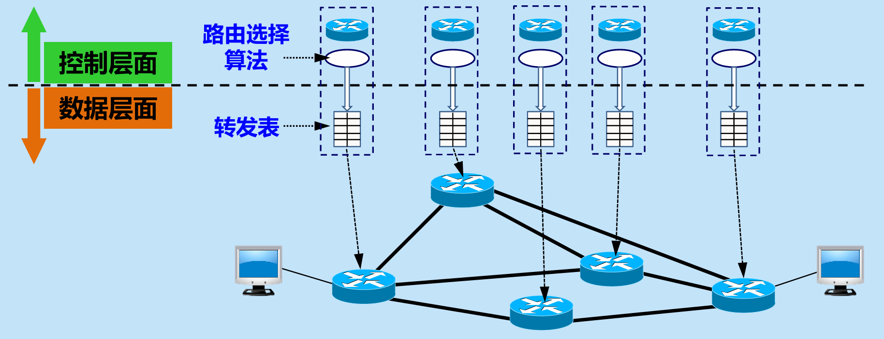
#### 1. 数据层面 (Data Plane)

- **核心任务**：路由器根据本路由器内部生成的转发表，把收到的分组从查找到的对应接口转发出去 。
    
- **特点**：每个路由器独立工作 。采用硬件进行转发，速度非常快 。
    

#### 2. 控制层面 (Control Plane)

- **核心任务**：根据路由选择协议所使用的路由算法来计算路由，并创建出本路由器的转发表（路由表） 。
    
- **特点**：需要许多路由器协同动作来完成 。由于采用软件计算，速度相对较慢 。
    

---

### 4.1.3 软件定义网络简介 ☁️

基于控制层面与数据层面的分离，课件引出了 **软件定义网络 SDN (Software Defined Network)** 的概念 。
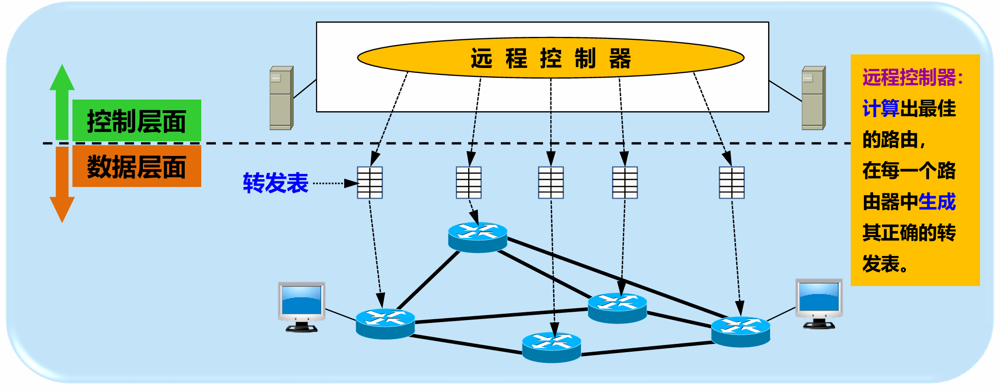
- **架构特点**：在 SDN 中，控制层面被集中到了一个统一的**远程控制器**中 。
    
- **远程控制器的作用**：负责计算出最佳的路由，并在每一个底层路由器中生成其正确的转发表 。
    
- **底层路由器的作用**：路由器剥离了复杂的计算任务，仅保留数据层面功能，只需负责查找转发表并转发分组 。
    
## 4.2 网际协议 IP
### 4.2.1 虚拟互连网络 🌐

实现网络互连、互通时面临异构网络（如寻址方案、最大分组长度等不同）的问题 。为了实现互连互通，互联网采用了使用**中间设备**的方法 。

不同层次的中间设备如下：

- 物理层：转发器 。
    
- 数据链路层：网桥或桥接器、交换机 。
    
- 网络层：路由器 。
    
- 运输层及以上：网关 。
    

⚠️ **易错点提醒**：使用转发器或网桥/交换机不称为网络互连，它们仅把一个网络扩大了，仍然是一个网络 。真正的网络互连使用路由器 。IP网的意义在于，主机在通信时就像在一个单一网络上通信，看不见底层异构网络的细节，构成了一个虚拟互连网络 。

---

### 4.2.2 IP 地址 📍

在TCP/IP体系中，如果没有IP地址，就无法和网上的其他设备进行通信 。IP地址由互联网名字和数字分配机构 ICANN 进行分配 。

#### 1. IP 地址及其表示方法

- **结构**：IP地址是32位二进制代码，采用2级结构：`IP 地址 ::= {<网络号>, <主机号>}` 。
    
- **记法**：采用**点分十进制记法**（如将 $10000000$ $00001011$ $00000011$ $00011111$ 记为 $128.11.3.31$） 。
    

#### 2. 分类的 IP 地址

分类地址将IP地址分为A、B、C、D、E五类 ：

- **A类地址**：网络号字段为1字节，以 $0$ 开头 。
    
- **B类地址**：网络号字段为2字节，以 $10$ 开头 。
    
- **C类地址**：网络号字段为3字节，以 $110$ 开头 。
    
- **D类地址**：以 $1110$ 开头，是多播地址 。
    
- **E类地址**：以 $1111$ 开头，保留为今后使用 。
    

⚠️ **特殊 IP 地址注意点**：

- 主机号为全 $0$：表示本网络 。
    
- 主机号为全 $1$：表示本网络上的广播 。
    
- 网络号为 $127$：用于本地软件环回测试 。
    

#### 3. 无分类编址 CIDR

CIDR 消除了传统的A、B、C类划分，采用2级结构：`IP 地址 ::= {<网络前缀>, <主机号>}` 。

- **斜线记法**：例如 $128.14.35.7/20$ 表示前 $20$ 位是网络前缀 。
    
- **地址块**：CIDR 把网络前缀都相同的所有连续的IP地址组成一个 CIDR 地址块 。
    
- **地址掩码**：又称子网掩码，由一连串 $1$ 和接着的一连串 $0$ 组成，$1$ 的个数就是网络前缀的长度 。
    

网络地址计算核心公式：

$$\boxed{\text{网络地址} = (\text{二进制的IP 地址}) \text{ AND } (\text{地址掩码})}$$

📝 **【计算示例】**：已知IP地址是 $128.14.35.7/20$，求网络地址 。

1. 二进制IP地址：$10000000$ $00001110$ $00100011$ $00000111$ 。
    
2. 地址掩码：$11111111$ $11111111$ $11110000$ $00000000$ （即 $255.255.240.0$） 。
    
3. 按位 AND 计算结果：$10000000$ $00001110$ $00100000$ $00000000$ 。
    
4. 转为点分十进制：$128.14.32.0$ 。
    

#### 4. IP 地址的特点

- 所有分配到网络前缀的网络都是平等的 。
    
- 同一个局域网上的主机或路由器的IP地址中的网络号必须一样 。
    
- 路由器的每一个接口都有一个不同网络号的IP地址 。
    
- 两个路由器直接相连的接口处，可以构成只包含一段线路的特殊网络，可使用 $/31$ 地址块（主机号为 $0$ 或 $1$） 。
    

---

### 4.2.3 IP 地址与 MAC 地址 🔄

数据在网络中传输时，涉及两种地址：

- **IP 地址**：虚拟地址、逻辑地址，放在 IP 数据报的首部，供网络层及以上各层使用 。路由器只根据目的站的IP地址进行转发 。
    
- **MAC 地址**：硬件地址、物理地址，固化在网卡ROM中，放在 MAC 帧的首部，供数据链路层使用 。
    

⚠️ **重点区分**：在IP层抽象的互联网上只能看到 IP 数据报，IP地址在传输过程中源地址和目的地址保持不变；但在局域网的链路层只能看见 MAC 帧，MAC地址会随着每次路由器转发（每一跳）而改变 。

---

### 4.2.4 地址解析协议 ARP 🔍

**作用**：已知本局域网上某个机器的IP地址，找出其相应的MAC地址 。

- **工作原理**：
    
    1. 查找主机中的 ARP 高速缓存表（动态更新，含生存时间） 。
        
    2. 若找不到，则在本局域网上**广播发送** ARP 请求分组（路由器不转发该请求） 。
        
    3. 目标主机收到请求后，**单播发送** ARP 响应分组给源主机，源主机随之更新 ARP 高速缓存 。
        
- 如果目标主机不在同一个局域网，则主机A必须知道本网路由器的主机IP地址，用ARP解析出该路由器的MAC地址，将数据报先发给路由器 。
    

---

### 4.2.5 IP 数据报的格式 📦

IP数据报由**首部**和**数据**两部分组成。首部的前20字节是固定长度，所有IP数据报必备 。
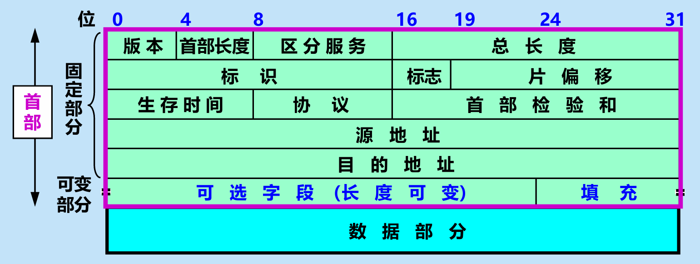
- **首部长度**：占4位。最大数值是15个单位（一个单位为4字节），因此首部最大值为60字节 。
    
- **总长度**：占16位。首部和数据之和，最大65535字节，且不能超过最大传送单元 MTU 。
    
- **标识 (identification)**：占16位。产生IP数据报的标识计数器 。
    
- **标志 (flag)**：占3位 。
    
    - $MF=1$ 表示后面还有分片，$MF=0$ 表示最后一个分片 。
        
    - $DF=0$ 时才允许分片 。
        
- **片偏移**：占13位。指出分片后在原分组中的相对位置。**以8个字节为偏移单位** 。
    
- **生存时间 (TTL)**：占8位。数据报在网络中可通过的路由器数的最大值 。
    
- **协议**：占8位。指出数据部分上交给哪个处理过程（如 ICMP=1, TCP=6, UDP=17, OSPF=89 等） 。
    
- **首部检验和**：占16位。**只检验数据报的首部**，不检验数据部分。数据报每经过一个路由器都要重新计算 。
    

📝 **【示例 4-1】：IP 数据报分片计算** 假设数据部分共 $3800$ 字节，分装为3个数据报片传送（每个最大数据长度 $1400$ 字节） ：

- **数据报片 1**：字节 $0 \sim 1399$。片偏移 = $0 / 8 = 0$。$MF=1$，$DF=0$ 。
    
- **数据报片 2**：字节 $1400 \sim 2799$。片偏移 = $1400 / 8 = 175$。$MF=1$，$DF=0$ 。
    
- **数据报片 3**：字节 $2800 \sim 3799$。片偏移 = $2800 / 8 = 350$。$MF=0$，$DF=0$ 。
    

---

## 4.3 IP 层转发分组的过程

### 4.3.1 基于终点的转发

- 分组在互连网中是逐跳转发的 。
    
- 基于终点的转发是指基于分组首部中的目的地址传送和转发 。
    
- 为了压缩转发表的大小，转发表中最主要的路由记录形式是“（目的网络地址，下一跳地址）”，而不是“（目的主机地址，下一跳地址）” 。
    
- 查找转发表的过程就是逐行寻找前缀匹配 。
    
源主机判断目的地址是否与自己同网，判断完之后，会进行如下操作：

- **在同一个网络内（直接交付）：** 源主机知道对方就在本地局域网里。它会直接发 ARP 广播询问目的主机的 MAC 地址，然后把数据报封装成 MAC 帧，直接顺着网线/Wi-Fi 发给对方。**这个过程不需要路由器插手。**
    
- **不在同一个网络内（间接交付）：** 源主机发现对方在外网，它就不会去问目的主机的 MAC 地址了（因为 ARP 广播出不了路由器）。它会去查自己的路由表，找到**默认网关**（也就是连接局域网的路由器）的 MAC 地址，把数据报交给路由器，让路由器去帮忙跨网转发。

📝 **【示例题目与解析】** 假设源主机 $H_1$ 的 IP 为 128.1.2.193，想要发送分组给目的地址为 128.1.2.132 的主机 $H_2$ ：

1. $H_1$ 首先会检查目的地址 128.1.2.132 是否连接在本网络 $N_1$ 上。如果是，则直接交付；否则，就送交路由器 $R_1$ 。
    
2. $N_1$ 的网络地址为 128.1.2.192 ，$N_1$ 的网络掩码为 /26（即 255.255.255.192） 。
    
3. 目的地址与网络掩码进行逐比特 AND 运算 ：
    
    $$\boxed{128.1.2.132 \text{ AND } 255.255.255.192 = 128.1.2.128}$$
    
4. 因为计算结果 128.1.2.128 不等于 $H_1$ 的网络地址 128.1.2.192，所以目的主机 128.1.2.132 不在本地网络上 。
    
5. 源主机 $H_1$ 必须把分组发送给路由器 $R_1$ 。
    
6. 路由器 $R_1$ 收到分组后查找转发表，当检查到子网前缀为 `128.1.2.128/25` 的路由条目时，运算结果匹配，于是进行分组的直接交付 。
    

⚠️ **易错点提醒**：源主机在发送数据报之前，**一定会先判断**目的地址是否与自己在同一个网络内，只有不在同网时才会将数据报送交给路由器处理 。

---

### 4.3.2 最长前缀匹配

- 使用 CIDR 时，在查找转发表时可能会得到不止一个匹配结果 。
    
- 此时必须遵循 最长前缀匹配 原则：选择前缀最长的一个作为匹配的前缀 。
    
- 网络前缀越长，其地址块就越小，因而路由就越具体 。
    
- 可以把前缀最长的排在转发表的第1行，以加快查表 。
    

📝 **【示例题目与解析】** 路由器 $R_1$ 如何转发目的地址是 128.1.2.196 的分组 ：
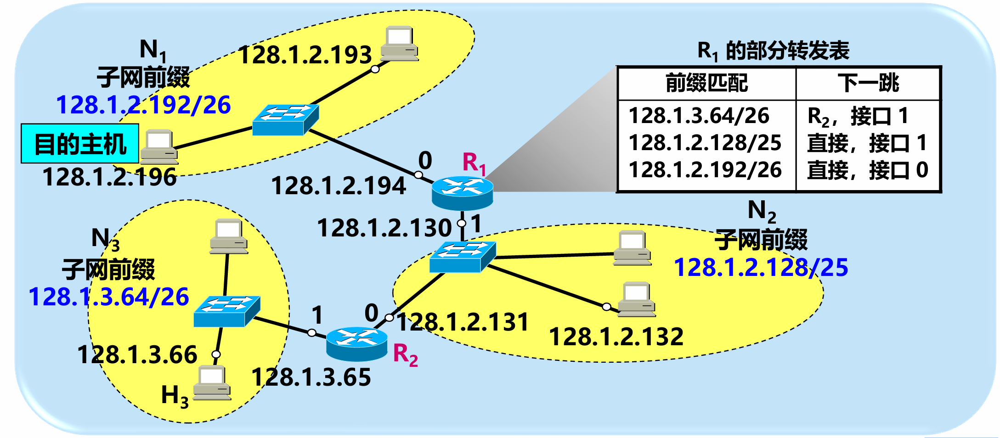
1. 检查第1行路由 `128.1.2.192/26`：128.1.2.196 AND 255.255.255.192 = 128.1.2.192，匹配！
    
2. 检查第2行路由 `128.1.2.128/25`：128.1.2.196 AND 255.255.255.128 = 128.1.2.128，也匹配！
    
3. 比较两者，/26 的前缀比 /25 长。根据最长前缀匹配原则，选择前缀最长的一个作为匹配的前缀，路由器会从 /26 路由对应的接口0向外转发分组 。
    

📌 **转发表中的 2 种特殊的路由** ：

- 主机路由：又叫做特定主机路由，是对特定目的主机的 IP 地址专门指明的一个路由 。网络前缀就是 `a.b.c.d/32`，放在转发表的最前面 。
    
- 默认路由：不管分组的最终目的网络在哪里，都由指定的路由器来处理 。用特殊前缀 `0.0.0.0/0` 表示 。
    

⚙️ **路由器分组转发算法流程** ：

1. 提取目的地址 IP 地址 D 。
    
2. 查找转发表 ，找到 D 的特定主机路由？若是，则转发分组到下一跳路由器；否，则继续 。
    
3. 找到 D 的最长前缀匹配？若是，则转发分组到下一跳路由器；否，则继续 。
    
4. 找到默认路由？若是，则转发分组到下一跳路由器；否，则继续 。
    
5. 丢弃分组 。
    

---

### 4.3.3 使用二叉线索查找转发表

- 二叉线索：一种特殊结构的树，可以快速在转发表中找到匹配的叶节点 。为了在庞大的转发表中**快速、高效地完成最长前缀匹配**而生的一种经典数据结构。
    
- 从二叉线索的根节点自顶向下的深度最多有32层，每一层对应于 IP 地址中的一位 。
    
- 为简化二叉线索的结构，可以用唯一前缀来构造二叉线索 。
    
- 为了提高二叉线索的查找速度，广泛使用了各种压缩技术 。
    

🌳 **二叉线索的查找与匹配规则**：
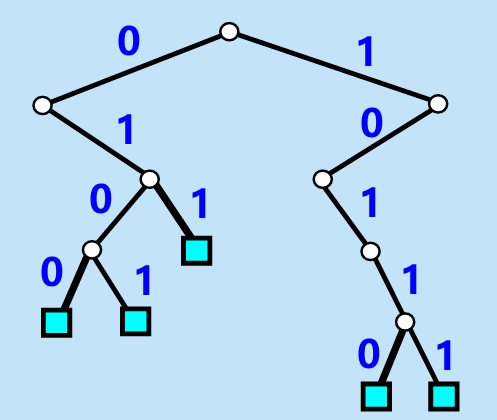
- 规则：先检查 IP 地址左边的第一位，如为 0，则第一层的节点就在根节点的左下方；如为 1，则在右下方。然后再检查地址的第二位，构造出第二层的节点。依此类推，直到唯一前缀的最后一位。每个叶节点代表一个唯一前缀 。
    
- 为检查网络前缀是否匹配，必须使二叉线索中的每一个叶节点包含所对应的网络前缀和子网掩码 。
    
- **具体查找步骤**：
    
    1. 找到了一个叶节点 。
        
    2. 将目的 IP 地址和该叶节点的子网掩码进行按位 AND 运算，看结果是否与叶节点的网络前缀相匹配 。
        
    3. 若匹配，就按下一跳的接口转发该分组。否则，就丢弃该分组 。
        

⚠️ **注意点**：在二叉线索中查找到某一位时，如果在二叉线索中找不到匹配的分支，说明这个地址不在这个二叉线索中 。此时必须检查是否存在默认路由。若有，把分组传送到指明的默认路由器，否则丢弃该分组 。

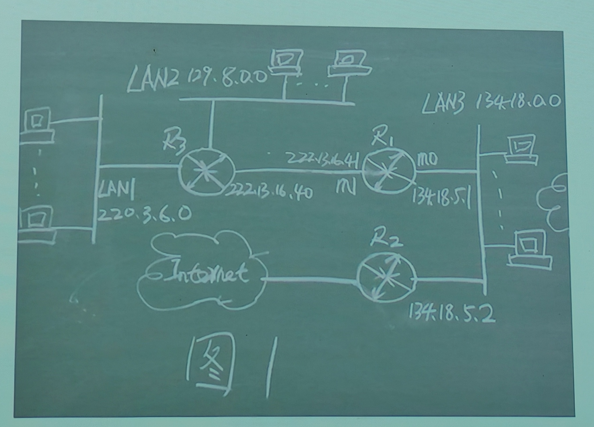

R1路由表：

| 掩码            | 目的网络                 | 下一跳地址        | 接口  |
| ------------- | -------------------- | ------------ | --- |
| 255.255.0.0   | 134.18.0.0（LAN3）     | 无            | m0  |
| 255.255.255.0 | 220.3.6.0（LAN1）      | 222.13.16.40 | m1  |
| 255.255.0.0   | 129.8.0.0 (LAN2)     | 222.13.16.40 | m1  |
| 0.0.0.0       | 0.0.0.0（默认路由）        | 134.18.5.2   | m0  |
| 255.255.255.0 | 222.13.16.0（R1-R3链路） | 无            | m1  |

---

## 4.4 网际控制报文协议 ICMP

### 基础概述 🌐

- ICMP 允许主机或路由器报告差错情况和提供有关异常情况的报告 。
    
- ICMP 是互联网的标准协议 。
    
- **💡 注意点：** ICMP 不是高层协议，而是**IP 层**（网际层）的协议 。
    

### ICMP 报文的格式 📦
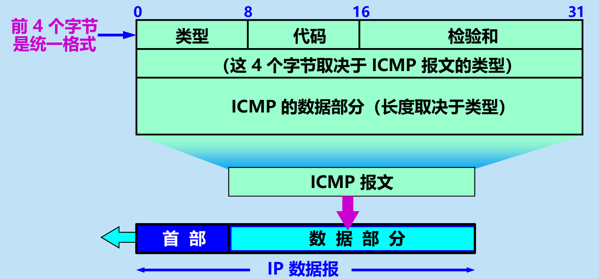
- ICMP 报文整体作为**数据部分**，被封装在**IP 数据报**中进行传输 。
    
- 前 $\boxed{4}$ 个字节是统一格式：包含**类型**（8位）、**代码**（8位）、**检验和**（16位） 。
    
- 这 $\boxed{4}$ 个字节以及 ICMP 的数据部分（长度取决于类型），完全取决于 ICMP 报文的具体类型 。
    

---

### 4.4.1 ICMP 报文的种类

- ICMP 报文主要分为 2 种：差错报告报文和询问报文 。
    
- A. 差错报告报文类型： 类型值 3 为终点不可达；11 为时间超过；12 为参数问题；5 为改变路由 (Redirect) 。 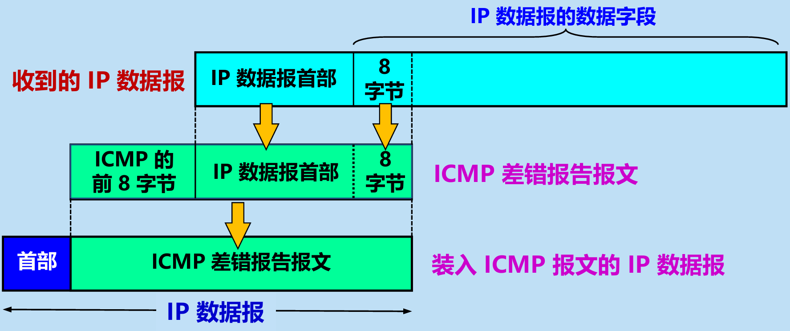
    
- **数据字段的内容：** 装入 ICMP 差错报告报文的数据部分，是由“收到的 IP 数据报首部”加上“该 IP 数据报数据字段的前 $\boxed{8}$ 字节”共同组成的 。
    
- **🚫 易错点（不应发送差错报告报文的情况）：** 对 ICMP 差错报告报文不再发送 ；对第一个分片的数据报片的所有后续数据报片都不发送 ；对具有多播地址的数据报都不发送 ；对具有特殊地址（如 127.0.0.0 或 0.0.0.0）的数据报不发送 。
    
- B. 询问报文（回送请求和回答）： 类型的值 8 或 0，由主机或路由器向一个特定的目的主机发出的询问 。收到此报文的主机必须给源主机或路由器发送 ICMP 回送回答报文 。此报文用来测试目的站是否可达，以及了解其有关状态 。
    
- B. 询问报文（时间戳请求和回答）： 类型的值 13 或 14，请某台主机或路由器回答当前的日期和时间 。回答报文中有一个 32 位的字段，代表从 1900年1月1日起到当前时刻一共有多少秒 。这可用于时钟同步和时间测量 。
    

| ICMP 报文种类 | 类型的值   | ICMP报文的类型            |
| --------- | ------ | -------------------- |
| 差错报告报文    | 3      | 终点不可达                |
| 差错报告报文    | 11     | 时间超过                 |
| 差错报告报文    | 12     | 参数问题                 |
| 差错报告报文    | 5      | 改变路由(Redirect)       |
| 询问报文      | 8 或0   | 回送(Echo) 请求或回答       |
| 询问报文      | 13 或14 | 时间戳(Timestamp) 请求或回答 |

---

### 4.4.2 ICMP 的应用举例

- **应用一：PING**，用来测试两个主机之间的连通性 。
    
- **PING 的原理：** 使用了 ICMP 回送请求与回送回答报文 。
    
- **💡 注意点：** PING 是应用层直接使用网络层 ICMP 的例子，没有通过运输层的 TCP 或 UDP 。
    
- **📝 示例题目/演示（PING）：** 用 PING 测试邮件服务器 `mail.sina.com.cn` 的连通性，发送了 32 bytes 的数据进行测试 。收到回复会显示参数，如 $\boxed{time=368ms}$，$\boxed{TTL=242}$，过程中可能出现 `Request timed out.`（请求超时） 。最终统计显示：发送 4 个包，接收 3 个包，丢失 1 个包 (25% loss)；以及往返时间的最小、最大和平均值 。
    
- **应用二：Traceroute**，这是 UNIX 操作系统中的名字；在 Windows 操作系统中，这个命令是 `tracert` 。
    
- **Traceroute 的作用与原理：** 用来跟踪一个分组从源点到终点的路径，它利用 IP 数据报中的 TTL 字段、ICMP 时间超过差错报告报文和 ICMP 终点不可达差错报告报文来实现跟踪 。
    
- **📝 示例题目/演示（Traceroute）：** 用 `tracert` 命令获得到新浪网邮件服务器的路由信息，默认最多经过 30 个跃点 (hops) 。输出结果逐行显示经过的序号、三次探测的延迟时间（如 24 ms）以及对应路由器的 IP 地址（如 222.95.172.1），直到 Trace complete 。
    

---

## 4.5 IPv6

### 基础概述 🌐

- IP 是互联网的核心协议 。
    
- 解决 IPv4 地址耗尽问题（IANA 在 2011 年 2 月已耗尽 IPv4 地址）的根本措施是：采用具有更大地址空间的新版本的 IP，即 IPv6 。
    

---

### 4.5.1 IPv6 的基本首部

- IPv6 仍支持无连接的传送 。
    
- 协议数据单元 PDU 在 IPv6 中被称为**分组 (packet)** 。
    
- **主要变化与优势：**
    
    - 更大的地址空间：将地址从 IPv4 的 32 位增大到了 128 位 。
        
    - 扩展的地址层次结构，可以划分为更多的层次 。
        
    - 灵活的首部格式与改进的选项（允许数据报包含有选项的控制信息，且选项放在有效载荷中） 。
        
    - 允许协议继续扩充，以适应新的应用 。
        
    - 支持**即插即用**（即自动配置），不再需要使用 DHCP 。
        
    - 支持资源的预分配，以满足实时视像等要求保证一定带宽和时延的应用 。
        
    - 首部改为 8 字节对齐（首部长度必须是 8 字节的整数倍） 。
        
- **数据报格式：** * 由两大部分组成：**基本首部** (base header) 和 **有效载荷** (payload，也称为净负荷) 。
    
    - **基本首部**：固定为 40 字节长 。
        
    - **有效载荷**：最大不超过 65535 字节 。允许有零个或多个扩展首部，其后跟着数据部分 。
        
- **基本首部的 8 个字段：**
    
    - **版本** (4 位)：指明协议版本，IPv6 中该字段总是 6 。
        
    - **通信量类** (8 位)：区分不同的 IPv6 数据报的类别或优先级 。
        
    - **流标号** (20 位)：指明属于同一个“流”的数据报，路由器保证指明的服务质量 。
        
    - **有效载荷长度** (16 位)：除基本首部以外的字节数（包含所有扩展首部） 。
        
    - **下一个首部** (8 位)：相当于 IPv4 的协议字段或可选字段 。
        
    - **跳数限制** (8 位)：路由器转发时减 1，为零时丢弃数据报 。
        
    - **源地址** (128 位) 与 **目的地址** (128 位)：分别为发送站和接收站的 IP 地址 。
        
- **💡 注意点（IPv6 对首部的主要更改）：** 取消了首部长度字段、服务类型字段、总长度字段、协议字段、检验和字段以及选项字段（改用扩展首部实现选项功能） 。
    
- **六种扩展首部：** 逐跳选项、路由选择、分片、鉴别、封装安全有效载荷、目的站选项 。
    

---

### 4.5.2 IPv6 的地址

- **三种基本类型：**
    
    1. **单播 (unicast)**：传统的点对点通信 。
        
    2. **多播 (multicast)**：一点对多点的通信 。
        
    3. **任播 (anycast)**：终点是一组计算机，但数据报只交付其中的一个（通常是距离最近的一个） 。
        
- **节点与接口：** IPv6 将主机和路由器均称为节点 。IPv6 地址是分配给节点上接口的，一个节点可以有多个接口和多个单播地址 。
    
- **表示方法：**
    
    - **冒号十六进制记法**：128 位地址，地址空间大于 $3.4 \times 10^{38}$ 。每 16 位用十六进制表示，用冒号分隔（例如 `68E6:8C64:FFFF:...`） 。
        
    - **零压缩 (zero compression)**：一串连续的零可以用一对冒号 `::` 取代 。
        
    - **点分十进制记法的后缀**：在转换阶段十分有用（例如 `::128.10.2.1`） 。
        
    - **CIDR 斜线表示法**：取消了子网掩码，继续使用斜线表示法（如 `/60`） 。
        
- **🚫 易错点（零压缩）：** 在任一地址中，**只能使用一次**零压缩 。
    
- **IPv6 地址分类：** * 未指明地址：`::/128` 。
    
    - 环回地址：`::1/128` 。
        
    - 多播地址：`FF00::/8` 。
        
    - **本地链路单播地址**：`FE80::/10`（注意：此类地址未连接到互联网，不能和互联网上的其他主机通信） 。
        
    - 全球单播地址：除上述四种外的所有其他二进制前缀 。
        
- **全球单播地址的划分结构：** 全球路由选择前缀 (n bit) + 子网标识符 (m bit) + 接口标识符 (128-n-m bit) 。
    

---

### 4.5.3 从 IPv4 向 IPv6 过渡

- **过渡策略：** 逐步演进，向后兼容 。IPv6 系统必须能够接收和转发 IPv4 分组，并为其选择路由 。
    
- **两种主要过渡技术：**
    
    1. **双协议栈 (Dual Stack)**：主机或路由器同时装有 IPv4 和 IPv6 两个协议栈 。
        
    2. **隧道技术 (Tunneling)**：在跨越 IPv4 网络时，将 IPv6 数据报整体封装成 IPv4 数据报的“数据部分”进行传输 。
        

---

### 4.5.4 ICMPv6

- IPv6 也需要使用 ICMP 来反馈一些差错信息，即 ICMPv6 。
    
- **💡 注意点：** 与 IPv4 时代不同，ICMPv6 包含了 **ARP**（地址解析协议）和 **IGMP**（网际组管理协议）的功能 。
    
- **ICMPv6 报文分类：**
    
    - 差错报文
        
    - 信息报文
        
    - 邻站发现报文 (ND 协议：Neighbor-Discovery)
        
    - 组成员关系报文 (MLD 协议：Multicast Listener Delivery，多播听众交付)
        

---

## 4.6 互连网的路由选择协议

### 4.6.1 有关路由选择协议的几个基本概念

- **控制层面与数据层面：** 路由选择协议属于网络层的**控制层面**（通过路由选择算法构建转发表），而实际的数据转发动作属于**数据层面** 。
    
- **理想的路由算法：** 包含正确完整、计算简单、自适应、稳定、公平、最佳等特点 。
    
- **关于“最佳路由”：** 路由选择非常复杂，不存在一种绝对的最佳路由算法，所谓“最佳”只能是相对于某一种特定要求下得出的较为合理的选择而已 。
    
- **分层次的路由选择协议：** 整个互联网划分为许多较小的自治系统 AS (Autonomous System) 。
    
    - **域间路由选择 (EGP)：** 在不同自治系统之间使用的协议，如 BGP-4 。
        
    - **域内路由选择 (IGP)：** 在自治系统内部使用的协议，分为距离向量（如 RIP）和链路状态（如 OSPF） 。
        

---

### 4.6.2 内部网关协议 RIP

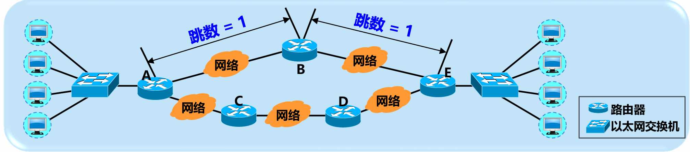

- **基本原理：** 路由信息协议 RIP (Routing Information Protocol) 是一种分布式的、基于**距离向量**的路由选择协议 。
    
    - **最大优点：** 简单 。
        
    - **距离定义：** 也称为“跳数”。直接连接的网络距离为 1 。每经过一个路由器，跳数加 1 。
        
    - **🚫 易错点：** 一条路径最多只能包含 15 个路由器 。当距离等于 $\boxed{16}$ 时即相当于**不可达** 。
        
- **RIP 协议的三个特点：**
    
    1. 仅和**相邻路由器**交换信息 。
        
    2. 交换的信息是当前本路由器所知道的全部信息，即**自己的路由表** 。
        
    3. 按**固定时间间隔**（例如每隔 30 秒）交换路由信息 。
        
- **距离向量算法：** 基于 Bellman-Ford 算法 。收到相邻路由器 X 的 RIP 报文后：
    
    - 先将报文中的所有“下一跳”改为 X，并将“距离”加 1 。
        
    - **更新规则：** 
	    - 若路由表没有该目的网络则添加；
	    - 若下一跳同为 X 则替换更新；
	    - 若下一跳不同但新距离更小则替换更新；否则什么也不做 。若 3 分钟未收到相邻路由器更新，则记为不可达（距离置为 16） 。

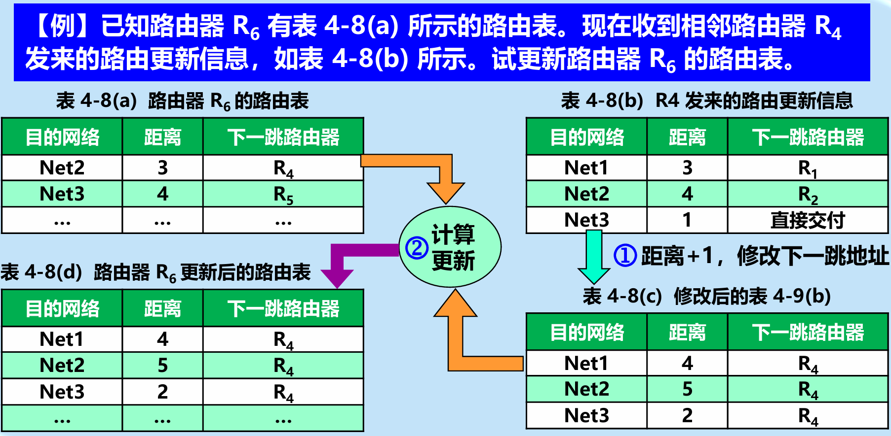

- **RIP2 报文格式：** 使用 **UDP** 传送（端口 520） 。一个报文最多可包括 25 个路由，最大长度为 $4+20\times25=504$ 字节 。支持无分类域间路由选择 CIDR 和简单的鉴别功能 。
    
- **💡 注意点（主要缺点）：** **坏消息传播得慢**（慢收敛）。当网络出现故障时，需要经过较长时间才能将此信息传送到所有路由器 。
    

---

### 4.6.3 内部网关协议 OSPF

- **基本原理：** 开放最短路径优先 OSPF (Open Shortest Path First) 为了克服 RIP 的缺点而开发，使用 Dijkstra 的最短路径算法，采用分布式的**链路状态协议** 。
    
- **三个主要特点：**
    
    1. 采用**洪泛法** (flooding) 向本自治系统中**所有**路由器发送信息 。
        
    2. 发送的信息仅是与本路由器**相邻的所有路由器的链路状态** 。
        
    3. 仅当**链路状态发生变化**或每隔一段时间（如 30 分钟）才发送信息 。
        
    
    - **OSPF 区域划分：** 将自治系统划分为主干区域（标识符为 0.0.0.0）和其他下层区域 。包含区域边界路由器 (ABR)、主干路由器 (BR) 和自治系统边界路由器 (ASBR) 。区域划分减少了通信量，但增加了协议复杂性 。

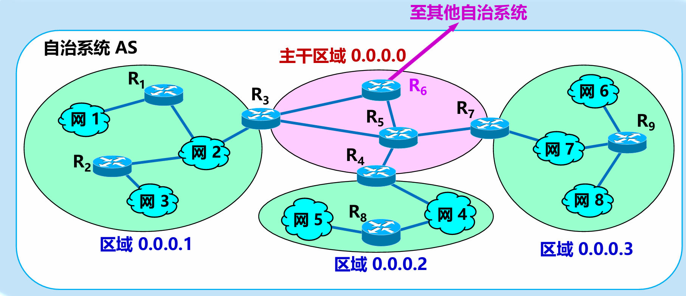

- **OSPF 分组：** 共有 5 种（问候、数据库描述、链路状态请求、链路状态更新、链路状态确认），直接使用 **IP 数据报** 传送（协议字段值为 89） 。
    
- **收敛速度：** 链路状态数据库在全网范围内同步后，OSPF 没有“坏消息传播得慢”的问题，收敛速度快 。
    

---

### 4.6.4 外部网关协议 BGP

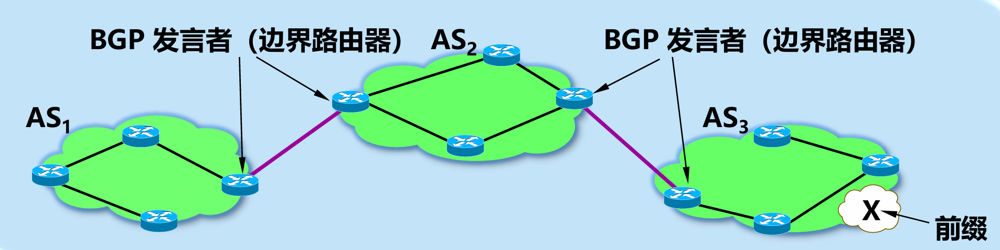

- **基本原理：** 边界网关协议 (BGP) 是不同自治系统的路由器之间交换路由信息的协议。当前较新版本为 BGP-4 。
    
- **主要特点：** 采用路径向量 (path vector) 路由选择协议。它力求寻找一条能够到达目的网络且“比较好”的路由（不兜圈子），而**非计算最佳路由**（因为互联网规模太大且需考虑策略） 。
    
- **连接方式：** 在半永久性 **TCP 连接**（端口号 179）上建立会话 。跨 AS 的连接称为 eBGP 连接，AS 内部的连接称为 iBGP 连接 。
    
- **BGP 路由信息：** 包含前缀和 BGP 属性。最重要的两个属性是 **AS-PATH**（自治系统路径）和 **NEXT-HOP**（下一跳） 。
    
- **🚫 易错点（避免兜圈子）：** 收到 BGP 路由时，若发现 AS-PATH 中**已经有自己所在 AS 的号码**，则立即删除该路由 。
    
- **路由选择规则（优先级从高到低）：** 本地偏好值最高 $\rightarrow$ AS 跳数最小 $\rightarrow$ 热土豆算法（内部转发次数最少） $\rightarrow$ 路由器 BGP ID 最小的路由 。
    
- **三种 AS 类型：** 穿越 AS（有偿转发）、对等 AS（免费）、末梢 AS（必须向连接的 AS 付费，包含多归属 AS） 。
    
    - **四种报文：** OPEN (打开)、UPDATE (更新)、KEEPALIVE (保活)、NOTIFICATION (通知) 。
        

---

### 4.6.5 路由器的构成

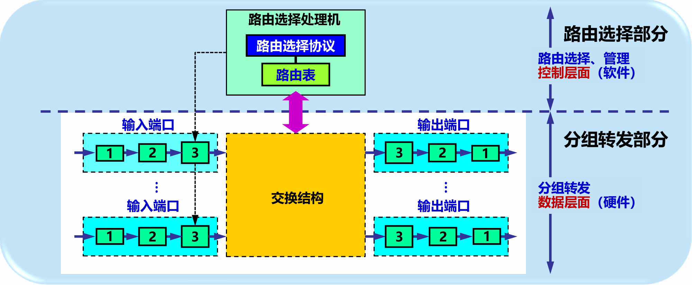

- **概述：** 路由器工作在网络层，主要工作是**转发分组** 。
    
    - **两大组成部分：**
        
    
    1. **路由选择部分（控制层面）：** 包含路由选择处理机、路由选择协议和路由表，主要由软件实现 。
        
    2. **分组转发部分（数据层面）：** 包含输入端口、交换结构和输出端口，主要由硬件实现 。
        
- **交换结构 (Switching Fabric)：** 常用的交换方法有三种：通过存储器、通过总线、通过纵横交换结构（互连网络） 。其中纵横交换结构是一种无阻塞的交换结构 。
    
- **💡 注意点（“路由选择”与“转发”的区别）：**
    
    - 转发：仅涉及单个路由器，是根据转发表（由路由表得出）将数据报从合适的端口发出去的过程 。
        
    - 路由选择：涉及很多路由器，是根据算法动态改变所选路由，并由此构造出整个路由表的过程 。
        
- **排队与丢包：** 当交换结构传送分组的速率超过输出链路的发送速率时，分组会在输出端口的队列中排队。若队列已满，则会**丢弃**后面进入的分组 。
    

---

## 4.7 IP 多播

### 4.7.1 IP 多播的基本概念

- **起源与目的：** 1988 年 Steve Deering 首次提出 IP 多播（以前译为组播）。主要目的是更好地支持**一对多通信**（一个源点发送到许多个终点）。
    
- **核心优势：** 当多播组的主机数很大时，采用多播方式只需发送**一次**数据到多播组，由**路由器负责复制分组**，这可明显地减轻网络中各种资源的消耗。局域网具有硬件多播功能，甚至不需要路由器复制分组 。
    
    - **运行机制：** 在互联网范围的多播要靠路由器来实现，能够运行多播协议的路由器称为**多播路由器**（也可以转发普通的单播 IP 数据报） 。
        
- **多播 IP 地址：**
    
    - 在 IP 多播数据报的目的地址需要写入多播组的标识符，即 IP 地址中的 **D 类地址** 。
        
    - 地址范围：`224.0.0.0` ~ `239.255.255.255`。每一个 D 类地址标志一个多播组 。
        
    - **🚫 易错点：** 多播地址**只能**用于目的地址，**绝不能**用于源地址 。
        
- **多播数据报的特征：**
    
    - 目的地址使用 D 类 IP 地址 。
        
    - IP 首部中的**协议字段** $= 2$，表明使用网际组管理协议 IGMP 。
        
    - **💡 注意点：** 多播是“尽最大努力交付”，且对多播数据报**不产生** ICMP 差错报文（例如，对多播地址执行 PING 命令永远不会收到响应） 。
        

---

### 4.7.2 在局域网上进行硬件多播

- IANA 拥有的以太网地址块的高 24 位为 `00-00-5E` 。
    
- 为了实现硬件多播，IANA 只拿出了其中的一半（即高 25 位固定为 `00000001 00000000 01011110 0`，对应 `01-00-5E` 开头的一部分）作为以太网多播地址 。
    
- 也就是说，在 48 位的多播 MAC 地址中，前 $\boxed{25}$ 位固定，只有后 $\boxed{23}$ 位可用作多播映射 。
    
- **映射规则：** D 类 IP 地址（前四位固定为 `1110`，共 32 位），取其**最低的 23 位**，直接映射到以太网多播地址的**最低 23 位**。D 类 IP 地址中间有 $\boxed{5}$ 位是不使用的 。
    
    - **💡 注意点：** 由于 IP 地址有 5 位没有参与映射，因此会出现多个 D 类 IP 地址映射到同一个以太网多播地址的情况。收到多播数据报的主机，还必须在 IP 层对 IP 地址进行**软件过滤**，丢弃不属于本主机的数据报 。
        

---

### 4.7.3 网际组管理协议 IGMP 和多播路由选择协议

IP 多播需要两种协议协同工作：**IGMP** 和 **多播路由选择协议** 。

**A. 网际组管理协议 IGMP**

- **作用：** 让连接在本地局域网上的多播路由器知道本局域网上**是否有主机参加或退出了某个多播组**。它**不**知道多播组包含的成员总数，也**不**知道成员分布在哪些网络上 。
    
- **封装：** IGMP 报文被封装在 **IP 数据报**中进行传输。它被视为整个网际协议的一个组成部分 。
    
- **工作的两个阶段：**
    
    1. **加入多播组：** 主机向多播组的地址发送 IGMP 报文声明加入。本地多播路由器收到后，将此成员关系转发给互联网上的其他多播路由器 。
        
    2. **探询组成员变化：** 本地多播路由器周期性地发送 Query（探询）报文。只要组内有一个主机响应，就认为该组活跃；若几次探询均无响应，则停止转发该组的信息 。
        
- **降低开销的优化机制：**
    
    - **分散响应：** 询问报文指定最长响应时间 $N$，主机在 $0$ 到 $N$ 之间**随机**选择响应延迟，最先到期的先发送 。
        
    - **抑制机制：** 主机监听网络，若发现同组的其他主机**已经发送了响应**，自己就**取消发送**，从而避免网络拥塞 。
        

**B. 多播路由选择协议**

- **目标：** 找出以源主机为根节点的多播转发树 。如果网络中有 $M$ 个源，$N$ 个多播组，理论上最多需要 $M \times N$ 棵以源为根的多播转发树 。
    
- **三种常用转发方法：**
    
    1. **洪泛与剪除：**
        
        - 适合较小的、成员相邻的多播组 。
            
        - **RPB (反向路径广播)：** 为避免数据兜圈子，路由器收到多播分组时，**先检查它是否是经过最短路径传送来的**（查找单播路由表）。如果是，则转发；如果不是，则直接丢弃！ * 配合**剪枝**（剪除没有组成员的下游树枝）和**嫁接**（新成员加入时重新接入树枝）机制 。
            
    2. **隧道技术 (Tunneling)：**
        
        - 适用于多播组成员在地理上很分散的情况 。
            
        - 当多播数据报需要穿过不支持多播的网络时，将其作为**数据部分**封装在一个**单播 IP 数据报**中，穿过隧道后再解封装 。
            
    3. **基于核心的发现技术：**
        
        - 对每个多播组指定一个**核心路由器** 。
            
        - 所有发往该组的数据报先发向核心路由器，再由核心路由器沿转发树向成员分发 。
            
        - 优势：为一个多播组只需构建一棵转发树（以核心路由器为根），而不是为每个“源-组”构建一棵，开销小，扩展性好 。

---

## 4.8 虚拟专用网和网络地址转换

### 🔒 4.8.1 虚拟专用网 VPN

**1. 本地地址与全球地址**

- 由于IP地址紧缺，一个机构能够申请到的IP地址数往往远小于其实际拥有的主机数 。
    
- 考虑到互联网的安全因素，机构内的主机并不都需要接入外部的互联网 。
    
- 若机构内部计算机采用TCP/IP协议通信，这些内部计算机可以由本机构自行分配IP地址 。
    
- **本地地址**：仅在机构内部使用的IP地址，无需向互联网的管理机构申请 。
    
- **全球地址**：全球唯一的IP地址，必须向互联网的管理机构申请 。
    

**2. RFC 1918 专用IP地址** 为了解决区分本地地址和全球地址的问题，RFC 1918 指明了一些专用地址 。

- 专用地址只能用作本地地址，而不能用作全球地址 。
    
- 互联网中的所有路由器对目的地址是专用地址的数据报一律不进行转发 。
    
- 三个专用IP地址块如下：
    
    - A类：$10.0.0.0/8$，范围从10.0.0.0到10.255.255.255 。
        
    - B类：$172.16.0.0/12$，范围从172.16.0.0到172.31.255.255（连续16个） 。
        
    - C类：$192.168.0.0/16$，范围从192.168.0.0到192.168.255.255（连续256个） 。
        
- 采用专用IP地址的互连网络称为专用网，专用IP地址也称为可重用地址 。
    

**3. VPN 的构建与类型**

- 利用公用互联网作为本机构各专用网之间的通信载体，这样的网络称为虚拟专用网 。
    
- 专用网指网络仅用于机构内部通信，而不用于和外部非本机构主机通信 。
    
- “虚拟”表示实际上没有使用通信专线，但效果上和真正的专用网一样 。
    
- 如果通信必须经过公用的互联网且有保密要求，所有通过互联网传送的数据都必须加密 。
    
- 必须为每个场所购买专门的软硬件并配置，使各场所知道其他场所的地址 。
    
- **隧道技术**：VPN 常使用隧道技术，例如将加密的内部数据报作为外部数据报的数据部分，外部数据报的首部填写的是互联网上路由器的全球IP地址 。
    
- **VPN 的三种类型**：
    
    - **内联网**：同一个机构的内部网络构成的VPN 。
        
    - **外联网**：一个机构和某些外部机构共同建立的VPN 。
        
    - **远程接入 VPN**：允许外部流动员工通过建立隧道访问公司内部网络，体验如同在本地网络访问一样 。
        

💡 **注意点**：路由器绝对不会转发目的地址为专用地址的数据报，专用地址仅能在机构内部有效通信使用 。

---

### 🔄 4.8.2 网络地址转换 NAT

**1. NAT 概念与原理**

- 专用网上使用专用地址的主机若要与互联网上的主机通信（且不需要加密），目前使用最多的方法是采用网络地址转换 。
    
- 需要在专用网连接到互联网的路由器上安装NAT软件，该路由器至少需要有一个有效的外部全球IP地址 。
    
- 所有使用本地地址的主机在和外界通信时，都要在NAT路由器上将其本地地址转换成全球IP地址 。
    
- 通信时在NAT路由器上会发生两次地址转换：
    
    - 离开专用网时：替换源地址，将内部地址替换为全球地址 。
        
    - 进入专用网时：替换目的地址，将全球地址替换为内部地址 。
        

**2. NAT 地址转换表举例** 

| 方向       | 字段      | 旧的IP 地址     | 新的IP 地址     |
| :------- | :------ | :---------- | :---------- |
| 出(发往互联网) | 源IP 地址  | 192.168.0.3 | 172.38.1.5  |
| 入(进入专用网) | 目的IP 地址 | 172.38.1.5  | 192.168.0.3 |

⚠️ **易错点**：通过NAT路由器的通信必须由专用网内的主机发起，因此专用网内部的主机**不能**充当服务器用 。当NAT路由器具有 $n$ 个全球IP地址时，专用网内最多可以同时有 $\boxed{n}$ 台主机接入到互联网（内部多台主机可以轮流使用有限的全球IP地址） 。

---

### 🔀 4.8.3 网络地址与端口号转换 NAPT

- 传统的NAT（不使用端口号的NAT）并不能节省IP地址 。
    
- NAPT 可以使多台拥有本地地址的主机，共用一个全球IP地址，同时和互联网上的不同主机进行通信 。
    
- 使用运输层端口号的NAT叫做网络地址与端口号转换 。
    
- NAPT把专用网内不同的源IP地址都转换为相同的全球IP地址，并将TCP源端口号转换为新的、互不相同的TCP端口号 。
    
- 当收到从互联网发来的应答时，NAT路由器会从IP数据报的数据部分找出运输层端口号，从而在NAPT转换表中找到正确的目的主机 。
    

**3. NAPT 地址转换表举例** 

| 方向  | 字段             | 旧的IP 地址和端口号        | 新的IP 地址和端口号        |
| :-- | :------------- | :----------------- | :----------------- |
| 出   | 源IP地址:TCP源端口   | 192.168.0.3: 30000 | 172.38.1.5: 40001  |
| 出   | 源IP地址:TCP 源端口  | 192.168.0.4: 30000 | 172.38.1.5: 40002  |
| 入   | 目的IP地址:TCP目的端口 | 172.38.1.5: 40001  | 192.168.0.3: 30000 |
| 入   | 目的IP地址:TCP目的端口 | 172.38.1.5: 40002  | 192.168.0.4: 30000 |

💡 **注意点**：NAPT 是传统 NAT 的进阶版，通过附加运输层的端口号信息，真正实现了多个本地地址复用单个全球地址的核心需求 。

## 4.9 多协议标签交换 MPLS

### 🏷️ 4.9.1 MPLS 的工作原理

**1. MPLS 概述与特点**

- MPLS (Multi Protocol Label Switching) 是互联网建议标准 。
    
- **多协议**：在 MPLS 的上层可以采用多种协议 。
    
- **标签**：MPLS 利用面向连接技术，使每个分组携带一个叫做标签 (label) 的小整数 。标签交换路由器用标签值检索转发表，从而实现分组的快速转发 。
    
- MPLS 并没有取代 IP，而是作为一种 IP 增强技术 。
    
- **主要特点**：
    
    1. 支持面向连接的服务质量 ；
        
    2. 支持流量工程，平衡网络负载 ；
        
    3. 有效地支持虚拟专用网 VPN 。
        

**2. 传统 IP 转发 vs MPLS 基本工作过程**

- 传统 IP 分组在网络很大时，查找路由表要花费很多时间 。在出现突发通信时，缓存会溢出，引起分组丢失、传输时延增大和服务质量下降 。
    
- **MPLS 基本工作过程**：
    
    - 在 MPLS 域的入口处，给每一个 IP 数据报打上固定长度标签 。
        
    - 对打上标签的 IP 数据报在第二层（链路层）用硬件进行转发 。采用硬件技术对打上标签的 IP 数据报进行转发就称为标签交换 。
        
    - 可以使用多种数据链路层协议，如 PPP、以太网、ATM 以及帧中继等 。
        

**3. MPLS 域与详细转发步骤**

- **MPLS 域** (MPLS domain)：指该域中有许多彼此相邻的路由器，并且所有的路由器都是支持 MPLS 技术的标签交换路由器 LSR (Label Switching Router) 。
    
- LSR 同时具有标记交换和路由选择这两种功能 。标记交换功能是为了快速转发，路由选择功能是为了构造转发表 。
    
- **具体工作步骤**：
    
    1. **找出标签交换路径 LSP**：各 LSR 使用标签分配协议 LDP 交换报文，找出和标签相对应的标签交换路径 LSP 。整个路径就像一条虚连接一样 。
        
    2. **打标签并转发**：入口节点给进入 MPLS 域的 IP 数据报打上标签（插入 MPLS 首部），并按照转发表转发给下一个 LSR 。给 IP 数据报打标签的过程叫做分类 。
        
    3. **标签对换 (label swapping)**：一个标签仅在两个 LSR 之间才有意义 。LSR 转发时把入标记更换成为出标记，更新标记 。
        
    4. **去除标签**：当分组离开 MPLS 域时，MPLS 出口节点把分组的标签去除，交付给非 MPLS 的主机或路由器 。
        

💡 **注意点**：这种“由入口 LSR 确定进入 MPLS 域以后的转发路径”称为显式路由选择，它与互联网中通常使用的“每一个路由器逐跳进行路由选择”有着很大的区别 。

- **示例：LSR 标签对换转发表**
    

|**入接口**|**入标签**|**出接口**|**出标签**|
|---|---|---|---|
|0|3|1|1|

- _项目含义_：从入接口0收到一个入标签为3的IP数据报，转发时应当把该IP数据报从出接口1转发出去，同时把标签对换为1 。
    

**4. 转发等价类 FEC**

- 给 IP 数据报打标签的过程叫做分类。第三层分类只使用 IP 首部源和目的地址等；第四层分类还会检查 TCP 或 UDP 端口号；第五层分类则进一步检查有效载荷 。
    
- 转发等价类 FEC (Forwarding Equivalence Class)：路由器按照同样方式对待的分组的集合 。
    
- “同样方式对待”的含义：从同样接口转发到同样的下一跳地址，并且具有同样服务类别和同样丢弃优先级等 。
    
- 划分 FEC 的方法不受限制，由网络管理员来控制 。入口节点将属于同样 FEC 的 IP 数据报都指派同样的标签，FEC 和标签是一一对应的关系 。
    
- 自定义的 FEC 可以更好地管理网络的资源，利用 FEC 使通信量较为均衡的做法也称为流量工程 TE 或通信量工程 。
    

---

### 📦 4.9.2 MPLS 首部的位置与格式

- MPLS 不要求下层的网络都使用面向连接的技术 。
    
- **封装技术**：在把 IP 数据报封装成以太网帧之前，先要插入一个 4 字节的 MPLS 首部 。
    
- 从层次的角度看，MPLS 首部处在第二层（数据链路层）和第三层（网络层）之间 。
    
- **MPLS 首部格式（共 32 位）**：
    
    1. **标签值**（占 20 位）：可以同时容纳高达 $\boxed{2^{20}}$ 个流 。
        
    2. **试验 S**（占 3 位）：保留用作试验 。
        
    3. **栈 S**（占 1 位）：在有“标签栈”时使用 。
        
    4. **生存时间 TTL**（占 8 位）：用来防止 MPLS 分组在 MPLS 域中兜圈子 。
        

---

### 🚀 4.9.3 新一代的 MPLS

**1. 传统 MPLS 存在的问题**

- 控制协议（如 LDP）比较复杂，扩展性差，运行维护较困难 。LDP 无法做到基于时延或带宽等要求的流量调度 。
    
- 为灵活地选择流量的转发路径，还需要使用资源预留协议 RSVP，但是 RSVP 的信令非常复杂，每个节点都要维护一个庞大的链路信息数据库 。
    
- 并且 RSVP 只会选择一条最优路径，不支持等价多路径路由选择 ECMP 。
    

**2. 段路由选择协议 SR**

- 新一代的 MPLS 称为段路由选择协议 SR (Segment Routing) 。
    
- **段 (segment)**：即标签，是转发指令的一种标识符 。
    
- **工作原理**：
    
    - 基于标签交换，但不需要使用协议 LDP 。
        
    - 由源节点为发送的报文指定路径，并将路径转换成有序的段列表（即 MPLS 标签栈），封装在分组首部 。
        
    - 网络中的其他节点只需执行首部中的指令（即标签）进行转发 。
        

**3. SDN 控制器与 SRv6**

- SR 通常依赖 SDN 控制器，它负责收集并掌握全网的拓扑信息和链路状态信息，计算出分组应传送的整个路径，并给分组分配 SR 标签 。
    
- SR 向 IPv6 演进即为 SRv6，它直接利用 IPv6 字段作为标签寻址 (Locator) 。
    

⚠️ **易错点**：段路由选择协议 (SR) 的核心优势在于**源路由**的思想，路径状态和标签栈在源节点就被确定并封装，中间的路由器不需要像 RSVP 那样维护庞大的状态信息，极大简化了网络的控制平面 。

## 4.10 软件定义网络 SDN 简介

- 软件定义网络 SDN (Software Defined Network) 由斯坦福大学 N. McKeown 于 2009 年首先提出 。
    
- 谷歌于 2010~2012 年的数据中心网络 B4 进行了运行验证 。
    
- **优点**：提高网络带宽利用率；网络运行更加稳定；管理更加高效简化；运行费用明显降低 。
    

---

### 🛠️ 4.10.1 SDN 与协议 OpenFlow

**1. SDN 与 OpenFlow 的概念**

- SDN 是一个体系结构，是一种设计、构建和管理网络的新方法或新概念 。
    
- 它把控制层面和数据层面分离，而让控制层面利用软件控制数据层面中的许多设备 。
    
- OpenFlow 是 SDN 体系结构中控制层面和数据层面之间的通信接口 。
    
- 协议 OpenFlow 使控制层面的控制器可以对数据层面中的物理或虚拟设备进行直接访问和操纵 。
    
- OpenFlow 在逻辑上是集中式的、基于流的 。
    

⚠️ **易错点**：SDN **不是** OpenFlow 。SDN 未规定必须使用 OpenFlow 。OpenFlow 仅仅是实现 SDN 的一种可选协议。

**2. 数据层面：匹配+动作与流表**

- 数据层面的分组交换机或 OpenFlow 交换机完成“匹配+动作”，这被称为广义转发 。
    
    - **匹配**：对不同层次（链路层，网络层，运输层）首部中的字段进行匹配 。
        
    - **动作**：转发，重写，丢弃等 。
        
- 流表 (flow table)：规定“匹配+动作” 。
    
- **流**：穿过网络的一种分组序列，而在此序列中的分组都共享分组首部某些字段的值 。
    
- 每个 OpenFlow 交换机有一个或一个以上的流表 。每个流表可以包括多个流表项 (flow entry) 。
    
- SDN 远程控制器通过一个安全信道，使用 OpenFlow 协议来管理 OpenFlow 交换机中的流表 。
    

**3. 流表结构的三大字段** 流表项主要包含三个核心字段 ：

- **首部字段值（匹配字段）**：一组字段（12个），用来使入分组的对应首部与之相匹配 。匹配不上的分组被丢弃，或发送到远程控制器做更多的处理 。匹配范围横跨链路层、网络层和运输层 。
    
- **计数器**：一组计数器，可包括已经与该表项匹配的分组数量，以及从该表项上次更新到现在经历的时间 。
    
- **动作**：一组动作 。当分组匹配某个流表项时，把分组转发到指明的端口，或丢弃该分组，或把分组进行复制后再从多个端口转发出去，或重写分组的首部字段（第二、三和四层的首部字段）等 。
    

**4. 广义转发应用示例** 通过灵活配置流表，广义转发具有极大的多样性和灵活性 ：

- **示例 1：简单转发**
    
    - 规则：源发自 $H_5$ 或 $H_6$ 且目的为 $H_3$ 或 $H_4$ 的分组，路径为 $S_3 \rightarrow S_1 \rightarrow S_2$ 。
        
    - $S_3$ 流表设置：IP 源地址 $=10.3.*.*$，IP 目的地址 $=10.2.*.*$，动作：转发(3) 。
        
- **示例 2：负载均衡**
    
    - 规则：从 $H_3$ 发往主机 $10.1.*.*$ 的分组，其转发路径为 $S_2 \rightarrow S_1$ ；从 $H_4$ 发往主机 $10.1.*.*$ 的分组，其转发路径为 $S_2 \rightarrow S_3 \rightarrow S_1$ 。
        
    - $S_2$ 根据入端口不同（入端口3 或 入端口4），执行不同的转发动作（转发(2) 或 转发(1)）从而实现流量分流 。
        
- **示例 3：防火墙**
    
    - 规则：在 $S_2$ 中设置防火墙，仅仅接收来自与 $S_3$ 相连的主机所发送的分组 。
        
    - $S_2$ 流表明确只匹配指定的 IP 源地址（$=10.3.*.*$），然后执行转发动作，其他未匹配的予以拦截 。
        

---

### 🏗️ 4.10.2 SDN 体系结构

SDN 体系结构自上而下包含：网络控制应用程序、控制层面（SDN 控制器 / 网络操作系统）、数据层面（SDN 控制的交换机） 。

**1. SDN 体系结构的四个关键特征**

- 基于流的转发：流表规定转发规则 。
    
- 数据层面与控制层面分离：二者不在同一个设备中 。
    
- 网络控制功能位于数据层面交换机之外，用软件实现 。
    
- 可编程的网络 。
    

**2. SDN 与传统网络的差别**

- 传统网络：控制层面、数据层面、协议的实现都垂直集成在一个机器里 。通常由单独的厂商提供 。
    
- SDN：功能分散 。交换机、SDN 控制器、网络控制应用程序都是可以分开的实体，可以由不同的厂商和机构来提供 。
    

---

### 🧠 4.10.3 SDN 控制器

SDN 控制器（又称网络操作系统）分为三个逻辑层次：

- **到网络控制应用程序层的接口（北向 API）**：
    
    - SDN 控制器与网络控制应用程序交互的接口称为北向接口 。
        
    - 该 API 接口允许网络控制应用程序对状态管理层里的网络状态和流表进行读写操作 （常采用 REST 风格的 API ）。
        
- **网络范围的状态管理层**：
    
    - 完成核心功能 。
        
    - 负责网络范围分布式和健壮的状态管理，例如管理和维护链路、主机、交换机等网络状态 。
        
    - 确定和维护流表等 。
        
- **通信层（南向 API）**：
    
    - 完成 SDN 控制器与数据层面中受控网络设备之间的通信 。
        
    - 通信层与数据层面的接口叫做南向接口，基本上采用 OpenFlow，也有 SNMP 等协议 。
        

💡 **注意点**：记住两个关键接口的方向：**北向 (Northbound)** 面向网络控制应用程序提供服务，**南向 (Southbound)** 则负责与底层的物理/虚拟硬件交换机进行指令下发和通信协作。