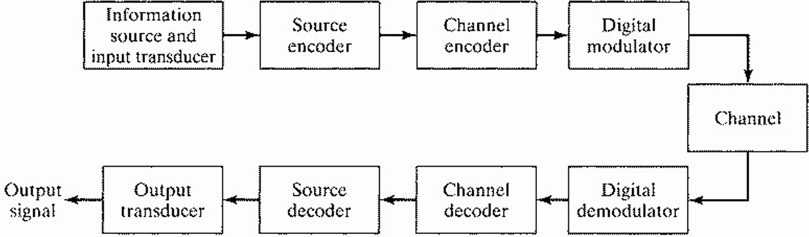

### 🎯 本课程学习内容概览

1.  **绪论**: 通信发展史、数字通信基本概念。
2.  **信号分析基础**: 确定与随机信号分析。
3.  **模拟信号的数字编码**: 将模拟信号转换为数字形式。
4.  **数字基带传输系统**: 核心内容，包括判决方法和码间串扰(ISI)的消除。
5.  **数字载波调制传输系统**: 将数字信号调制到高频载波上。
6.  **传输信道**: 信号传输的媒介。
7.  **同步原理与技术**: 确保收发两端同步。
8.  **扩展频谱通信技术**: 提高抗干扰能力。
9.  **信道复用与多址技术**: 多用户共享信道。

> ⚠️ **注意**: 课件中提到，部分内容如希尔伯特变换、奈奎斯特第二/第三准则、GMSK理论分析等仅做简要介绍，不作为考试基本要求。

---

## 第一章：绪论

### 1.1 🎯 本章基本内容

-   简要介绍通信的目的。
-   介绍通信系统，特别是数字通信系统的基本组成和特点。
-   介绍数字通信系统的有关术语、主要性能指标和度量参数。

### 1.2 💡 通信的基本概念

#### 🤔 通信的目的
通信的根本目的是克服某种障碍，实现信息高效、准确地传递。
1.  **克服距离上的障碍**：实现信息的远程传送（如打电话）。
2.  **克服时间上的障碍**：实现信息的传递和传承（如书籍、硬盘存储）。

#### 📖 核心术语定义
-   **通信**: 克服距离上的障碍，交换和传递消息。
-   **消息**: 通信的内容，如文字、符号、数据、图片、语音和活动图像。
-   **信息**: 消息的内涵，消息是信息的载体。
-   **信号**: 与消息一一对应的电量，是消息的物质载体。
-   **数字信号**: 时间和幅度取值均为离散的信号。
-   **通信系统**: 传递信息所需的一切技术设备的总和。
    -   **狭义的通信系统**: 利用电信号和光信号来传递信息的电通信、光通信或电光混合的通信系统。
    -   **广义的通信系统**: 包括电通信、光通信，以及普通邮件、报纸、杂志等各种介质的记录与重放。

#### 🗼 身边的通信：视距传播
为什么电视塔通常都很高？这是为了增大视距传播的距离。

-   **原理**: 发射和接收天线必须在视线范围内。
-   **数学模型**:
    地球可近似看作一个半径为 $r$ 的球体，天线高度为 $h$，视距为 $d$。根据勾股定理：
    $d^2 + r^2 = (r+h)^2$
    展开后得到：
    $d^2 = 2rh + h^2$
    由于天线高度 $h$ 远小于地球半径 $r$ ($h \ll r$)，可以忽略 $h^2$ 项，得到近似公式：
    $d \approx \sqrt{2rh}$

-   **有效无线电视距公式**:
    考虑到大气折射等因素，引入一个调整因子 $K$（经验值为 $K=4/3$），得到更实用的公式：
    $d = 3.57\sqrt{Kh}$

    > ⚠️ **易错点**: 注意单位！在此公式中，距离 **d** 的单位是千米 (km)，天线高度 **h** 的单位是米 (m)。

### 1.3 🛠️ 数字通信系统的基本组成

#### 🧩 通信系统的基本要素
一个基本的通信系统由三个核心部分组成：
1.  **发射机** 📤: 将电信号转换成适合在信道中传输的形式（如电磁波、光波），核心技术是**调制**。
2.  **信道** 🌐: 信号传输的物理媒介，会引入**噪声**。
3.  **接收机** 📥: 从信道中接收信号，并将其还原成原始电信号，核心技术是**解调**。

#### 🧱 数字通信系统详细组成模型

-   **信源**: 产生待传输的消息。
-   **信源编码器**: 完成模拟信号到数字信号的转化，并进行数据压缩以提高效率。
-   **信道编码器**: 对数字信号进行差错控制编码，以抵抗信道噪声的干扰。
-   **数字调制器**: 将数字符号序列变换成适合在信道中传输的信号波形。
-   **信道**: 传送信号的物理媒质。
-   **接收端**: 接收端的数字解调器、信道译码器、信源解码器分别完成与发送端相反的功能。

#### 📡 两种基本的通信模式
1.  **广播模式** 📢: 一个发射机对多个接收机，如收音机、电视。
2.  **点对点(P2P)模式** 👤↔️👤: 一个发射机对一个接收机，如打电话、发短信。

### 1.4 ✨ 数字通信的特点

#### 👍 优点
1.  **抗噪声和干扰能力强** 💪
    -   数字信号只有有限种状态，易于识别和重构。即使信号在传输过程中受到干扰而失真，只要能识别出其状态，就可以在接收端或中继站完美再生，从而抑制噪声的积累。

2.  **便于提高消息传输效率** ⚡
    -   可以对数字信号进行压缩编码处理。
    -   很容易实现时分复用，提高信道（如光缆）的传输效率。

3.  **便于在传输过程进行差错控制** ✅
    -   通过纠错编码技术，可以在接收端检测并纠正传输中产生的错误。

4.  **便于对信息进行加密处理** 🔒
    -   数字信号易于进行加密和解密操作，保密性好。

5.  **便于采用大规模集成电路实现** ⚙️
    -   数字通信设备的处理和控制功能可以使用ASIC、FPGA、DSP等大规模集成电路实现，设备体积小、功耗低、可靠性高。

#### 👎 缺点
1.  **带宽要求更高** 📈
    -   通常情况下，传输数字信号比传输原始模拟信号需要更宽的频带。
2.  **需要同步** ⏳
    -   接收端需要与发送端在码元、帧、载波等多个层面上保持同步。
3.  **具有“门限效应”** 📉
    -   当信噪比下降到一定限度（门限）时，通信系统的性能会急剧恶化。

### 1.5 📊 数字通信系统的基本性能指标

#### 1. 有效性：传输速率

衡量单位时间内系统能传输信息量的大小。
-   **波特率 (Baud Rate, $R_S$)**: 单位时间内传输的码元数，也称符号速率。单位是**波特 (Baud)**。
-   **比特率 (Bit Rate, $R_b$)**: 单位时间内传输的二进制数据的位数。单位是**比特/秒 (b/s, bps)**。

> ⚠️ **注意点**
> 波特率和比特率是两个不同的概念！
> - **波特率**关心的是每秒传输多少个“符号”（码元）。
> - **比特率**关心的是这些符号总共代表了多少个“比特”。
> 只有在使用二进制符号（一个码元只代表1比特）时，两者在数值上才相等。

对于一个使用 $N$ 进制符号的系统，每个码元可以携带 $\log_2 N$ 比特的信息。因此，比特率和波特率的关系为：
$\boxed{R_b = R_S \cdot \log_2(N)}$

#### 2. 可靠性：传输质量

衡量接收信号的准确程度。
-   **信噪比 (Signal-to-Noise Ratio, SNR)**: 信号平均功率 $S$ 与噪声平均功率 $N$ 之比。
    $SNR = \frac{S}{N}$
    通常用分贝 (dB) 表示：
    $(SNR)_{dB} = 10\lg(\frac{S}{N})$

-   **误码率 ($P_s$) 与 误信率 ($P_b$)**
    -   **误码率**: 错误码元符号数 / 总码元符号数
    -   **误信率 (Bit Error Rate, BER)**: 错误比特数 / 总比特数，是更常用的指标。

#### 3. 频带利用率 (Bandwidth Efficiency, $\eta$)

衡量单位带宽内能达到的传输速率。
-   **单位**: b/s/Hz (比特/秒/赫兹)
-   **计算公式**:
    $\eta = \frac{R_b}{B}$
    其中 $R_b$ 是比特率， $B$ 是占用的带宽。

### 🧠 本章学习总结

本章作为《通信原理》的入门，主要建立了对通信系统的宏观认识。
1.  **核心概念**: 我们理解了通信的根本目的，并掌握了信息、消息、信号等基本术语的定义。
2.  **系统模型**: 我们学习了数字通信系统的标准模型，了解了从信源到信宿的各个功能模块（信源编码、信道编码、调制等）的作用。
3.  **数字通信优劣**: 我们明确了数字通信相较于模拟通信的核心优势（抗干扰、易于处理和加密）以及其固有的缺点（带宽需求、同步、门限效应）。
4.  **性能铁三角**: 我们初步接触了衡量一个通信系统性能的三个关键维度：
    -   **有效性** (速率有多快？- $R_b$)
    -   **可靠性** (传输有多准？- $P_b$)
    -   **效率** (带宽用得省不省？- $\eta$)
    这三个指标之间相互制约，是后续章节中设计和分析通信系统的基础。