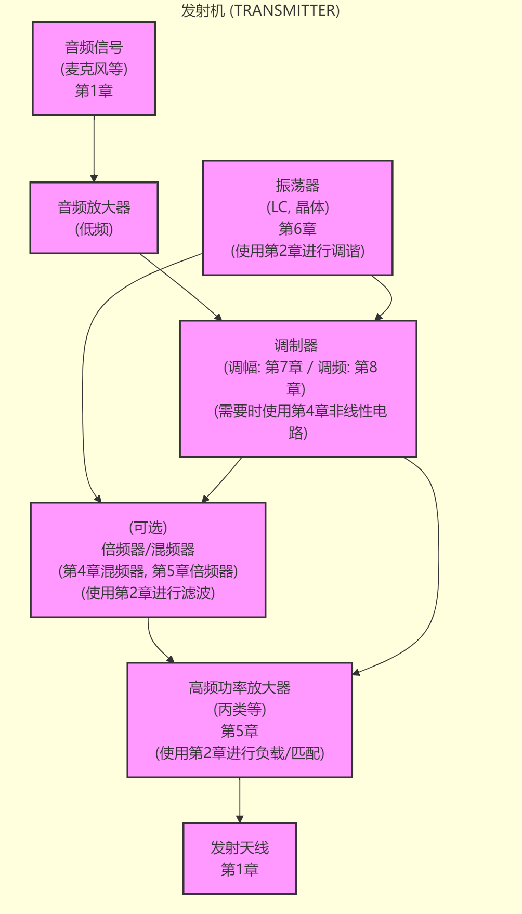
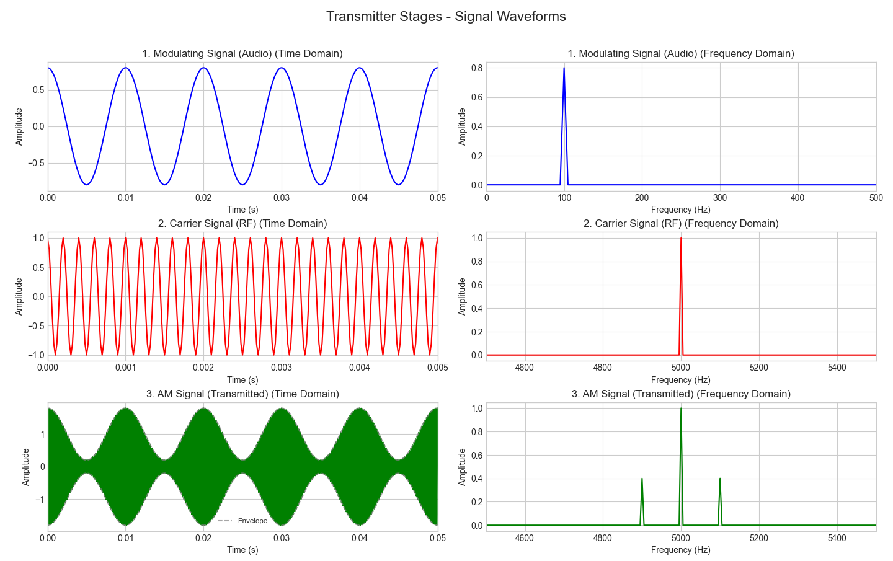

| 章节           | 作业题                                     | 题量     |
| :----------- | :-------------------------------------- | :----- |
| 第1章: 绪论      | /                                       |        |
| 第2章: 选频网络    | 1,3,4,5,6,7,9,10,13,14,17,18            | 12     |
| 第3章: 小信号放大   | 1,2,3,4,6,9,10,12,13,28                 | 10     |
| 第4章: 混频器     | 2,8,17,19,20,21,27,28,34,35,36,39       | 12     |
| 第5章: 高功放     | 1,3,6,8,11,16,18,19,26,27,29            | 11     |
| 第6章: 振荡器     | 3,5,6,7,11,13,14,16,22,(28),29          | 10     |
| 第7章: 振幅调制与解调 | 1,2,3,4,5,6,7,9,10,12,14,15,17,18,19,24 | 16     |
| 第8章: 角度调制与解调 | 2,4,5,8,9,10,11,13,15,16,20,21,22,26    | 14     |
| **合计**       |                                         | **85** |

---
## 📚 第1 章 绪论

### 1.1 无线电发射机的基本工作原理 📡

1.  **基本概念**:
    *   当一个导体（如天线）上载有**高频电流**（载波电流或载波，频率例如 $f = 3 \sim 30$ MHz）时，它会向空间辐射电磁能量。该导体就是**发射天线**。
    *   如果用有用的信号（如电话或电报信号）去控制载波电流，那么辐射出去的电磁能量中就会包含这些信息信号。这就是无线电信号的**发送过程**。

2.  **工作原理**:
    *   首先，产生一个**高频振荡信号**（载频）。
    *   然后，使用**调制信号**（如音频信号）对高频振荡信号进行**调制**，使得高频信号的某个参数（如幅度、频率或相位）按照调制信号的规律变化。
    *   最后，将已调制的信号通过**发射天线**发射到空间中。

3.  **关键信号**:
    *   **音频信号 (Audio Signal)** 🎵: 作为有用的信息信号，其频率范围通常为 $20 \text{ Hz} \sim 20 \text{ KHz}$，具有一定的带宽。
    *   **载频信号 (Carrier Frequency)**  : 作为运载信息的工具，它承载着信息信号向空间辐射。其频率范围通常在 MHz 到 GHz 量级。

4.  **简化流程示意**:

5.  **调幅广播发射机方框图示例**:
    *   **音频部分**: 声音 🎤 $\rightarrow$ 话筒 $\rightarrow$ 音频放大器 $\rightarrow$ 调制器
    *   **高频部分**: 高频振荡器 $\rightarrow$ 高频功率放大器 $\rightarrow$ 调制器
    *   **输出**: 调制器输出 $\rightarrow$ (天线)
    *   **目的**: 信号通过逐级放大，在末级功率放大处获得所需的发射功率电平。💪

### 1.2 无线电接收机的基本工作原理 📻

1.  **基本概念**:
    *   无线电信号的**接收过程**与发送过程正好相反。
    *   **接收天线**将空间中的电磁波转变为**已调波电流**。
    *   通过**解调**（或称**检波**）从已调波电流中恢复出原始的信号（如音频信号）。
    *   最后，使用**扬声器**或听筒将音频电流转换为**声能** 🔊，使我们能听到声音或音乐。
    *   最简单的接收机就是一个**检波器**。

2.  **基本组成与功能**:
    *   **调谐回路 (Tuning Circuit)** 🎯: 从天线感应到的众多信号中选择出所需要的有用信号。
    *   **解调器 (Demodulator/Detector)**: 将高频已调波中包含的有用信息（如音频信号）检取出来。
    *   **负载 (Load)**: 通常是扬声器或耳机，将解调出的电信号转换为声音或其他形式。

3.  **简化流程示意**:
    *   (天线) $\rightarrow$ 调谐回路 $\rightarrow$ 解调器 $\rightarrow$ 扬声器(负载)

4.  **超外差接收机 (Superheterodyne Receiver)** ✨:
    *   **核心**: 混频器 (Mixer)。
    *   **原理 (外差作用)**: 将接收到的**不同载波频率**的信号，通过与**本地振荡器 (Local Oscillator)** 产生的信号进行**混频**，统一变换为一个**固定的中频 (Intermediate Frequency, IF)**。在这个过程中，信号的**包络形状保持不变**。
    *   **优点**: 大幅提高接收机的**灵敏度** (接收微弱信号的能力) 和**邻道选择性** (区分相邻频率信号的能力)。👍
    *   **典型框图**: (天线) $\rightarrow$ 高频放大器 (RF Amp) $\rightarrow$ 混频器 (Mixer) $\leftarrow$ 本地振荡器 (LO) $\rightarrow$ 中频放大器 (IF Amp) $\rightarrow$ 检波器 (Detector) $\rightarrow$ 低频放大器 (AF Amp) $\rightarrow$ 扬声器

5.  **收音机小知识** 💡:
    *   调频 (FM): 我国 $87.5 - 108.0$ MHz，步进 $0.1$ MHz。
    *   中波 (MW): $531 - 1602$ KHz，步进 $9$ KHz。
    *   短波 (SW): $2.30 - 26.10$ MHz，步进 $5$ KHz。

### 1.3 无线电波的传播 🌊

1.  **传输媒质**: 信号从发送端到接收端需要经过传输媒质。
2.  **通信分类 (按媒质)**:
    *   **有线通信 🔗**:
        *   双线对电缆: 频率较低，易辐射。
        *   同轴电缆: 频率较高。
        *   光纤: 高频，衰耗小，带宽大。
    *   **无线通信 📡**: 利用电磁波在空间传播。

3.  **无线电波主要传播方式**:
    *   **地面波 (Ground Wave)**:
        *   方式: 沿地球表面绕射传播。
        *   特点: 传播距离近，频率越高，地面对信号的衰减越大。
        *   应用: 主要用于长波和中波广播、通信。
    *   **天波 (Sky Wave)**:
        *   方式: 依靠空中**电离层 (Ionosphere)** 的折射或反射传播。🌌
        *   特点: 传播距离远，但易受电离层变化影响，产生"衰落" (Fading) 现象；高到一定频率会穿透电离层。
        *   应用: 主要用于短波广播和通信。
    *   **空间波 (Space Wave)**:
        *   方式: 在视线距离内沿直线传播，包括**直射波 (Direct Wave)** 和**地面反射波 (Reflected Wave)**。
        *   特点: 传播受地面障碍物阻挡，基本限于视距 (Line-of-Sight, LOS) 范围内；可通过卫星中继大大提高传播距离。🛰️
        *   应用: 主要用于电视广播、微波通信等超短波及更高频段。📺

---

### 💡 通信电子电路的主要内容预览

本课程将涉及通信系统中电子电路的以下主要方面：

1.  **信号的放大**:
    *   高频小信号放大
    *   高频功率放大
2.  **信号的产生**:
    *   振荡器 (Oscillator)
3.  **信号的变换**:
    *   频率变换: 倍频器 (Frequency Multiplier)、变频器 (Frequency Mixer/Converter)
    *   调制 (Modulation): 调幅 (AM)、调频 (FM)、调相 (PM)
    *   解调 (Demodulation): 检波 (Detection for AM)、鉴频 (Frequency Discrimination for FM)、鉴相 (Phase Discrimination for PM)

---

## 📚 第2章 选频网络

### 2.1-2.2 串联、并联谐振电路及信号源/负载的影响 (掌握)

#### 1. 对串联谐振回路的影响

*   **空载品质因数** ($Q_o$): 回路自身的品质因数。
    $$ \boxed{ Q_o = \frac{\omega_o L}{R} } $$
    (其中 R 是回路自身电阻)
*   **有载品质因数** ($Q_L$): 考虑信号源内阻 $R_s$ 和负载电阻 $R_L$ 后的等效品质因数。
    $$ \boxed{ Q_L = \frac{\omega_o L}{R + R_s + R_L} } $$
*   **影响**:
    *   由于 $R_s > 0, R_L > 0$，必然有 $Q_L < Q_o$。信号源和负载的接入**降低**了回路的等效 Q 值。📉
    *   Q 值降低导致回路的**选择性变差**，**通频带加宽**。
*   **结论**:
    *   💡 串联谐振回路适用于信号源内阻 $R_s$ **很小**（接近恒压源）和负载电阻 $R_L$ **不大** 的情况，这样才能使 $Q_L$ 不至于太低，保证较好的选择性。👍
    *   当有多个负载电阻时，需先将所有串联电阻（包括回路自身电阻、源内阻、所有负载电阻）**合并**成一个总电阻，再计算 $Q_L$。

#### 2. 对并联谐振回路的影响

*   **等效电路**: 考虑信号源（电流源 $I_s$ 并联内阻 $R_s$ 或电导 $G_s=1/R_s$）和负载电阻 $R_L$（或电导 $G_L=1/R_L$）后，所有并联支路可以合并。
    *   回路自身损耗等效为并联电导 $G_0 = 1/R_p$。
    *   总并联电导：$G_\Sigma = G_0 + G_s + G_L$
    *   总并联电容：$C_\Sigma = C + C_s + C_L$ (C是回路电容, $C_s, C_L$ 是源和负载的等效并联电容)
*   **空载品质因数** ($Q_o$):
    $$ \boxed{ Q_o = \frac{\omega_o C_\Sigma}{G_0} = \frac{R_p}{\omega_o L} } $$ (使用 $R_p$ 时 $C_\Sigma \approx C$)
*   **有载品质因数** ($Q_L$):
    $$ \boxed{ Q_L = \frac{\omega_o C_\Sigma}{G_\Sigma} = \frac{\omega_o C_\Sigma}{G_0 + G_s + G_L} } $$
*   **谐振频率**:
    $$ \boxed{ f_0 = \frac{1}{2\pi \sqrt{LC_\Sigma}} } $$
*   **影响**:
    *   由于 $G_s > 0, G_L > 0$，则 $G_\Sigma > G_0$，必然有 $Q_L < Q_o$。信号源和负载的接入同样**降低**了并联回路的等效 Q 值。📉
*   **结论**:
    *   💡 与串联谐振相反，并联谐振通常适用于信号源内阻 $R_s$ **很大**（接近恒流源）和负载电阻 $R_L$ **也较大** 的情况，这样 $G_s$ 和 $G_L$ 较小，使得 $Q_L$ 较高，获得较好的选择性。👍
    *   计算 $Q_L$ 时，需将所有并联负载（源电导、负载电导、回路自身电导）**合并**成一个总电导 $G_\Sigma$。

#### 3. 信号源与负载对回路影响总结 (掌握)

1.  **Q值下降**: 信号源与负载的接入总是使回路的等效 Q 值下降，选择性变差，通频带变宽。📉
2.  **功率传输下降**: 信号源与负载阻抗（或内阻）往往不匹配，导致负载获得的信号功率可能很小。💔 (需要阻抗匹配)
3.  **谐振频率偏移**: 信号源的输出电容 $C_s$ 和负载的输入电容 $C_L$ 会并入（或影响）回路的总电容，改变回路的谐振频率。⚙️
    $$ C_{\Sigma} = C + C_s + C_L $$
    $$ f_0' = \frac{1}{2\pi \sqrt{LC_\Sigma}} $$ (新的谐振频率)

---

### 2.3 串并联阻抗的等效互换与阻抗变换 (熟练掌握)

#### 1. 串并联阻抗的等效互换

*   **目的**: 分析和设计电路时，常需在高频下将串联 R-X 电路等效为并联 R-X 电路，或反之。这是阻抗匹配和抽头电路设计的基础。🔄
*   **等效条件**: 在指定工作频率 $\omega$ 下，从两个端口看进去的**阻抗（或导纳）相等**。
*   **串联转并联**:
    *   串联阻抗: $Z_s = R_s + jX_s$
    *   等效并联导纳: $Y_p = G_p + jB_p = \frac{1}{R_p} - j\frac{1}{X_p}$ (假设 $X_p$ 与 $X_s$ 同号)
    *   串联导纳: $Y_s = \frac{1}{Z_s} = \frac{1}{R_s + jX_s} = \frac{R_s}{R_s^2 + X_s^2} - j\frac{X_s}{R_s^2 + X_s^2}$
    *   令 $Y_s = Y_p$，得到等效关系:
        $\boxed{ R_p = \frac{R_s^2 + X_s^2}{R_s} = R_s(1 + Q_s^2) }$
        $\boxed{ X_p = \frac{R_s^2 + X_s^2}{X_s} = X_s(1 + \frac{1}{Q_s^2}) }$
    *   其中，串联品质因数 $Q_s = \frac{|X_s|}{R_s}$。
*   **并联转串联** (可通过上述公式反解，或直接计算)：
    *   $\boxed{ R_s = \frac{R_p}{1 + Q_p^2} }$
    *   $\boxed{ X_s = \frac{X_p Q_p^2}{1 + Q_p^2} }$
    *   其中，并联品质因数 $Q_p = \frac{R_p}{|X_p|}$。
*   **品质因数关系**: 对于等效的串并联电路， $Q_s = Q_p = Q$。
    $Q = \frac{|X_s|}{R_s} = \frac{R_p}{|X_p|}$
*   **高 Q 近似 (Q >> 1)** ✨:
    *   $R_p \approx Q^2 R_s$ (并联等效电阻远大于串联电阻)
    *   $X_p \approx X_s$ (并联等效电抗约等于串联电抗)
*   **结论**:
    *   **结论1**: 串联电路转换成等效并联电路后，电抗 $X_s$ 与 $X_p$ 性质相同（同为感性或容性）。当 Q 值较大时，电抗值 $X$ 基本不变；而并联电阻 $R_p$ 比串联电阻 $R_s$ 大 $Q^2$ 倍 (约)。👍
    *   **结论2 (例子)**: 对于并联谐振回路，其损耗（串联于电感支路的电阻 R）等效到并联回路两端时变成 $R_p = Q^2 R = \frac{(\omega_0 L)^2}{R} = \frac{L}{CR}$。 因此，并联在回路两端的等效电阻 $R_p$ 越大，相当于串联损耗电阻 R 越小，回路的 Q 值就越高。反之，$R_p$ 越小，串联 R 越大，Q 值越低。🎯

#### 2. 阻抗变换电路

*   **❓ 问题**: $R_s$ 与 $R_L$ 满足什么关系时， $R_L$ 可以获得最大功率传输？
    *   **✅ 答案**: 对于纯阻性电路，当 $R_L = R_s$ 时。对于含电抗的电路，当 $Z_L = Z_s^*$ （负载阻抗等于源阻抗的共轭）时，即 $R_L = R_s$ 且 $X_L = -X_s$。
*   **❓ 问题**: 如果 $R_L$ 不能满足最大功率传输条件，该怎么办？
    *   **✅ 答案**: 使用**阻抗变换电路**（或称阻抗匹配网络）将负载阻抗变换为所需的阻抗值。🔧

#### 3. 变压器耦合阻抗变换 (掌握)

*   **原理**: 利用理想变压器的电压变换和电流变换作用实现阻抗变换。
*   **电路**: 变压器初级匝数 $N_1$，次级匝数 $N_2$，次级接负载 $R_L$。
*   **变比**: $n = N_1 / N_2 = V_1 / V_2$
*   **等效电阻**: 从初级看进去的等效负载电阻 $R_L'$ 满足功率相等原则 $P_1 = P_2$。
    $\frac{V_1^2}{R_L'} = \frac{V_2^2}{R_L} \implies \boxed{ R_L' = (\frac{V_1}{V_2})^2 R_L = n^2 R_L }$
*   **接入系数 (p)**: $p = 1/n = N_2 / N_1 = V_2 / V_1$ (通常 $p<1$)。
    $\boxed{ R_L' = \frac{1}{p^2} R_L }$
    (p 物理意义：接入部分的电压 / 回路两端总电压)从低端等效到高端，电阻变大。

#### 4. 回路抽头的阻抗变换 (熟练掌握)

*   **概念**: 将激励源或负载接入到谐振回路中电感或电容的**一部分**，实现阻抗变换。常用于高频电路。相当于利用电感或电容分压原理。👇
*   **常用形式**:
    *   **电感抽头部分接入**: 利用电感（自耦变压器）分压。⚡️
    *   **电容分压部分接入**: 利用串联电容分压。⚡️
*   **等效原则**: 部分接入的外电路（源或负载）可以**等效**为一个并联在整个谐振回路两端的元件，等效依据是**功率相等**。🔄
*   **电感抽头 (自耦变压器)**:
    *   设总电感 $L = L_1+L_2$，抽头接 $L_2$ 部分。接入系数 $p = L_2 / L$ (忽略互感，简单认为电压按电感分)。
    *   负载 $R_L$ 接在 $L_2$ 两端，等效到整个回路（L 两端）的电阻为 $R_L'$:
        $\boxed{ R_L' = n^2 R_L = \frac{1}{p^2} R_L } \quad (n = L/L_2 = 1/p)$
*   **电容抽头 (电容分压)**:
    *   回路总电压 $V_1$ 加在 $C_1, C_2$ 串联上，负载 $R_L$ 接在 $C_2$ 两端 (电压 $V_2$)。
    *   接入系数 $p = V_2 / V_1 = \frac{C_1}{C_1+C_2}$。
    *   等效到回路总端口 ($V_1$ 处) 的电阻为 $R_L'$:
        $\boxed{ R_L' = n^2 R_L = \frac{1}{p^2} R_L } \quad (n = (C_1+C_2)/C_1 = 1/p)$
*   **变换关系总结 (p为接入系数)** 🎯:
    *   电阻变换: $R_{高} = R_{低} / p^2$  (低端接入的电阻变换到高端) 或 $R_{低} = p^2 R_{高}$
    *   阻抗变换: $Z_{高} = Z_{低} / p^2$ 或 $Z_{低} = p^2 Z_{高}$
    *   导纳变换: $Y_{高} = p^2 Y_{低}$ 或 $Y_{低} = Y_{高} / p^2$
    *   电流变换: $I_{高} = p I_{低}$ (高端电流是低端电流的一部分)
    *   电压变换: $V_{低} = p V_{高}$ (低端电压是高端电压的一部分)
    *   **注意**: '高'指回路整体两端，'低'指接入抽头的部分。 $p<1$ 时，抽头接入将低阻抗变换为高阻抗。 P 越小（抽头越靠近地端/低电位端），变换后的阻抗 $R_L'$ 越大。⚙️
*   **对 Q 的影响**: 将并联的负载电导 $g_i$ 和电容 $C_i$ 通过抽头接入 ($p$)，等效到回路两端的电导和电容分别为 $g_i' = p^2 g_i$ 和 $C_i' = p^2 C_i$。
    *   由于 $p<1$，等效接入的电导 $g_i'$ 减小 (即等效电阻增大)，有助于维持较高的回路 Q 值。👍
    *   等效接入的电容 $C_i'$ 也减小，使得外部电容变化对回路谐振频率的影响减小。👍

---

### 2.4 耦合回路 (熟练掌握)

#### 1. 概念与类型

*   **定义**: 由两个或两个以上**单谐振回路**通过一定方式**互相耦合**组成的网络。🔗
*   **目的**: 获得比单调谐回路更接近**矩形**的频率响应特性 (改善选择性)，同时也可实现阻抗变换。📈
*   **常用耦合方式**:
    *   **互感耦合**: 通过互感 M 耦合。可以是并联-并联，串联-串联，并联-串联等。
    *   **电容耦合**: 通过耦合电容 $C_M$ 耦合。可以是并联-并联，串联-串联等。

#### 2. 耦合系数 (K)

*   **定义**: 衡量回路间耦合强弱的**无量纲**参数。定义为耦合元件的电抗绝对值与初、次级回路中同性质电抗绝对值的几何平均值之比。🔗
*   **互感耦合**:
    $\boxed{ K = \frac{\omega M}{\sqrt{(\omega L_1)(\omega L_2)}} = \frac{M}{\sqrt{L_1 L_2}} }$
    (若 $L_1 = L_2 = L$, 则 $K = M/L$)
*   **电容耦合** (按课件定义):
    $\boxed{ K = \frac{C_M}{\sqrt{(C_1+C_M)(C_2+C_M)}} }$
    (若 $C_1 = C_2 = C$, 则 $K = \frac{C_M}{C+C_M} \approx \frac{C_M}{C}$ 当 $C \gg C_M$)
*   **性质**: K 总是**小于 1** 的正数 ($0 < K < 1$)。

#### 3. 等效电路与反射阻抗 (互感耦合串联型为例) (掌握)

*   **电路方程**:
    *   初级: $Z_{11}\dot{I}_1 - j\omega M \dot{I}_2 = \dot{V}_1$
    *   次级: $-j\omega M \dot{I}_1 + Z_{22}\dot{I}_2 = 0$
    (其中 $Z_{11} = R_1 + jX_{11}$, $Z_{22} = R_2 + jX_{22}$)
*   **反射阻抗**: 次级回路对初级回路的影响可以等效为一个**反射阻抗** $Z_{f1}$ 串联在初级回路中；初级对次级的影响等效为 $Z_{f2}$。
    *   次级反射到初级: $\boxed{ Z_{f1} = \frac{(\omega M)^2}{Z_{22}} }$
    *   初级反射到次级: $\boxed{ Z_{f2} = \frac{(\omega M)^2}{Z_{11}} }$
*   **等效电路**:
    *   初级等效: 电压源 $\dot{V}\_1$ 驱动总阻抗 $Z\_{e1} = Z\_{11} + Z\_{f1}$。
    *   次级等效: 等效电压源 $\dot{V}\_{e2} = j\omega M \dot{I}\_1 = \frac{j\omega M}{Z\_{11}+Z\_{f1}}\dot{V}\_1$ 驱动总阻抗 $Z\_{e2} = Z\_{22} + Z\_{f2}$ (注意课件图示 $Z\_{e2}$ 似乎仅为 $Z\_{22}$ 串 $Z\_{f2}$，等效源为 $\frac{j\omega M}{Z_{11}}\dot{V}\_1$)。 🔗➡️🔌+🔌
*   **反射阻抗性质**: $Z_{f1} = R_{f1} + jX_{f1} = \frac{(\omega M)^2 R_{22}}{|Z_{22}|^2} - j\frac{(\omega M)^2 X_{22}}{|Z_{22}|^2}$
    1.  **反射电阻** $R_{f1}$ 永远为**正**，代表从次级回路转移（或损耗）到初级的能量。💪
    2.  **反射电抗** $X_{f1}$ 的性质与次级回路电抗 $X_{22}$ 的性质**相反**。若 $X_{22}$ 感性 ($>0$)，则 $X_{f1}$ 容性 ($<0$)；反之亦然。🔄
    3.  当次级回路**谐振**时 ($X_{22}=0$)，反射阻抗 $Z_{f1}$ 为**纯电阻** $R_{f1} = (\omega M)^2 / R_{22}$。此时反射电阻与 $(\omega M)^2$ 成正比，与次级回路电阻 $R_{22}$ 成反比。🔥

#### 4. 谐振与频率特性 (熟练掌握概念，掌握分析)

*   **全谐振**: 初级回路和次级回路**同时**在其各自的谐振频率下工作 ($X_{11}=0, X_{22}=0$)。通常假设 $\omega_{01} \approx \omega_{02} = \omega_0$。✨
*   **最佳全谐振**: 全谐振 + 满足最大功率传输条件。此时次级电流 $I_2$ 达到可能的最大值 $I_{2max, max} = \frac{V_{1m}}{2\sqrt{R_{11}R_{22}}}$。🏆
*   **频率响应 (对称回路)**: 假设 $L_1=L_2=L, C_1=C_2=C, R_1=R_2=R, Q_1=Q_2=Q, \omega_{01}=\omega_{02}=\omega_0$。
    *   **广义失谐**: $\xi = Q (\frac{\omega}{\omega_0} - \frac{\omega_0}{\omega}) \approx \frac{2Q\Delta\omega}{\omega_0}$
    *   **耦合因子**: $\boxed{ \eta = K Q = \frac{\omega M}{R} }$ (衡量耦合强弱与回路损耗的相对关系)
    *   **归一化响应曲线**: 幅度响应 $\alpha = \frac{I_{2m}}{I_{2max, max}}$
        $\boxed{ \alpha(\xi) = \frac{2\eta}{\sqrt{(1+\eta^2-\xi^2)^2 + (4\xi^2)}} }$
    *   **响应形状**:
        *   **弱耦合 (欠耦合, $\eta < 1$)**: 曲线呈**单峰**状，峰值在 $\xi=0$ (即 $\omega=\omega_0$) 处，峰值 $\alpha_{max} = \frac{2\eta}{1+\eta^2} < 1$。耦合越弱，峰值越低，曲线越尖锐。📉
        *   **临界耦合 ($\eta = 1$)**: 曲线仍在 $\xi=0$ 处呈**单峰**，峰值 $\alpha_{max} = 1$。此时具有**最平坦**的顶部和**最宽**的单峰带宽。👍
            *   通频带 (-3dB): $BW_{0.7} = \frac{\sqrt{2} f_0}{Q}$ 📏
        *   **强耦合 (过耦合, $\eta > 1$)**: 曲线呈**双峰**状（驼峰状 🐫）。
            *   峰值位置: $\xi_{peak} = \pm \sqrt{\eta^2 - 1}$。
            *   峰值高度: $\alpha_{peak} = 1$。
            *   中心点 ($\xi=0$) 处**下凹**，凹点值 $\alpha(0) = \frac{2\eta}{1+\eta^2} < 1$。
            *   $\eta$ 越大，双峰分得越开，中心凹陷越深。📈📉

#### 5. 物理意义解释 (了解)

*   **双峰现象 (强耦合时)** 🤔💡:
    *   当 $\omega = \omega_0$ 时，次级谐振，其阻抗 $Z_{22}$ 最小 (为 $R_{22}$)。反射到初级的阻抗 $Z_{f1}$ 为最大纯电阻 $(\omega_0 M)^2/R_{22}$。这使得初级总阻抗 $Z_{11}+Z_{f1}$ 较大，导致初级电流 $I_1$ 在 $\omega_0$ 处可能出现凹陷。次级电流 $I_2$ 与 $I_1$ 有关，也可能随之出现凹陷。
    *   当 $\omega < \omega_0$ 时，初、次级均呈容性 ($X_{11}<0, X_{22}<0$)。反射电抗 $X_{f1}$ 为感性。这个感性 $X_{f1}$ 可能与初级的容性 $X_{11}$ 在某个频率 $\omega_1 < \omega_0$ 处发生谐振（抵消），使得初级总阻抗的模减小， $I_1$ 出现峰值，从而 $I_2$ 也出现峰值。
    *   当 $\omega > \omega_0$ 时，初、次级均呈感性 ($X_{11}>0, X_{22}>0$)。反射电抗 $X_{f1}$ 为容性。这个容性 $X_{f1}$ 可能与初级的感性 $X_{11}$ 在某个频率 $\omega_2 > \omega_0$ 处发生谐振，产生另一个峰值。
    *   耦合越强 (M 越大)，反射阻抗越大，这两个峰值频率 $\omega_1, \omega_2$ 离中心频率 $\omega_0$ 越远。

#### 6. 问题回答

*   **❓ 问题 (P45a)**: 在 $\xi=0$ 处，要使 $\alpha \ge 0.707$，以满足通频带的要求，对 $\eta$ 有何限制？
    *   **✅ 回答**: 要求 $\alpha(0) = \frac{2\eta}{1+\eta^2} \ge \frac{1}{\sqrt{2}}$。解此不等式得到 $\sqrt{2}-1 \le \eta \le \sqrt{2}+1$ (约为 $0.414 \le \eta \le 2.414$)。为了获得较平坦的通带，通常选择 $\eta$ 在 1 附近或稍大于 1，但过大的 $\eta$ 会导致中心凹陷过深。
*   **❓ 问题 (P49)**: 如何消除耦合回路频率曲线中间的凹陷？
    *   **✅ 回答**: 频率响应曲线中心的凹陷发生在**强耦合** ($\eta > 1$) 状态下。要消除凹陷，需要**减弱耦合程度**，使耦合因子 $\eta$ **减小**，趋近于**临界耦合** ($\eta=1$) 或进入**弱耦合** ($\eta<1$) 状态。可以通过减小互感 M (拉开线圈距离) 或耦合电容 $C_M$ (减小电容值) 来实现。选择 $\eta=1$ (临界耦合) 可以获得最平坦的单峰响应。

---

### 🌟 本章学习总结

本章主要学习了**选频网络**的基础知识，核心是**谐振电路**及其应用。

1.  **谐振基础**: 回顾了串联和并联谐振的基本特性，重点分析了**信号源内阻**和**负载电阻**对谐振回路**品质因数 Q** 和**选择性**的影响。关键在于理解**有载 Q 值**的概念及其计算。
2.  **阻抗变换与匹配**: 学习了在交流电路中进行**串并联阻抗等效互换**的方法，特别是高 Q 条件下的近似计算。掌握了利用**变压器**和**抽头回路**（电感抽头、电容抽头）进行**阻抗变换**以实现**阻抗匹配**或改善电路性能（如提高 Q 值、减小分布参数影响）的原理和计算。理解**接入系数 p** 的作用至关重要。
3.  **耦合谐振回路**: 了解了采用耦合回路的原因（改善选择性、阻抗变换）。学习了**耦合系数 K** 的定义和计算。重点分析了**互感耦合回路**的工作原理，特别是**反射阻抗**的概念及其性质。掌握了**耦合因子 η** ($=KQ$) 对耦合回路**频率响应特性**（欠耦合、临界耦合、过耦合）的影响，理解单峰、平顶、双峰响应曲线的形成条件和特点。

本章内容是后续学习滤波器、放大器中频率选择性环节等内容的重要基础。特别是阻抗变换和耦合回路的概念，在射频和通信电路设计中应用广泛。🚀

---

## 📚 第3章 高频小信号放大器 学习笔记

### 目录
3.1 概述
3.2 晶体管高频小信号等效电路与参数
3.3 单调谐回路谐振放大器
3.4 多级单调谐回路谐振放大器
3.5 双调谐回路谐振放大器
3.6 谐振放大器的稳定性与稳定措施

---

### 3.1 概述

**1. 小信号放大器分类:** 📢
   *   **小信号低频放大器:** 低频宽带放大器
       *   直流放大器
       *   交流放大器
   *   **小信号高频放大器:** 高频窄带放大器
       *   中心频率范围：几百 kHz ~ 几百 MHz

**2. 高频小信号放大器特点:** ✨
   *   工作频率高，中心频率在几百kHz ~ 几百MHz范围。
   *   具有选频特性，通常负载采用谐振回路。
   *   晶体管工作在线性区，可视为线性元件。
   *   分析方法：可用有源四端网络参数、微变等效电路进行分析。

**3. 主要要求 (质量指标):** 📝

   **(1) 增益 (Gain):** 🔊
   
  *   **电压增益:**
          $\boxed{ A_v = \frac{\dot{V}_o}{\dot{V}_i} }$ 或 $A_v (\text{dB}) = 20 \lg |A_v|$
  *   **功率增益:**
  $\boxed{ G_p = \frac{P_o}{P_i} }$ 或 $G_p (\text{dB}) = 10 \lg G_p$
 *   **分贝(dB):** 定义为两个功率的比值，取常用对数后，再乘以10。

   **(2) 通频带 (Bandwidth):** ↔️
  *   定义：放大器的电压增益下降到最大值的 $\frac{1}{\sqrt{2}}$ 倍时所对应的频率范围。
      $\alpha = \frac{|A_v|}{|A_{v0}|} = \frac{1}{\sqrt{2}}$
  *   也称为 通频带、**3dB带宽** 或 半功率点带宽。
  *   **3dB:** $20 \lg \alpha = 20 \lg \frac{1}{\sqrt{2}} = -3 (\text{dB})$
  *   **半功率点:** $P = V^2 / R$

   **(3) 选择性 (Selectivity):** 🎯
  *   定义：选出有用信号和抑制干扰的能力。
  *   **矩形系数:** 衡量谐振曲线接近理想矩形程度的指标。
      $\boxed{ K_{r0.1} = \frac{BW_{0.1}}{BW_{0.7}} = \frac{2\Delta f_{0.1}}{2\Delta f_{0.7}} }$
      (其中 $BW_{0.1}$ 是电压增益下降到0.1倍时的带宽，$BW_{0.7}$ 是电压增益下降到 $1/\sqrt{2}$ 倍时的带宽)
  *   **注意点:** 指标 $K_{r0.1}$ 越接近1，曲线越接近理想矩形，邻近波道选择性越好，抗干扰能力越强。通常 $K_{r0.1}$ 在 2~5 之间。
  *   理想情况：带内频率响应相同，带外响应为零。

   **(4) 工作稳定性 (Operating Stability):** ⚖️
  *   定义：指放大器的工作状态（直流偏置）、晶体管参数、电路元件参数等发生变化时，放大器主要特性（增益、中心频率、通频带等）的稳定程度。
  *   不稳定现象：增益变化、中心频率偏移、通频带变窄、谐振曲线变形等。
  *   极端情况：放大器自激，导致完全不能工作。

   **(5) 噪声系数 (Noise Figure):** 🎧 (参考 P111)
   *   **信噪比 (SNR):** 电路中某一特定点上的信号功率与噪声功率之比。
  *   **噪声系数 ($F_n$):** 放大器输入端信噪比与输出端信噪比的比值。
     $\boxed{ F_n = \frac{(P_{si}/P_{ni})}{(P_{so}/P_{no})} }$ 或 $F_n (\text{dB}) = 10 \lg F_n$
      (P_si: 输入信号功率, P_ni: 输入噪声功率, P_so: 输出信号功率, P_no: 输出噪声功率)
  *   意义：$F_n$ 表示信号通过放大器后，信噪比变坏的程度 ($F_n \ge 1$)。
  *   **级联放大器的噪声系数:**
  * 其中 $F_{ni}$ 是第i级的噪声系数，$G_{pi}$ 是第i级的额定功率增益。**结论:** 🥇 多级放大器的总噪声系数主要取决于第一级的噪声系数 $F_{n1}$ 和额定功率增益 $G_{p1}$。要降低总噪声系数，关键是降低第一级的噪声系数 $F_{n1}$ 和提高第一级的功率增益 $G_{p1}$。$\boxed{ F_n = F_{n1} + \frac{F_{n2}-1}{G_{p1}} + \frac{F_{n3}-1}{G_{p1}G_{p2}} + \dots + \frac{F_{nN}-1}{G_{p1}G_{p2}\dots G_{p(N-1)}} }$

---

### 3.2 晶体管高频小信号等效电路与参数

**1. 主要等效电路模型:** 🧩
   *   物理模型等效电路: 混合π参数等效电路 (Hybrid-π Model)
   *   网络参数等效电路: **y参数**等效电路 (y-Parameter Model)

**2. 混合π参数等效电路:**
   *   电路图包含 $r_{bb'}$ (基区扩展电阻), $r_{b'e}$ (基射电阻), $C_{b'e}$ (基射电容), $C_{b'c}$ (基集电容), $g_m U_{b'e}$ (跨导电流源), $r_{ce}$ (输出电阻) 等元件。
   *   **注意点:** ⚠️ $C_{b'c}$ (密勒电容) 和 $r_{bb'}$ 的存在对晶体管的高频应用十分不利。
       *   $C_{b'c}$ 会将输出交流信号反馈到输入端，可能引起放大器自激。
       *   $r_{bb'}$ 在共基电路中会引起高频负载反馈，降低电流放大系数。

**3. y参数等效电路:** 🔗
   *   在高频电路中常用，因为晶体管是电流控制器件，输入输出端都有电流，且导纳并联可直接相加，运算简单。
   *   **定义:** 基于四端网络理论，选取端口电压 $u_1, u_2$ 为自变量，端口电流 $i_1, i_2$ 为因变量。
   *   **约束方程:**
      *   通用形式: $\begin{cases} i_1 = y_i u_1 + y_r u_2 \\ i_2 = y_f u_1 + y_o u_2 \end{cases}$
      *   共发射极 (CE) 连接: $\boxed{ \begin{cases} i_b = y_{ie} u_{be} + y_{re} u_{ce} \\ i_c = y_{fe} u_{be} + y_{oe} u_{ce} \end{cases} }$
   *   **y参数释义 (CE):**
      *   $y\_{ie} = g\_{ie} + j\omega C\_{ie} = \frac{\dot{I}\_b}{\dot{V}\_{be}} \Big\|\_{V\_{ce}=0}$: 输入导纳 (输出端交流短路)
      *   $y\_{re} = g\_{re} + j\omega C\_{re} = \frac{\dot{I}\_b}{\dot{V}\_{ce}} \Big\|\_{V\_{be}=0}$: 反向传输导纳 (输入端交流短路)，反映输出电压对输入端的影响。
      *   $y\_{fe} = g\_{fe} - j\omega C\_{fe} = \frac{\dot{I}\_c}{\dot{V}\_{be}} \Big\|\_{V\_{ce}=0}$: 正向传输导纳 (输出端交流短路)，反映输入电压对输出电流的控制作用，决定放大能力。
      *   $y\_{oe} = g\_{oe} + j\omega C\_{oe} = \frac{\dot{I}\_c}{\dot{V}\_{ce}} \Big\|\_{V\_{be}=0}$: 输出导纳 (输入端交流短路)
   *   **注意点:** ⚠️ 以上短路参数是晶体管本身的参数 (**内参数**)，只与晶体管特性有关，与外电路无关。
   *   **y参数求法:**
      1.  实际测量: 通过短路相应端口并施加测试信号来测量。
      2.  换算: 由混合π参数等效电路计算得到 (参考P65-66)。
   *   **y参数的优缺点:**
      *   优点➕: 计算方便，尤其适用于并联电路。
      *   缺点➖: y参数是频率的函数，不同频率下参数值不同。

**4. 晶体管的频率参数:** ⏱️
   *   **(1) 截止频率 $f_\beta$ (Beta Cutoff Frequency):**
      *   定义：共发射极电路电流放大系数 $|\beta|$ 下降到其低频值 $\beta_0$ 的 $\frac{1}{\sqrt{2}} \approx 0.707$ 倍时的频率。 $\boxed{ f_\beta }$
   *   **(2) 特征频率 $f_T$ (Transition Frequency):**
      *   定义：共发射极电流放大系数 $|\beta|$ 下降到 1 时的频率。 $\boxed{ f_T }$ 估算：$|\beta| \approx f_T / f$ (当 $f \gg f_\beta$)。
   *   **(3) 最高振荡频率 $f_{max}$ (Maximum Oscillation Frequency):**
      *   定义：晶体管的功率增益 $G_p$ 下降到 1 (0dB) 时的频率。 $\boxed{ f_{max} }$ 实际工作频率通常选取为 $(1/3 \sim 1/4) f_{max}$。

---

### 3.3 单调谐回路谐振放大器

**1. 电路结构与工作原理:** 🏗️
   *   典型共射极高频调谐放大器电路：
      *   **直流偏置电路:** $R_{b1}, R_{b2}$ 分压偏置, $R_e$ 负反馈稳定静态工作点。
      *   **高频交流等效电路:**
          *   输入回路: 输入变压器次级 $B_1$。
          *   晶体管: T (作为放大元件)。
          *   输出回路: LC并联谐振回路、输出变压器 $B_2$ 和负载 $Y_L$。

**2. 在超外差接收机中的位置:** 📻
   *   典型超外差接收机框图：高放 -> 混频 (本振) -> 中放 -> 检波 -> 低放 -> 扬声器。
   *   高频调谐放大器通常用作高放级 (RF Amplifier) 和中放级 (IF Amplifier)。
   *   超外差原理：将接收到的不同载波频率信号变换成固定的中频 (IF)，主要在中频级完成信号的放大和选择。
   *   优点：提高接收机的灵敏度 和邻道选择性。

**3. 放大器性能参数分析 (基于y参数):** 🔬

   *   **接入系数 (Coupling Coefficients):** 用于阻抗匹配。
      *   晶体管接入回路: $p_1 = N_1/N$ (抽头)
      *   负载接入回路: $p_2 = N_2/N$ (变压器)
*   **(1) 放大器输入导纳 $Y\_i$:** 📥
    *   考虑 $y\_{re}$ 时:
        $$
        \\boxed{ Y\_i = y\_{ie} - \\frac{y\_{re} y\_{fe}}{y\_{oe} + Y''\_L}}
        $$
    *   其中 $Y''\_L$ 是经 $p\_1$ 折合到集电极的总负载导纳。
    *   近似：通常 $Y\_i \\approx y\_{ie}$ (忽略 $y\_{re}$ 的反馈作用)。
*   **(2) 放大器输出导纳 $Y\_o$:** 📤
    *   考虑 $y\_{re}$ 时:
        $$
        \\boxed{ Y\_o = y\_{oe} - \\frac{y\_{re} y\_{fe}}{Y\_s + y\_{ie}} }
        $$
    *   其中 $Y\_s$ 是信号源内导纳。
    *   近似：通常 $Y\_o \\approx y\_{oe}$ (忽略 $y\_{re}$ 的直通作用和信号源内阻影响)。
*   **(3) 电压增益 $A\_v$:** 📈 (参考 P70)
    *   定义: $A\_v = \\frac{u\_{RL}}{u\_{be}}$ (负载电压 / 基极电压)
    *   表达式: $A\_v = \\frac{-p\_1 p\_2 y\_{fe}}{y'}$
    *   其中 $y'$ 是回路的总导纳（包括晶体管输出导纳 $y\_{oe}$ 经 $p\_1$ 折合、回路自身损耗 $g\_o$ 和折合的负载导纳 $p\_2^2 Y\_L$）。 $y' = p\_1^2 y\_{oe} + g\_o + p\_2^2 Y\_L + j(\\omega C\_\\Sigma - \\frac{1}{\\omega L})$ 。
    *   令 $g\_\\Sigma$ 为回路总电导 (在谐振时)， $y' = g\_\\Sigma + j(\\omega C\_\\Sigma - \\frac{1}{\\omega L})$。
    *   电压增益表达式:
        $$
        A\_v = \\frac{-p\_1 p\_2 y\_{fe}}{g\_\\Sigma [1 + j 2Q\_L \\frac{\\Delta f}{f\_0}]}
        $$
    *   **谐振时电压增益:**
        $$
        \\boxed{ A\_{v0} = \\frac{-p\_1 p\_2 y\_{fe}}{g\_\\Sigma} }
        $$
    *   **结论:**
        *   $|A\_{v0}| \\propto |y\_{fe}|$
        *   $|A\_{v0}| \\propto 1/g\_\\Sigma$ (总电导越小，增益越高)
        *   $|A\_{v0}| \\propto Q\_L$ (有载品质因数越高，增益越高)
        *   $A\_{v0}$ 与输入电压反相 (180°)。
*   **(4) 功率增益 $G\_p$:** 💪 (参考 P71)
    *   谐振时功率增益:
        $$
        G\_{po} = \\frac{P\_o}{P\_i}
        $$
    *   若输入输出端匹配（例如 $p\_2^2 g\_L = p\_1^2 g\_{oe}$，并且忽略 $g\_o$），则 $G\_{po} \\approx \\frac{|y\_{fe}|^2}{4 p\_1^2 g\_{oe} g\_{ie}}$ (假设源内阻为 $1/g\_{ie}$)。
    *   **匹配条件 (忽略回路损耗 $g\_o$):** $p\_2^2 g\_L \\approx p\_1^2 g\_{oe} = g\_\\Sigma / 2$
    *   **最大功率增益 (匹配时):**
        $$
        (G\_{po})\_{\\text{max}} = \\frac{|y\_{fe}|^2}{4 g\_{oe} g\_{ie}}
        $$
    *   **插入损耗 $K\_1$:** 考虑回路自身损耗 $G\_o$ 引起增益下降的因素。
        $$
        K\_1 = \\frac{P\_o}{P\_o'} = (1 - \\frac{G\_o}{g\_\\Sigma})^{-2} = (1 - \\frac{Q\_L}{Q\_o})^{-2}
        $$
        (功率比，表示损耗带来的影响， $P\_o'$ 为无损耗时功率)
        其中 $Q\_L = \\frac{\\omega\_0 C\_\\Sigma}{g\_\\Sigma}$ (有载Q值)， $Q\_o = \\frac{\\omega\_0 C\_\\Sigma}{G\_o}$ (空载Q值)。
    *   **注意点:** 💡 为获得较大功率增益，应使插入损耗尽量小，即 $G\_o \\ll g\_\\Sigma$ ($Q\_L \\ll Q\_o$)，也就是负载效应远大于回路自身损耗。
   *   **(5) 通频带 $BW_{0.7}$:** 📏
      *   由并联谐振回路理论: $\boxed{ BW_{0.7} = 2\Delta f_{0.7} = \frac{f_0}{Q_L} }$
      *   与总电导关系: $BW_{0.7} = \frac{g_\Sigma}{2\pi C_\Sigma}$
      *   **增益带宽积:**
          $\boxed{ |A_{v0}| \cdot BW_{0.7} = \frac{p_1 p_2 |y_{fe}|}{g_\Sigma} \cdot \frac{g_\Sigma}{2\pi C_\Sigma} = \frac{p_1 p_2 |y_{fe}|}{2\pi C_\Sigma} \approx \text{常数}\ \ \ \ \ }$
      *   **结论:** 放大器的通频带 与 电压增益 是一对矛盾。增益越高，带宽越窄，反之亦然。
   *   **(6) 选择性 (矩形系数 $K_{r0.1}$):** 📉
      *   对于单调谐回路: $\boxed{ K_{r0.1} = \frac{\Delta f_{0.1}}{\Delta f_{0.7}} = \sqrt{10^2-1} / \sqrt{(\frac{1}{0.707})^2-1} = \sqrt{99} \approx 9.95\ \ }$
      *   **结论:** $K_{r0.1}$ 远大于1，表明谐振曲线尖锐，邻道选择性差，这是单调谐回路放大器的主要缺点。

---

### 3.4 多级单调谐回路谐振放大器

**目的:** 提高增益。

**1. 电压增益:** ⏫
   *   m 级相同放大器级联: $\boxed{ A_m = (A_{v1})^m }$ (总增益为各级增益之积)

**2. 通频带:** ⏳
   *   m 级相同放大器级联: $\boxed{ BW_m = BW_1 \sqrt{2^{1/m}-1} }$
   *   其中 $BW_1$ 是单级通频带，$BW_m$ 是 m 级级联后的总通频带。
   *   **带宽缩减因子:** $\sqrt{2^{1/m}-1} < 1$。
   *   **结论:** 级联后总通频带会缩小，级数 m 越多，缩小越严重。
   *   **设计考虑:** 为达到所需总带宽 $BW_m$，每级带宽 $BW_1$ 必须比 $BW_m$ 更宽。 $BW_1 = BW_m / \sqrt{2^{1/m}-1}$ 。

**3. 选择性:** ✅
   *   m 级相同放大器级联: $\boxed{ K_{r0.1,m} = \frac{\Delta f_{0.1,m}}{\Delta f_{0.7,m}} = K_{r0.1,1} \frac{\sqrt{10^{2/m}-1}}{\sqrt{99(2^{1/m}-1)}} }$
      (简化公式见P40图表)
   *   **结论:** 级联可以改善选择性（$K_{r,m}$ 随 m 增大而减小，趋近于1），但当 $m>3$ 时改善效果不明显。

**4. 增益与通频带的关系:** 🤔
   *   级联放大器的谐振曲线是各单级谐振曲线的乘积。
   *   级数越多，总谐振曲线越尖锐，选择性越好，但通频带越窄。
   *   **单调谐回路总结:**
      *   优点👍: 电路简单，调试容易。
      *   缺点👎: 选择性差，增益和通频带的矛盾比较突出。

---

### 3.5 双调谐回路谐振放大器

**目的:** 改善选择性，缓和增益与通频带的矛盾。

**1. 单级双调谐回路谐振放大器:** (参考 P79)
   *   采用两个互感耦合的谐振回路。
   *   **分析模型:** 通过等效变换，可简化为两个参数相同的、通过互感 M 耦合的 RLC 并联回路。
   *   **耦合系数 $\\eta$:**
      *   定义:
          $$
          \\boxed{\\eta = \\frac{k}{k\_{crit}} = \\frac{M/ \\sqrt{L\_1 L\_2}}{1/\\sqrt{Q\_1 Q\_2}} = k \\sqrt{Q\_1 Q\_2}}
          $$
          （对于并联回路， $k=M/\\sqrt{L\_1 L\_2}$）
      *   若回路参数相同 $Q\_1=Q\_2=Q\_L$: $\\eta = k Q\_L$
      *   $\\eta$ 决定了回路间的耦合松紧程度和频率响应特性。
   *   **频率特性曲线 (由 $\\eta$ 决定):**
      *   $\\eta < 1$ (弱耦合): 单峰，峰值在 $f\_0$，峰值随 $\\eta$ 增大而增高，带宽窄，选择性差。
      *   $\\eta = 1$ (临界耦合): 单峰，峰值在 $f\_0$，峰值最高且顶部最平坦 (马克西玛利平坦)，综合性能较好，应用最多。
      *   $\\eta > 1$ (强耦合/过耦合): 双峰，峰值在 $f\_0$ 两侧对称分布，中心 $f\_0$ 处有凹陷。$\\eta$ 越大，双峰距离越远，中心凹陷越深。带宽宽，矩形系数好，但带内不平坦。

**2. 双调谐回路性能 (临界耦合 $\\eta=1$ 时):** ✨
   *   **(1) 电压增益:**
      *   谐振时最大:
          $$
          \\boxed{ A\_{v0, \\eta=1} = \\frac{-p\_1 p\_2 |y\_{fe}|}{2g} }
          $$
          (g 为单边回路等效电导, $g = g\_\\Sigma/2$)
   *   **(2) 通频带:**
      *   $$
          \\boxed{ BW\_{0.7, double} = \\sqrt{2} \\frac{f\_0}{Q\_L} = \\sqrt{2} \\cdot BW\_{0.7, single} }
          $$
      *   **结论:** 在 $Q\_L$ 相同条件下，临界耦合双调谐回路的通频带是单调谐回路的 $\\sqrt{2}$ 倍。
   *   **(3) 选择性 (矩形系数):**
      *   $$
          \\boxed{ K\_{r0.1, \\eta=1} \\approx 3.16 }
          $$
      *   **结论:** 矩形系数远小于单调谐回路 (9.95)，曲线形状更接近理想矩形，选择性更好。
   *   **解决方法:** 实际中常采用“双-单-双”组合方式，利用双调谐展宽频带，利用单调谐补偿中心凹陷，获得较平坦的带内响应。通常双调谐工作在临界耦合状态。

**3. 多级双调谐回路谐振放大器 (临界耦合):**
   *   **(1) 通频带:**
      *   $$
          \\boxed{ BW\_m = BW\_{1, double} \\sqrt[4]{2^{1/m}-1} }
          $$
   *   **(2) 矩形系数:**
      *   $$
          \\boxed{ K\_{r0.1,m} = \\frac{\\sqrt[4]{10^{2/m}-1}}{\\sqrt[4]{2^{1/m}-1}} }
          $$

---
### 3.6 谐振放大器的稳定性与稳定措施

**背景:** 前面分析多假设 $y\_{re}=0$ (单向化)。实际 $y\_{re} \\neq 0$ 存在内部反馈。

**1. $y\_{re}$ 的影响:** 😟
   *   使输入导纳 $Y\_i$ 与负载 $Y''\_L$ 有关 (反馈)。
   *   使输出导纳 $Y\_o$ 与信号源 $Y\_s$ 有关 (直通)。
   *   导致输入输出相互影响，调谐困难。
   *   严重时，可能导致放大器工作不稳定，甚至自激振荡。

**2. 实现晶体管单向化的方法:** 🛡️

   *   **(1) 失配法:**
      *   原理：通过故意使信号源内阻与晶体管输入阻抗、负载阻抗与晶体管输出阻抗不匹配，来减小 $y\_{re}$ 的影响。
      *   实现：
          *   使负载 $Y''\_L$ 很大（轻载），减小 $Y\_i$ 中的反馈项 ($\\frac{y\_{re}y\_{fe}}{y\_{oe}+Y''\_L}$)。
          *   使 $Y\_s$ 或 $y\_{ie}$ 很大，减小 $Y\_o$ 中的直通项 ($\\frac{y\_{re}y\_{fe}}{Y\_s+y\_{ie}}$)。
      *   物理意义：轻载时，输出电压 $V\_o \\downarrow$，反馈电压 $\\downarrow$。
      *   代价：牺牲增益来换取稳定性（单向化）。
      *   **典型应用: 共射-共基级联电路:**
          *   CE 级的负载是 CB 级的输入阻抗 $1/y\_{ib}$ (很小，即 $Y''\_L = y\_{ib}$ 很大)，使 CE 级的 $Y\_i$ 反馈项减小。
          *   CB 级的信号源是 CE 级的输出阻抗 $1/y\_{oe}$ (较大，即 $Y\_s = y\_{oe}$ 较小)。CB 级的 $y\_{rb}$ 很小，本身反向传输弱。
          *   优点：工作稳定、增益较高、上限频率高、噪声系数较低。适用于大量生产。
          *   Cascode 电路是采用失配法实现晶体管单向化的典型例子。

   *   **(2) 中和法:**
      *   原理：在放大器外部外加一个反馈电路（如中和电容 $C\_N$），产生一个与晶体管内部反馈 ($y\_{re}$ 或 $C\_{b'c}$) 大小相等、极性相反的反馈信号，两者互相抵消。
      *   实现：通常需要变压器或抽头电感来获得反相信号。
      *   条件：$\\dot{I}\_{\\text{feedback, ext}} = -\\dot{I}\_{\\text{feedback, int}}$
      *   **注意点:** ⚠️
          *   完全中和通常只能在一个频率点实现。
          *   需要精心调节中和元件的数值。
          *   中和元件不宜过大，否则会降低增益。
          *   中和电路的效果有限。

---
### 🌟 本章总结

本章主要学习了高频小信号放大器的基本概念、性能指标、分析方法和典型电路。

1.  **核心概念:** 了解了高频窄带放大器的特点（选频、线性工作）及其在通信系统（如超外差接收机）中的作用。
2.  **性能指标:** 掌握了增益（电压/功率）、通频带、选择性（矩形系数）、工作稳定性和噪声系数的定义和计算方法，特别是级联噪声系数的计算及其意义。
3.  **等效电路与参数:** 学习了晶体管在高频下的两种主要等效电路（混合π模型和y参数模型），理解了关键参数（$C_{b'c}$, $r_{bb'}$, y参数, $f_\beta$, $f_T$, $f_{max}$）的物理意义和影响。
4.  **单调谐放大器:** 详细分析了单调谐回路放大器的输入/输出导纳、电压/功率增益、通频带和选择性。认识到其主要缺点是选择性差以及增益与带宽的矛盾。
5.  **多级单调谐放大器:** 了解了级联对增益、通频带（缩窄）和选择性（改善）的影响。
6.  **双调谐放大器:** 学习了双调谐回路通过耦合系数 $\eta$ 改善选择性和带宽的原理。重点掌握了临界耦合状态下的性能分析，其带宽是同Q值单调谐的 $\sqrt{2}$ 倍，选择性更好。
7.  **稳定性问题:** 理解了晶体管内部反馈参数 $y_{re}$ 对放大器稳定性的影响（互作用、自激风险）。
8.  **稳定措施:** 掌握了两种提高稳定性的主要方法：失配法（特别是Cascode电路的应用）和中和法，了解了它们的原理、优缺点和实现方式。

通过本章学习，应能对高频调谐放大器的设计和分析有基本的认识，理解其关键性能指标和设计中的权衡取舍。

---
## 📝 第4章 非线性电路、时变参量电路和变频器 

### 4.1 概述 🧭

1.  **频率变换**：指输出信号的频率与输入信号的频率不同，并且满足一定的变换关系。
2.  **频率变换电路分类**：
    *   频谱搬移电路 (线性频率变换) ✨
        *   **作用**：将输入信号频谱沿频率轴进行不失真的搬移。搬移前后各频率分量的相对大小和频谱内部结构（相互间隔）保持不变。
        *   **应用**：变频、调幅、检波等。
    *   频谱非线性变换电路 (非线性频率变换) 🌪️
        *   **作用**：将输入信号频谱进行特定的非线性变换。
        *   **应用**：调频、鉴频等。

### 4.2 非线性电路的分析方法 🔬

1.  **线性元件** 📏
    *   **定义**：元件的参数（如电阻 R、电容 C、电感 L）与通过元件的电流或加在元件两端的电压无关，其伏安特性曲线是直线。
    *   **特点**：元件参数为常数，满足叠加定理，不能起频率变换作用。
2.  **非线性元件** ⚡
    *   **定义**：元件的参数与通过元件的电流或加在元件两端的电压有关，其伏安特性曲线不是直线（如二极管、晶体管、带磁芯的电感）。
    *   **特点**：工作特性非线性；不满足叠加定理；能起频率变换作用。
3.  **线性电路**：完全由线性元件组成的电路。
4.  **非线性电路**：含有一个或多个非线性元件的电路。

**非线性元件的频率变换作用示例** 🤔：
假设一个非线性元件的特性为 $i = kv^2$。
输入两个信号： $v_1 = V_{1m}(1 + \sin \omega_1 t)$ 和 $v_2 = V_{2m}(1 + \sin \omega_2 t)$。
总电压： $v_\Sigma = v_1 + v_2 = V_{1m} + V_{2m} + V_{1m} \sin \omega_1 t + V_{2m} \sin \omega_2 t$
总电流： $i_\Sigma = k v_\Sigma^2 = k[(V_{1m} + V_{2m}) + V_{1m} \sin \omega_1 t + V_{2m} \sin \omega_2 t]^2$
展开后，电流 $i_\Sigma$ 中会包含 $2V_{1m}V_{2m} \sin \omega_1 t \sin \omega_2 t$ 等乘积项。
利用三角函数积化和差公式：
$\boxed{ \sin \omega_1 t \sin \omega_2 t = \frac{1}{2}[\cos(\omega_1 - \omega_2)t - \cos(\omega_1 + \omega_2)t] }$
可见，输出电流中包含了新的频率分量：差频 $(\omega_1 - \omega_2)$ 和和频 $(\omega_1 + \omega_2)$。这就是非线性元件实现频率变换的基础。

**非线性电路分析方法 (P131)**：

*   **图解法** ✍️：根据非线性元件的特性曲线和输入信号波形，通过作图直接求出电路中的电流和电压波形。（适用于电子管等）
*   **解析法** 🔢：将非线性元件的特性曲线近似地表示为数学式，列出电路方程，从而解得电路中的电流和电压。（适用于晶体管等）
    *   **幂级数法**：适用于混频、小信号检波。
        *   将非线性特性在静态工作点附近展开为泰勒级数：
            $i = b_0 + b_1(v-V_0) + b_2(v-V_0)^2 + b_3(v-V_0)^3 + \dots$
        *   **注意点**：直接分析复杂；信号幅度较小时，取前两项；信号幅度很大时，取至三次项甚至更高次项。
    *   **折线法**：适用于高频功率放大、大信号检波。
        *   用分段线性函数逼近非线性特性。
        *   涉及导通角 $\theta_c$： $\theta_c = \cos^{-1}\left[\frac{V_{BZ}+V_{BB}}{V_{bm}}\right]$ (高频功率放大)
        *   输出电流谐波分量： $i_C = \sum_{k=0}^{\infty} I_k \cos k\omega t$
        *   谐波幅值： $I_k = i_{Cmax} \alpha_k(\theta_c)$，其中 $\alpha_k(\theta_c)$ 是波形分解系数，可查表或公式计算。

### 4.3 变频概述 (对应幻灯片4.5) 🔄

*   **变频** (混频 Mixing)：利用非线性器件的特性，将两个不同频率的信号进行频率变换，取出其中的和频或差频的过程。
*   **超外差接收机中的混频** (典型应用)：
    
    *   输入信号：高频已调信号 $v_s(f_s)$
    *   本地振荡信号 (本振)： $v_o(f_o)$
    *   输出信号 (中频 IF)： $v_i(f_i)$
*   **混频器的功能** (是频谱的线性搬移电路)：
    *   是一个三端口（六端）网络。
    *   输入：高频调制波 $v_s(f_s)$ 和 本地振荡信号 $v_o(f_o)$。
    *   输出：中频信号 $v_i(f_i)$。
    *   关系：输出信号 $v_i$ 与 输入信号 $v_s$ 的包络形状相同，频谱结构相同，只是中心频率 (载频) 不同。
    *   中频频率 (IF) 与输入和本振频率关系：
        $\boxed{ f_I = |f_o \pm f_s| }$
        *   $f_I = f_o - f_s$：输出低中频，称为下变频 (常见于接收机)。
        *   $f_I = f_o + f_s$：输出高中频，称为上变频 (常见于发射机)。
*   **混频过程的关键** 🔑：
    *   获得两个输入信号的乘积项。含有乘积项即可实现频谱搬移。
    *   可通过 非线性元件 或 乘法器 实现。
    *   通常后接带通滤波器（选频网络）选出所需的中频 $f_I = |\omega_o - \omega_s|$。
    *   输出中频信号 $v_I$ 的包络形状没有变化，只是填充频率由 $\omega_s$ 变成了 $\omega_I$。
*   **混频器的电路组成** 🏗️：
    1.  输入回路：调谐于 $f_s$，选择所需输入信号。
    2.  本地振荡器 (LO)：产生混频所需的本振信号 $f_o$。
    3.  非线性器件：起频率变换作用 (核心)。
    4.  输出选频网络：调谐于 $f_I$，取得所需中频输出信号。
*   **对混频器的要求** ✅：
    1.  混频失真要小。
    2.  混频增益 (尤其是功率增益) 要高。
    3.  混频器本身的噪声要尽可能小。
    4.  抗干扰性好，能有效抑制各种混频干扰。
*   **混频器的主要性能指标 (P146)** 📊：
    1.  **变频增益**：
        *   变频电压增益： $A_{vc} = \frac{V_I}{V_s}$ (输出中频电压幅值 / 输入高频电压幅值)
        *   变频功率增益： $\boxed{ G_{Pc} = \frac{P_I}{P_s} }$ (输出中频功率 / 输入高频功率)
    2.  **噪声系数** $F_n$：
        *   $F_n = \frac{P_{si}/P_{ni}}{P_{so}/P_{no}}$ (输入端信噪功率比 / 输出端信噪功率比)
        *   **注意点**：混频器常作为接收机前级，对整机噪声系数影响大，希望 $F_n$ 越小越好。 $F_n$ 取决于混频器自身噪声和变频功率增益。
    3.  **失真与干扰**：
        *   频率失真：指对信号频谱内各频率分量幅度或相位的改变。
        *   非线性失真：产生输入信号中没有的新的频率分量。
    4.  **选择性**：
        *   混频器输出回路需要有良好的选择性，以抑制不需要的干扰信号，要求矩形系数趋近于 1。
*   **变频器的分类** 🗂️：
    1.  按本振 $v_o(t)$ 来源分：自激式 (振荡与混频合一)、他激式 (独立本振)。
    2.  按器件分：二极管、三极管 (BJT)、场效应管 (FET)、差分对管、集成模拟乘法器等。
    3.  按电路结构分：单管、平衡、环形 (双平衡)。

### 4.4 晶体管混频器 (对应幻灯片4.6) ⚙️
* 晶体管混频器从根本上是利用其固有的非线性特性来实现变频的。但在实际分析中，由于通常工作在强本振、弱信号的条件下，我们采用时变跨导（一种时变参量）模型来对其进行更精确的数学描述和性能计算。
*   **基本电路形式 (P147, 图4.6.1)**：
    *   输入方式：基极输入 / 射极输入
    *   注入方式 (本振信号)：基极注入 / 射极注入
    *   放大方式：共射 (CE) / 共基 (CB)
    
*   **特点比较 (P147)**：
    *   **共同点**：$v_s$ 和 $v_o$ 都作用于 BJT 的输入结 (BE结)，利用 $i_c$ 与 $v_{be}$ 的非线性关系 (转移特性) 进行频率变换。
    *   **共基 (CB) vs 共射 (CE)**：
        *   共基电路 (c, d)：高频端工作特性优于共射电路。适用于较高频率 (如 100MHz ~ 300MHz，调频接收机)。
        *   共射电路 (a, b)：
            *   (a) 基入基注：优点是所需本振功率小，输入阻抗高，变频增益大，本振负载轻。缺点是 $v_s$ 对 $v_o$ 有影响，易频率牵引 (本振频率受输入信号影响)。
            *   (b) 基入射注：优点是 $v_s$ 与 $v_o$ 互相影响小，不易频率牵引。缺点是要求本振输出功率较大。
            *   共射电路常用于频率较低场合 (如 $f < 100$MHz，广播、电视接收机)。
*   **工作原理与分析 (以图4.6.1(a)为例, P147)**：
    *   **幂级数法**：
        *   输入 $V_{BE} = V_{BQ} + v_s$，其中 $v_s$ 包含信号和本振。
        *   集电极电流 $i_c = f(V_{BE})$。在静态点 $V_{BQ}$ 展开：
            $i_c = f(V_{BQ}) + f'(V_{BQ})v_s + \frac{1}{2}f''(V_{BQ})v_s^2 + \dots$
        *   当 $v_s = V_{sm}\cos\omega_s t + V_{om}\cos\omega_o t$ (简化形式)，代入展开式的二次项 $\frac{1}{2}f''(V_{BQ})v_s^2$ 会产生 $V_{sm}V_{om}\cos\omega_s t \cos\omega_o t$ 项，从而得到差频 $(\omega_o - \omega_s)$ 和和频 $(\omega_o + \omega_s)$。
        *   输出取差频 $\omega_I = \omega_o - \omega_s$，得到 $i_I \propto V_{sm}$，即中频电流幅度与输入信号幅度成正比，实现了包络信息的保留和载频的改变。
    *   **时变跨导法 (P136)**：
        *   当本振信号 $v_o$ 幅度 $V_{om}$ 远大于输入信号 $v_s$ 幅度 $V_{sm}$ 时 ($V_{om} >> V_{sm}$)。
        *   $V_{BE} = V_{BB} + v_o + v_s$。
        *   此时，晶体管的工作点受强大的 $v_o$ 控制而周期性变化。静态工作点电压近似为 $V_{BQ}(t) = V_{BB} + V_{om}\cos\omega_o t$。
        *   将 $i_c = f(V_{BE})$ 在时变的 $V_{BQ}(t)$ 附近对小信号 $v_s$ 进行展开：
            $i_c(t) \approx f(V_{BQ}(t)) + f'(V_{BQ}(t)) \cdot v_s(t)$
        *   令时变跨导 $\boxed{ g(t) = f'(V_{BQ}(t)) }$。 $g(t)$ 是随 $v_o(t)$ 变化的周期函数，周期与 $v_o$ 相同。
        *   将 $g(t)$ 进行傅里叶级数展开： $g(t) = g_0 + g_1 \cos\omega_o t + g_2 \cos 2\omega_o t + \dots$
        *   输出电流中与 $v_s$ 有关的部分为 $i_{c,s}(t) = g(t) \cdot v_s(t) = (g_0 + g_1 \cos\omega_o t + \dots) \cdot (V_{sm}\cos\omega_s t)$
        *   其中 $g_1 \cos\omega_o t \cdot V_{sm}\cos\omega_s t$ 项包含了差频 $(\omega_o - \omega_s)$ 和和频 $(\omega_o + \omega_s)$。
        *   混频作用主要取决于时变跨导 $g(t)$ 的基波分量 $g_1$。
        *  **时变跨导的基波分量** $g_1 = \frac{1}{\pi} \int_{-\pi}^{\pi} g(t) \cos\omega_o t d(\omega_o t)$
        *   **注意点**：$i_E=f(V_{BE})$ 是非线性的，计算 $g_1$ 复杂，常采用近似或图解法。
*   **变频器计算 (P149-151)**：(基于小信号模型和时变跨导概念)
    1.  **变频跨导** $g_c$：定义为输出中频电流基波幅值与输入信号电压幅值之比。
        *   它是衡量混频器将输入信号电压转换为中频电流能力的关键参数。
        *   推导涉及晶体管的小信号模型 (混合 $\pi$ 模型) 和 $g(t)$ 的基波分量。
        *   近似结果： $g_c \approx \frac{g_1}{2}$ （忽略高频效应时）。考虑高频时， $g_c$ 与 $g_m$ (基波分量)、$\omega_s$, $\omega_T$, $r_{bb'}$, $C_{b'e}$ 等有关。
        *   $\boxed{ g_c = \frac{i_I}{v_s} }$
        *   $g_c$ 主要取决于直流工作电流 $I_E$ (因为它影响 $g_m$ 和 $g_1$)。
    2.  **变频输入电导** $g_{ic}$：混频器对输入信号源呈现的等效输入电导。
        *   影响输入匹配和选择性。推导需要考虑输出中频回路对输入端的影响（通常视为短路）。
    3.  **变频增益**：
        *   电压增益 $A_{vc} = \frac{V_{im}}{V_{sm}} = \frac{g_c}{g_{oc}+G_L}$ ($g_{oc}$ 为混频器输出电导, $G_L$ 为负载电导)。
        *   功率增益 $G_{Pc} = \frac{P_{out}}{P_{in}} = \frac{V_{im}^2 G_L}{V_{sm}^2 g_{ic}} = A_{vc}^2 \frac{G_L}{g_{ic}}$
        *   最大功率增益在 $g_{oc} = G_L$ 时获得： $G_{pcmax} = \frac{g_c^2}{4 g_{ic} g_{oc}}$。
*   **混频器工作状态选择 (P146相关)**：
    *   主要考虑：变频增益、噪声和非线性失真 (干扰)。
    *   **振荡电压 $V_{om}$ 的选择**：
        *   硅管： $V_{om} \approx (150 \pm 50) \text{ mV}$
        *   锗管： $V_{om} \approx (80 \pm 30) \text{ mV}$
        *   一般最佳范围： $V_o = 50 \text{ mV} \sim 200 \text{ mV}$
    *   **发射极电流 $I_E$ 的选择**：
        *   自激式： $I_E \approx (0.4 \sim 0.6) \text{ mA}$
        *   他激式： $I_E \approx (0.3 \sim 0.5) \text{ mA}$
        *   通常： $I_E \approx (0.4 \sim 0.6) \text{ mA}$ (需在增益、噪声、线性度间折衷)

### 4.5 二极管混频器和环形混频器 (P153) 🚦

*   **应用场景**：高质量通信设备、工作频率较高时。
*   **优点**：噪声低，电路简单，组合分量少 (平衡结构)。
*   **单二极管混频器**：
    *   原理：利用二极管的开关特性 (受大信号本振 $v_o$ 控制)。
    *   分析方法：开关函数分析法。
        *   条件：$V_{om} >> V_{sm}$，$v_s(t)$ 可忽略。二极管 D 主要受 $v_o(t)$ 控制，工作在开关状态。
        *   开关函数 $S(t)$：当 $v_o > 0$ (导通) 时 $S(t)=1$；当 $v_o < 0$ (截止) 时 $S(t)=0$。 $S(t)$ 是周期函数。
        *   $S(t)$ 的傅里叶级数： $S(t) = \frac{1}{2} + \frac{2}{\pi}\cos\omega_o t - \frac{2}{3\pi}\cos 3\omega_o t + \dots$
        *   流过二极管的电流 (近似)： $i = g_d S(t) (v_s + v_o - v_i)$，其中 $g_d = 1/r_d$ 是导通电阻的倒数。
        *   输出电流 $i$ 中包含 $\omega_s$, $\omega_o$, $\omega_i$ 以及它们的和差频率与谐波组合，如 $\omega_o \pm \omega_s$, $3\omega_o \pm \omega_s$ 等。通过选频网络取出所需中频。
    *   **特点**：
        *   缺点：匹配困难，组合频率分量多。
        *   优点：结构简单。
*   **二极管平衡混频器**：
    
    (示意图描述：使用两个二极管和中心抽头变压器构成平衡结构)
    *   原理：利用电路的对称性抵消某些不需要的频率分量。
    *   总电流 $i = i_1 - i_2$。
    *   **特点**：
        1.  输出电流中不含本振信号 $v_o$ 及其偶次谐波 ($2\omega_o, 4\omega_o, \dots$) 分量。
        2.  输出频率分量比单管混频器更少，有利于滤波。
        3.  等效电路和指标参数（如变频损耗、噪声系数）与单管相似。
*   **环形混频器** (双平衡混频器)：(自学内容)
    *   通常使用四个二极管构成桥式结构。
    *   特点：能同时抑制本振信号和输入信号 $v_s$ 在输出端的泄漏，具有更好的端口隔离度和更少的杂散输出。性能优异。
*   **集成模拟乘法器混频电路**：(自学内容)
    *   直接利用模拟乘法器芯片实现 $v_s(t) \times v_o(t)$ 的功能。
    *   性能好，使用方便。

**比较：二极管平衡混频器 vs 晶体管混频器输出频谱**

*   二极管平衡混频器：输出包含 $\omega_s, \omega_i, \omega_o \pm \omega_s, \omega_o \pm \omega_i, 3\omega_o \pm \omega_s, \dots$ (抑制 $\omega_o, 2\omega_o, \dots$)
*   晶体管混频器 (单管)：输出包含 $\omega_o, 2\omega_o, \dots, \omega_s, \omega_o \pm \omega_s, 2\omega_o \pm \omega_s, \dots$ (分量较多)

### 4.6 变频干扰 (P159) 🚫🔊

*   **来源**：混频器依靠非线性元件实现变频，同时也会产生许多不需要的频率组合，即杂散响应 (Spurious Response)。
    *   输出信号中可能包含 $|\pm p f_o \pm q f_s|$ 的各种组合 (p, q = 0, 1, 2, ...)。
*   **主要干扰类型**：
    1.  **组合频率干扰** (干扰哨声 / Spurious Whistles)：
        *   当满足 $f_s = \frac{p \pm 1}{q-p} f_I$ 条件的强干扰信号 $f_s$ (这里的 $f_s$ 指干扰频率) 进入中频放大器时，会产生一个等于中频 $f_I$ 的输出，形成干扰。
        *   表现形式：哨声 (频率随调谐变化)。
        *   **注意点**：这是自身组合干扰，与外来干扰信号无关。不能靠提高前级选择性抑制。
        *   **减少方法**：正确选择中频 $f_I$ (避开强干扰频段)，提高混频器线性度 (选择合适工作点)，采用平衡/环形/乘法器电路 (减少组合分量)，使用AGC。
    2.  **副波道干扰** (组合副波道干扰 / Spurious Channel Interference)：
        *   指某个频率 $f_n$ 的外部干扰信号进入混频器后，与本振 $f_o$ 及其谐波发生混频，产生一个等于中频 $f_I$ 的输出。
        *   条件：$|\pm p f_o \pm q f_n| = f_I$。
        *   若正常中频为 $f_I = f_o - f_s$ (下变频)，则干扰频率 $f_n = \frac{1}{q} |p f_o \pm f_I| = \frac{1}{q} |p f_s + (p \pm 1) f_I|$。
        *   表现形式：串台 (听到不想要的电台)、哨叫声。
        *   **主要类型**：
            *   **中频干扰** (IF Interference)：当 $p=0, q=1$ 时，$f_n = f_I$。即干扰频率等于中频频率。
                *   **抑制方法**：提高混频器前级的选择性 (如RF滤波器)，增加中频陷波器 (IF Trap)，合理选择中频数值 (避开工作波段)。
            *   **镜像频率干扰** (Image Frequency Interference)：当 $p=1, q=1$ 时。
                *   干扰频率 $f_{im} = f_o + f_I$ (若 $f_o = f_s + f_I > f_s$) 或 $f_{im} = f_o - f_I$ (若 $f_o = f_s - f_I < f_s$)。
                *   $\boxed{ f_{im} = f_s \pm 2f_I }$ (当 $f_o = f_s \pm f_I$)
                *   镜像频率 $f_{im}$ 与有用信号频率 $f_s$ 关于本振频率 $f_o$ 对称。
                *   **抑制方法**：提高混频器前级的选择性 (镜像抑制比)，提高中频 $f_I$ (使 $f_{im}$ 远离 $f_s$，更容易被前级滤除)。
            *   其它副波道干扰：$p, q$ 取其它值。
    3.  **交叉调制干扰** (Cross Modulation)：
        *   强干扰信号的调制信息转移到有用信号的载波上。
        *   现象：接收有用信号时，听到干扰信号的调制声音。当有用信号消失时，干扰也消失。
        *   原因：通常由混频器的三次非线性项引起。
        *   特点：与干扰载频无关，只与干扰信号强度和调制有关。
        *   **抑制方法**：提高前级选择性，选择合适器件和工作点以提高线性度。
    4.  **互调干扰** (Intermodulation)：
        *   两个或多个强干扰信号 $\omega_1, \omega_2$ 同时作用于混频器，它们的组合频率 $|\pm m \omega_1 \pm n \omega_2|$ 恰好落在有用信号频率 $\omega_s$ 附近。
        *   现象：通常表现为啸叫声或杂乱的干扰声，即使没有有用信号也存在。
        *   原因：主要由二级和三次或更高次非线性引起 。
        *   **抑制方法**：提高前级选择性，选择合适的电路和工作状态 (如利用平方律器件抑制三阶互调)。
    5.  **阻塞干扰** (Blocking)：
        *   一个非常强的邻近频道干扰信号进入混频器，虽然其频率未产生落在中频的组合，但其强度足以改变混频器件的工作点，导致增益下降或饱和，使有用信号无法正常接收。
        *   原因：强干扰使器件进入非线性区域或改变偏置。
        *   **抑制方法**：提高前级选择性，提高混频器的动态范围。
    6.  **倒易混频** (Reciprocal Mixing)：
        *   本振信号 $v_o$ 并非理想的单频信号，其存在相位噪声 (边带噪声)。当一个强的邻近频道干扰信号 $f_n$ 存在时，它会与本振的噪声边带混频，产生一个落在中频 $f_I$ 的噪声输出，叠加在有用信号上，降低信噪比。
        *   **抑制方法**：使用低相位噪声的本地振荡器，提高前级选择性。

**干扰现象区分提示** ⚠️：

*   **组合频率干扰 (哨声)** vs **副波道干扰 (串台/哨叫)**：前者是自身产生，频率随主调谐变化；后者是外部干扰引起，听到的是其它电台内容或固定频率干扰。
*   **互调干扰** vs **交叉调制干扰**：
    *   互调：两个或多个干扰信号相互作用产生干扰，可能无有用信号时也存在，常为啸叫或杂音。
    *   交叉调制：干扰信号的调制内容叠加到有用信号载波上，听到干扰内容，有用信号消失则干扰消失。
*   **副波道干扰 (串台)** vs **交叉调制干扰 (听到干扰内容)**：串台是完整接收到干扰电台；交叉调制是听到干扰电台的声音调制在期望电台的载波上。
1.  **组合频率干扰 (干扰哨声)** 🎶➡️📈📉
    *   **最显著特征**：出现哨声，且该哨声的音调会随着接收机主调谐频率的改变而变化。这是因为它是由输入信号与本振信号自身组合产生的。

2.  **中频干扰** 📻=IF
    *   **最显著特征**：直接听到了工作在接收机中频频率${ f_I}$ 上的那个电台或信号。

3.  **镜像频率干扰** 👻
    *   **最显著特征**：在调谐接收某个期望电台 ($f_s$) 时，却收到了来自另一个特定频率 ($f_{im} = f_s \pm 2f_I$) 的电台信号（镜像电台）。

4.  **交叉调制干扰** 🗣️+🔇➡️🗣️
    *   **最显著特征**：在接收期望信号时，能听到另一个强干扰电台的“调制内容”（声音）叠加在期望信号上；如果期望信号消失，这个干扰声音也随之消失。

5.  **互调干扰** 💥➡️📢
    *   **最显著特征**：通常表现为奇怪的嗡嗡声、噪声或似乎无意义的信号出现在期望频率上，这是由两个或多个强干扰信号相互作用产生的，即使期望频率上本无信号也可能出现。

6.  **阻塞干扰** 💪➡️🤫
    *   **最显著特征**：由于存在一个非常强的邻近信号，导致期望接收的有用信号变得非常微弱甚至完全听不到（接收机被“阻塞”了），但通常听不到那个强干扰信号本身的内容。

7.  **倒易混频** 🔊➡️🔊
    *   **最显著特征**：当存在一个强的邻近信号时，期望信号周围的噪声明显增大，使得接收弱信号变得困难。这是强信号与本振的相位噪声混频的结果。

### 学习总结 🎓

本章我们学习了非线性电路、时变参量电路和变频器的基本概念与分析方法。核心知识点包括：

1.  **频率变换**是无线通信系统中的关键技术，分为线性和非线性变换。非线性是产生新频率（和频、差频）的基础。🔄
2.  **非线性电路分析**常用幂级数法（适用于弱非线性，如混频）和折线法（适用于强非线性，如功放、检波）。📈📉
3.  **混频器**是实现频谱线性搬移的核心部件，通常用于超外差接收机中将高频信号变换为固定的中频信号。了解其工作原理、分类、性能指标（增益、噪声、失真、选择性）至关重要。 📻
4.  **晶体管混频器**和**二极管混频器**是常见的实现方式，各有优缺点和适用场合。平衡和双平衡（环形）结构能有效抑制不需要的频率分量，改善性能。⚙️🚦
5.  **时变跨导**概念是分析强本振驱动下混频器工作的重要方法。💡
6.  **变频干扰**是混频器不可避免的问题，主要由非线性产生。理解各种干扰（组合频率、中频、镜像、交叉调制、互调、阻塞、倒易混频）的成因、现象和抑制方法对于设计高性能接收机至关重要。🚫🔊

掌握本章内容，有助于理解无线通信系统中信号处理的核心环节，为后续学习射频电路设计打下基础。

---
## 📝 第5章 高频功率放大器

### 5.1 概述 📖

1.  **定义**: 在高频范围内，为了获得足够大的高频输出功率，必须采用高频功率放大器。它是发射设备的重要组成部分。📡
2.  **一般要求**: 与低频功放类似，主要要求 输出功率大 💪，效率高 ⚡️。
3.  **特点**:
    *   工作频率高，相对频带窄。
    *   采用选频网络 (如LC谐振回路) 作为负载回路。
    *   放大器一般工作在 **C(丙)** 类状态，属于非线性电路。
    *   不能用线性模型分析，一般采用图解法和折线法。
4.  **工作状态分类 (按导通角 $\theta$)**:
    *   **A (甲) 类**: $\boxed{\theta = 180^\circ}$ (线性放大区，效率低)
    *   **AB (甲乙) 类**: $\boxed{\theta > 90^\circ}$
    *   **B (乙) 类**: $\boxed{\theta = 90^\circ}$ (效率中等)
    *   **C (丙) 类**: $\boxed{\theta < 90^\circ}$ (非线性，效率高) 👍
    *   近年来还出现了 **D类、E类及S类** 等开关功率放大器，效率更高。
5.  **高频功放与低频功放的差异**:
    *   **频率与带宽**: 低频功放频率低、带宽宽；高频功放频率高、带宽窄。
    *   **负载**: 低频功放常用无调谐负载 (电阻、变压器)；高频功放采用选频网络负载。
    *   **工作状态**: 低频功放可工作于甲、甲乙、乙类；高频功放常工作于丙类，甚至丁类、戊类等以追求更高效率。
6.  **晶体管特性曲线与偏置**:
    *   **转移特性**: $i_c = f(u\_{BE})|_{u\_{CE}=常量}$
    *   **输出特性**: $i_c = f(u\_{CE})\|\_{i\_{BE}=常量}$ 或 $i\_c = f(u_{CE})\|\_{u\_{BE}=常量}$
    *   **偏置点 (Q点) 与导通角**:
        *   A类: Q点在放大区中央，$\theta=180^\circ$。
        *   B类: Q点在截止区边缘，$V_{BB} \approx V_{BZ}$ (或 $V_{BEQ}=0$)，$\theta=90^\circ$。
        *   C类: Q点在截止区深处，$V_{BB} < V_{BZ}$ (基极负偏压)，$\theta<90^\circ$。
        *   甲类放大: 发射结正偏，集电结反偏。
        *   丙类放大: 需加基极直流负偏压 $V_{BB}$ 使发射结在静态和无信号时处于反偏。
7.  **主要质量指标**: 输出功率 ($P_o$) 与 效率 ($\eta_c$)。
    *   **功率定义**:
        *   $P_=$: 直流电源供给的直流功率
        *   $P_o$: 交流输出信号功率 (通常指基波功率)
        *   $P_c$: 晶体管集电极耗散功率 🔥
        *   关系: $P_= = P_o + P_c$
    *   **集电极效率**: $\boxed{\eta_c = \frac{P_o}{P_=} = \frac{P_o}{P_o + P_c}}$
    *   **提高效率 ($\eta_c \uparrow$) 的途径**: 降低管耗 $P_c \downarrow$。
        *   $P_c = \frac{1}{2\pi} \int_{0}^{2\pi} v_{CE} i_c d(\omega t)$
        *   措施: 尽量减小 $v_{CE}$ 和 $i_c$ 同时不为零的时间；即当 $i_c$ 较大时 $v_{CE}$ 尽量小，当 $v_{CE}$ 较大时 $i_c$ 尽量小 (趋近开关状态)。
    *   **理论效率**: 甲类 $\le 50\%$, 乙类 $\le 78.5\%$, 丙类 $\le 100\%$ (理想状态下，实际丙类可达85%左右)。
8.  **高频功放输入要求**: 要求输入电压幅度大，且需要一定的驱动功率。
9.  **分析方法 (折线法)**:
	*   将晶体管特性曲线线性化。
    *   **输出特性折线化**: 用临界线 (斜率 $g_{cr}$) 分隔放大区和饱和区。定义欠压(放大)、临界、过压(饱和) 状态。
    *   **转移特性折线化**: 用斜线 ($g_c$) 和横轴 ($i_c=0$) 近似。
        *   跨导: $g_c = \frac{\Delta i_c}{\Delta v_B}|\_{v_{CE}}$
        *   电流表达式: $i_c = g_c (v_B - V\_{BZ})$  (当 $v_B > V_{BZ}$)

### 5.2 谐振功率放大器的工作原理 💡

1.  **基本电路结构**:
    *   **晶体管**: 选用大功率、高 $f_T$ 管，通常工作在丙类 (发射极反偏)。
    *   **输入激励电路**: 提供所需信号电压 $u_b$。
    *   **输出谐振回路 (LC并联)**:
        *   滤波选频: 从集电极电流脉冲中选出基波分量。
        *   阻抗匹配: 将负载阻抗变换为晶体管所需的最佳负载阻抗。

2.  **工作原理分析 (集电极电流 $i_c$)**:
    *   设输入信号为 $u_b = U_{bm} \cos \omega t$。
    *   基极有效电压: $u_{BE} = u_b - V_{BB} = -V_{BB} + U_{bm} \cos \omega t$。
    *   根据转移特性 (折线模型):
        *   当 $u_{BE} < V_{BZ}$ 时，$i_c = 0$。
        *   当 $u_{BE} > V_{BZ}$ 时，$i_c = g_c (u_{BE} - V_{BZ}) = g_c (-V_{BB} + U_{bm} \cos \omega t - V_{BZ})$。
    *   **导通角 $\theta_c$**: 由 $u_{BE} = V_{BZ}$ 时 $\omega t = \theta_c$ 决定。
        *   $\boxed{\cos \theta_c = \frac{V_{BB} + V_{BZ}}{U_{bm}}}$
    *   **集电极电流波形**: 余弦脉冲。
        *   最大值: $I_{cmax} = g_c (U_{bm} - V_{BB} - V_{BZ}) = g_c U_{bm} (1 - \cos \theta_c)$
        *   数学表达式: ${i_c(t) = I_{cmax} \frac{\cos \omega t - \cos \theta_c}{1 - \cos \theta_c}}$  (在导通角 $-\theta_c < \omega t < \theta_c$ 内)
        $$\boxed{I_{cmax} =g_c U_{bm} (1 - \cos \theta_c)}$$
    *   **傅里叶分解**: 将 $i_c$ 脉冲分解为直流、基波和各次谐波。
        *   $i_c = I_{co} + I_{cm1} \cos \omega t + I_{cm2} \cos 2\omega t + \dots + I_{cmn} \cos n\omega t + \dots$
        *   各分量幅值: $I_{cmn} = I_{cmax} \cdot \alpha_n(\theta_c)$，其中 $\alpha_n(\theta_c)$ 为分解系数 (可查表或计算)。
        *   $I_{co}$: 直流分量
        *   $I_{cm1}$: 基波分量
        *   $I_{cmn}$: n次谐波分量
3.  **输出电压与集电极电压**:
    *   LC并联谐振回路对基波 ($f_0 = \omega/2\pi$) 谐振，呈现纯阻 $R_p$ (阻值很大)。
    *   对各次谐波失谐，阻抗很低 (呈容性或感性)。
    *   回路选出基波电流 $i_{c1} = I_{cm1} \cos \omega t$，在其上产生基波电压:
        *   $u_{c1} = i_{c1} R_p = I_{cm1} R_p \cos \omega t = U_{cm} \cos \omega t$
    *   晶体管集电极对地电压:
        *   $u_{CE} = V_{CC} - u_{c1} = V_{CC} - U_{cm} \cos \omega t$
4.  **能量关系**:
*   **直流输入功率**: $P_= = V_{CC} I_{co}$
*   **基波输出功率**: $P_o = \frac{1}{2} U_{cm} I_{cm1} = \frac{1}{2} I_{cm1}^2 R_p = \frac{1}{2} \frac{U_{cm}^2}{R_p}$
 *   **集电极损耗功率**: $P_c = P_= - P_o$
*   **集电极效率**: $\boxed{\eta_c = \frac{P_o}{P_=} = \frac{U_{cm} I_{cm1}}{2 V_{CC} I_{co}}}$
*   **电压利用系数**: $\boxed{\xi = \frac{U_{cm}}{V_{CC}}}$ (衡量集电极电压动态范围利用程度)
*   **电流系数**: $g_1(\theta_c) = \frac{I_{cm1}}{I_{co}} = \frac{\alpha_1(\theta_c)}{\alpha_0(\theta_c)}$
*   效率改写: $\boxed{\eta_c = \frac{1}{2} \xi g_1(\theta_c)}$
*   **讨论**:
    *   提高 $\xi$ (增大 $R_p$，接近临界状态) 可以提高效率。
    *   减小 $\theta_c$ (增大负偏压 $V_{BB}$ 或减小激励 $U_{bm}$) 可以提高 $g_1(\theta_c)$，从而提高效率，但会导致 $I_{cm1}$ 减小，输出功率 $P_o$ 下降。需权衡。
    *   通常选择 $\theta_c$ 在 $60^\circ \sim 80^\circ$ 之间。（$70^\circ$最佳）

### 5.3 晶体管谐振功率放大器动态分析 📈

1.  **动态特性**: 研究 $i_c$ 与 $u_{CE}$ 在交流信号作用下的关系，即动态负载线。
2.  **动态特性方程推导**:
    *   联立 $u_{BE} = -V_{BB} + U_{bm} \cos \omega t$ 和 $u_{CE} = V_{CC} - U_{cm} \cos \omega t$ 消去 $\cos \omega t$。
    *   得到 $u_{BE} = -V_{BB} + U_{bm} \frac{V_{CC} - u_{CE}}{U_{cm}}$。
    *   代入折线化的转移特性 $i_c = g_c (u_{BE} - V_{BZ})$ (放大区)。
    *   整理得到动态特性方程 (直线):
        *   $\boxed{i_c = g_d (u_{CE} - U_o)}$
        *   斜率 (动态跨导): $g_d = -g_c \frac{U_{bm}}{U_{cm}} = -g_c \frac{U_{bm}}{I_{cm1} R_p}$ (注意: $g_d$ 是负值)
        *   x轴截距: $U_o = V_{CC} + U_{cm} \frac{V_{BB} + V_{BZ}}{U_{bm}} = V_{CC} + U_{cm} \cos \theta_c$
3.  **动态特性线 (负载线) 画法**:
    *   **方法一**: 利用斜率 $g_d$ 和截距 $U_o$ 在输出特性上画直线。
    *   **方法二**: 确定两个特殊点：
        *   **Q点 (静态工作点，近似)**: $\omega t = 90^\circ$, $u_{CE} = V_{CC}$, $u_{BE} = -V_{BB}$ (若 $<-V_{BZ}$ 则 $i_c=0$), $i_c=g_c(-V_{BB}-V_{BZ})$。
        *   **A点 (峰值点)**: $\omega t = 0^\circ$, $u_{CE} = u_{cemin} = V_{CC} - U_{cm}$, $u_{BE} = u_{bemax} = -V_{BB} + U_{bm}$, $i_c = i_{cmax} = g_c (-V_{BB}- V_{BZ} + U_{bm} )$。
        *   连接 Q 点和 A 点即得动态特性线。
        
4.  **工作状态分析**: 动态特性线与晶体管输出特性曲线簇的关系决定工作状态。
    *   **欠压状态 (Under-voltage)** 📉:
        *   负载 $R_p$ 较小 $\rightarrow$ $U_{cm} = I_{cm1} R_p$ 较小 $\rightarrow$ $|g_d|$ 较大 (线较陡)。
        *   动态线与静态特性曲线交点始终在放大区，$u_{cemin} > U_{CES}$ (晶体管饱和压降)。
        *   $i_c$ 为尖顶余弦脉冲，集电极电压利用不充分，效率较低。
    *   **过压状态 (Over-voltage)** 📈:
        *   负载 $R_p$ 较大 $\rightarrow$ $U_{cm}$ 较大 $\rightarrow$ $|g_d|$ 较小 (线较缓)。
        *   动态线与静态特性曲线交点进入饱和区，$u_{cemin} < U_{CES}$。
        *   $i_c$ 脉冲顶部下凹或平顶，产生失真，但效率较高。
    *   **临界状态 (Critical)** 👌:
        *   负载 $R_p$ 合适。
        *   动态线刚好与 $u_{bemax}$ 对应的静态特性曲线相交于其临界饱和点 (曲线拐点)。$u_{cemin} \approx U_{CES}$。
        *   $i_c$ 仍为尖顶余弦脉冲，是输出功率和效率都比较理想的状态，通常选为此状态。
        *   临界状态电压利用系数: $\xi_{cr} = \frac{V_{CC} - U_{CES}}{V_{CC}} \approx 1 - \frac{U_{CES}}{V_{CC}}$。
        *   临界状态最大电流: $I_{cmax} = g_{cr} u_{ces} = g_{cr} (V_{CC} - U_{cm})$ (其中 $g_{cr}$ 为临界线斜率)。

 
5.  **负载特性 (Load Characteristics)**: 分析 $R_p$ 变化对性能的影响 (假设 $V_{CC}, V_{BB}, U_{bm}$ 不变)。
    *   **欠压区 ($R_p$ 小 $\rightarrow$ 临界)**: $R_p \uparrow \rightarrow i_{cmax}$ 基本不变 $\rightarrow I_{co}, I_{c1}$ 基本不变 (近似恒流源) $\rightarrow U_{c1}=I_{c1}R_p \uparrow \rightarrow P_o \uparrow \rightarrow \xi \uparrow \rightarrow \eta_c \uparrow \rightarrow P_c = P_= - P_o \downarrow$。
    *   **过压区 (临界 $\rightarrow R_p$ 大)**: $R_p \uparrow \rightarrow$ 进入过压 $\rightarrow i_{cmax} \downarrow$, $I_{co}, I_{c1} \downarrow$ (缓慢) $\rightarrow U_{c1} \approx V_{CC}$ 基本不变 (近似恒压源) $\rightarrow P_o = U_{c1}I_{c1}/2 \downarrow$ (缓慢) $\rightarrow P_= = V_{CC}I_{co} \downarrow$ (缓慢) ${\rightarrow \eta_c = P_o/P_= }$ 缓慢变化 (可能略升后降) $\rightarrow P_c = P_= - P_o \downarrow$ (缓慢)。
    *   **结论**: 临界状态时，输出功率 $P_o$ 最大，效率也较高，是最佳工作状态。
    *   **注意点**: 实际应用中为保证可靠性或进行幅度调制，可能选择工作在轻微欠压或过压状态。
 
 
6.  **调制特性 (Modulation Characteristics)**:
    *   **集电极调幅 (Vcc 变化)**:
        *   必须工作在过压区才能有效实现 $V_{CC}$ 对 $I_{C1}$ 及 $P_o$ 的控制。
        *   在欠压区，$I_{C1}, P_o$ 几乎不随 $V_{CC}$ 变化。
    *   **基极调幅 (Vbb 或 Ubm 变化)**:
        *   必须工作在欠压区才能有效实现 $V_{BB}$ 或 $U_{bm}$ 对 $I_{C1}$ 及 $P_o$ 的控制。
        *   在过压区，调制效果差，失真大。
7.  **放大特性 (Ubm 变化)**:
    *   **线性放大**: 工作在欠压区，$P_o$ 随 $U_{bm}$ 近似线性变化。
    *   **振幅限制**: 工作在过压区，$P_o$ 随 $U_{bm}$ 增大趋于饱和，起到限幅作用。
### 5.4 晶体管功放的高频特性 🔥

1.  **静态分析的局限**: 以上分析基于静态特性，未考虑高频时晶体管内部物理过程的影响。
2.  **高频效应**:
    *   **少数载流子渡越时间效应 (Transit Time Effect)** ⏳:
        *   定义: 少子从发射区渡越到集电区需要时间 $\tau$。
        *   低频时 $T = 1/f >> \tau$，电荷分布能瞬时响应电压变化。
        *   高频时 $T \approx \tau$，基区电荷存储效应明显。
        *   影响:
            *   $i_c$ 相对于 $u_{BE}$ 产生相位滞后。
            *   $i_c$ 脉冲导通角增大，峰值下降。📉
            *   基极电流 $i_b = i_e - i_c$ 波形畸变 (出现负值部分)。
            *   输出功率 $P_o$、效率 $\eta_c$、功率增益 $G_p$ 下降。
            *   输入、输出阻抗变为复阻抗。
    *   **非线性电抗效应 (结电容)** ⚡️:
        *   集电结电容 $C_{b'c}$ (或 $C_c$) 随 $u_{CE}$ 变化，呈非线性。
        *   在高频时构成输出到输入的反馈通路，频率越高反馈越强，可能引起不稳定。
    *   **发射极引线电感效应 ($L_e$)** ➰:
        *   在高频时产生感抗 $\omega L_e$，形成串联负反馈。
        *   导致增益下降，输入阻抗附加电感分量。
    *   **饱和压降 ($U_{CES}$) 增大效应** 🔺:
        *   在高频时，$U_{CES}$ 会增大。
        *   导致电压利用系数 $\xi = (V_{CC}-U_{CES})/V_{CC}$ 减小，从而使效率 $\eta_c$ 下降。

### 5.5 馈电电路和耦合网络 ⚙️

1.  **目的**:
    *   **直流馈电线路**: 为晶体管各级提供合适的直流偏置。
    *   **交流匹配网络**: 将交流功率信号有效地传输 (阻抗匹配、滤波、隔离)。
2.  **直流馈电线路**:
    *   **分类**: 串联馈电 vs 并联馈电。
    *   **基本要求**: 对电路总应满足 $u_{ce} = V_{CC} - U_{c1} \cos \omega t$。
    *   **集电极馈电原则**:
        *   对直流分量 $I_{co}$，外部电路应短路 (保证 $V_{CC}$ 加在集电极)。
        *   对基波分量 $I_{c1}$，只应在负载回路上产生压降。
        *   对高次谐波分量 $I_{cn}$，外部电路应短路 (不消耗功率)。
        * 
    *   **常用元件**:
        *   高频扼流圈 ($L_c$): 通直流，阻交流。
        *   高频旁路电容 ($C_c$): 通交流，隔直流。
        *   隔直电容 ($C_{C1}$): 通交流，隔直流 (用于耦合)。
    *   **基极馈电**: 也有串联和并联形式，常用自给偏压方式 (电阻分压、射极电阻) 替代单独的 $V_{BB}$ 电源。
3.  **耦合网络 (匹配网络)**:
    *   **功能**:
        *   阻抗匹配 👍: 将实际负载阻抗 $R_L$ 变换为放大器所需的最佳负载阻抗 $R_p$ (通常指临界状态对应的阻抗)，实现效率最大，功率较大传输。
        *   滤波 🧹: 抑制不需要的频率成分 (谐波)。
        *   隔离 🛡: 减少多个器件之间的相互影响。
    *   **匹配概念 (非线性电路)**: 不同于线性电路的共轭匹配，高频功放的匹配是为了获得所需的 $R_p = (V_{CC} - U_{CES})^2 / (2 P_o)$，通常以临界状态为目标。
    *   **输出匹配电路示例 (并联谐振型)**:
        *   采用 $\pi$ 型或 L 型网络、耦合回路等。
        *   **中介耦合回路 ($L_1C_1$)**: 连接放大器与天线回路。
        *   **天线回路 ($R_A, C_A, L_2, C_2$)**: 天线等效电路及调谐元件。
        *   通过调整耦合系数 (如互感M或抽头p) 和调谐元件，将天线电阻 $R_A$ 等效变换到集电极所需的 $R_p$。
        *   **传输效率 ($\eta_k$)**: 耦合网络自身的效率，$\eta_k = \frac{r'}{r_1+r'} = 1 - \frac{r_1}{r_1+r'} = 1 - \frac{Q_L}{Q_o}$。其中 $Q_L$ 为有载Q值，$Q_o$ 为空载Q值。
        *   **Q值选择**: 需要在传输效率 (希望 $Q_L$ 尽可能小) 和滤波性能 (希望 $Q_L$ 足够大，通常 > 10) 之间折中。

### 5.6 丁类 (D类) 放大器 🔋

1.  **动机**: 进一步提高效率，克服丙类放大器的局限。
2.  **原理**: 让晶体管工作在开关状态 (饱和区/截止区)。
    *   导通时: 进入饱和区，$v_c \approx V_{CES}$ (很小)，$i_c = i_{ces}$。
    *   截止时: 进入截止区，$i_c = 0$。
    *   理想情况下，管耗 $P_c = v_c i_c \approx 0$，效率 $\eta_c \approx 100\%$。
3.  **电压开关型D类放大器**:
    *   采用推挽结构，两个管子交替开关。
    *   输入激励为极性相反的方波或脉冲。
    *   输出端 (如A点) 电压波形为矩形波，幅值约为 $V_{CC}-2U_{CES}$。
    *   负载采用串联谐振回路 (L, C, RL)，调谐于基波频率。
    *   谐振回路对基波选频滤波，在负载 $R_L$ 上得到近似正弦波输出电压 $u_L$。
4.  **功率与效率**:
    *   输出矩形波电压 $u_A$ 的基波分量幅值: $U_{A1m} \approx \frac{2}{\pi} V_{CC}$ (忽略 $U_{CES}$)。
    *   直流电源电流 (平均值): $I_D = \frac{1}{T} \int_0^T i_{c1} dt \approx \frac{2}{\pi} \frac{U_{A1m}}{R_L} = \frac{8 V_{CC}}{\pi^2 R_L}$ (近似计算)。
    *   直流输入功率: $P_D \approx V_{CC} \times (2 I_D)$ (考虑两管) 或 $P_D = \frac{8 V_{CC}^2}{\pi^2 R_L}$ (更精确推导)。
    *   基波输出功率: $P_o = \frac{1}{2} \frac{U_{L1m}^2}{R_L} \approx \frac{1}{2} \frac{U_{A1m}^2}{R_L} = \frac{1}{2} (\frac{4}{\pi} V_{CC})^2 \frac{1}{R_L} = \frac{8 V_{CC}^2}{\pi^2 R_L}$。
    *   理想效率: $\eta = P_o / P_D = 100\%$。
    *   实际效率: 由于 $U_{CES}$、开关损耗、结电容、分布电容等影响，效率小于100%，但典型值大于90%。

### 5.8 宽带高频功率放大器 📻

1.  **需求**: 克服LC谐振回路带宽窄的限制，实现宽频带放大。
2.  **类型**: 以非调谐单元 (如传输线变压器) 作为输出匹配电路。
3.  **特点**:
    *   无选频作用，谐波抑制差。需工作在甲类或甲乙类以减小非线性失真。
    *   效率较低，是以牺牲效率换取宽频带。
4.  **传输线变压器**:
    *   **结构**: 两根(或多根)等长导线紧靠并绕在高导磁率、低损耗磁芯上。
    *   **原理**: 能量主要通过导线间的电磁场 (TEM波) 传输，而非磁芯耦合。利用传输线模式工作。
    *   **优点**: 频带宽 (可达几百MHz甚至GHz)、效率高、易于实现阻抗变换和平衡-不平衡转换。
    *   **与普通变压器区别**: 普通变压器靠磁感应工作，高频时漏感、分布电容限制带宽。
    *   **常用类型**:
        *   **1:1 传输线变压器 (倒相器/平衡-不平衡器 Balun)**: 实现信号倒相或阻抗匹配 ($Z_o=\sqrt{R_S R_L}$)，用于不平衡-平衡转换。
        *   **1:4 / 4:1 传输线变压器**: 通过特定连接实现阻抗变换。1:4 降阻抗，4:1 升阻抗。

### 5.10 晶体管倍频器 🔢

1.  **功用**: 输出信号频率是输入信号频率的整数倍 ($f_{out} = n \cdot f_{in}$)。
2.  **目的**: 在发射机中用于提高频率。通常主振荡器工作在较低频率以获得高稳定度，再通过倍频器提升至所需发射频率。
3.  **常用类型**:
    *   **丙类倍频器**: 利用丙类放大器集电极电流脉冲中丰富的谐波分量。
    *   **参量倍频器**: 利用非线性电抗 (如结电容随电压变化) 实现倍频。
4.  **丙类倍频器**:
    *   **电路结构**: 与丙类谐振功放基本相同。
    *   **与功率放大器的区别**: 输出谐振回路调谐于输入信号的 n 次谐波频率 ($nf_{in}$)，而非基波。
    *   **原理**: 集电极电流 $i_c$ 包含 $I_{cn} \cos n\omega t$ 分量。输出回路选出此分量，在负载上产生 n 次谐波电压。
    *   **谐波分量**: $I_{cn} = I_{cmax} \alpha_n(\theta_c)$。为使特定 n 次谐波输出最大，需选择最佳导通角 $\theta_c$ (使 $\alpha_n(\theta_c)$ 最大)，例如:
        *   n=2 (倍频): 最佳 $\theta_c \approx 60^\circ$。
        *   n=3 (三倍频): 最佳 $\theta_c \approx 40^\circ$。
    *   **效率**: $\eta_{cn} = \frac{P_{on}}{P_=} = \frac{1}{2} \xi_n g_n(\theta_c)$。由于 $I_{cn}$ 通常远小于 $I_{c1}$，倍频器的效率远低于基波放大器，且倍频次数 n 越高，效率越低。
    *   **应用**: 由于效率低，一般只用作二倍频或三倍频。
---
### 📊 高频功率放大器计算流程图 📊

**🎯 目标:** 求解放大器的各项性能指标，如电流、电压、功率、效率等。

**1️⃣ 输入已知条件 (Inputs) 📥**

*   **电源电压:** $V_{CC}$
*   **偏置电压:** $V_{BB}$ (或自偏压电路参数)
*   **输入激励:** $U_{bm}$ (基波幅值), $\omega$ (角频率)
*   **晶体管参数:** $V_{BZ}$ (开启电压), $g_c$ (跨导), $U_{CES}$ (饱和压降), 可能提供 $\alpha_n(\theta_c)$ 表/图。
*   **负载/状态:**
    *   **情况 A:** 给出负载 `Rp` (集电极等效负载) 或 负载网络参数 ($R_L$, L, C, M, p 等)。
    *   **情况 B:** 要求工作在特定状态，通常是 `临界状态`。

**2️⃣ 计算导通角 (Conduction Angle)

*   计算半导通角 $\theta_c$:
    $\boxed{\cos \theta_c = \frac{V_{BB} + V_{BZ}}{U_{bm}}}$
    *(注意: $V_{BB}$ 通常为负值或零)*
    *(若 $\cos \theta_c \ge 1$, 则 $\theta_c = 0$, 不导通；若 $\cos \theta_c \le -1$, 则 $\theta_c = 180^\circ$, 甲类)*

**3️⃣ 计算电流 (Currents) ⚡**

*   计算集电极最大电流 $I_{cmax}$:
    $I_{cmax} = g_c (U_{bm} - V_{BB} - V_{BZ})$
    或 $I_{cmax} = g_c U_{bm} (1 - \cos \theta_c)$
*   查表/计算 `电流分解系数` $\alpha_0(\theta_c)$ 和 $\alpha_1(\theta_c)$ (基波放大时)。
    *(若是n倍频器，则需要 $\alpha_n(\theta_c)$)*
*   计算直流分量 $I_{co}$:
    $I_{co} = I_{cmax} \cdot \alpha_0(\theta_c)$
*   计算基波分量 $I_{cm1}$:
    $I_{cm1} = I_{cmax} \cdot \alpha_1(\theta_c)$
    *(若是n倍频器，计算 $I_{cmn} = I_{cmax} \cdot \alpha_n(\theta_c)$)*

**4️⃣ 计算输出电压与负载 (Output Voltage & Load) 🔗**

*   **判断路径:**
    *   **路径 A (已知 `Rp`):**
        *   计算基波输出电压幅值 $U_{cm}$:
            $\boxed{U_{cm} = I_{cm1} R_p}$
        *   计算最小管压降 $u_{cemin}$:
            $u_{cemin} = V_{CC} - U_{cm}$
        *   **判断工作状态:**
            *   若 $u_{cemin} > U_{CES}$ 👉 `欠压状态` 📉
            *   若 $u_{cemin} \approx U_{CES}$ 👉 `临界状态` 👌
            *   若 $u_{cemin} < U_{CES}$ 👉 `过压状态` 📈
    *   **路径 B (指定 `临界状态`):**
        *   确定基波输出电压幅值 $U_{cm}$:
            $\boxed{U_{cm} = V_{CC} - U_{CES}}$
        *   计算所需的集电极等效负载 $R_p$:
            $\boxed{R_p = \frac{U_{cm}}{I_{cm1}}}$

**5️⃣ 计算功率 (Powers) 💪**

*   计算直流电源供给功率 $P_=$:
    $\boxed{P_= = V_{CC} I_{co}}$
*   计算基波输出功率 $P_o$:
    $\boxed{P_o = \frac{1}{2} U_{cm} I_{cm1} = \frac{1}{2} I_{cm1}^2 R_p = \frac{1}{2} \frac{U_{cm}^2}{R_p}}$
    *(若是n倍频器，计算 $P_{on} = \frac{1}{2} U_{cn} I_{cmn}$, 其中 $U_{cn} = I_{cmn} R_{pn}$, $R_{pn}$ 为n次谐波负载)*
*   计算晶体管耗散功率 $P_c$:
    $\boxed{P_c = P_= - P_o}$

**6️⃣ 计算效率与利用系数 (Efficiency & Utilization) 💯**

*   计算集电极效率 $\eta_c$:
    $\boxed{\eta_c = \frac{P_o}{P_=}}$
*   计算电压利用系数 $\xi$:
    $\boxed{\xi = \frac{U_{cm}}{V_{CC}}}$
*   (可选) 验证效率公式:
    $\eta_c = \frac{1}{2} \xi g_1(\theta_c)$ (其中 $g_1(\theta_c) = \frac{\alpha_1(\theta_c)}{\alpha_0(\theta_c)}$)

**7️⃣ (可选) 动态特性参数 (Dynamic Parameters) 📈**

*   计算动态特性线斜率 $g_d$:
    $g_d = -g_c \frac{U_{bm}}{U_{cm}}$
*   计算动态特性线截距 $U_o$:
    $U_o = V_{CC} + U_{cm} \cos \theta_c$

**8️⃣ 输出结果 (Outputs) 📤**

*   $\theta_c, I_{co}, I_{cm1}, U_{cm}, R_p$ (若计算得出), 工作状态, $P_=, P_o, P_c, \eta_c, \xi$ 等。

---

**⚠️ 注意点 (Cautions):**

*   此流程主要基于`折线模型`和`基波分析`，忽略了高频效应。
*   `电流分解系数` $\alpha_n(\theta_c)$ 的准确性直接影响结果。
*   实际电路中 $V_{BB}$ 可能由偏置电阻提供，需要先计算等效 $V_{BB}$。
*   如果给出的是实际负载 $R_L$ 和匹配网络，需要先计算等效到集电极的 $R_p$。
*   注意区分是`基波放大`还是`倍频`，计算时选用对应的电流分量 ($I_{cm1}$ 或 $I_{cmn}$) 和负载。
*   临界状态是理论上的最佳状态，实际设计可能略有调整。

### ✨ 本章总结 ✨

本章系统学习了高频功率放大器的基本概念、工作原理、分析方法及关键技术。

1.  **核心目标**: 实现高效率的大功率高频信号放大。
2.  **关键技术**:
    *   采用丙类工作状态（或丁类等开关状态）以提高效率。
    *   利用LC谐振回路作为负载，实现选频滤波和阻抗匹配。
3.  **分析方法**:
    *   采用图解法或折线法分析非线性工作状态。
    *   利用傅里叶分析处理周期性脉冲电流。
    *   理解动态特性（负载线）及其与工作状态（欠压、临界、过压）的关系。
4.  **重要概念**:
    *   导通角 $\theta_c$、分解系数 $\alpha_n(\theta_c)$、电压利用系数 $\xi$、集电极效率 $\eta_c$。
    *   负载特性、调制特性、放大特性。
    *   高频效应（渡越时间、结电容、引线电感、饱和压降）。
5.  **实用电路**:
    *   直流馈电（串/并联、自偏压）。
    *   交流耦合匹配网络（阻抗变换、滤波）。
    *   高效D类开关放大器。
    *   宽带传输线变压器。
    *   丙类倍频器。

通过本章学习，掌握了高频功率放大器的设计原则和分析技巧，理解了效率与失真、带宽之间的权衡，为后续射频电路的学习打下了基础。🚀

---

## 📚 第6章 正弦波振荡器

### 6.1 概述 💡

*   **振荡器定义**: 在没有激励信号的情况下，能自动地将直流电源能量转换为周期性交流信号输出的电子电路。
*   **应用与分类**: 振荡器应用广泛，种类繁多。
    *   **按振荡原理**:
        *   反馈振荡器
        *   负阻振荡器
    *   **按振荡频率**:
        *   低频振荡器
        *   高频振荡器
    *   **按振荡波形**:
        *   正弦波振荡器 ✨
        *   非正弦波振荡器 (如多谐振荡器)
    *   **按选频回路元件**:
        *   LC 振荡器
        *   RC 振荡器
        *   晶体振荡器等

### 6.2 LCR 回路中的瞬变现象 📉

*   一个包含电感 L、电容 C 和电阻 R 的回路，在受到初始激励（如给电容充电后接入回路）时，会发生能量交换。
*   由于电阻 R 的能量损耗，回路中的振荡会逐渐减弱，形成阻尼振荡。
*   **思考**: 要维持等幅振荡（不衰减），就必须补充因 R 损耗掉的能量。
### 6.3 LC 振荡器的基本工作原理 🔧

构成振荡器的三个基本条件:

1.  **振荡回路 (选频网络)**:
    *   至少包含两个储能元件 (L 和 C)。
    *   在振荡过程中，一个元件释放能量，另一个元件吸收能量。
    *   决定振荡器的工作频率，频率数值取决于 L 和 C 的值。
2.  **能量来源 (直流电源)**:
    *   提供能量以补充振荡回路中因电阻 (包括元件自身损耗和负载) 而产生的能量损失。
3.  **控制设备 (放大与反馈)**:
    *   包含有源器件 (如晶体管)，提供能量放大。
    *   通过正反馈网络，将在正确的时刻 (相位) 将放大了的能量反馈回振荡回路，以补偿损耗，维持等幅振荡。

### 6.4 由正反馈的观点来决定振荡的条件 🔄

考虑一个基本的反馈系统框图：
*   设放大器电压放大倍数为 $A(s)$，反馈网络反馈系数为 $F(s)$。
*   输入信号 $u_i(s)$，输出信号 $u_o(s)$，反馈信号 $u_f(s)$。
*   关系： $u_o(s) = A(s) u_i(s)$， $u_f(s) = F(s) u_o(s)$， $u_i(s) = u_s(s) + u_f(s)$。
*   **闭环增益**: $A_f(s) = \frac{u_o(s)}{u_s(s)}$
*   **开环增益**: $A_o(s) = \frac{u_o(s)}{u_i(s)} = A(s)$ (这里 $A(s)$ 指的是放大器的增益)
*   **反馈系数**: $F(s) = \frac{u_f(s)}{u_o(s)}$
*   推导闭环增益：
    $A_f(s) = \frac{u_o(s)}{u_i(s) - u_f(s)} = \frac{A(s)u_i(s)}{u_i(s) - F(s)u_o(s)} = \frac{A(s)u_i(s)}{u_i(s) - F(s)A(s)u_i(s)}$
    $\boxed{A_f(s) = \frac{A(s)}{1 - A(s)F(s)}}$
*   **环路增益**: $T(s) = A(s)F(s)$
*   **自激振荡条件**: 要在没有外部输入信号 $u_s(s) = 0$ 的情况下仍有输出 $u_o(s) \neq 0$，需要 $A_f(s) \to \infty$，这意味着分母为 0。
    令 $s = j\omega$，则自激振荡的条件 (巴克豪森准则) 为：
    $\boxed{A(j\omega_0)F(j\omega_0) = 1}$
    其中 $\omega_0$ 是振荡角频率。

### LC 振荡器的电路组成 (细化) 🧱

LC 振荡器主要由三部分构成：

1.  **有源器件**: 非线性有源器件 (如 BJT, FET)，具有一定的功率增益，用于补偿回路损耗。
2.  **选频回路**: 通常是 LC 并联或串联谐振回路，决定工作频率并保证相位稳定。
3.  **反馈网络**: 实现正反馈，将输出信号的一部分以正确的相位和幅度送回输入端。
    *   **根据反馈网络类型**:
        *   互感反馈振荡器 (变压器耦合)
        *   电感反馈振荡器 (Hartley - 哈特莱)
        *   电容反馈振荡器 (Colpitts - 考毕兹)

### 6.5 振荡的平衡与稳定条件 ✨

#### 6.5.1 平衡条件 (维持等幅振荡)

由 $A(j\omega_0)F(j\omega_0) = 1$ 可分解为两个条件：

1.  **幅度平衡条件**:
    *   $|A(j\omega_0)F(j\omega_0)| = AF = 1$
    *   物理意义：反馈回输入端的信号幅度 $V_f$ 恰好等于维持振荡所需的输入信号幅度 $V_i$ (在 $V_s=0$ 时)。
    *   决定了振荡的稳定幅度。
2.  **相位平衡条件**:
    *   $\angle A(j\omega_0)F(j\omega_0) = \phi_A + \phi_F = 2n\pi \quad (n=0, 1, 2, ...)$
    *   物理意义：反馈回来的信号 $V_f$ 与输入信号 $V_i$ 必须同相 (满足正反馈)。
    *   决定了振荡的稳定频率 $\omega_0$。
    *   **考虑晶体管**: $\phi_{total} = \phi_Y + \phi_Z + \phi_F = 2n\pi$
        *   $\phi_Y$: 放大器件的相移 (基极电压 $u_i$ 到 集电极电流 $i_{c1}$)
        *   $\phi_Z$: 选频网络的相移 (集电极电流 $i_{c1}$ 到 输出电压 $u_{c1}$ 或相关电压)
        *   $\phi_F$: 反馈网络的相移 (输出电压 $u_{c1}$ 到 反馈电压 $u_f$)

#### 起振条件 (如何开始振荡)

*   为了使振荡能够从无到有地建立起来（克服噪声、启动瞬变），在振荡起始瞬间，环路增益必须大于 1。
    $\boxed{|A_0 F| > 1}$
    其中 $A_0$ 是放大器在小信号工作状态下的增益。
*   起振原因：依靠电路中的选频网络，从各种干扰（噪声电压、电源接通瞬变等）中选出符合相位平衡条件的频率信号，然后通过不断的正反馈和放大，幅度逐渐增大，直到达到幅度平衡条件为止。

#### 6.5.2 稳定条件

1.  **幅度稳定条件 (软自激)** 👍
    *   当振荡幅度因某种原因增大时 ($V_{OM} > V_{OMQ}$)，环路增益 $AF$ 应小于 1，使幅度减小。
    *   当振荡幅度因某种原因减小时 ($V_{OM} < V_{OMQ}$)，环路增益 $AF$ 应大于 1，使幅度增大。
    *   数学表达: 放大器的增益 $A$ 必须是输出幅度 $V_{OM}$ 的减函数。即在平衡点 Q 附近：
        $\boxed{\frac{\partial A}{\partial V\_{OM}} \Bigg|\_{V\_{OM}=V\_{OMQ}} < 0}$
    *   **软自激**: 起振时 $AF > 1$，幅度自动增长，直至 $AF=1$ 达到稳定点 Q。无需外部激励。
    *   **硬自激**: (出现在某些非线性特性下) 起振时 $AF < 1$，需要外部信号预加激励，使幅度达到某个阈值以上才能进入稳定振荡区。(见 Slide 12 图示)

2.  **相位稳定条件 (频率稳定)** ⏱️
    *   当频率因干扰偏离 $\omega_0$ 时，系统应产生一个附加的相移，使得总相移不满足 $2n\pi$ 的条件，从而抑制偏离的频率，使频率自动回到 $\omega_0$。
    *   外因作用 $\Delta \omega \rightarrow \Delta \phi$。系统需要特性 $\Delta \omega \rightarrow -\Delta \phi$ (或反向) 来抵消。
    *   数学表达: 在振荡频率 $\omega_0$ 处，总相移 $\phi$ 对频率 $\omega$ 的变化率（相频特性斜率）必须为负。
        $\boxed{\frac{d\phi}{d\omega} \Bigg|_{\omega=\omega_0} < 0}$
    *   通常，选频网络 (如 LC 谐振回路) 的相移 $\phi_Z$ 对频率变化最敏感，即 $|\frac{\partial \phi_Z}{\partial \omega}|$ 远大于 $|\frac{\partial \phi_Y}{\partial \omega}|$ 和 $|\frac{\partial \phi_F}{\partial \omega}|$。
    *   因此，相位稳定主要取决于选频网络的相频特性: $\frac{d\phi}{d\omega} \approx \frac{d\phi_Z}{d\omega} < 0$。LC 并联谐振回路天然满足此条件。
    *   **Q 值的影响**: 选频网络的 Q 值越高，其相频特性曲线在 $\omega_0$ 附近越陡峭 ($|\frac{d\phi_Z}{d\omega}|$ 越大)，相位稳定条件越容易满足，频率稳定性越好。 (见 Slide 15 图示)

### 6.6 反馈型 LC 振荡器 🔌

#### 6.6.1 互感耦合振荡器 (变压器反馈)

*   通过 L1 和 L2 之间的互感 M 实现反馈。
*   **优点**: 调节反馈强度 (改变 M 或抽头) 一般不影响谐振频率。
*   **缺点**: 存在分布电容，限制了工作频率的提高。
*   **部分接入/耦合松紧**: 为了提高回路 Q 值和频率稳定度，可以将晶体管部分接入谐振回路（如抽头）。耦合越松 (晶体管对回路影响越小)，回路 Q 值越高，频率越稳定。 (Slide 17, 18 电路图)

#### 6.6.2 电感三端振荡器 (哈特莱 Hartley)

*   反馈电压取自电感 L1 和 L2 的分压。L1, L2, C 构成谐振回路。
*   反馈系数 $F = \frac{L_2 + M}{L_1 + M}$ (若考虑互感 M)
*   **优点**: 通过调节电容 C 来调整频率，不影响反馈系数 F (近似)，且容易起振。
*   **缺点**: 电感反馈对高次谐波的感抗较大，波形可能不够好。 (Slide 20 电路图)

#### 6.6.3 电容三端振荡器 (考毕兹 Colpitts)

*   反馈电压取自电容 C1 和 C2 的分压。L, C1, C2 构成谐振回路。
*   **优点**: 电容对高次谐波的容抗小，波形较好。工作频率可以做得比哈特莱电路更高 (因为晶体管极间电容可以整合进 C1, C2)。
*   **缺点**: 调节频率时 (若改变 L 或 C1/C2)，反馈系数 $F = C_1 / C_2$ 会改变。 (Slide 21 电路图)

#### 6.6.4 LC 三端电路相位平衡判别准则 🤔

对于共发射极接法的三点式振荡器 (电感或电容三端)：

*   **判别准则**:
    1.  连接到发射极的两个电抗 $X_1$ 和 $X_2$ (从基极和集电极看进去) 必须是同性电抗 (同为感性或同为容性)。
    2.  不与发射极相连的另一个电抗 $X_3$ (跨接在基极和集电极之间) 必须是异性电抗。
*   **推导依据**: (Slide 23)
    *   忽略晶体管输入输出阻抗和损耗电阻。
    *   回路谐振时，总电抗为零： $X_1 + X_2 + X_3 = 0$。
    *   共发射极放大器在谐振时视为提供 $180^\circ$ ($\pi$) 相移 ($V_o$ 与 $V_i$ 反相)。
    *   反馈电压 $V_f$ 是 $V_o$ 在 $X_2$ 上的分压: $V_f = \frac{jX_2}{jX_2 + jX_3} V_o = \frac{X_2}{X_2+X_3} V_o = \frac{X_2}{-X_1} V_o$。
    *   要满足相位平衡条件 ($\phi_A + \phi_F = 2n\pi$)，需要反馈网络也提供 $180^\circ$ ($\pi$) 相移 (即 $V_f$ 与 $V_o$ 反相)。
    *   因此 $\frac{X_2}{-X_1}$ 必须为正实数，这意味着 $X_1$ 和 $X_2$ 必须符号相同 (同为感性 reactance > 0 或同为容性 reactance < 0)。
    *   由于 $X_1+X_2+X_3=0$， $X_3 = -(X_1+X_2)$，所以 $X_3$ 必须与 $X_1, X_2$ 符号相反 (异性)。
*   **振荡频率**: 满足 $X_1 + X_2 + X_3 = 0$。

### 6.7 振荡器的频率稳定性 ⚖️

#### 频率稳定度指标

*   **频率准确度**: 振荡频率 $f$ 与标称频率 $f_0$ 的接近程度。
    *   绝对准确度: $\Delta f = f - f_0$
    *   相对准确度: $\frac{\Delta f}{f_0} = \frac{f - f_0}{f_0}$
*   **频率稳定度**: 振荡频率 $f$ 随时间、温度、电源电压等因素变化的程度。
    *   长期稳定度 (天以上)
    *   短期稳定度 (天以内)
    *   瞬时稳定度 (秒或毫秒)

#### 影响频率稳定的因素

1.  **谐振回路参数 (L, C) 的变化**: 温度、湿度、机械振动等会引起 L, C值的变化。
    $\boxed{\Delta f \approx -\frac{1}{2} f_0 \left( \frac{\Delta L}{L} + \frac{\Delta C}{C} \right)}$
2.  **回路的有载 Q 值变化**: 负载变化会影响回路的 Q 值和等效 L, C 参数。
3.  **有源器件参数的变化**: 晶体管的极间电容、跨导等参数受工作状态 (电源电压、温度) 影响，这些参数的变化会等效地附加到谐振回路上，引起频率漂移。 (Slide 28 公式 (6.4.7) 显示了 $h_{ib}$ 等参数的影响)。

#### 提高频率稳定度的措施 (高稳定度 LC 电路)

*   **存在问题**: 普通 LC 振荡器 (如考毕兹) 中，晶体管的输入输出电容 ($C_{be}, C_{ce}$) 会并联在 C1, C2 上，影响频率稳定性；不易用可变电容进行精密调谐。 (Slide 29)
*   **改进型电容三端振荡器**:
    *   **克拉泼电路 (Clapp Circuit)** (Slide 30, 31)
        *   在考毕兹电路的电感支路串联一个小电容 $C_3$。
        *   选择 $C_1, C_2 \gg C_3$。
        *   此时，回路总串联电容 $C_\Sigma \approx C_3$。
        *   振荡频率 $\boxed{f \approx \frac{1}{2\pi\sqrt{LC_3}}}$，主要由 L 和 $C_3$ 决定，受 $C_1, C_2$ (以及并联其上的晶体管电容 $C_o, C_i$) 的影响很小。实现了晶体管与回路的松耦合。
        *   反馈系数 $F \approx \frac{C_1}{C_2}$。
        *   **优点**: 频率稳定性高，可用 $C_3$ 调谐频率。
        *   **缺点**: $C_1, C_2$ 不能太大 (否则反馈太弱难起振)，$C_3$ 太小会使振荡幅度下降，严重时停振，限制了频率上限。 (Slide 32)
    *   **西勒电路 (Seiler Circuit)** (Slide 33, 34)
        *   在克拉泼电路基础上，将 $C_3$ 分为固定电容 $C_3$ 和可变电容 $C_4$ 串联 (或 C3 固定，C4 并联在 L 上 - 如图示)。
        *   总串联电容 $C_\Sigma \approx C_3 + C_4$ (图中是并联，等效串联电容 $\frac{1}{C_\Sigma} = \frac{1}{C_1'} + \frac{1}{C_2'} + \frac{1}{C_3'}$， 其中 $C_1' = C_1+C_o, C_2'=C_2+C_i$, $C_3$ 是串在 L 上的，Slide 34 推导似乎是假设 C4 并联 L)。Slide 34 的 $C_\Sigma = C_4 + C_3$ 是一个简化结果。
        *   **关键**: 通过合理设计，使得在用 $C_4$ 调谐频率时，回路的等效并联电阻 $R_p'$ 变化不大，从而使振荡幅度在调谐范围内比较稳定。
        *   **优点**: 频率稳定性好，振荡频率较高，波段内幅度比较平稳。

### 6.8 石英晶体振荡器 (Quartz Crystal Oscillators)💎

#### 石英晶体特性

*   **与 LC 对比**:
    *   **Q 值**: LC (几十 ~ 几百)， 晶体 (几万 ~ 几百万) 🔥
    *   **频率稳定度**: LC ($10^{-2} \sim 10^{-5}$)， 晶体 ($10^{-6} \sim 10^{-11}$) 🔥
*   **物理**: 石英晶体 (SiO₂) 是一种具有压电效应的材料。
    *   **正压电效应**: 对晶片施加机械力，两面产生电荷。
    *   **逆压电效应**: 对晶片两面施加电压，晶片产生机械形变。
    *   当外加交变电压时，晶片会发生机械振动。当外加电压频率等于晶片的固有机械谐振频率时，振动最剧烈，发生谐振。
*   **等效电路**: (Slide 37)
    *   $L_q$: 动态电感，代表晶片振动的惯性 (质量)。
    *   $C_q$: 动态电容，代表晶片振动的弹性。
    *   $r_q$: 动态电阻，代表振动的摩擦损耗。
    *   $C_o$: 静态电容 (并联电容)，由电极片和引线间的分布电容构成。
*   **典型参数**: $L_q$ 很大 (mH ~ H)，$C_q$ 很小 (0.005pF ~ 0.1pF)，$r_q$ 很小 (几欧 ~ 几十欧)，$C_o$ 较小 (2pF ~ 5pF)。
*   **谐振频率**:
    *   **串联谐振频率** $\omega_s$ (或 $\omega_q$): $L_q, C_q, r_q$ 支路呈纯阻性 ($r_q$)，阻抗最小。
        $\boxed{\omega_s = \frac{1}{\sqrt{L_q C_q}}}$
    *   **并联谐振频率** $\omega_p$: 整个电路（包括 $C_o$）对外呈纯阻性，阻抗最大。
        $\boxed{\omega_p = \omega_s \sqrt{1 + \frac{C_q}{C_o}} = \omega_s \sqrt{1+p}}$
    *   由于 $p = C_q/C_o$ 非常小 ($10^{-3} \sim 10^{-4}$)，$\omega_s$ 和 $\omega_p$ 非常接近 (通常相差几 kHz 到几十 kHz)。
*   **阻抗频率特性**: (Slide 39 图示)
    *   $\omega < \omega_s$: 呈容性 (-jX)。
    *   $\omega_s < \omega < \omega_p$: 呈感性 (+jX)。 ⚠️ 这是晶体作为电感使用的唯一区域！
    *   $\omega > \omega_p$: 呈容性 (-jX)。
    *   在 $\omega_s$ 和 $\omega_p$ 附近，阻抗的相位随频率变化极其陡峭，这是高频率稳定性的根源。
*   **主要特性总结**: (Slide 40)
    *   等效 Lq 大, Cq, rq 小。
    *   Q 值极高。
    *   频率稳定性极高。
    *   $\omega_s$ 与 $\omega_p$ 之间范围很窄 (感性区)。
    *   极陡峭的相频特性。
*   **晶体作用**:
    *   在 $\omega_s < \omega < \omega_p$ 时，作为电感元件使用 (用于并联型)。
    *   在 $\omega \approx \omega_s$ 时，作为短路元件或低阻抗元件使用 (用于串联型)。

#### 晶体振荡器线路

1.  **串联谐振型振荡器**: (Slide 41, 47, 48)
    *   利用晶体在 $\omega \approx \omega_s$ 时呈现低阻抗的特性。
    *   将晶体串联在反馈回路中，提供一个低损耗的通路。
    *   振荡频率 $f \approx f_s$。
    *   外部 L, C 元件组成的回路谐振频率需要偏离 $f_s$ 较远，以确保只有在 $f_s$ 附近反馈才足够强。
    *   **注意**: 晶体温度不能太高，工作电压/电流不能太大，否则易老化损坏。

2.  **并联谐振型振荡器**: (Slide 41, 42-46)
    *   利用晶体在 $\omega_s < \omega < \omega_p$ 范围内呈感性的特性。
    *   将晶体作为等效电感接入振荡电路（如替代 LC 振荡器中的 L）。
    *   振荡频率 $f$ 满足 $f_s < f < f_p$。
    *   **常见类型**:
        *   **皮尔斯电路 (Pierce Oscillator)** (Slide 43, 44, 45):
            *   晶体接在集电极(或漏极)与基极(或栅极)之间。
            *   等效于考毕兹或克拉泼电路，晶体充当 L。
            *   $C_1, C_2$ (接在基极/发射极，集电极/发射极) 既是谐振回路一部分，也构成反馈分压。
            *   晶体必须工作在特定的负载电容 $C_L$ 下，才能保证标称频率的准确性。$C_L$ 由外部电路 (主要是 $C_1, C_2$ 和 $C_3$ 等效串联) 决定。通常 $C_L$ 为 20pF 或 30pF。$C_3$ (或 $C_T$) 常用于微调频率。
        *   **密勒电路 (Miller Oscillator)** (Slide 43, 46):
            *   晶体接在基极(或栅极)与发射极(或源极)之间。
            *   等效于哈特莱电路。
            *   实质上是双回路振荡 (输入回路含晶体，输出回路 LC)。集电极回路 L1, C1 需调谐到感性 ($f_1 > f_0$) 以满足相位条件。
            *   晶体被晶体管的低输入阻抗并联，有载 Q 值降低，稳定度不如皮尔斯电路。
    *   **注意点 (Slide 42)**: 晶体接入位置需考虑阻抗匹配和功率。接在低输入阻抗 (如 BJT 的 b-e 间) 会降低 Q，最好用 FET。避免接在高电压、大电流处，防止损坏和老化。负载对晶体管 Q 值影响很大。

---

### ✨ 本章学习总结

本章我们学习了正弦波振荡器的基本原理、组成和分析方法：

1.  **基本概念**: 了解了振荡器的定义（无输入信号，DC转AC）和主要分类。
2.  **振荡条件**: 掌握了振荡器产生的核心条件——幅度平衡 ($AF=1$) 和相位平衡 ($\phi_A+\phi_F = 2n\pi$)，以及起振条件 ($|A_0F|>1$)。
3.  **稳定性**: 理解了幅度稳定 (需要 $A$ 随 $V_{OM}$ 下降) 和频率稳定 (需要 $\frac{d\phi}{d\omega} < 0$，与 Q 值相关) 的条件和重要性。
4.  **LC 振荡器**: 学习了几种典型的反馈型 LC 振荡器电路 (互感耦合、哈特莱、考毕兹) 的结构和特点，掌握了三点式振荡器的相位判别准则。了解了提高频率稳定度的改进电路 (克拉泼、西勒)。
5.  **晶体振荡器**: 学习了石英晶体的压电效应、等效电路及其特性 (极高 Q 值和稳定性)。掌握了串联谐振和并联谐振两种工作模式，以及基于这两种模式的典型电路 (特别是皮尔斯和米勒电路)。理解了负载电容对并联型晶体振荡器的重要性。

**核心思想**: 振荡的产生依赖于正反馈补偿损耗，振荡的频率由选频网络决定，振荡的稳定依赖于电路参数的稳定和自动调节机制。石英晶体以其优异的 Q 值和稳定性，是构建高精度频率源的关键元件。

## 📡 第7章 振幅调制与解调 

本章我们将学习振幅调制（AM）的基本原理、不同类型的振幅调制方式以及相应的解调方法。

---

### 7.1 概述 📝

#### 1. 基本概念

*   调制：将低频的调制信号（基带信号）加载到高频的载波信号上，以便于信号的远距离传输或实现信道复用。
*   解调（检波）：从已调信号中恢复出原始调制信号的过程。
*   混频（变频）：改变信号频率的过程，属于频谱线性搬移电路。

#### 2. 信号类型

*   **调制信号** (原始信号，需要传输的信号) 🗣️🖼️🔒
    *   语言
    *   图像: $v_\Omega = V_\Omega \cos(\Omega t)$
    *   密码
*   **载波信号** (等幅高频振荡信号) 🌊
    *   正弦波: $v_o = V_o \cos(\omega_o t + \phi)$
    *   方波
    *   三角波
    *   锯齿波
*   **已调信号** (已调波)：经过调制后的高频信号（射频信号）。

#### 3. 调制与解调过程

*   **调制**：用调制信号去控制载波信号的某一个参量的过程。
*   **解调**：调制的逆过程，即从已调波中恢复原调制信号的过程。

#### 4. 调制方式分类

*   **振幅调制 (AM)**：由调制信号去控制载波振幅，使已调信号的振幅随调制信号线性变化。
*   **频率调制 (FM)**：调制信号控制载波频率，使已调波的频率随调制信号线性变化。
*   **相位调制 (PM)**：调制信号控制载波相位，使已调波的相位随调制信号线性变化。

#### 5. 解调方式分类

*   **解调方式**：
    *   振幅检波：振幅调制的逆过程。
    *   鉴频：调频的逆过程。
    *   鉴相：调相的逆过程。

#### 6. 振幅调制细分方式

*   **振幅调制分三种方式**：
    *   普通调幅 (AM)
    *   抑制载波的双边带调幅 (DSB-SC)
    *   单边带调制 (SSB)

---

### 7.2 调幅波的性质 📊

#### 1. 调幅波的分析

**(1) 设：**

*   载波信号: $u_0 = V_0 \cos(\omega_0 t)$
*   调制信号: $u_\Omega = V_\Omega \cos(\Omega t)$

那么调幅信号（已调波）可表达为： $U_{AM} = V_m(t) \cos(\omega_0 t)$

由于调幅信号的振幅与调制信号成线性关系，即有：
$U_m(t) = V_0 + k_a V_\Omega \cos(\Omega t)$ ，式中 $k_a$ 为比例常数。

即： $U_m(t) = V_0 (1 + \frac{k_a V_\Omega}{V_0} \cos(\Omega t)) = V_0 (1 + m_a \cos(\Omega t))$

式中 $m_a$ 为调制度 (Modulation Index)：
$\boxed{m_a = \frac{k_a V_\Omega}{V_0}}$
常用百分比数表示。

所以，调幅波表达式为：
$\boxed{V_{AM}(t) = V_0 (1 + m_a \cos(\Omega t)) \cos(\omega_0 t)}$

**一般情况**：实际中传送的调制信号并非单一频率的信号，常为一个连续频谱的限带信号 $f(t)$，则：
$V_{AM}(t) = V_0 [1 + k_a f(t)] \cos(\omega_0 t)$

若将 $f(t)$ 分解为： $f(t) = \sum_{n=1}^{\infty} V_{\Omega n} \cos(\Omega_n t + \phi_n)$
则有： $V_{AM}(t) = V_0 [1 + \sum_{n=1}^{\infty} m_n \cos(\Omega_n t + \phi_n)] \cos(\omega_0 t)$，其中 $m_n = k_a V_{\Omega n}$

#### 2. 调幅信号波形 📈

*   $V_{AM}(t) = V_0 (1 + m_a \cos(\Omega t)) \cos(\omega_0 t)$
*   包络: $V_m(t) = V_0 (1 + m_a \cos(\Omega t))$
*   $V_{max} = V_0 (1 + m_a)$
*   $V_{min} = V_0 (1 - m_a)$
*   调制度 $m_a = \frac{1}{2} \frac{V_{max} - V_{min}}{V_0}$ (注意：这是当 $V_0$ 是未调幅载波幅值时，或者说 $m_a = \frac{V_{max} - V_{min}}{V_{max} + V_{min}}$)

**(1)** 调幅波的振幅（包络）变化规律与调制信号波形一致。
**(2)** 调幅度 $m_a$ 反映了调幅的强弱程度。

*   $m_a = 0$ 时：未调幅
*   $m_a = 1$ 时：最大调幅 (百分之百)
*   $m_a > 1$ 时：过调幅，包络失真，实际电路中必须避免。

#### 3. 调幅波的频谱 🎼

**(1) 由单一频率信号调幅**
$V_{AM}(t) = V_0 (1 + m_a \cos(\Omega t)) \cos(\omega_0 t)$
利用三角恒等式 $\cos A \cos B = \frac{1}{2}[\cos(A-B) + \cos(A+B)]$：
$V_{AM}(t) = V_0 \cos(\omega_0 t) + V_0 m_a \cos(\Omega t) \cos(\omega_0 t)$
$\boxed{V_{AM}(t) = V_0 \cos(\omega_0 t) + \frac{1}{2} m_a V_0 \cos((\omega_0 + \Omega)t) + \frac{1}{2} m_a V_0 \cos((\omega_0 - \Omega)t)}$

可见，调幅波包含三个频率分量：
*   **载波分量** $(\omega_0)$: 幅值为 $V_0$，不含传输信息。
*   **上边频分量** $(\omega_0 + \Omega)$: 幅值为 $\frac{1}{2} m_a V_0$，含传输信息。
*   **下边频分量** $(\omega_0 - \Omega)$: 幅值为 $\frac{1}{2} m_a V_0$，含传输信息。

**(2) 限带信号的调幅波** (调制信号频谱宽度为 $\Omega_{max}$)
$V_{AM}(t) = V_0 [1 + \sum m_n \cos(\Omega_n t + \phi_n)] \cos(\omega_0 t)$
同样含有三部分频率成份：
*   **载波分量**: $\omega_0$，不含信息。
*   **上边带**: $(\omega_0 + \Omega_n)$，含信息。
*   **下边带**: $(\omega_0 - \Omega_n)$，含信息。
*   信号带宽: $\boxed{B = 2\Omega_{max}}$ (或 $BW = 2F_{max}$)

**结论：**
*   (1) 调幅是一种频率搬移过程。经调制后，调制信号的频谱被搬移到载频的两旁。
*   (2) 用单音频调制的调幅波含有三个频率分量，其振幅分别为：
    *   载频 ($\omega_0$): $V_0$
    *   上边频 ($\omega_0 + \Omega$): $\frac{1}{2} m_a V_0$
    *   下边频 ($\omega_0 - \Omega$): $\frac{1}{2} m_a V_0$
*   (3) 调幅波的频带宽度为调制信号最高频率的两倍：$BW = 2F_{max}$。

#### 4. 调幅波的功率 💪

设调幅波传输信号至负载电阻 $R_L$ 上。
**(1) $R_L$ 上消耗的载波功率：**
$P_{OT} = \frac{(V_0/\sqrt{2})^2}{R_L} = \frac{V_0^2}{2R_L}$

**(2) 上、下边带的平均功率：**
$P_{上边} = P_{下边} = \frac{(m_a V_0 / (2\sqrt{2}))^2}{R_L} = \frac{m_a^2 V_0^2}{8R_L} = \frac{m_a^2}{4} P_{OT}$

**(3) 调幅信号输出的平均总功率：**
$P_0 = P_{OT} + P_{上边} + P_{下边} = P_{OT} + \frac{m_a^2}{4} P_{OT} + \frac{m_a^2}{4} P_{OT}$
$\boxed{P_0 = P_{OT} (1 + \frac{m_a^2}{2})}$

**(4) 边带功率、载波功率与平均功率之间的关系：**
*   双边带功率效率 (有用功率占总功率比)：
    $\eta_{DSB} = \frac{P_{上边} + P_{下边}}{P_0} = \frac{(m_a^2/2)P_{OT}}{(1+m_a^2/2)P_{OT}} = \frac{m_a^2}{2+m_a^2}$
*   单边带功率效率：
    $\eta_{SSB} = \frac{P_{边带}}{P_0} = \frac{(m_a^2/4)P_{OT}}{(1+m_a^2/2)P_{OT}} = \frac{m_a^2}{4+2m_a^2}$ (注意：这是与总AM功率比，实际SSB信号没有载波时效率更高)

**注意点** ⚠️：在普通调幅波信号中，有用信息只携带在边频带内，而载波本身不携带信息，但它的功率却占了整个调幅波功率的绝大部分，因而调幅波的功率浪费大，效率低。
如当 100% 调制时 ($m_a=1$)，双边带功率为载波功率的 $1/2$，只占用了调幅波功率的 $1/3$。
AM波调制方便，解调方便，便于接收。

---
 
### 7.3 平方律调幅 — 低电平调幅 ⚙️

#### (1) 工作原理

利用非线性器件（如二极管、三极管的平方律特性）实现调幅。
输入信号 $v_i$ 是调制信号 $v_\Omega = V_\Omega \cos(\Omega t)$ 和载波 $v = V_0 \cos(\omega_0 t)$ 之和。
$v_i = v + v_\Omega = V_0 \cos(\omega_0 t) + V_\Omega \cos(\Omega t)$

非线性器件的特性（泰勒级数展开）：
$v_{out} = a_0 + a_1 v_i + a_2 v_i^2 + a_3 v_i^3 + \dots$

*   **线性项 ($a_1 v_i$)**：只产生 $\Omega, \omega_0$，不产生新的频率。
*   **平方项 ($a_2 v_i^2$)**：
    $a_2 (V_0 \cos(\omega_0 t) + V_\Omega \cos(\Omega t))^2$
    $= a_2 [V_0^2 \cos^2(\omega_0 t) + V_\Omega^2 \cos^2(\Omega t) + 2 V_0 V_\Omega \cos(\omega_0 t) \cos(\Omega t)]$
    $= a_2 [\frac{V_0^2}{2}(1+\cos(2\omega_0 t)) + \frac{V_\Omega^2}{2}(1+\cos(2\Omega t)) + V_0 V_\Omega (\cos((\omega_0+\Omega)t) + \cos((\omega_0-\Omega)t))]$
    产生直流分量， $2\omega_0$, $2\Omega$, 以及和差频 $\omega_0 \pm \Omega$ (这是我们需要的AM边带)。
*   **三次项 ($a_3 v_i^3$)**：会产生 $\omega_0, \Omega, \omega_0 \pm 2\Omega, 2\omega_0 \pm \Omega, 3\omega_0, 3\Omega$ 等分量。

**有用的项**：$\omega_0 \pm \Omega$ (由平方项产生，配合原有的 $\omega_0$ 分量形成AM波)
**无用的项**：如 $2\Omega, 3\Omega, \omega_0 \pm 2\Omega$ 等，部分可以被带通滤波器滤掉。
$\omega_0 \pm 2\Omega$ 等项如果靠近 $\omega_0 \pm \Omega$，则难以滤掉，会造成失真。

**避免失真的办法**：
应使 $a_3 = a_4 = a_5 = \dots = 0$。即非线性器件特性应为理想平方律：
$v_{out} = a_0 + a_1 v_i + a_2 v_i^2$
其中产生调幅作用的项是 $a_2 v_i^2$，称为平方律调幅。
在平方律调幅中，管子工作于甲类非线性状态，效率低，只适用于低电平调幅。

#### (2) 平衡调幅器 — 低电平调幅 (用于DSB-SC)

设二极管 $D_1, D_2$ 特性为 $i = b_0 + b_1 v_{in} + b_2 v_{in}^2$ (PPT中为 $i = b_0 + b_1v + b_2v^2$)
输入：$v_1 = v + v_\Omega = V_0 \cos(\omega_0 t) + V_\Omega \cos(\Omega t)$
$v_2 = v - v_\Omega = V_0 \cos(\omega_0 t) - V_\Omega \cos(\Omega t)$
输出电压 $v_o = (i_1 - i_2)R$
$i_1 - i_2 = [b_0 + b_1(v+v_\Omega) + b_2(v+v_\Omega)^2] - [b_0 + b_1(v-v_\Omega) + b_2(v-v_\Omega)^2]$
$= b_1(2v_\Omega) + b_2((v+v_\Omega)^2 - (v-v_\Omega)^2)$
$= 2b_1 v_\Omega + b_2(4vv_\Omega)$
$v_o = R [2b_1 V_\Omega \cos(\Omega t) + 4b_2 V_0 V_\Omega \cos(\omega_0 t) \cos(\Omega t)]$
$v_o = R [2b_1 V_\Omega \cos(\Omega t) + 2b_2 V_0 V_\Omega (\cos((\omega_0+\Omega)t) + \cos((\omega_0-\Omega)t))]$

输出：$\omega_0 \pm \Omega$。如果滤掉 $\Omega$ 项（例如选择 $b_1=0$ 的器件，或后续滤波），则得到抑制载波双边带 (DSB-SC)信号。
**优点**：有效地抑制载波。

#### (3) 抑制载波双边带信号 (DSB-SC)

*   **数学表达式**：
    $V_{DSB}(t) = k v_\Omega(t) \cdot v_0(t)$
    调制信号为单一频率信号时：
    $V_{DSB}(t) = k V_\Omega V_0 \cos(\Omega t) \cos(\omega_0 t)$
    $\boxed{V_{DSB}(t) = \frac{1}{2} k V_\Omega V_0 [\cos((\omega_0+\Omega)t) + \cos((\omega_0-\Omega)t)]}$
*   **波形与频谱**：
    *   DSB信号的包络正比于调制信号 $|V_\Omega \cos(\Omega t)|$。
    *   DSB信号载波的相位反映了调制信号的极性，即在调制信号负半周时，已调波高频与原载波反相。严格说，DSB信号已非单纯的振幅调制信号，而是既调幅又调相的信号。
    *   DSB波的频谱成份中抑制了载波分量，全部功率为边带占有，功率利用率高于AM波。
    *   占用频带 $B = 2\Omega_{max} = 2F_{max}$。

---

### 7.6 单边带信号的产生 (SSB) ✂️

#### 1. 单边带通信的优缺点

*   **优点**：
    *   (1) 单边带可以大大节省功率。
    *   (2) 采用单边带制频带可以节约一半。
    *   (3) 采用单边带制在接收端信噪比可以提高一倍。
    *   (4) 单边带制的选择性衰落现象大大减轻。
*   **缺点**：
    *   (5) 使发送、接收设备复杂（频率稳定度要求高），技术要求高，成本贵。

#### 2. 产生单边带信号的方法

*   **滤波法**
*   **相移法**
*   **修正的相移滤波法**

#### (1) 滤波法

单边带 (SSB) 信号是由DSB信号经过边带滤波器滤除了一个边带或在调制过程中直接将一个边带抵消而形成。
$V_{DSB}(t) = \frac{1}{2} k V_\Omega V_0 [\cos((\omega_0+\Omega)t) + \cos((\omega_0-\Omega)t)]$
*   **上边带信号 (USSB)**： $V_{SSBU}(t) = \frac{1}{2} k V_\Omega V_0 \cos((\omega_0+\Omega)t)$ (滤除下边带)
*   **下边带信号 (LSSB)**： $V_{SSBL}(t) = \frac{1}{2} k V_\Omega V_0 \cos((\omega_0-\Omega)t)$ (滤除上边带)

**要求**：对滤波器的要求高，载频 $f_0$ 不能太高。(如 $f_{0max} \approx 1MHz$)
实现滤波的难易程度与过渡带对于载频的相对值有关，相对值越小，分割上、下边带的滤波器越难实现。
**解决办法**：若载频很高，可经过多次的平衡调幅和滤波 (不能采用倍频的方法)，才能将载频提高到所需要的工作频率上。设备复杂昂贵。

#### (2) 相移法

利用移相的方法，消去不要的边带。
基本思想基于三角恒等式：
$\cos A \cos B \mp \sin A \sin B = \cos(A \pm B)$
令 $A = \omega_0 t$ (载波相位)，$B = \Omega t$ (调制信号相位)
则有： $V \cos(\omega_0 t) \cos(\Omega t) - V \sin(\omega_0 t) \sin(\Omega t) = V \cos((\omega_0+\Omega)t)$ (LSSB)
$V \cos(\omega_0 t) \cos(\Omega t) + V \sin(\omega_0 t) \sin(\Omega t) = V \cos((\omega_0-\Omega)t)$ (USSB)
（注意：PPT中SSBU和SSBL的定义与传统可能相反，这里遵循PPT）
$V_{SSBU}(t) = V \cos(\omega_0 t \cdot \cos \Omega t - V \sin \omega_0 t \cdot \sin \Omega t$ (slide 25)
$V_{SSBL}(t) = V \cos \omega_0 t \cdot \cos \Omega t + V \sin \omega_0 t \cdot \sin \Omega t$ (slide 25)
需要对调制信号和载波信号都进行精确的90°移相。

#### (3) 修正的滤波相移法 (第三种方法/Hartley调制器)

一种更实用的相移法，结合了滤波和相移的思想。

---

### 7.8 高电平调幅 ⚡

**回顾三种信号：**
*   AM信号: $V_{AM} = V_0 (1 + m_a \cos(\Omega t)) \cos(\omega_0 t)$ (纯调幅)
*   DSB信号: $V_{DSB} = k V_\Omega V_0 \cos(\Omega t) \cos(\omega_0 t)$ (调幅、调相)
*   SSB信号: $V_{SSB} = V (\cos(\Omega t) \cos(\omega_0 t) \pm \sin(\Omega t) \sin(\omega_0 t))$ (调幅、调频/相)

三种信号都有一个调制信号和载波的乘积项，所以振幅调制电路的实现是以乘法器为核心的频谱线性搬移电路。

**具体的说调制可分为：**
*   高电平调制：功放和调制同时进行，主要用于AM信号。
*   低电平调制：先调制后功放，主要用于DSB、SSB以及FM信号。

AM信号大都用于无线电广播，因此多用于高电平调制。

#### 1. 高电平调制

这种调制是在[[#📝 第5章 高频功率放大器]]中进行的，通常分为：
*   **集电极调幅电路 (Collector AM)**
*   **基极调幅电路 (Base AM)**

**集电极调幅**：
调制信号叠加在集电极电源 $V_{CC}$ 上，使得集电极的有效电源电压随调制信号变化：
$E_c(t) = V_{CC} + V_\Omega \cos(\Omega t) = V_{CC} (1 + \frac{V_\Omega}{V_{CC}} \cos(\Omega t))$
令 $m_a = V_\Omega / V_{CC}$, 则 $E_c(t) = V_{CC} (1 + m_a \cos(\Omega t))$
集电极效率较高，功率放大器工作在丙类或丁类。但需要大功率调制信号源。
可以认为在集电极调幅时**边带功率由调制器提供，而直流电源只提供载频功率**。

**基极调幅**：
调制信号叠加在基极偏置电压 $V_{BB}$ 上：
$V_B(t) = -V_{BB} + V_\Omega \cos(\Omega t)$
工作在欠压区，效率越低，输出波形较差，但所用调制信号功率越小。
可以认为在基极调幅时**边带功率和载频功率均由直流电源提供**。

**注意点** ⚠️：
*   集电极调幅：临界状态下，增大或减小 $V_{CC}$ 会使功放进入欠压区或过压区。
*   非线性失真：当 $E_c$ 较小时，工作在严重过压区，$I_{cml}$ 急剧下降；当 $E_c$ 较大时，$E_c$ 对 $I_{cml}$ 的控制较弱。

---

### 7.9 包络检波 💌

解调是调制的逆过程，是从高频已调波中恢复出原低频调制信号的过程。

*   AM调制 → 包络检波
*   DSB调制, SSB调制 → 同步检波

#### 1. 二极管峰值包络检波器 (用于AM信号)

*   **基本电路结构**：
    *   输入回路：相当于末级中放的输出回路，输入AM信号。
    *   二极管D：相当于一个非线性元件。
    *   输出回路：低通RC滤波网络。
*   **RC网络的基本功能**：
    *   对低频调制信号 $v_\Omega$：C开路，R为检波负载。即 $\boxed{\frac{1}{\Omega C} >> R}$
    *   对高频载波信号：C短路，滤除高频信号。即 $\boxed{\frac{1}{\omega_0 C} << R}$
*   **检波过程**：
    *   (1) 输入信号正半周，D导通，电流 $i_D$ 对C充电，充电时间常数 $r_d C$ 很小 ( $r_d$ 为二极管导通电阻)，充电迅速，使 $v_o \approx v_i$ (峰值)。
    *   (2) D截止（$v_i < v_o$），C通过R放电，放电时间常数 $\tau = RC$。为使 $v_o$ 能较好地跟随包络变化，应使放电慢，即 $\boxed{RC >> T_0}$ ($T_0$ 为载波周期)。
    *   (3) 当 $v_i$ 的下一个正半周到来且 $v_i > v_o$ 时，D又导通，对C充电。
    输出电压 $v_o = V_{DC} + v_\Omega$

#### 2. 电路性能分析

**(1) 传输系数 (检波效率 $K_d$)**
$\boxed{K_d = \frac{\text{输出低频交流电压振幅}}{\text{输入已调波包络振幅}} = \frac{V_\Omega}{m V_0} = \cos\theta\ \ }$
其中 $\theta=(\frac{3\pi*R_d}{R})^{1/3}$ 为电流导通角。在大信号检波中，$\theta$ 为恒定值，故 $K_d$ 恒定，输入与输出之间为线性关系，称为线性检波。一般当 $gR > 50$，$K_d > 0.9$。

**(2) 检波的等效输入电阻 $R_{id}$**
峰值检波器常作为超外差接收机中放末级的负载，其输入阻抗对前级的有载Q值及回路阻抗有直接影响。
由能量守恒，输入高频功率等于输出直流功率：
$\frac{V_{im}^2}{2R_{id}} = \frac{V_o^2}{R_L}$
因 $V_{im} \approx V_o$，故 $\boxed{R_{id} \approx \frac{R_L}{2}}$

**(3) 失真**
*   **① 频率失真 (线性失真)**：由电路中线性元件引起。（容易满足，不优先考虑）
    *   滤波电容 $C$：影响 $\Omega_{max}$。要求 $\frac{1}{\Omega_{max}C} >> R$ (PPT中为 $>> R(10倍以上)$，应为 $\frac{1}{\Omega_{max}C} << R$ 或 $RC >> \frac{1}{\Omega_{max}}$ 以便滤除高频，但这里指对 $\Omega_{max}$ 不产生旁路作用，应为对信号 $\Omega_{max}$ 影响小，所以 $X_C(\Omega_{max})$ 要远大于 $R$)
    *   耦合电容 $C_c$：影响 $\Omega_{min}$。要求 $\frac{1}{\Omega_{min}C_c} << r_{i2}$ ($r_{i2}$ 为下一级输入电阻)。
*   **② 非线性失真**：$V_{im}$ 和 $R$ 较小时产生。（没有介绍定量分析，不优先考虑）
    *   (a) $V_{im}$ 较小时，检波器工作于 $I_D-V_{im}$ 曲线的弯曲部分 (小信号检波) $\rightarrow$ 非线性失真 $\uparrow$。
    *   (b) $R$ 较小时，$v_c$ 较小，负反馈作用下降 $\rightarrow$ 非线性失真 $\uparrow$。
*   **③ 惰性失真 (对角线切割失真)**
    *   原因：$R,C$ 取值过大，使放电时间常数 $\tau = RC$ 过大，所对应的放电速度小于输入信号(AM)包络下降速度时，输出波形不随输入信号包络变化。
    *   避免条件 (任何时刻C上电压变化率 $\ge$ 包络信号变化率)：
        $\frac{dv_c}{dt} \approx \frac{V_{im}}{RC}$ (放电时)，包络变化率 $\frac{dV_{im}'}{dt} = -m_a V_{im} \Omega \sin(\Omega t)$
        最坏情况发生在 $\sin(\Omega t)=1$ 且 $V_{im}'$ 处于最小值 $V_{im}(1-m_a)$ (近似)
        $\frac{V_{im}'}{RC} \ge m_a \Omega V_{im}' \implies \frac{1}{RC} \ge m_a \Omega$
        精确推导后，避免惰性失真的条件为： $\boxed{RC\Omega_{max} \le \frac{\sqrt{1-m_a^2}}{m_a}}$
*   **④ 负峰切割失真 (底部切割失真)**
    *   原因：由于下一级输入电阻 $r_{i2}$ 的存在，检波器交流负载 $R_\Omega = R // r_{i2}$ 小于直流负载 $R$。导致在音频负半周的底部，二极管提前截止。
    *   避免条件：要求在音频一周内，当 $V_{im}' < V_R$ 时，二极管始终截止。
        $V_R = \frac{R}{R+r_{i2}} V_{cav} \approx \frac{R}{R+r_{i2}} V_{im}$ (平均值)
        为避免切割，要求包络最小值大于 $V_R$： $V_{im}(1-m_a) > V_R$
        $\boxed{\frac{R_\Omega}{R} > m_a}$ (其中 $R_\Omega$为交流电阻)

**检波器设计元件参数选择原则总结：**
1.  回路有载 $Q_L$ 要大 (选择性、通频带)。
2.  保证输出高频纹波小：$RC >> T_0$ (即 $RC >> 1/\omega_0$)。
3.  减少低频输出信号频率失真：
    *   $RC << 1/\Omega_{max}$ ($C$ 不影响上限频率)
    *   $R_g C_g >> 1/\Omega_{min}$ ($C_g$ 不影响下限频率)
4.  避免惰性失真：$RC < \frac{\sqrt{1-m_{max}^2}}{\Omega_{max} m_{max}}$
5.  避免底部切割失真：$m < \frac{R_g // R}{R}$ (这里 $R_g$ 为下一级输入电阻)

---

### 7.10 同步检波 (相干检波) 🤝

由于DSB和SSB信号的包络不同于调制信号，不能用包络检波器，只能用同步检波器。
需注意同步检波过程中，为了正常解调，必须恢复载波信号，而所恢复的载波必须与原调制载波同步（即同频同相）。

同步检波器可分为：
*   **乘积型**
*   **叠加型**

#### 1. 乘积型同步检波器

*   设输入已调波：$V_{DSB}(t) = V \cos(\Omega t) \cos(\omega_0 t)$
*   恢复的本地载波：$v_o(t) = V_0 \cos(\omega_1 t + \phi)$
*   相乘器输出：$V_{DSB}(t) \cdot v_o(t) = V V_0 \cos(\Omega t) \cos(\omega_0 t) \cos(\omega_1 t + \phi)$
    $= \frac{1}{2} V V_0 \cos(\Omega t) [\cos((\omega_0+\omega_1)t+\phi) + \cos((\omega_0-\omega_1)t-\phi)]$
*   经低通滤波器后，若 $\omega_1 \approx \omega_0$，则高频项被滤除，**体现同步思想**。
    令 $\Delta\omega_0 = \omega_0 - \omega_1$。输出信号为：
    $\boxed{v_\Omega(t) = \frac{1}{2} V V_0 \cos(\Omega t) \cos(\Delta\omega_0 t - \phi)}$ 

*   **讨论**：
    *   (1) 当恢复的本地载波与发射端的调制载波同步（同频同相），即 $\Delta\omega_0 = 0, \phi = 0$：
        $v_\Omega(t) = \frac{1}{2} V V_0 \cos(\Omega t)$
        此时无失真将调制信号恢复出来。
    *   (2) 若本地载波与调制载波有一定频差 $\Delta\omega_0 \ne 0$ (即使 $\phi=0$)：
        $v_\Omega(t) = (\frac{1}{2} V V_0 \cos(\Delta\omega_0 t)) \cos(\Omega t)$
        会引起振幅失真（一种差拍振荡）。
    *   (3) 若本地载波与调制载波有一定相位差 $\phi \ne 0$ (即使 $\Delta\omega_0=0$)：
        $v_\Omega(t) = (\frac{1}{2} V V_0 \cos\phi) \cos(\Omega t)$
        输出信号振幅衰减因子为 $\cos\phi$。若 $\phi = \pi/2$，则无输出。如果 $\phi$ 随时间变化，也会引起振幅失真。

**注意点** ⚠️：
*   同步解调的关键是乘积项。
*   同步检波无失真的关键是同步。

#### 2. 叠加型同步检波器

将恢复的本地载波与输入的SSB (或DSB) 信号相加，然后送入包络检波器。
设已调波为单边信号 (USSB): $v_1 = V_1 \cos((\omega_0+\Omega)t)$
本地载波: $v_o = V_0 \cos(\omega_0 t)$
相加后: $v_2 = v_1 + v_o = V_1 \cos((\omega_0+\Omega)t) + V_0 \cos(\omega_0 t)$
$v_2 = V_1(\cos(\omega_0 t)\cos(\Omega t) - \sin(\omega_0 t)\sin(\Omega t)) + V_0 \cos(\omega_0 t)$
$v_2 = (V_1\cos(\Omega t) + V_0)\cos(\omega_0 t) - V_1\sin(\Omega t)\sin(\omega_0 t)$
其包络 $V_m = \sqrt{(V_1\cos(\Omega t) + V_0)^2 + (-V_1\sin(\Omega t))^2}$
当 $V_0 >> V_1$ 时 (本地载波幅值远大于信号幅值)：
$V_m \approx V_0 + V_1 \cos(\Omega t)$
包络检波后即可得到调制信号 $V_1 \cos(\Omega t)$。

**要求**：
1.  本地载波的频率与发来的载频相等，相位相同。
2.  发射端发的一个小导频，接收端用窄带滤波器取出作为本地载频。

---

### AM广播发射机与超外差接收机方框图 📻

*   **调幅广播发射机方框图**：
    声音 → 话筒 → 音频放大器 → 调制器
    高频振荡器 → 高频功率放大器 → 调制器
    调制器输出 → 天线

*   **超外差收音机方框图**：
    天线 → 高频放大器 → 混频器 → 中频放大器 → 检波器 → 低频放大器 → 扬声器
    本地振荡器 → 混频器
    核心部分是混频器。将收到的不同载波频率转变为固定的中频（外差作用）。提高收音机的灵敏度和邻道选择性。

---

### 📖 本章学习总结

本章我们详细学习了振幅调制与解调的基本原理和技术。

1.  **基本概念**：理解了调制、解调、混频的定义，以及不同类型的调制信号、载波信号和已调信号。
2.  **普通调幅 (AM)**：
    *   掌握了AM波的时域表达式 $V_0(1+m_a\cos\Omega t)\cos\omega_0 t$ 和频域结构（载波、上边带、下边带）。
    *   理解了调制度 $m_a$ 的意义及其对波形和功率的影响，特别是过调制问题。
    *   分析了AM波的功率分配和较低的效率。
3.  **抑制载波双边带调幅 (DSB-SC)**：
    *   了解其产生方法（如平衡调幅器），特点是抑制了载波，提高了功率效率。
    *   频谱中只有两个边带。
4.  **单边带调制 (SSB)**：
    *   学习了其优点（节省功率和带宽）和缺点（系统复杂）。
    *   掌握了SSB信号的产生方法，主要是滤波法和相移法。
5.  **调制电路实现**：
    *   低电平调制（如平方律调幅）和高电平调制（如集电极调幅、基极调幅）。
6.  **包络检波**：
    *   主要用于AM信号的解调，核心是二极管和RC网络。
    *   分析了检波效率、输入电阻以及各种失真问题（频率失真、非线性失真、惰性失真、负峰切割失真）及其避免条件。
7.  **同步检波 (相干检波)**：
    *   主要用于DSB-SC和SSB信号的解调。
    *   关键在于接收端恢复一个与原始载波同频同相的本地载波。
    *   分析了频率误差和相位误差对解调结果的影响。

通过本章学习，我们对信号如何被加载到高频载波上进行传输，以及如何从已调信号中恢复原始信息有了深入的理解。

---

## 📖 第8章 频率调制、解调与混频

### 8.1 概述 📊

本章主要介绍频率调制（FM）和相位调制（PM）的基本概念、性质、调制解调方法。

#### 调制信号与载波
*   调制信号（低频信号）: $v_Ω = V_Ω \cos(Ωt)$
*   载波信号（高频信号）: $v_0 = V_0 \cos(ω_0 t)$

#### 调制方式对比

上图左侧为调幅 (AM) 波形，右侧为调频 (FM) 波形。
*   **AM (Amplitude Modulation - 幅度调制)**：载波的幅度随调制信号的瞬时值变化，频率和相位不变。
*   **FM (Frequency Modulation - 频率调制)**：载波的瞬时频率随调制信号的瞬时值变化，幅度和初始相位不变。

#### 调频波的指标 📝
*   频谱宽度
*   寄生调幅
*   抗干扰能力

#### 调制方式比较表 🔍

| 调制方式     | 载波信号的受控参量 | 解调方式       | 解调方式的差别                  | 特点                | 用途          |
| :------- | :-------- | :--------- | :----------------------- | :---------------- | :---------- |
| **幅度调制** |           |            |                          |                   |             |
| 调幅 AM    | 振幅        | 相干解调或非相干解调 | 频谱线性搬移，频谱结构无变化           | 频带窄，频带利用率高        | 广播、电视、通信、遥测 |
| **角度调制** |           |            |                          |                   |             |
| 调频 FM    | 频率        | 鉴频或频率检波    | 频谱非线性，频谱结构发生变化，属于非线性频率变换 | 频带宽，频带利用不经济，抗干扰性强 | 广播、电视、通信、遥测 |
| 调相 PM    | 相位        | 鉴相或相位检波    | (与FM类似)                  | (与FM类似)           | 数字通信        |

#### 鉴频概述 (利用波形变换电路进行鉴频) 📉
*   **目的**：将调频波 (FM) 转换为调幅调频波 (AM-FM)，再通过振幅检波恢复出原调制信号。
*   **过程** (图8.1.1):
    1.  输入调频信号 $v_{FM}(t)$
    2.  经过波形变换电路，得到 $v_{AM-FM}(t)$ (幅度也随频率变化)
    3.  经过振幅检波电路，得到解调输出信号 $v_Ω(t)$

    *(a) 方框图 (b) 波形图*

*   **鉴频特性曲线** (图8.1.2): 表示鉴频器输出电压与输入信号频率偏移之间的关系。理想情况下，在中心频率附近应为线性。

    横轴 $Δf$ 为频率偏移，纵轴 $V_A$ 为输出电压。

#### 鉴频器的指标 ✨
*   鉴频跨导 **当输入调频信号的频率偏离中心频率时，差分放大电路的放大能力（即跨导）会随之发生线性变化。这种“频率变化”到“跨导变化”的转换比例，就称为鉴频跨导。
	* $S_g = d(g_m) / d(f)$
*   鉴频灵敏度
*   鉴频频带宽度
*   寄生调幅抑制能力
*   失真和稳定性

---

### 8.2 调角波的性质 📐

调角是角度调制的简称，包括调频 (FM) 和调相 (PM)。

#### 8.2.1 瞬时频率与瞬时相位 🕒

调频是使高频载波的瞬时频率按调制信号规律变化的一种调制方式；调相是使高频载波的瞬时相位按调制信号规律变化的一种调制方式。因为这两种调制都表现为高频振荡波的总瞬时相角受到调变，故将它们统称为角度调制 (简称调角)。

*   **瞬时角频率** $\omega(t)$: 瞬时相位对时间的变化率。
    $\boxed{\omega(t) = \frac{d\theta(t)}{dt}}$
*   **瞬时相位** $\theta(t)$:
    $\boxed{\theta(t) = \int_0^t \omega(t)dt + \theta_0}$
    其中 $\theta_0$ 是 $t=0$ 时的初始相位。
#### 8.2.2 调频波和调相波的数学表示式 📝

设调制信号为 $v_Ω(t)$，未调载波信号为 $v_c(t) = V_0 \cos(\omega_0 t + \theta_0)$。

##### (1) 调频 (FM) 📻
载波的瞬时角频率随调制信号 $v_Ω(t)$ 线性变化。
*   **瞬时角频率**:
    $\omega(t) = \omega_0 + k_f v_Ω(t)$
    其中 $k_f$ 是调频灵敏度 (比例常数)。
*   $\omega_0$ 是未调制时的载波中心角频率。
*   $k_f v_Ω(t)$ 是瞬时角频率相对于 $\omega_0$ 的偏移，叫瞬时角频率偏移，简称角频偏或频偏。
    $\Delta\omega(t) = k_f v_Ω(t)$
*   **最大角频偏** (简称频偏):
    $\Delta\omega = |k_f v_Ω(t)|_{max}$
*   **瞬时相位**:
    $\theta(t) = \int_0^t [\omega_0 + k_f v_Ω(t)]dt + \theta_0 = \omega_0 t + k_f \int_0^t v_Ω(t)dt + \theta_0$
*   **瞬时相移** (相位偏移):
    $\Delta\theta_f(t) = k_f \int_0^t v_Ω(t)dt$
*   **调频指数** ($m_f$): 最大相位偏移
    $\boxed{m_f = |\Delta\theta_f(t)|_{max} = |k_f \int_0^t v_Ω(t)dt|_{max}}$

##### (2) 调相 (PM) 📲
载波的瞬时相位随调制信号 $v_Ω(t)$ 线性变化。
*   **瞬时相位**:
    $\theta(t) = \omega_0 t + \theta_0 + k_p v_Ω(t)$
    其中 $k_p$ 是调相灵敏度 (比例常数)。
*   $\omega_0 t + \theta_0$ 是未调制时的载波相位。
*   $k_p v_Ω(t)$ 是瞬时相位相对于 $\omega_0 t + \theta_0$ 的偏移，叫瞬时相位偏移，简称相偏。
    $\Delta\theta(t) = k_p v_Ω(t)$
*   **最大相偏** (简称相偏) / **调相指数** ($m_p$):
    $\boxed{\Delta\theta_{max} = m_p = |k_p v_Ω(t)|_{max}}$
*   **瞬时角频率**:
    $\omega(t) = \frac{d\theta(t)}{dt} = \omega_0 + k_p \frac{dv_Ω(t)}{dt}$
*   **角频偏**:
    $\Delta\omega_p(t) = k_p \frac{dv_Ω(t)}{dt}$
    最大角频偏: $\Delta\omega_p = |k_p \frac{dv_Ω(t)}{dt}|_{max}$

##### (3) FM与PM比较表 (调制信号 $v_Ω(t)$，载波 $V_0 \cos(\omega_0 t)$)

##### (4) 以单音调制波为例 🎶
设调制信号为 $v_Ω(t) = V_Ω \cos(Ωt)$。

*   **调频 (FM)**:
    *   瞬时角频率: $\omega(t) = \omega_0 + k_f V_Ω \cos(Ωt)$
    *   瞬时相位: $\theta(t) = \omega_0 t + \frac{k_f V_Ω}{Ω} \sin(Ωt) + \theta_0$
    *   已调频信号: $a(t) = V_0 \cos(\omega_0 t + \frac{k_f V_Ω}{Ω} \sin(Ωt) + \theta_0) = V_0 \cos(\omega_0 t + m_f \sin(Ωt) + \theta_0)$
    *   调频指数: $\boxed{m_f = \frac{k_f V_Ω}{Ω} = \frac{\Delta\omega_f}{Ω}}$ (其中 $\Delta\omega_f = k_f V_Ω$ 为最大角频偏)
        *   注意：FM的调制指数 $m_f$ 与调制信号频率 $Ω$ 成反比。

*   **调相 (PM)**:
    *   瞬时相位: $\theta(t) = \omega_0 t + k_p V_Ω \cos(Ωt) + \theta_0$
    *   瞬时角频率: $\omega(t) = \omega_0 - k_p V_Ω Ω \sin(Ωt)$
    *   已调相信号: $a(t) = V_0 \cos(\omega_0 t + k_p V_Ω \cos(Ωt) + \theta_0) = V_0 \cos(\omega_0 t + m_p \cos(Ωt) + \theta_0)$
    *   调相指数: $\boxed{m_p = k_p V_Ω}$
    *   最大角频偏: $\Delta\omega_p = m_p Ω$
        *   注意：PM的调制指数 $m_p$ 与调制信号频率 $Ω$ 无关，但其最大角频偏与 $Ω$ 成正比。
    *上图为FM，下图为PM。横轴为调制信号角频率 $Ω$。*
    *   FM: $m_f$ 随 $Ω$ 增大而减小， $\Delta\omega_m$ (即 $\Delta\omega_f$) 不变。
    *   PM: $m_p$ 不随 $Ω$ 变化， $\Delta\omega_m$ (即 $\Delta\omega_p$) 随 $Ω$ 增大而增大。

*   **结论**: 可以看出调相制的信号带宽随调制信号频率的升高而增加，而调频波则不变（指最大角频偏 $\Delta\omega_f$ 不变）。有时把调频制叫做恒定带宽调制。

#### 8.2.3 调频波和调相波的频谱和频带宽度 🌈

##### (1) 频谱 (以单音调制FM为例)
调制信号: $v_Ω(t) = V_Ω \cos(Ωt)$
已调频信号: $a(t) = V_0 \cos(\omega_0 t + m_f \sin(Ωt))$ (设 $\theta_0=0$)
可以展开为：
$a(t) = V_0 [\cos(\omega_0 t)\cos(m_f \sin(Ωt)) – \sin(\omega_0 t)\sin(m_f \sin(Ωt))]$
其中：
$\cos(m_f \sin(Ωt)) = J_0(m_f) + 2\sum_{n=1}^{\infty} J_{2n}(m_f) \cos(2nΩt)$
$\sin(m_f \sin(Ωt)) = 2\sum_{n=0}^{\infty} J_{2n+1}(m_f) \sin((2n+1)Ωt)$
$J_n(m_f)$ 是以 $m_f$ 为自变量的 $n$ 阶第一类贝塞尔函数。

*图：不同阶数贝塞尔函数 $J_n(m)$ 随 $m$ 变化的曲线*

最终展开式包含载波分量 $\omega_0$ 和无数对边频分量 $\omega_0 \pm nΩ$：
$a(t) = V_0 \{ J_0(m_f)\cos(\omega_0 t) + \sum_{n=1}^{\infty} J_n(m_f)[\cos((\omega_0+nΩ)t) + (-1)^n \cos((\omega_0-nΩ)t)] \}$
(课件P20的展开与此略有不同，但物理意义一致，均表示有无穷边带)

**频谱特点**:
1.  单音调制时，调频波的频谱不是调制信号频谱的简单搬移，而是由载波和无数对边带分量所组成，它们的振幅由对应阶数的贝塞尔函数值所确定。
    *   奇次 $(n=2k+1)$ 的上、下边带分量振幅相等、极性相反。
    *   偶次 $(n=2k)$ 的上、下边带分量振幅相等、极性相同。
2.  调制指数 $m_f$ 越大，具有较大振幅的边频分量就越多。这与调幅波不同，在单频信号调幅的情况下，边频数目与调制指数无关 (始终只有一对)。
3.  载波分量和各边带分量的振幅均随 $m_f$ 变化而变化。对于某些 $m_f$ 值，载频或某边频振幅为零（例如 $J_0(2.405) \approx 0$）。籍此可以测定调制指数 $m_f$。
4.  根据帕塞瓦尔 (Parseval) 定理，调频波的平均功率等于各频谱分量平均功率之和。
    $P_f = \frac{V_0^2}{2R} [J_0^2(m_f) + 2\sum_{n=1}^{\infty} J_n^2(m_f)]$
    由于贝塞尔函数的性质 $\sum_{n=-\infty}^{\infty} J_n^2(m_f) = J_0^2(m_f) + 2\sum_{n=1}^{\infty} J_n^2(m_f) = 1$，
    所以 $P_f = \frac{V_0^2}{2R}$
    这表明，当 $V_0$ 一定时，不论 $m_f$ 为何值，调频波的平均功率恒为定值，并且等于未调制时的载波功率。改变 $m_f$ 仅会引起载波分量和各边带分量之间功率的重新分配，但不会引起总功率的改变。

##### (2) 频带宽度 (BW)
虽然调频波的边频分量有无数多个，但对于任一给定的 $m_f$ 值，高到一定次数的边频分量其振幅已经小到可以忽略。
*   **卡森公式 (Carson's Rule)**: 通常规定，凡是振幅小于未调制载波振幅的1% (或10%，根据不同要求而定) 的边频分量均可忽略不计。
    如果将小于调制载波振幅10%的边频分量略去不计，则频谱宽度 $BW$ 可由下列近似公式求出：
    $\boxed{BW \approx 2(m_f + 1)F}$
    其中 $F$ 是调制信号的最高频率 ($F = Ω/(2\pi)$ for single tone)。
    因为 $m_f = \Delta f_m / F$ (其中 $\Delta f_m = \Delta\omega_m / (2\pi)$ 为最大频偏)，所以：
    $BW \approx 2(\frac{\Delta f_m}{F} + 1)F = 2(\Delta f_m + F)$

*   **实际应用中的区分**:
    *   窄带调频 (NBFM): $m_f < 1$ (通常 $m_f \ll 1$, e.g., $m_f < 0.2 \sim 0.5$)
        $BW_{FM} \approx 2F$ (与AM波频带相同)
    *   宽带调频 (WBFM): $m_f > 1$
        $BW_{FM} = 2(m_f + 1)F$
        当 $m_f \gg 1$ (例如 $m_f > 10$):
        $BW_{FM} \approx 2m_f F = 2\Delta f_m$ (带宽约等于两倍最大频偏)

*   **共同性质**: 调频波和调相波的频谱结构以及频带宽度与调制指数有密切的关系。总的规律是：调制指数越大，应当考虑的边频分量的数目就越多。
*   **区别**: 由于调频与调相制与调制频率 $F$ 的关系不同，仅当 $F$ 变化时，它们的频谱结构和频带宽度的关系就互不相同。
    *   调频 (FM): 最大角频偏 $\Delta\omega_{max} = K_f V_Ω$ (与 $F$ 无关)
    *   调相 (PM): 最大角频偏 $\Delta\omega_{max} = K_p V_Ω Ω = (K_p V_Ω 2\pi) F$ (与 $F$ 成正比)

---

### 8.3 调频方法概述 🛠️

产生调频信号的电路叫做调频器。对其有四个主要要求：
1.  已调波的瞬时频率与调制信号成比例地变化。这是基本要求。
2.  未调制时的载波频率，即已调波的中心频率具有一定的稳定度。
3.  最大频移与调制频率无关。
4.  无寄生调幅或寄生调幅尽可能小。

产生调频信号的方法很多，归纳起来主要有两类：
1.  **直接调频**: 用调制信号直接控制载波的瞬时频率。
2.  **间接调频**: 由调相变调频。

#### 8.3.1 直接调频原理 💡
基本原理是用调制信号直接线性地改变载波振荡的瞬时频率。
如果载波由 LC 自激振荡器产生，则振荡频率主要由谐振回路的电感元件和电容元件所决定。因此，只要能用调制信号去控制回路的电感或电容，就能达到控制振荡频率的目的。

#### 8.3.2 间接调频原理 🔄
利用调相器得到调频波。
核心思想：$\\omega(t) = \\frac{d\\theta(t)}{dt}$
如果要使瞬时频率 $\\omega(t) = \\omega\_0 + k\_f v\_\\Omega(t)$，则瞬时相位 $\\theta(t) = \\omega\_0 t + k\_f \\int v\_\\Omega(t)dt + \\theta\_0$。
若使用调相器，其瞬时相位为 $\\theta(t) = \\omega\_0 t + k\_p v'\_\\Omega(t) + \\theta\_0$。
要使调相器输出为调频波，则需要 $k\_p v'\_\\Omega(t) = k\_f \\int v\_\\Omega(t)dt$。
这意味着，如果将调制信号 $v\_\\Omega(t)$ 先积分，得到 $\\int v\_\\Omega(t)dt$，然后将其作为调相器的调制输入 $v'\_\\Omega(t)$，则调相器的输出就是一个调频波。

*图 8.3.1 借助于调相器得到调频波*
1.  调制信号首先经过一个积分器。
2.  积分后的信号送入调相器。
3.  调相器的载波由稳定的载波振荡器（通常是晶体振荡器，经缓冲级）提供。
4.  调相器输出即为调频波。

---
### 8.4 变容二极管调频 💎

这是一种直接调频方法。

*   **主要优点**: 能够获得较大的频移 (相对于间接调频而言)，线路简单，并且几乎不需要调制功率。
*   **主要缺点**: 中心频率稳定度低。
*   **应用范围**: 在移动通信以及自动频率微调系统中。

#### 8.4.1 基本原理
变容二极管是利用半导体PN结的结电容随反向电压变化这一特性而制成的一种半导体二极管。
结电容 $C_j$ 与反向电压 $V_R$ 存在如下关系：
$\boxed{C_j = \frac{C_{j0}}{(1 + \frac{V_R}{V_D})^\gamma}}$
其中：
*   $C_{j0}$: $V_R = 0$ 时的电容值 (零偏置电容)
*   $V_R$: 反向偏置电压
*   $V_D$: PN结势垒电位差
*   $\gamma$: 结电容变化指数，通常 $\gamma = 1/2 \sim 1/3$。经特殊工艺制成的超突变结电容 $\gamma = 1 \sim 5$。

若反向电压为 $V_R(t) = V_0 + V_Ω \cos(Ωt)$ (直流偏压 $V_0$ + 调制信号 $V_Ω \cos(Ωt)$)
则 $C_j(t) = C_0 [1 + \frac{V_Ω}{V_D+V_0} \cos(Ωt)]^{-\gamma} = C_{jQ} [1 + m \cos(Ωt)]^{-\gamma}$
其中 $C_{jQ} = \frac{C_{j0}}{(1 + \frac{V_0}{V_D})^\gamma}$ 是静态工作点的结电容，$m = \frac{V_Ω}{V_D+V_0}$ 是调制深度。

*图：用调制信号控制变容二极管结电容*

如果振荡回路总电容 $C_\Sigma \approx C_j(t)$ (忽略其他固定电容，或将其并入 $L$)，则瞬时角频率:
$\omega(t) = \frac{1}{\sqrt{LC_j(t)}} = \frac{1}{\sqrt{LC_{jQ}}} [1 + m \cos(Ωt)]^{\gamma/2}$
$\omega(t) = \omega_0 [1 + m \cos(Ωt)]^{\gamma/2}$
其中 $\omega_0 = 1/\sqrt{LC_{jQ}}$ 为中心角频率。
利用二项式展开：
$\omega(t) \approx \omega_0 [1 + \frac{\gamma}{2}m\cos(Ωt) + \frac{\gamma/2(\gamma/2-1)}{2!} (m\cos(Ωt))^2 + \dots]$
$\omega(t) \approx \omega_0 [1 + \frac{\gamma}{2}m\cos(Ωt) + \frac{\gamma(\gamma-2)}{8} m^2 \cos^2(Ωt) + \dots]$
要获得线性调频，需要 $\omega(t)$ 与 $\cos(Ωt)$ 成线性关系，即二次及以上谐波项尽可能小。
*   **理想线性调制条件**: $\boxed{\gamma = 2}$
    此时 $\omega(t) = \omega_0 [1 + m\cos(Ωt)] = \omega_0 + \omega_0 m \cos(Ωt)$，实现了线性调频。
*   当 $\gamma \neq 2$ 时，在小频偏 (即 $m$ 较小) 条件下，可近似线性。

#### 8.4.2 电路分析

*左图：振荡回路的等效电路。右图：变容二极管调频电路 (10.4.2)*
*   $C_c$: 变容管与 $L_1C_1$ 回路之间的耦合电容，同时起隔直流作用。
*   $C_\phi$: 对直流电压的旁路电容。
*   $L_2$: 高频扼流圈，阻止高频信号进入调制信号源，但让调制信号通过。
它们的作用都是将振荡回路和变容管的控制电路隔离，防止它们之间的相互影响。
主体是 LC 互感耦合正弦振荡电路。

**举例**: 90MHz 直接调频电路 (图 8.4.4)

*(a) 直接调频电路 (b) 高频通路*

---

### 8.5 晶体振荡器直接调频 🌟

直接调频的主要优点是可以获得较大的频偏，但是中心频率的稳定性（主要是长期稳定性）较差。
稳定中心频率可以采用对石英晶体振荡器进行直接调频。
变容二极管接入振荡回路有两种方式：
1.  与石英晶体相串联。
2.  与石英晶体相并联。
变容二极管与晶体并联连接方式有一个较大的缺点，就是变容管参数的不稳定性直接严重地影响调频信号中心频率的稳定度。因而用得比较广泛的还是变容管**与石英晶体相串联**的方式。
*图 8.5.1 变容管与晶体的两种连接方式及其电抗曲线*

**电路示例**: Pierce Oscillators (c-b型) 振荡器 (图 8.5.2)

*图 8.5.2 晶体振荡器直接调频电路*
变容二极管与晶体串联，通过改变变容二极管的电容来微调晶体的振荡频率。

**应用举例**: 晶体振荡器的变容管直接调频电路 (图 8.5.3)

*调制信号经放大后控制变容二极管 D，从而对 Pierce 型晶体振荡器进行调频。*

---

### 8.8 相位鉴频器 (Foster-Seeley Discriminator) 🧐

用于将调频信号解调为原始调制信号。

#### 8.8.1 相位鉴频器的工作原理

##### 1. 数学模型 (思想)
先将输入调频信号和经过相移网络后的信号相加 (或相减)，产生振幅反映附加相位 $\Delta\theta$ 变化的调幅波，而后通过包络检波器检出振幅的变化，就可完成鉴相功能。
##### 2. 实现电路 (图 8.8.1)

*图 8.8.1 相位鉴频器原理电路*
*   $L_1C_1$ 和 $L_2C_2$ 构成互感耦合的双调谐回路，作为相位鉴频器的相移网络。
*   两个二极管 ($D_1, D_2$) 包络检波器构成相位鉴频器的平衡鉴相电路。
*   $L_3$ 为高频扼流圈。
*   $C_4$ (图中标为 $C_M$ 或 $C_C$) 为耦合电容，对输入信号频率呈短路；对直流和低频输出信号呈开路，用来为包络检波器的平均电流提供通路。

##### 3. 原理分析
设输入调频信号 $a(t) = V\_0 \\cos(\\omega\_0 t + m\_f \\sin(\\Omega t)) = V\_0 \\cos(\\theta\_0(t))$
经过相移网络后得到 $b(t) = V\_{bm} \\cos[\\theta\_0(t) + \\theta(\\omega\_0) + \\Delta\\theta(t)]$
其中 $\\theta(\\omega\_0)$ 是中心频率时的固定相移，$\\Delta\\theta(t)$ 是由频率变化引起的附加相移。
通常调整使 $\\theta(\\omega\_0) = -\\pi/2$。
则 $b(t) = V\_{bm} \\cos[\\theta\_0(t) - \\pi/2 + \\Delta\\theta(t)]$
上检波器输入为 $a(t)+b(t)$，下检波器输入为 $a(t)-b(t)$ (或类似组合，取决于 $b(t)$ 如何从 $L\_2$ 两端取出)。
课件中的分析 (P46-P51) 是基于 $V\_{12}$ (代表 $a(t)$) 和 $V\_{ab}$ (代表 $b(t)$) 的矢量叠加。
$D\_1$ 检波电压 $V\_{d1}$ 正比于 $| \\dot{V}\_{12} + \\frac{1}{2}\\dot{V}\_{ab} |$
$D\_2$ 检波电压 $V\_{d2}$ 正比于 $| \\dot{V}\_{12} - \\frac{1}{2}\\dot{V}\_{ab} |$
输出电压 $V\_o = V\_{d1} - V\_{d2}$。
当输入信号频率偏离中心频率时，$\\dot{V}\_{ab}$ 相对于 $\\dot{V}\_{12}$ 的相位会变化 (即 $\\Delta\\theta(t)$ 变化)，导致 $V\_{d1}$ 和 $V\_{d2}$ 不等，从而产生输出电压。

详细数学推导 (P47-P51) 表明，对于平衡鉴相电路：
$V\_1(t) - V\_2(t) = \\sqrt{V\_0^2 + V\_{bm}^2} [M\\sin\\Delta\\theta(t) + \\frac{1}{8}M^3\\sin^3\\Delta\\theta(t) + \\dots]$
其中 $M = \\frac{2V\_0 V\_{bm}}{V\_0^2 + V\_{bm}^2}$。
当 $\\Delta\\theta(t)$ 较小时，$\\sin\\Delta\\theta(t) \\approx \\Delta\\theta(t)$，输出近似与 $\\Delta\\theta(t)$ (即频偏) 成正比。
平衡结构可以抵消直流项和 $\\sin\\Delta\\theta$ 的二次方项及其以上的各偶次方项，并使 $\\sin\\Delta\\theta$ 项幅值增强为二倍，改善线性。

注意点: 相位鉴频器对输入信号的幅度变化敏感，因此通常在其前端需要加限幅器。
#### 8.8.2 相位鉴频器回路参数的选择
鉴频特性曲线的形状与耦合系数 $\eta = kQ$ (或 $M=k\sqrt{Q_1Q_2}$) 有关。

*图 8.8.4 对应于不同耦合因数 (或失谐量 $\xi$) 的鉴频特性曲线*
*   耦合很弱 ($\eta$ 很小) 时，线性范围小，鉴频跨导高。
*   耦合较紧 ($\eta$ 较大) 时，线性范围大，鉴频跨导小。
*   一般当 $\eta < 1.5$ 以后，非线性就已经相当严重。但当 $\eta > 3$ 以上时，非线性又严重起来。
*   通常选取 $\eta = 1 \sim 3$。

---

### 8.9 比例鉴频器 (Ratio Detector) ⚖️

为了克服相位鉴频器对幅度变化敏感的缺点，提出了比例鉴频器。它具有一定的限幅作用。

思路：如果能使 $V_{d1} + V_{d2} = \text{常数}$，则当输入信号幅度变化时，单个检波器输出 $V_{d1}$ 或 $V_{d2}$ 会变，但它们的和不变。输出仍取 $V_o \propto V_{d1} - V_{d2}$。
若 $V_o = f(\frac{V_{d1}}{V_{d2}})$，同时 $V_o = f(V_{d1} - V_{d2})$。
如课件P57推导，如果 $V_{d1} + V_{d2} = \text{常数}$，那么 $V_o = k_d(V_{d1} + V_{d2})(1 - \frac{2V_{d2}}{V_{d1}+V_{d2}})$。
如果 $V_{d1}+V_{d2}$ 能保持恒定，则输出电压将不受输入信号幅度变化的影响。

#### 1. 工作原理

*图：比例鉴频器电路 (P58)。注意二极管 $D_2$ 方向与相位鉴频器相反，并增加大电容 $C_6$。*
关键改动：
1.  其中一个二极管 ($D_2$) 反接。
2.  在两个检波器负载电阻两端并联一个大电容 $C_6$(时间常数远大于最低调制频率周期)。
这使得 $V_{d1} + V_{d2} = V_{C6} \approx \text{常数}$。$V_{C6}$ 的电压会缓慢跟随输入信号平均幅度的变化，从而提供动态限幅。
输出电压从 $R_1, R_2$ 的中点和 $L_3$ 的中心抽头取出（或类似差分结构）。
$v'_o = K_d(V\_{d1} + V\_{d2}) = V\_{C6} \approx \text{常数}$ (指对快速幅度变化)
$v_o = \frac{K_d}{2} (V\_{d1} - V\_{d2})$。比例鉴频器的输出恰好等于相位鉴频器输出的一半。

#### 2. 动态限幅特性
*   当输入信号幅度 $V_{12}$ 增大 $\uparrow$ 时，检波电流 $i_d$ 增大 $\uparrow$。
*   由于 $C_6$ 两端电压 $V_{C6}$ 不能突变（保持不变），检波二极管等效内阻 $R_{id}$ 减小 $\downarrow$。
*   这导致回路的品质因数 $Q$ 下降，增益 $A_v$ 减小 $\downarrow$，从而抑制了输入幅度增大的影响。反之亦然。
这就是比例鉴频器的动态限幅原理。

| 特性            | 相位鉴相器 (Foster-Seeley)                 | 比例鉴相器 (Ratio Detector)                |
| :------------ | :------------------------------------ | :------------------------------------ |
| **对幅度变化的敏感度** | **非常敏感**                              | **不敏感（具有限幅作用）**                       |
| **输出信号构成**    | 输出信号中同时包含**调频（FM）**和**调幅（AM）**两种成分。   | 输出信号中**只包含调频（FM）成分**，调幅成分被有效抑制。       |
| **是否需要前级限幅器** | **必须**需要一个性能良好的**限幅放大器**来消除输入信号的幅度波动。 | **不需要**或只需要一个简单的限幅器。电路本身就具备抑制调幅干扰的能力。 |
| **输出电压大小**    | 输出电压**较大**，灵敏度高。                      | 输出电压相对**较小**（约为相位鉴相器的一半），灵敏度较低。       |

---

### 🎉 本章学习总结

本章系统学习了角度调制，特别是调频 (FM) 和调相 (PM) 的基本原理和特性。

1.  **基本概念**:
    *   理解了瞬时频率和瞬时相位的定义及其数学关系。
    *   掌握了 FM 和 PM 信号的数学表达式、调制指数、最大频偏等关键参数。
    *   对比了单音调制下 FM 和 PM 的特性差异，特别是调制指数和最大频偏与调制信号频率的关系。

2.  **频谱与带宽**:
    *   了解了 FM/PM 波的频谱是由载波和无穷多对边带组成，其幅度由贝塞尔函数决定。
    *   学习了 FM 波总功率恒定的特性。
    *   掌握了估算 FM 波带宽的卡森公式，以及窄带调频 (NBFM) 和宽带调频 (WBFM) 的概念。

3.  **调频方法**:
    *   区分了直接调频和间接调频的原理。
    *   学习了利用变容二极管实现直接调频的方法，包括其优缺点、线性条件 ($\gamma=2$)。
    *   了解了晶体振荡器直接调频以提高中心频率稳定性的方法。

4.  **鉴频方法**:
    *   理解了鉴频的基本思想：FM -> AM-FM -> 检波。
    *   详细学习了相位鉴频器（Foster-Seeley）的工作原理、电路构成和特性，认识到其对输入幅度敏感，需配合限幅器使用。
    *   学习了比例鉴频器（Ratio Detector）的改进之处，特别是其利用大电容实现动态限幅的原理，使其对输入幅度变化不敏感。

本章内容对于理解无线通信系统中角度调制的产生、传输和接收过程至关重要。

---
## 全书总结
### 1.信号的发射与接收

### 2.对信号的操作
对信号进行操作的主要方法可以归纳为以下几个方面，这些方法贯穿了无线电发射与接收系统的各个环节：
1.  **信号的产生 (振荡 Signal Generation / Oscillation)**
    *   **目的**：产生特定频率和波形的周期性信号，主要用作载波或本地振荡信号。
    *   **方法**：利用正反馈型振荡器，如LC振荡器（哈特莱、考毕兹、克拉泼、西勒等）和石英晶体振荡器。
    *   **原理**：满足振幅平衡条件 $|A(j\omega_0)F(j\omega_0)| = 1$ 和相位平衡条件 $\angle A(j\omega_0)F(j\omega_0) = 2n\pi$。起振时需要环路增益大于1。
    *   **关键**：选频网络（如LC谐振回路、石英晶体）决定频率和稳定度，有源器件提供能量补偿损耗。
    *   **相关章节**：第6章 正弦波振荡器。

2.  **信号的放大 (Amplification)**
    *   **目的**：提高信号的电压、电流或功率，以满足后续处理或传输的需求。
    *   **方法**：
        *   **高频小信号放大**：通常采用调谐放大器，具有选频特性，工作在线性区。分析常用y参数。如用于接收机的高频放大级(RF)和中频放大级(IF)。
            *   电压增益：$A_v = \frac{\dot{V}_o}{\dot{V}_i}$
            *   功率增益：$G_p = \frac{P_o}{P_i}$
        *   **高频功率放大**：主要目的是获得足够大的高频输出功率，常工作在非线性状态（如丙类、丁类）以提高效率。
            *   集电极效率：$\eta_c = \frac{P_o}{P_=}$
    *   **关键**：选择合适的晶体管和工作状态，设计合理的偏置电路和匹配网络。
    *   **相关章节**：第3章 高频小信号放大器，第5章 高频功率放大器。

3.  **信号的频率选择与滤波 (Frequency Selection / Filtering)**
    *   **目的**：从众多频率成分中选出有用的信号，抑制无用的干扰和噪声。
    *   **方法**：利用选频网络，主要是LC谐振电路（串联、并联）及其耦合形式（如双调谐回路）。
    *   **原理**：谐振电路在谐振频率 $f_0 = \frac{1}{2\pi\sqrt{LC}}$ 附近呈现特定的阻抗特性（并联时高阻，串联时低阻）。
    *   **关键参数**：
        *   品质因数 $Q$：$Q_o = \frac{\omega_o L}{R}$ (串联空载)，$Q_L = \frac{\omega_o C_\Sigma}{G_0+G_s+G_L}$ (并联有载)。Q值越高，选择性越好，通频带越窄。
        *   通频带 $BW = \frac{f_0}{Q_L}$。
        *   矩形系数 $K_{r0.1} = \frac{BW_{0.1}}{BW_{0.7}}$，衡量选择性好坏。
    *   **相关章节**：第2章 选频网络。

4.  **信号的频率变换 (Frequency Transformation)**
    *   **目的**：改变信号的载波频率，而不改变其携带的信息（包络）。
    *   **方法**：
        *   **混频 (Mixing / Frequency Conversion)**：将输入信号频率 $f_s$ 与本地振荡信号频率 $f_o$ 通过非线性器件或乘法器作用，产生和频与差频分量，再通过滤波器选出所需的中频 $f_I = |f_o \pm f_s|$。
            *   利用非线性特性：$i = a_0 + a_1 v + a_2 v^2 + \dots$，平方项产生乘积项。
            *   利用时变参量特性：如时变跨导 $g(t)$。
        *   **倍频 (Frequency Multiplication)**：产生输入信号频率整数倍的输出信号 $f_{out} = n \cdot f_{in}$。通常利用丙类放大器的非线性，使其集电极电流脉冲富含谐波，再用谐振回路选出所需谐波。
    *   **关键**：非线性元件或乘法器是核心，选频网络用于提取所需频率。
    *   **相关章节**：第4章 非线性电路、时变参量电路和变频器，第5章 (倍频器部分)。

5.  **信号的调制 (Modulation)**
    *   **目的**：将低频的调制信号（信息）加载到高频的载波信号上，以便于传输。
    *   **方法**：
        *   **振幅调制 (AM)**：使载波的振幅随调制信号线性变化。
            *   普通AM: $v_{AM}(t) = V_0 (1 + m_a \cos(\Omega t)) \cos(\omega_0 t)$
            *   抑制载波双边带 (DSB-SC): $v_{DSB}(t) = k V_\Omega V_0 \cos(\Omega t) \cos(\omega_0 t)$
            *   单边带 (SSB): 通过滤波法或相移法从DSB中获得。
        *   **频率调制 (FM)**：使载波的瞬时频率随调制信号线性变化。
            *   瞬时角频率: $\omega(t) = \omega_0 + k_f v_\Omega(t)$
            *   FM波 (单音调制): $v_{FM}(t) = V_0 \cos(\omega_0 t + m_f \sin(\Omega t))$
            *   调频指数: $m_f = \frac{\Delta\omega_f}{\Omega}$ (最大角频偏/调制角频率)
        *   **相位调制 (PM)**：使载波的瞬时相位随调制信号线性变化。
            *   瞬时相位: $\theta(t) = \omega_0 t + k_p v_\Omega(t)$
            *   调相指数: $m_p = k_p V_\Omega$ (最大相偏)
    *   **关键**：利用非线性器件、乘法器或压控元件（如变容二极管控制振荡频率）实现。
    *   **相关章节**：第7章 振幅调制与解调，第8章 频率调制、解调与混频。

6.  **信号的解调/检波 (Demodulation / Detection)**
    *   **目的**：从已调信号中恢复出原始的低频调制信号。
    *   **方法**：
        *   **AM检波 (振幅检波)**：
            *   **包络检波**：利用二极管的单向导电性和RC网络的充放电特性，提取已调波的包络。适用于普通AM信号。
        *   **DSB-SC/SSB检波**：
            *   **同步检波 (相干检波)**：将已调信号与一个和原始载波同频同相的本地恢复载波相乘，再经低通滤波得到调制信号。
        *   **FM解调 (鉴频)**：将频率的变化转换为幅度的变化，再进行包络检波。
            *   **相位鉴频器 (Foster-Seeley)**：利用双调谐回路的相频特性将FM波转换为AM-FM波，再用平衡检波。对输入幅度敏感。
            *   **比例鉴频器 (Ratio Detector)**：相位鉴频器的改进，具有一定的动态限幅作用，对输入幅度变化不敏感。
    *   **关键**：非线性元件（二极管），滤波器，以及（对同步检波和FM）精确的频率/相位关系。
    *   **相关章节**：第7章 振幅调制与解调，第8章 频率调制、解调与混频。

7.  **阻抗变换与匹配 (Impedance Transformation / Matching)**
    *   **目的**：将负载阻抗变换为信号源或有源器件所需的最佳阻抗，以实现最大功率传输或改善电路性能（如提高Q值、稳定性）。
    *   **方法**：
        *   变压器耦合：$R_L' = n^2 R_L$
        *   抽头接入（电感抽头、电容抽头）：$R_{高} = R_{低} / p^2$ (其中 $p$ 为接入系数)
        *   $\pi$型、L型等匹配网络。
    *   **关键**：利用变压器变比或抽头分压/分流原理。
    *   **相关章节**：第2章 选频网络 (2.3节)，第5章 高频功率放大器 (5.5节)。

这些方法构成了高频电子线路中信号处理的基础，它们相互配合，共同完成了无线通信系统中信号从产生、处理、传输到接收和恢复的全过程。
### 3.“跨导”总结

| 概念 (Concept/Term)                                   | 相关章节 | 定义与物理意义 (Definition & Physical Meaning)                                   | 数学表达式/公式                                                               | 备注/应用 (Notes/Application)                                         |
| :-------------------------------------------------- | :--- | :------------------------------------------------------------------------ | :--------------------------------------------------------------------- | :---------------------------------------------------------------- |
| **晶体管跨导** (Transconductance, $g_m$)              | 第3章  | 晶体管**混合π等效电路**中的核心参数。它表示**基射结电压**的变化对**集电极电流**的控制能力，是衡量晶体管放大能力的基本指标。      | $i_c = g_m u_{b'e}$                                                    | 这是晶体管固有的物理参数，与工作点有关。是分析小信号放大器的基础。                                 |
| **正向传输导纳的实部** (Real Part of $y_{fe}$, $g_{fe}$)  | 第3章  | 在**y参数等效电路**中，正向传输导纳 $y_{fe}$ 的实部。它表示在输出端交流短路时，输入电压对输出电流的**同相**控制作用。      | $y_{fe} = g_{fe} - j\omega C_{fe}$                                     | $g_{fe}$ 是频率的函数。在低频时，它约等于 $g_m$。在高频分析中非常重要。                       |
| **时变跨导** (Time-Varying Transconductance, $g(t)$) | 第4章  | 在混频器中，当强大的**本振信号**驱动非线性器件时，器件对弱输入信号的跨导会随本振信号周期性变化，形成一个时变参数。               | $g(t) = f'(V_{BQ}(t))$ 其中 $V_{BQ}(t)$ 受本振信号调制                       | 这是分析**强本振、弱信号**混频器工作原理的关键。$g(t)$ 的傅里叶级数分解是计算混频性能的基础。              |
| **变频跨导** (Conversion Transconductance, $g_c$)    | 第4章  | 衡量混频器将**输入高频信号电压**转换为**输出中频电流**能力的关键指标。它的大小主要由时变跨导的基波分量 $g_1$ 决定。         | $g_c = \frac{I_I}{V_s} \approx \frac{g_1}{2}$                          | $g_c$ 是混频器的核心性能指标，直接决定了混频器的**变频增益**。                              |
| **功放跨导** (Power Amp Transconductance, $g_c$)     | 第5章  | 在采用**折线法**分析高频功率放大器时，对晶体管**转移特性**进行线性化近似后，该直线的斜率。                         | $i_c = g_c (u_{BE} - V_{BZ})$ $g_c = \frac{\Delta i_c}{\Delta v_B}$ | 这是一个**简化的常数**，用于在非线性的大信号功放分析中进行计算，与小信号跨导 $g_m$ 不同。                |
| **动态跨导** (Dynamic Transconductance, $g_d$)       | 第5章  | 功率放大器在工作时，其**动态负载线**（$i_c$ vs $u_{CE}$ 的关系）的斜率。它反映了在交流信号作用下，输出电压和电流的动态关系。 | $g_d = -g_c \frac{U_{bm}}{U_{cm}}$                                     | 这是一个**负值**，并非晶体管的固有参数，而是整个放大器工作状态的体现。它的陡峭程度决定了放大器的工作状态（欠压/临界/过压）。 |
| **鉴频跨导** (Discriminator Transconductance, $S_g$) | 第8章  | 在某些鉴频器（如基于差分放大器的鉴频器）中，衡量**输入信号频率偏移**引起**电路跨导变化**的比例。                      | $S_g = \frac{d(g_m)}{d(f)}$                                            | 这是特定鉴频电路的一个性能指标，体现了将**频率变化**转换为**电路参数变化**的能力，是实现鉴频功能的第一步。         |