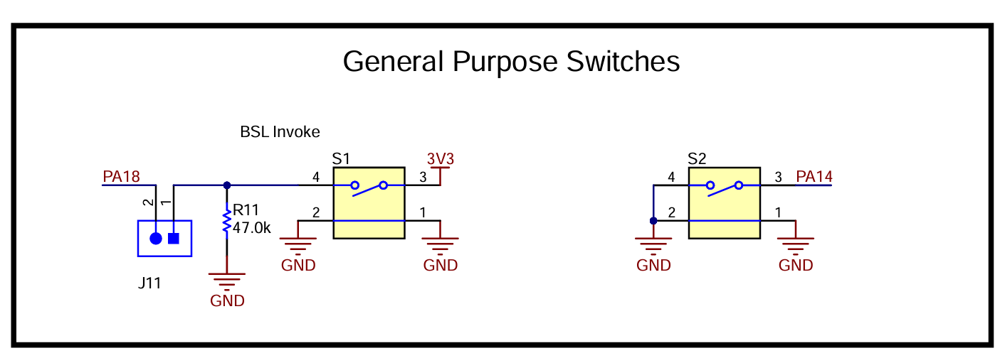

这个页面用来测试 Yihui Xie's Method 的数学公式渲染功能。如果这个页面的公式能正常显示，说明你的网站配置（注入的 JavaScript 脚本）是正确的。

---

### 1. 行内公式 (Inline Formulas)

这是最基本的行内公式：`$a^2 + b^2 = c^2$`。

---

### 2. 块级公式 (Display/Block Formulas)

这是一个独立的块级公式：
$$
\sum_{i=1}^{n} i = \frac{n(n+1)}{2}
$$

---

### 3. 上下标 (Superscripts and Subscripts)

- **上标**: `$x^{2y}$`
- **下标**: `$a_{ij}$`
- **混合**: `$X_{i,j}^{n+1}$`

---

### 4. 分数 (Fractions)

- **简单分数**: `$\frac{1}{2}$`
- **复杂分数**: `$\frac{\alpha + \beta}{\gamma - \delta}$`

---

### 5. 希腊字母 (Greek Letters)

- **小写**: `$\alpha, \beta, \gamma, \omega$`
- **大写**: `$\Gamma, \Delta, \Omega$`

---

### 6. 矢量 (Vectors)

- **箭头形式**: `$\vec{A}$`
- **粗体形式**: `$\mathbf{A}$`

---

### 7. 微积分符号 (Calculus)

- **求和**: `$\sum_{k=1}^{\infty} \frac{1}{k^2} = \frac{\pi^2}{6}$`
- **积分**: `$\int_{a}^{b} f(x) \,dx$`
- **极限**: `$\lim_{x \to 0} \frac{\sin x}{x} = 1$`

---

### 8. 括号与定界符 (Parentheses and Delimiters)

- **自动大小**: `$\left( \frac{A}{B} \right)$`
- **不同括号**: `$\left[ \sum_{i=0}^{n} i^2 \right]$`

---

### 9. 矩阵 (Matrices)

这是一个行内的混合矢量/矩阵公式：
`$\vec{C} \cdot (\vec{A} \times \vec{B}) = \begin{vmatrix} C_{u1} & C_{u2} & C_{u3} \\ A_{u1} & A_{u2} & A_{u3} \\ B_{u1} & B_{u2} & B_{u3} \end{vmatrix}$`

---

### 10. 特殊函数与装饰

- **开方**: `$\sqrt{x^2+y^2}$`
- **boxed**: `$\boxed{E=mc^2}$`
- **上划线**: `$\bar{A}$`

